# 初始 FastAPI

&emsp;&emsp;在 Python 中，早期并发模式的实现主要依赖多线程或者多进程，但是因为历史遗留的 GIL（全局解释器锁）问题，Python 多线程未能把多核的优势发挥得淋漓尽致。在 Python 中使用的多线程，其实就是一种 "伪多线程"，因为它只是实现了表面一致并发，本质上还是通过线程调度来让出 GIL，从而达到并发的效果，这还是一种 "单核单线程" 模式。对于多核 CPU，Python 多线程无法分布到多核 CPU 上执行，所以说在某种程度上没有把 CPU 使用率 "压榨" 到极致。

&emsp;&emsp;因此，Python 引入了 协程 的概念，随着 Python 版本的不断迭代更新，随之而生的 `asyncio`​ 异步应用也日趋成熟。FastAPI 之所以备受喜爱，就是因为对异步特性的支持让它有别于如 Flask 和 Django 等其他同步框架。

## FastAPI 框架概述

&emsp;&emsp;FastAPI 框架不仅具有 Flask 和 Django 的 Web 核心功能，还兼具同步和异步这两种模式的运行。不仅如此，它对于一些插件的自定义扩展相当简单，插件间可以相互独立。用户可以根据业务需求来定义不同的组件或插件来扩展并集成到 FastAPI 中。

&emsp;&emsp;FastAPI 是为了构建快速的 API 而生，它的主要特性有：

* 是一个支持 ASGI（Asynchronous Server Gateway Interface）协议的 Web 应用框架，也就说它同时兼容 ASGI 和 WSGI 的应用
* 天然支持异步协程处理，能快速处理更多的 HTTP 请求
* 使用了 Pydantic 类型提示的特性，可以更加高效、快速地进行接口数据类型校验及模型响应等处理
* 基于 Pydantic 模型，可以自动对响应数据进行格式化和序列化处理
* 提供依赖注入系统的实现，可以让用户更高效地进行代码复用
* 支持 WebSocket、GraphQL 等
* 支持异步后台任务，可以方便地对耗时的任务进行异步处理
* 支持服务进程启动和关闭事件回调监听，可以方便地进行一些插件的扩展初始化
* 支持跨域请求 CORS、压缩 Gzip请求、静态文件、流式响应
* 支持自定义相关中间件来处理请求及响应
* 支持开箱即用 OpenAPI（以前被称为 Swagger）和 JSON Schema，可以自动生成交互式文档
* 使用 uvloop 模块，让原生标准的 asyncio 内置的事件循环更快

><font color=orange>**ASGI 介绍**</font>
>&emsp;&emsp;ASGI 是异步服务网关接口，和 WSGI 一样，都是为 Python 语言定义的 Web 服务器和 Web 应用程序或框架之间的一种简单而通用的接口。但是 ASGI 是 WSGI 的一种扩展的实现，并且提供异步特性和 WebSocket 等的支持。同时 ASGI 也是兼容 WSGI 的，在某种程度上可以理解为 ASGI 是 WSGI 的超集，所以 ASGI 可以支持同步和异步同时运行，内部可以直接通过一个转换装饰器进行相互切换。

&emsp;&emsp;从快速特性来说，基于异步协程方式的 Web 框架目前是多数开发者寻求的一个关键点，在多核 CPU 下如何更加高效地提供 CPU 使用效率也是当下众多异步 Web 框架的关注点，而 FastAPI 融合原生 asyncio 异步协程的特性刚好迎合了这个契机。

&emsp;&emsp;FastAPI 基于 Starlette 和 Pydantic 做了很多封装，简化了一些编码工作（如相关的参数类型提示、参数校验等），为开发者提供了很多便利。另外，FastAPI 还配备了 OpenAPI 规范（OAS），它自动生成了 OpenAPI 模式。

><font color=orange>**OpenAPI 规范（OAS）**</font>
>&emsp;&emsp;OpenAPI 规范（OAS）是一个定义标准的与具体编程语言无关的 RESTful API 的规范。

## 异步编程基础

&emsp;&emsp;由于最新的 HTTP 支持异步长连接，而传统的 WSGI 应用支持单次同步调用，即仅在接收一个请求后返回响应，从而无法支持 HTTP 长轮询或 WebSocket 连接。在 Python 3.5 增加了 `async/await`​ 特性之后，基于 asyncio 异步协程的应用编程变得更加方便。ASGI 协议规范就是用于 asyncio 框架中底层服务器/应用程序的接口。

<font color=orachid>**（一）并发编程机制**</font>

&emsp;&emsp;通常，计算机的任务主要分为：计算密集型任务和 IO 密集型任务（如输入/输入阻塞、磁盘 IO、网络请求 IO），程序处理并发问题的常见方案是多线程和多进程。在同步 IO 编程中，由于 CPU 处理任务计算的速度远高于内存执行任务的速度，所以会遇到 IO 阻塞引发的执行效率低的问题。即当业务逻辑执行的是一个 IO 密集型任务时，由于 CPU 遇到同步的 IO 任务，因此当前处理 IO 任务的线程会被挂起，其他需要 CPU 执行的代码则处于等待执行的状态，此时需要等待同步的 IO 任务执行完成后，CPU 才可以继续执行后续的任务，这就造成了 CPU 使用效率低的问题。

&emsp;&emsp;引入多线程和多进程方式在某种程度上可以实现多任务并发执行，线程相互之间独立执行，互不影响。对于 IO 型任务，通常通过多线程调度来实现表面上的并发；对于计算密集型任务，则使用多进程来实现并发。

><font color=orange>**注意：**</font>其实，无论是多线程还是多进程或者协程都无法实现真正的并行。

&emsp;&emsp;虽然引入多线程和多进程方式在某种程度上可以实现多任务并发执行，但是也相应地存在一定的缺点，特别是在 Python 中：

* Python 多进程并发缺点
  * 进程的创建和销毁代价非常高
  * 需要开辟更多的虚拟空间
  * 多进程之间上下文的切换时间长
  * 需要考虑多进程之间的同步问题
* Python 多线程并发缺点
  * 每一个线程都包含一个内核调用栈（Kenerl Stack）和 CPU 寄存器上下文表（该表列出 CPU 中的寄存器以及它们的名称、大小、功能和对应的指令等信息）
  * 共享同一个进程空间会涉及同步问题
  * 线程之间上下文的切换需要消耗时间
  * 受限于 GIL，在 Python 进程中只允许一个线程处于运行状态，多线程无法充分利用 CPU 多核
  * 受 OS 调度管制，线程是抢占式多任务并发的（需要关心同步问题）

&emsp;&emsp;相对于同步 IO 而生的异步 IO，要解决的问题是在处理任务时，若遇到 IO 阻塞，则会变成非 IO 阻塞，也就是说遇到 IO 任务时，CPU 不会等待 IO 任务执行完成，而是直接继续后续任务的执行。从某种程度上，提高了 CPU 的使用率。异步 IO 本身是一种和语言无关的并发编程设计范例，它是基于一种单进程、单线程的机制来设计的。异步 IO 的本质是基于事件触发机制来实现异步回调。在 IO 处理上主要采用了 IO 复用机制来实现非阻塞操作。

 <font color=orachid>**（二）并发和并行**</font>

&emsp;&emsp;并发通常是指在单核 CPU 情况下可以同时运行多个应用程序，然而本质上，操作系统（单核 CPU 的情况）在处理任务时任一时刻点都只有一个程序在 CPU 中运行，之所以能够看到多个应用程序（多任务）同时执行，是因为操作系统给每个应用程序（任务）都分配了一定的时间片，每个程序执行完成分配的时间片后，操作系统会通过调度切换到下一个任务中去执行，而这个时间片相对于人类来说短到无法被感知，所以就会感觉系统在并发处理相关任务。

&emsp;&emsp;并行是相对于单核 CPU 而言的，如果计算机是单核的 CPU，那么任务的执行就不会存在并行的说法。如果计算机使用的是多核 CPU，那么任务就可以分配到不同的 CPU 上执行，在这种情况下，在多个 CPU 上执行的任务互不干扰，这是真正的多任务同时执行，也是一种真正的并行表现。

&emsp;&emsp;综上所述：

* 并行包含了并发，并发是并行的一种特殊表现
* 并发通常是对单核 CPU 任务执行过程的一种组织结构描述的说明，并行是对程序执行过程中一种状态的描述，其主要目的是充分利用多核 CPU 加速任务执行
* 由于一个系统运行的任务数量远超过 CPU 数量，所以在现在的操作系统中没有绝对的真正并行的任务

 <font color=orachid>**（三）同步和异步**</font>

&emsp;&emsp;同步是在强调多个任务执行的一个完整过程，其中的某个任务在执行过程中不允许被中断，多个任务的执行必须是协调一致且有序的，某个任务在执行过程中如遇到阻塞，则其他任务需要等待。相对于同步来说，异步强调多个任务可以分开执行，彼此之间互不影响，某个任务遇到阻塞，其他任务不需要等待，但是任务执行的结果依然是保持一致的。如果一个任务被分为多个任务单元，那么这些任务单元都是可以分开执行的，多任务单元的执行可以是无序的。

&emsp;&emsp;综上所述：

* 同步和异步是程序 "获得关注消息" 通知的机制，是与消息的通知机制有关的一种描述
* 同步和异步是一种线程处理方式或手段，它们的区别是遇到 IO 请求是否等待
  * 同步：代码调用 IO 操作时，必须等待 IO 操作完成才返回
  * 异步：代码调用 IO 操作时，不必等待 IO 操作完成就可返回
  * 异步操作是可以被阻塞的，只不过它不是在处理消息时被阻塞，而是在等待消息通知时被阻塞

<font color=orachid>**（四）阻塞和非阻塞**</font>

&emsp;&emsp;阻塞和非阻塞都是针对 CPU 对线程的调度来说的。当调用的函数（任务）遇到 IO 时会进行线程挂起的操作，此时就需要等待返回 IO 执行结果，在等待的过程中无法处理其他任务，称此时的任务执行操作处于阻塞状态。当调用的函数遇到 IO 时，若不会进行线程挂起的操作，则不需要等待返回 IO 执行结果，此时可以去做其他任务，称此时的任务执行操作处于非阻塞状态。

&emsp;&emsp;综上所述：

* 阻塞和非阻塞描述的是程序的运行状态，表示的是程序在等待消息（无所谓同步或异步）时的状态
* 阻塞和非阻塞是线程的状态，线程要么处于阻塞状态，要么处于非阻塞状态，两者并不冲突。它们的主要区别是在数据没准备好的情况下调用函数时当前线程是否立即返回
  * 阻塞：调用函数时当前线程被挂起
  * 非阻塞：调用函数时当前线程不会被挂起，而是立即返回

## asyncio 协程概念

&emsp;&emsp;操作系统针对进程和线程进行操作的过程中，需要消耗的资源比较多。早期的 Web 框架都是基于多线程模式来进行并发支持的，在这种情况下进行多用户请求并发处理时，需要为每一个请求创建新的线程并进行对应的处理，这就需要消耗更多资源。因为系统硬件资源始终有限，所以不可能无限量创建线程或进程来处理更多的并发任务。因此只能另辟蹊径，考虑在单一进程或线程中是否可以同时处理更多的请求，所以一些 IO 多路复用模型应运而生。

&emsp;&emsp;虽然 IO 多路复用模型可以让任务执行时不再阻塞在某个连接上，而是当任务处理有数据到达时（阻塞结束）才触发回调并响应请求，但是这种机制依赖于 "回调"。这种回调机制使用起来非常复杂，且容易出现链路式回调，编码实现也不够直观，所以后来这种链路式回调机制就慢慢被新的协程机制所替代。

&emsp;&emsp;asyncio 是 Python 官方提供的用于构建协程的并发应用库，是 FastAPI 实现异步特性的重要组成部分。基于 asyncio，可以在单线程模式下处理更多的并发任务，它是一个异步 IO 框架，而异步 IO 其实是基于事件触发机制来实现异步回调的，在 IO 处理上主要采用了 IO 复用机制来实现非阻塞操作。asyncio 的核心是 Eventloop（事件循环），它以 Eventloop 为核心来实现协程函数结果的回调。它提供了相关协程任务的注册、取消、执行及回调等方法来实现并发。在 Eventloop 中执行的任务其实就是人们定义的各种协程对象。通常，每一个协程对象内部都会包含自身需要等待处理的 IO 任务。当 Eventloop 处理协程任务时，遇到需要等待处理的 IO 任务，会自动执行权限切换，自动去执行下一个协程任务。当上一个 IO 任务完成时，会在下一次事件循环返回最终等待结果的状态。这种多任务交替轮换的协同处理机制可以有效提高 CPU 的使用率，进而提升并发能力。

&emsp;&emsp;定义一个协程函数（Coroutine）的核心是 `async`​ 关键词，通过该关键词可以把一个普通的函数转换为一个协程函数，转变后协程函数的运行就不像普通函数那样了（需要依赖 Eventloop）。当对协程函数执行 `协程函数()`​ 时，`协程函数()`​ 表示一个协程对象。此时执行 `await 协程函数()`​ 表示创建了对应的 Task 并放入循环事件（也可以通过 `asyncio.create_task()`​ 来创建 Task），该 Task 就是协程函数要执行的逻辑。

## asyncio 协程简单应用

&emsp;&emsp;案例说明：这里循环请求 50 次，首先使用单线程、同步代码的方式请求处理：

```python
import requests
import time

def take_up_time(func):
    def wrapper(*args, **kwargs):
        print("开始执行")
        now = time.time()
        result = func(*args, **kwargs)
        using = (time.time() - now) * 1000
        print(f"执行结束，耗时 {using} ms")
        return result
    return wrapper


def request_sync(url):
    response = requests.get(url)
    return response


@take_up_time
def func():
    for i in range(50):
        request_sync("http://192.168.1.22/photo/index.php")


if __name__ == '__main__':
    func()
```

&emsp;&emsp;执行结果如下：

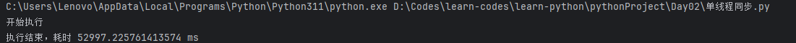

&emsp;&emsp;接下来使用异步的 HTTP 请求：

```python
import time
import aiohttp
import asyncio


def take_up_time(func):
    def wrapper(*args, **kwargs):
        print("开始执行")
        now = time.time()
        result = func(*args, **kwargs)
        using = (time.time() - now) * 1000
        print(f"执行结束，耗时 {using} ms")
        return result
    return wrapper


async def request_async():
    async with aiohttp.ClientSession() as session:
        async with session.get("http://192.168.1.22/photo/index.php") as resp:
            pass


@take_up_time
def run():
    tasks = [asyncio.ensure_future(request_async()) for x in range(50)]
    loop = asyncio.get_event_loop()
    tasks = asyncio.gather(*tasks)
    loop.run_until_complete(tasks)


if __name__ == '__main__':
    run()
```

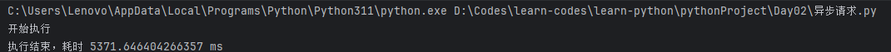

# 初试 FastAPI

## 搭建开发环境

&emsp;&emsp;安装 Python 语言包和 PyCharm，接下来就需要选择并配置项目解析器了。由于本地环境可能安装了很多版本的 Python，所以需要为开发的项目分配指定的解析器，这样有利于在多项目下实现解析器的环境隔离，避免项目之间产生冲突：

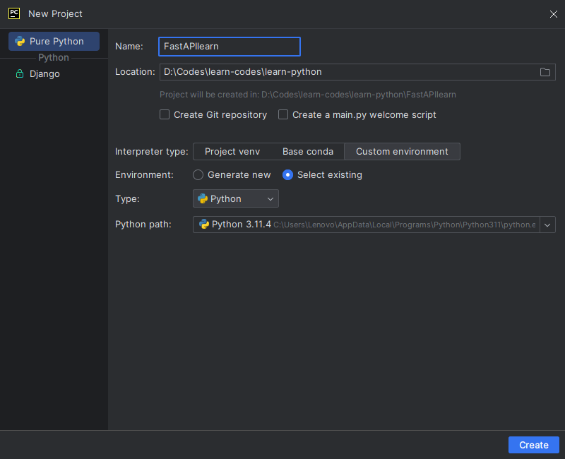

&emsp;&emsp;新建项目完成后，进入编辑代码界面，在 IDE 底部选择 Terminal 选项，接着输入 `python` 来验证环境：

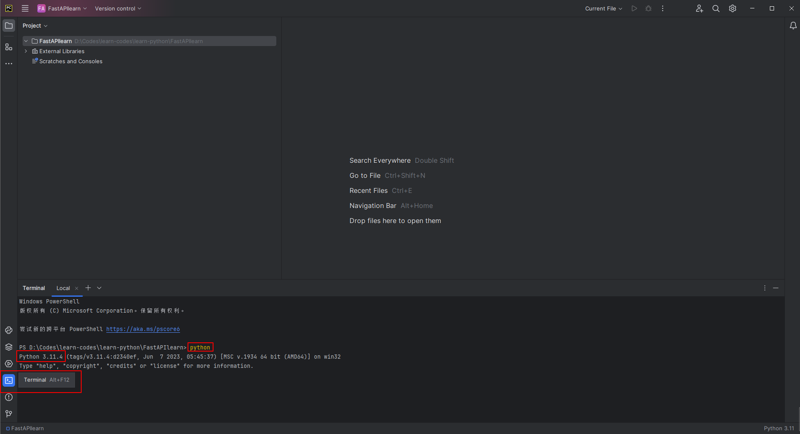

&emsp;&emsp;下面新建一个 `main.py`​ 文件，通过完成一段 "你好，FastAPI 框架！" 程序来验证环境：

```python
print("你好，FastAPI 框架！")
```

&emsp;&emsp;在 `main.py` 编辑器的界面的空白处右击，在出现的右键菜单中选择 "Run main" 命令，就可以在结果界面看到输出的结果：

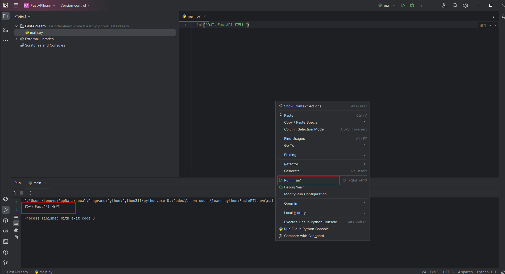

## PIP 安装源设置

&emsp;&emsp;在实际开发过程中，可能需要用到很多第三方的依赖包，这些依赖包默认是从 `https://pypi.org/simple`​ 获取，由于该地址的服务器不在国内，所以在获取的过程中可能因为网络问题而导致出现安装失败或者超时等情况。这里需要进行 PIP 安装源设置，指定使用国内的安装源：

* 清华：https://pypi.tuna.tsinghua.edu.cn/simple
* 阿里云：http://mirrors.aliyun.com/pypi/simple/
* 豆瓣：http://pypi.douban.com/simple
* 中国科学科技大学：https://pypi.mirrors.ustc.edu.cn/simple/
* 山东理工大学：http://pypi.sdutlinux.org/

&emsp;&emsp;配置安装源有两种方式：

<font color=orachid>**（一）使用 IDE 命令行 + PIP 的方式，通过切换安装源来安装依赖库**</font>

&emsp;&emsp;如果只是临时使用，则完全可以采用更换安装源的方式来安装依赖库，打开 IDE 中的 Terminal 选项，然后输入下面命令：

```shell
pip install -i https://pypi.tuna.tsinghua.edu.cn/simple requests
```

&emsp;&emsp;如果后续想永久使用，则可以指定安装源来安装依赖库。此时应先设置全局安装源，然后进行安装操作。打开 IDE 中的 Terminal 选项，然后输入以下命令：

```shell
pip config set global.index-url https://pypi.tuna.tsinghua.edu.cn/simple
```

<font color=orachid>**（二）使用 IDE 安装依赖库时切换安装源**</font>

&emsp;&emsp;首先在 IDE 工具菜单栏中依次选择 `File -> Settings -> Project:FastAPIlearn -> Python Interpreter`​：

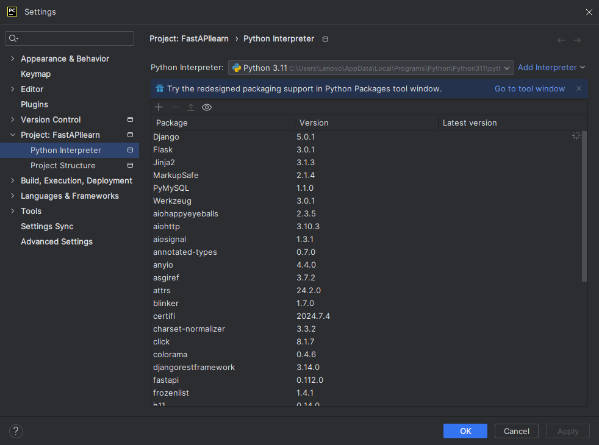

&emsp;&emsp;然后点击上图中的 `+`​，在弹出的界面中单击 `Manage Repositories`​ 按钮：

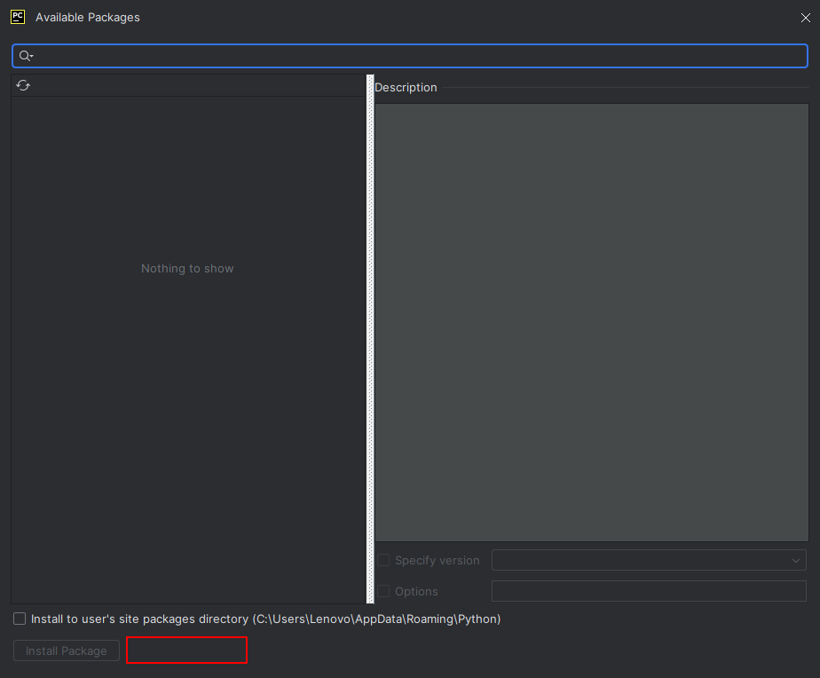

&emsp;&emsp;然后在弹出的窗口中点击 `+`​ 可以添加安装源，单击 `-`​ 可以删除安装源。

&emsp;&emsp;通常使用 `pip`​ 来安装依赖包，因此必须要学习 `pip`​ 的常用命令，可以使用 `pip help`​ 命令来查看：

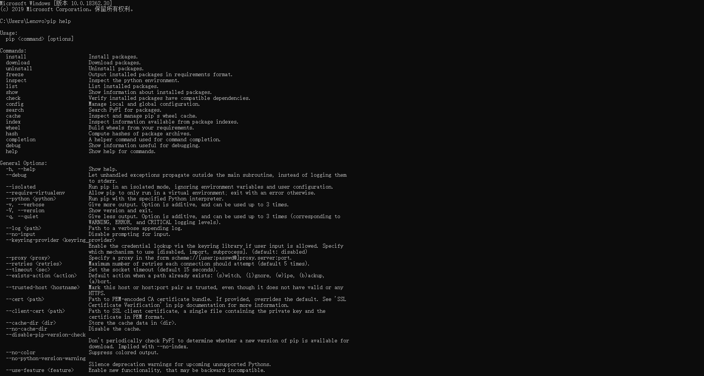

## 新建 FastAPI 项目

&emsp;&emsp;创建一个新的 FastAPI 项目并下载依赖库，FastAPI 常用的依赖库如下：

* email.validator：主要用于右键格式校验处理
* requests：使用单例测试 TestClient 或请求第三方接口时需要使用该依赖库
* aiofiles：主要用于异步处理文件读写操作
* jinja2：主要供用户渲染静态文件模板时使用，当项目要使用后端渲染模板时安装该依赖库
* Python-multipart：当需要获取 Form 表单数据时，只有通过这个库才可以提取表单的数据并进行解析
* itsdangerous：用于在 SessionMiddleware 中间件中生成 Session 临时身份令牌
* graphene：需要 GraphQLApp 支持时安装这个依赖库
* orjson：主要用于 JSON 序列化和反序列化，如使用 FastAPI 提供的 ORJSONR-esponse 响应体处理时，则需要安装这个依赖库
* ujson：主要用于 JSON 序列化和反序列化，如需要使用 FastAPI 提供的 UJSONResponse 响应体时就需要安装该依赖库
* uvicorn：主要用于运行和加载服务应用程序 Web 服务

&emsp;&emsp;可以使用单独安装依赖包的方式（这里以安装 uvicorn 依赖包为例）：

```shell
pip install fastapi
pip install "uvicorn[standard]"
```

&emsp;&emsp;如果仅安装某个或某几个依赖包，那么在使用过程中可能会因为缺失其他依赖包而产生异常，这种问题处理起来比较麻烦，为了避免这样的现象，还可以进行全部安装：

```shell
pip install "fastapi[all]"
```

&emsp;&emsp;接下来创建项目的目录：

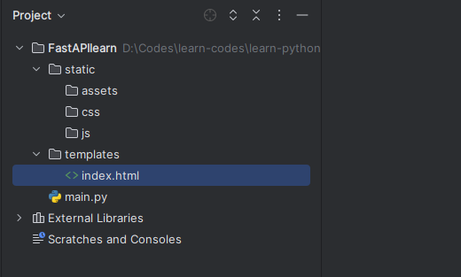

* static：存放 HTML 模板的静态资源文件
	* assets：存放 HTML 模板中使用的图片资源
	* css：存放 HTML 模板中使用的 CSS 样式文件资源
	* js：存放 HTML 模板中使用的 JS 相关的脚本文件资源
* templates：存放具体的 HTML 模板文件，其中 index.html 是渲染的具体的 HTML 文件
* main.py：应用程序启动入口文件

&emsp;&emsp;`main.py` 文件是应用程序服务器启动入口文件，所以需要在里面实例化一个 FastAPI 的 app 实例对象：

```python
from fastapi import FastAPI
from typing import Optional

app = FastAPI(title="学习 FastAPI 框架文档", description="以下是关于 FastAPI 框架文档的介绍和描述", version="0.0.1")
```

&emsp;&emsp;路由注册与 Flask 框架所提供的路由注册的本质是一样的，所谓路由注册就是提供一个对应的 URL 地址来关联或绑定定义的函数。在常见的 Web 框架中，通常使用装饰器的形式对需要绑定的函数进行映射绑定，这个过程就是路由注册，也可以理解为创建视图的过程。下面的代码是基于 app 实例对象提供的装饰器实现了路由注册功能：

```python
from fastapi import FastAPI
from typing import Optional

app = FastAPI(title="学习 FastAPI 框架文档", description="以下是关于 FastAPI 框架文档的介绍和描述", version="0.0.1")


# 使用 app 示例对象来装饰实现路由注册
@app.get('/', tags=['app 实例对象注册接口示例'])
def app_hello():
    return {"Hello": "app api"}
```

&emsp;&emsp;上面定义了 `app_hello`​ 函数，然后通过 `@app.get`​ 这个装饰器进行装饰，从而创建一个 API 端点路由请求。该装饰器表示当前 API 只能使用 GET 请求方式进行请求处理。其中：

* ​`'/'`​：表示请求访问 URL 路径地址
* ​`tags=['app 实例对象注册接口示例']`​：该参数表示这个 API 归属于 `app 实例对象注册接口示例`​ 这个分组标签下，它的主要作用是进行 API 分组归类，并显示在可视化交互 API 文档中

&emsp;&emsp;当通过浏览器进行访问，并使用 GET 方式请求 `\`​ 这个 URL 时，就触发 `app_hello`​ 函数的调用，并返回函数处理结果。

><font color=orange>注意：</font>被 `@app.get`​ 装饰的函数可以有两种，一种是使用 `def`​ 定义的同步函数，一种是使用 `async def`​ 定义的协程函数。同步函数会运行于外部的线程池中，协程函数会运行于异步事件循环中。简单地说，同步函数是基于多线程并发模式进行相关处理的，而协程函数是基于单线程内的异步并发模式进行相关处理的。

&emsp;&emsp;对于一些应用来说，可能还需要使用后端渲染模板来展示前端页面，后端渲染模板有别于前后端分离开发模式，后端渲染模板会整合 HTML 到 FastAPI 服务中。下面创建一个 `/templates/index.html`​ 文件：

```html
<!DOCTYPE html>
<html lang="en">
<head>
    <meta charset="UTF-8">
    <title>您好，欢迎学习 FastAPI 框架</title>
</head>
<body>
<div class="landing-content">
    <h1>
        您好，欢迎学习 FastAPI 框架
    </h1>
</div>
</body>
</html>
```

&emsp;&emsp;然后在 `main.py`​ 中添加 API 端点路由：

```python
import pathlib
from fastapi import Request
from fastapi.responses import HTMLResponse
from fastapi.templating import Jinja2Templates
from fastapi.staticfiles import StaticFiles
from fastapi import FastAPI

templates = Jinja2Templates(directory=f"{pathlib.Path.cwd()}/templates/")
staticfiles = StaticFiles(directory=f"{pathlib.Path.cwd()}/static/")

app = FastAPI(title="学习 FastAPI 框架文档", description="以下是关于 FastAPI 框架文档的介绍和描述", version="0.0.1")
app.mount("/static", staticfiles, name='static')


# 使用 app 示例对象来装饰实现路由注册
@app.get('/', tags=['app 实例对象注册接口示例'])
def app_hello():
    return {"Hello": "app api"}


@app.get('/index', response_class=HTMLResponse)
async def get_response(request: Request):
    return templates.TemplateResponse("index.html", {"request": request})
```

&emsp;&emsp;在本地开发中，通常直接使用 `uvicorn`​ 进行服务启动，若是在生产环境中，则需要借助 gunicorn 进行部署。使用 uvicorn 启动服务有两种方式：

<font color=orachid>**（一）使用命令行方式启动**</font>

&emsp;&emsp;打开 Terminal 会话窗口并切换到项目目录下，然后执行：

```shell
uvicorn main:app -reload
```

&emsp;&emsp;上面的命令主要是通过命令行调用 `uvicorn`​ 库并传入指定的参数 `main:app --reload`​ 来启动 `main`​ 模块的 app 对象。`--reload`​ 命令主要用于热启动，这个参数的主要作用是在编码阶段，若需要对当前代码进行改动，那么代码改动完成之后会自动重启服务的进程，使修改及时生效。

><font color=orange>注意：</font>`--reload`​ 仅用于项目编码调试阶段，正式部署到生产环境后应该尽量避免使用该参数。

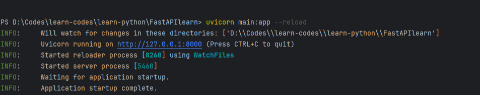

&emsp;&emsp;从图中可以看出，服务已经运行在地址为 `127.0.0.1`​ 的主机上，使用的端口号是 `8000`​，使用的 ASGI 服务器容器是 `uvicorn`​。如果希望对外允许访问服务，那么可以将 `--host`​ 参数设置为 `0.0.0.0`​。如果希望自定义监听端口，那么可以添加 `--port`​ 参数。此时访问图中地址就看到页面内容：

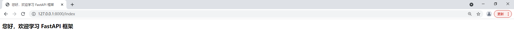

&emsp;&emsp;如果想通过域名来访问 API，则可以配置本地的 Host 进行对应的域名和 IP 地址映射（SwitchHosts）。当然，这种方式仅限于本地测试，在真实的线上生成环境中进行域名映射需要指向公网的 IP 地址。

><font color=orange>关于 IP 地址的介绍</font>
>
> * 公网 IP 地址：互联网上的所有人都可以通过这个 IP 地址访问到服务，公网 IP 地址一般需要向服务提供商申请获得（如：在阿里云购买云服务器时通常会配备一个公网 IP 地址）
> * 内网 IP 地址：主要是指个人计算机内的局域网地址，如果服务是通过内网 IP 启动的，则通常只能使用本机上或所属局域网内其他内网的 IP 地址进行访问，外网人员是无法通过内网 IP 地址进行访问的
> * 0.0.0.0：代表本机上所有的 IP 地址，也包括回环地址（127.0.0.1），如果本机存在多网卡的情况，则 0.0.0.0 是所有网卡 IP 的集合。如果使用 host = 0.0.0.0 绑定的 IP 地址，则表示服务进程会接收来自所有网卡上的 IP 地址的请求。此时如果本机的防火墙关闭或开启相关允许机制，则当前局域网内的其他人也可以通过访问本机的 IP 地址的形式请求到接口服务

<font color=orachid>**（二）导入 uvicorn 模块，使用代码方式启动**</font>

&emsp;&emsp;在 `main.py`​ 中导入 `uvicorn`​ 模块，然后使用 `uvicorn.run()`​ 函数来启动服务：

```python
import pathlib
from fastapi import Request
from fastapi.responses import HTMLResponse
from fastapi.templating import Jinja2Templates
from fastapi.staticfiles import StaticFiles
from fastapi import FastAPI

templates = Jinja2Templates(directory=f"{pathlib.Path.cwd()}/templates/")
staticfiles = StaticFiles(directory=f"{pathlib.Path.cwd()}/static/")

app = FastAPI(title="学习 FastAPI 框架文档", description="以下是关于 FastAPI 框架文档的介绍和描述", version="0.0.1")
app.mount("/static", staticfiles, name='static')


# 使用 app 示例对象来装饰实现路由注册
@app.get('/', tags=['app 实例对象注册接口示例'])
def app_hello():
    return {"Hello": "app api"}


@app.get('/index', response_class=HTMLResponse)
async def get_response(request: Request):
    return templates.TemplateResponse("index.html", {"request": request})


if __name__ == '__main__':
    import uvicorn
    uvicorn.run(app='main:app', host='0.0.0.0', port=8888, reload=True)
```

&emsp;&emsp;上面 app 的参数默认有 3 中类型：

* 可以是 ASGIApplication 的一个实例对象，上面的代码中，FastAPI 实例化后的 app 对象就是一个 ASGIApplication 实例对象
* 可以是一个可调用的对象
* 可以是一个字符串，但是这里的字符串类型必须是使用代码方式启动服务时所用的 `模块名称 + app 对象名`​，只有这样才可以找到模块下对应的 ASGIApplication 实例的 app 对象

><font color=orange>注意：</font>开启热启动或者使用多线程的方式启动服务，则应使用传入字符串的方式。

&emsp;&emsp;在 `main.py`​ 文件中，可以自动获取当前模块的名称 `main`​，这样不管当前模块名称怎么变化，都可以自动进行识别：

```python
if __name__ == '__main__':
    import uvicorn
    import os
    app_name = os.path.basename(__file__).replace(".py", "")
    print(app_name)
    uvicorn.run(app=f'{app_name}:app', host='0.0.0.0', port=8888, reload=True)
```

&emsp;&emsp;下面是关于 `uvicorn`​ 的常用参数说明：

|          参数          | 说明                                                                                                                                        |
| :------------------: | :---------------------------------------------------------------------------------------------------------------------------------------- |
|         app          | 表示当前应用的 app，也就是 FastAPI 的实例对象                                                                                                             |
|         host         | 表示即将绑定本机的哪一个套接字地址，默认是 127.0.0.1                                                                                                           |
|         port         | 表示服务启动后绑定的端口号，默认是 8000（值范围 0 ~ 65535）                                                                                                     |
|         uds          | 表示使用 UNIX 方式绑定套接字，如 --uds/tmp/unicorn.sock，通常用于单机内 Nginx 反向代理                                                                             |
|          fd          | 表示使用对应的文件描述符绑定到套接字，通常用于单机上的同一进程内                                                                                                          |
|         loop         | 表示当前异步循环事件使用哪一种模式，默认是 auto                                                                                                                |
|         http         | 表示 HTTP 实现使用哪一种模式，默认为 auto                                                                                                                |
|          ws          | 表示 WebSocket 协议实现使用哪一种模式，默认为 auto                                                                                                         |
|     ws-max-size      | 表示 WebSocket 传输消息最大的字节数                                                                                                                   |
|       lifespan       | 表示生命周期的一种实现机制，它基于异步上下文管理器处理程序代替单独的启动和关闭处理程序                                                                                               |
|       env-file       | 表示配置当前应用程序使用的环境配置文件                                                                                                                       |
|      log-config      | 表示当前应用程序日志配置文件，它支持 ini、json、yaml 等几种格式的文件                                                                                                 |
|      access-log      | 表示当前应用 access log 日志的开关，默认为 True                                                                                                          |
|      log-level       | 表示当前应用记录日志的等级                                                                                                                             |
|      interface       | 表示当前使用哪一种接口类型作为应用程序接口，有 ASGI3、ASGI2 或 WSGI 可选，默认是 auto                                                                                    |
|        reload        | 表示是否启动热重启机制，值为 True 表示启动，主要在本地开发时代码修改后出发重新加载，服务重新启动。需注意，在生产环境中请勿启动。另外，当值为 True 且应用使用了多进程或多线程的工作模式时，多进程或多线程无法很好地工作，以至于重新加载代码可能会导致一些不可预测的行为 |
|      root-path       | 表示设置当前 ASGI 应用程序的 URL 地址 "根路径"                                                                                                            |
|      reload-dir      | 表示指定要监视 Python 文件更改的目录。默认是监视整个当前目录的修改情况                                                                                                   |
|    reload-include    | 表示指定监听的文件或目录，可以多次使用，默认情况下包括了 .py 的文件监视                                                                                                    |
|    reload-exclude    | 表示指定过滤排除监视的文件或目录，默认情况下排除以下模式：`.*`​、`.py[cod]`​、`.sw.*`​、`~*`​                                                                             |
|     reload-delay     | 表示热重启机制延迟间隔时间                                                                                                                             |
|       workers        | 表示服务启动时的工作进程数，默认值1                                                                                                                        |
|    proxy-headers     | 表示是否启动获取代理请求头信息 `X-Forwarded-Proto`​、`X-Forwarded-For`​、`X-Forwarded-Port`​，默认为 True                                                      |
|  limit-concurrency   | 表示在请求触发 http503 响应之前允许的最大并发连接数或任务数                                                                                                        |
|  limit-max-requests  | 表示在终止进程之前需要服务的最大请求数                                                                                                                       |
|  timeout-keep-alive  | 表示请求保持活动状态的连接超时时间，指定时间没有收到任何请求数据时则关闭，默认值为 5                                                                                               |
|       backlog        | 表示允许等待处理的最大连接数，默认为 2048                                                                                                                   |
|     ssl-keyfile      | 表示启用 HTTPS 时使用的证书的 .key 文件（SSL 秘钥文件），默认值为 None                                                                                            |
|     ssl-certfile     | 表示启用 HTTPS 时使用的证书的 .cer 文件（SSL 秘钥文件），默认值为 None                                                                                            |
| ssl-keyfile-password | 表示启用 HTTPS 时使用的证书（SSL秘钥文件）的密码，默认值为 None                                                                                                   |
|     ssl-version      | 表示启用要使用的 SSL版本号，默认是2                                                                                                                      |
|    ssl-cert-reqs     | 表示是否需要客户端证书，默认值是0                                                                                                                         |
|     ssl-ca-certs     | 表示使用的 CA 证书文件                                                                                                                             |
|     ssl-ciphers      | 表示使用的 CA 证书文件的密码                                                                                                                          |
|       factory        | 表示指定的一个 ASGI 应用程序工厂，当想要启动多个进程或者多个线程来处理请求时，可以提供一个工厂函数来创建多个应用程序实例。                                                                          |

## 查看交互式 API 文档

&emsp;&emsp;FastAPI 框架的优势还表现在服务器启动后可以直接查看自己编写的 API 文档，FastAPI 提供了两种可视化交互 API 文档模式：

* **Swagger UI：** 它是一个流行的开源项目，可以为 API 自动生成交互式文档，允许人们通过用户界面来测试和交互式地调用 API 路由
* **ReDoc：** 这也是一个开源项目，提供了一个响应式的文档查看器，类似于 Swagger UI，ReDoc 可以帮助用户快速地浏览、测试和理解 API 路由的工作方式

&emsp;&emsp;Swagger UI 模式下，服务器启动后，通过浏览器访问 `http://127.0.0.1:8888/docs#`​ 可以查看结果；ReDoc 模式下，服务器启动后，通过浏览器访问 `http://127.0.0.1:8888/redoc`​ 可以查看到结果。