# app 应用配置参数详解

&emsp;&emsp;从 FastAPI 包中导入 FastAPI 类并进行相关的实例化之后，app 对象就是整个服务应用的实例对象。这个 FastAPI 类包含了非常多的参数项，这里的参数项多数起到全局作用，所以在使用过程中需要结合实际情况来进行设置。
## 开启 Debug 模式

&emsp;&emsp;FastAPI 类中内置了一个 Debug（调试）功能，通过它可以实现类似使用 Flask 框架时在网页中看到错误堆栈信息明细的功能，该功能在排查错误时非常有用：

```python
from fastapi import FastAPI
from fastapi.responses import  PlainTextResponse


app = FastAPI(debug=True)


@app.get('/')
def index():
    1988 / 0
    return PlainTextResponse('您好，欢迎学习 FastAPI 框架！')
```

&emsp;&emsp;上面的代码中，实例化 app 对象的时候设置了 `debug`​ 的参数值为 `True`​，然后在接口函数的内部设置了一个 `1988 / 0`​ 的错误，启动服务并使用 `http://127.0.0.1:8000`​ 地址访问，此时页面就会显示出详细的错误堆栈异常信息：

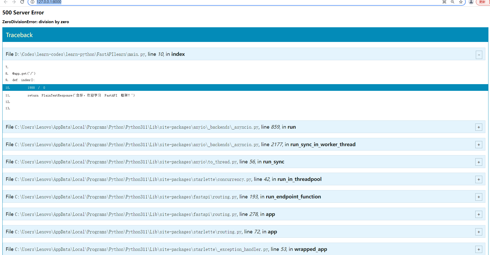

&emsp;&emsp;通过异常信息，用户可以快速定位到错误问题点的具体位置。

><font color=orange>注意：</font>在项目开发调试阶段开启 Debug 模式非常有用，但是在线上生产环境中应该避免开启这个功能。此外，如果定义了全局异常处理，则不建议同时开启 Debug 模式，否则全局异常处理会失效。

## 关于 API 交互文档参数

&emsp;&emsp;FastAPI 框架支持自动生成 API 可视化交互式文档，在调试接口的过程中，常用的是基于 Swagger UI 模式生成文档。下面介绍 API 可视化交互式文档的一些常用参数的配置：

```python
from fastapi import FastAPI


app = FastAPI(
    title="文档的标题",
    description="关于该 API 文档的一些描述信息补充说明",
    version="1.0.0",
    openapi_prefix="",
    swagger_ui_oauth2_redirect_url="/docs/oauth2-redirect",
    swagger_ui_init_oauth=None,
    docs_url="/docs",
    redoc_url="/redoc",
    openapi_url="/openapi/openapi_json.json",
    terms_of_service="https://terms/团队的官网网站/",
    deprecated=True,
    contact={
        "name": "邮件接收者信息",
        "url": "https://xxx.cc",
        "email": "3084545@qq.com"
    },
    license_info= {
        "name": "版权信息说明 License V3.0",
        "url": "https://xxxxxx.com"
    },
    openapi_tags= [
        {
            "name": "接口分组",
            "description": "接口分组信息说明"
        }
    ],
    # 配置服务请求地址相关的参数信息
    servers= [
        {"url": "/", "description": "本地调试环境"},
        {"url": "https://xx.xx.com", "description": "线上测试环境"},
        {"url": "https://xx2.xx2.com", "description": "线上生产环境"},
    ]
)


@app.get('/')
def index():
    return {"index": "index"}
```

&emsp;&emsp;启动服务，通过浏览器访问 `http://127.0.0.1:8000/docs`​ 可以看到结果。

* title：表示整个 API 文档的标题和文档网站标题，默认为 FastAPI
* description：表示该 API 文档描述的补充说明，它支持 Markdown 格式来编写
* version：表示 API 文档版本号信息
* openapi\_prefix：配置访问 openapi_json.json 文件路径的前缀，默认为空字符串
* swagger\_ui\_oauth2\_redirect\_url：配置在 swagger_ui 中，使用 OAuth 2 进行身份认证时的授权 URL 重定向地址
* swagger\_ui\_init\_oauth：自定义 OAuth 认证信息配置，默认为 None
* docs\_url：自定义 swagger_ui 交互式文档访问请求地址，默认为 docs
* redoc\_url：自定义 redoc_ui 交互式文档访问请求地址，默认为 redoc
* openapi\_url：配置访问 openapi_json.json 文件路径
* terms\_of\_service：团队服务条款的 URL，如果提供，则该值必须是一个 URL，该参数为非必要参数
* deprecated：是否全局标注所有的 API 为废弃标识，默认为 None
* contact：配置公开的 API 服务条款 URL 信息，主要字段信息如下：
	* name：联系人/组织的识别名称
	* url：指向联系信息的 URL，必须采用 URL 的格式
	* email：联系人/组织的电子邮件地址，必须采用电子邮件地址的格式
* license\_info：配置公开 API 的许可信息：
	* name：API 的许可证名称
	* url：指向联系信息的 URL，必须采用 URL 的格式
* openapi\_tags：默认的接口分组列表信息，可以定义相关 API 的分组 Tag 名称
* servers：配置请求 API 使用的 host 地址，通过这个配置可以划分多个环境 URL

## 关闭交互式文档访问

&emsp;&emsp;自动生成 API 可视化交互式文档虽然方便，但是在生产环境中开启此文档访问会带来安全隐患。为了解决此类安全问题，通常会使用某种策略机制限制访问（如：启动相关的身份认证、IP 白名单等），如果项目不允许访问 API 文档，那么最直接的方式就是禁用：

```python
app = FastAPI(
    docs_url=None,
    redoc_url=None,
    # 或者直接设置 openapi_url=None
    openapi_url=None
)
```

## 全局 routes 参数说明

&emsp;&emsp;在对 FastAPI 类进行实例化时，有一个预设的 `routes`​ 路由列表参数，它保存了 app 中所有 API 端点的路由信息：

```python
from fastapi import FastAPI, Request
from fastapi.responses import JSONResponse
from fastapi.routing import APIRoute


async def fastapi_index():
    return JSONResponse({"index": "fastapi_index"})


async def fastapi_about():
    return JSONResponse({"about": "fastapi_about"})


routes = [
    APIRoute(path='/fastapi/index', endpoint=fastapi_index, methods=["GET", "POST"]),
    APIRoute(path='/fastapi/about', endpoint=fastapi_about, methods=["GET"])
]


app = FastAPI(routes=routes)

if __name__ == '__main__':
    import uvicorn
    import os
    module_name = os.path.basename(__file__).replace(".py", "")
    uvicorn.run(app=f"{module_name}:app")
```

&emsp;&emsp;上面定义了一个 `routes`​ 列表，里面保存了已经实例化的 APIRoute 对象实例，此时把 `routes`​ 传入 FastAPI 中，就完成了一系列 API 端点路由的注册。

## 全局异常/错误捕获

&emsp;&emsp;`exception_handlers`​ 参数主要用于捕获在执行业务逻辑处理过程中抛出的各种异常：

```python
from fastapi import FastAPI
from starlette.responses import JSONResponse


async def exception_not_found(request, exc):
    return JSONResponse(
{
            "code": exc.status_code,
            "error": "没有定义这个请求地址"
        },
        status_code=exc.status_code
    )


exception_handlers = {
    404: exception_not_found
}

app = FastAPI(exception_handlers=exception_handlers)

if __name__ == '__main__':
    import uvicorn
    import os
    module_name = os.path.basename(__file__).replace(".py", "")
    uvicorn.run(app=f"{module_name}:app")
```

&emsp;&emsp;上面的代码中定义了一个用于捕获响应码为 404 的异常/错误处理器，用户可以自定义实现异常/错误结果的返回：

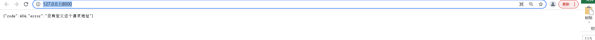

# API 端点路由注册和匹配

&emsp;&emsp;在 FastAPI 框架中，所有的注册路由都会统一保存到 `app.routes`​ 中，如果想要查看注册的所有路由信息，在启动服务器后打印输出 `app.routes`​ 的值即可。

## 路由节点元数据

&emsp;&emsp;元数据是一组用于描述数据的数据，主要用于组织、查找和理解数据（通常指描述数据属性的信息）。在实现 API 端点路由注册的过程中，路由装饰器提供了非常多的参数，下面对 `app.get()`​ 的路由装饰器参数进行说明：

* 与 API 可视化文档显示有关的字段信息
	* tags：设置 API 文档中接口所属组别的标签名，可以将其理解为分组名称，支持设定多个所属分组
	* summary：设置 API 文档中该路由接口的名称，默认值为当前被装饰的函数（又称端点函数或视图函数）的名称
	* description：设置 API 文档中对该路由功能的详细描述
	* response_description：设置 API 文档中对路由响应报文信息结果的描述
	* deprecated：设置 API 文档中是否将该路由标记为废弃接口
	* operation_id：自定义设置路径操作中使用的 OpenAPI 的 operation_id 名称
	* name：设置 API 文档中该路由接口的名称。其功能和 summary 类似，但是 name 主要提供用户反向查询使用。两者同时存在时会优先显示 summary 值
	* openapi_extra：用于自定义或扩展 API 文档中对应的 openapi_extra 字段的功能
	* include_in_schema：表示该路由接口相关信息是否在 API 文档中显示
* 与响应报文处理有关的字段信息说明
	* path：定义路由访问的 URL 地址
	* response_model：定义函数处理结果中返回的 JSON 的模型类，这里会把输出数据转换为对应的 response_model 中声明的数据模型
	* status_code：定义响应报文状态码
	* response_class：设置响应报文使用的 Response 类，默认返回 JSONResponse
	* responses：设定不同响应报文状态码下不同的响应模型
	* response_model_include：设置响应模型的 JSON 信息中包含哪些字段，参数格式为 `集合{字段名, 字段名...}`​
	* response_model_exclude：设定响应模型的 JSON 信息中需要过滤哪些字段
	* response_model_exclude_unset：设定不返回响应模型的 JSON 信息中没有值的字段
	* response_model_exclude_defaults：设定不返回响应模型的 JSON 信息中有默认值的字段
	* response_model_exclude_none：设定不返回响应模型的 JSON 信息中值为 None 的字段
* 其他字段信息
	* dependencies：用于配置当前路径装饰器的依赖项列表

## 路由 URL 匹配

&emsp;&emsp;URL 地址是绑定路径装饰器和对应视图函数（同步函数或协程函数）的纽带，实际上，项目开发中可能会根据各种需求对 URL 的绑定有一定的要求（如多地址绑定同一个视图函数、URL 存在同名时的优先匹配等）。

**（一）多重 URL 地址绑定函数**

&emsp;&emsp;RESTful API 常用的 HTTP 方法主要有如下几个：

* GET：读取数据库信息
* POST：创建新增数据
* PUT：更新已有数据
* PATCH：更新数据，通常仅更新部分数据
* DELETE：删除数据信息

&emsp;&emsp;在项目开发过程中，如果一个视图函数需要同时支持多个请求地址的访问，则需要使用多个装饰器（多个 URL 地址）来装饰绑定视图函数：

```python
# 使用 app 实例对象来装饰实现路由注册
@app.get('/', response_class=JSONResponse)
@app.get('/index', response_class=JSONResponse)
@app.post('/index', response_class=JSONResponse)
@app.get('/app/hello', tags=['app 实例对象注册接口-示例'])
def index():
	return {'Hello': 'app api'}
```

&emsp;&emsp;上面的代码中， `index`​ 视图函数同时被多个装饰器装饰，并且配置了不同的方法、不同的 URL 地址，所以下面几种方式得到的最终结果是一致的：

* 使用 GET 方式请求：`http://127.0.0.1:8000/`​
* 使用 GET 方式请求：`http://127.0.0.1:8000/index`​
* 使用 GET 方式请求：`http://127.0.0.1:8000/app/hello`​
* 使用 POST 方式请求：`http://127.0.0.1:8000/index`

&emsp;&emsp;还有其他实现方式可以关联绑定视图函数：

```python
@app.get('/')
def index():
	return {'Hello': 'fastapi'}

# ....

def index():
	return {'Hello': 'fastapi'}
app.get('/')(index)
```

&emsp;&emsp;上面的两种实现方式是等价的，只是一种使用装饰器形式，另一种使用传参数式。

**（二）同一个 URL 下的动态和静态路由优先级**

&emsp;&emsp;从访问 URL 的可变性角度，可以把路由划分为静态路由（固定请求 URL）和动态路由（可变请求 URL），如果动态和静态路由 URL 同时存在：

```python
from fastapi import FastAPI
from fastapi.responses import JSONResponse


app = FastAPI()


# 动态路由
@app.get('/user/{userid}')
async def login(userid: str):
    return {'Hello': 'dynamic'}


# 静态路由
@app.get('/user/userid')
async def login():
    return {'Hello': 'static'}


if __name__ == '__main__':
    import uvicorn
    import os
    module_name = os.path.basename(__file__).replace(".py", "")
    uvicorn.run(app=f"{module_name}:app")
```

&emsp;&emsp;如上代码中定义了两个路由，它们的 URL 地址几乎一样，区别在于 URL 地址中的 `userid`​ 参数，一个是动态路由中的动态参数，另一个是静态路由中的路径参数的一部分。当启动服务后，如果同时访问 `http://127.0.0.1:8000/user/userid`​，则此时的路由访问原则是谁先注册就优先访问谁，所以显示的是 `{'Hello': 'dynamic'}`​，如果交换顺序后就会显示 `{'Hello': 'static'}`​。如果访问的路径是 `http://127.0.0.1:8000/user/userid111`​，则会匹配访问到动态路由地址。

**（三）一个 URL 配置多个 HTTP 请求方式**

&emsp;&emsp;FastAPI 还提供了 `@app.api_route()`​ 来支持配置路由函数使用不同的 HTTP 请求方式：

```python
from fastapi import FastAPI
from fastapi.responses import JSONResponse


app = FastAPI(routes=None)


@app.api_route(path='/index', methods=['GET', 'POST'])
async def index():
    return {'index': 'index'}


if __name__ == '__main__':
    import uvicorn
    import os
    module_name = os.path.basename(__file__).replace(".py", "")
    uvicorn.run(app=f"{module_name}:app")
```

&emsp;&emsp;另外还可以使用 FastAPI 提供的 `app.add_api_route()`​ 方法来实现类似 `@app.api_route()`​ 的功能，它需要传入一个 endpoint（端点）参数（endpoint 参数可以理解为需要绑定关联的同步函数或协程函数，也就是视图函数）：

```python
from fastapi import FastAPI
from fastapi.responses import JSONResponse


app = FastAPI(routes=None)


@app.api_route(path='/index', methods=['GET', 'POST'])
async def index():
    return {'index': 'index'}


app.add_api_route(path='/index2', endpoint=index, methods=['GET', 'POST'])


if __name__ == '__main__':
    import uvicorn
    import os
    module_name = os.path.basename(__file__).replace(".py", "")
    uvicorn.run(app=f"{module_name}:app")
```

## 基于 APIRouter 实例的路由注册

&emsp;&emsp;API 端点路由注册方式大致可以分为 3 种：

* 基于 app 实例对象提供的装饰器或函数进行注册
* 基于 FastAPI 提供的 APIRouter 类的实例对象提供的装饰器或函数进行注册
* 通过直接实例化 APIRoute 对象且添加的方式进行注册

><font color=orange>注意：</font>这里的 APIRouter 和 APIRoute 是不一样的。APIRouter 主要用于定义路由组，可以理解为一个路由组的根路由；而 APIRoute 则表示具体理由节点对象。APIRouter 可以实现的功能类似 Flask 框架中提供的一种蓝图模式（路由分组）的加载，在大型的项目中，通常需要针对不同业务进行不同 API 的分组，此时如果单纯基于 app 实例对象来实现分组，那么相对来说比较麻烦，所以引入 APIRouter 类来实现路由嵌套和分组。

**（一）路由注册方式**

&emsp;&emsp;基于 APIRouter 的实例对象实现路由注册，本质上是向路由中添加子路由：

```python
from fastapi import FastAPI
from fastapi import APIRouter


app = FastAPI(routes=None)

router_user = APIRouter(prefix='/user', tags=['用户模块'])
router_pay = APIRouter(prefix='/pay', tags=['支付模块'])


@router_user.get('/login')
def user_login():
    return {"ok": "登录成功！"}


@router_pay.get('/order')
def pay_order():
    return {'ok': '订单支付成功！'}


app.include_router(router_pay)
app.include_router(router_user)

if __name__ == '__main__':
    import uvicorn
    import os
    module_name = os.path.basename(__file__).replace(".py", "")
    uvicorn.run(app=f"{module_name}:app")
```

&emsp;&emsp;进行 APIRouter 实例化时的参数说明如下：

* prefix：当前整个全局路由对象请求 URL 地址前缀
* tags：API 分组归属标签

&emsp;&emsp;当完成路由分组和对应视图函数绑定后，还需要使用 `app.include_router()`​ 把 APIRouter 对象添加到 app 路由列表里，该函数的执行过程其实就是把所有子 `router`​ 中的路由都拆解出来并添加到根 `router`​，经过处理后，路由节点就注册完成了。

**（二）给路由配置多个 HTTP 请求方式**

&emsp;&emsp;APIRouter 实例对象提供了 `api_route`​ 的装饰器来支持配置多个 HTTP 请求方法，同时也可以使用 `add_api_route()`​ 传入具体要绑定的端点函数：

```python
from fastapi import FastAPI
from fastapi import APIRouter


app = FastAPI(routes=None)

router_user = APIRouter(prefix='/user', tags=['用户模块'])


@router_user.get('/login')
def user_login():
    return {"ok": "登录成功！"}


@router_user.api_route('/api/login', methods=['GET', 'POST'])
def user_api_login():
    return {'ok': 'api 登录成功！'}


def add_user_api_login():
    return {'ok', 'add_api 登录成功！'}


router_user.add_api_route('/add/api/login', methods=['GET', 'POST'], endpoint=add_user_api_login)
app.include_router(router_user)

if __name__ == '__main__':
    import uvicorn
    import os
    module_name = os.path.basename(__file__).replace(".py", "")
    uvicorn.run(app=f"{module_name}:app")
```

# 同步和异步 API 端点路由

&emsp;&emsp;FastAPI 是一个兼容同步和异步的框架。

**（一）同步 API 端点路由**

&emsp;&emsp;这里的同步路由的主要表现形式为：当使用 URL 地址绑定的关联视图函数是一个同步函数（使用 def 定义的函数）时，就把这个绑定过程理解为一个同步路由注册的过程：

```python
from fastapi import FastAPI
import threading
import time
import asyncio

app = FastAPI(routes=None)


@app.get('/sync')
def sync_function():
    time.sleep(10)
    print(f'当前同步函数执行的线程ID：{threading.current_thread().ident}')
    return {"index": "sync"}

if __name__ == '__main__':
    import uvicorn
    import os
    module_name = os.path.basename(__file__).replace(".py", "")
    uvicorn.run(app=f"{module_name}:app")
```

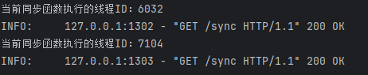

&emsp;&emsp;如图所示，当发起多个请求的时候，每个请求的执行所产生的线程 ID 都是不一样，这也说明了同步路由的并发处理机制是基于多线程方式来实现的。

**（二）异步 API 端点路由**

&emsp;&emsp;异步路由的主要表现形式：当使用 URL 地址绑定的视图函数是一个协程函数（使用 async def 定义的函数）时，就把这个绑定过程理解为一个异步路由注册的过程：

```python
from fastapi import FastAPI
import threading
import time
import asyncio

app = FastAPI(routes=None)


@app.get('/async')
async def async_function():
    await asyncio.sleep(10)
    print(f'当前协程运行的线程ID：{threading.current_thread().ident}')
    return {"index": "async"}

if __name__ == '__main__':
    import uvicorn
    import os
    module_name = os.path.basename(__file__).replace(".py", "")
    uvicorn.run(app=f"{module_name}:app")
```

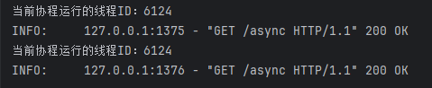

&emsp;&emsp;当发起多个访问请求的时候，每个请求的执行都运行在同一个线程内，所以可以理解为每个请求本质上都是运行在同一个线程的循环事件中，所以它们的线程 ID 是一样的，这也说明了异步路由的并发处理机制是基于单线程方式运行的。

><font color=orange>注意：</font>通常不建议在异步操作中使用同步函数，因为在一个线程中执行同步函数时肯定会引发阻塞。

# 多应用挂载

&emsp;&emsp;如果项目比较庞大，可以使用主应用挂载子应用的方式来进行划分。

**（一）主从应用挂载**

&emsp;&emsp;主从应用挂载的好处：

* app 独立管理
* 各自所属的 API 交互式文档是独立的，可以分开访问

```python
from fastapi import FastAPI
from fastapi.responses import JSONResponse

# 创建主 app 应用对象实例，注册路由信息
app = FastAPI(title='主应用', description='我是主应用的描述文档', version='v0.0.1')
@app.get('/index', summary='首页')
async def index():
    return JSONResponse({'index': '我是属于主应用的接口！'})

# 创建子 app 对象的实例，注册所属的路由信息
sub_app = FastAPI(title='子应用', description='我是子应用的描述文档', version='v0.0.1')
@sub_app.get('/index', summary='首页')
async def index():
    return JSONResponse({'index': '我是属于子应用的接口！'})


# 主应用挂载子应用关联，设置子应用的请求 URL 地址为 /subapp
app.mount(path='/subapp', app=sub_app, name='subapp')

if __name__ == '__main__':
    import uvicorn
    import os
    module_name = os.path.basename(__file__).replace(".py", "")
    uvicorn.run(app=f"{module_name}:app")
```

&emsp;&emsp;启动服务：

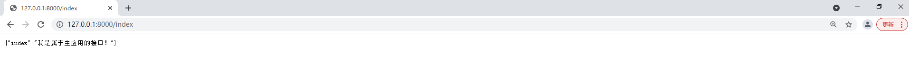
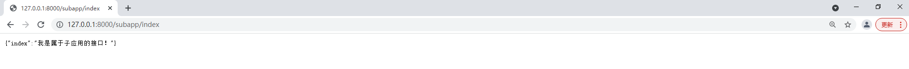

**（二）挂载其他 WSGI 应用**

&emsp;&emsp;如果已开发好了 WSGI 应用程序（如 Flask 或 Django 等应用），也可以通过 FastAPI 无缝进行挂载关联，这样就可以通过 FastAPI 部署来启动 WSGI 的应用程序。FastAPI 提供了一个名为 `WSGI Middleware`​ 的中间件，通过它可以挂载 WSGI 应用程序：

```python
from fastapi import FastAPI
from fastapi.responses import JSONResponse
from fastapi.middleware.wsgi import WSGIMiddleware
from flask import Flask

# 创建  FastAPI 主应用，注册所属的路由信息
app = FastAPI(title='主应用', description='我是主应用的描述文档', version='v0.0.1')
@app.get('/index', summary='首页')
async def index():
    return JSONResponse({'index': '我是属于主应用的接口！'})


# 创建 Flask 子应用，注册所属的路由信息
flask_app = Flask(__name__)
@flask_app.route('/index')
def flask_main():
    return {'index': '我是属于 flask_app 应用的接口！'}


# 进行挂载，设置子应用的 URL 地址为 /flaskapp
app.mount(path='/flaskapp', app=WSGIMiddleware(flask_app), name='flask_app')

if __name__ == '__main__':
    import uvicorn
    import os
    module_name = os.path.basename(__file__).replace(".py", "")
    uvicorn.run(app=f"{module_name}:app")
```

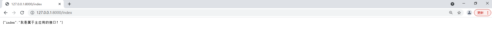
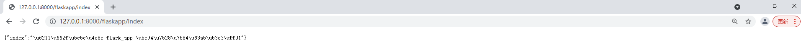

# 自定义配置 swagger_ui

&emsp;&emsp;在使用 API 可视化交互式文档的过程中，有时候相关网络是正常的，但是依然无法正常加载可视化 API 文档界面，主要是由 swagger_ui 内置的 HTML 模板导致的，相关的 swagger-ui.css 和 swagger-ui-bundle.js 资源是从第三方的 CDN 服务商上加载的，第三方的 CDN 服务出现问题就会导致无法正常加载可视化 API 文档界面的情况。为了避免出现这种情况，以及在无网络情况下也能正常访问 API 交互式文档，就需要自定义（或改造）并渲染 HTML 模板中的一些变量，让 swagger-ui.css 和 swagger-ui-bundle.js 等静态资源从本地进行加载。

&emsp;&emsp;通过源码可以知道，docs 模板内容渲染的 HTML 内容位于 `...\FastAPI\openapi\docs.py`​ 模块中，里面有 `get_swagger_ui_html()`​ 方法文档，其中有 HTML 输出模板的内容，用户可以替换对应输出模板的参数实现本地资源加载：

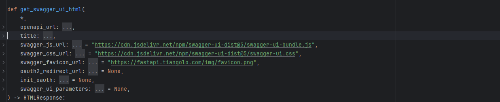

&emsp;&emsp;默认的 swagger_js_url 和 swagger_css_url 使用了第三方 CDN 地址，可以从这里进行改造。首先下载 swagger_js_url 和 swagger_css_url 对应的资源文件，然后将它们放到 static 文件夹之下。然后挂载相关静态资源文件，设置读取路由并自定义访问 docs 路由：

```python
from fastapi import  FastAPI
from fastapi.openapi.docs import (get_redoc_html, get_swagger_ui_html, get_swagger_ui_oauth2_redirect_html, )
from fastapi.staticfiles import StaticFiles
import pathlib


app = FastAPI(docs_url=None)
app.mount('/static', StaticFiles(directory=f"{pathlib.Path.cwd()}/static"), name="static")

@app.get('/docs', include_in_schema=False)
async def custom_swagger_ui_html():
    return get_swagger_ui_html(
        openapi_url=app.openapi_url,
        title=app.title + " - Swagger UI",
        oauth2_redirect_url=app.swagger_ui_oauth2_redirect_url,
        swagger_js_url='/static/swagger-ui-bundle.js',
        swagger_css_url='/static/swagger-ui.css',
        swagger_favicon_url='https://fastapi.tiangolo.com/img/favicon.png'
    )

if __name__ == '__main__':
    import uvicorn
    import os
    module_name = os.path.basename(__file__).replace(".py", "")
    uvicorn.run(app=f"{module_name}:app")
```

><font color=orange>注意：</font>可以按照上述步骤配置 redoc 模式下的静态资源。

# 应用配置信息读取

&emsp;&emsp;通常，应用程序在启动前需要读取相关的配置参数或服务项（如：应用秘钥信息、数据库用户名和密码信息等），大部分的配置参数不会硬编码到项目中，因为部分参数要随时根据环境变量的变化而变化，所以一般做法是把配置参数写入外部文件或环境变量中，在大型微服务项目中，还可以把参数写入线上的配置中心进行统一管理。

**（一）基于文件读取配置参数**

&emsp;&emsp;如果配置文件不是写入环境变量中，而是写入类似 Windows 的 `*.ini`​ 文件中，那么可以通过 Python 自带的 `configparser`​ 来解析读取配置参数，首先来创建一个配置文件：

```text
[fastapi_config]
debug = True
title = "FastApi"
description = "FastApi 文档明细描述"
version = v1.0.0

[redis]
ip = 127.0.0.1
port = 6379
password = 123456
```

&emsp;&emsp;然后读取配置文件：

```python
import configparser

config = configparser.ConfigParser()
config.read("conf.ini", encoding="utf-8")

# fastapi_config 配置内容
print(bool(config.get('fastapi_config', 'debug'))) # True
print(config.get('fastapi_config', 'title')) # "FastApi"
print(config.get('fastapi_config', 'description')) # "FastApi 文档明细描述"
print(config.get('fastapi_config', 'version')) # v1.0.0

# rerdis 配置内容
print(config.get('redis', 'ip')) # 127.0.0.1
print(config.get('redis', 'port')) # 6379
print(config.get('redis', 'password')) # 123456
```

**（二）基于 Pydantic 和 .env 环境变量读取配置参数**

&emsp;&emsp;通过环境变量来读取配置参数是 FastAPI 官方推荐的方式，通过 `Pydantic`​ 可以直接解析出对应的配置参数项，同时还提供了参数类型校验的功能，使用之前需要安装：

```shell
pip install python-doten
```

&emsp;&emsp;然后配置 `.env`​ 内容：

```env
DEBUG=True
TITLE="FastAPI"
DESCRIPTION="FastAPI文档明细说明"
vERSION="V1.0.0"
```

&emsp;&emsp;然后读取：

```python
from pydantic import BaseSettings

# 定义继承 BaseSettings 模型的 Settings 子类
class Settings(BaseSettings)：
	debug: bool = False
	title: str
	description: str
	version: str

	class Config:
		env_file = ".env"
		env_file_encoding = "utf-8"


# 创建 Settings 对象，完成 .env 文件解析
# 除此以外，还可以在实例化的过程中指定读取 .env 文件的方式，此时就不需要再定义 Config 内部类了
# settings = Settings(_env_file='.env', _env_file_encoding='utf-8')
settings = Settings()
print(settings.debug)
print(settings.title)
print(settings.description)
print(settings.version)
```

&emsp;&emsp;读取环境变量的方式，系统会自动解析当前的环境是否存在对应的值，如果环境变量值不存在且模型定义的变量无默认值则会触发校验异常；如果存在默认值，则该值就是模型中定义的默认值。对于继承于 BaseSettings 子类的实现，还可以对指定字段进行更详细的校验定制：

```python
from pydantic import BaseSettings

# 定义继承 BaseSettings 模型的 Settings 子类
class Settings(BaseSettings)：
	debug: bool = False
	title: str
	description: str
	version: str

	@validator('version', pre=pre)
	def version_len_check(cls, v: str) -> Optional[str]:
		if v and len(v) == 0:
			return None
		return v
```

&emsp;&emsp;引入 Pydantic 下的 validator 校验函数装饰器后，即可对指定的 version 字段执行特定校验。validator 装饰器中提供了如下几个参数：

* fields：表示需要校验哪一个字段
* pre：表示自定义的校验规则是否应在调用标准验证器之前调用此验证器，否则在之后执行
* each_item：表示对于一些复杂的对象（集合、列表等）字段，是否验证单个元素而不是整体
* check_fields：表示是否在定义的模型对象上进行字段是否存在的校验
* always：表示当字段缺少值时，是否应调用此方法进行验证
* allow_reuse：表示如果存在另一个验证器引用修饰函数，那么是否跟踪并引发错误抛出

**（三）给配置读取加上缓存**

&emsp;&emsp;通常系统中用到的配置参数只会读取一次，如果每次调用参数都要进行一次 Settings 对象实例化，则可能引发性能问题（也可以用单例实现），可以通过添加缓存的方式避免多次实例化：

```python
from functools import lru_cache

# 通过 functools 中的 lru_cache 装饰器完成对象缓存处理
@lru_cache()
def get_settings():
	return Settings()

print(get_settings().debug)
```

# API 端点路由函数参数

&emsp;&emsp;在项目开发中，用户一般需要通过提交参数来访问 API，所以需要对用户输入的参数进行校验，常用的校验库有：

* WTForms：支持多个 Web 框架的 Form 组件，主要用于对用户请求数据进行校验
* valideer：轻量级、可扩展的数据验证和适配库
* validators：验证库
* cerberus：用于 Python 的轻量级和可扩展的数据验证库
* colander：用于对 XML、JSON、HTML 以及其他同样简单的序列化数据进行校验和反序列化的库
* jsonschema：用来标记和校验 JSON 数据，可在自动化测试中验证 JSON 的整体结构和字段类型
* schematics：一个 Python 库，用于将类型组合到结构中并验证它们，然后根据简单的描述转换数据的形状
* voluptuous：主要用于验证以 JSON、YAML 等形式传入 Python 的数据

&emsp;&emsp;FastAPI 在参数读取和校验上具有更多优势，主要因为它整合了 Pydantic 库，通过该库可以直接定义数据接口 schema，并进行数据校验。在一个 API 中，请求参数的提交有多种方式，使用 Pydantic 可以统一进行参数绑定解析（如：Path、Query、Body 等都是封装好的，可以直接应用于参数解析的模块），在源码层，Path、Query 等模块的父类都是 Param，而 Param 的父类是 Pydantic 库中的 FieldInfo 类。

&emsp;&emsp;在配置 API 端点路由绑定视图函数的过程会涉及到 路径操作参数 和 路径函数参数 两个概念：

```python
from fastapi import FastAPI, status, Response, Query
from fastapi.responses import JSONResponse
from typing import List

app = FastAPI()

@app.post('/parameter/', summary='我是路径操作参数', status_code=status.HTTP_500_INTERNAL_SERVER_ERROR)
async def parameter(q: List[str] = Query(["test1", "test2"])):
    return {
        'message': q
    }
```

&emsp;&emsp;其中，`@app.post()`​ 表示 API 端点的路径操作，也就是 API 装饰器，它里面的传输参数则可以理解为 路径操作参数；`async def parameter()`​ 表示视图函数，该视图函数可以是同步函数，也可以是协程函数，其中要传入的参数表示 路径函数参数，这里称其为视图函数参数。

### Path 参数

&emsp;&emsp;Path（路径）参数是路由 URL 地址可以动态传入的参数，如：`https://127.0.0.1/user/s1234/article?name=zhangsan`​，路径地址为 `/user/s1234/article`​，而 `?`​ 符号之后的参数则是查询参数。路径参数通常指 URL 地址中可变的参数：

```python
from fastapi import FastAPI

app = FastAPI()

@app.get('/user/{user_id}/article/{article_id}')
async def callback(user_id: int, article_id: int):
    return {
        'user_id': user_id,
        'article_id': article_id
    }


if __name__ == '__main__':
    import uvicorn
    import os
    module_name = os.path.basename(__file__).replace(".py", "")
    uvicorn.run(app=f"{module_name}:app")
```

&emsp;&emsp;上面代码声明了 `user_id`​ 和 `article_id`​ 两个路径参数变量，FastAPI 会自动把这两个参数传递到视图函数上：

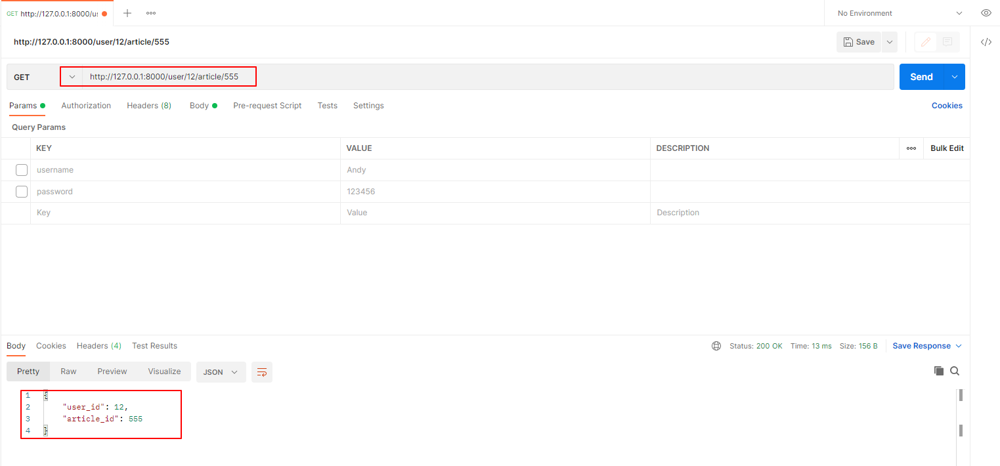

&emsp;&emsp;如果要传入的路径参数是一种文件类型的路径，且要求传入到 URL 路径中，那么 URL 会识别出多重路径并出现 404 的错误：

```python
from fastapi import FastAPI

app = FastAPI()

@app.get('/urls/{file_path}')
async def callback(file_path: str):
    return {
        'urls': file_path
    }


if __name__ == '__main__':
    import uvicorn
    import os
    module_name = os.path.basename(__file__).replace(".py", "")
    uvicorn.run(app=f"{module_name}:app")
```

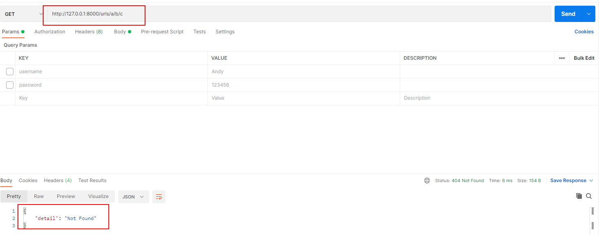

&emsp;&emsp;此时只有把路径变量定义为 `Path`​ 类型：

```python
from fastapi import FastAPI

app = FastAPI()

@app.get('/urls/{file_path:path}')
async def callback(file_path: str):
    return {
        'urls': file_path
    }


if __name__ == '__main__':
    import uvicorn
    import os
    module_name = os.path.basename(__file__).replace(".py", "")
    uvicorn.run(app=f"{module_name}:app")
```

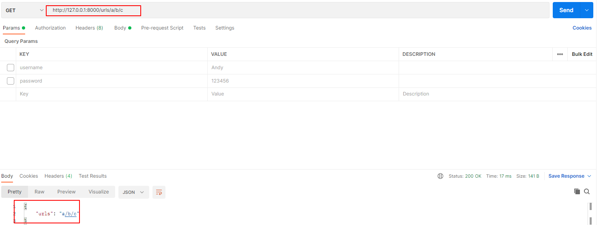

&emsp;&emsp;假设路径参数有几个预设值，则可以通过引入枚举类来定义路径参数值：

```python
from fastapi import FastAPI
from enum import Enum

class ModelName(str, Enum):
    name1 = "name1"
    name2 = "name2"
    name3 = "name3"


app = FastAPI()

@app.get('/model/{model_name}')
async def callback(model_name: ModelName):
    if model_name == ModelName.name1:
        return {'model_name': model_name, 'message': 'ok'}
    if model_name.value == 'name2':
        return {'model_name': model_name, 'message': 'name2 ok'}
    return {'model_name': model_name, 'message': 'fail!'}


if __name__ == '__main__':
    import uvicorn
    import os
    module_name = os.path.basename(__file__).replace(".py", "")
    uvicorn.run(app=f"{module_name}:app")
```

&emsp;&emsp;如果需要对单独的一个参数进行多维度校验，FastAPI 提供了一个专门用于多维度条件校验的 Path 类来声明参数：

```python
from fastapi import FastAPI, Path

app = FastAPI()

@app.get('/pay/{user_id}/article/{article_id}')
async def read_user_item(user_id: int = Path(...,title='用户ID', description='用户ID信息', ge=10000),article_id: str = Path(..., title='文章ID', description='用户所属文章ID信息', min_length=1, max_length=50)):
    return {
        'user_id': user_id,
        'article_id': article_id
    }


if __name__ == '__main__':
    import uvicorn
    import os
    module_name = os.path.basename(__file__).replace(".py", "")
    uvicorn.run(app=f"{module_name}:app")
```

* user_id：int 类型参数
	* ​`...`​：表示 user_id 是一个必填项
	* title：表示参数显示在 API 交互式文档中的标题名称
	* description：表示参数显示在 API 交互式文档中的详细描述
	* ge=10000：表示参数传值需要大于或等于 10000，若不满足，则会抛出请求参数校验异常
* article_id：字符串类型参数
	* min_length=1：表示参数传值需要满足字符串长度大于1，若不符合该条件，则会抛出请求参数校验异常
	* max_length=50：表示参数传值需要满足字符串长度小于50，若不符合该条件，则会抛出请求参数校验异常

&emsp;&emsp;路径参数是 URL 的关键组成部分，如果缺少对路径参数值的传递，则构不成完整的 URL 请求，所以任何路径参数值都应该声明为必填项。

### Query 参数

&emsp;&emsp;Query 参数不属于路径参数，但也会在 URL 地址上显示出来（如：`http://127.0.0.1:8000/items/?limit=0`​）。对于查询参数的参数值，既可以设定为必填项，也可以设置为可选项，还可以设定为默认的查询参数值：

```python
from typing import Optional
from fastapi import FastAPI

app = FastAPI()

@app.get('/query')
async def query_func(user_id: int, user_name: Optional[str] = None, user_token: str = 'token'):
    return {
        'user_id': user_id,
        'user_name': user_name,
        'user_token': user_token
    }


if __name__ == '__main__':
    import uvicorn
    import os
    module_name = os.path.basename(__file__).replace(".py", "")
    uvicorn.run(app=f"{module_name}:app")
```

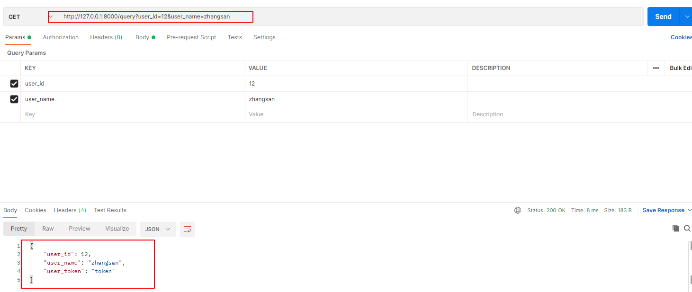

* user_id：int 类型参数，是必填项，如果没有这个参数的传递则抛出请求参数校验异常
* user_name：字符串类型参数，是可选项（Optional的主要作用是参数值类型提示，方便 IDE 识别提示），该参数要么是字符串类型，要么是 None 类型
* user_token：字符串类型参数，它的默认值为 token

&emsp;&emsp;如果声明的查询参数是 bool 类型，那么 FastAPI 框架会对参数值类型进行自动转换：

* true / false
* 1 / 0 （1 表示 true， 0 表示 false）
* on / off（on 表示 true， off 表示 false）

&emsp;&emsp;如果不是上面几种方式，则会提示参数校验异常。和 Path 一样，FastAPI 框架还提供了一个专门用于在查询中进行多维度条件限制的 Query 类：

```python
from fastapi import FastAPI, Query

app = FastAPI()

@app.get('/query/morequery')
async def callback(
        user_id: int = Query(..., ge=10, le=100),
        user_name: str = Query(None, min_length=1, max_length=50, regex="^fixedquery$"),
        user_token: str = Query(default='token', min_length=1, max_length=50)
):
    return {
        'user_id': user_id,
        'user_name': user_name,
        'user_token': user_token
    }


if __name__ == '__main__':
    import uvicorn
    import os
    module_name = os.path.basename(__file__).replace(".py", "")
    uvicorn.run(app=f"{module_name}:app")
```

&emsp;&emsp;Query 类中的参数和 Path 中的大部分参数是相同的，关于 int 类型数据校验涉及的参数说明：

* gt：表示大于
* lt：表示小于
* ge：表示大于或等于
* le：表示小于或等于

&emsp;&emsp;对于某些 API，要求在 URL 地址上对同一个变量传递不同的值，相当于把查询参数的变量定义为要传递的一个 List 类型的值（`http://127.0.0.1:80000/query/list/?q=test1&q=test2`​），可以声明一个列表类型的查询参数来接收对应的值：

```python
from typing import List
from fastapi import FastAPI, Query

app = FastAPI()

@app.get('/query/list')
async def query_list(q: List[str] = Query(['test1', 'test2'])):
    return {
        'q': q
    }


if __name__ == '__main__':
    import uvicorn
    import os
    module_name = os.path.basename(__file__).replace(".py", "")
    uvicorn.run(app=f"{module_name}:app")
```

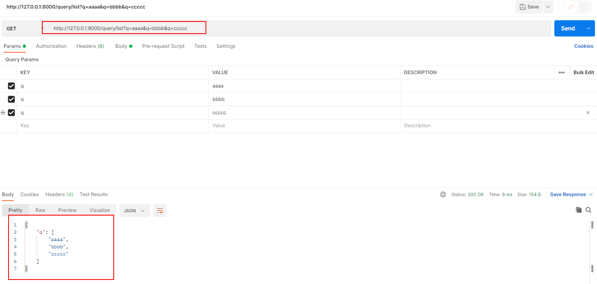

### Body 参数

&emsp;&emsp;Body（请求体）参数表示在 HTTP 中提交请求体的数据，它既可以是某种文档类型的数据，也可以是文件类型或者表单类型的数据。常见的请求体参数传递都是 JSON 格式的，如果是 JSON 格式的数据，则通常要求提交请求头字段 `Content-Type`​ 的格式（`application/json;charset-UTF-8`​）。FastAPI 提供了 3 种方式来接收 Body 参数，并自动把 JSON 格式的字符串转换为 dict 格式：

* 引入 Pydantic 模型来声明请求体并进行绑定
* 直接通过 Request 对象获取 Body 的函数
* 使用 Body 类来定义

**（一）用 Pydantic 模型声明请求体**

```python
from pydantic import BaseModel
from typing import Optional
from fastapi import FastAPI


# 创建 Item 模型类，该类继承 BaseModel
class Item(BaseModel):
    user_id: str
    token: str
    timestamp: str
    article_id: Optional[str] = None  # 非必填


app = FastAPI()


# 把模型绑定到视图中
@app.post('/action')
def read_item(item: Item):
    return {
        'user_id': item.user_id,
        'token': item.token,
        'timestamp': item.timestamp,
        'article_id': item.article_id
    }


if __name__ == '__main__':
    import uvicorn
    import os
    module_name = os.path.basename(__file__).replace(".py", "")
    uvicorn.run(app=f"{module_name}:app")
```

&emsp;&emsp;FastAPI 会自动处理以下几种情况：

* 将请求体参数识别为 JSON 格式字符串，并自动将字段转换为相应的数据类型
* 自动进行参数规则的校验，如果校验失败，则响应报文内容会自动返回一个错误，并准确指出错误数据的位置和信息
* 为模型生成 JSON Schema 定义，并显示在 API 交互式文档中，Schema 会成为 OpenAPI Schema 的一部分
* 在函数体内部，可以直接访问模型对象的所有属性

**（二）单值 Request Body 字段参数定义**

&emsp;&emsp;FastAPI 框架中也提供了对应的 Body 类来绑定 Body 请求体的参数：

```python
from fastapi import FastAPI, Body

app = FastAPI()


# 把模型绑定到视图中
@app.post('/action')
def read_item(
        user_id: str = Body(...),
        token: str = Body(...),
        timestamp: str = Body(...),
        article_id: str = Body(default=None)
):
    return {
        'user_id': user_id,
        'token': token,
        'timestamp': timestamp,
        'article_id': article_id
    }


if __name__ == '__main__':
    import uvicorn
    import os
    module_name = os.path.basename(__file__).replace(".py", "")
    uvicorn.run(app=f"{module_name}:app")
```

**（三）Request Body 中的 embed 参数**

&emsp;&emsp;在某些场景中，可以把 Body 类和模型类结合起来使用，需要把 Body 类中声明的参数变量名作为一个参数字段，该字段需要为请求体的一部分：

```python
from typing import Optional
from fastapi import FastAPI, Body
from pydantic import BaseModel

app = FastAPI()


class Item(BaseModel):
    user_id: int = Body(..., gt=10)
    token: str
    timestamp: str
    article_id: Optional[str] = None

# 把模型绑定到视图中
@app.post('/action')
def read_item(item: Item = Body(default=None, embed=False)):
    return {
        'body': item
    }


if __name__ == '__main__':
    import uvicorn
    import os
    module_name = os.path.basename(__file__).replace(".py", "")
    uvicorn.run(app=f"{module_name}:app")
```

* default=None：表示这个模型作为请求体提交时是一个可选的字段，此时不会校验这个模型是否存在，尽管模型类中的 user_id、token、timestamp 等字段都是必填项，但还是会忽略对模型类中必填参数的校验
* embed=Fasle：表示 item 参数字段名不会成为请求体的一部分，反之则会

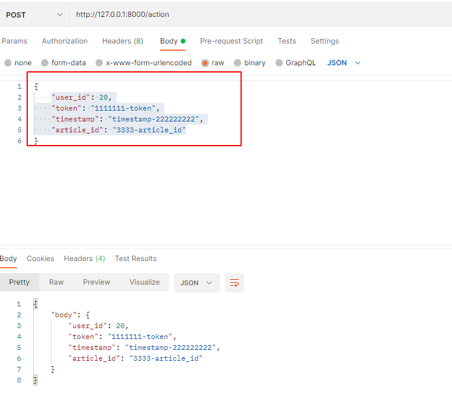
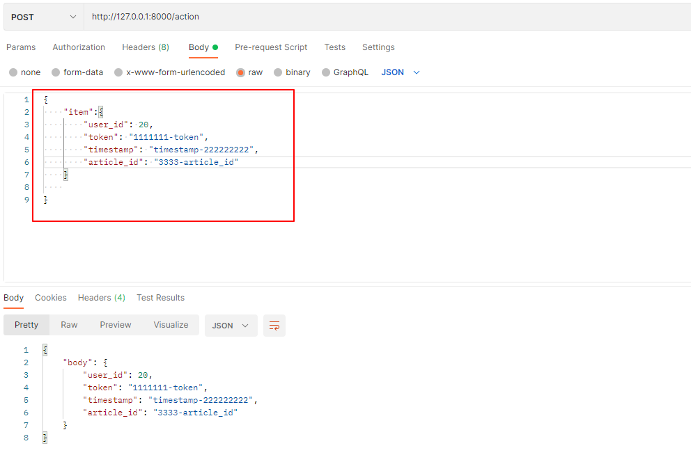

**（四）多个 Request Body 参数**

&emsp;&emsp;对于一些复杂的请求体数据，有可能有嵌套要求，请求体的格式如下：

```json
{
	"item": {
		"name": "苹果",
		"description": "苹果手机",
		"price": 4212.0,
		"tax": 3.2
	},
	"user": {
		"username": "xiaoxiao",
		"full_name": "xiaozhong tongxue"
	}
}
```

&emsp;&emsp;此时需要声明多个模型的定义：

```python
from typing import Optional
from fastapi import FastAPI
from pydantic import BaseModel

app = FastAPI()


class ItemUser(BaseModel):
    name: str
    description: str = None
    price: float
    tax: float = None


class User(BaseModel):
    username: str
    full_name: str = None


# 把模型绑定到视图中
@app.put('/items/')
async def update_item(item: ItemUser, user: User):
    return {"item": item, "user": user}


if __name__ == '__main__':
    import uvicorn
    import os
    module_name = os.path.basename(__file__).replace(".py", "")
    uvicorn.run(app=f"{module_name}:app")
```

**（五）多个模型类和单个 Request Body**

&emsp;&emsp;请求体里面不仅存在多个 Request Body ，而且存在某一个单一 Request Body 的字段信息：

```json
{
	"item": {
		"name": "苹果",
		"description": "苹果手机",
		"price": 4212.0,
		"tax": 3.2
	},
	"user": {
		"username": "xiaoxiao",
		"full_name": "xiaozhong tongxue"
	},
	"importance": 5
}
```

&emsp;&emsp;此时需要声明的模型和 Body 对象的代码如下：

```python
# 把模型绑定到视图中
@app.put('/items/')
async def update_item(item: ItemUser, user: User, importance: int = Body(..., gt=0)):
    return {"item": item, "user": user, "importance": importance}
```

**（六）模型类嵌套声明**

&emsp;&emsp;更复杂的一些请求结构体可能会涉及模型嵌套模型的情况：

```json
{
	"item": {
		"name": "苹果",
		"description": "苹果手机",
		"price": 4212.0,
		"tax": 3.2,
		"user": {
			"username": "xiaoxiao",
			"full_name": "xiaozhong tongxue"
		}
	},
	"importance": 5
}
```

&emsp;&emsp;此时需要进行模型类的嵌套声明：

```python
from fastapi import FastAPI, Body
from pydantic import BaseModel

app = FastAPI()

class User(BaseModel):
    username: str
    full_name: str = None

class ItemUser(BaseModel):
    name: str
    description: str = None
    price: float
    tax: float = None
    user: User

# 把模型绑定到视图中
@app.put('/items/')
async def update_item(item: ItemUser, importance: int = Body(..., gt=0)):
    return {"item": item, "importance": importance}


if __name__ == '__main__':
    import uvicorn
    import os
    module_name = os.path.basename(__file__).replace(".py", "")
    uvicorn.run(app=f"{module_name}:app")
```

**（七）嵌套模型为 List、Set 类型**

&emsp;&emsp;还可以把 Pydantic 模型定义为 List、Set 等类型并嵌套到另一个模型中：

```python
from fastapi import FastAPI, Body
from pydantic import BaseModel
from typing import Set, List


app = FastAPI()


class User(BaseModel):
    username: str
    full_name: str = None


class ItemUser(BaseModel):
    name: str
    description: str = None
    price: float
    tax: float = None
    tags: Set[str] = []
    users: List[User] = None


# 把模型绑定到视图中
@app.put('/items/')
async def update_item(item: ItemUser, importance: int = Body(..., gt=0)):
    return {"item": item, "importance": importance}


if __name__ == '__main__':
    import uvicorn
    import os
    module_name = os.path.basename(__file__).replace(".py", "")
    uvicorn.run(app=f"{module_name}:app")
```

&emsp;&emsp;在嵌套的模型中定义的 tags 参数是一种 Set 类型字段，但在 API 交互式文档中转换为 List 类型了，所以此时该参数按照数组形式进行传递的。

**（八）任意 dict 字典类型构成请求体**

&emsp;&emsp;可以使用字典类型来声明请求体：

```python
from typing import Dict
from fastapi import FastAPI


app = FastAPI()


# 把模型绑定到视图中
@app.post('/items')
async def update_item(item: Dict[str, str], user: Dict[str, str], gornd: Dict[str, Dict[str, str]]):
    return {
        "item": item,
        "user": user,
        "gornd": gornd
    }


if __name__ == '__main__':
    import uvicorn
    import os
    module_name = os.path.basename(__file__).replace(".py", "")
    uvicorn.run(app=f"{module_name}:app")
```

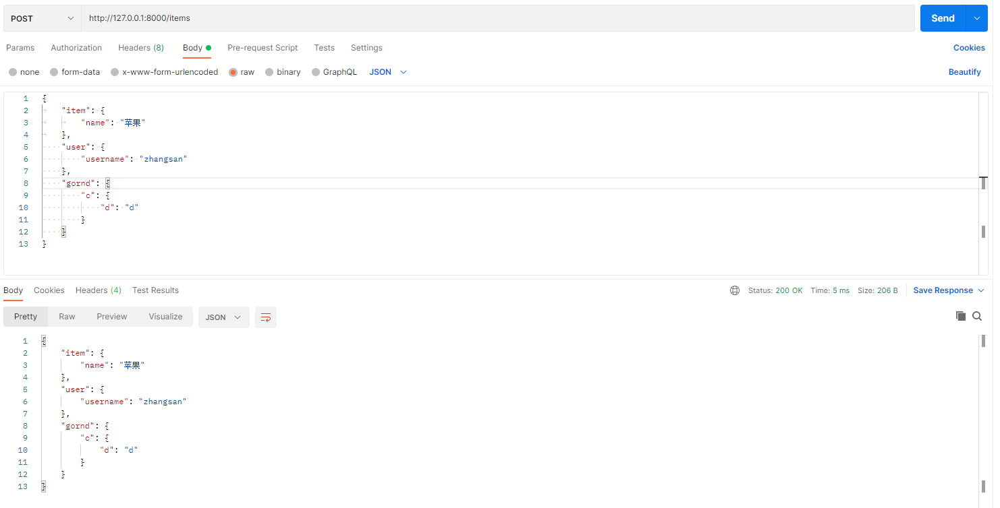

**（九）模型中的 Field 字段**

&emsp;&emsp;在 FastAPI 框架中，除了使用 Body 等模块来对相关的参数类型做额外的校验及元数据描述外，还可以使用 Pydantic 中的 Field 在 Pydantic 模型内部声明校验和定义元数据：

```python
from typing import Dict, Optional
from fastapi import FastAPI
from pydantic import BaseModel, Field

app = FastAPI()


class FieldItem(BaseModel):
    name: Optional[str] = Field(default=None, title="字段标题",description="字段描述", max_length=5)
    user_id: float = Field(..., gt=1000, description="用户ID需要大于等于1000")
    token: Optional[float] = None


# 把模型绑定到视图中
@app.post('/items')
async def update_item(name: FieldItem):
    return {
        "name": name
    }


if __name__ == '__main__':
    import uvicorn
    import os
    module_name = os.path.basename(__file__).replace(".py", "")
    uvicorn.run(app=f"{module_name}:app")
```

### Form 数据和文件处理

&emsp;&emsp;表单数据默认使用 POST 的方式提交到 API 上，由于表单数据的传输过程使用一种特殊编码，所以与 JSON 不同，设置 Content-Type 格式的对应要求也不同。对于表单数据的传输，通常要求提交请求头字段 Content-Type 的方式是 `application/x-www-form-urlencoded`​，这也是默认方式。

&emsp;&emsp;FastAPI 表单的处理需要借助第三方库：

```shell
pip install python-multipart
```

&emsp;&emsp;FastAPI 中提供的 Form 类是基于 Body 模块扩展而来的，所以它的用法和 Body 是一样的：

```python
from fastapi import FastAPI, Form

app = FastAPI()


@app.post('/demo/login')
async def login(username: str = Form(..., title='用户名', description='用户名字段描述', max_length=5),
password: str= Form(..., title='用户密码', description='用户密码字段描述', max_length=20)):
    return {"username": username, "password": password}


if __name__ == '__main__':
    import uvicorn
    import os
    module_name = os.path.basename(__file__).replace(".py", "")
    uvicorn.run(app=f"{module_name}:app")
```

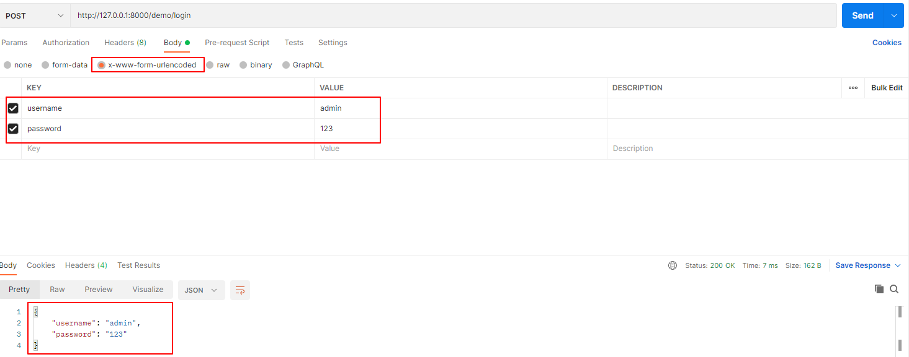


&emsp;&emsp;FastAPI 中提供了专门接收处理文件的 File 类，他是基于 Form 模块扩展而来的，所以它的用法和 Form 一样：

```python
from fastapi import FastAPI, File, UploadFile
from typing import List
import aiofiles

app = FastAPI()


@app.post("/sync_file", summary="File 形式的-单文件上传")
def sync_file(file: bytes = File(...)):
    '''
    使用 File类，文件内容会以 bytes 的形式读入内存，通常适用于上传小的文件
    :param file:
    :return:
    '''
    with open('./data.bat', 'wb') as f:
        f.write(file)

    return {'file_size': len(file)}


@app.post('/async_file', summary='File 形式的-单文件上传')
async def async_file(file: bytes = File(...)):
    '''
    基于 File 类，使用异步方式进行文件接收处理
    :param file:
    :return:
    '''
    async with aiofiles.open('./data1.bat', 'wb') as fp:
        await fp.write(file)

    return {'file_size': len(file)}


if __name__ == '__main__':
    import uvicorn
    import os
    module_name = os.path.basename(__file__).replace(".py", "")
    uvicorn.run(app=f"{module_name}:app")
```

><font color=orange>注意：</font>aiofiles 库用来异步接收处理，需要执行 `pip install aiofiles`​ 命令来安装。

&emsp;&emsp;上面处理的是单一文件的上传，如果需要多文件上传，则需要把接收的文件定义为 List 类型：

```python
@app.post("/sync_file", summary="File 形式的-多文件上传")
def sync_file(files: List[bytes] = File(...)):
    '''
    使用 File类，文件内容会以 bytes 的形式读入内存，通常适用于上传小的文件
    :param file:
    :return:
    '''
    # with open('./data.bat', 'wb') as f:
    #     f.write(file)

    return {'file_sizes': [len(file) for file in files]}
```

&emsp;&emsp;直接使用 File 对象来接收处理上传的文件，它接收的是字节数据，而且缺少相关文件元数据信息（文件名、大小等）。FastAPI 提供了一个更高级的 UploadFile 类来处理类似需求：

```python
from fastapi import FastAPI, File, UploadFile

app = FastAPI()


@app.post("/uploadfiles", summary="UploadFile形式的-单文件上传")
async def uploadfiles(file: UploadFile = File(...)):
    result = {
        "filename": file.filename,
        "content-type": file.content_type
    }

    content = await file.read()
    with open(f"./{file.filename}", "wb") as f:
        f.write(content)
    return result


if __name__ == '__main__':
    import uvicorn
    import os
    module_name = os.path.basename(__file__).replace(".py", "")
    uvicorn.run(app=f"{module_name}:app")
```

&emsp;&emsp;直接声明接收文件为 UploadFile 类型可获取更多的文件信息，它提供的方法都是协程方法，所以仅适用于异步协程函数。与 bytes 相比，UploadFile 具有以下几点优势：

* 使用 UploadFile 进行文件读取时，所获得的数据存储在内存中，当占用的内存达到阈值后将被保存在磁盘中，这种读取方式更适用于大图片、视频等大文件的上传
* UploadFile 对象包含很多文件元数据（如文件名等）
* 有文件对象的异步接口，可以对文件对象进行 write、read等操作

&emsp;&emsp;UploadFile 也支持多文件上传处理，实现方式和 bytes 的相同。

## Header 参数

&emsp;&emsp;在 HTTP 请求过程中，通常需要提交一些自定义请求头信息，下面介绍如何在 FastAPI 框架中对请求头信息进行解析读取。

**（一）请求头参数使用**

&emsp;&emsp;FastAPI 提供了 Header 类用于请求头参数解析读取：

```python
@app.get("/demo/header/")  
async def read_items(user_agent: Optional[str] = Header(None, convert_underscores=True),  
                     accept_coding: Optional[str] = Header(None, convert_underscores=True),  
                     accept: Optional[str] = Header(None),  
                     accept_token: Optional[str] = Header(...,convert_underscores=False)):  
    return {  
        "user_agent": user_agent,  
        "accept_coding": accept_coding,  
        "accept": accept,  
        "accept_token": accept_token,  
    }
```

&emsp;&emsp;在上面的代码中定义了 4 个请求头参数，其中`user_agent`、`accept_encoding`、`accept` 都是浏览器默认携带的请求头参数，而 `accept_token` 是自定义的且它是必传值。

><font color=orange>注意：</font>定义 accept_token 时使用了下画线命名法。

&emsp;&emsp;这里要强调一点，在 Python 中如果参数变量使用带横杠（即连字符）的方式定义（如 `User-Agent`）​，则会认定该变量是一个非法变量名称。而默认情况下浏览器传递请求头参数时使用的都是带横杠的。此时，为了在代码中正常获取请求头参数，需要借助 Header 模块进行转换处理。

&emsp;&emsp;上面的示例中定义的 Header 对象中的`convert_underscores` 参数表示的意思是：如果在视图函数中声明的请求头参数使用了下画线命名法，那么是否对下画线进行转换。`convert_underscores=True` 表示转换，`False` 表示不转换。例如在视图函数中定义的 `user_agent` 变量，设置`convert_underscores=True` 后，经过转换变为了 `user-agent`。而为 `accept_token` 变量设置 `convert_underscores=False` 后，则不会进行转换，直接使用代码中声明的方式。

**（二）重名请求头参数**

&emsp;&emsp;重名请求头参数的定义和前文介绍的对查询列表形式的定义是一样的，也可以按照查询参数的多值方式进行处理，代码如下：

```python
@app.get("/headerlist/")
async def read_headerlist(x_token: List[str] = Header(None)):
	return {"X-Token values": x_token}
```

## Cookie 参数设置和读取

&emsp;&emsp;HTTP 是无状态的，当使用浏览器浏览不同的 Web 页面时，服务器会打开新的会话发起 HTTP 请求，然而服务器不会自动维护客户端请求的上下文信息。此时，为了能让服务器记录用户状态信息，会引入一种会话跟踪技术——`Session` 和 `Cookie`。

&emsp;&emsp;当用户浏览信息时，服务器采取某种存储机制把用户的一些状态信息记录下来。在服务器上记录用户状态信息的传统机制是 Session，而 Cookie 用于接收服务器端签发的一些文本信息，这些文本信息用于标记当前的用户状态且保存在客户端。Cookie 字段信息和服务器中的 Session 会自动对应起来。可以这么理解：Cookie 是用于在客户端保持用户信息状态的方案，Session 是用于在服务器端保持用户信息状态的方案。

**（一）Cookie 的设置**

&emsp;&emsp;Cookie 使用的常见场景是基于 Cookie 进行认证，具体流程如下：

+ 用户通过浏览器登录网页，输入用户名及密码等信息，并提交到服务器接口进行登录校验
+ 在服务器接口登录校验成功后，根据用户名或其他方式设置的唯一 Cookie 键值对进行映射，之后写入响应报文中并返回浏览器
+ 浏览器接收服务器端响应报文中返回的 Cookie 键值对信息，并将其写入本地浏览器存储
+ 此时浏览器再请求其他接口信息，携带与本地对应的 Cookie 键值对信息并提交到服务器接口
+ 服务器接口根据客户端提交的键值对信息进行验证，如果服务器端存在对应的值，则表示验证成功并返回服务器资源

&emsp;&emsp;我们知道 Cookie 是用于客户端保持用户信息状态的方案，但是任何放置在客户端的信息都会存在被恶意篡改或伪造的风险，所以使用 Cookie 进行认证时，要注意对敏感内容进行加密处理。下面是在服务器端设置签发 Cookie：

```python
@app.get("/set_Cookie/")
def setCookie(response: Response):
	response.set_cookie(key="xiaozhong", value="chengxuyuan-xiaozhong")
	return 'set_Cookie ok!'
```

&emsp;&emsp;在上面的代码中，首先引入 Response 响应报文处理模块，Response 主要用于与响应报文相关的封装处理模块，它可以直接写入对应的 Cookie。Response 对象提供了一个 `set_Cookie()` 方法来设置 Cookie 键值对信息。启动服务并使用浏览器访问路由地址 `http://127.0.0.1:8000/set_Cookie/`，会看到接口成功响应返回信息为 `set_Cookie ok！`​，并且在浏览器上能够查看 Cookie 值信息。

**（二）Cookie 的读取**

&emsp;&emsp;上文已经成功在服务器端设置了 Cookie 值信息，FastAPI 也提供了类似 Body、Query 等封装好的模块 Cookie 类，直接导入 Cookie 即可使用：

```python
@app.get("/get_Cookie")  
async def getcookie(xiaozhong: Optional[str]=Cookie(None)):  
    return xiaozhong
```