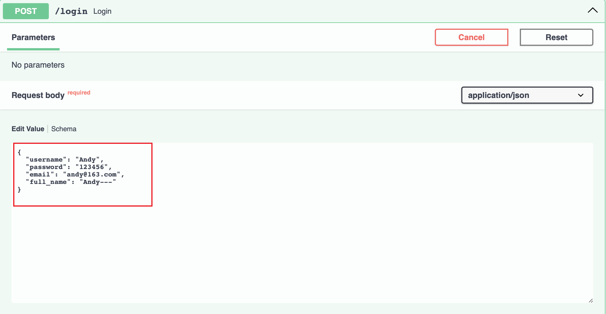
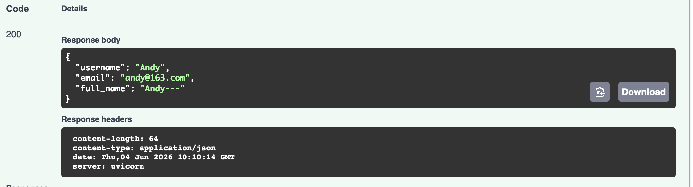

# 请求报文

&emsp;&emsp;FastAPI 封装了很多用于参数解析、提取的模块。所有模块解析处理的对象其实都是请求报文的数据。请求报文是由下面几个部分构成的：

+ 请求行：包括请求方法、URL、协议/版本
+ 请求报文头（Request Header）：它由一组名称/值对组成，其中名称表示某种类型的信息，而相应的值则提供该信息的具体内容
+ 空行：用来标识请求头的结束
+ 请求主体正文：主要是 Body 数据

&emsp;&emsp;常见的 HTTP 请求报文头包括：

+ User-Agent：指定发出请求的用户代理，通常是浏览器
+ Accept：指定客户端接收的响应主体类型（如：text/HTML）​
+ Host：指定将处理请求的服务器的主机名和端口号
+ Cookie：指定与请求相关联的Cookie
+ Referer：指定链接到当前页面的上一个页面的URL
+ Authorization：指定用于进行身份验证的凭据
+ Cache-Control：指定缓存控制选项，以控制响应是否可以缓存及缓存方式

&emsp;&emsp;在某些场景下，可能需要对请求报文中的一些信息做特殊处理，如在日志记录中需要获取所有请求参数信息、与请求参数签名认证匹配、获取客户端请求来源IP等。此时就需要引入 FastAPI 提供的 `Request` 模块来解析一次请求中的请求报文内容。

&emsp;&emsp;FastAPI 是基于 Starlette 扩展而来的，它提供的 Request 其实是直接使用了 Starlette 的 Request，所以也可以直接导入 Starlette 的请求报文 Request。

## Request 对象

&emsp;&emsp;当需要解析请求报文内容时可以把 Request 对象当作一个查询参数来显式声明到绑定的视图函数上：

```python
from fastapi import FastAPI, Request

app = FastAPI()

@app.get("/get_request/")
async def get_request(request: Request):
	form_data = await request.form()
	body_dadta = await request.body()
	return {
		'url': request.url,
		'base_url': request.base_url,
		'client_host':request.client.host,
		'query_params': request.query_params,
		'json_data': await request.json() if body_data else None,
		'form_data': form_data,
		'body_data': body_data 
	}
```

&emsp;&emsp;上面的代码中在视图函数参数中显式声明了 `request: Request` 对象后就可以通过 `request` 直接获取这一次请求中包含的属性值信息了（如这次请求的来源 URL、来源 IP、查询参数信息等）。在视图函数内部定义了一些方法，说明如下：

+ `request.form()`、`request.body()`、`request.json()` 返回的是一个协程对象，所以只有在协程函数中才可以正常进行读取解析
+ 如果需要在同步函数中获取具体的 `request.form()`、`request.body()`、`request.json()` 值信息，则需要将同步转换为异步方式
+ `request.json()` 能正确读取到值的前提是 `request.body()` 有具体的值，所以需要添加 `body_data` 是否有值的判断

## 更多 Request 属性信息

&emsp;&emsp;除了请求 IP 和查询参数信息之外，还有很多属性值信息可以获取。其中，Request 所包含的属性或函数如表所示：

| 属性或函数        | 说明                                                             |
| ------------ | -------------------------------------------------------------- |
| app          | 表示当前请求所属的上下文应用对象                                               |
| url          | 表示当前请求完整的 URL 对象                                               |
| base_url     | 表示请求的服务 URL 地址                                                 |
| method       | 表示此次请求使用的 HTTP 方式                                              |
| client       | 包含当前请求来源的客户端信息，如客户来源 host 和端口号信息                               |
| Cookies      | 表示请求报文中提交的 Cookies 值字典类型信息                                     |
| headers      | 表示请求报文中提交的所有请求头信息                                              |
| path_params  | 表示当前请求提交的路径参数字典信息                                              |
| query_params | 表示当前请求提交的查询参数                                                  |
| session      | 表示当前请求中包含的 Session 信息                                          |
| state        | 表示请求服务的一个状态值，通常用于处理请求上下文值的传递，通过该属性可以附加信息到请求上下文                 |
| json()       | 表示请求提交的 Body 值信息，此时返回已完成 JSON 格式化的数据。注意，此函数是一个 async 的协程函数     |
| body()       | 表示请求提交的 Body 值信息，此时 body() 返回值的类型是 bytes。注意，此函数是一个 async 的协程函数 |
| form()       | 表示请求提交的 form 表单值信息。注意，此函数是一个 async 的协程函数                       |
| scope        | 表示设置请求报文的请求范围                                                  |
&emsp;&emsp;`request.url` 的 URL 对象包含的属性或函数如表所示：

| 属性或函数      | 说明                                |
| ---------- | --------------------------------- |
| \_url      | 表示当前请求完整的 URL 对象                  |
| components | 表示请求 URL 包括哪些部分，如协议、请求地址、路径、查询参数等 |
| path       | 表示请求 URL 的路径信息                    |
| port       | 表示请求 URL 的端口号                     |
| quety      | 表示请求 URL 提交的字符串形式的查询参数            |
| scheme     | 表示请求 URL 使用的是协议、HTTP 还是 HTTPS     |
| is_secure  | 表示请求 URL 是否启用 HTTPS 安全校验          |
# 响应报文

&emsp;&emsp;所谓的响应报文指的是相关路由绑定的视图函数的处理结果，通常包含响应头及响应报文体等信息。HTTP响应报文的组成如下：

+ 状态行：主要包括协议/版本、状态码、状态信息，如HTTP/1.1200OK
+ 响应头(Response Header)：它由一组名称/值对组成，其中名称表示某种类型的信息，而相应的值则提供该信息的具体内容
+ 空行：用来标识响应头的结束
+ 响应正文主体：主要是响应内容信息

&emsp;&emsp;常见的 HTTP 请求响应报文头包括：

+ Content-Type：指定响应主体的媒体类型（如text/HTML）​
+ Accept：指定客户端接收的响应主体类型（如text/HTML）​
+ Content-Length：指定响应主体的长度
+ Cookie：指定与请求相关联的 Cookie
+ Server：指定正在运行的Web服务器软件
+ Date：指定响应生成的日期和时间
+ Cache-Control：指定缓存控制选项，以控制响应是否可以缓存及其缓存方式
+ Set-Cookie：在响应中设置 Cookie
+ Location：指定重定向目标的 URL

&emsp;&emsp;对于 API 来说一般只关心具体的报文主体内容。

## HTTP 状态码分类

&emsp;&emsp;在 HTTP 响应报文中存在一个状态码值，它主要用于表示请求服务器响应处理结果的一个状态。FastAPI 提供了多种方式来设置对应的响应码。对响应状态码值进行设置，一般要结合实际业务。常见的响应状态码分类及说明如下：

+ 1××（信息性状态码）​：指示正在继续处理请求，如：
	+ 100 Continue：服务器已收到请求头，并且客户端应继续发送请求主体
	+ 101 Switching Protocols：客户端请求升级为其他协议，如WebSocket
+ 2××（成功状态码）​：表示成功类型，主要用于表示服务器已收到请求且已成功处理，如：
	+ 200 OK：请求成功，服务器返回请求的数据
	+ 201 Created：请求成功，服务器创建了一个新资源
	+ 204 No Content：请求成功，但响应不包含任何数据
+ 3××（重定向状态码）​：指示必须采取进一步的行动才能完成请求，如：
	+ 301 Moved Permanently：资源永久移动到新位置
	+ 302 Found：资源已暂时移动到新位置
	+ 304 Not Modified：客户端缓存仍然有效
+ 4××（客户端错误状态码）​：表示客户端发生错误，主要用于客户端请求在提交参数错误或语法错误时，服务器给出无法完成请求的错误提示，如：
	+ 400 Bad Request：请求无效或无法被服务器理解
	+ 401 Unauthorized：请求需要身份验证
	+ 403 Forbidden：服务器拒绝请求
	+ 404 Not Found：请求的资源不存在
+ 5××（服务器错误状态码）​：表示服务器请求处理时发生了错误。主要用于表示在服务器处理请求的过程中发生不可预期的错误，导致服务进程崩溃或超时等错误异常类型。如：
	+ 500 Internal Server Error：服务器遇到意外情况并无法完成请求
	+ 503 Service Unavailable：服务器当前无法处理请求，因为它过载或正在进行维护

## 指定 HTTP 状态码

&emsp;&emsp;HTTP 状态码表示的是请求处理结果状态，如果需要指定处理结果响应码，则可以直接在路径操作参数中指定 `status_code` 参数的值，代码如下：

```python
from fastapi import FastAPI, status, Request  
from fastapi.responses import JSONResponse  
import uvicorn  
from h11 import Response  
  
app = FastAPI()  
  
@app.get("/set_http_code/demo1/", status_code=500)  
async def set_http_code():  
    return {  
        'message': 'ok'  
    }  
  
@app.get("/set_http_code/demo2/", status_code=status.HTTP_500_INTERNAL_SERVER_ERROR)  
async def set_http_code():  
    return {  
        'message': 'ok'  
    }  
  
@app.get("/set_http_code/demo3/")  
async def set_http_code(response: Response):  
    response.status_code = status.HTTP_500_INTERNAL_SERVER_ERROR  
    return {  
        'message': 'ok'  
    }  
  
@app.get("/set_http_code/demo4/")  
async def set_http_code():  
    return JSONResponse(status_code=status.HTTP_500_INTERNAL_SERVER_ERROR, content={'message': 'ok'})  
  
if __name__ == '__main__':  
    uvicorn.run(app="main:app", host="0.0.0.0", port=8000, reload=True)
```

&emsp;&emsp;上面的代码中使用了多种方式来展示如何指定一个响应码，如在 `@app.get("/set_http_code/demo1/"）`路由操作中指定了 `status_code` 参数的值是 `500`，它表示服务端程序错误。

## 使用 response_model 定义响应报文内容

&emsp;&emsp;如果需要使用直接输出 Pydantic 模型的方式来返回响应报文内容，那么可以通过直接定义 `response_model` 来实现。`response_model` 参数作为响应报文模型进行输出有以下优点：

+ 直接将输出的数据转换为 Model 中声明的类型并进行相关数据验证
+ 完善 OpenAPI，为 Response 添加 JSON Schema 和 Example Value描述
+ 对输出数据字段进行过滤处理

&emsp;&emsp;`response_model` 也是一个路径操作参数，所以它需要放在路径操作参数进行声明：

```python
from fastapi import FastAPI  
from pydantic import BaseModel  
import uvicorn  
app = FastAPI()  
  
class UserIn(BaseModel):  
    username: str  
    password: str  
    email: str  
    full_name: str = None  
  
class UserOut(BaseModel):  
    username: str  
    email: str  
    full_name: str = None  
  
  
@app.post("/login", response_model=UserOut)  
async def login(*, user: UserIn):  
    return user  
  
if __name__ == '__main__':  
    uvicorn.run(app="main:app", host="0.0.0.0", port=8000, reload=True)
```

&emsp;&emsp;上述代码的说明如下：

+ 使用 UserOut 模型作为响应报文内容，把它当作路径操作参数上传入 response_model 中
+ 使用 UserIn 模型作为请求体参数，在对应路径函数中，把它当作路径函数参数进行声明

&emsp;&emsp;启动服务，模拟一些测试数据进行接口请求：




&emsp;&emsp;从输出结果可以看到，响应报文仅输出了 UserOut 模型中定义的 3 个字段，而 UserIn 模型中定义的 password 字段已被忽略。上面这种基于模型输出的方式，可以自动把 UserIn 的实例转换为 UserOut 的实例，又可以针对某些字段进行过滤。

&emsp;&emsp;除了设置 response_model 响应报文之外，FastAPI 还支持使用如下辅助参数来进行数据过滤和限制：

+ response_model_exclude：指定响应模型中返回数据应排除过滤的字段
+ response_model_include：指定响应模型中返回数据应包含的字段
+ response_model_exclude_unset：表示是否指定响应模型中返回数据应排除过滤返回值为空的字段。该参数的默认值是False，表示返回值为空的数据返回输出，True表示不返回
+ response_model_exclude_defaults：表示是否指定响应模型中返回数据应排除过滤带有默认值的字段。该参数的默认值是False，表示带有默认值的数据返回输出，True表示不返回
+ response_model_exclude_none：表示是否指定响应模型中返回数据应排除过滤字段为 None 值的字段。该参数的默认值是 False，表示 None 值的字段数据返回输出，True 表示不返回

## Response 类型

&emsp;&emsp;对于响应报文来说，写 API 时通常会结合实际业务来定制响应报文体的类型，比如，常规 API 一般返回 JSON 格式的报文体类型，但是也不排除其他接口需要返回字符串类型，如 HTML 模板、数据流、XML 等类型。Response 响应报文类是 FastAPI 中所有响应报文体的基类。基于 Response，FastAPI 扩展了很多其他类型的 Response 响应报文体，具体如下：

+ HTMLResponse：处理 HTML 文本格式的响应报文类型
+ JSONResponse、ORJSONResponse、UJSONResponse：处理纯 JSON 格式的响应报文类型
+ PlainTextResponse：处理纯文本格式的响应报文类型
+ RedirectResponse：需要重定向处理的响应报文类型
+ StreamingResponse：处理字节流响应报文类型
+ FileResponse：处理文件响应报文类型

**（一）HTMLResponse 响应报文**

```python
import uvicorn  
from fastapi import FastAPI  
from fastapi.responses import HTMLResponse  
  
app = FastAPI()  
  
def generate_html_response():  
    html_content = """  
	    <html>        
		    <head>            
			    <title>FastAPI 框架学习</title>  
	        </head>        
	        <body>            
		        <h1>欢迎学习 FastAPI 框架！</h1>  
			</body>    
		</html>    
		"""    
	return HTMLResponse(status_code=200, content=html_content)  
  
@app.get("/", response_class=HTMLResponse)  
async def index():  
    return generate_html_response()  
  
if __name__ == '__main__':  
    uvicorn.run(app="main:app", host="0.0.0.0", port=8000, reload=True)
```

&emsp;&emsp;上面的代码直接指定 `response_class` 的响应模型类型为 `HTMLResponse`，并在响应报文中直接通过 `generate_html_response()` 函数返回 HTML 字符串内容，进而完成了 HTML 页面的渲染。用户也可以通过直接使用 `FileResponse` 来输出整个 HTML 的页面内容，只是这种方式无法传入自定义的参数。

**（二）JSONResponse 响应报文**

&emsp;&emsp;JSON 格式的响应报文是开发API时最常用的类型。特别是对前后端分离项目来说，后端提供的 API 通常都是 JSON 格式的响应报文，代码如下：

```python
import uvicorn  
from fastapi import FastAPI  
from fastapi.responses import JSONResponse  
  
app = FastAPI()  
  
@app.post("/api/v1/json1/")  
async def index():  
    return {"code": 0, "msg": "ok", "data": None}  
  
@app.post("/api/v1/json2/")  
async def index2():  
    return JSONResponse(status_code=404, content={"code": 0, "msg": "ok", "data": None})  
  
if __name__ == '__main__':  
    uvicorn.run(app="main:app", host="0.0.0.0", port=8000, reload=True)
```

&emsp;&emsp;在上面的代码中，第一个接口直接返回一个 `dict`。在 FastAPI 底层，该接口会自动封装一个 `Response` 来包装字典类型的数据并返回。由于第一个接口中没有设置类型，因此默认最终返回响应报文时，使用了 `JSONResponse` 类型进行响应。第二个接口指定了使用 `JSONResponse` 类来返回响应报文。该 `JSONResponse` 类可以定制的参数比较多。另外，还可以基于 `JSONRespons` 类来扩展更多通用的响应报文类型。

**（三）PlainTextResponse 响应报文**

&emsp;&emsp;当某些接口需要直接返回一个字符串类型时，可以使用 `PlainTextResponse` 响应报文来处理，代码如下：

```python
import uvicorn  
from fastapi import FastAPI  
from fastapi.responses import PlainTextResponse  
  
app = FastAPI()  
  
@app.get("/api/v1/text1")  
async def index():  
    return "ok"  
  
@app.get("/api/v1/text2")  
async def index():  
    return PlainTextResponse(status_code=404, content="ok")  
  
if __name__ == '__main__':  
    uvicorn.run(app="main:app", host="0.0.0.0", port=8000, reload=True)
```

&emsp;&emsp;上述代码中两个接口返回的 `Response` 响应报文体中 `headers` 中的 `content-type`（内容类型）是不一样的。由于框架默认响应报文返回的就是 `JSONResponse`，所以当访问 `http://127.0.0.1:8000/api/v1/text1/` 时返回的是 JSON 格式响应体类型，当访问 `http://127.0.0.1:8000/api/v1/text2/` 时返回的是纯 text/plain 格式的响应体类型。

**（四）RedirectResponse 重定向**

```python
import uvicorn  
from fastapi import FastAPI  
from fastapi.responses import HTMLResponse, RedirectResponse,JSONResponse  
  
app = FastAPI()  
  
@app.get("/baidu", response_class=HTMLResponse)  
async def index():  
    # 外部重定向  
    return RedirectResponse("https://www.baidu.com")  
  
@app.get("/redirect1")  
async def index():  
    # 内部地址重定向  
    return RedirectResponse("/index", status_code=301)  
  
@app.get("/redirect2")  
async def index():  
    # 内部地址重定向  
    return RedirectResponse("/index", status_code=302)  
  
@app.get("/index")  
async def index():  
    return {  
        'code': 200,  
        'message': '重定向成功'  
    }  
  
if __name__ == '__main__':  
    uvicorn.run(app="main:app", host="0.0.0.0", port=8000, reload=True)
```

&emsp;&emsp;在上面的代码中定义了多个 API，在不同的 API 中通过 `RedirectResponse` 来作为响应报文，并设置对应的响应码。对最终这些 API 执行访问的结果说明如下：

+ 当访问 `http://127.0.0.1:8000/baidu` 时，浏览器会自动重新跳转到 `https://www.baidu.com`，返回百度首页内容
+ 当访问 `http://127.0.0.1:8000/redirect1` 和 `http://127.0.0.1:8000/redirect2` 时，浏览器会自动重新跳转到 `http://127.0.0.1:8000/index`，并返回显示重定向成功的 JSON 格式内容

&emsp;&emsp;上面的示例中，进行重定向跳转时的响应状态码不一样：

+ 301：表示资源地址永久性转移到另一个位置
+ 302：表示资源地址暂时转移到另一个位置

&emsp;&emsp;两种状态之间的主要区别在于跳转后的地址搜索引擎抓取内容的处理机制不一样。301 永久性跳转的地址搜索引擎会保存最新跳转的地址，而 302 临时跳转的地址搜索引擎则不会保存跳转的新地址，而是继续保留旧的地址。

**（五）StreamingResponse 流输出**

&emsp;&emsp;StreamingResponse 流输出比较常见的使用场景是视频流输出。StreamingResponse 可以直接返回二进制的数据。在下面的示例中，主要通过把视频文件转换为图片的方式进行输出，而这个过程依赖于一个第三方库，需要先安装好这个第三方库（`opencv-python`）：

```shell
pip install opencv-python
```

&emsp;&emsp;接下来编写代码如下：

```python
import uvicorn  
from fastapi import FastAPI, Header  
from os import getcwd, path  
from fastapi.responses import HTMLResponse, StreamingResponse  
import cv2  
  
app = FastAPI()  
  
PORTION_SIZE = 1024 * 1024  
current_directory = getcwd() + "/"  
CHUNK_SIZE = 1024 * 1024  
from pathlib import Path  
  
video_path = Path("big_buck_bunny.mp4")  
  
def read_in_chunks():  
    # 读取现视频位置  
    videoPath = "./big_buck_bunny.mp4"  
    # 打开视频  
    cap = cv2.VideoCapture(videoPath)  
    # 判断是否打开成功  
    suc = cap.isOpened()  
    while suc:  
        # 读取数据帧  
        ret, out_frame = cap.read()  
        # 装载数据帧  
        if out_frame is not None:  
            # 把数据帧转换为图片  
            _, encodedImage = cv2.imencode(".jpg", out_frame)  
            # 设置播放帧的速度等待时间  
            cv2.waitKey(1)  
            yield (b'--frame\r\n' b'Content-Type: image/jpeg\r\n\r\n' + bytearray(encodedImage) + b'\r\n')  
        else:  
            break  
    # 释放  
    cap.release()  
  
@app.get("/streamvideo")  
def main():  
    # 以迭代的方式返回数据流  
    return StreamingResponse(read_in_chunks(), media_type="multipart/x-mixed-replace; boundary=frame")  
  
  
  
if __name__ == '__main__':  
    uvicorn.run(app="main:app", host="0.0.0.0", port=8000, reload=True)
```

&emsp;&emsp;上面的代码中，比较关键的是关于 `read_in_chunks()` 函数的定义。该函数的工作流程如下：

1. 读取输出的视频流的文件位置
2. 通过 `cv2.VideoCapture` 提供的函数进行视频文件打开和加载操作
3. 基于一个 while 循环并借助 `cap.read()` 不断进行视频数据帧的读取
4. 将读取出来的数据 `output_frame` 通过 `cv2.imencode()` 方法进行图片转换
5. 通过 `yield` 的方式返回当前图片流，读取完所有视频数据帧后进行关闭操作。对于每一个返回的图片流，路由都直接通过 `StreamingResponse` 响应报文进行响应输出

**（六）FileResponse 下载**

&emsp;&emsp;当有文件下载需求时，如果还是基于 `StreamingResponse` 来实现，就需要用户自己重新进行封装处理了。不过 FastAPI 已对应提供了基于 `StreamingResponse` 扩展封装的 `FileResponse` 类，使用它就可以直接返回需要下载的文件：

```python
@app.post('/downfile1')
def sync_downfile():
	return FileResponse(path='./data.bat', filename='data.bat')
	

@app.post('downfile2')
async def async_downfile():
	return FileResponse(path='./data.bat', filename='data.bat')
```

&emsp;&emsp;在上面的代码中定义了两个接口：一个是同步接口，另一是异步接口。每一个接口都直接使用 `FileResponse` 来作为响应报文。两个接口都提供了一些参数来配置要下载的文件（如：`path`、`filename`）。

## 自定义 Response 类型

&emsp;&emsp;在目前的 API 开发中，多数都基于 JSON 格式进行前后端的数据交互，少数业务场景需要返回 XML 之类的格式数据，比如微信支付回调通知返回的就是 XML 格式的数据。针对此类情况，就需要定制自己的 Response。下面来实现一个自定义返回XML格式的Response，代码如下：

```python
@app.get('/xml/')
def get_xml_data():
	data = """
	<?xml version="1.0" ?>
	<note>
	<to>George</to>
	<form>John</form>
	<heading>Reminder</heading>
	<body>Don't forget the meeting!</body>
	</note>
	"""
	return Response(content=data, media_type="application/xml")
```

&emsp;&emsp;上面的代码返回了 Response 对象，并且设置了返回的 `media_type` 为 `application/xml` 类型的数据，这样就完成了自定义 Response 的处理。

# 后台异步任务执行

&emsp;&emsp;在应用开发过程中，有时会遇到这样的需求：当后端接收到前端的请求之后，需要处理比较耗时的任务，为了更快地使前端响应数据，不需要等待该任务处理完成再进行响应，如请求第三方接口发送短信、发送邮件、异步日志处理、大数据量汇总统计等操作。FastAPI 提供了一种称为 `BackgroundTasks` 的后台任务机制来解决此类需求。一般，FastAPI 后台任务处理流程包括以下两个步骤：

&emsp;&emsp;后台任务函数的创建。需要说明的一点是，这里的后台任务函数可以是同步函数，也可以是异步协程函数。这个后台任务函数是可以自定义传参的，下面通过一个示例来具体说明。这里定义的是一个耗时任务，代码如下：

```python
def send_mail(n):
	time.sleep(n)
```

&emsp;&emsp;上面的函数主要使用休眠的方式来演示一个耗时任务。一个后台任务需要导入 `BackgroundTasks`，在路径操作参数上需要声明一个 `BackgroundTasks` 类型的路径参数对象 `tasks`，然后使用 `tasks` 对象调用它的 `add_task()` 方法来加入具体的任务函数，代码如下：

```python
@app.api_route(path="/index",methods=["GET", "POST"])
async def index(tasks: BackgroundTasks):
	tasks.add_task(send_mail, 10)
	return {"index": "index"}
```

&emsp;&emsp;通过上述两个步骤，就可以把一个耗时的任务放置在后台进行执行。需要注意的是，这种后台执行的任务本质是在当前服务进程中完成的，若当前服务进程被关闭，则任务也会被终止。

# 应用启动和关闭事件

&emsp;&emsp;`startup` 和 `shutdown` 事件是 FastAPI 提供的进行服务启动和关闭时执行的事件回调通知处理机制。其中，保存 `startup` 和 `shutdown` 等回调函数事件的对象分别是 `on_startup` 和 `on_shutdown`，它们的定义如下：

```python
self.on_startup = [] if on_startup is None else list(on_startup)
self.on_shutdown = [] if on_shutdown is None else list(on_shutdown)
```

&emsp;&emsp;从上面的代码可以看出，`on_startup` 和 `on_shutdown` 都是列表类型的对象，这也说明了可以同时注册多个回调事件（注册的回调函数既可以是同步函数又可以是异步协程函数）。

><font color=orange>注意：</font>基于 `startup` 和 `shutdown` 事件回调处理业务逻辑时，不建议进行中间件添加注册处理，官方在文档中建议使用基于 `lifespan` 的生命周期的方式进行处理。

<font color=orachid>**（一）startup 事件**</font>

&emsp;&emsp;通常启动一个应用服务需要进行一些数据初始化操作，用户可以在 `startup` 事件中进行初始化处理，代码如下：

```python
app = FastAPI()

@app.on_event("startup")
async def startuo_event_async():
	print("服务进程启动成功-async函数")

@app.on_event("startup")
def startup_event_sync():
	print("服务进程启动成功-sync函数")
```

&emsp;&emsp;在上面的代码中，通过 `@app.on_event("startup")` 添加了一个 `async def startup_event_async()` 协程函数的注册。此时启动服务，就可以看到对应事件回调被触发并输出了对应信息。这个启动事件的回调机制通常用于一些扩展插件初始化场景中。在这个启动事件中，可以处理的事情比较多，应用的场景主要有以下几个：

+ 设置和读取应用配置参数
+ 通过对数据库初始化把初始化的对象存储到 app 对象上下文中
+ 初始化第三方插件

<font color=orachid>**（二）shutdown 事件**</font>

&emsp;&emsp;当服务关闭并进行一些资源释放操作时，可以通过 `shutdown` 事件进行相关资源释放处理，代码如下：

```python
@app.on_event("shutdown")
async def shutdown_event_async():
	print("服务进程已关闭-async函数")
	
@app.on_event("shutdown")
def shutdown_event_sync():
	print("服务进程已关闭-sync函数")
```

&emsp;&emsp;在上面的代码中，通过使用 `@app.on_event("shutdown")` 添加了一个 `async defshutdown_event_sync()` 同步函数的注册。需要注意的是，只有当所有连接都已关闭，并且任何正在进行的后台任务都已完成时，才会调用关闭处理事件。如果服务被强制进行 `kill` 操作，则回调函数不会执行。

><font color=orange>注意：</font>在 Windows 系统中，如果要触发 shutdown 注册的回调函数，则需通过命令行的方式来启动服务，然后按 `<CTRL+C>` 组合键关闭服务。