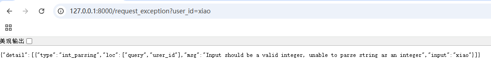

# HTTPException 异常

&emsp;&emsp;`HTTPException` 主要是对客户端前端校验抛出指定 HTTP 响应状态异常：

+ 基于用户权限校验抛出 `403` 状态码，这表示当前客户端无访问权限
+ 基于资源访问抛出 `404` 状态码，这表示找不到对应路由

&emsp;&emsp;这些异常通常都需要抛出，以告知客户端错误状态码及错误信息。如果需要手动抛出异常，则需要使用 `raise` 关键字，而不能直接通过 `return` 返回异常。一般通过 `raise` 抛出异常之后，再对具体异常类型及异常信息进行分析，最后进行 `return` 处理。

&emsp;&emsp;`HTTPException` 是基于 `StarletteHTTPException` 实现的，本质就是 `Exception` 的子类。它的参数主要包括：

+ <font color=orchid>**detail：**</font>异常信息详细描述，它支持 `Any` 类型，所以它的值既可以是 `list`，也可以是 `dict`，还可以是字符串等
+ <font color=orchid>**status_code：**</font>异常 `HTTP` 状态码值
+ <font color=orchid>**headers：**</font>响应报文头信息（<font color=red>这是 FastAPI 新增的部分</font>）

```python
@app.get("/http_exception")  
async def http_exception(username: str = Query(default="noauth"))  
    if username == "noauth":  
        raise HTTPException(status_code=403,  
                            headers={"x-auth":"NO AUTH"},  
                            detail={  
                                "code": "403",  
                                "message": "你没有权限访问资源！"  
                            })  
    return {"code": "200"}
```

+ 通过 `app.get()` 装饰器定义了一个路由，且路由地址为`/http_exception`
+ 通过 `app.get()` 装饰器绑定了一个名为 `http_exception` 的视图函数，在 `http_exception()` 视图函数中声明了一个 `username` 查询参数，默认值为 `noauth`
+ 当访问路由时，若默认没有提交 `username` 查询参数值，则在视图函数内部会直接抛出 `raise HTTPException` 异常，并且在响应报文头中写入 `x-auth` 头信息

&emsp;&emsp;在上面的示例中直接抛出了 `HTTPException` 异常，但是没有对它抛出的异常信息进行拦截处理，这种机制在实际工作中的使用较少。通常需要对抛出的异常信息进行提取、加工和分析之后才能抛出 `JSON` 格式的数据。可以通过全局异常拦截的方式覆盖并重写 `raise HTTPException` 抛出的异常：

```python
@app.exception_handler(HTTPException)  
async def http_exception_handler(request: Request, exc: HTTPException):  
    return JSONResponse(status_code=exc.status_code, content=exc.detail, headers=exc.headers)  
  
@app.get("/http_exception")  
async def http_exception(username: str = Query(default="noauth"))  
    if username == "noauth":  
        raise HTTPException(status_code=403,  
                            headers={"x-auth":"NO AUTH"},  
                            detail={  
                                "code": "403",  
                                "message": "你没有权限访问资源！"  
                            })  
    return {"code": "200"}
```

&emsp;&emsp;通过 `@app.exception_handler(HTTPException)` 进行一个全局异常的捕获处理，当手动抛出 `HTTPException` 异常时，FastAPI 会对此类异常进行拦截处理，并进入 `http_exception_handler()` 函数。在该函数内部会对异常信息进行提取处理，然后通过 `JSONResponse` 进行响应报文封装输出并返回。

# RequestValidationError 错误

&emsp;&emsp;`RequestValidationError` 主要是因为校验客户端提交的 `Request` 参数不合规才会抛出的错误，比如：

+ 参数类型不符
+ 参数值长度不符
+ 参数格式不符

&emsp;&emsp;对 `Body`、`From`、`Path`、`Query` 等参数进行解析读取时，如果参数不符合要求，则会抛出 `RequestValidationError` 错误：

```python
from fastapi import FastAPI
app = FastAPI()

@app.get("/request_exception")
async def request_exception(user_id: int):
	return {"user_id": user_id}
```

&emsp;&emsp;在上面的代码中，在 `request_exception()` 视图函数中声明了一个 `user_id` 参数，且该参数是 `int` 类型的，如果传输的 `user_id` 非 `int` 类型则会抛出参数校验错误。



+ 错误位置是 `query` 参数 `user_id`
+ 错误类型是 `integer`
+ 错误描述信息中指出了当前 `user_id` 的值不是一个 `int` 类型的值

&emsp;&emsp;对参数进行校验得到 `RequestValidationError` 错误主要是结合 `Pydantic` 来实现的。对于所有的异常和错误 FastAPI 都提供了一个全局捕获拦截的机制，所以这里可以使用类似覆盖 `HTTPException` 异常的处理机制对 `RequestValidationError` 错误进行覆盖拦截处理：

```python
@app.exception_handler(RequestValidationError)  
async def validation_exception_handler(request: Request, exc: RequestValidationError):  
    return JSONResponse({'mes': '触发了 RequestValidationError 错误，错误信息：%s ！' % (str(exc))})
```

&emsp;&emsp;通过 `@app.exception_handler(RequestValidationError)` 进行全局 `RequestValidationError` 错误的捕获处理。当程序运行到参数校验阶段时，如果传入的参数 `user_id` 不是 `int` 类型，那么就会抛出 `RequestValidationError` 错误，此时 FastAPI 会对此类错误进行拦截处理，并进入 `validation_exception_handler()` 函数，在函数内部对错误信息进行提取处理后，通过 `JSONResponse` 进行响应报文封装输出。

# 自定义异常

<font color=orachid>**（一）自定义异常的实现**</font>

&emsp;&emsp;在 FastAPI 框架中错误及异常都继承自 `Exception`，所以自定义异常也可以继承自 `Exception` 或者其他已实现的 `Exception` 类的子类：

```python
class CustomException(Exception):  
    def __init__(self, message: str):  
        self.message = message  
  
  
@app.exception_handler(CustomException)  
async def custom_exception_handler(request: Request, exc: CustomException): 
    return JSONResponse(content={'message': exc.message})  
  
  
@app.get("/custom_exception")  
async def read_unicorn(name: str = 'noauth'):  
    if name == 'noauth':  
        raise CustomException(message='抛出自定义异常')  
    return {'name': name}
```

&emsp;&emsp;在上述代码中自定义了一个 `CustomException` 异常，并且通过 `@app.exception_handler(CustomException)` 装饰器进行了全局 `CustomException` 异常的捕获处理。当程序抛出 `CustomException` 异常时，FastAPI 会对此类异常进行拦截处理，并进入 `custom_exception_handler()` 函数，在函数内部对异常信息进行提取处理后，通过 `JSONResponse` 进行响应报文封装输出。

<font color=orachid>**（二）自定义内部错误码和异常**</font>

&emsp;&emsp;在一些 API 开发规范中，通常使用返回错误码的方式来对问题进行描述。通过此方式，开发人员可以对错误进行快速定位，引导开发人员根据错误提示进行相应处理。

&emsp;&emsp;下面介绍设置自己的内部错误码机制的步骤：

&emsp;&emsp;首先通过 `enum` 来枚举错误码及错误描述，在一些 API 设计规范中，通常的做法是给每一条产线都分配不同的错误码区间，通过划分区间来有效避免出现重复错误码：

```python
from enum import Enum  
class ExceptionEnum(Enum):  
    SUCCESS = ("0000", "OK")  
    FAILED = ("0001", "Fail")  
    USER_NOT_FOUND = ("0010", "User Not Found")
```

&emsp;&emsp;定义好对应的错误码区间后，根据错误码来自定义异常类，在自定义的异常类中初始声明 `err_code` 和 `err_code_des` 两个参数：

+ `err_code` 用于定义错误区间内的错误码
+ `err_code_des` 对应错误区间码内的错误描述

```python
class BusinessError(Exception):  
    def __init__(self, result: ExceptionEnum = None, err_code: str = "0000", err_code_desc:str = ""):  
        if result:  
            self.err_code = result.value[0]  
            self.err_code_desc = result.value[1]  
        else:  
            self.err_code = err_code  
            self.err_code_desc = err_code_desc  
        super().__init__(self)
```

&emsp;&emsp;有了自定义的 `BusinessError` 之后，就要添加全局错误拦截了，主要对自定义的异常类 `BusinessError` 进行拦截、覆盖、重写，再对返回的错误信息进行提取，最后通过 `JSONResponse` 封装以便按固定的格式返回：

```python
@app.exception_handler(BusinessError)  
async def custom_exception(requset: Request, exc: BusinessError):  
    return JSONResponse(content=exc.err_code_desc)  
  
@app.get("/custom_exception")  
async def custom_exception(name:str = "noauth"):  
    if name == "noauth":  
        raise BusinessError(ExceptionEnum.USER_NOT_FOUND)  
    return {"name": name}
```

# 中间件抛出自定义异常

&emsp;&emsp;FastAPI 框架有一种中间件，主要用于处理类似 Flask 框架中请求前和响应后的钩子函数。在中间件抛出异常的情况下，是无法通过全局异常类拦截自定义异常的：

```python
class CustomException(Exception):  
    def __init__(self, message: str):  
        self.message = message  
  
  
@app.middleware("http")  
async def http_middleware_handler(request: Request, call_next):  
    # 故意直接抛出异常  
    raise CustomException("自定义异常")  
    response = await call_next(request)  
    return response  
  
  
@app.exception_handler(CustomException)  
async def custom_exception_handler(request: Request, exc: CustomException):  
    print("触发自定义异常...")  
    return JSONResponse(content={"message": exc.message})  
  
  
@app.get("/index")  
async def index():  
    return {"message": "Hello"}
```

&emsp;&emsp;上面代码新增了一个中间件 `http_middleware_handler` ，当有请求进入时，首先会进入 `http_middleware_handler` 中间件，在这个中间件中直接抛出自定义 `CustomException` 异常。此时，控制台会抛出异常信息，但是全局异常错误 `custom_exception_handler` 并没有捕获到自定义的 `CustomException` 异常。无法捕获的根本原因是 <font color=red>FastAPI 框架在底层中对所有任何类型的中间件抛出的异常，都统归到顶层的 ServerErrorMiddleware 中间件进行捕获</font>，而在 `ServerErrorMiddleware` 中间件中捕获到的异常都以 `Exception` 的方式抛出。

```python
@app.exception_handler(Exception)  
async def custom_exception_handler(request: Request, exc: Exception):  
    if isinstance(exc, CustomException):  
        print("触发全局自定义的 CustomException")  
    return JSONResponse(content={"message": exc.message})
```

&emsp;&emsp;此时再访问API，就会发现在中间件中手动抛出的自定义异常类被 `@app.exception_handler(Exception)` 给截获了。

><font color=orange>**注意：**</font> 使用这种在中间件抛出自定义异常的处理方式时，在控制台中暂时无法消除异常输出，所以对于中间件，建议直接返回对应的响应报文内容。
