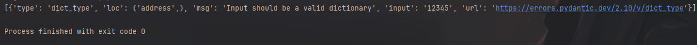
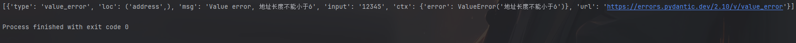

# Pydantic 介绍

&emsp;&emsp;<font color=red>Pydantic 是一个使用 Python 类型注解进行数据验证和管理的模块</font>，它可以在代码运行时强制进行类型验证，当数据类型不符或数据无效时抛出友好的错误提示。FastAPI 框架整合了 `Pydantic`，为开发者提供更多便利：

+ 支持使用 Python 的类型提示来定义数据模型，这使得代码更加易于阅读和维护
+ 提供了一些内置的验证器，可以对输入数据进行验证，确保输入的数据类型、格式、范围等符合预期
+ 自动解析并验证请求中的视图函数参数、查询参数以及 `Body` 参数等
+ 支持复杂数据结构定义以及验证
+ 相比 `valideer` 库、`marshmallow` 库、`trafaret` 库以及 `cerberus` 库等，在速度上更具优势
+ 支持字段进行自定义验证
+ 基于 `BaseSettings` 类，读取系统设置的环境变量值，还可以对其进行数据验证
+ 基于 `BaseModel` 基类，再结合数据库 `ORM` 可以进行序列化和反序列化操作，在操作过程中还可以对相关字段进行过滤
+ `Pydantic` 可以自动生成 API 文档，包括请求和响应的数据类型

&emsp;&emsp;`Pydantic` 的应用场景包括：

+ <font color=orchid>**Web框架：**</font> `Pydantic` 可以帮助开发人员定义请求和响应数据模型以及执行数据验证和转换；`Pydantic` 还可以自动生成 API 文档，包括请求和响应的数据模型
+ <font color=orchid>**数据库访问：**</font> `Pydantic` 可以帮助开发人员定义 `ORM` 模型，并进行数据验证和转换
+ <font color=orchid>**数据分析：**</font> `Pydantic` 可以帮助开发人员处理数据集，进行数据验证和转换

# Pydantic 的使用

&emsp;&emsp;使用前需要安装：

```shell
pip install pydantic
```

&emsp;&emsp;如果需要基于 `Pydantic` 的 `BaseSettings` 类来读取环境变量，那么还需要安装 `dotenv` 库。通常在安装 FastAPI 框架时默认已经安装了对应的依赖库，如果没有安装，则可以通过以下命令来安装：

```shell
pip install pydantic[dotenv]
```

## 模型常见数据类型

&emsp;&emsp;在使用 `Pydantic` 定义模型对象时，其中的每一个模型对象都继承于 `BaseModel` 类，且模型类中的每一个属性都有自己的数据类型。常见的数据类型有 `bool`、`int`、`str`、`bytes`、`list`、`tuple`、`dict`、`set` 等，`Pydantic` 还支持 `datetime`、`FilePath`、`DirectoryPath`、`EmailStr`、`NameEmail`（邮箱格式类型）​、`Color`、`AnyUrl`（任意网址）​、`HTTPUrl`、`Json`、`IPvAnyAddress`、`IPvAnyNetwork`、`SecretStr` 和 `SecretBytes`（敏感数据类型）等特殊数据类型：

```python
from pydantic import BaseModel, DirectoryPath, \  
    IPvAnyAddress, \  
    FilePath, \  
    EmailStr, \  
    HttpUrl, Json, \  
    NameEmail, SecretStr, SecretBytes  
  
from datetime import date  
  
  
class Person(BaseModel):  
    # 基础类型  
    name: str       # 字符串类型  
    age: int        # 整型类型  
    enable: bool    # 布尔类型  
    hobby: list     # 列表类型  
    address: dict   # 字典类型  
    birthdate: date # datetime 中的时间类型  
  
    # 其它复杂的对象类型  
    filePath: FilePath      # 文件路径类型  
    directoryPath: DirectoryPath    # 文件目录类型  
    ip: IPvAnyAddress   # IP 地址类型  
    emailStr: EmailStr  # 电子邮件地址类型  
    nameEmail: NameEmail    # 有效格式的电子邮件地址类型  
    secretStr: SecretStr    # 用于表示敏感数据，如密码、API秘钥等，SecretStr类型继承自str类型，但是打印和序列化时会替换为 "*" 或其他指定的占位符，以保护敏感信息的安全性  
    secretBytes: SecretBytes # 用于表示二进制格式的敏感数据，如加密秘钥、数字签名等。SecretBytes类型继承自 bytes 类型，但是在打印和序列化时会替换为 "*" 或其他指定的占位符，以保护敏感信息的安全性  
  
    website: HttpUrl    # URL 请求地址  
    json_obj: Json      # JSON 对象类型
```

&emsp;&emsp;通过上面的代码定义了一个 Person 模型类，并定义了这个模型的各种属性，这些属性就是常用的数据类型。

## 模型参数必选和可选

&emsp;&emsp;在上面的 `Person` 案例中，对模型的属性没有进行任何赋值操作，在 Pydantic 内部会默认把这些值对应的字段设置为必传的字段。但是在实际应用中，有可能不需要对所有字段进行这种校验，比如对于有默认值的字段或者处于可选状态的字段。可以通过下面的方式来进行参数字段的声明和赋值：

```python
class Person(BaseModel):  
    name: str  
    age: Optional[int]  
    age2: Optional[int] = None  
    gender: str = "男"  
    idnum: Union[str, int]  
    dict_str_float_parse: Dict[str, float] = None
```

+ `name` 参数的值是字符串类型，这是一个必填参数，也就是说实例化必须传入 `name` 的值
+ `age` 参数由于使用 `Optional` 来声明，所以它是一个选填参数。如果它存在值，则必须是一个 `int` 类型的值。`Optional` 在这里主要表示当前参数是可选类型的参数
+ `age2` 参数和 `age` 参数一样，只是 `age2` 参数显式设置了一个默认值 `None`
+ `gender` 参数也是一个选填参数，如果没有指定传值，则默认的值是 “男”
+ `idnum` 参数使用 `Union` 声明后，表示该参数是一个必填项，且参数类型有 `int` 类型或者 `str` 类型，不过它内部会强制仅限于 `Union[int, str]` 中所描述的数据类型，`Union` 主要为 `IDE` 做一个比较友好的提示，方便开发者知道这个参数建议的值是什么类型
+ `dict_str_float_parse` 参数则使用 `dict` 字典来声明，且对键值对类型也进行了声明

## 模型多层嵌套

&emsp;&emsp;在实际应用场景中有可能需要模型嵌套或更深层次的嵌套，`Pydantic` 对这些嵌套模型都是可以支持的：

```python
class Card(BaseModel):  
    number: str  
  
  
class Person(BaseModel):  
    name: str  
    age: Optional[int]  
    cards: Optional[List[Card]]
```

&emsp;&emsp;在 `Person` 模型中内嵌了一个 `Card` 列表类型对象，且声明它是一个可选参数。

## 模型对象实例化

&emsp;&emsp;完成模型的定义之后，下面介绍模型实例化：

```python
class Person(BaseModel):  
    name: str  
    nums: str  
    age: Optional[int]  
  
  
if __name__ == '__main__':  
    user = Person(name="John", nums="4", age=18)  
    print(user.name, user.age)
```

&emsp;&emsp;在上面的代码中，实例化 `Person` 对象非常简单，只需要传入具体参数即可完成对象创建。但是在一些复杂业务场景中，需要基于一些已有的对象来完成模型对象的实例化。`BaseModel` 提供了非常多的方法让用户可以结合不同的业务场景来实现模型对象的创建，它提供的主要静态方法如下：

+ <font color=orchid>**BaseModel.parse_obj()：**</font>传入字典，完成对象初始化，该方法和实例化传参方式基本一样，只是要求传参类型必须是字典
+ <font color=orchid>**BaseModel.parse_raw()：**</font>传入字符串或字节对象，自动解析为 `JSON` 对象，然后完成对象初始化
+ <font color=orchid>**BaseModel.parse_file()：**</font>基于文件对象方式解析并完成对象初始化
+ <font color=orchid>**BaseModel.parse_orm()：**</font>从数据库 `ORM` 模型对象中实例初始化对象

## 模型对象的转换

&emsp;&emsp;当模型对象实例化完成后，在某些业务场景中经常需要对模型对象进行一些数据格式转换，比如转换为 `dict` 或 `JSON` 格式的数据，转换后可以方便用户将其作为数据库的模型进行数据处理：

```python
class Person(BaseModel):  
    name: str  
    password: str  
    age: int  
    enable: bool = True  
  
  
if __name__ == '__main__':  
    user = Person(name="John", password="123456", age=18, enable=False)  
    print(user.dict())
    # {'name': 'John', 'password': '123456', 'age': 18, 'enable': False}
```

&emsp;&emsp;`dict()` 方法可以把对象转换为原生的字典对象。转换输出过程中存在一个比较敏感的安全问题，就是密码字段信息也被转换输出了，虽然可以删除转换后字典中的键值来解决上述问题，但是这种处理方式略显麻烦。`dict()` 方法可提供非常多的可选参数以进行转换功能的扩展，比如它可以对一些字段属性进行各种过滤条件的设置：

```python
class Person(BaseModel):  
    name: str  
    password: str  
    age: int  
    enable: bool = True  
  
  
if __name__ == '__main__':  
    user = Person(name="John", password="123456", age=18, enable=False)  
    print(user.dict())  
    print(user.dict(include={"name", "age"}))  
    print(user.dict(exclude={"password"}))
```

+ <font color=orchid>**include={'name','age'}：**</font> 表示包含输出哪些字段参数
+ <font color=orchid>**exclude={'password'}：**</font> 表示要排除哪些字段参数

&emsp;&emsp;模型类实例化后的对象提供的 `json()` 方法就是对 `dict()` 方法进行一次再转换输出。在 `model.dict()` 和 `model.json()` 方法中除了 `include` 和 `exclude` 参数，还有其他更多参数：

+ <font color=orchid>**include：**</font> 表示在转换返回字典时需要包含的字段
+ <font color=orchid>**exclude：**</font> 表示在转换返回字典时需要排除过滤字段
+ <font color=orchid>**by_alias：**</font> 表示如果字段参数有别名，那么返回的字典是否应该在字典中作为键，默认值是 `False`
+ <font color=orchid>**exclude_unset：**</font> 表示在转换返回字典时是否排除模型对象实例化时未显式设置参数值的字段，默认值为 `False`
+ <font color=orchid>**exclude_defaults：**</font> 表示在转换返回字典时是否排除在模型中存在默认值设置的字段，默认值为 `False`
+ <font color=orchid>**exclude_none：**</font> 表示在转换返回字典时是否排除字段参数值等于 `None` 的字段，默认值为 `False`

&emsp;&emsp;`model.json()` 比 `model.dict()` 多几个参数，对多出的几个参数说明如下：

+ <font color=orchid>**encoder：**</font>表示在转换输出 `JSON` 时（也就是使用 `json.dumps()` 时）使用的自定义编码器
+ <font color=orchid>**\*\*dumps_kwargs：**</font>表示在转换输出 `JSON` 时自定义一些其他关键字字段信息
+ <font color=orchid>**models_as_dict：**</font>表示在转换输出 `JSON` 时，模型是否作为字典序列化对象进行序列化操作

## 模型对象的复制

&emsp;&emsp;除了 `dict()` 和 `json()` 方法，在一些场景中可能还需要进行一些模型实例化对象的复制，此时就需要用到 `copy()` 了：

```python
class Person(BaseModel):  
    name: str  
    password: str  
    age: int  
    enable: bool = True  
  
  
if __name__ == '__main__':  
    user = Person(name="John", password="123456", age=18, enable=False)  
    new_user = user.copy()  
    print("userID",user, id(user))  
    print("new_userID",new_user, id(new_user))  
    # 仅包含密码输出  
    new_user = user.copy(include={"password"})  
    print("new_user",new_user)  
    print("new_userID", new_user, id(new_user))
```

## 异常信息的捕获

&emsp;&emsp;在实例化的过程中，Pydantic 会自动解析参数并进行数据类型和其他限制条件的验证，如果出现校验异常，会触发 `ValidationError` 错误：

```python
class Person(BaseModel):  
    name: str  
    nums: str  
    age: Optional[int]  
  
  
if __name__ == '__main__':  
    user = Person(name="andy")  
    print(user.name)
```

&emsp;&emsp;执行以上代码会抛出异常，`nums` 是一个必选参数，由于实例化没有传参赋值，所以此时触发 `ValidationError` 异常。对于这种异常信息，如果需要在程序中知道具体的错误明细，则可以通过捕获抛出的 `ValidationError` 异常对象进行解析：

```python
class Person(BaseModel):  
    name: str  
    nums: str  
    age: Optional[int]  
  
  
if __name__ == '__main__':  
    try:  
        user = Person(name="John")  
    except ValidationError as e:  
        print(e.errors())  
        print(e.json())  
        print(str(e))  
    else:  
        print(user.name, user.nums, user.age)
```

&emsp;&emsp;上面代码中通过 `try…except…` 来捕获 `ValidationError` 异常，`ValidationError` 异常对象本身提供了一些方法来获取所有错误及其发生方式的信息：

+ <font color=orchid>**e.errors()：**</font> 通过列表的形式返回所有的错误信息内容
+ <font color=orchid>**e.json()：**</font> 通过将 `e.errors()` 的列表错误显示进行 `JSON` 格式化并返回

&emsp;&emsp;除此之外，还可以直接把错误的对象通过 `str(e)` 字符串格式化并输出。

&emsp;&emsp;一个 `ValidationError` 中的错误项对象就是一个字典，字典所包含的属性如下：

+ <font color=orchid>**loc：**</font> 表示出现校验错误的字段名称​
+ <font color=orchid>**msg：**</font> 表示出现校验错误的原因
+ <font color=orchid>**type：**</font> 表示错误类型

## 用 Field() 函数扩展更多复杂验证

&emsp;&emsp;Pydantic 提供了一个 `Field()` 函数，用它可以增加更多的其他辅助验证约束规则：

+ <font color=orchid>**default：**</font> 表示定义字段参数默认值
+ <font color=orchid>**default_factory：**</font> 表示定义一个创建默认值的工厂方法，通过这个方法可以动态进行默认值的设置（<font color=red>禁止同时设置 default 和 default_factory </font>）
+ <font color=orchid>**alias：**</font> 表示定义字段参数的别名
+ <font color=orchid>**title：**</font> 表示定义字段参数的标题，如果没有，则默认是字段属性的值
+ <font color=orchid>**description：**</font> 表示定义字段参数描述
+ <font color=orchid>**exclude：**</font> 表示模型转换为 `JSON` 或 `dict` 时，转换结果中要排除此字段，不输出
+ <font color=orchid>**include：**</font> 表示模型进行转换为 `JSON` 或 `dict` 的时候，转换结果中要包含此字段信息的输出
+ <font color=orchid>**gt：**</font> 是一种校验规则，表示定义该字段参数的值需要大于某个 `float` 类型的值
+ <font color=orchid>**ge：**</font> 是一种校验规则，表示定义该字段参数的值需要大于或等于某个 `float` 类型的值
+ <font color=orchid>**lt：**</font> 是一种校验规则，表示定义该字段参数的值需要小于某个 `float` 类型的值
+ <font color=orchid>**le：**</font> 是一种校验规则，表示定义该字段参数的值需要小于或等于某个 `float` 类型的值
+ <font color=orchid>**multiple_of：**</font> 是一种校验规则，表示定义该字段参数的值强制设置为值的倍数，比如: `multiple_of=5`，则该参数值必须是 5 的倍数
+ <font color=orchid>**max_digits：**</font> 是一种校验规则，表示定义该字段参数的值位数（不考虑小数点的位数）不能大于设定的值，如参数值为 569.23，而 `max_digits` 限制位数为 2，则此时该值就会通过异常提示不能超过两位数
+ <font color=orchid>**decimal_places：**</font> 是一种校验规则，表示该字段参数值中如果包含小数点，那么该值中允许的最大位数不能超过设定的值。如果参数值为 3.952，但是 `decimal_places` 限制小数点位数为2，那么该值就会受限；如果参数值为 3.95，则可以通过
+ <font color=orchid>**min_items：**</font> 是一种校验规则，表示该字段参数值如果是一个列表类型，那么它包含的列表内容至少需要设定的值，如 `name: List[str]=Field(...，min_items=2)`，而 `name=['xiao']​` ，那么只有一项内容时不符合要求
+ <font color=orchid>**max_items：**</font> 是一种校验规则，和 `min_items` 相反，表示该字段参数值如果是一个列表类型，那么它包含的列表内容最多不能超过设定的值，如 `name:List[str]=Field(...,min_items=1)` ，而 `name=['xiao'，'andy']` ​，只有两项内容，已超过了一项的限制，所以不符合要求
+ <font color=orchid>**unique_items：**</font> 是一种校验规则，用于指定列表类型字段中的值是否唯一。如果 `unique_items` 为 `True`，则列表类型字段中的值必须是唯一的；如果为 `False`，则列表类型字段中的值可以重复。如 `name:List[str]=Field(...,unique_items=True)`，那么此时 `name=['iii'，'iii']` 的赋值会引发重复机制验证而抛出异常
+ <font color=orchid>**min_length：**</font> 是一种校验规则，表示该字段参数值如果是一个字符串类型，则它的最小长度不能小于设定值
+ <font color=orchid>**max_length：**</font> 是一种校验规则，表示该字段参数值如果是一个字符串类型，则它的最大长度不能大于设定值
+ <font color=orchid>**allow_mutation：**</font> 表示该字段参数值是否允许修改，默认在 `Field()` 函数中允许，这里不建议在 `Field()` 函数中设置它的值为 `False`。如果在字段上设置该参数值为 `False`，Pydantic 发现未强制执行的约束，会引发错误
+ <font color=orchid>**regex：**</font> 是一种校验规则，表示该字段参数值如果是字符串类型，则需遵循正则表达式验证约束规则
+ <font color=orchid>**repr：**</font> 如果为 `False`，则该字段应从对象表示中隐藏，默认值为 `True`
+ <font color=orchid>**extra：**</font> 是可以自定义的其他参数，比如显示在可视化文档中的 `example`

```python
from typing import Union, Optional, List  
  
from pydantic import BaseModel, Field, ValidationError  
  
class User(BaseModel):  
    name: str = Field(..., title="姓名", description="姓名长度需要大于6且小于等于12", max_length=12, min_length=6, example="Foo")  
    age: int = Field(..., title="年龄", description="年龄需要大于18岁", ge=18, example=12)  
    password: str = Field(..., title="密码", description="密码长度大于6", gl=6,example="6")  
    tax: Optional[float] = Field(None, example=3.2)  
  
  
if __name__ == '__main__':  
    try:  
        user = User(name="xiaozhong", age=18, password="xxxxxxxxxxx")  
    except ValidationError as e:  
        print(e.errors())  
    else:  
        print(user.name)  
        print(user.age)  
        print(user.password)
```

&emsp;&emsp;在上面的代码中，可以针对一个字段参数添加更多验证机制。

## 自定义验证器

&emsp;&emsp;在某种场景下有可能需要针对模型中的某个参数添加更多的自定义验证逻辑，Pydantic 提供了一个 `validator` 装饰器对象。通过该装饰器，用户可以实现参数自定义验证机制：

```python
class Person(BaseModel):  
    username: str  
    password: str  
  
    @validator('password')  
    def password_rule(cls, password):  
        if len(password) < 6:  
            raise ValueError("密码长度不能小于6")  
        elif len(password) > 12:  
            raise ValueError("密码长度不能大于12")  
        return password  
  
  
if __name__ == '__main__':  
    try:  
        user = Person(username="admin", password="12345")  
    except ValidationError as e:  
        print(e.errors())  
    else:  
        print(user.username, user.password)
```

&emsp;&emsp;需要注意，在上面的验证器中，被 `@validator` 装饰的 `password_rule()` 函数的第一个参数 `cls` 指向的是模型类本身，而不是实例化的对象，而第二个参数可随意输入，它可以表示当前被校验的对象。

## 自定义验证器的优先级

&emsp;&emsp;通过 `@validator` 自定义了验证器并实现了对某个参数特定逻辑的校验，但是验证器内部逻辑是在模型完成输入参数类型的校验之后才执行的。也就是说，它先检测了 `password: str` 是否符合规则，如果符合则执行自定义的 `password_rule` 内的验证逻辑。如果处于特定场景，则需要优先执行自定义的验证器，之后才去执行对应属性要求的类型验证。可以在 `@validator` 装饰器中把 `pre=False` 修改为 `pre=True` 。修改后，自定义的 `password_rule` 内的验证逻辑就会先于 `password: str` 执行：

```python
from typing import Dict  
  
from pydantic import BaseModel, validator, ValidationError  
  
  
class Person(BaseModel):  
    username: str  
    address: Dict  
  
    @validator('address', pre=False)  
    def address_rule(cls, address):  
        if len(address) < 6:  
            raise ValueError("地址长度不能小于6")  
        elif len(address) > 12:  
            raise ValueError("地址长度不能大于12")  
        return address  
  
  
if __name__ == '__main__':  
    try:  
        user = Person(username="xiaozhong", address="12345")  
    except ValidationError as e:  
        print(e.errors())  
    else:  
        print(user.username, user.address)
```

&emsp;&emsp;此时 `@validator("address",pre=False)` 新增了 `pre` 参数值，执行上述脚本输出的结果如下：



&emsp;&emsp;上述结果说明，`adress_rule` 的自定义验证逻辑还没有被执行就已经被 `address:Dict` 的验证拦截给捕获了，所以抛出了 `type_error.dict` 异常。如果修改 `pre=True` ，再执行修改后的脚本，则输出的结果如下：



## 多字段或模型共享校验器

&emsp;&emsp;在某种业务场景下有可能在多个模型中有相同的字段，且针对各自模型中字段的校验机制是一样。针对此类情况，可以定义一个共享验证函数逻辑，然后设置校验器的 `allow_reuse=True`：

```python
from pydantic import BaseModel, validator, ValidationError  
  
  
def share_logic_auth(name: str) -> str:  
    if name == 'xiaozhong':  
        return '通过'  
    return '不通过'  
  
  
class Base(BaseModel):  
    name: str  
    # 定义校验器  
    _validator_name = validator('name', allow_reuse=True)(share_logic_auth)  
  
  
class Yuser(Base):  
    pass  
  
  
class Xuser(Base):  
    pass  
  
  
yuser = Yuser(name = "xiaozhong")  
print(yuser.name)  
xuser = Xuser(name = "_xiao")  
print(xuser.name)
```

&emsp;&emsp;在上面的代码中，定义了一个函数 `share_logic_auth()`，该函数是一个等待被装饰器使用的验证逻辑函数。在逻辑中，仅对 `name` 做了简单的逻辑判断，如果 `name=="xiaozhong"` 则返回 “通过” 字符串，如果不符合则返回 “不通过” 字符串。另外还定义了模型基类，在模型基类中通过另一种校验方式定义了一个 `validator("name",allow_reuse=True)` 校验器，然后在校验器后面传入指定要执行的校验逻辑函数 `share_logic_auth()`。

## root_validator 根验证器

&emsp;&emsp;`@validator` 验证器只针对某一个特定参数进行验证，而在某些场景下，有可能需要定义一个验证器来对所有参数一次性获取并进行相互依赖验证，此时 `root_validator` 根验证器就可以实现此类的业务场景需求：

```python
from pydantic import BaseModel, ValidationError, root_validator  
  
class User(BaseModel):  
    username: str  
    password_old: str  
    password_new: str  
  
    @root_validator  
    def check_passwords(cls, values):  
        password_old, password_new = values.get('password_old'), values.get('password_new')  
        # 新旧号码的确认匹配处理  
        if password_old and password_new and password_old != password_new:  
            raise ValueError('Passwords must match')  
        return values
```

&emsp;&emsp;上面代码中使用 `@root_validator` 来装饰 `check_passwords()` 函数，此时 `check_passwords()` 中的 `values` 参数是一个字典类型的对象，它包含了模型中定义的所有参数，所以可以直接通过参数名称来获取具体的参数值，之后完成对应的密码参数值对比校验的逻辑。`@root_validator` 和 `@validator` 验证器的用法是一样的，所以它也可以传入类似 `@validator` 中的 `pre=False` 参数。

# Pydantic 在 FastAPI 中的应用

## 模型类和 Body 的请求

&emsp;&emsp;可以通过定义 Pydantic 数据模型来应对请求参数中提交的 `Request Body` 参数，这种使用模型绑定请求体参数的方式，可以很快完成参数绑定、解析及验证：

```python
from fastapi import FastAPI  
from pydantic import BaseModel, root_validator, Field  
  
  
app = FastAPI()  
  
  
class User(BaseModel):  
    username:str = Field(..., title="姓名", description="姓名字段需要长度大于6且小于或等于12", max_length=12, min_length=6, example="Foo")  
    age:int = Field(..., title="年龄", description="年龄需要大于18岁", ge=18, example=12)  
    password_old:str = Field(..., title="旧密码", description="密码需要长度大于6", gl=6, example=6)  
    password_new: str = Field(..., title="新密码", description="密码需要长度大于6", gl=6, example=6)  
  
  
    @root_validator  
    def check_password(cls, values):  
        password_old = values['password_old']  
        password_new = values['password_new']  
        if password_old and password_new and password_old == password_new:  
            raise ValueError("passwords do not match")  
        return values  
  
@app.post("/user")  
def read_user(user: User):  
    return {  
        "username": user.username,  
        "age": user.age,  
        "password_new": user.password_new  
    }
```

&emsp;&emsp;上面的代码主要做了以下 3 件事：

+ 定义一个 `User` 模型
+ 在模型中通过 `Field` 定义相关字段属性的验证机制
+ 在模型类中使用根验证器对新旧密码做对比
 
&emsp;&emsp;把这个模型类定义到路由函数路径就可以进行 `Body` 数据参数解析和读取了。

## 模型类和依赖注入关系

&emsp;&emsp;通常模型类只能对应 `Body` 参数的解析，而一般的 `Body` 参数只用于 `POST` 方式，对于 `GET` 方法中的查询参数也可以使用模型来定义：

```python
from fastapi import FastAPI  
from pydantic import BaseModel, root_validator, Field  
  
  
app = FastAPI()  
  
  
class User(BaseModel):  
    username:str = Field(..., title="姓名", description="姓名字段需要长度大于6且小于或等于12", max_length=12, min_length=6, example="Foo")  
    age:int = Field(..., title="年龄", description="年龄需要大于18岁", ge=18, example=12)  
    password_old:str = Field(..., title="旧密码", description="密码需要长度大于6", gl=6, example=6)  
    password_new: str = Field(..., title="新密码", description="密码需要长度大于6", gl=6, example=6)  
  
  
@app.get("/user")  
def read_user(user: User):  
    return {  
        "username": user.username,  
        "age": user.age,  
        "password_old": user.password_old,  
        "password_new": user.password_new  
    }
```

&emsp;&emsp;在上面的代码中把 `@app.post("/user")` 修改为了 `@app.get("/user")` 来启动服务，在 `GET` 请求中模型类依然被当作 `Body` 参数进行提交，执行如下请求命令：

```shell
curl -X 'GET' \
	'http://127.0.0.1:8000/user' \
	-H 'accept: application/json' \
	-H 'Content-Type: application/json' \
	-d '{
	"username": "andy",
	"age": 12,
	"password_old": "123",
	"password_new": "234"
	}'
```

&emsp;&emsp;最终 API 无法正常解析、读取提交的参数值，提示的错误信息如下：

```shell
TypeError: Falied to execute 'fetch' on 'Window': Request with GET/HEAD method cannot have body.
```

&emsp;&emsp;上述结果表明不能在有 `GET/HEAD` 方式的请求中使用 `Body` 参数进行提交。按最初的预想，需要把模型类中定义的参数转换为查询参数，以方便结合 `GET/HEAD` 方式请求来使用。此时可以结合依赖注入来实现对应的转换：

```python
@app.get("/user")  
def read_user(user: User = Depends()):  
    return {  
        "username": user.username,  
        "age": user.age,  
        "password_old": user.password_old,  
        "password_new": user.password_new  
    }
```

&emsp;&emsp;在上面的代码中把 `def read_user(user: User)` 修改为了 `def read_user(user: User=Depends())` ，也就是对模型类进行了依赖注入项的转换，模型类经过依赖注入转换后，已经自动把模型中定义的字段转换为了 `GET` 请求中所需的查询参数。

&emsp;&emsp;另外，当 API 要求使用 `POST`、`PUT` 等方法请求提交 `Body` 参数，又需要进行查询参数或其他自定义请求头参数提交时，也可以采取上面的这种把模型类进行依赖项转换的方式进行处理。这种情况常见的场景为提交文件的同时又需要提交其他参数：

```python
class FileGet(BaseModel):
	username:str = Field(..., title="姓名")
	file:UploadFile = File(...)

@app.post("/file_get")
async def file_get(user: FileGet=Depends()):
	return {
		"username": user.username,
		"filename": user.file.filename
	}
```

## 模型 Config 类和 ORM 转化

&emsp;&emsp;在 Pydantic 模型类中有一个 `Config` 类，它可以为 Pydantic 模型扩展更多的定制行为：

+ <font color=orchid>**title：**</font>表示指定生成 `JSON` 格式的标题（使用 `BaseModel.schema_json` 返回 `JSON` 字符串中的 `title` ）​
+ <font color=orchid>**anystr_strip_whitespace：**</font>表示 `str` 类型的字符是否自动去除前面和后面存在的空格（默认值：`False`）​
+ <font color=orchid>**anystr_lower：**</font>表示所有的 `str` 字符是否自动转换为小写，默认值为 `False`，即不转换
+ <font color=orchid>**max_anystr_length：**</font>表示所有的 `str` 字符允许设置的最大长度，默认值为 `None`
+ <font color=orchid>**min_anystr_length：**</font>表示所有的  `str` 字符允许设置的最小长度，默认值为 `0`
+ <font color=orchid>**validate_all：**</font>表示是否验证字段的默认值，默认值为 `False`，即不验证
+ <font color=orchid>**extra：**</font>表示在模型初始化期间是否忽略、允许、禁止等额外参数的传入。支持字符串，也可以直接使用 `Extra` 枚举对象，其他具体的配置项说明如下：
	+ <font color=orchid>**ignore：**</font>表示传递额外参数不会抛出异常，但是模型实例对象不会包含额外属性
	+ <font color=orchid>**allow：**</font>表示允许传递额外参数，且模型实例对象可以获取额外属性
	+ <font color=orchid>**forbid：**</font>表示不允许传递任何额外参数
+ <font color=orchid>**fields：**</font>表示当前模型类型包含字段的所有架构信息
+ <font color=orchid>**allow_mutation：**</font>表示模型字段参数的初始值是否允许被修改，它是一个全局配置模式
+ <font color=orchid>**use_enum_values：**</font>表示是否允许使用枚举的属性（非原始枚举）填充模型
+ <font color=orchid>**validate_assignment：**</font>表示是否对当前模型类属性的分配执行验证（默认值：`False`）​
+ <font color=orchid>**allow_population_by_field_name：**</font>表示模型中是否允许使用字段名称来填充模型字段
+ <font color=orchid>**error_msg_templates：**</font>表示对应自定义错误消息模板。它可以覆盖默认消息模板
+ <font color=orchid>**from_attributes：**</font>表示是否允许从 `ORM` 生成模型
+ <font color=orchid>**schema_extra：**</font>表示自定义扩展/更新生成的 `JSON` 模式信息，一般在可视化交互文档中展示出来
+ <font color=orchid>**json_loads：**</font>用于在模型转换为 `JSON` 时自定义解码 `JSON` 的函数
+ <font color=orchid>**json_dumps：**</font>用于在模型中自定义编码 `JSON` 的函数
+ <font color=orchid>**json_encoders：**</font>用于在模型转换时自定义编码的方式
+ <font color=orchid>**underscore_attrs_are_private：**</font>表示是否所有非 `ClassVar` 下画线属性都将被视为私有，还是保持原样

&emsp;&emsp;对于上面的各配置项，需要根据实际业务进行配置。在实际业务场景中，Pydantic 模型除了应用于参数绑定解析，还可以结合 `SQLAlchemy` 中的 `ORM` 模型类对 Pydantic 模型对象进行绑定输出。通常使用 `SQLAlchemy` 查询具体记录，但是需要把查询结果转换为字典或 `JSON` 对象进行返回，通过 `Config` 类中的配置项可以把 `ORM` 模型类直接转换为 Pydantic 模型，不再需要对 `ORM` 模型做特殊处理：

```python
from sqlalchemy import Column, Integer, String  
from sqlalchemy.orm import declarative_base  
from pydantic import BaseModel, Field  
  
# ORM 模型基类  
Base = declarative_base()  
  
  
# ORM 模型类定义  
class UserSqlalchemyOrmModel(Base):  
    # 表名称  
    __tablename__ = 'user'  
    # 表字段  
    id = Column(Integer, primary_key=True, nullable=False) # 定义 ID    userid = Column(String(20), index=True, nullable=False, unique=True) # 创建索引  
    username = Column(String(32), index=True, unique=True)  
  
  
class UserPydanticModel(BaseModel):  
    id:int  
    userid:str = Field(..., title="用户ID", description="用户ID字段需要长度大于6且小于或等于20", max_length=20, min_length=6, example="0000001")  
    username: str = Field(..., title="用户名称", description="用户名字段需要长度大于6且小于或等于32", max_length=20, min_length=6, example="0000001")  
  
    class Config:  
       from_attributes = True  
  
  
  
# 创建 ORM 类的对象  
user_orm = UserSqlalchemyOrmModel(id=123, userid="1000001001", username="andywu")  
# 从 ORM 类的对象实例化 UserPydanticModel 的模型对象  
print(UserPydanticModel.model_validate(user_orm))
```

&emsp;&emsp;在上面的代码中，通过引入 `SQLAlchemy` 并定义一个 `ORM` 的模型类 `UserSqlalchemyOrmModel` 来定义基于 Pydantic 的模型类 `UserPydanticModel`，最关键的是在 `UserPydanticModel` 类内部通过配置  `Config` 类开启了从 `ORM` 模型中实例化 Pydantic 的 `Mode` 模型的服务。这个操作是通过配置 `from_attributes=True` 来实现的，只有开启此属性配置，才可以正常调用 Pydantic 的 `Mode` 模型提供的 `model_validate()` 方法。