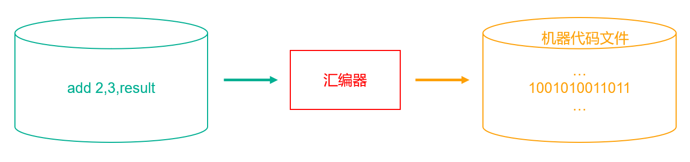
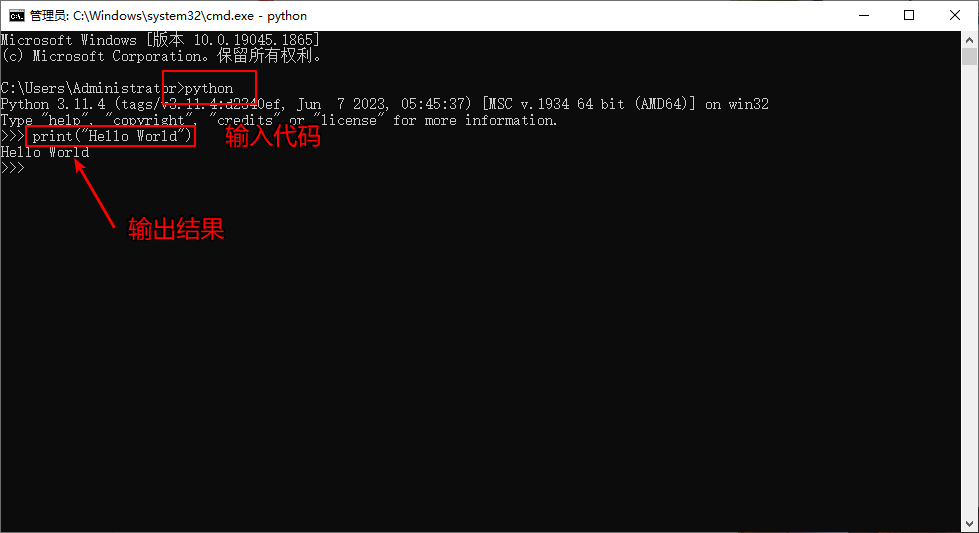
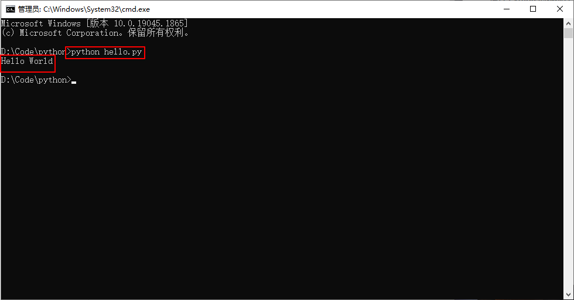

# 计算机基础知识

## 计算机的组成

&emsp;&emsp;计算机俗称电脑，是现代一种用于高速计算的电子计算机器，可以进行数值计算、进行逻辑计算、具有存储记忆功能，是能够按照程序运行自动、高速处理海量数据的现代化智能电子设备。由硬件系统和软件系统组成，没有安装任何软件的计算机称为裸机。

### 计算机硬件

&emsp;&emsp;计算机硬件是指计算机系统中由电子、机械和光电元件等组成的各种物理装置的总称。这些物理装置按系统结构的要求构成一个有机整体为计算机软件运行提供物质基础。计算机硬件由运算器、控制器、存储器、输入设备和输出设备等五个逻辑部件组成：

+ 运算器：运算器由算术逻辑单元、累加器、状态寄存器、通用寄存器组等组成。其中，算术逻辑运算单元的基本功能为四则运算（加、减、乘、除）、逻辑操作（与、或、非、异或等）以及移位、求补等操作；
+ 控制器：控制器是整个计算机系统的控制中心，它指挥计算机各部分协调地工作，保证计算机按照预先规定的目标和步骤有条不紊地进行操作及处理；
+ 中央处理器：中央处理器（CPU）由运算器和控制器组成，分别由运算电路和控制电路实现，是任何计算机系统中必备的核心部件；
+ 存储器：存储器是计算机系统中的记忆设备，用来存放程序和数据。计算机中全部信息（包括输入的原始数据、计算机程序、中间运行结果和最终运行结果）都保存在存储器中。它根据控制器指定的位置存入和取出信息，有了存储器计算机才有记忆功能，才能保证正常工作；
+ 输入设备：输入设备是向计算机输入数据和信息的设备，是计算机与用户或其他设备通信的桥梁。输入设备是用户和计算机系统之间进行信息交换的主要装置之一；
+ 输出设备：输出设备是计算机的终端设备，用于接收计算机数据的输出显示、打印、声音、控制外围设备操作等，也就是把各种计算结果数据或信息以数字、字符、图像、声音等形式表示出来。

### 计算机软件

&emsp;&emsp;软件是一系列按照特定顺序组织的计算机数据和指令的集合，软件一般被划分为系统软件、应用软件和介于这两者之间的中间件：

+ 系统软件：系统软件包括各类操作系统（如 Dos、windows、Linux、UNIX、Mac、Android、IOS等）、操作系统的补丁程序及硬件驱动程序；
+ 应用软件：应用软件可以细分的种类就更多了，如 QQ、微信等都属于应用软件类。

## 程序和编程语言 

&emsp;&emsp;当我们要让计算机帮我们解决问题时就需要编写程序。程序是一组计算机能识别和执行的指令，这些指令由数字、字符和语法规则组成，它通常是用某种计算机编程语言编写的，计算机编程语言便是我们与计算机沟通的工具。计算机只能执行二进制代码，想要让计算机理解你写的程序，必须把程序代码 “翻译” 成计算机能理解的二进制代码，根据翻译形式的不同可以分为：

+ 编译：将程序代码翻译成计算机能理解的二进制目标代码，生成特定的可执行代码（如 Windows 上的 exe 程序），可执行代码是二进制的，无法看到源码。然后执行可执行代码就可以得到结果（如 C、C++等）；
+ 解释：将程序代码一句一句翻译为计算机可以执行的指令后立即执行，不会生成可执行文件（如 Python、JavaScript等）。

&emsp;&emsp;计算机语言发展经过以下几代：

**（一）第一代：机器语言**

&emsp;&emsp;1946 年 2 月 14 日，世界上第一台计算机 ENIAC 诞生，使用的是最原始的穿孔卡片，这种卡片上使用的是二进制代码表示的语言，与人类语言差别极大，这种语言就称为机器语言。

&emsp;&emsp;机器语言是使用计算机能理解的语言进行编程的，计算机能够直接理解的是二进制指令（ <font color=red>用二进制代码 0 和 1 描述的指令</font> ），所以机器语言是直接用二进制编程并且是直接操作硬件的，它的主要特点如下：

+ <font color=orchid>**执行效率最高：**</font>编写的程序可以被计算机无障碍理解、直接运行
+ <font color=orchid>**开发效率最低：**</font>用机器语言编写程序时，编程人员需要熟记计算机的全部指令代码以及代码的含义；在编写程序时，程序员得自己处理每条指令和每一数据的存储分配和输入输出，还得记住编程过程中每步所使用的工作单元处在何种状态；而且编出的程序全是 0 和 1 的指令代码，直观性差、不便阅读和书写，还容易出错
+ <font color=orchid>**跨平台性差：**</font>依赖具体的硬件，跨平台性差

**（二）第二代：汇编语言**

&emsp;&emsp;使用英文缩写的助记符来表示基本的操作（如 LOAD、MOVE 等），使人更容易使用，这些助记符构成了汇编语言的基础，因此汇编语言也称为符号语言。汇编语言的实质和机器语言是相同的，都是直接对硬件操作，只不过汇编语言采用了英文缩写的标识符，更容易识别和记忆。它的特点总结如下：

+ <font color=orchid>**执行效率高，但较之机器语言稍低：**</font>源程序经汇编生成的可执行文件不仅比较小，而且执行速度很快
+ <font color=orchid>**开发效率低：**</font>需要编程者将每一步具体的操作用命令的形式写出来，因此汇编源程序一般比较冗长、复杂、容易出错，而且使用汇编语言编程需要更多的计算机专业知识。比起机器语言来说复杂度稍低，但是还是比较复杂
+ <font color=orchid>**跨平台性差：**</font>同样依赖具体的硬件



**（三）第三代：高级语言**

&emsp;&emsp;高级语言是一种接近于人类使用习惯的程序设计语言，它允许程序员使用人类的字符去编写程序，是在向操作系统发送指令，并不是直接操作硬件，所以高级语言是与操作系统打交道的。这里的高级指的是开发者无需考虑硬件的细节，因而开发效率可以得到极大地提升。但是正是因为高级语言离硬件较远，计算机需要通过翻译才能理解，所以执行效率会低于低级语言。按照翻译的方式不同，高级语言又分为两种：<font color=red>编译型语言和解释型语言</font>。

1. 编译型语言

&emsp;&emsp;编译型语言是把程序所有代码编译成计算机能识别的二进制指令，之后操作系统会拿着编译好的二进制指令直接操作硬件。它的特点如下：

+ <font color=orchid>**执行效率高：**</font> 编译是指在源程序执行之前就将程序源代码翻译成目标代码（即机器语言），因此其目标程序可以脱离其语言环境独立执行，执行效率较高 
+ <font color=orchid>**开发效率低：**</font>应用程序一旦需要修改，必须先修改源代码，然后重新编译、生成新的目标文件才能执行，所以开发效率低于解释型
+ <font color=orchid>**跨平台性差：**</font>编译型代码是针对某一个平台翻译的，当前平台翻译的结果无法拿到不同的平台使用，针对不同的平台必须重新编译

2. 解释型语言

&emsp;&emsp;解释型语言需要有一个解释器，解释器会读取程序代码，一边翻译一边执行 。它的特点如下：

+ <font color=orchid>**执行效率低：**</font> 解释型语言的实现中，翻译器并不产生目标机器代码，而是产生易于执行的中间代码。这种中间代码与机器代码是不同的，中间代码的解释是由软件支持的，不能直接使用硬件，软件解释器通常会导致执行效率较低 
+ <font color=orchid>**开发效率高：**</font>用解释型语言编写的程序是由另一个可以理解中间代码的解释程序执行的，与编译程序不同的是解释程序的任务是逐一将源程序的语句解释成可执行的机器指令，不需要将源程序翻译成目标代码再执行。解释程序的优点是当语句出现语法错误时，可以立即引起程序员的注意，而程序员在程序开发期间就能进行校正
+ <font color=orchid>**跨平台性强：**</font>代码运行是依赖于解释器，不同平台有对应版本的解释器，所以解释型的跨平台性强

> <font color=orange>**混合型语言：**</font>Java 是一类特殊的编程语言，Java 程序也需要编译，但是却没有直接编译为机器语言，而是编译为字节码，然后在 Java 虚拟机上以解释方式执行字节码。


# 认识 Python 语言

## Python 语言介绍

&emsp;&emsp;Python 的创始人是吉多·范罗苏姆，Python 可以应用于众多领域，如：人工智能、数据分析、爬虫、金融量化、云计算、WEB 开发、自动化运维 / 测试、游戏开发、网络服务、图像处理等众多领域：

+ <font color=orchid>**Web 应用开发：**</font>拥有 Django、Flask 等丰富的 Web 开发框架，能够快速完成网站的开发和 Web 服务，像 Google、豆瓣等都有使用。
+ <font color=orchid>**网络爬虫：**</font>可按照一定规则自动抓取互联网信息，用于爬取图片、数据等，在新闻采集、数据挖掘、网站监测、舆情分析等方面应用广泛。
+ <font color=orchid>**系统网络运维：**</font>适合将运维工作中的大量重复性工作自动化（如管理、监控、发布系统等），提高工作效率。
+ <font color=orchid>**数据分析与科学计算：**</font>广泛应用于科学与数字分析（常用 Numpy、Scipy 等库），可进行数据处理、清洗、转换和计算，还能实现统计分析和数据可视化，帮助理解数据规律和趋势。
+ <font color=orchid>**人工智能与机器学习：**</font>人工智能的主要开发语言，拥有 TensorFlow、Keras 等众多相关库，可用于机器学习、自然语言处理和计算机视觉等领域。
+ <font color=orchid>**办公自动化：**</font>可用于处理 ppt 文件、图片处理、文件备份、系统监控等，还能与 Excel、Word 文档结合，实现数据清洗、分析、批量操作等。
+ <font color=orchid>**金融分析与量化交易：**</font>可高效处理大量金融数据，开发量化交易模型，进行回测和性能评估、风险管理、算法交易和自动化交易以及金融可视化和报告生成等。
+ <font color=orchid>**3D游戏开发：**</font>有 Pygame、Pykyra 等很好的 3D 渲染库和游戏开发框架，可用于网络游戏开发等。
+ <font color=orchid>**桌面 GUI 应用：**</font>Tkinter 库可用于设计用户界面，PyQt、Kivy 等工具包则有助于跨平台设计 UI 应用。
+ <font color=orchid>**教育领域：**</font>作为一种对初学者友好的编程语言，拥有简单的学习曲线和丰富的学习资源，常被用于开发教育程序和在线课程。

## Python 语言特点

**（一）Python 语言的优点**

+ <font color=orchid>**易于学习：**</font>Python 有相对较少的关键字、结构简单和一个明确定义的语法，学习起来更加简单。
+ <font color=orchid>**广泛的标准库：**</font>Python 最大的优势之一就是有着丰富的库。Python 拥有一个强大的标准库，Python 语言的核心只包含一些常见类型和函数，而 Python 标准库提供了系统管理、网络通信、文本处理、数据库接口、图形系统、XML处理等额外的功能。
+ <font color=orchid>**大量的第三方模块：**</font>Python 社区提供了大量的第三方模块，使用方式与标准库类似。它们的功能覆盖科学计算、人工智能、机器学习、Web开发、数据库接口、图形系统等多个领域。
+ <font color=orchid>**互动模式：**</font>可以从终端输入执行代码并立即获得结果。
+ <font color=orchid>**可移植：**</font>基于其开放源代码的特性，Python 已经被移植（也就是使其工作）到许多平台。
+ <font color=orchid>**可扩展：**</font>如果需要一段运行很快的关键代码，或者是想要编写一些不愿开放的算法，你可以使用 C 或 C++ 完成那部分程序，然后从你的 Python 程序中调用。
+ <font color=orchid>**免费、开源**</font>。

**（二）Python 的缺点**

+ <font color=orchid>**运行速度慢：**</font>和 C 程序相比非常慢，因为 Python 是解释型语言，代码在执行时会一行一行地翻译成 CPU 能理解的机器码，这个翻译过程非常耗时。而 C 程序是运行前直接编译成 CPU 能执行的机器码。
+ <font color=orchid>**代码不能加密：**</font>如果要发布 Python 程序，实际上就是发布源代码，这一点跟 C 语言不同，C 语言不用发布源代码，只需要把编译后的机器码（也就是在 Windows 上常见的 exe 文件）发布出去。

## Python 解释器

&emsp;&emsp;当我们编写 Python 代码时，我们得到的是一个包含 Python 代码的文本文件（以 `.py` 为扩展名），要运行代码就需要 Python 解释器去执行 `.py` 文件。

&emsp;&emsp;官方的 Python 解释器是基于 C 语言开发的一个软件，该软件的功能就是读取以  <font color=darkgray>***.py***</font>  结尾的文件内容，然后按照定义好的语法和规则去翻译并执行相应的代码。这种用 C 实现的解释器称为 <font color=red>CPython</font> ，它是 Python 领域性能最好、应用最广泛的一款解释器。但其实解释器作为一款应用软件，完全可以采用其它语言来开发，只要能解释 Python 这门语言的语法即可。主流的 Python 解释器如下：

+ <font color=orchid>**JPython：**</font> `JPython` 解释器是用 JAVA 编写的 Python 解释器，可以直接把 Python 代码编译成 Java 字节码并执行 
+ <font color=orchid>**IPython：**</font>`IPython` 是基于 `CPython` 之上的一个交互式解释器，也就是说 `IPython` 只是在交互方式上有所增强，但是执行 Python 代码的功能和 `CPython` 是完全一样的
+ <font color=orchid>**PyPy：**</font>`PyPy` 是用 Python 语言实现的 Python 解释器，`PyPy` 提供了 `JIT` 编译器和沙盒功能，对 Python 代码进行动态编译（注意不是解释），因此运行速度比 `CPython` 还要快
+ <font color=orchid>**IronPython：**</font>`IronPython` 是运行在微软 .Net 平台上的 Python 解释器，可以直接把 Python 代码编译成 .Net 的字节码

> <font color=orange>**提示：**</font>做科学计算的时候建议安装 Anaconda 。

&emsp;&emsp;Python 解释器目前已支持所有主流操作系统，在 Linux、Unix、Mac 系统上自带 Python 解释器，在 Windows 系统上需要安装一下。

<font color=orachid>**（一）Windows**</font>

&emsp;&emsp;首先下载 Windows 版本的 Python 解释器，然后按照步骤操作直到安装成功。然后打开任务终端，输入 <font color=green>***python***</font> 检测是否安装成功。

> <font color=orange>**注意：**</font>如果执行 python 命令的时候出现了类似 <font color=red> python 不是可识别的内部或者外部命令 的错误</font>，很可能是因为执行安装程序的时候没有选中<font color=red> Add Python to Path</font> 的复选框。此时只需要<font color=red> 将文件 python.exe 的路径配置到 path 环境变量中</font> 就可以了。

<font color=orachid>**（二）Mac**</font>

&emsp;&emsp;大多数 Mac OS 系统都默认安装了 Python，如果需要安装最新的 Python 3 版本，首先去官网下载 Python 解释器的 Mac 版本并运行安装，安装完成后通过在任务终端输入 <font color=green>***python3***</font> 命令判断是否安装成功。

## 第一个 Python 程序

### 运行 Python 的两种方式

<font color=orachid>**（一）交互式**</font>

&emsp;&emsp;Python 自带一个在终端窗口中运行的解释器，打开一个命令窗口，并在其中执行命令：<font color=green>***python***</font>，如果出现了 Python 提示符（`<<<`）就说明系统已经找到了 Python 。然后在 Python 会话中直接执行输入代码就可以看到代码执行的结果：



&emsp;&emsp;如果要关闭该终端会话，可按<font color=green> ***ctrl + z*** </font>，也可以执行<font color=green> ***exit()*** </font>命令关闭。

<font color=orachid>**（二）脚本文件**</font>

&emsp;&emsp;创建一个<font color=darkgray> *__hello.py__* </font>文件并输入下面的代码：

```python
print("Hello World")
```

&emsp;&emsp;然后在任务终端中输入下面的命令来执行该文件就可以看到代码运行的结果：



> <font color=orange>**注意：**</font>Python 解释器执行程序是解释执行，解释的根本就是打开文件读内容，因此文件的后缀名并没有硬性限制，但通常定义为 `.py` 结尾。

### Python 注释

&emsp;&emsp;注释就是对代码的解释说明，注释的内容不会被当作代码运行，通过注释可以增强代码的可读性。注释可以分为单行注释和多行注释：

+ <font color=orchid>**单行注释：**</font>使用 <font color=red>#（井号）</font>
+ <font color=orchid>**多行注释：**</font>使用 <font color=red>三对双引号或者三对单引号</font>

```PYTHON
""" 
这里是多行注释文本 
下面是一段输出内容的代码 
""" 

print("Hello World") # 单行注释，用来输出 Hello Wold 

''' 
使用单引号 
多行注释 
'''
```

> <font color=orange>**注意：**</font>一行程序长度是没有限制的，但是为了可读性更强，通常将一行比较长的程序分为多行，这时可以使用 `\` 行连接符，把它放在行结束的地方，Python 解释器仍然将它们解释为同一行。
>
> ```python
> a = [10,20,30,40,\
>    50,60,70,\
>    80,90,100]
> ```