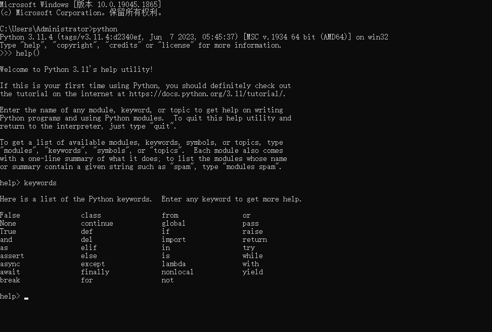
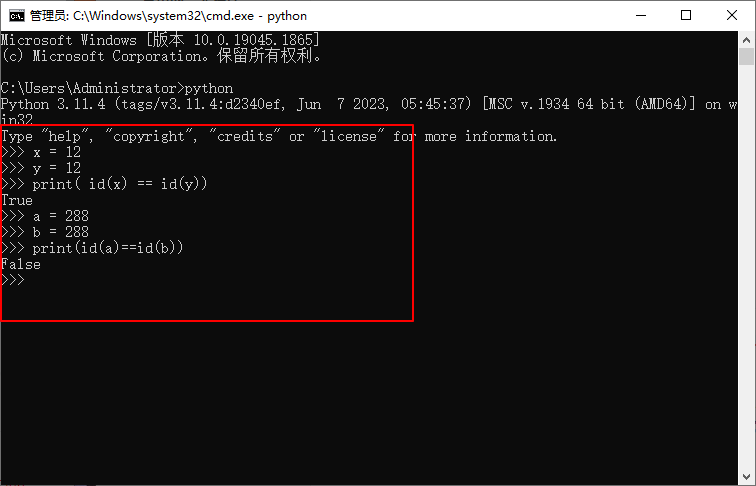

# 变量和常量

## 变量

&emsp;&emsp;变量就是可以变化的量，程序执行的本质就是一系列状态的变化，所以我们需要有一种机制能够反映或者是保存程序执行时的状态以及状态的变化。

&emsp;&emsp;在学习变量之前，首先需要明确 Python 是 <font color=red>解释型的强类型动态语言：</font>

+ <font color=orchid>**解释型语言：**</font>代码运行是依赖于 Python 解释器
+ <font color=orchid>**强类型语言：**</font>变量的数据类型一旦被定义就不会再改变（除非进行强转）
+ <font color=orchid>**动态型语言：**</font>运行时才进行数据类型检查，即在变量赋值时才确定变量的数据类型，不用事先给变量指定数据类型

### 变量的定义和使用

&emsp;&emsp;变量的定义由三部分组成： <font color=red>变量名 = 值</font>

+ <font color=orchid>**变量名：**</font>指向值所在的内存地址，是访问到值的唯一方法
+ <font color=orchid>**= ：**</font>赋值符号，用来将变量值的内存地址绑定到变量名
+ <font color=orchid>**值：**</font>存储的数据

&emsp;&emsp;解释器执行到变量定义的代码时会申请内存空间存放变量值，然后将变量值的内存地址绑定给变量名，通过变量名即可引用到对应的值：

```python
name = '张三' 	  # 定义一个存储姓名的变量
print(name)      # 输出变量名对应的值：张三
```

### 变量的命名

&emsp;&emsp;变量名的命名应该 <font color=red>见名知意</font> ，并且需要遵循下面的命名规范： 

+ 变量名只能是字母、数字或下划线的任意组合
+ 变量名的第一个字符不能是数字
+ 不能使用 Python 关键字，如：`and`，`as`，`assert` 等

> <font color=orange>**注意：**</font>
>
> + 虽然可以以中文命名，但是不推荐这么做
> + Python 关键字：False、await、else、import、pass、None、break、except、in、raise、True、class、finally、is、return、and、continue、for、lambda、try、as、def、from、nonlocal、while、assert、del、global、not、with、async、elif、if、or、yield
>
> 可以使用 Python 帮助系统查看关键字：
>> 

&emsp;&emsp;Python 有两种变量命名的风格： 

+ <font color=orchid>**驼峰体：**</font> <font color=green>***CardNumber = 100***</font>
+ <font color=orchid>**纯小写加下划线（推荐使用该风格）：**</font> <font color=green>***card_number = 100***</font>

&emsp;&emsp;在开发中，通常约定俗成遵守如下规则：

| 类型       | 规则                                                         | 例子                    |
| ---------- | ------------------------------------------------------------ | ----------------------- |
| 模块和包名 | 全小写字母，尽量简单，若多个单词之间用下划线                 | math, os, sys           |
| 函数名     | 全小写字母，多个单词之间用下划线隔开                         | phone, my_name          |
| 类名       | 首字母大写，采用驼峰原则。多个单词时，每个单词第一个字母大写，其余部分小写 | MyPhone、MyClass、Phone |
| 常量名     | 全大写字母，多个单词使用下划线隔开                           | SPEED、MAX_SPEED        |

### 变量的三大特性

&emsp;&emsp;变量的值具备三大特性： 

+ <font color=orchid>**id：**</font>反应的是变量在内存中的唯一编号，内存地址不同 id 肯定不同
+ <font color=orchid>**type：**</font>变量值的类型
+ <font color=orchid>**value：**</font>变量的值

&emsp;&emsp;查看变量值三大特性的方式如下：

```python
# 定义一个变量
number = 123

# 获取 id 值
print( id(number) )    # 4419555376

# 获取类型
print(type(number))    # <class 'int'>

# 获取变量的值
print(number)          # 123
```

&emsp;&emsp;Python 提供了 <font color=red>is</font> 和 <font color=red>==</font> 运算符：

+ <font color=orchid>**is：**</font>比较两个变量值的 id 是否相等
+ <font color=orchid>**==：**</font>比较两个变量的值是否相等

```python
# 定义两个字符串
x = "This is String"
y = "This is String"
z = x

print(x is y)           # false
print(id(x) == id(y))   # false
print(x == y)           # true
print(x is z)           # true
print(id(x) == id(z))   # true
print(x == z)           # true
```

> <font color=orange>**注意：**</font> 上面是使用交互式方式运行的结果，在 PyCharm 和使用文件运行的方式得到的结果都是 true。

&emsp;&emsp;在使用 id 进行判断的时候需要注意 <font color=red>小整数池</font> 的问题：从 Python 解释器启动开始，就会在内存中事先申请好一系列内存并且存放好常用的整数（-5 ~ 256），所以对于这些数字不会再重复申请内存地址，使用 id 返回的值永远都是相同的：



><font color=orange>注意：</font>
>&emsp;&emsp;小整数池的范围和实现细节可能因 Python 的不同实现（如 CPython、Jython、IronPython 等）而有所不同。上述提到的 `[-5, 256]` 范围是 CPython 的默认实现。

## 常量

&emsp;&emsp;在程序运行过程中，有些值是固定的，比如：圆周率（3.141592653），这些程序运行过程中不会改变的量就是常量。但 <font color=red>在 Python 中没有一个专门的语法来定义常量，约定俗成是用全部大写的变量名表示常量</font>  ，如： 

```python
# 约定俗成的常量，实际上还是可以更改的
MESSAGE_LOGIN = 1001
```

# 数字类型

## 数字类型声明

&emsp;&emsp;在编程中经常使用数字记录得分、表示可视化数据以及存储 Web 应用信息等。数字类型可以分为 <font color=red>整型（int）和 浮点型（float）</font>：

```python
# 声明一个整型变量
age = 10
print(type(age))      # <class 'int'>

# 声明一个浮点型的变量
salary = 1000.123
print(type(salary))    # <class 'float'>
```

## 类型转换

### 字符串转换成数字类型

+ <font color=orchid>**int() 函数：**</font>可以将由纯整数构成的字符串直接转换成整型
+ <font color=orchid>**float() 函数：**</font>可以将由浮点数构成的字符串转换成浮点型

```python
# 将字符串转换成整型
age = int("10")
print(type(age))        # <class 'int'>

# 将浮点型转换成整型
salary = float("12.32")
print(type(salary))     # <class 'float'>
```

&emsp;&emsp;如果字符串中包含其它任意非法符号就会转换失败，并且报错：

```python
number = int("12.10")
# ValueError: invalid literal for int() with base 10: '12.10'

number1 = float("12.12.12")
# ValueError: could not convert string to float: '12.12.12'
```

><font color=orange>type 与 isinstance 类型判断</font>
>
>&emsp;&emsp;可以使用 `type()` 来查看变量类型，使用 `isinstance()` 来判断变量类型，区别在于 `type()` 不会认为子类是一种父类类型，`isinstance()` 会认为子类是一种父类类型。
>
>```python
>num1 = True
num2 = 10
print(type(num1))  # <class 'bool'>
print(type(num2))  # <class 'int'>
print(type(num1) == type(num2))  # False
print(isinstance(num1, bool))  # True
print(isinstance(num1, int))  # True，Python3中，bool是int的子类
print(isinstance(num2, int))  # True
>```

### 进制间转换

&emsp;&emsp;Python 提供了下面的函数将十进制数转换成其它进制数：

+ <font color=orchid>**bin() 函数：**</font>将十进制转换成二进制
+ <font color=orchid>**oct() 函数：**</font>将十进制转换成八进制
+ <font color=orchid>**hex() 函数：**</font>将十进制转换成十六进制

```python
# 十进制转换成二进制
print(bin(3))   # 0b11
# 十进制转换成八进制
print(oct(3))   # 0o3
# 十进制转换成十六进制
print(hex(3))   # 0x3
```

&emsp;&emsp;如果需要将其它进制数的字符串转换成十进制数，可以通过 <font color=red>int() 函数的第二个参数</font> 来指出当前字符串表示的是多少进制的数：

```python
# 二进制转换成十进制
print(int('0b11', 2))   # 3
# 八进制转换成十进制
print(int('0o3', 8))    # 3
# 十六进制转换成十进制
print(int('0x3', 16))   # 3
```

## 需要注意的问题

<font color=orachid>**（一）浮点数的精度问题**</font>

&emsp;&emsp;使用浮点数的时候会存在精度的问题：

```python
print(0.1 + 0.2)    # 0.30000000000000004
```

&emsp;&emsp;浮点数的精度问题可以通过导入 `decimal` 模块来解决：

```python
from decimal import Decimal
num1 = Decimal('0.1')
num2 = Decimal('0.2')
print(num1 + num2)
```

<font color=orachid>**（二）整数和浮点数运算**</font>

&emsp;&emsp;将任意两个数相除的时候结果总是浮点型，即便这两个数都是整数且能整除：

```python
print(5/2)  # 2.5
# 即便整除结果还是浮点数
print(4/2)  # 2.0
```

&emsp;&emsp;在其它的任何运算中，如果有一个操作数是浮点数，那么结果就是浮点数：

```python
print(2 * 2.2)  # 4.4
# 即便得到的结果是整数，类型依然是浮点型
print(2 * 2.5)  # 5.0
```

## 数中的下划线

&emsp;&emsp;当书写很大的数的时候， <font color=red>可使用下划线将其中的数字分组</font> ，使其清晰易读， Python 不会打印其中的下划线：

```python
print(100_000_100)  # 100000100
```

> <font color=orange>*__注意：__*</font>只有 python 3.6 及以上的版本才支持。

# 布尔类型

&emsp;&emsp;`bool` 类型用来记录真假这两种状态，通常用来当作判断的条件使用：

```python
b1 = True
b2 = False

print(type(b1)) # <class 'bool'>
print(type(b2)) # <class 'bool'>
```

&emsp;&emsp;可以通过 <font color=green>*__bool()__*</font> 函数来将其它类型转换成布尔类型：

```python
b1 = bool(0)
print(b1) # False
```

> <font color=orange>**注意：**</font>只有  <font color=red>None，0，空（空字符串，空列表，空字典等）</font> 三种情况下转换成的布尔值为 False，其余均为 True。