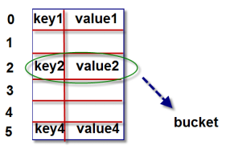
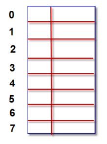
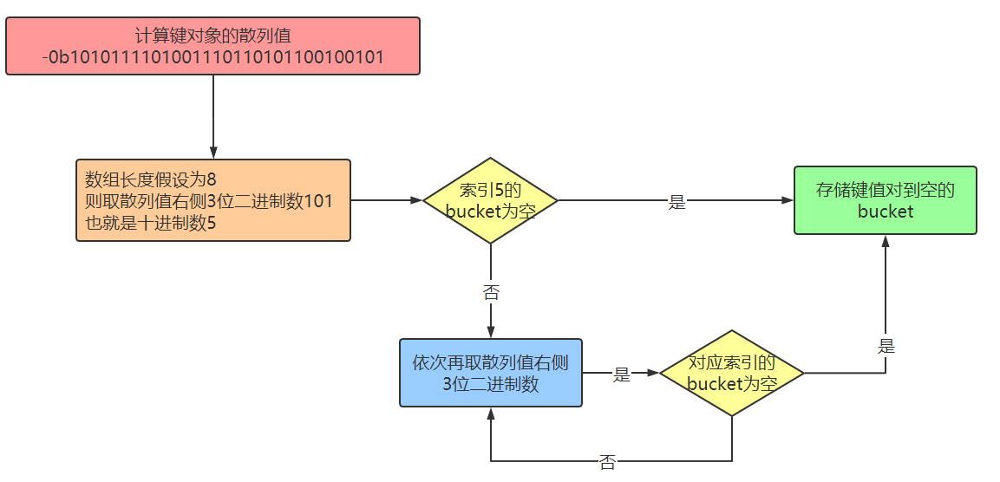
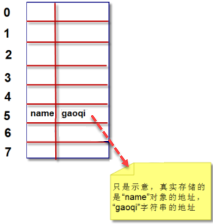
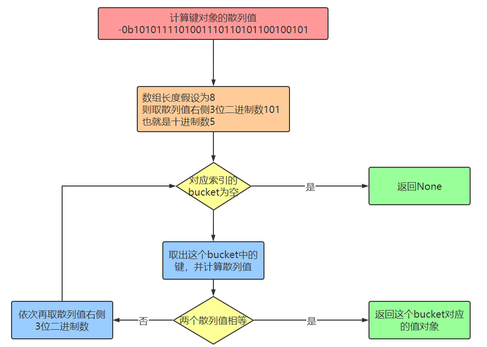

# 定义字典

&emsp;&emsp;在 Python 中字典是一系列键值对，每个键都与一个值相关联，你可以使用键来访问相关联的值，任何 python 对象都可以用作字典中的值。 <font color=red>字典用放在 {} 中的一系列键值对表示，键和值之间用冒号分开，键值对之间用逗号分隔</font> ：

```python
# 本质 dict(...)
user1 = {"name": "tony", "age": 18, "sex": "male"}
print(user1) # {'name': 'tony', 'age': 18, 'sex': 'male'}
```

&emsp;&emsp;在 `{}` 内用逗号分隔开多元素，每一个元素都是 <font color=green>*__key:value__*</font> 的形式：

+ value 可以是任意类型
+ key 必须是不可变类型
+ 通常 key 应该是字符串类型，因为会对 value 有描述性的功能

&emsp;&emsp;还可以使用 <font color=green>***dict***</font> 转换成字典类型：

```python
user1 = dict([["name", "tony"], ("age", 20)])
print(user1) # {'name': 'tony', 'age': 20}

user2 = dict(name="summer", age=18, sex="female")
print(user2) # {'name': 'summer', 'age': 18, 'sex': 'female'}
```

&emsp;&emsp;Python 提供了 <font color=green>***fromkeys***</font> 方法，该方法会从第一个参数元组中取出每个值当做 key，然后与第二个参数组成键值对放到字典中：

```python
user1 = {}.fromkeys(("name", "age"), None)
print(user1) # {'name': None, 'age': None}
```

# 访问字典元素

## 获取键对应的值

&emsp;&emsp;可以通过 <font color=green>*__变量名[key]__*</font> 的方式获取键对应的值：

```python
user = dict([["name", "tony"], ("age", 20)])
print(user["name"], user["age"]) # tony 20
```

&emsp;&emsp;通过这种方式获取值的时候如果 key 不存在就会报错：

```python
user = dict([["name", "tony"], ("age", 20)])
print(user["gender"]) 
# KeyError: 'gender'
```

&emsp;&emsp;也可以使用 <font color=green>***get(key)***</font> 方法获取指定的键对应的值，使用方括号访问字典中的值的时候，当键不存在的时候就会报错，而使用 get 就不会，默认情况下会返回 None：

```python
user = dict([["name", "tony"], ("age", 20)])
print(user.get("name"), user.get("age"), user.get("gender")) 
# tony 20 None
```

&emsp;&emsp;也可以通过指定第二个参数返回没有找到时候的默认值：

```python
user = dict([["name", "tony"], ("age", 20)])
print(user.get("gender", "man")) # man
```

## 遍历字典

&emsp;&emsp;默认情况下遍历字典遍历的是字典的 `key` 的列表：

```python
user = dict([["name", "tony"], ("age", 20)])
for key in user:
    print(key)

# name
# age
```

&emsp;&emsp;也可以通过字典的 <font color=green>***keys*** </font> 方法返回字典中 key 的列表：

```python
user = dict([["name", "tony"], ("age", 20)])
for key in user.keys():
    print(key)

# name
# age
```

&emsp;&emsp;字典还提供了 <font color=green>***values***</font>  方法，该方法会返回字典中所有的值的列表，通过该列表可以遍历字典中所有的值：

```python
user = dict([["name", "tony"], ("age", 20)])
for value in user.values():
    print(value)

# tony
# 20
```

&emsp;&emsp;字典提供了 <font color=green>***items*** </font> 方法，该方法会返回一个键值对的列表，通过遍历该列表可以使用字典键值对的遍历：

```python
user = dict([["name", "tony"], ("age", 20)])
for item in user.items():
    print(item)

# ("name", "tony")
# ("age", 20)
```

# 添加、修改和删除字典

## 添加键值对

&emsp;&emsp;可以通过 <font color=green>*__变量名[key] = value__*</font> 的方法来创建或者修改字典的键值对：

+ 当 key 存在的时候就是修改相应的键对应的值
+ 当 key 不存在的时候就是添加键值对

```python
user = dict([["name", "tony"], ("age", 20)])

# 存在 key 值，为修改 key 对应的 value 值
user["age"] = 30

# 不存在 key 值，为新建 key-value 键值对
user["gender"]="male"

print(user) # {'name': 'tony', 'age': 30, 'gender': 'male'}
```

## 修改键值对

&emsp;&emsp;前面说过，当使用 `变量名[key] = value` 方法的时候，如果 key 存在就会修改对应的键值对。除此之外字典还提供了 <font color=green>***update*** </font> 方法 ，该方法会用新的字典去更新旧的字典：

+ 如果新字典中的键在旧字典中也存在，则修改旧字典对应的键值对
+ 如果新字典中的键在旧字典中不存在，则在旧字典中添加对应的键值对
+ 其它的键值对不做任何操作

```python
user1 = dict([["name", "tony"], ("age", 20)])
user2 = {"gender": "femal", "name": "summer"}

user1.update(user2)

print(user1) # {'name': 'summer', 'age': 20, 'gender': 'femal'}
```

&emsp;&emsp;字典还提供了 <font color=green>***setdefaule*** </font> 方法 ：

+ 当 key 不存在的时候则新增键值对，并将新增的 value 返回
+ 当 key 存在的时候则不做任何修改，并返回已存在的 key 对应的 value 值

```python
user = dict([["name", "tony"], ("age", 20)])

# key 存在，什么都不做，返回原有的 key 对应的 value 的值
print(user.setdefault("name", "jack"))  # tony
print(user) # {'name': 'tony', 'age': 20}

# key 不存在，添加新的键值对， 并返回新添加的键值对的 value 值
print(user.setdefault("gender", "male")) # male
print(user) # {'name': 'tony', 'age': 20, 'gender': 'male'}
```

## 删除键值对

&emsp;&emsp;可以使用通用的 <font color=green>***del*** </font> 方法来删除对应的键值对：

```python
user = dict([["name", "tony"], ("age", 20)])
del user["age"]
print(user) # {"name" : "tony"}
```

> <font color=orange>注意：</font> 通过该方法删除键值对的时候，如果键不存在则会报错。

&emsp;&emsp;字典本身提供了 <font color=green>***pop*** </font> 方法，用来删除指定的 key 对应的键值对并返回 value 值：

```python
user = dict([["name", "tony"], ("age", 20)])
print(user.pop("age")) # 20
print(user) # {"name" : "tony"}
```

> <font color=orange>**注意：**</font> 通过该方法删除键值对的时候，如果键不存在则会报错。

&emsp;&emsp;字典还提供了 <font color=green>***popitem()*** </font> 方法，该方法用来随机删除一组键值对并将删除的键值放到元组内返回：

```python
user = dict([["name", "tony"], ("age", 20)])
print(user.popitem())
```

> <font color=orange>**注意：** </font>当在空字典上使用该方法的时候会报错。

&emsp;&emsp;字典还提供了 <font color=green>***clear()*** </font> 方法用来清空字典：

```python
user = dict([["name", "tony"], ("age", 20)])
print(user.clear())
```

# 其它方法

## 成员运算符

+ <font color=orchid>**a in dic：**</font> 判断 a 是不是字典 dic 的键
+ <font color=orchid>**a not in dic：**</font> 判断 a 是不是不是字典 dic 的键 

```python
user = dict([["name", "tony"], ("age", 20)])
print("name" in user)    # True
print("name" not in user)   # False
```

## len 方法

&emsp;&emsp;该方法用来返回字典中键值对的个数：

```python
user = dict([["name", "tony"], ("age", 20)])
print(len(user))    # 2
```

# 字典核心底层原理

&emsp;&emsp;<font color=red>字典对象的核心是散列表</font>，散列表是一个稀疏数组（总是有空白元素的数组），数组的每个单元叫做 `bucket` ，每个 `bucket` 有两部分：<font color=red>一个是键对象的引用，一个是值对象的引用</font>。由于所有 `bucket` 结构和大小一致，我们可以通过偏移量来读取指定 `bucket`：



## 将一个键值对放进字典的底层过程

```python
a = {}
a["name"] = "gaoqi"
```

&emsp;&emsp;假设字典 a 对象创建完后数组长度为 8：



&emsp;&emsp;我们要把 `"name"="gaoqi"` 这个键值对放到字典对象 a 中，首先第一步需要计算键 `name` 的散列值，Python 中可以通过 `hash()` 来计算：

```shell
>>> bin(hash("name"))
'-0b1010111101001110110101100100101'
```

&emsp;&emsp;由于数组长度为 8，我们可以拿计算出的散列值的最右边 3 位数字作为偏移量（即：101），十进制是数字 5，我们查看偏移量 5 对应的 `bucket` 是否为空。如果为空则将键值对放进去；如果不为空则依次取右边 3 位作为偏移量（即100），十进制是数字 4，再查看偏移量为 4 的 `bucket` 是否为空，直到找到为空的 `bucket` 将键值对放进去。流程图如下：




&emsp;&emsp;Python 会根据散列表的拥挤程度扩容，扩容指的是创造更大的数组，将原有内容拷贝到新数组中（接近 2/3 时数组就会扩容）。

## 根据键查找键值对的底层过程

```shell
>>> a.get("name")
'gaoqi'
```

&emsp;&emsp;当调用 `a.get("name")` 就是根据键 `name` 查找到键值对，从而找到值对象 `gaoqi`，此时仍然要首先计算 `name` 对象的散列值。和存储的底层流程算法一致，也是依次取散列值的不同位置的数字。假设数组长度为 8，我们可以拿计算出的散列值的最右边 3 位数字作为偏移量（即：101），十进制是数字 5，我们查看偏移量 5 对应的 `bucket` 是否为空，如果为空则返回 `None` ；如果不为空，则将这个 `bucket` 的键对象计算对应散列值和我们的散列值进行比较，如果相等则将对应值对象返回；如果不相等则再依次取其他几位数字，重新计算偏移量。依次取完后，仍然没有找到则返回 None 。流程图如下：



+ 字典在内存中开销巨大，典型的空间换时间
+ 键查询速度很快
+ 往字典里面添加新键值对可能导致扩容，导致散列表中键的次序变化。因此，不要在遍历字典的同时进行字典的修改
+ 键必须可散列
	+ 数字、字符串、元组，都是可散列的
	+ 自定义对象需要支持下面三点：
		+ 支持 `hash()` 函数
		+ 支持通过 `__eq__()` 方法检测相等性
		+ 若 `a==b` 为真，则 `hash(a)==hash(b)` 也为真