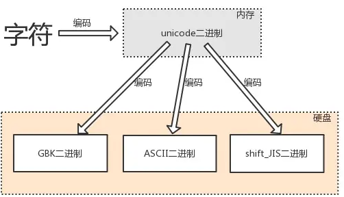
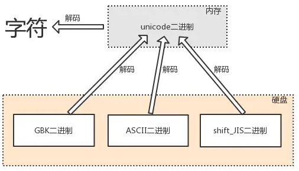
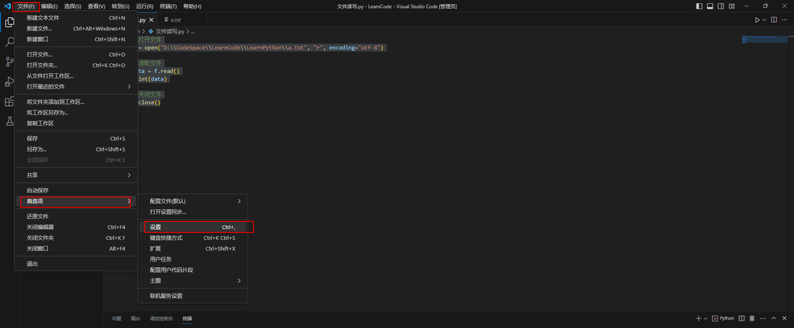

# 字符编码
## 基本概念

&emsp;&emsp;字符串类型、文本文件的内容都是由字符组成的，但凡涉及到字符的存取都需要考虑字符编码的问题。Python 解释器执行文件的流程如下：

1. 启动 Python 解释器，此时就相当于启动了一个文本编辑器
2. Python 解释器相当于文本编辑器，从硬盘上将 `.py` 文件的内容读入到内存中
3. Python 解释器解释执行刚刚读入的内存的内容，开始识别 python 语法

&emsp;&emsp;人类在与计算机交互时用的都是人类能读懂的字符（如：中文字符、英文字符等），而计算机只能识别二进制数，所以由人类的字符到计算机中的数字必须经历一个 <font color=red>翻译</font> 的过程，翻译的过程必须参照一个特定的标准，该标准称之为 <font color=red>字符编码表</font>，该表上存放的就是字符与数字一一对应关系。

&emsp;&emsp;字符编码的发展经历了三个重要的阶段：

+ <font color=orchid>**阶段一：**</font>现代计算机起源于美国，所以最先考虑仅仅是让计算机识别英文字符，于是诞生了 `ASCII` 表
+ <font color=orchid>**阶段二：**</font>每个国家都各自的字符，为让计算机能够识别自己国家的字符外加英文字符，各个国家都制定了自己的字符编码表（如：中国人制定了 `GBK` ）
+ <font color=orchid>**阶段三：**</font>`unicode` 编码
  + 存在所有语言中的所有字符与数字的一一对应关系（即：兼容万国字符）
  + 与传统的字符编码的二进制数都有对应关系

> <font color=orange>**UTF-8 的由来**</font>
>
> &emsp;&emsp;当保存到硬盘的是 `GBK` 格式的二进制时，用户输入的字符只能是中文或英文。理论上是可以将内存中 `unicode` 格式的二进制直接存放于硬盘中的，但由于 `unicode` 固定使用两个字节来存储一个字符，如果多国字符中包含大量的英文字符时，使用 `unicode` 格式存放会额外占用一倍空间。更致命地是，当我们由内存写入硬盘时会额外耗费一倍的时间。所以将内存中的 `unicode` 二进制写入硬盘或者基于网络传输时必须将其转换成一种精简的格式，这种格式就是 <font color=red>UTF-8（全称Unicode Transformation Format，即 unicode 的转换格式）</font>
>
> &emsp;&emsp;`unicode` 更像是一个过渡版本，我们新开发的软件或文件存入硬盘都采用 `utf-8` 格式。

## 编码和解码

&emsp;&emsp;<font color=red>编码（encode）</font>就是由字符转换成内存中的 `unicode` 以及由 `unicode` 转换成其他编码的过程：



&emsp;&emsp;<font color=red>解码（decode）</font>就是由内存中的 `unicode` 转换成字符以及由其他编码转换成 `unicode` 的过程：



&emsp;&emsp;学习字符编码就是为了存取字符时不发生乱码问题，因为内存中固定使用 `unicode`，所以无论输入任何字符都不会发生乱码，而我们能够修改的是存/取硬盘的编码方式，如果编码设置不正确将会出现乱码问题，乱码问题分为 <font color=red>存乱了 和 读乱了</font>

+ <font color=orchid>**存乱了：**</font>如果用户输入的内容中包含中文和日文字符，如果单纯以 `shift_JIS` 存，日文可以正常写入硬盘，但由于中文字符在 `shift_jis` 中没有找到对应关系而导致存乱了
+ <font color=orchid>**读乱了：**</font>如果硬盘中的数据是 `shift_JIS` 格式存储的，采 `GBK` 格式读入内存就读乱了

&emsp;&emsp;因此，为了保证存的时候不乱，在由内存写入硬盘时必须将编码格式设置为支持所输入字符的编码格式；而为了保证读的时候不乱，在由硬盘读入内存时必须采用与写入硬盘时相同的编码格式。

## Python 解释器执行文件

&emsp;&emsp;执行 `.py` 文件的前两个阶段就是 Python 解释器读文本文件的过程，要保证读不乱码必须将 Python 解释器读文件时采用的编码方式设置为文件当初写入硬盘时的编码格式。如果没有设置，Python 解释器会使用默认的编码方式：

+ 在 Python 3 中默认为 `utf-8`
+ 在 Python 2 中默认为 `ASCII`

&emsp;&emsp;可以通过指定文件头来修改默认的编码，在文件首行写入包含 `#` 号在内的以下内容：

```python
# coding: 当初文件写入硬盘时采用的编码格式
```

&emsp;&emsp;解释器会先用默认的编码方式读取文件的首行内容，由于首行是纯英文组成，任何编码方式都可以识别英文字符。设置文件头的作用是保证运行 Python 程序的前两个阶段不乱码，经过前两个阶段后 `.py` 文件的内容都会以 `unicode` 格式存放于内存中。

&emsp;&emsp;第三个阶段开始识别 Python 语法，当遇到特定的语法（如： `name = '上'`，代码本身也都全都是`unicode` 格式存的）时需要申请内存空间来存储字符串，这就又涉及到应该以什么编码存储的问题了。

+ 在 Python 3 中，字符串类的值都是使用 `unicode` 格式来存储
+ 在 Python 2 中是按照文件头指定的编码来存储字符串类型的值（如果文件头中没有指定编码，那么解释器会按照它自己默认的编码方式来存储），所以这就有可能导致乱码问题

&emsp;&emsp;Python 2 可以使用下面的方法将字符串类型强制存储为 `unicode`：

```python
# coding:utf-8
x = u'上' # 即便文件头为 utf-8，x 的值依然存成 unicode
```

## 字符串 encode 编码与 decode 解码的使用

```python
# 1. unicode格式 -> 编码encode -> 其它编码格式
x='上' 					# 在 python3 在 '上' 被存成unicode
res=x.encode('utf-8')
# unicode编码成了utf-8格式，而编码的结果为bytes类型，可以当作直接当作二进制去使用
print(res, type(res) )  # (b'\xe4\xb8\x8a', <class 'bytes'>)

# 2. 其它编码格式------解码decode-------->unicode格式
print(res.decode('utf-8'))  # '上'
```

# 文件操作

## 文件操作相关模块

&emsp;&emsp;Python 标准库中，如下是文件操作相关的模块：

| 名称                            | 说明                       |
| ----------------------------- | ------------------------ |
| io 模块                         | 文件流的输入和输出操作 input output |
| os 模块                         | 基本操作系统功能，包括文件操作          |
| glob 模块                       | 查找符合特定规则的文件路径名           |
| fnmatch 模块                    | 使用模式来匹配文件路径名             |
| fileinput 模块                  | 处理多个输入文件                 |
| filecmp 模块                    | 用于文件的比较                  |
| csv 模块                        | 用于csv文件处理                |
| pickle 和 cPickle              | 用于序列化和反序列化               |
| xml 包                         | 用于XML数据处理                |
| bz2、gzip、zipfile、zlib、tarfile | 用于处理压缩和解压缩文件（分别对应不同的算法）  |
## 文件操作的基本流程

&emsp;&emsp;文件操作的基本流程如下：

1. 调用 <font color=green>***open()***</font> 方法打开文件，操作系统会打开该文件（对应一块硬盘空间）并返回一个文件对象
2. 调用文件对象的读/写方法，会被操作系统转换为读/写硬盘的操作
3. 调用文件对象的 <font color=green>***close()***</font> 方法向操作系统发起关闭文件的请求，回收系统资源

```python
# 打开文件
f = open("./resources/a.txt", "r", encoding="utf-8")

# 读取文件
data = f.read()
print(data)

# 关闭文件
f.close()
```

> <font color=orange>**注意：**</font>在VS Code中写代码的时候，如果相对路径显示文件不存在，可以通过下面的方法设置：
> 
> 然后在搜索栏输入 `file dir`，将 `Python > Terminal:Execute In File Dir` 勾选即可。

&emsp;&emsp;打开一个文件包含两部分资源：<font color=red>应用程序的变量 f 和操作系统打开的文件</font>。在操作完一个文件时必须把该文件的这两部分资源全部回收，回收方法为：

```python
f.close()  #回收操作系统打开的文件资源
del f      #回收应用程序级的变量
```

&emsp;&emsp;其中 `del f` 一定要发生在 `f.close()` 之后，否则就会导致操作系统打开的文件无法关闭，白白占用资源。而 Python 自动的垃圾回收机制决定了无需考虑 `del f` ，这就要求在操作完毕文件后一定要记住 `f.close()`。Python 提供了 <font color=green>***with***</font> 关键字来管理上下文：

```python
# 1、在执行完子代码块后，with 会自动执行f.close()
with open('a.txt','w') as f:
    pass 

# 2、可用用with同时打开多个文件，用逗号分隔开即可
with open('a.txt','r') as read_f,open('b.txt','w') as write_f:  
    data = read_f.read()
    write_f.write(data)
```

&emsp;&emsp;`f = open()` 是由操作系统打开文件，如果打开的是文本文件就会涉及到字符编码问题。如果没有为 `open` 指定编码，操作系统会用自己的默认编码去打开文件：

+ 在 Windows 下是 `gbk`
+ 在 Linux 下是 `utf-8`

&emsp;&emsp;要保证不乱码，文件以什么方式存的就要以什么方式打开。

## 文件的操作模式

&emsp;&emsp;控制文件读写操作的模式有：

+ <font color=orchid>**r（默认的）：**</font>只读
  + 文件不存在时报错
  + 文件存在文件内指针直接跳到文件开头
+ <font color=orchid>**w：**</font>只写
  + 在文件不存在时会创建空文档
  + 文件存在则会清空文件，文件指针跑到文件开头
+ <font color=orchid>**a：**</font>追加
  + 在文件不存在时会创建空文档
  + 文件存在会将文件指针直接移动到文件末尾

```python
file_name = "./resources/a.txt"

# 在文件不存在时会创建空文档，文件存在则会清空文件，文件指针跑到文件开头
with open(file_name,"w", encoding="utf-8") as f:
    f.write("写入的内容")


# r 只读模式
with open(file_name,"r", encoding="utf-8") as f:
    # 会将文件的内容由硬盘全部读入内存，赋值给 data
    data = f.read() 
    print(data) # 写入的内容


# 以 w 只写的方式写入内容，文件存在则会清空文件
with open(file_name,"w", encoding="utf-8") as f:
    # 在文件不关闭的情况下,连续的写入，后写的内容一定跟在前写内容的后面
    f.write("第一行内容\n")
    f.write("第二行内容\n")
    f.write("第三行内容\n")
    f.write("第四行内容\n")


# r 只读模式
with open(file_name,"r", encoding="utf-8") as f:
    # 一行一行读取内容
    for line in f:
        print(line)


# a 只追加写模式: 在文件不存在时会创建空文档,文件存在会将文件指针直接移动到文件末尾
with open(file_name,"a", encoding="utf-8") as f:
    f.write("第五行内容\n")


# r 只读模式
with open(file_name,"r", encoding="utf-8") as f:
    # 一行一行读取内容
    for line in f:
        print(line)
```

> <font color=orange>**+ 模式的使用**</font>
>
> `r+`、`w+`、`a+` 支持可读可写，在平时工作中只单纯使用 `r/w/a`，要么只读，要么只写，一般不用可读可写的模式。

## 控制文件读写内容的模式

+ <font color=orchid>**t（默认的）：**</font>文本模式
  + 读写文件都是以字符串为单位的
  + 只能针对文本文件
  + 必须指定 `encoding` 参数
+ <font color=orchid>**b：**</font>二进制模式
  + 读写文件都是以 `bytes（二进制）` 为单位的
  + 可以针对所有文件
  + 一定不能指定 `encoding` 参数

```python
file_name = "./resources/a.txt"
file1_name = "./resources/b.txt"

# t 模式：如果我们指定的文件打开模式为r/w/a，其实默认就是rt/wt/at
# t 模式只能用于操作文本文件,无论读写，都应该以字符串为单位，
# 而存取硬盘本质都是二进制的形式，当指定 t 模式时，内部帮我们做了编码与解码
with open(file_name,"wt", encoding="utf-8") as f:
    f.write("abcd")

with open(file_name,"rt", encoding="utf-8") as f:
    print(f.read()) # abcd


# 在操作纯文本文件方面t模式帮我们省去了编码与解码的环节，
# b模式则需要手动编码与解码，所以此时t模式更为方便
# 针对非文本文件（如图片、视频、音频等）只能使用b模式
with open(file1_name,"wb") as f:
    f.write("abcd".encode("utf-8"))
    # b"abcd" 这里是纯英文或数字
    # bytes("abcd", encoding="utf-8") 


with open(file1_name,"rb") as f:
    data = f.read()
    print(data, type(data)) # b'abcd' <class 'bytes'>
    print(data.decode("utf-8")) # abcd
```

> <font color=orange>**注意：**</font>`t`、`b` 模式均不能单独使用，必须与 `r`、`w`、`a` 之一结合使用。

## 操作文件的方法

&emsp;&emsp;操作文件的方法如下：

+ <font color=orchid>**f.read()：**</font>读取所有内容，执行完该操作后文件指针会移动到文件末尾
+ <font color=orchid>**f.readline()：**</font>读取一行内容，光标移动到第二行首部
+ <font color=orchid>**f.readlines()：**</font>读取每一行内容并存放于列表中

```python
file_name = "./resources/a.txt"

with open(file_name,"w", encoding="utf-8") as f:
    f.write("number1\n")
    f.write("number2\n")
    f.write("number3\n")
    f.write("number4\n")
    f.write("number5")

# f.read() 方法
with open(file_name,"r", encoding="utf-8") as f:
    print(f.read())

print("".center(20, "-"))

# f.readline() 方法
with open(file_name,"r", encoding="utf-8") as f:
    while True:
        line = f.readline()
        if len(line) == 0:
            break
        print(line, end="")


print("\n","".center(20, "-"))

# f.readlines() 方法
with open(file_name, "r", encoding="utf-8") as f:
    lines = f.readlines()
    for line in lines:
        print(line, end="")

print("\n")
```

> <font color=orange>**注意：**</font>
>
> `f.read()` 与 `f.readlines()` 都是将内容一次性读入内容，如果内容过大会导致内存溢出；若还想将内容全读入内存，则必须分多次读入，有两种实现方式：
>
> ```python
> # 方式一
> with open('a.txt',mode='rt',encoding='utf-8') as f:
>      for line in f:
>          print(line) # 同一时刻只读入一行内容到内存中
> 
> # 方式二
> with open('1.mp4',mode='rb') as f:
>      while True:
>          data=f.read(1024) # 同一时刻只读入1024个Bytes到内存中
>          if len(data) == 0:
>              break
>          print(data)
> ```

```python
with open("a.txt", "w", encoding="utf-8") as f:
    # writelines 从一个存储多个值的列表中for循环出内容，逐个写到文件中
    f.writelines(["1","2","3"])
```

&emsp;&emsp;此外还提供了如下的方法：

+ <font color=orchid>**f.readable()：**</font>文件是否可读
+ <font color=orchid>**f.writable()：**</font>文件是否可写
+ <font color=orchid>**f.closed：**</font>文件是否关闭
+ <font color=orchid>**f.encoding：**</font>如果文件打开模式为 `b` 则没有该属性
+ <font color=orchid>**f.flush()：**</font>立刻将文件内容从内存刷到硬盘，主要用于写操作
+ <font color=orchid>**f.name：**</font>文件全路径名

```python
file_name = "./resources/a.txt"

with open(file_name,"r", encoding="utf-8") as f:
    print(f.readable()) # True
    print(f.writable()) # False
    print(f.closed)     # False
    print(f.encoding)   # utf-8
    print(f.name)       # ./resources/a.txt
```

## 主动控制文件内指针移动

&emsp;&emsp;文件内指针的移动都是 `Bytes` 为单位的，唯一例外的是 `t` 模式下的 `read(n)` 中的 `n` 以字符为单位：

```python
with open('a.txt',mode='rt',encoding='utf-8') as f:
     data=f.read(3) # 读取3个字符

with open('a.txt',mode='rb') as f:
     data=f.read(3) # 读取3个Bytes
```

&emsp;&emsp;之前文件内指针的移动都是由读/写操作而被动触发的，若想读取文件某一特定位置的数据则需要 <font color=green>***f.seek***</font> 方法主动控制文件内指针的移动：

```python
f.seek(指针移动的字节数,模式控制):
```

&emsp;&emsp;其中的模式控制有：

+ <font color=orchid>**0（默认的模式）：**</font>该模式代表指针移动的字节数是以文件开头为参照的
+ <font color=orchid>**1：**</font>该模式代表指针移动的字节数是以当前所在的位置为参照的
+ <font color=orchid>**2：**</font>该模式代表指针移动的字节数是以文件末尾的位置为参照的

```python
# a.txt 中的内容： abc你好

file_name = "./resources/a.txt"

# ------- 0 模式的使用 ----------
with open(file_name,mode='rt',encoding='utf-8') as f:
    f.seek(3, 0) # 参照文件开头移动了 3 个字节
    print(f.tell()) # 查看当前文件指针距离文件开头的位置，输出结果为3
    print(f.read()) # 从第3个字节的位置读到文件末尾，输出结果为：你好

with open(file_name,mode='rb') as f:
    f.seek(6,0)
    print(f.read().decode('utf-8')) #输出结果为: 好

# ------- 1 模式的使用 ----------
with open(file_name,mode='rb') as f:
    f.seek(3,1) # 从当前位置往后移动3个字节，而此时的当前位置就是文件开头
    print(f.tell()) # 输出结果为：3
    f.seek(4,1)     # 从当前位置往后移动4个字节，而此时的当前位置为3
    print(f.tell()) # 输出结果为：7

# ------- 2 模式的使用 ----------
with open(file_name,mode='rb') as f:
    f.seek(0,2)     # 参照文件末尾移动0个字节， 即直接跳到文件末尾
    print(f.tell()) # 输出结果为：9
    f.seek(-3,2)     # 参照文件末尾往前移动了3个字节
    print(f.read().decode('utf-8')) # 输出结果为：好
```

> <font color=orange>**注意：**</font>其中 `0` 模式可以在 `t` 或者 `b` 模式使用，而 `1` 跟 `2` 模式只能在 `b` 模式下用。

## 文件的修改

&emsp;&emsp;文件对应的是硬盘空间，硬盘空间是无法修改的（<font color=red>硬盘中数据的更新都是用新内容覆盖旧内容</font>），对应着文件本质也是不能修改的。但是内存中的数据是可以修改的，所以修改文件的大致思路是将硬盘中文件内容读入内存，然后在内存中修改完毕后再覆盖回硬盘。具体的实现方式分为两种：

<font color=orachid>**（一）第一种方式**</font>

&emsp;&emsp;将文件内容一次性全部读入内存，然后在内存中修改完毕后再覆盖写回原文件：

```python
# a.txt 中的内容： abc你好
src_name = "./resources/a.txt"

with open(src_name,mode='rt',encoding='utf-8') as f:
    data = f.read()

with open(src_name,mode='wt') as f:
    f.write(data.replace("你好", " Hello")) 
```

+ 优点：在文件修改过程中同一份数据只有一份
+ 缺点：会过多地占用内存

<font color=orachid>**（二）第二种方式**</font>

&emsp;&emsp;以读的方式打开原文件，以写的方式打开一个临时文件，然后一行行读取原文件内容，同时修改完后写入临时文件。最后删掉原文件，并将临时文件重命名原文件名：

```python
import os
src_name = "./resources/a.txt"
tmp_name = "./resources/a.txt.swap"

with open(src_name,mode='rt',encoding='utf-8') as read_f,\
    open(tmp_name,mode='wt',encoding='utf-8') as write_f:
    for line in read_f:
        write_f.write(line.replace("Hello", "你好"))


os.remove(src_name)
os.rename(tmp_name, src_name)
```

+ 优点：不会占用过多的内存
+ 缺点：在文件修改过程中同一份数据存了两份

# 使用 pickle 序列化

&emsp;&emsp;序列化指的是 <font color=red>将对象转化成 串行化 数据形式</font>，存储到硬盘或通过网络传输到其他地方。反序列化是指相反的过程，<font color=red>将读取到的 串行化数据 转化成对象</font>。可以使用 <font color=red>pickle</font> 模块中的函数，实现序列化和反序列操作。

&emsp;&emsp;Python 中一切皆对象，对象本质上就是一个存储数据的内存块。有时候我们需要将内存块的数据保存到硬盘上，或者通过网络传输到其他的计算机上。这时候就需要对象的序列化和反序列化。 对象的序列化机制广泛的应用在分布式、并行系统上。

+ `pickle.dump(obj, file)`：obj 就是要被序列化的对象， file 指的是存储的文件
+ `pickle.load(file)`：从 file 读取数据，反序列化成对象

```python
import pickle

with open('data.dat', 'wb') as f:
    name = "张三"
    age = 34
    score = [90, 80, 70]
    resume = {
        'name': name,
        'age': age,
        'score': score
    }
    pickle.dump(resume, f)


with open('data.dat', 'rb') as f:
    resume = pickle.load(f)
    print(resume)
```

# CSV 文件的操作

&emsp;&emsp;csv 是逗号分隔符文本格式，常用于数据交换、Excel 文件和数据库数据的导入和导出。与 Excel 文件不同，在 CSV 文件中：

+ 值没有类型，所有值都是字符串
+ 不能指定字体颜色等样式
+ 不能指定单元格的宽高，不能合并单元格
+ 没有多个工作表
+ 不能嵌入图像图表

&emsp;&emsp;Python 标准库的模块 csv 提供了读取和写入 csv 格式文件的对象：

```python
import csv

headers = ["工号","姓名","年龄","地址","月薪"]
rows = [("1001","高淇",18,"西三旗1号院","50000"),("1002","高八",19,"西三旗1号院","30000")]

with open("./salary.csv", "w") as b:
    b_csv = csv.writer(b)
    b_csv.writerow(headers)
    b_csv.writerows(rows)

with open("salary.csv", "r") as a:
    a_csv = csv.reader(a)
    headers = next(a_csv)
    print(headers)
    for row in a_csv:
        print(row)
```

# os 和 os.path 模块

&emsp;&emsp;os 模块可以帮助我们直接对操作系统进行操作，可以直接调用操作系统的可执行文件、命令，直接操作文件、目录等等。os 模块是做系统运维非常重要的基础：

<font color=orachid>**（一）os 模块调用操作系统命令**</font>

&emsp;&emsp;通过 `os.system` 可以帮助我们直接调用系统的命令：

```python
import os

# os.system 调用 windows 系统的记事本程序
os.system("notepad.exe")

# os.system 调用 windows 系统中 ping 命令
os.system("ping www.baidu.com")
```

> <font color=orange>**注意：**</font>控制台输出中文可能会有乱码问题，可以在 `file-->setting` 中设置：`File Encoding -> GBK`

<font color=orachid>**（二）os.startfile 直接调用可执行文件**</font>

```python
import os

# 运行安装好的微信
os.startfile(r"C:\Program Files(x86)\Tencent\WeChat\WeChat.exe")
```

<font color=orachid>**（三）os 模块文件和目录操作**</font>

&emsp;&emsp;我们可以通过文件对象实现对文件内容的读写操作，如果还需要对文件和目录做其他操作，可以使用 `os` 和 `os.path` 模块。

+ os 模块下常用操作文件的方法：
  + `remove(path) `：删除指定的文件
  + `rename(src,dest) `：重命名文件或目录
  + `stat(path) `：返回文件的所有属性
  + `listdir(path) `：返回 path 目录下的文件和目录列表
+ os 模块下关于目录操作的相关方法：
  + `mkdir(path) `：创建目录
  + `makedirs(path1/path2/path3/...) `：创建多级目录
  + `rmdir(path) `：删除目录
  + `removedirs(path1/path2...) `：删除多级目录
  + `getcwd() `：返回当前工作目录：
  + `chdir(path) `：把 path 设为当前工作目录
  + `walk() `：遍历目录树
  + `sep `：当前操作系统所使用的路径分隔符
+ `os.path` 模块：该模块提供了目录相关（路径判断、路径切分、路径连接、文件夹遍历）的操作：
  + `isabs(path) `：判断 path 是否绝对路径
  + `isdir(path) `：判断 path 是否为目录
  + `isfile(path) `：判断 path 是否为文件
  + `exists(path) `：判断指定路径的文件是否存在
  + `getsize(filename) `：返回文件的大小
  + `abspath(path) `：返回绝对路径
  + `dirname(p) `：返回目录的路径
  + `getatime(filename) `：返回文件的最后访问时间
  + `getmtime(filename) `：返回文件的最后修改时间
  + `walk(top,func,arg) `：递归方式遍历目录
  + `join(path,*paths) `：连接多个 path
  + `split(path) `：对路径进行分割，以列表形式返回
  + `splitext(path) `：从路径中分割文件的扩展名


```python
import os

path = os.getcwd()

# 使用递归遍历目录
def my_print_dir(cwd, level):
    child_files = os.listdir(cwd)
    for line in child_files:
        file_path = os.path.join(cwd, line)
        print("\t"*level + line)
        if os.path.isdir(file_path):
            my_print_dir(file_path, level + 1)


my_print_dir(path, 0)
```

<font color=orachid>**（四）walk() 递归遍历所有文件和目录**</font>

&emsp;&emsp;`os.walk()` 方法是一个简单易用的文件、目录遍历器，可以帮助我们高效的处理文件、目录方面的事情：

```python
os.walk(top[, topdown=True[, onerror=None[,followlinks=False]]])
```

+ top：是要遍历的目录
+ topdown ：可选， True  先遍历 top 目录、再遍历子目录

&emsp;&emsp;返回三元组（ root 、 dirs 、 files ）：

+ root：当前正在遍历的文件夹本身
+ dirs：一个列表，该文件夹中所有的目录的名字
+ files：一个列表，该文件夹中所有的文件的名字

```python
import os

path = os.getcwd()
list_files = os.walk(path,topdown=False)

for root,dirs,files in list_files:
    for name in files:
        print(os.path.join(root,name))
    for name in dirs:
        print(os.path.join(root,name))
```

# shutil 模块 ( 拷贝和压缩 )

&emsp;&emsp;shutil 模块是 python 标准库中提供的，主要用来做文件和文件夹的拷贝、移动、删除等，还可以做文件和文件夹的压缩、解压缩操作。os 模块提供了对目录或文件的一般操作。 shutil 模块作为补充，提供了移动、复制、压缩、解压等操作，这些 os 模块都没有提供。

```python
import shutil
# copy文件内容
shutil.copyfile("a.txt","a_copy.txt")

# "音乐"文件夹不存在才能用。
shutil.copytree("电影/学习","音乐",ignore=shutil.ignore_patterns("*.html",
"*.htm"))
```

```python
import shutil
import zipfile

# 将 "电影/学习" 文件夹下所有内容压缩到 "音乐2" 文件夹下生成 movie.zip
# shutil.make_archive("音乐2/movie","zip","电影/学习")

# 压缩:将指定的多个文件压缩到一个zip文件
# z = zipfile.ZipFile("a.zip","w")
# z.write("1.txt")
# z.write("2.txt")
# z.close()
```

```python
import shutil
import zipfile

#解压缩：
z2 = zipfile.ZipFile("a.zip","r")
z2.extractall("d:/")  #设置解压的地址
z2.close()
```
