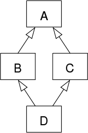
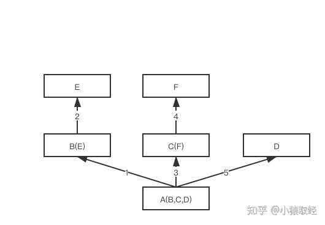
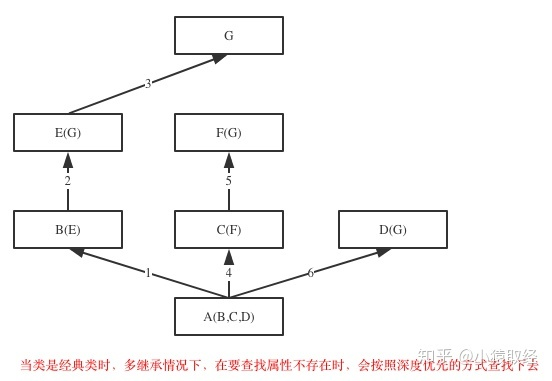
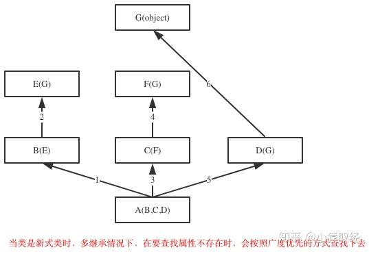

# 继承

&emsp;&emsp;继承是一种创建新类的方式，在 Python 中新建的类可以继承一个或多个父类，当一个类继承另一类的时候，将自动获取另一个类的所有的属性和方法。原有的类称为父类，新的类称为子类，子类继承父类的所有的属性和方法，同时还有自己的属性和方法：

```python
# 定义一个父类
class Animal:
    name = "旺财"
    def info(self):
        print("Animal...")


# 定义一个继承Animal的子类
class Dog(Animal):
    def __init__(self):
        self.weight=20

    def sayHello(self):
        print("汪汪汪....")


dog1 = Dog()

# 调用父类的属性和方法
print(dog1.name)
dog1.info()

# 调用子类的属性和方法
print(dog1.weight)
dog1.sayHello()
```

> <font color=orange>*__注意：__*</font>
>
> + 父类必须包含在当前的文件中，并且父类必须在子类的前面
> + 子类的圆括号里面必须指定父类的名称

&emsp;&emsp;通过类的内置属性  <font color=green>*__\_\_bases\_\___*</font> 可以查看类继承的所有父类：

```python
class Foo:
    pass


class Gar:
    pass


class Bar(Foo, Gar):
    pass


print(Bar.__bases__)
# (<class '__main__.Foo'>, <class '__main__.Gar'>)
```

&emsp;&emsp;类中提供了一个 <font color=green>*__super()__* </font>函数，该函数能够让你调用父类中的方法：

```python
# 定义一个父类
class Animal:
    def __init__(self, name, age):
        self.name = name
        self.age = age

    def info(self):
        print("name = {name}, age = {age}".format(name=self.name, age=self.age))


# 定义一个继承Animal的子类
class Dog(Animal):
    def __init__(self, name, age, weight):
        super().__init__(name, age)
        self.weight = weight

    def sayHello(self):
        print("汪汪汪....")


dog1 = Dog("旺财", 12, 20)
dog1.info()
print(dog1.weight)
dog1.sayHello()
```

> <font color=orange>**注意：**</font>`super()` 代表父类的定义，不是父类对象。

&emsp;&emsp;在子类中还可以重写父类中的方法，只要在子类中定义一个和父类一样名字的方法即可：

```python
# 定义一个父类
class Animal:
    def sayHello(self):
        print("Hello Animal")


# 定义一个继承Animal的子类
class Dog(Animal):
    def sayHello(self):
        print("Hello Dog")


dog1 = Dog()
dog1.sayHello() # Hello Dog
```

> <font color=orange>*__注意：__*</font>
>
> 在 Python 2 中有经典类与新式类之分：
>
> + 没有显式地继承 object 类的类以及该类的子类都是经典类
> + 显式地继承 object 的类以及该类的子类都是新式类。
>
> &emsp;&emsp;在 Python 3 中，即使没有显式地继承 object，也会默认继承该类，因而在 Python 3 中统一都是新式类。object 类主要提供了一些常用内置方法的实现，如：用来在打印对象时返回字符串的内置方法 `__str__` 等。

# 属性查找

&emsp;&emsp;有了继承关系后，对象在查找属性时的顺序如下：<font color=red> 先从对象自己的\_\_dict\_\_中查找，如果没有则去该类中查找，然后再去父类中找： </font>

```python
class Foo:
    def f1(self):
        print('Foo.f1')

    def f2(self):
        print('Foo.f2')
        self.f1()

class Bar(Foo):
    def f1(self):
        print('Bar.f1')


b = Bar()
b.f2()

# Foo.f2
# Bar.f1
```

+ `b.f2()` 会在父类 `Foo` 中找到 `f2`，先打印 `Foo.f2`
+ 然后执行到 `self.f1()`（即 `b.f1()`），此时仍会按照 <font color=red>对象本身 -> 类Bar -> 父类 Foo</font> 的顺序依次找下去，在类 `Bar` 中找到 `f1`，因而打印结果为 `Bar.f1`

&emsp;&emsp;如果父类不想让子类覆盖自己的方法，可以采用双下划线开头的方式将方法设置为私有的：

```python
class Foo:
    def __f1(self): 
        # 变形为_Foo__f1
        print('Foo.f1')

    def f2(self):
        print('Foo.f2')
        self.__f1() 
        # 变形为self._Foo__f1,因而只会调用自己所在的类中的方法


class Bar(Foo):
    def __f1(self): 
        # 变形为_Bar__f1
        print('Bar.f1')


b=Bar()
b.f2() 
# 在父类中找到f2方法，进而调用b._Foo__f1()方法，同样是在父类中找到该方法Foo.f1

# Foo.f2
# Foo.f1
```

# 继承的实现原理

<font color=orachid>**（一）菱形问题**</font>

&emsp;&emsp;菱形其实就是对下面这种继承结构的形象比喻：



&emsp;&emsp;A 类在顶部，B 类和 C 类分别位于其下方，D 类在底部将两者连接在一起形成菱形。这种继承结构下导致的问题称之为菱形问题：如果 A 中有一个方法，B 和 C 都重写了该方法，而 D没有重写它，那么 D 继承的是哪个版本的方法：

```python
class A(object):
    def test(self):
        print('from A')


class B(A):
    def test(self):
        print('from B')


class C(A):
    def test(self):
        print('from C')


class D(B,C):
    pass


obj = D()
obj.test() # 结果为：from B
```

&emsp;&emsp;看到代码执行的是类 B 中的代码，想要搞明白这个问题，就需要搞明白Python继承的实现原理。

<font color=orachid>**（二）继承原理**</font>

&emsp;&emsp;在 python 中，对于你定义的每一个类 Python 都会计算出一个方法解析顺序（`MRO`）列表，该列表就是一个简单的所有基类的线性顺序列表，新式类内置了 <font color=green>***mro***</font> 方法可以查看线性列表的内容：

```python
class A(object):
    def test(self):
        print('from A')


class B(A):
    def test(self):
        print('from B')


class C(A):
    def test(self):
        print('from C')


class D(B,C):
    pass

print(D.mro())
# [<class '__main__.D'>, <class '__main__.B'>, <class '__main__.C'>, <class '__main__.A'>, <class 'object'>]
```

> <font color=orange>*__注意：__*</font>经典类没有该内置该方法。

&emsp;&emsp;python 会在 `MRO` 列表上 <font color=red>从左到右开始查找基类</font>，直到找到第一个匹配这个属性的类为止。这个 `MRO` 列表的构造是通过一个 `C3` 线性化算法来实现的，它实际上就是合并所有父类的 `MRO` 列表并遵循如下三条准则：

+ 子类会先于父类被检查
+ 多个父类会根据它们在列表中的顺序被检查
+ 如果对下一个类存在两个合法的选择，选择第一个父类

> <font color=orange>*__注意：__*</font>
>
> + 由对象发起的属性查找，会从对象自身的属性里检索，没有则会按照对象的 `类.mro()`规定的顺序依次找下去
> + 由类发起的属性查找，会按照当前 `类.mro()` 规定的顺序依次找下去

<font color=orachid>**（三）深度优先和广度优先**</font>



&emsp;&emsp;当多继承结构为非菱形结构时会按照先找 B 这一条分支，然后再找 C 这一条分支，最后找D 这一条分支的顺序直到找到我们想要的属性：

```python
class E:
    def test(self):
        print('from E')


class F:
    def test(self):
        print('from F')


class B(E):
    def test(self):
        print('from B')


class C(F):
    def test(self):
        print('from C')


class D:
    def test(self):
        print('from D')


class A(B, C, D):
    pass


print(A.mro())
# [<class '__main__.A'>, <class '__main__.B'>, <class '__main__.E'>, <class '__main__.C'>, <class '__main__.F'>, <class '__main__.D'>, <class 'object'>]


obj = A()
obj.test() # 结果为：from B
```

&emsp;&emsp;如果继承关系为菱形结构，那么经典类与新式类会有不同 `MRO`，分别对应属性的两种查找方式：<font color=red>深度优先和广度优先</font>。

&emsp;&emsp;当类是经典类时，在多继承的时候，当要查找属性不存在时会按照深度优先的方法查下去：



```python
class G: 
    def test(self):
        print('from G')

class E(G):
    def test(self):
        print('from E')

class F(G):
    def test(self):
        print('from F')

class B(E):
    def test(self):
        print('from B')

class C(F):
    def test(self):
        print('from C')

class D(G):
    def test(self):
        print('from D')

class A(B,C,D):
    pass

obj = A()
obj.test() 
# 如上图，查找顺序为:obj->A->B->E->G->C->F->D->object
# 可依次注释上述类中的方法test来进行验证,注意请在python2.x中进行测试
```

&emsp;&emsp;当类是新式类并出现多继承的时候，在要查找属性不存在时会按照广度优先的方法查下去：



```python
class G(object):
    def test(self):
        print('from G')

class E(G):
    def test(self):
        print('from E')

class F(G):
    def test(self):
        print('from F')

class B(E):
    def test(self):
        print('from B')

class C(F):
    def test(self):
        print('from C')

class D(G):
    def test(self):
        print('from D')

class A(B,C,D):
    pass

obj = A()
obj.test() 
# 如上图，查找顺序为:obj->A->B->E->C->F->D->G->object
# 可依次注释上述类中的方法test来进行验证
```

# Python Mixins 机制

&emsp;&emsp;一个子类可以同时继承多个父类，这样的设计常被人诟病：

+ 它有可能导致可恶的菱形问题
+ 在人的世界观里继承应该是个 `is-a` 关系

&emsp;&emsp;但有时候一个类确实需要继承多个类（如：民航飞机、直升飞机、轿车都是一个交通工具，但前两者都有一个功能是飞行，而轿车没有），所以如果我们把飞行功能放到交通工具这个父类中是不合理的：

```python
class Vehicle:  # 交通工具
    def fly(self):
        '''
        飞行功能相应的代码        
        '''
        print("I am flying")


class CivilAircraft(Vehicle):  
    # 民航飞机
    pass


class Helicopter(Vehicle):  
    # 直升飞机
    pass


class Car(Vehicle):  
    # 汽车并不会飞，但按照上述继承关系，汽车也能飞了
    pass
```

&emsp;&emsp;但如果 `CivilAircraft` 和 `Helicopter` 都各自写自己的飞行 `fly` 方法又违背了代码尽可能重用的原则，为了尽可能地重用代码，就只能再定义一个飞行器的类，然后让  `CivilAircraft` 和 `Helicopter` 同时继承交通工具以及飞行器两个父类，这样就出现了多重继承。

&emsp;&emsp;在其它语言中通过接口实现了该功能，但是 Python 语言没有接口的功能。Python 提供了 `Mixins` 机制，简单来说 <font color=red>Mixins 机制指的是子类混合（mixin）不同类的功能，而这些类采用统一的命名规范（例如：Mixin 后缀），以此标识这些类只是用来混合功能的，并不是用来标识子类的从属关系的</font>，所以 `Mixins` 机制本质仍是多继承，同样遵守 `is-a` 关系：

```python
class Vehicle:  # 交通工具
    pass

class FlyableMixin:
    def fly(self):
        '''
        飞行功能相应的代码        
        '''
        print("I am flying")

class CivilAircraft(FlyableMixin, Vehicle):  
    # 民航飞机
    pass


class Helicopter(FlyableMixin, Vehicle):  
    # 直升飞机
    pass


class Car(Vehicle):  
    # 汽车
    pass
```

&emsp;&emsp;上面的 `CivilAircraft`、`Helicopter` 类实现了多继承，不过它继承的第一个类起名为`FlyableMixin`，用来告知这个类是一个 `Mixin` 类，表示混入（mix-in），这种命名方式就是用来明确地告诉别人这个类是作为功能添加到子类中，而不是作为父类，它的作用类似于接口。所以从含义上理解，`CivilAircraft`、`Helicopter` 类都只是一个 `Vehicle`，而不是一个飞行器。

&emsp;&emsp;使用 `Mixin` 类实现多重继承要注意下面的问题：

+ 首先它必须表示某一种功能，而不是某个物品
+ python 对于 `mixin` 类的命名方式一般以 `Mixin`、`able`、`ible` 为后缀
+ 它必须责任单一，如果有多个功能那就写多个 `Mixin` 类，一个类可以继承多个 `Mixin`，为了保证遵循继承的 `is-a` 原则，只能继承一个标识其归属含义的父类
+ 它不依赖于子类的实现，子类即便没有继承这个 `Mixin` 类，也照样可以工作，就是缺少了某个功能（比如：飞机照样可以载客，就是不能飞了）

&emsp;&emsp;`Mixins` 是从多个类中重用代码的好方法，但是需要付出相应的代价。定义的 `Minx` 类越多，子类的代码可读性就会越差，并且在继承的层级变多时，代码阅读者在定位某一个方法到底在何处调用时会晕头转向：

```python
class Displayer:
    def display(self, message):
        print(message)


class LoggerMixin:
    def log(self, message, filename='logfile.txt'):
        with open(filename, 'a') as fh:
            fh.write(message)

    def display(self, message):
        super().display(message) 
        self.log(message)


class MySubClass(LoggerMixin, Displayer):
    def log(self, message):
        super().log(message, filename='subclasslog.txt') 


obj = MySubClass()
obj.display("This string will be shown and logged in subclasslog.txt")
# 属性查找的发起者是obj,所以会参照类MySubClass的MRO来检索属性
#[<class '__main__.MySubClass'>, <class '__main__.LoggerMixin'>, <class '__main__.Displayer'>, <class 'object'>]
```

+ 首先会去对象 `obj` 的类 `MySubClass` 找方法 `display`，没有则去 类 `LoggerMixin` 中找，找到开始执行代码
+ 执行 `LoggerMixin` 的第一行代码 `super().display(message)`，参照 `MySubClass.mro()`，`super` 会去下一个类（即类 `Displayer`）中找，找到 `display` 并开始执行代码，打印消 `"This string will be shown and logged in subclasslog.txt"`
+ 执行 `LoggerMixin` 的第二行代码 `self.log(message)`，`self` 是对象 `obj` ，即 `obj.log(message)`，属性查找的发起者为 `obj`，所以会按照其类 `MySubClass.mro()` 的顺序查找，在`MySubClass` 中找到方法 `log`
+ 开始执行 `super().log(message, filename='subclasslog.txt')`，`super` 会按照`MySubClass.mro()` 查找下一个类，在类 `LoggerMixin` 中找到 `log` 方法开始执行，最终将日志写入文件 `subclasslog.txt`

> <font color=orange>*__注意：__*</font>Python 也有抽象类的概念，但是需要借助模块实现。抽象类是一个特殊的类，它的特殊之处在于只能被继承，不能被实例化，继承的子类必须实现抽象基类规定的方法，这样便可保证始终只有一个特定方法或属性的实现，并且不会产生歧义，因而也可以起到避免菱形问题的作用。

# 派生与方法重用

&emsp;&emsp;子类可以派生出自己新的属性，在进行属性查找时，子类中的属性名会优先于父类被查找：


```python
class People:
    school='清华大学'
    def __init__(self,name,sex,age):
        self.name=name
        self.sex=sex
        self.age=age

class Teacher(People):
    def __init__(self,name,sex,age,title): # 派生.
        self.name=name
        self.sex=sex
        self.age=age
        self.title=title

    def teach(self):
            print('%s is teaching' % self.name)        

obj=Teacher('lili','female',28,'高级讲师')
# 只会找自己类中的__init__，并不会自动调用父类的
print(obj.name,obj.sex,obj.age, obj.title)
# ('lili', 'female', 28, '高级讲师')
```

&emsp;&emsp;很明显子类 `Teacher` 中 `__init__` 内的前三行是在写重复代码，若想在子类派生出的方法内重用父类的功能，有两种实现方式：

<font color=orachid>**（一）方法一**</font>

&emsp;&emsp;"指名道姓" 地调用某一个类的函数：

```python
class People:
    school='清华大学'
    def __init__(self,name,sex,age):
        self.name=name
        self.sex=sex
        self.age=age

class Teacher(People):
    def __init__(self,name,sex,age,title):
        People.__init__(self,name,age,sex)
        #调用的是函数,因而需要传入self.
        self.title=title
        
    def teach(self):
        print('%s is teaching' %self.name)

obj=Teacher('lili','female',28,'高级讲师')
print(obj.name,obj.sex,obj.age, obj.title)
# lili 28 female 高级讲师
```

<font color=orachid>**（二）方法二**</font>

&emsp;&emsp;通过调用 `super()` 方法，该方法会得到一个特殊的对象，专门用来引用父类的属性，且严格按照 `MRO` 规定的顺序向后查找：

```python
class People:
    school='清华大学'
    def __init__(self,name,sex,age):
        self.name=name
        self.sex=sex
        self.age=age


class Teacher(People):
    def __init__(self,name,sex,age,title):
        super().__init__(name,age,sex)
        #调用的是绑定方法，自动传入self
        self.title=title
        
    def teach(self):
        print('%s is teaching' %self.name)

obj=Teacher('lili','female',28,'高级讲师')
print(obj.name,obj.sex,obj.age, obj.title)
# lili 28 female 高级讲师
```

> <font color=orange>*__注意：__* </font>在 Python 2 中 super 的使用需要完整地写成 `super(自己的类名,self) `，而在 python 3 中可以简写为 `super()` 。

&emsp;&emsp;这两种方式的区别是方式一跟继承没有关系，而方式二的 `super()` 是依赖于继承的，并且即使没有直接继承关系，`super()` 仍然会按照 `MRO` 继续往后查找：

```python
class A:
    def test(self):
        super().test()

class B:
    def test(self):
        print('from B')

class C(A,B):
    pass

C.mro() # 在代码层面A并不是B的子类，但从MRO列表来看，属性查找时，就是按照顺序C->A->B->object，
# [<class '__main__.C'>, <class '__main__.A'>, <class '__main__.B'>,<class ‘object'>]
obj=C()
obj.test()
# 属性查找的发起者是类C的对象obj，所以中途发生的属性查找都是参照C.mro()
# from B
```

&emsp;&emsp;`obj.test()` 首先找到 A 下的 test 方法，执行 `super().test()` 会基于 `MRO` 列表当前所处的位置继续往后查找，最后在 B 中找到了 test 方法并执行。

# 组合

&emsp;&emsp;<font color=red>在一个类中以另外一个类的对象作为数据属性称为类的组合</font>。组合与继承都是用来解决代码的重用性问题，不同的是：

+ 继承是一种 "是" 的关系（比如：老师是人、学生是人），当类之间有很多相同的之处就应该使用继承
+ 组合则是一种 "有" 的关系（比如：老师有生日，老师有多门课程），当类之间有显著不同，并且较小的类是较大的类所需要的组件时，应该使用组合

```python
class Course:
    def __init__(self,name,period,price):
        self.name=name
        self.period=period
        self.price=price

    def tell_info(self):
        print('<%s %s %s>' %(self.name,self.period,self.price))

class Date:
    def __init__(self,year,mon,day):
        self.year=year
        self.mon=mon
        self.day=day

    def tell_birth(self):
       print('<%s-%s-%s>' %(self.year,self.mon,self.day))

class People:
    school='清华大学'
    def __init__(self,name,sex,age):
        self.name=name
        self.sex=sex
        self.age=age

#Teacher类基于继承来重用People的代码，基于组合来重用Date类和Course类的代码
class Teacher(People): #老师是人
    def __init__(self,name,sex,age,title,year,mon,day):
        super().__init__(name,age,sex)
        self.birth=Date(year,mon,day) #老师有生日
        self.courses=[] #老师有课程，可以在实例化后，往该列表中添加Course类的对象

    def teach(self):
        print('%s is teaching' %self.name)


python=Course('python','3mons',3000.0)
linux=Course('linux','5mons',5000.0)

teacher1=Teacher('lili','female',28,'博士生导师',1990,3,23)

# teacher1有两门课程
teacher1.courses.append(python)
teacher1.courses.append(linux)

# 重用Date类的功能
teacher1.birth.tell_birth()

# 重用Course类的功能
for obj in teacher1.courses:
    obj.tell_info()
```

# 多态

&emsp;&emsp;多态指的是一类事物有多种形态（比如：动物有猫、狗、猪等多种形态），多态性指的是可以在不用考虑对象具体类型的情况下而直接使用对象，这就需要在设计时把对象的使用方法统一成一种，如 cat、dog、pig 都是动物，凡是动物肯定有 talk 方法，就可以不用考虑它们三者的具体是什么类型的动物，而直接使用：

```python
class Animal:
    def talk(self):
        pass

class Dog(Animal):
    def talk(self):
        print("汪汪汪...")

class Cat(Animal):
    def talk(self):
        print("喵喵喵...")

animal1 = Dog()
animal2 = Cat()
animal1.talk()
animal2.talk()
```

&emsp;&emsp;可以定义一个统一的接口来使用：

```python
class Animal:
    def talk(self):
        pass

class Dog(Animal):
    def talk(self):
        print("汪汪汪...")

class Cat(Animal):
    def talk(self):
        print("喵喵喵...")

animal1 = Dog()
animal2 = Cat()

def Talk(animal):
    animal.talk()

Talk(animal1)
Talk(animal2)
```

&emsp;&emsp;多态性的好处在于增强了程序的灵活性和可扩展性，比如通过继承 Animal 类创建了一个新的类，实例化得到的对象 obj，可以使用相同的方式使用 `obj.talk()`：

```python
class Animal:
    def talk(self):
        pass

class Duck(Animal): # 动物的另外一种形态：鸭子
    def talk(self):
        print('嘎嘎嘎...')

d=Duck() # 实例出一只鸭子
d.talk() # 使用者根本无需关心d是什么类型而调用talk
```

&emsp;&emsp;多态性的本质在于不同的类中定义有相同的方法名，这样就可以不考虑类而统一用一种方式去使用对象，可以通过在父类引入抽象类的概念来硬性限制子类必须有某些方法名：

```python
import abc

# 指定metaclass属性将类设置为抽象类，抽象类本身只是用来约束子类的，不能被实例化
class Animal(metaclass=abc.ABCMeta):
    @abc.abstractmethod # 该装饰器限制子类必须定义有一个名为talk的方法
    def talk(self): # 抽象方法中无需实现具体的功能
        pass

class Cat(Animal): # 但凡继承Animal的子类都必须遵循Animal规定的标准
    def talk(self):
        pass

cat=Cat() # 若子类中没有一个名为talk的方法则会抛出异常TypeError，无法实例化
```

&emsp;&emsp;但其实我们完全可以不依赖于继承，只需要制造出外观和行为相同对象，同样可以实现不考虑对象类型而使用对象，这正是 Python 崇尚的 <font color=red>鸭子类型（duck typing）</font>。比起继承的方式，鸭子类型在某种程度上实现了程序的松耦合度：


```python
# 二者看起来都像文件,因而就可以当文件一样去用，然而它们并没有直接的关系
class Txt: # Txt 类有两个与文件类型同名的方法，即 read 和 write
    def read(self):
        pass
    def write(self):
        pass

class Disk: # Disk类也有两个与文件类型同名的方法：read 和 write
    def read(self):
        pass
    def write(self):
        pass
```

