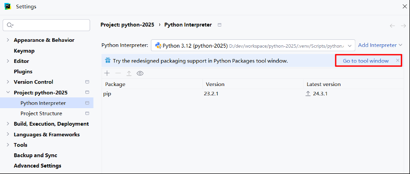
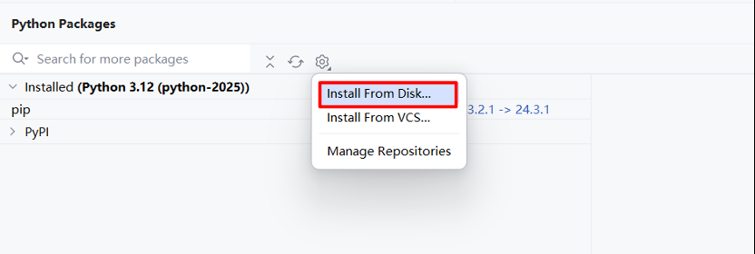
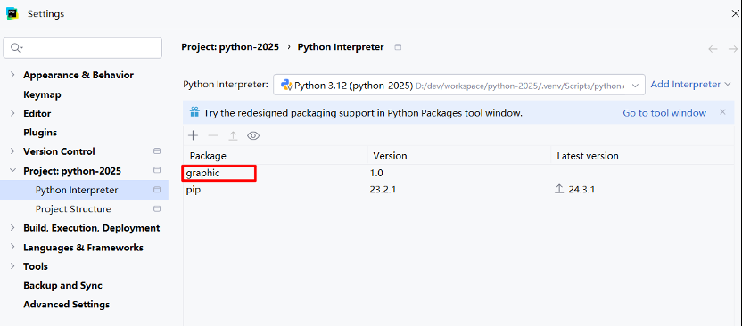

# 模块

&emsp;&emsp;在 Python 中 <font color=red>一个 py 文件就是一个模块（文件名为 xxx.py 的模块名就是 xxx）</font>，导入模块就可以引用模块中已经写好的功能：

+ 将程序模块化会使得程序的组织结构清晰，维护起来更加方便
+ 比起直接开发一个完整的程序，单独开发一个小的模块也更加简单
+ 程序中的模块可以被重复使用

&emsp;&emsp;总结下来，使用模块既保证了代码的重用性，又增强了程序的结构性和可维护性。除了自定义模块外，还可以导入内置或第三方模块提供的功能，极大地提高了程序员的开发效率。

## 基本语法

<font color=orachid>**（一）import ... 语法**</font>

&emsp;&emsp;首先创建一个 <font color=darkgray>***foo.py***</font> 文件：

```python
x = 1

def get():
    print(x)
    

def change():
    global x
    x=0
    
    
class Foo:
    def func(self):
       print('from the func')
```

&emsp;&emsp;要想在另外一个文件中引用 <font color=darkgray>***foo.py***</font> 中的功能，需要使用 <font color=green>***import foo***</font> 语法：

```python
import foo #导入模块foo

a = foo.x #引用模块foo中变量x的值赋值给当前名称空间中的名字a

foo.change() #调用模块foo中的change函数

foo.get() #调用模块foo的get函数

obj=foo.Foo() #使用模块foo的类Foo来实例化，进一步可以执行obj.func()
obj.func()
```

&emsp;&emsp;首次导入模块会做三件事：

+ 执行源文件代码
+ 产生一个新的名称空间用于存放源文件执行过程中产生的名字
+ 在当前执行文件所在的名称空间中得到一个名字（如案例中的 `foo`），该名字指向新创建的模块名称空间，若要引用模块名称空间中的名字就需要加上该前缀

&emsp;&emsp;加上 `foo.` 作为前缀就说明要引用 `foo` 名称空间中的名字，所以肯定不会与当前执行文件所在名称空间中的名字相冲突。若当前执行文件的名称空间中也存在 `x`，当执行 `foo.get()` 或 `foo.change()` 操作的都是源文件中的全局变量 `x`：

```python
import foo #导入模块foo

x = 100

def show_x ():
    print(x)

foo.change()
foo.get() # 0
show_x() # 100
```

> <font color=orange>**注意：**</font>
>
> + 第一次导入模块的时候就已经将其加载到内存空间了，之后的重复导入会直接引用内存中已存在的模块，不会重复执行文件
> + 可以通过 <font color=green>***import sys***</font> 导入 `sys` 模块，然后打印 <font color=green>***sys.modules***</font> 的值就可以看到内存中已经加载的模块名
> + 在 Python 中模块也属于第一类对象，可以进行赋值、数据传递以及作为容器类型的元素等操作
> + 模块名应该遵循小写形式

&emsp;&emsp;可以使用 `import` 语句导入多个模块：

```python
# 第一种方式
# 推荐使用：更为规范，可读性更强
# 为了区分导入模块的类型，一般将模块进行分类导入
# 一类模块的导入与另外一类的导入用空行隔开，不同类别的导入顺序如下：
#1. Python 内置模块
#2. 第三方模块
#3. 程序员自定义模块
import module1
import module2
# ...
import moduleN


# 第二种方式
import module1,module2,...,moduleN
```

> <font color=orange>**注意：**</font>也可以在函数内导入模块，在文件开头导入模块属于全局作用域，在函数内导入的模块则属于局部的作用域。


<font color=orachid>**（二）form ... import ... 语法**</font>

&emsp;&emsp;`from...import...` 与 `import` 语句基本一致，不同的是使用 `import foo` 导入模块后，引用模块中的名字都需要加上 `foo.` 作为前缀，而使用 `from foo import x,get,change,Foo` 则可以在当前执行文件中直接引用模块 `foo` 中的名字：

```python
from foo import x,get,change #将模块foo中的x和get导入到当前名称空间
a=x #直接使用模块foo中的x赋值给a
get() #直接执行foo中的get函数
change() #即便是当前有重名的x，修改的仍然是源文件中的x
```

> <font color=orange>**注意：**</font>无需加前缀的好处是使得代码更加简洁，坏处则是容易与当前名称空间中的名字冲突。如果当前名称空间存在相同的名字，则后定义的名字会覆盖之前定义的名字。

&emsp;&emsp;`from` 语句还支持 `from foo import *` 语法，`*` 代表将 `foo` 中所有的名字都导入到当前位置：

```python
from foo import * #把foo中所有的名字都导入到当前执行文件的名称空间中，在当前位置直接可以使用这些名字

a=x
get()
change()
obj=Foo()
```

> <font color=orange>**注意：**</font>如果需要引用模块中的名字过多的话，可以采用 `*` 导入来达到节省代码量的效果。但只能在模块最顶层使用 `*` 的方式导入，在函数内则非法。并且 `*` 的方式会带来一种副作用，即无法搞清楚究竟从源文件中导入了哪些名字到当前位置，这极有可能与当前位置的名字产生冲突。

&emsp;&emsp;模块的编写者可以在自己的文件中定义 `__all__` 变量用来控制 `*` 代表的意思：

```python
# foo.py
__all__=['x','get'] #该列表中所有的元素必须是字符串类型，每个元素对应foo.py中的一个名字
x=1
def get():
    print(x)
def change():
    global x
    x=0
class Foo:
    def func(self):
       print('from the func')
```

&emsp;&emsp;在另外一个文件中使用 `*` 导入时就只能导入 `__all__` 定义的名字了：

```python
from foo import * #此时的*只代表x和get

x #可用
get() #可用
change() #不可用
Foo() #不可用
```

<font color=orachid>**（三）导入的时候起别名**</font>

&emsp;&emsp;还可以为导入的模块起一个别名：

```python
import foo as f #为导入的模块foo在当前位置起别名f，以后再使用时就用这个别名f
f.x
f.get()
```

&emsp;&emsp;还可以为导入的一个名字起别名：

```python
from foo import get as get_x
get_x()
```

&emsp;&emsp;通常在被导入的名字过长时采用起别名的方式来精简代码，另外为被导入的名字起别名可以很好地避免与当前名字发生冲突。除此之外，还有很重要的一点就是可以保持调用方式的一致性。例如有两个模块同时实现了 `load` 方法，作用是从一个打开的文件中解析出结构化的数据（但解析的格式不同），可以用下述代码有选择性地加载不同的模块：

```python
if data_format == 'json':
    import json as serialize #如果数据格式是json，那么导入json模块并命名为serialize
elif data_format == 'pickle':
    import pickle as serialize #如果数据格式是pickle，那么导入pickle模块并命名为serialize

data=serialize.load(fn) #最终调用的方式是一致的
```

<font color=orachid>**（四）\_\_import\_\_()**</font>

&emsp;&emsp;import 语句本质上就是调用内置函数 `__import__()` ，我们可以通过它实现动态导入。给 `__import__()` 动态传递不同的的参数值，就能导入不同的模块：

```python
s = "math"
m = __import__(s) #导入后生成的模块对象的引用给变量m
print(m.pi)
```

&emsp;&emsp;一般不建议我们自行使用 `__import__()` 导入，其行为在 python2 和 python3 中有差异，会导致意外错误。如果需要动态导入可以使用 <font color=red>importlib</font> 模块：

```python
import importlib
a = importlib.import_module("math")
print(a.pi)
```

## 循环导入问题

&emsp;&emsp;循环导入问题指的是在一个模块加载/导入的过程中导入另外一个模块，而在另外一个模块中又返回来导入第一个模块中的名字，由于第一个模块尚未加载完毕，所以引用失败、抛出异常。究其根源就是在 Python 中，同一个模块只会在第一次导入时执行其内部代码，再次导入该模块时，即便是该模块尚未完全加载完毕也不会去重复执行内部代码：

```python
# m1.py
print('正在导入m1')
from m2 import y

x='m1'

# m2.py
print('正在导入m2')
from m1 import x

y='m2'

# run.py
import m1
```

<font color=orachid>**（一）执行 run.py 文件**</font>

&emsp;&emsp;此时，如果执行 <font color=darkgray>***run.py***</font> 文件会得到下面的结果：

```tex
正在导入m1
正在导入m2
Traceback (most recent call last):
  File "/Users/linhaifeng/PycharmProjects/pro01/1 aaaa练习目录/aa.py", line 1, in <module>
    import m1
  File "/Users/linhaifeng/PycharmProjects/pro01/1 aaaa练习目录/m1.py", line 2, in <module>
    from m2 import y
  File "/Users/linhaifeng/PycharmProjects/pro01/1 aaaa练习目录/m2.py", line 2, in <module>
    from m1 import x
ImportError: cannot import name 'x'
```

&emsp;&emsp;执行 <font color=darkgray>***run.py***</font> 文件的过程解析如下：

1. 执行 `run.py`
2. 执行 `import m1`，开始导入 `m1` 并运行其内部代码
3. 打印内容 `正在导入m1`
4. 执行 `from m2 import y` 开始导入 `m2` 并运行其内部代码
5. 打印内容 `正在导入m2`
6. 执行 `from m1 import x` ，由于 `m1` 已经被导入过了，所以不会重新导入。此时去 `m1` 中拿 `x`，但 `x` 并没有存在于 `m1` 中，所以报错

<font color=orachid>**（二）执行 m1.py 文件**</font>

&emsp;&emsp;此时，如果执行 <font color=darkgray>***m1.py***</font> 文件会得到下面的结果：

```tex
正在导入m1
正在导入m2
正在导入m1
Traceback (most recent call last):
  File "/Users/linhaifeng/PycharmProjects/pro01/1 aaaa练习目录/m1.py", line 2, in <module>
    from m2 import y
  File "/Users/linhaifeng/PycharmProjects/pro01/1 aaaa练习目录/m2.py", line 2, in <module>
    from m1 import x
  File "/Users/linhaifeng/PycharmProjects/pro01/1 aaaa练习目录/m1.py", line 2, in <module>
    from m2 import y
ImportError: cannot import name 'y'
```

&emsp;&emsp;执行 <font color=darkgray>***m1.py***</font> 文件的过程解析如下：

1. 执行 `m1.py` 文件，打印 `正在导入m1`
2. 执行 `from m2 import y` 导入 `m2` 
3. 执行 `m2.py` 内部代码
4. 打印 `正在导入m2`
5. 执行 `from m1 import x`，此时 `m1` 是第一次被导入（执行 `m1.py` 并不等于导入了 `m1` ）
6. 开始导入 `m1` 并执行其内部代码，打印 `正在导入m1`，执行 `from m2 import y`，由于 `m2` 已经被导入过了，所以无需继续导入
7. 直接问 `m2` 要 `y` ，然而 `y` 此时并没有存在于 `m2` 中，所以报错

&emsp;&emsp;要解决循环导入问题有两种方式，第一种方式是将导入语句放到最后，这样就可以保证在导入时所有名字都已经加载过：

```python
# 文件：m1.py
print('正在导入m1')

x='m1'

from m2 import y

# 文件：m2.py
print('正在导入m2')
y='m2'

from m1 import x

# 文件：run.py内容如下，执行该文件，可以正常使用
import m1
print(m1.x)
print(m1.y)
```

&emsp;&emsp;第二种方法是将导入语句放到函数中，只有在调用函数时才会执行其内部代码：

```python
# 文件：m1.py
print('正在导入m1')

def f1():
    from m2 import y
    print(x,y)

x = 'm1'

# 文件：m2.py
print('正在导入m2')

def f2():
    from m1 import x
    print(x,y)

y = 'm2'

# 文件：run.py内容如下，执行该文件，可以正常使用
import m1

m1.f1()
```

> <font color=orange>**注意：**</font>循环导入问题大多数情况是因为程序设计失误导致，上述解决方案也只是在烂设计之上的无奈之举，在我们的程序中应该尽量避免出现循环/嵌套导入，如果多个模块确实都需要共享某些数据，可以将共享的数据集中存放到某一个地方，然后进行导入。

## 搜索模块的路径与优先级

&emsp;&emsp;模块可以分为四个通用类别：

+ 使用纯 Python 代码编写的 py 文件
+ 包含一系列模块的包
+ 使用 C 编写并链接到 Python 解释器中的内置模块
+ 使用 C 或 C++ 编译的扩展模块

&emsp;&emsp;在导入一个模块时，如果该模块已经加载到内存中则直接引用，否则会优先查找内置模块，然后按照从左到右的顺序依次检索 `sys.path` 中定义的路径，直到找模块对应的文件为止，否则抛出异常。`sys.path` 也被称为模块的搜索路径，它是一个列表类型：

```python
import sys

print(sys.path)
"""
['d:\\CodeSpace\\LearnCode\\LearnPython', 'C:\\Users\\Administrator\\AppData\\Local\\Programs\\Python\\Python311\\python311.zip', 'C:\\Users\\Administrator\\AppData\\Local\\Programs\\Python\\Python311\\DLLs', 'C:\\Users\\Administrator\\AppData\\Local\\Programs\\Python\\Python311\\Lib', 'C:\\Users\\Administrator\\AppData\\Local\\Programs\\Python\\Python311', 'C:\\Users\\Administrator\\AppData\\Local\\Programs\\Python\\Python311\\Lib\\site-packages']
"""
```

&emsp;&emsp;列表中的每个元素都可以当作一个目录来看，在列表中会发现有 `.zip` 或 `.egg` 结尾的文件（二者是不同形式的压缩文件），事实上 Python 确实支持从一个压缩文件中导入模块，我们也只需要把它们都当成目录去看即可。`sys.path` 中的第一个路径通常为空，代表执行文件所在的路径，所以在被导入模块与执行文件在同一目录下时肯定是可以正常导入的。而针对被导入的模块与执行文件在不同路径下的情况，为了确保模块对应的源文件仍可以被找到，需要将源文件所在的路径添加到 `sys.path` 中：

```python
import sys
sys.path.append(r'/pythoner/projects/') #也可以使用sys.path.insert(……)

import foo #无论foo.py在何处,我们都可以导入它了
```

## 区分 py 文件的两种用途

&emsp;&emsp;一个 Python 文件有两种用途

+ 被当主程序/脚本执行
+ 被当模块导入

&emsp;&emsp;为了区别同一个文件的不同用途，每个 py 文件都内置了 `__name__` 变量，该变量在 `py` 文件被当做脚本执行时赋值为 `__main__` ，在 `py` 文件被当做模块导入时赋值为模块名。作为模块的开发者，可以在文件末尾基于 `__name__` 在不同应用场景下值的不同来控制文件执行不同的逻辑：

```python
#foo.py
...
if __name__ == '__main__':
    foo.py被当做脚本执行时运行的代码
else:
    foo.py被当做模块导入时运行的代码
```

&emsp;&emsp;通常我们会在 `if` 的子代码块中编写针对模块功能的测试代码，在模块作为脚本运行时就会执行测试代码，而被当做模块导入时则不用执行测试代码。

## dir 函数

&emsp;&emsp;`dir()` 是一个内置函数，主要用于列出对象的属性和方法或者列出当前作用域中定义的名称，并以一个字符串列表的形式返回。当将一个模块作为 `dir()` 的参数时，它会返回该模块中定义的名称列表（包括函数、类、变量等）：

```python
import math

# 查看 math 模块下的
print(dir(math))
```

&emsp;&emsp;当将一个对象作为 `dir()` 的参数时，它会返回该对象的属性和方法列表：

```python
class MyClass:
    def __init__(self):
        self.x = 1
        self.y = 2
    
    def method(self):
        pass
        
obj = MyClass()
print(obj)
```

&emsp;&emsp;当不传递任何参数调用 `dir()` 时，它会列出当前作用域中定义的名称（包括变量、函数、类等）：

```python
def my_function():
    pass


variable = 10
print(dir())
```

## 编写一个规范的模块

&emsp;&emsp;我们在编写 `py` 文件时，需要时刻提醒自己，该文件既是给自己用的，也有可能会被其他人使用，因而代码的可读性与易维护性显得十分重要，为此我们在编写一个模块时最好按照统一的规范去编写：

```python
#!/usr/bin/env python #通常只在类unix环境有效,作用是可以使用脚本名来执行，而无需直接调用解释器。

"""The module is used to...""" #模块的文档描述

import sys #导入模块

x=1 #定义全局变量,如果非必须,则最好使用局部变量,这样可以提高代码的易维护性,并且可以节省内存提高性能

class Foo: #定义类,并写好类的注释
    'Class Foo is used to...'
    pass

def test(): #定义函数,并写好函数的注释
    'Function test is used to…'
    pass

if __name__ == '__main__': #主程序
    test() #在被当做脚本执行时,执行此处的代码
```

# 包

## 包的基本使用

&emsp;&emsp;随着模块数目的增多，把所有模块不加区分地放到一起也是极不合理的，于是 Python 为我们提供了一种把模块组织到一起的方法（即创建一个包）。包就是一个含有 `__init__.py` 文件的文件夹，文件夹内可以组织子模块或子包：

```python
pool/                #顶级包
├── __init__.py     
├── futures          #子包
│   ├── __init__.py
│   ├── process.py
│   └── thread.py
  └── versions.py      #子模块
```

> <font color=orange>**注意：**</font>
>
> + 在 Python 3 中，即使包下没有 `__init__.py`文件，`import` 包仍然不会报错；而在 Python 2 中包下一定要有该文件，否则 `import` 包报错
> + 创建包的目的不是为了运行，而是被导入使用，包只是模块的一种形式而已，包的本质就是一种模块

&emsp;&emsp;接下来我们就以包 `pool` 为例来介绍包的使用，包内各文件内容如下：

```python
# process.py
class ProcessPoolExecutor:
    def __init__(self,max_workers):
        self.max_workers=max_workers

    def submit(self):
        print('ProcessPool submit')

# thread.py
class ThreadPoolExecutor:
    def __init__(self, max_workers):
        self.max_workers = max_workers

    def submit(self):
        print('ThreadPool submit')

# versions.py
def check():
    print('check versions')

# __init__.py文件内容均为空
```

<font color=orachid>**（一）导入包与 \_\_init\_\_.py **</font>

&emsp;&emsp;包属于模块的一种，因而包以及包内的模块均是用来被导入使用的，而绝非被直接执行，首次导入包同样会做三件事：

1. 执行包下的 `__init__.py` 文件
2. 产生一个新的名称空间用于存放 `__init__.py` 执行过程中产生的名字
3. 在当前执行文件所在的名称空间中得到一个名字 `pool`，该名字指向 `__init__.py` 的名称空间（例如`pool.xxx` 和 `pool.yyy` 中的 `xxx` 和 `yyy` 都是来自于 `pool` 下的`__init__.py`），也就是说导入包时并不会导入包下所有的子模块与子包

```python
import pool

pool.versions.check() #抛出异常AttributeError
pool.futures.process.ProcessPoolExecutor(3) #抛出异常AttributeError
```

&emsp;&emsp;`pool.versions.check()` 要求 `pool` 下有名字 `versions`，进而 `pool.versions` 下有名字 `check` 。`pool.versions` 下已经有名字 `check` 了，所以问题出在 `pool` 下没有名字 `versions` ，这就需要在 `pool` 下的 `__init__.py` 中导入模块 `versions`。

> <font color=orange>**注意：**</font>
>
> + 关于包相关的导入语句也分为 `import` 和 `from ... import ...` 两种，但是无论哪种、无论在什么位置，在导入时都必须遵循一个原则：<font color=red>凡是在导入时带点的，点的左边都必须是一个包，否则非法</font>。可以带有一连串的点（如：`import 顶级包.子包.子模块`），必须都遵循这个原则。导入后再使用时就没有这种限制了，点的左边可以是包、模块、函数或者类（它们都可以用点的方式调用自己的属性）
> + 包 A 和包 B 下有同名模块也不会冲突
> + import 导入文件时，产生名称空间中的名字来源于文件；import 包时产生的名称空间的名字同样来源于文件（包下的 `__init__.py`），导入包的本质就是在导入该文件

## 绝对导入与相对导入

&emsp;&emsp;针对包内的模块之间互相导入，导入的方式有两种：

<font color=orachid>**（一）绝对导入**</font>

&emsp;&emsp;绝对导入是以顶级包为起始：

```python
# pool 下的 __init__.py
from pool import versions
```

<font color=orachid>**（二）相对导入**</font>

&emsp;&emsp;相对导入代表当前文件所在的目录，`..` 代表当前目录的上一级目录：

```python
# pool 下的 __init__.py
from . import versions
```

&emsp;&emsp;同理，针对 `pool.futures.process.ProcessPoolExecutor(3)` 则需要：

```python
# 操作pool 下的 __init__.py ，保证pool.futures
from . import futures # 或 from pool import futures

# 操作futrues 下的 __init__.py，保证 pool.futures.process
from . import process # 或 from pool.futures import process
```

&emsp;&emsp;在包内使用相对导入还可以跨目录导入模块（也能使用绝对导入），导入过程中同样会依次执行包下的`__init__.py`，只是基于 import 导入的结果，使用时必须加上该前缀：

```python
import pool.futures # 拿到名字 pool.futures 指向 futures 下的 __init__.py
pool.futures.xxx # 要求 futures 下的 __init__.py 中必须有名字 xxx
```

&emsp;&emsp;相对导入只能用 `from module import symbol` 的形式，`import ..versions` 语法是不对的，并且 `symbol` 只能是一个明确的名字：

```python
from pool import futures.process # 语法错误
from pool.futures import process # 语法正确
```

&emsp;&emsp;针对包内部模块之间的相互导入推荐使用相对导入，需要特别强调：

+ 相对导入只能在包内部使用，用相对导入不同目录下的模块是非法的
+ 无论是 `import` 还是 `from-import`，但凡是在导入时带点的，点的左边必须是包，否则语法错误

> <font color=orange>**总结包使用的注意事项：**</font>
>
> + 导包就是在导包下 `__init__.py` 文件
> + 包内部的导入应该使用相对导入，相对导入也只能在包内部使用，而且 `..` 取上一级不能出包
> + 使用语句中的点代表的是访问属性（如 `m.n.x`，向 m 要 n，向 n 要 x）；导入语句中的点代表的是路径分隔符，（如：`import a.b.c` ，文件夹下 a 下有子文件夹 b，文件夹 b 下有子文件或文件夹 c），所以导入语句中点的左边必须是一个包

## from 包 import *

&emsp;&emsp;在使用包时同样支持 `from pool.futures import *`，`*` 代表的是 futures 下 `__init__.py` 中所有的名字，通用是用变量 `__all__` 来控制 `*` 代表的意思：

```python
# futures下的__init__.py
__all__=['process','thread']
```

&emsp;&emsp;包内部的目录结构通常是包的开发者为了方便自己管理和维护代码而创建的，这种目录结构对包的使用者往往是无用的，此时通过操作 `__init__.py` 可以隐藏包内部的目录结构、降低使用难度，如想要让使用者直接使用：

```python
import pool

pool.check()
pool.ProcessPoolExecutor(3)
pool.ThreadPoolExecutor(3)
```

&emsp;&emsp;需要操作 pool 下的 `__init__.py`：

```python
from .versions import check
from .futures.process import ProcessPoolExecutor
from .futures.thread import ThreadPoolExecutor
```

> <font color=orange>**注意：**</font>`_xxx` 保护成员，不能用 `from module import *` 导入，只有类对象和子类对象能访问这些成员。

# 目录规范

&emsp;&emsp;为了提高程序的可读性与可维护性，应该为软件设计良好的目录结构，这与规范的编码风格同等重要。软件的目录规范并无硬性标准，只要清晰可读即可，假设你的软件名为 `foo`，此时推荐目录结构如下：

```python
Foo/
|-- core/
|   |-- core.py
|
|-- api/
|   |-- api.py
|
|-- db/
|   |-- db_handle.py
|
|-- lib/
|   |-- common.py
|
|-- conf/
|   |-- settings.py
|
|-- run.py
|-- setup.py
|-- requirements.txt
|-- README
```

+ <font color=orchid>**core：**</font>存放业务逻辑相关代码
+ <font color=orchid>**api：**</font>存放接口文件，接口主要用于为业务逻辑提供数据操作
+ <font color=orchid>**db：**</font>存放操作数据库相关文件，主要用于与数据库交互
+ <font color=orchid>**lib：**</font>存放程序中常用的自定义模块
+ <font color=orchid>**conf：**</font>存放配置文件
+ <font color=orchid>**run.py：**</font>程序的启动文件，一般放在项目的根目录下，因为在运行时会默认将运行文件所在的文件夹作为 `sys.path` 的第一个路径，这样就省去了处理环境变量的步骤
+ <font color=orchid>**setup.py：**</font>安装、部署、打包的脚本
+ <font color=orchid>**requirements.txt：**</font>存放软件依赖的外部 Python 包列表
+ <font color=orchid>**README：**</font>项目说明文件

&emsp;&emsp;除此之外，有一些方案给出了更加多的内容，比如：`LICENSE.txt`、`ChangeLog.txt` 文件等，主要是在项目需要开源时才会用到。

&emsp;&emsp;关于 `README` 的内容，这个应该是每个项目都应该有的一个文件，目的是能简要描述该项目的信息，让读者快速了解这个项目。它需要说明以下几个事项：

+ 软件定位，软件的基本功能
+ 运行代码的方法，包括：安装环境、启动命令等
+ 简要的使用说明
+ 代码目录结构说明，更详细点可以说明软件的基本原理
+ 常见问题说明

&emsp;&emsp;关于 `setup.py` 和 `requirements.txt`：

+ 一般用 `setup.py` 来管理代码的打包、安装、部署问题，标准的写法是用 Python 流行的打包工具 <font color=red>setuptools</font> 来管理这些事情，这种方式普遍应用于开源项目中。一个项目一定要有一个安装部署工具，能快速便捷的在一台新机器上将环境装好、代码部署好和将程序运行起来
+ `requirements.txt` 文件的存在是为了方便开发者维护软件的依赖库。我们需要将开发过程中依赖库的信息添加进该文件中，避免在 `setup.py` 安装依赖时漏掉软件包，同时也方便了使用者明确项目引用了哪些 Python 包。这个文件的格式是每一行包含一个包依赖的说明，通常是 `flask>=0.10` 这种格式，要求是这个格式能被 pip 识别，这样就可以简单的通过 `pip install -r requirements.txt` 来把所有 Python 依赖库都装好了

# 安装第三方扩展库

<font color=orachid>**第一种方式：命令行下远程安装**</font>

&emsp;&emsp;pip 更换数据源（由于访问国外网站慢，建议更换）：在家目录中创建 pip 目录，然后增加文件 `pip.ini` ，内容拷贝下面的即可（不要加其他字符）：

```ini
[global]
index-url=https://mirrors.aliyun.com/pypi/simple/
[install]
trusted-host=mirrors.aliyun.com
```

+ Linux 的家目录：`~` 增加目录和文件（`~/.pip/pip.conf`）
+ Windows 的家目录是：`c:/user/用户名` 增加目录和文件（`c:/user/用户名/pip/pip.ini`）

&emsp;&emsp;或者通过命令行的方式来修改：

```shell
# 临时使用其他源
pip install -i http://mirrors.aliyun.com/pypi/simple/ 包名

# 永久修改源
pip config set global.index-url http://mirrors.aliyun.com/pypi/simple/
```

&emsp;&emsp;其他数据源：

+ 阿里云：http://mirrors.aliyun.com/pypi/simple/
+ 豆瓣：http://pypi.douban.com/simple/
+ 中国科学技术大学：https://pypi.mirrors.ustc.edu.cn/simple
+ 清华：https://pypi.tuna.tsinghua.edu.cn/simple
+ 华中理工大学：http://pypi.hustunique.com/simple
+ 山东理工大学：http://pypi.sdutlinux.org/simple
+ V2EX：http://pypi.v2ex.com/simple

<font color=orachid>**第二种方式：Pycharm中直接安装到项目中**</font>

&emsp;&emsp;在 Pycharm 中依次点击：<font color=red>file -> setting -> Project 本项目名 -> Project Interpreter -> 点击 + </font>，然后输入要安装的第三方库 `pymysql`，再点击按钮 `Install Package` ，等待安装即可。这样，我们就可以在项目中直接使用第三方库 pymysql 了。

# 常用的标准库

&emsp;&emsp;标准库指的是在安装 Python 时就一同被安装的库，为开发者提供通用且强大的工具集，涵盖各种不同的应用领域：

| **名称**          | **说明**                                                    |
| --------------- | --------------------------------------------------------- |
| os              | 多种操作系统接口                                                  |
| sys             | 系统相关的形参和函数                                                |
| time            | 时间的访问和转换                                                  |
| datetime        | 提供了用于操作日期和时间的类                                            |
| math            | 数学函数                                                      |
| random          | 生成伪随机数                                                    |
| re              | 正则表达式匹配操作                                                 |
| json            | JSON 编码器和解码器                                              |
| collections     | 实现了一些专门化的容器，提供了对 Python 的通用内建容器 dict、list、set 和 tuple 的补充 |
| functools       | 高阶函数，以及可调用对象上的操作                                          |
| hashlib         | 安全哈希与消息摘要                                                 |
| urllib          | URL 处理模块                                                  |
| smtplib         | SMTP 协议客户端，邮件处理                                           |
| zlib            | 与 gzip 兼容的压缩                                              |
| gzip            | 对 gzip 文件的支持                                              |
| bz2             | 对 bzip2 压缩算法的支持                                           |
| multiprocessing | 基于进程的并行                                                   |
| threading       | 基于线程的并行                                                   |
| copy            | 浅层及深层拷贝操作                                                 |
| socket          | 低层级的网络接口                                                  |
| shutil          | 提供了一系列对文件和文件集合的高阶操作，特别是提供了一些支持文件拷贝和删除的函数                  |
| glob            | Unix 风格的路径名模式扩展                                           |
# 打包自己的库并安装

&emsp;&emsp;首先需要安装 `setuptools` 的库，否则后续打包时可能会遇到 <font color=red> ModuleNotFoundError: No module named 'distutils'</font> 的错误，通过执行如下命令进行安装：

```shell
pip install setuptools
```

&emsp;&emsp;然后在包外面准备一个 `setup.py` 文件：

```python
from distutils.core import setup

setup(
    name="my_module",  # 需要打包的名字
    version="1.0",  # 版本
    py_modules=["my_module.circle", "my_module.rectangle"],  # 需要打包的模块
)
```

&emsp;&emsp;然后在 `setup.py` 的同级目录下执行下面的命令进行构建：

```shell
python setup.py build

# 也可以生成压缩包
python setup.py sdist
```

&emsp;&emsp;然后通过下面的命令来安装自己打的库：

```shell
pip install path_to_your_package/dist/your_package_name-0.1.tar.gz
```

&emsp;&emsp;也可以通过 PyCharm 来安装，步骤如下：




