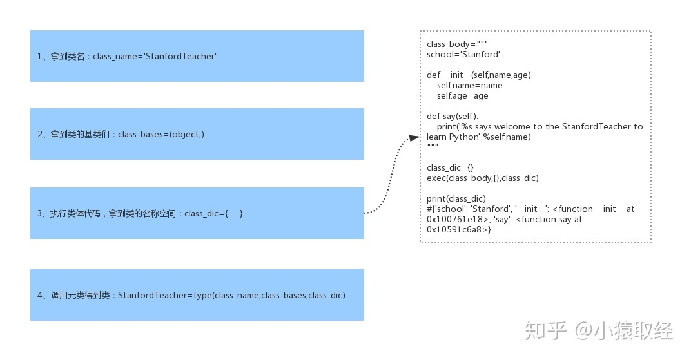
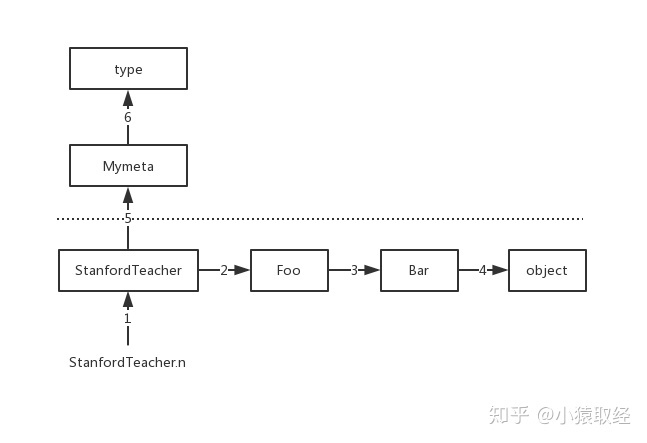
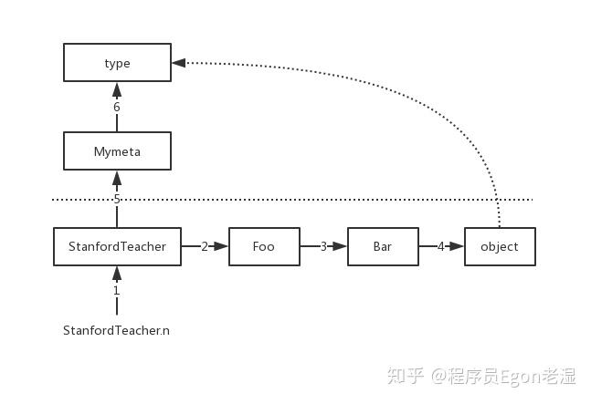

# 反射

&emsp;&emsp;Python 是动态语言，而反射（reflection）机制被视为动态语言的关键。反射机制指的是在程序的运行状态中：

+ 对于任意一个类，都可以知道这个类的所有属性和方法
+ 对于任意一个对象，都能够调用它的任意方法和属性

&emsp;&emsp;<font color=red>这种动态获取程序信息以及动态调用对象的功能称为反射机制</font>。在 Python 中实现反射非常简单，在程序运行过程中，对于一个不知道存有何种属性的对象，若想操作其内部属性，可以先通过内置函数 <font color=green>***dir***</font> 来获取任意一个类或者对象的属性列表，列表中全为字符串格式：

```python
class Person:
    def __init__(self, name, age, gender):
        self.name = name
        self.age = age
        self.gender = gender


obj = Person("Tom", 18, "male")

print(dir(obj)) # 列表中查看到的属性全为字符串

'''
[..., 'age', 'gender', 'name']
'''
```

&emsp;&emsp;接下来就是想办法通过字符串来操作对象的属性了，这就涉及到内置函数 <font color=green>***hasattr***</font>、<font color=green>***getattr***</font>、<font color=green>***setattr***</font> 和 <font color=green>***delattr***</font> 的使用（<font color=red>Python 中一切皆对象，因此类和对象都可以被这四个函数操作且用法一样</font>）：

```python
class Person:
    def __init__(self, name, age, gender):
        self.name = name
        self.age = age
        self.gender = gender


obj = Person("Tom", 18, "male")

if hasattr(obj, "name"): # 判断有无属性 name
    # 存在 name 属性则开始操作该属性
    setattr(obj, "name", "Jack") # 设置属性
    print(getattr(obj, "name", "default")) # 获取属性值，并且指定不存在时候的默认返回值为 default


print(hasattr(obj, "gender"))
delattr(obj, "gender")  # 相当于 del obj.gender
print(hasattr(obj, "gender"))
```

# 内置方法&属性

&emsp;&emsp;Python 的 Class 机制内置了很多特殊的方法来帮助使用者高度定制自己的类，这些内置方法都是以双下划线开头和结尾的，会在满足某种条件时自动触发，这里以常用的 `__str__` 和 `__del__` 为例来简单介绍它们的使用。

&emsp;&emsp;`__str__` 方法会在对象被打印时自动触发，print 功能打印的就是它的返回值，通常基于该方法来定制对象的打印信息，该方法必须返回字符串类型：

```python
class Person:
    def __init__(self, name, age, gender):
        self.name = name
        self.age = age
        self.gender = gender

    def __str__(self) -> str:
        return "{name} - {age} - {gender}"\
            .format(name = self.name,age=self.age,gender= self.gender)


obj = Person("Tom", 18, "male")
print(obj) # Tom - 18 - male
```

&emsp;&emsp;`__del__` 会在对象被删除时自动触发。由于 Python 自带的垃圾回收机制会自动清理 Python 程序的资源，所以当一个对象只占用应用程序级资源时，完全没必要为对象定制 `__del__` 方法。但在产生一个对象的同时涉及到申请系统资源（比如系统打开的文件、网络连接等）的情况下，关于系统资源的回收，Python 的垃圾回收机制便派不上用场了，这里就需要为对象定制该方法，用来在对象被删除时自动触发回收系统资源的操作：

```python
class MySQL:
    def __init__(self,ip,port):
        self.conn=connect(ip,port) # 伪代码，发起网络连接，需要占用系统资源
    def __del__(self):
        self.conn.close() # 关闭网络连接，回收系统资源

obj = MySQL('127.0.0.1',3306) # 在对象obj被删除时，自动触发obj.__del__()
```

&emsp;&emsp;常见的特殊方法如下：

| 方法                  | 说明       | 例子                            |
| --------------------- | ---------- | ------------------------------- |
| `__init__`            | 构造方法   | 对象创建和初始化： `p=Person()` |
| `__del__`             | 析构方法   | 对象回收                        |
| `__repr__`、`__str__` | 打印、转换 | `print(a)`                      |
| `__call__`            | 函数调用   | `a()`                           |
| `__getattr__`         | 点号运算   | `a.xxx`                         |
| `__setattr__`         | 属性赋值   | `a.xxx=value`                   |
| `__getitem__`         | 索引运算   | `a[key]`                        |
| `__setitem__`         | 索引赋值   | `a[key]=value`                  |
| `__len__`             | 长度       | `len(a)`                        |

&emsp;&emsp;每个运算符实际上都对应了相应的方法：

| 运算符              | 特殊方法                                             | 说明                          |        |
| ---------------- | ------------------------------------------------ | --------------------------- | ------ |
| `+`              | `__add__`                                        | 加法                          |        |
| `-`              | `__sub__`                                        | 减法                          |        |
| `<`、`<=`、`==`    | `__lt__`、`__le__`、`__eq__`                       | 比较运算符                       |        |
| `>`、`>=`、`!=`    | `__lt__`、`__le__`、`__eq__`                       | 比较运算符                       |        |
| `                | `、`^`、`&`                                        | `__gt__`、`__ge__`、`__and__` | 或、异或、与 |
| `<<`、`>>`        | `__lshift__`、`__rshift__`                        | 左移、右移                       |        |
| `*`、`/`、`%`、`//` | `__mul__`、`__truediv__`、`__mod__`、`__floordiv__` | 乘、浮点除、模运算（取余）、整             |        |
| `**`             | `__pow__`                                        | 指数运算                        |        |

&emsp;&emsp;Python 对象中包含了很多双下划线开始和结束的属性，这些是特殊属性，有特殊用法。这里我们列出常见的特殊属性：

| 特殊属性               | 含义                                           |
| ---------------------- | ---------------------------------------------- |
| `obj.__dict__`         | 对象的属性字典                                 |
| `obj.__class__`        | 对象所属的类                                   |
| `obj.__bases__`        | 表示类的父类(多继承时，多个父类放到一个元组中) |
| `obj.__base__`         | 类的父类                                       |
| `obj.__mro__`          | 类层次结构                                     |
| `obj.__subclasses__()` | 子类列表                                       |

# 元类

## 基础介绍

&emsp;&emsp;在 Python 中一切皆为对象：

```python
class StanfordTeacher(object):
    school='Stanford'

    def __init__(self,name,age):
        self.name=name
        self.age=age

    def say(self):
        print('{} says welcome to the Stanford to learn Python'.fotrmat(self.name))


t1=StanfordTeacher('lili',18)
print(type(t1)) # 查看对象 t1 的类是 <class '__main__.StanfordTeacher'>
```

&emsp;&emsp;所有的对象都是实例化或者说调用类而得到的（调用类的过程称为类的实例化），比如对象 `t1` 是调用类 `StanfordTeacher` 得到的。既然一切皆为对象，那么类 `StanfordTeacher` 本质也是一个对象，而所有的对象都是通过调用类得到的，那么 `StanfordTeacher` 必然也是调用了一个类得到的，这个类就称为元类：

```python
class StanfordTeacher(object):
    school='Stanford'

    def __init__(self,name,age):
        self.name=name
        self.age=age

    def say(self):
        print('{} says welcome to the Stanford to learn Python'.fotrmat(self.name))


print(type(staticmethod)) # <class 'type'>
# 证明是调用了 type 这个元类而产生的 StanfordTeacher，即默认的元类为 type
```

## class 关键字创建类的流程

&emsp;&emsp;用 class 关键字定义的类本身也是一个对象，负责产生该对象的类称之为元类（元类可以简称为类的类），<font color=red>内置的元类为 type</font> 。class 关键字在创建类时，必然调用了元类（`StanfordTeacher=type(...)`），调用 type 时传入的参数必然是类的关键组成部分，一个类有三大组成部分：

+ 类名：`class_name='StanfordTeacher'`
+ 基类：`class_bases=(object,)`
+ 类的名称空间：`class_dic`，类的名称空间是执行类体代码而得到的

&emsp;&emsp;调用 type 时会依次传入以上三个参数，所以 class 关键字创建一个类应该细分为以下四个过程：



&emsp;&emsp;可以把 `exec` 命令的执行当成是一个函数的执行，会将执行期间产生的名字存放在局部名称空间中，它包含三个参数：

+ 参数一：包含一系列 Python 代码的字符串
+ 参数二：全局作用域（字典形式），如果不指定默认为 `globals()`
+ 参数三：局部作用域（字典形式），如果不指定默认为 `locals()`

```python
g={
    'x':1,
    'y':2
}
l={}

exec('''
global x,z
x=100
z=200

m=300
''',g,l)

print(g) #{'x': 100, 'y': 2,'z':200,......}
print(l) #{'m': 300}
```

## 自定义元类控制类

<font color=orachid>**（一）创建**</font>

&emsp;&emsp;一个类没有声明自己的元类，默认他的元类就是 `type`，也可以通过继承 `type` 来自定义元类，然后使用 `metaclass` 关键字参数为一个类指定元类：

```python
# 只有继承了 type 类才能称之为一个元类，否则就是一个普通的自定义类
class Mymeta(type): 
    pass

# StanfordTeacher=Mymeta('StanfordTeacher',(object),{...})
class StanfordTeacher(object,metaclass=Mymeta): 
    school='Stanford'

    def __init__(self,name,age):
        self.name=name
        self.age=age

    def say(self):
        print('%s says welcome to the Stanford to learn Python' %self.name)


# <class '__main__.Mymeta'>
print(type(StanfordTeacher))
```

&emsp;&emsp;自定义元类可以控制类的产生过程，类的产生过程其实就是元类的调用过程（即`StanfordTeacher=Mymeta('StanfordTeacher',(object),{...})`），调用 `Mymeta` 会先产生一个空对象 `StanfordTeacher`，然后连同调用 `Mymeta` 括号内的参数一同传给 `Mymeta` 下的 `__init__` 方法完成初始化：

```python
class Mymeta(type): 
    def __init__(self,class_name,class_bases,class_dic):
        # print(self) # <class '__main__.StanfordTeacher'>
        # print(class_bases) # (<class 'object'>,)
        # print(class_dic) # {'__module__': '__main__', '__qualname__': 'StanfordTeacher', 'school': 'Stanford', '__init__': <function StanfordTeacher.__init__ at 0x102b95ae8>, 'say': <function StanfordTeacher.say at 0x10621c6a8>}
        super(Mymeta, self).__init__(class_name, class_bases, class_dic)  # 重用父类的功能

        if class_name.islower():
            raise TypeError('类名%s请修改为驼峰体' %class_name)

        if '__doc__' not in class_dic or len(class_dic['__doc__'].strip(' \n')) == 0:
            raise TypeError('类中必须有文档注释，并且文档注释不能为空')

# StanfordTeacher=Mymeta('StanfordTeacher',(object),{...})
class StanfordTeacher(object,metaclass=Mymeta): 
    """
    类StanfordTeacher的文档注释
    """
    school='Stanford'

    def __init__(self,name,age):
        self.name=name
        self.age=age

    def say(self):
        print('%s says welcome to the Stanford to learn Python' %self.name)
```

<font color=orachid>**（二）调用**</font>

&emsp;&emsp;要想让对象变成一个可调用的对象，需要在该对象的类中定义一个方法 `__call__` 方法，该方法会在调用对象时自动触发：

```python
class Foo:
    def __call__(self, *args, **kwargs):
        print(self)
        print(args)
        print(kwargs)

obj=Foo()
# 调用 obj 的返回值就是 __call__ 方法的返回值
res=obj(1,2,3,x=1,y=2)
```

&emsp;&emsp;因此，调用一个对象就是触发对象所在类中的 `__call__` 方法的执行，如果把 `StanfordTeacher` 也当做一个对象，那么在 `StanfordTeacher` 这个对象的类中也必然存在一个 `__call__` 方法：

```python
class Mymeta(type): #只有继承了type类才能称之为一个元类，否则就是一个普通的自定义类
    def __call__(self, *args, **kwargs):
        print(self) #<class '__main__.StanfordTeacher'>
        print(args) #('lili', 18)
        print(kwargs) #{}
        return 123

class StanfordTeacher(object,metaclass=Mymeta):
    school='Stanford'

    def __init__(self,name,age):
        self.name=name
        self.age=age

    def say(self):
        print('%s says welcome to the Stanford to learn Python' %self.name)


# 调用StanfordTeacher就是在调用StanfordTeacher类中的__call__方法
# 然后将StanfordTeacher传给self,溢出的位置参数传给*，溢出的关键字参数传给**
# 调用StanfordTeacher的返回值就是调用__call__的返回值
t1=StanfordTeacher('lili',18)
print(t1) #123
```

&emsp;&emsp;默认情况下调用 `t1 = StanfordTeacher('lili',18)` 会做三件事：

+ 产生一个空对象 obj
+ 调用 `__init__` 方法初始化对象 obj
+ 返回初始化好的 obj

```python
class Mymeta(type): 
    def __call__(self, *args, **kwargs): # self=<class '__main__.StanfordTeacher'>
        #1、调用__new__产生一个空对象obj
        obj=self.__new__(self) # 此处的self是类OldoyTeacher，必须传参，代表创建一个StanfordTeacher的对象obj

        #2、调用__init__初始化空对象obj
        self.__init__(obj,*args,**kwargs)

        #3、返回初始化好的对象obj
        return obj

class StanfordTeacher(object,metaclass=Mymeta):
    school='Stanford'

    def __init__(self,name,age):
        self.name=name
        self.age=age

    def say(self):
        print('%s says welcome to the Stanford to learn Python' %self.name)

t1=StanfordTeacher('lili',18)
print(t1.__dict__) #{'name': 'lili', 'age': 18}
```

&emsp;&emsp;上例的 `__call__` 相当于一个模板，可以在该基础上改写 `__call__` 的逻辑从而控制调用 `StanfordTeacher` 的过程：

```python
class Mymeta(type): 
    def __call__(self, *args, **kwargs): #self=<class '__main__.StanfordTeacher'>
        #1、调用__new__产生一个空对象obj
        obj=self.__new__(self) # 此处的self是类StanfordTeacher，必须传参，代表创建一个StanfordTeacher的对象obj

        #2、调用__init__初始化空对象obj
        self.__init__(obj,*args,**kwargs)

        # 在初始化之后，obj.__dict__里就有值了
        obj.__dict__={'_%s__%s' %(self.__name__,k):v for k,v in obj.__dict__.items()}
        #3、返回初始化好的对象obj
        return obj

class StanfordTeacher(object,metaclass=Mymeta):
    school='Stanford'

    def __init__(self,name,age):
        self.name=name
        self.age=age

    def say(self):
        print('%s says welcome to the Stanford to learn Python' %self.name)

t1=StanfordTeacher('lili',18)
print(t1.__dict__) #{'_StanfordTeacher__name': 'lili', '_StanfordTeacher__age': 18}
```

## 再看属性查找

&emsp;&emsp;在学习完元类后得知，其实用 class 自定义的类也全都是对象（包括 object 类本身也是元类 type 的一个实例）：

```python
class Mymeta(type): 
    n=444

    def __call__(self, *args, **kwargs): #self=<class '__main__.StanfordTeacher'>
        obj=self.__new__(self)
        self.__init__(obj,*args,**kwargs)
        return obj

class Bar(object):
    n=333

class Foo(Bar):
    n=222

class StanfordTeacher(Foo,metaclass=Mymeta):
    n=111

    school='Stanford'

    def __init__(self,name,age):
        self.name=name
        self.age=age

    def say(self):
        print('%s says welcome to the Stanford to learn Python' %self.name)


print(StanfordTeacher.n) #自下而上依次注释各个类中的n=xxx，然后重新运行程序，发现n的查找顺序为StanfordTeacher->Foo->Bar->object->Mymeta->type
```

&emsp;&emsp;如果把类当成对象去看，上面案例中的继承应该说成是：对象 `StanfordTeacher` 继承对象 `Foo`，对象 `Foo` 继承对象 `Bar`，对象 `Bar` 继承对象 `object` 。于是属性查找应该分成两层，一层是对象层（基于`MRO` ）的查找，另外一个层则是类层（即元类层）的查找：


&emsp;&emsp;查找顺序为：

1. 先对象层：StanfordTeacher -> Foo -> Bar -> object
2. 后元类层：Mymeta -> type

&emsp;&emsp;依据上述来分析下元类 Mymeta 中 `__call__` 里的 `self.__new__` 的查找：

```python
class Mymeta(type): 
    n=444

    def __call__(self, *args, **kwargs): # self=<class '__main__.StanfordTeacher'>
        obj=self.__new__(self)
        print(self.__new__ is object.__new__) #True


class Bar(object):
    n=333

    # def __new__(cls, *args, **kwargs):
    #     print('Bar.__new__')

class Foo(Bar):
    n=222

    # def __new__(cls, *args, **kwargs):
    #     print('Foo.__new__')

class StanfordTeacher(Foo,metaclass=Mymeta):
    n=111

    school='Stanford'

    def __init__(self,name,age):
        self.name=name
        self.age=age

    def say(self):
        print('%s says welcome to the Stanford to learn Python' %self.name)


    # def __new__(cls, *args, **kwargs):
    #     print('StanfordTeacher.__new__')


StanfordTeacher('lili',18) #触发StanfordTeacher的类中的__call__方法的执行，进而执行self.__new__开始查找
```

&emsp;&emsp;`Mymeta` 下的 `__call__` 里的 `self.__new__` 在 StanfordTeacher、Foo、Bar 里都没有找到 `__new__` 的情况下，会去找 object 里的 `__new__`，而 object 下默认就有一个 `__new__`，所以即便是之前的类均未实现 `__new__` ，也一定会在 object 中找到一个，不会、也根本没必要再去找元类 Mymeta -> type 中查找`__new__`。在元类的 `__call__` 中也可以用 `object.__new__(self)` 去造对象：


> <font color=orange>**注意：**</font>但还是推荐在 `__call__` 中使用 `self.__new__(self)` 去创造空对象，因为这种方式会检索三个类 StanfordTeacher->Foo->Bar，而 `object.__new__` 则是直接跨过了他们三个。

```python
class Mymeta(type): #只有继承了type类才能称之为一个元类，否则就是一个普通的自定义类
    n=444

    def __new__(cls, *args, **kwargs):
        obj=type.__new__(cls,*args,**kwargs) # 必须按照这种传值方式
        print(obj.__dict__)
        # return obj # 只有在返回值是type的对象时，才会触发下面的__init__
        return 123

    def __init__(self,class_name,class_bases,class_dic):
        print('run。。。')


class StanfordTeacher(object,metaclass=Mymeta): #StanfordTeacher=Mymeta('StanfordTeacher',(object),{...})
    n=111

    school='Stanford'

    def __init__(self,name,age):
        self.name=name
        self.age=age

    def say(self):
        print('%s says welcome to the Stanford to learn Python' %self.name)


print(type(Mymeta)) #<class 'type'>
# 产生类StanfordTeacher的过程就是在调用Mymeta，而Mymeta也是type类的一个对象，那么Mymeta之所以可以调用，一定是在元类type中有一个__call__方法
# 该方法中同样需要做至少三件事：
# class type:
#     def __call__(self, *args, **kwargs): #self=<class '__main__.Mymeta'>
#         obj=self.__new__(self,*args,**kwargs) # 产生Mymeta的一个对象
#         self.__init__(obj,*args,**kwargs) 
#         return obj
```