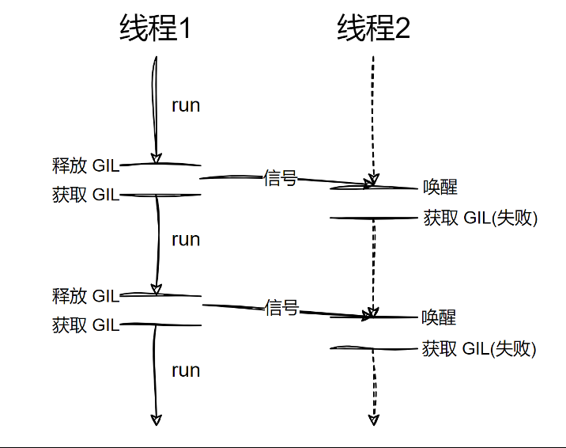
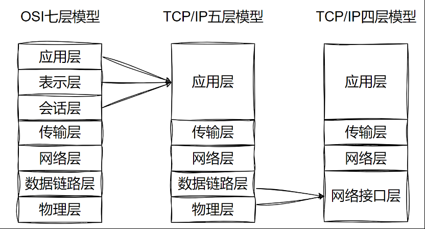
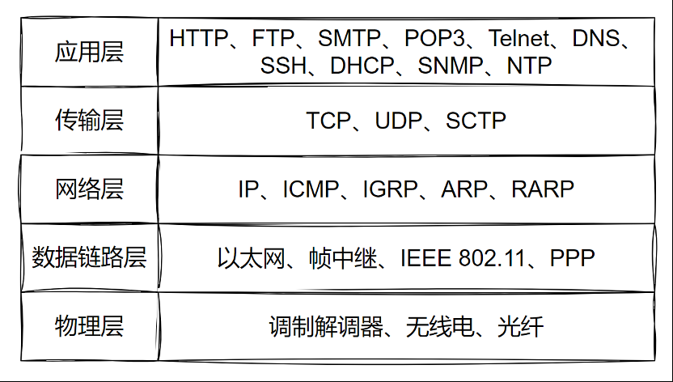
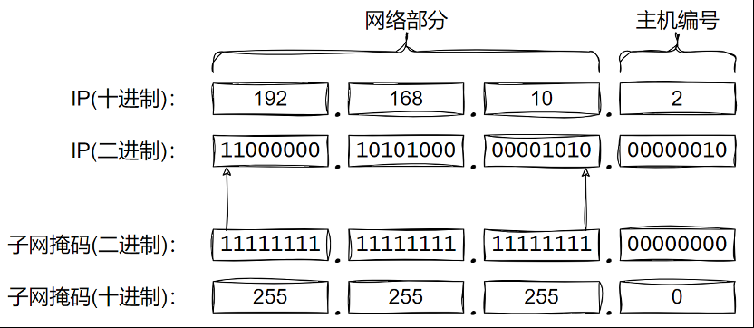
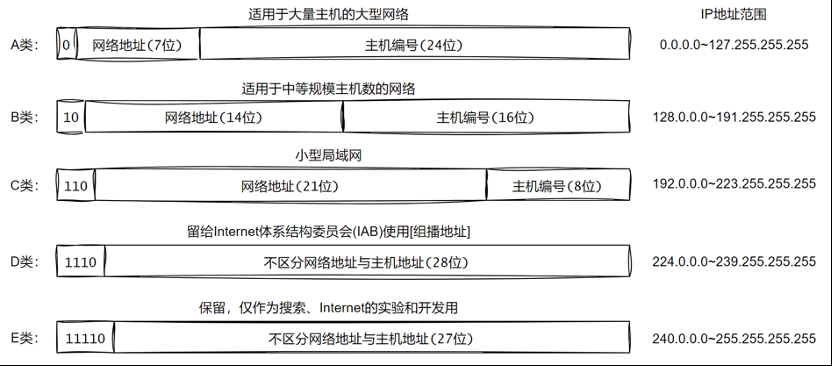
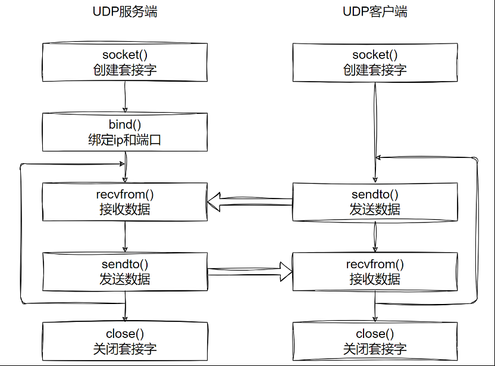
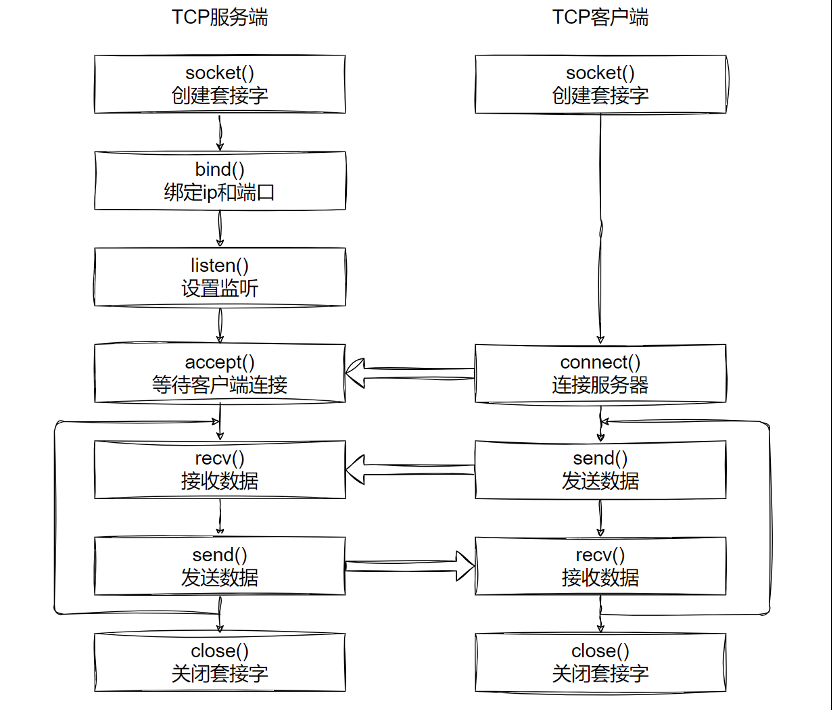
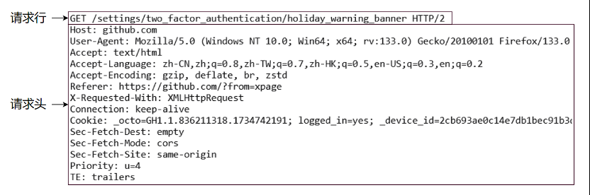
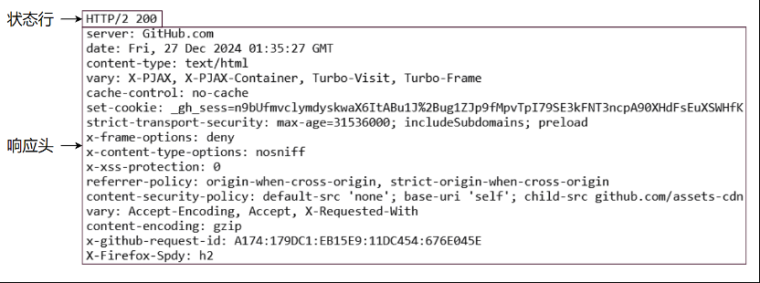

# 进程与线程

&emsp;&emsp;首先需要理解 `并发` 和 `并行` 的概念：

+ 并发：单个 CPU 处理多个任务，各个任务交替执行一段时间
+ 并行：多个 CPU 同时执行多个任务

## 多进程

### 进程的使用

&emsp;&emsp;进程是操作系统进行资源分配的基本单位，操作系统中一个正在运行的程序或软件就是一个进程。每个进程都有自己独立的一块内存空间，一个进程崩溃后在保护模式下不会对其他进程产生影响，多进程是指在操作系统中同时运行多个程序。

&emsp;&emsp;Python 提供了一个跨平台的多进程模块 `multiprocessing`，该模块提供了一个 `Process` 类来代表一个进程对象：

```python
multiprocessing.Process(group=None, target=None, name=None, args=(), kwargs={}, *, daemon=None)
```

+ `group`：应当始终为 `None`，它的存在仅是为了与 `threading.Thread` 兼容
+ `target`：由 `run()` 方法来发起调用的可调用对象，默认为 `None`
+ `name`：进程名称，默认为 `None`，表示自动分配
+ `args`：针对目标调用的关键字参数字典
+ `kwargs`：针对目标调用的关键字参数字典
+ `daemon`：是否为守护进程，`True` 或 `False`，默认为 `None` 则继承父进程

&emsp;&emsp;`Process` 的属性和方法与其他常用方法：

+ `name`：获取进程名称
+ `pid`：获取进程号
+ `daemon`：判断或设置进程是否为守护进程
+ `exitcode`：获取子进程的退出状态码
+ `start()`：启动进程，调用传入 `target` 的对象，只能被调用一次
+ `run()`：默认调用传入 `target` 的对象，如果子类化了 `Process`，可以重写此方法来自定义行为
+ `join([timeout])`：阻塞主进程，直到子进程结束或超时。`timeout` 参数可选，表示为阻塞多少秒
+ `terminate()`：强制终止子进程
+ `kill()`：杀死进程，与 `terminate()` 类似，但更彻底
+ `is_alive()`：检查进程是否仍在运行
+ `os.getpid()`：获取当前进程编号
+ `os.getppid()`：获取当前进程的父进程编号

&emsp;&emsp;下面是一个同时读写文件的案例：

```python
import time  
import multiprocessing  
  
  
# 向文件中写入数据  
def write_file():  
    with open('test.txt', 'a') as f:  
        while True:  
            f.write("Hello World\n")  
            f.flush()  
            time.sleep(0.5)  
  
  
# 从文件中读取数据  
def read_file():  
    with open('test.txt', 'r') as f:  
        while True:  
            time.sleep(0.1)  
            print(f.read(1))  
  
  
if __name__ == '__main__':  
    # 创建一个子进程用于写文件  
    p1 = multiprocessing.Process(target = write_file)  
    # 创建一个子进程用于读文件  
    p2 = multiprocessing.Process(target = read_file)  
  
    # 启动进程  
    p1.start()  
    p2.start()
```

&emsp;&emsp;也可以通过自定义 `Process` 子类来创建进程：

```python
import os  
import multiprocessing  
  
  
class Worker(multiprocessing.Process):  
    def run(self):  
        print("进程id：", os.getpid(), "\t父进程id：", os.getppid())  
  
  
if __name__ == '__main__':  
    for i in range(5):  
        p = Worker()  
        p.start()
```

### 进程池

&emsp;&emsp;当需要启动大量子进程时可以使用进程池，创建进程池的语法如下：

```python
multiprocessing.Pool([processes[,initializer[,initargs[,maxtasksperchild[,context]]]]])
```

+ `processes`：要使用的工作进程数量，如果 `processes` 为 `None` 则使用 `os.cpu_count()` 所返回的数值
+ `initializer`：如果不为 `None` 则每个工作进程将会在启动时调用 `initializer(*initargs)`
+ `maxtasksperchild`：一个工作进程在它退出或被一个新的工作进程代替之前能完成的任务数量，为了释放未使用的资源。默认的 `maxtasksperchild` 是 `None`，意味着工作进程寿与池齐
+ `context`：可被用于指定启动的工作进程的上下文。通常一个进程池是使用函数 `multiprocessing.Pool()` 或者一个上下文对象的 `Pool()` 方法创建的

> <font color=orange>**注意：**</font>
> 1. 进程池对象的方法只有创建它的进程能够调用
> 2. 使用时一般只指定 processes 参数

&emsp;&emsp;进程池的常用方法如下：

+ `apply(func[, args[, kwds]])`：使用 `args` 参数以及 `kwds` 命名参数同步调用 `func` , 在返回结果前阻塞。另外 `func` 只会在一个进程池中的一个工作进程中执行
+ `apply_async(func[, args[, kwds[, callback[, error_callback]]]])`：使用 `args` 参数以及 `kwds` 命名参数异步调用 `func`，并立即返回一个 `AsyncResult` 对象，不会阻塞。可以通过 `callback` 获取结果和通过 `error_callback` 处理异常
+ `close()`：阻止后续任务提交到进程池，当所有任务执行完成后，工作进程会退出
+ `terminate()`：不必等待未完成的任务，立即停止工作进程。当进程池对象被垃圾回收时，会立即调用 `terminate()`
+ `join()`：阻塞主进程，等待工作进程结束。调用 `join()` 前必须先调用 `close()` 或者 `terminate()`

```python
import os
import time
import multiprocessing
  
# 打印 10 个数字，每次间隔0.5秒
def func():
	for i in range(10):
	print(os.getpid(), i)
	time.sleep(0.5)
	

if __name__ == "__main__":
	# 指定进程池的大小
	process_number = 5
	pool = multiprocessing.Pool(process_number)
	
	for p in range(process_number):
		# 阻塞式
		# pool.apply(func)
		# 非阻塞式
		pool.apply_async(func)
	
	pool.close()
	pool.join()
	print("end")
```

### 进程间通信

&emsp;&emsp;如果子进程向传入的列表中添加元素，最终发现主进程与子进程之间的列表结果不同：

```python
import os
import multiprocessing

# 向list1中添加10个元素
def func(list1):
    for i in range(10):
        list1.append(i)
        print(os.getpid(), list1)


if __name__ == "__main__":
    list1 = []
    p1 = multiprocessing.Process(target=func, args=(list1,))
    p2 = multiprocessing.Process(target=func, args=(list1,))
    p1.start()
    p2.start()
    p1.join()
    p2.join()
    print(os.getpid(), list1)
```

<font color=orachid>**（一）使用 Queue 通信**</font>

&emsp;&emsp;Python 的 `multiprocessing` 模块包装了底层的机制，提供了 `Queue`、`Pipes` 等多种方式来交换数据。

&emsp;&emsp;`multiprocessing.Queue([maxsize])` 返回一个使用一个管道、少量锁和信号量实现的共享队列（先进先出）实例。当一个进程将一个对象放进队列中时，一个写入线程会启动并将对象从缓冲区写入管道中。默认队列是无限大小的，可以通过 `maxsize `参数限制。

&emsp;&emsp;`Queue` 常用方法如下：

+ `qsize()`：返回队列的大致长度，由于多线程或者多进程的上下文，这个数字是不可靠的
+ `empty()`：如果队列是空的返回 `True`，由于多线程或多进程的环境，该状态是不可靠的
+ `full()`：如果队列是满的返回 `True`，由于多线程或多进程的环境，该状态是不可靠的
+ `put(obj[, block[, timeout]])`：将 `obj` 放入队列
	+ 如果可选参数 `block` 是 `True`（默认值），且 `timeout` 是 `None`（默认值），将会阻塞当前进程，直到有空的缓冲槽；如果 `timeout` 是正数，将会在阻塞了最多 `timeout` 秒之后还是没有可用的缓冲槽时抛出 `queue.Full` 异常。
	+ 如果 `block` 是 `False` ，仅当有可用缓冲槽时才放入对象，否则抛出 `queue.Full` 异常（在这种情形下 `timeout` 参数会被忽略）
+ `put_nowait(obj)`：相当于 `put(obj, False)`
+ `get([block[, timeout]])`：从队列中取出并返回对象
	+ 如果可选参数 `block` 是 `True` （默认值）而且 `timeout` 是 `None`（默认值），将会阻塞当前进程，直到队列中出现可用的对象；如果 `timeout` 是正数，将会在阻塞了最多 `timeout` 秒之后还是没有可用的对象时抛出 `queue.Empty` 
	+ 如果可选参数 `block` 是 False 时，仅当有可用对象能够取出时返回，否则抛出 `queue.Empty` 异常（在这种情形下 timeout 参数会被忽略）
+ `get_nowait()`：相当于 `get(False)`

&emsp;&emps;下面是两个进程分别读写 `Queue` 的案例：

```python
import time
import random
import multiprocessing

# 间隔随机时间向queue中放入随机数
def func1(queue):
    while True:
        queue.put(random.randint(1, 50))
        time.sleep(random.random())

# 从queue中取出数据
def func2(queue):
    while True:
        print("=" * queue.get())

if __name__ == "__main__":
    queue = multiprocessing.Queue()
    p1 = multiprocessing.Process(target=func1, args=(queue,))
    p2 = multiprocessing.Process(target=func2, args=(queue,))
    p1.start()
    p2.start()
    p1.join()
	p2.join()
```

&emsp;&emsp;下面是进程池之间使用 `Manager().Queue` 的案例：

```python
import time
import random
import multiprocessing

# 间隔随机时间向queue中放入随机数
def func1(queue):
    while True:
        queue.put(random.randint(1, 50))
        time.sleep(random.random())

# 从queue中取出数据
def func2(queue):
    while True:
        print("=" * queue.get())

if __name__ == "__main__":
    queue = multiprocessing.Manager().Queue()
    pool = multiprocessing.Pool(2)
    pool.apply_async(func1, (queue,))
    pool.apply_async(func2, (queue,))
    pool.close()
    pool.join()
```

## 多线程

### 线程的基本使用

&emsp;&emsp;线程是处理器任务调度和执行的基本单位，一个进程至少有一个线程，也可以运行多个线程，多个线程之间可共享数据。线程运行出错异常后，如果没有捕获会导致整个进程崩溃，多线程是指在同一进程中同时执行多个任务。

&emsp;&emsp;Python 的标准库提供了 `_thread` 和 `threading` 两个模块，其中 `_thread` 是低级模块，`threading` 是高级模块，对 `_thread` 进行了封装，绝大多数情况下我们只需要使用 `threading` 这个高级模块。创建线程的语法如下：

```python
threading.Thread(group=None, target=None, name=None, args=(), kwargs={}, *, daemon=None)
```

+ `group`：应为 `None`，保留给将来实现 `ThreadGroup` 类的扩展使用
+ `target`：用于 `run()` 方法调用的可调用对象，默认是 `None`，表示不需要调用任何方法
+ `name`：线程名称， 在默认情况下会以 `Thread-N` 的形式构造唯一名称，其中 `N` 为一个较小的十进制数值；或者是 `Thread-N (target)` 的形式，其中 `target` 为 `target.__name__`（如果指定了 `target` 参数的话）
+ `args`：用于发起调用目标函数的参数列表或元组，默认为 `()`
+ `kwargs`：用于调用目标函数的关键字参数字典，默认是 `{}`
+ `daemon`：`True` 或 `False` 来设置该线程是否为守护模式，如果是 `None`（默认值）线程将继承当前线程的守护模式属性

&emsp;&emsp;`Thread` 的属性和方法与其他常用方法：

+ `name`：线程的名称
+ `daemon`：线程是否为守护线程
+ `ident`：线程标识符
+ `native_id`：此线程的线程 id（tid），由 OS（内核）分配
+ `start()`：启动线程，调用线程的 `run()` 方法
+ `run()`：定义线程的行为，默认调用传入的 `target` 对象
+ `join([timeout=None])`：阻塞主线程，直到当前线程运行完成或达到超时时间
+ `is_alive()`：线程是否在运行
+ `threading.enumerate()`：查看都有哪些线程
+ `threading.current_thread()`：返回当前线程实例

```python
import time
import threading

# 交替打印 00000 和 11111
def func():
    flag = 0
    while True:
        print(threading.current_thread().name, f"{flag}" * 5)
        flag = flag ^ 1  # 替换0和1
        time.sleep(0.5)

if __name__ == "__main__":
    t1 = threading.Thread(target=func, name="线程1")
    t2 = threading.Thread(target=func, name="线程2")
    t1.start()
    t2.start()
```

&emsp;&emsp;也可以通过自定义 `Thread` 子类创建线程：

```python
import time
import threading

class Worker(threading.Thread):
    def __init__(self, name):
        super().__init__()
        self.name = name

    def run(self):
        flag = 0
        while True:
            print(f"\r{self.name}:{str(flag)*5}", end="")
            flag = flag ^ 1  # 替换0和1
            time.sleep(0.2)

if __name__ == "__main__":
    t1 = Worker("线程1")
    t2 = Worker("线程2")
    t1.start()
    t2.start()
```

### 线程池

&emsp;&emsp;`ThreadPoolExecutor` 是 `concurrent.futures` 模块中的线程池实现，它允许我们轻松地提交任务到线程池，并管理任务的执行和结果：

```python
concurrent.futures.ThreadPoolExecutor(max_workers=None, thread_name_prefix="", initializer=None, initargs=())
```

+ `max_workers`：线程池的最大线程数（默认取决于系统资源）
+ `thread_name_prefix`：线程名称前缀
+ `initializer`：可选的初始化函数
+ `initargs`：传递给初始化函数的参数

&emsp;&emsp;线程池的常用方法如下：

+ `submit(fn, *args, **kwargs)`：提交一个任务到线程池，返回一个 `Future` 对象，可使用 `Future.result()` 获取任务结果
+ `map(func, *iterables, timeout=None, chunksize=1)`：类似于内置的 `map()` 函数，但在线程池中并行执行，`Iterables` 为可迭代对象，传递给目标函数。`chunksize` 对 `ThreadPoolExecutor` 没有效果
+ `shutdown(wait=True, cancel_futures=False)`：关闭线程池，等待所有任务完成。`wait` 表示是否等待线程池中的所有线程完成任务。`cancel_futures` 表示是否取消尚未开始的任务

```python
import concurrent.futures

def func(tname):
    global word
    for i, char in enumerate(word):
        word[i] = chr(ord(char) ^ 1)
        print(f"{tname}: {word}\n", end="")
    return word

if __name__ == "__main__":
    word = list("idmmn!vnsme")
    # 使用 with 语句来确保线程被迅速清理
    with concurrent.futures.ThreadPoolExecutor(max_workers=3) as executor:
        future1 = executor.submit(func, "线程1")
        future2 = executor.submit(func, "线程2")
        future3 = executor.submit(func, "线程3")

        word = future1.result()
        word = future2.result()
        word = future3.result()

	print("".join(word))  # hello world
```

### 互斥锁

&emsp;&emsp;线程之间共享数据会存在线程安全的问题，比如下面这段代码有 3 个线程，每个线程都将 `g_num + 1` 十次：

```python
import time
import threading

def func():
    global g_num
    for _ in range(10):
        tmp = g_num + 1
        g_num = tmp
        print(f"{threading.current_thread().name}: {g_num}\n", end="")

if __name__ == "__main__":
    g_num = 0
    threads = [threading.Thread(target=func, name=f"线程{i}") for i in range(3)]
    [t.start() for t in threads]
    [t.join() for t in threads]
    print(g_num)  # 30
```

&emsp;&emsp;程序运行的结果为 30，看似没有问题，这是因为这个修改操作花费的时间太短了，所以线程间轮询执行时，都能获取到最新的 `g_num` 值，因此暴露问题的概率就变得微乎其微。如果添加 `0.01` 秒的延迟时间：

```python
import time
import threading

def func():
    global g_num
    for _ in range(10):
        tmp = g_num + 1
        time.sleep(0.01)
        g_num = tmp
        print(f"{threading.current_thread().name}: {g_num}\n", end="")

if __name__ == "__main__":
    g_num = 0
    threads = [threading.Thread(target=func, name=f"线程{i}") for i in range(3)]
    [t.start() for t in threads]
    [t.join() for t in threads]
    print(g_num)  # 10
```

&emsp;&emsp;可以看到最终结果并不是 30，这是因为在修改 `g_num` 前有 0.01 秒的休眠时间，某个线程延时后 CPU 立即分配计算资源给其他线程，此时 0.01 秒的休眠还未结束，这个线程还未将修改后的数据赋值给 `g_num`，因此其他线程获取到的并不是最新值，所以才出现上面的结果。

&emsp;&emsp;某个线程要更改共享数据时先将其锁定，此时其他线程不能更改。直到该线程释放资源，将资源的状态变成非锁定，其他的线程才能再次锁定该资源。互斥锁保证了每次只有一个线程进行写入操作，从而保证了多线程情况下数据的正确性。可以通过 `threading.Lock()` 创建互斥锁，使用 `lock.acquire([blocking=True][, timeout=-1])` 来获取锁（blocking 如果为 True，线程会阻塞直到获取到锁。如果为 False，线程立即返回。获取锁成功返回 True，否则返回 False。timeout 为等待的超时时间，单位为秒。如果超时仍未获取到锁，则返回 False），可以使用 `lock.release()` 来释放锁。

```python
import time
import threading

def func():
    global g_num
    for _ in range(10):
        lock.acquire()  # 获取锁
        tmp = g_num + 1
        time.sleep(0.01)
        g_num = tmp
        lock.release()  # 释放锁
        print(f"{threading.current_thread().name}: {g_num}\n", end="")

if __name__ == "__main__":
    g_num = 0
    lock = threading.Lock()  # 创建锁
    threads = [threading.Thread(target=func, name=f"线程{i}") for i in range(3)]
    [t.start() for t in threads]
    [t.join() for t in threads]
    print(g_num)  # 30
```

### GIL

&emsp;&emsp;Python 全局解释器锁（Global Interpreter Lock, 简称 GIL）是一个锁，同一时间只允许一个线程保持 Python 解释器的控制权，这意味着在任何时间点都只能有一个线程处于执行状态。执行单线程程序时看不到 GIL 的影响，但它可能是 CPU 密集型和多线程代码中的性能瓶颈。GIL 并不是 Python 的特性，它是在实现 Python 解析器（CPython）时所引入的一个概念。

&emsp;&emsp;Python 于 1991 年诞生，从操作系统没有线程概念的时代就已经存在了。由于物理上的限制，各 CPU 厂商在核心频率上的比赛已经被多核所取代。为了利用多核 Python 开始支持多线程，而为了解决多线程之间数据完整性和状态同步问题就有了 GIL，GIL 提供了线程安全的内存管理。GIL 的存在会对多线程的效率有不小影响，甚至就几乎等于 Python 是个单线程的程序。

&emsp;&emsp;Python 为了让各个线程能够平均利用 CPU 时间，会计算当前已执行的微代码数量，达到一定阈值后就强制释放 GIL。而这时也会触发一次操作系统的线程调度（当然是否真正进行上下文切换由操作系统自主决定）。从释放 GIL 到获取 GIL 之间几乎是没有间隙的，所以当其他在其他核心上的线程被唤醒时，大部分情况下主线程已经又再一次获取到 GIL 了。这个时候被唤醒执行的线程只能白白的浪费 CPU 时间，看着另一个线程拿着 GIL 执行。然后达到切换时间后进入待调度状态再被唤醒，再等待，以此往复恶性循环：



&emsp;&emsp;上述实现方式是较为原始的，Python 的每个版本中也在逐渐改进 GIL 和线程调度之间的互动关系。例如先尝试持有 GIL 在做线程上下文切换，在 IO 等待时释放GIL 等尝试，但是无法改变的是 GIL 的存在使得操作系统线程调度的这个本来就昂贵的操作变得更奢侈了。

&emsp;&emsp;总之，当你的程序需要进行大量的 CPU 计算时，GIL 会成为性能的瓶颈。即使你有多个线程，GIL 也会阻止它们在多个 CPU 核心上并行执行。实际上多个线程会轮流获取 GIL，这样就不能真正并行地使用多个处理器核心。而对于涉及 I/O 操作（如文件读写、网络请求等）的程序 GIL 的影响较小，因为在 I/O 操作时线程会释放 GIL，其他线程可以在此时执行，这使得多线程在 I/O 密集型任务中能更有效地并发。

# 网络编程

## 基础知识

&emsp;&emsp;使用网络能够把多方电脑等设备链接在一起进行数据传递，网络编程就是让在不同的电脑上的软件能够进行数据传递（即进程之间的通信）。

&emsp;&emsp;网络编程三要素如下：

+ IP：网络中每台计算机的唯一标识，通过 IP 地址可以找到计算机
+ 端口：标识进程的逻辑地址，通过端口找到计算机中指定的进程（应用软件）
+ 协议：定义通信规则

## TCP/IP 协议族

&emsp;&emsp;通信协议是一组用于规定不同设备或计算机之间如何进行数据交换和通信的规则和约定。它定义了通信的各个方面，包括数据的格式、传输的顺序、错误检查机制、如何处理不同情况（如重传丢失的数据包）等。协议的目的是确保在网络中传输的数据能够被正确、可靠地理解和处理。通信协议可以应用于计算机网络、电话网络、无线通信等领域。在不同的应用场景下，会使用不同的协议来实现数据交换、控制信息传递等任务。

&emsp;&emsp;TCP/IP 协议族（简称TCP/IP）是一组通信协议，用于互联网的数据传输和网络通信，定义了数据如何在不同的计算机之间传输和路由。是现代计算机网络中最常用的网络协议之一。TCP/IP 得名于该协议家族的两个核心协议：TCP（传输控制协议）和 IP（网际协议）。

&emsp;&emsp;OSI 七层网络模型由国际标准化组织制定，但其实现过于复杂，且制定周期过长，在其整套标准推出之前，TCP/IP 模型已经在全球范围内被广泛使用。TCP/IP 模型定义了应用层、传输层、网络层、网络接口层这四层网络结构，但并没有给出网络接口层的具体内容，因此在学习和开发中，通常将网络接口层替换为 OSI 七层模型中的数据链路层和物理层来进行理解，这就是五层网络模型。



&emsp;&emsp;常见的网络协议如下图所示：



## IP

&emsp;&emsp;IP 地址由一串数字组成，用来标识一台电脑在网络中的位置。当设备连接网络后将被分配一个 IP 地址用作标识。通过 IP 地址设备间可以互相通讯。IP 地址有两个主要功能：<font color=red>标识设备或网络以及寻址</font>。

+ Windows 下可以在命令提示符中使用 `ipconfig` 查看网络适配器的 IP
+ Linux 下可以在终端中使用 `ifconfig` 或 `ip addr` 查看 IP

&emsp;&emsp;IP 网络可以在 IPv4 和 IPv6 中划分子网，为此将 IP 地址识别成由两部分组成：<font color=red>网络前缀和主机编号</font>。子网掩码（subnet mask）或无类别域间路由（CIDR）表示法确定了 IP 地址如何分为网络部分和主机部分。

&emsp;&emsp;子网掩码一词仅用于 IPv4 地址中，但是 IPv4 和 IPv6 都使用 CIDR 概念和符号。因此在 IP 地址后面加斜杠和用于标识网络部分的位数（十进制）。例如：IPv4 地址及其子网掩码分别可以是 192.168.10.2 和 255.255.255.0 。因为 IP 地址的前 24 位表示网络和子网，所以相同的 IP 地址和子网的 CIDR 表示法为 192.168.10.2/24。主机编号全为 0 表示网络号，主机编号全为 1表示网络广播。



&emsp;&emsp;IPv4 地址的分类：



&emsp;&emsp;公网 IP 在任何地方都可以访问，而私网 IP 只能在局域网内访问。国际规定有一部分 IP 地址是用于局域网使用（也就是属于私网 IP），不在公网中使用的，它们的范围是：

+ 10.0.0.0～10.255.255.255
+ 172.16.0.0～172.31.255.255
+ 192.168.0.0～192.168.255.255

&emsp;&emsp;其中 127.0.0.1 ~ 127.255.255.255 用于回路测试，如 127.0.0.1 可以代表本机 IP 地址。网络地址转换（NAT）是一种在 IP 数据包通过路由器或防火墙时重写来源或目的 IP 地址或端口的技术。这种技术普遍应用于有多台主机，但只通过一个公有 IP 地址访问互联网的私有网络中。1990 年代中期，NAT 是作为一种解决 IPv4 地址短缺以避免保留 IP 地址困难的方案而流行起来的，并成了家庭和小型办公室网络连接上的路由器的一个标准特征，因为对他们来说，申请独立的 IP 地址的代价要高于所带来的效益。

&emsp;&emsp;常见的 IP 地址分为 IPv4 与 IPv6 两大类：

+ IPv4 为 32 位长，通常书写时以四组十进制数字组成并以点分隔，如：172.16.254.1
+ IPv6 为 128 位长，通常书写时以八组十六进制数字组成并以冒号分割，如：2001:db8:0:1234:0:567:8:1

&emsp;&emsp;随着互联网的快速成长，IPv4 的 42 亿个地址最终于 2011 年 2 月 3 日用尽，相应的科研组织已研究出 128 位的 IPv6，其 IP 地址数量最高可达 3.402823669×1038 个，届时每个人家居中的每件电器、每件对象，甚至地球上每一粒沙子都可以拥有自己的 IP 地址。

## 端口

&emsp;&emsp;这里的端口指的是逻辑端口（即 TCP/IP 协议中的端口），端口用于进程（应用软件）在同一设备或不同设备之间通信，每个端口有一个对应的端口号，端口号有 65536 个，可以使用 `netstat -ano` 命令查看端口信息。

&emsp;&emsp;公认端口（0~1023），它们紧密绑定于一些服务。通常这些端口的通讯明确表明了某种服务的协议。端口号 0 是被保留的不可使用，1~1023 系统保留只能由 root 用户使用。

&emsp;&emsp;动态端口（1024~65536）之所以称为动态端口，是因为它一般不固定分配某种服务，而是动态分配。当一个系统进程或应用程序进程需要网络通信时，它向主机申请一个端口，主机从可用的端口号中分配一个供它使用。当这个进程关闭时，同时也就释放了所占用的端口号。

&emsp;&emsp;常见端口如下：

| **端口**           | **服务**                                                            |
| ---------------- | ----------------------------------------------------------------- |
| **0/TCP,UDP**    | 保留端口，不使用                                                          |
| **7/TCP,UDP**    | Echo（回显）协议                                                        |
| **21/TCP,UDP**   | FTP文件传输协议                                                         |
| **22/TCP,UDP**   | SSH安全远程登录协议                                                       |
| **23/TCP,UDP**   | Telnet终端仿真协议                                                      |
| **25/TCP,UDP**   | SMTP简单邮件传输协议                                                      |
| **53/TCP,UDP**   | DNS域名服务系统                                                         |
| **80/TCP,UDP**   | HTTP超文本传输协议                                                       |
| **110/TCP**      | POP3邮局协议第3版                                                       |
| **137/TCP,UDP**  | NetBIOS名称服务                                                       |
| **138/TCP,UDP**  | NetBIOS数据报文服务                                                     |
| **139/TCP,UDP**  | NetBIOS会话服务                                                       |
| **143/TCP,UDP**  | IMAP用于检索电子邮件                                                      |
| **445/TCP**      | Microsoft-DS (Active Directory、Windows 共享、震荡波蠕虫、Agobot、Zobotworm) |
| **445/UDP**      | Microsoft-DS服务器消息块（SMB）文件共享                                       |
| **873/TCP**      | Rsync文件同步协议                                                       |
| **902**          | VMware服务器控制台                                                      |
| **3306/TCP,UDP** | MySQL数据库系统                                                        |
| **3389/TCP**     | 远程桌面协议（RDP）                                                       |
## socket 套接字

&emsp;&emsp;`socket`（套接字）是同一或不同电脑的进程（任务、应用软件）间通信的一个工具，进程之间想要进行网络通信需要基于 `socket`，只要与网络相关的应用程序或者软件都使用到了 `socket`。

&emsp;&emsp;Python 中提供了 `socket` 模块用于创建套接字：

```python
import socket

# AF_INET 用于 Internet 进程间通信；SOCK_STREAM 流式套接字，TCP
tcp_socket = socket.socket(family=socket.AF_INET, type=socket.SOCK_STREAM)

# AF_INET 用于 Internet 进程间通信；SOCK_DGRAM 数据报套接字，UDP
udp_socket = socket.socket(family=socket.AF_INET, type=socket.SOCK_DGRAM)
```

### UDP 

&emsp;&emsp;用户数据报协议（UDP：User Datagram Protocol）是一个简单的面向数据报的通信协议，UDP 只提供数据的不可靠传递，它一旦把应用程序发给网络层的数据发送出去，就不保留数据备份。

&emsp;&emsp;UDP 避免了协议栈中执行错误检查和纠正处理的开销，适用于对时间有较高要求的应用程序，因为某些场景下丢弃数据包比等待或重传导致延迟更可取。流媒体、在线游戏流量通常使用UDP传输。



&emsp;&emsp;UDP 服务端的代码如下：

```python
"""udp服务端"""

import socket

# 创建udp套接字
udp_socket = socket.socket(family=socket.AF_INET, type=socket.SOCK_DGRAM)

# 绑定ip和端口
udp_socket.bind(("127.0.0.1", 8080))

while True:
    # 接收数据
    recv_data, client_addr = udp_socket.recvfrom(1024)
    client_ip = client_addr[0]
    client_port = client_addr[1]
    print(f"{client_ip}:{client_port}>> {recv_data.decode("utf-8")}")
    # 发送数据
    udp_socket.sendto("你好".encode("utf-8"), client_addr)

# 关闭套接字
udp_socket.close()
```

&emsp;&emsp; UDP 客户端的代码如下：

```python
"""udp客户端"""

import socket

# 创建udp套接字
udp_socket = socket.socket(family=socket.AF_INET, type=socket.SOCK_DGRAM)

while True:
    try:
        # 发送数据
        server_ip = "127.0.0.1"
        server_port = 8080
        udp_socket.sendto(input(f"{server_ip}:{server_port}<< ").encode("utf-8"), (szrver_ip, server_port))
        # 接收数据
        recv_data, client_addr = udp_socket.recvfrom(1024)
        client_ip = client_addr[0]
        client_port = client_addr[1]
        print(f"{client_ip}:{client_port}>> {recv_data.decode("utf-8")}")
    except KeyboardInterrupt:
        break

# 关闭套接字
udp_socket.close()
```

### TCP

&emsp;&emsp;传输控制协议（TCP：Transmission Control Protocol）是一种面向连接的、可靠的、基于字节流的传输层通信协议，TCP 协议的运行可划分为三个阶段：<font color=red>连接建立、数据传送和连接终止</font>。很多重要的机制保证了 TCP 的可靠性和强壮性，包括：

+ 使用序号，对收到的 TCP 报文段进行排序以及检测重复的数据
+ 使用校验和检测报文段的错误，即无错传输
+ 使用确认和计时器来检测和纠正丢包或延时
+ 流控制
+ 拥塞控制
+ 丢失包的重传



&emsp;&emsp;TCP 服务器如下：

```python
"""tcp服务端"""

import socket

# 创建tcp套接字
tcp_socket = socket.socket(family=socket.AF_INET, type=socket.SOCK_STREAM)

# 绑定ip和端口
tcp_socket.bind(("127.0.0.1", 8080))

# 设置监听
tcp_socket.listen(2)

# 等待客户端连接
client_socket, client_addr = tcp_socket.accept()

while True:
    # 接收数据
    recv_data = client_socket.recv(1024)
    print(f"{client_addr[0]}:{client_addr[1]}>> {recv_data.decode('utf-8')}")

    # 发送数据
    client_socket.send("你好".encode("utf-8"))

# 关闭套接字
tcp_socket.close()
```

&emsp;&emsp;TCP 客户端如下：

```python
"""tcp客户端"""

import socket

# 创建tcp套接字
tcp_socket = socket.socket(family=socket.AF_INET, type=socket.SOCK_STREAM)

# 连接服务器
server_ip = "127.0.0.1"
server_port = 8080
tcp_socket.connect((server_ip, server_port))

while True:
    try:
        # 发送数据
        tcp_socket.send(input(f"{server_ip}:{server_port}<< ").encode("utf-8"))
        # 接收数据
        recv_data = tcp_socket.recv(1024)
        print(f"{server_ip}:{server_port}>> {recv_data.decode("utf-8")}")
    except KeyboardInterrupt:
        break

# 关闭套接字
tcp_socket.close()
```

### HTTP

&emsp;&emsp;HTTP（超文本传输协议）是一种用于分布式、协作式和超媒体信息系统的应用层协议，是万维网的数据通信的基础。设计 HTTP 最初的目的是为了提供一种发布和接收 HTML 页面的方法。通过 HTTP 或者 HTTPS 协议请求的资源由统一资源标识符（Uniform Resource Identifiers，URI）来标识。

&emsp;&emsp;HTTP 上的一个典型工作流程是客户端计算机向服务器发出请求，然后服务器发送响应消息。通常由 HTTP 客户端发起一个请求，建立一个到服务器指定端口（默认是 80 端口）的 TCP 连接。HTTP 服务器则在那个端口监听客户端的请求。一旦收到请求服务器会向客户端返回一个状态（比如“HTTP/1.1 200 OK”）以及返回的内容（如请求的文件、错误消息或者其它信息）。

<font color=orachid>**（一）客户端请求消息**</font>

&emsp;&emsp;客户端发送一个 HTTP 请求到服务器的请求消息包括以下格式：<font color=red>请求行、请求头、空行和请求体</font> 四个部分组成。


+ 请求行
	+ 请求方法：如 GET、POST、PUT、DELETE 等，指定要执行的操作
	+ 请求 URI：请求的资源路径，通常包括主机名、端口号（如果非默认）、路径和查询字符串
	+ 协议版本：如 HTTP/1.1 或 HTTP/2
	+ 请求行的格式示例：GET /index.html HTTP/1.1
+ 请求头：包含了客户端环境信息、请求体的大小（如果有）、客户端支持的压缩类型等，常见的请求头包括 Host、User-Agent、Accept、Accept-Encoding、Content-Length 等
+ 空行：请求头和请求体之间的分隔符，表示请求头的结束
+ 请求体：在某些类型的 HTTP 请求（如 POST 和 PUT）中，请求体包含要发送给服务器的数据



<font color=orachid>**（二）服务端响应消息**</font>

&emsp;&emsp;HTTP 响应由四个部分组成，分别是：状态行、消息报头、空行和响应正文：


+ 状态行
	+ HTTP 版本：与请求消息中的版本相匹配
	+ 状态码：三位数，表示请求的处理结果，如 200 表示成功、404 表示未找到资源
	+ 状态信息：状态码的简短描述
	+ 状态行的格式示例：HTTP/1.1 200 OK
+ 响应头：包含了服务器环境信息、响应体的大小、服务器支持的压缩类型等，常见的响应头包括Content-Type、Content-Length、Server、Set-Cookie 等
+ 空行：响应头和响应体之间的分隔符，表示响应头的结束
+ 响应体：包含服务器返回的数据，如请求的网页内容、图片、JSON 数据等



&emsp;&emsp;HTTP/1.1 协议中共定义了八种方法来以不同方式操作指定的资源，HTTP 服务器至少应该实现 GET 和 HEAD 方法，其他方法都是可选的：

+ GET：向指定的资源发出显示请求，使用 GET 方法应该只用在读取资料，而不应当被用于产生副作用的操作中（例如在网络应用程序中），其中一个原因是 GET 可能会被网络爬虫等随意访问
+ HEAD：与 GET 方法一样，都是向服务器发出指定资源的请求。只不过服务器将不传回资源的本文部分。它的好处在于使用这个方法可以在不必传输全部内容的情况下，就可以获取其中“关于该资源的元信息（或称元数据）”
+ POST：向指定资源提交数据，请求服务器进行处理（例如提交表单或者上传文件）。数据被包含在请求本文中，这个请求可能会建立新的资源或修改现有资源或二者皆有，每次提交时表单的数据被浏览器用编码到 HTTP 请求的 body 里
+ PUT：向指定资源位置上传其最新内容
+ DELETE：请求服务器删除 Request-URI 所标识的资源
+ TRACE：回显服务器收到的请求，主要用于测试或诊断
+ OPTIONS：这个方法可使服务器传回该资源所支持的所有 HTTP 请求方法，用 `*` 来代替资源名称，向 Web 服务器发送 OPTIONS 请求，可以测试服务器功能是否正常运作
+ CONNECT：HTTP/1.1协议中预留给能够将连接改为隧道方式的代理服务器，通常用于 SSL 加密服务器的链接（经由非加密的 HTTP 代理服务器）

&emsp;&emsp;HTTP 状态码是服务器对客户端请求的响应，状态码分为五类：

+ 1xx（信息状态码）：表示接收的请求正在处理，例如：
	+ 100：继续，客户端应继续其请求
	+ 101：切换协议，服务器根据客户端的请求切换协议，只能切换到更高级的协议
+ 2xx（成功状态码）：表示请求正常处理完毕，例如：
	+ 200：请求成功。一般用于 GET 与 POST 请求
	+ 202：已接受，已经接受请求，但未处理完成
+ 3xx（重定向状态码）：需要后续操作才能完成这一请求，例如：
	+ 300：多种选择。请求的资源可包括多个位置，相应可返回一个资源特征与地址的列表用于用户终端（例如：浏览器）选择
	+ 301：永久移动。请求的资源已被永久的移动到新 URI，返回信息会包括新的 URI，浏览器会自动定向到新 URI。今后任何新的请求都应使用新的 URI 代替
	+ 302：临时移动。与 301 类似。但资源只是临时被移动。客户端应继续使用原有 URI
	+ 304：未修改。所请求的资源未修改，服务器返回此状态码时，不会返回任何资源。客户端通常会缓存访问过的资源，通过提供一个头信息指出客户端希望只返回在指定日期之后修改的资源
	+ 305：使用代理。所请求的资源必须通过代理访问
+ 4xx（客户端错误状态码）：表示请求包含语法错误或无法完成。例如：
	+ 400：客户端请求的语法错误，服务器无法理解
	+ 403：服务器理解请求客户端的请求，但是拒绝执行此请求
	+ 404：服务器无法根据客户端的请求找到资源（网页）。通过此代码，网站设计人员可设置“您所请求的资源无法找到”的个性页面
	+ 405：客户端请求中的方法被禁止
+ 5xx（服务器错误状态码）：服务器在处理请求的过程中发生了错误。例如：
	+ 500：服务器内部错误，无法完成请求
	+ 501：服务器不支持请求的功能，无法完成请求
	+ 502：作为网关或者代理工作的服务器尝试执行请求时，从远程服务器接收到了一个无效的响应

```python
import requests

# 一言网的 API 地址
url = 'https://v1.hitokoto.cn/'

# 请求参数，指定返回中文内容，这里使用默认的所有类型
params = {
    'c': 'a',  # 可以根据需要修改类型，a 代表动画，b 代表漫画等
    'encode': 'json'
}

try:
    print(f"正在发送 GET 请求到: {url}，参数: {params}")
    response = requests.get(url, params=params)
    status_code = response.status_code
    if status_code == 200:
        print(f"请求成功！状态码: {status_code}")
        data = response.json()
        hitokoto = data['hitokoto']
        from_who = data['from_who'] if data['from_who'] else '未知'
        print(f"随机名言: {hitokoto} - {from_who}")
    elif status_code == 404:
        print(f"请求的资源未找到！状态码: {status_code}")
    elif status_code == 500:
        print(f"服务器内部错误！状态码: {status_code}")
    else:
        print(f"发生未知错误，状态码: {status_code}")
except requests.RequestException as e:
	print(f"请求过程中出现错误: {e}")
```

# 正则表达式

## 基本介绍

&emsp;&emsp;正则表达式（regular expression，常简写为regex、regexp或re）是一种用于匹配和操作文本的强大工具，它是由一系列字符和特殊字符组成的模式，用于描述要匹配的文本模式。正则表达式可以在文本中查找、替换、提取和验证特定的模式。

&emsp;&emsp;Python 的 `re` 模块提供了正则表达式匹配操作，`re` 模块中提供了一些方法用于查找或处理字符串：

| 方法      | 函数                                     | 功能描述                                                                                                                                                                                                                                                                                                   |
| ------- | -------------------------------------- | ------------------------------------------------------------------------------------------------------------------------------------------------------------------------------------------------------------------------------------------------------------------------------------------------------ |
| search  | `re.search(pattern, string)`           | 扫描整个 string 查找正则表达式 pattern 产生匹配的第一个位置，并返回相应的 Match。如果字符串中没有与模式匹配的位置则返回 None。                                                                                                                                                                                                                          |
| match   | re.match(pattern, string)              | 如果 string 开头的零个或多个字符与正则表达式 pattern 匹配，则返回相应的 Match。如果字符串与模式不匹配则返回 None。                                                                                                                                                                                                                                |
| findall | re.findall(pattern, string)            | 返回 pattern 在 string 中的所有非重叠匹配，以字符串列表或字符串元组列表的形式。对 string 的扫描从左至右，匹配结果按照找到的顺序返回。空匹配也包括在结果中。                                                                                                                                                                                                             |
| sub     | re.sub(pattern, repl, string, count=0) | 返回通过使用 repl 替换在 string 最左边非重叠出现的 pattern 而获得的字符串。如果样式没有找到，则不加改变地返回 string。<br>repl 可以是字符串或函数；如为字符串，则其中任何反斜杠转义序列都会被处理。 也就是说，`\n` 会被转换为一个换行符，`\r` 会被转换为一个回车符，依此类推。如果 repl 是一个函数，则它会针对每次 pattern 的非重叠出现的情况被调用。 该函数接受单个 Match 参数，并返回替换字符串。<br>可选参数 count 是要替换的最大次数；count 必须是非负整数。如果省略这个参数或设为 0，所有的匹配都会被替换。 |
| split   | re.split(pattern, string, maxsplit=0)  | 用 pattern 分开 string 。 如果在 pattern 中捕获到括号，那么所有的组里的文字也会包含在列表里。如果 maxsplit 非零， 最多进行 maxsplit 次分隔， 剩下的字符全部返回到列表的最后一个元素。                                                                                                                                                                                    |
## 常见的正则表达式

### 表示字符

| **字符**     | **描述**                                                                                                                                                                                                   |
| ---------- | -------------------------------------------------------------------------------------------------------------------------------------------------------------------------------------------------------- |
| **.**      | 匹配除 \r，\n 之外的任何单个字符。要匹配包括 \r，\n 在内的任何字符，请使用像 (.\|\r\|\n) 的模式。                                                                                                                                            |
| **\d**     | 匹配一个数字字符。等价于 [0-9]。                                                                                                                                                                                      |
| **\D**     | 匹配一个非数字字符。等价于 [^0-9]。                                                                                                                                                                                    |
| **\w**     | 匹配包括下划线的任何单词字符。等价于 [A-Za-z0-9_]，注意Unicode正则表达式会匹配中文字符。                                                                                                                                                   |
| **\W**     | 匹配任何非单词字符。等价于 [^A-Za-z0-9_]。                                                                                                                                                                             |
| **\s**     | 匹配任何空白字符，包括空格、制表符、换页符等。等价于 [ \f\n\r\t\v]。                                                                                                                                                                |
| **\S**     | 匹配任何非空白字符。等价于 [^ \f\n\r\t\v]。                                                                                                                                                                            |
| **[xyz]**  | 匹配所包含的任意一个字符。如 [abc] 可以匹配“plain”中的“a”。特殊字符仅有反斜线 \ 保持特殊含义，用于转义字符。其它特殊字符如星号、加号、各种括号等均作为普通字符。脱字符 ^ 如果出现在首位则表示负值字符集合；如果出现在字符串中间就仅作为普通字符。连字符 - 如果出现在字符串中间表示字符范围描述；如果出现在首位（或末尾）则仅作为普通字符。右方括号应转义出现，也可以作为首位字符出现。 |
| **[^xyz]** | 匹配未列出的任意字符。                                                                                                                                                                                              |
| **[a-z]**  | 字符范围。匹配在Unicode编码表指定范围内的任意字符。<br><br>例如，[a-z]可以匹配“a”到“z”范围内的任意小写字母字符。                                                                                                                                    |

### 表示数量

| **字符**    | **描述**                                                                                                                                            |
| --------- | ------------------------------------------------------------------------------------------------------------------------------------------------- |
| *****     | 匹配前面的子表达式零次或多次。等价于 {0,}。                                                                                                                          |
| **+**     | 匹配前面的子表达式一次或多次。等价于 {1,}。                                                                                                                          |
| **?**     | 匹配前面的子表达式零次或一次。等价于 {0,1}。                                                                                                                         |
| **{n}**   | n是一个非负整数。匹配确定的n次。例如， o{2} 不能匹配“Bob”中的“o”，但是能匹配“food”中的两个“o”。                                                                                      |
| **{n,}**  | 至少匹配n次。                                                                                                                                           |
| **{n,m}** | 其中n<=m。最少匹配n次且最多匹配m次。                                                                                                                             |
| **?**     | 非贪心量化：当该字符紧跟在任何一个其他重复修饰符（*，+，?，{n}，{n,}，{n,m}）后面时，匹配模式是非贪婪的。非贪婪模式尽可能少的匹配所搜索的字符串，而默认的贪婪模式则尽可能多的匹配所搜索的字符串。例如对于字符串“oooo”，o+? 将匹配单个“o”，而 o+ 将匹配所有“o”。 |

### 表示边界

| **字符** | **描述**                  |
| ------ | ----------------------- |
| **^**  | 匹配字符串的开始位置。             |
| **$**  | 匹配字符串的结束位置。             |
| **\b** | 匹配一个单词边界，也就是指单词和空格间的位置。 |
| **\B** | 匹配非单词边界。                |
### 匹配分组

| **字符**                 | **描述**                                                                    |
| ---------------------- | ------------------------------------------------------------------------- |
| **x\|y**               | 匹配 x 或 y                                                                  |
| **(pattern)**          | 匹配 pattern 并获取这一匹配的子字符串。                                                  |
| **(?P<name> pattern)** | 与常规的圆括号类似，但分组所匹配到了子字符串可通过符号分组名称 name 来访问。                                 |
| **(?P=name)**          | 引用一个命名组合。                                                                 |
| **\num**               | 向后引用一个子字符串，该子字符串与正则表达式的第num个用括号围起来的子表达式匹配。其中num从1开始。例如：(.)\1 匹配两个连续的相同字符。 |
## 原始字符串

&emsp;&emsp;Python 中字符串前面加上 `r` 表示原始字符串（忽略转义），原始字符串非常适合用于正则表达式，因为正则表达式中通常包含很多反斜杠（例如 `\d` 或 `\w`），使用原始字符串可以避免反斜杠带来的转义问题：

```python
import re

text = "abcdef123456"
print(re.search(r"\w+", text))
print(re.search("\w+", text))  # SyntaxWarning: invalid escape sequence '\w'
```

## 使用的案例

```python
import re

# 案例一：匹配电话号码
test = [
    "13812345678",  # 合法
    "11456817239",  # 非法
    "19912345678",  # 合法
    "17138412356",  # 合法
    "1234567890",  # 非法
    "14752345673",  # 合法
    "1800123456",  # 非法
]

# 以1开头，第二位为3，4，5，7，8，9，后面是9位数字
pattern = r"^1[345789]\d{9}$"

for i in test:
    print(f"{i:20}{"合法" if re.match(pattern, i) else "非法"}")
    

# 案例二：匹配邮箱
test = """<link rel="alternate" hreflang="zh" href="https://zh.wikipedia.org/wiki/%E6%AD%A3%E5%88%99%E8%A1%A8%E8%BE%BE%E5%BC%8F">
<link rel="alternate" hreflang="zh-Hans" href="https://zh.wikipedia.org/zh-hans/%E6%AD%A3%E5%88%99%E8%A1%A8%E8%BE%BE%E5%BC%8F">
<link rel="alternate" hreflang="zh-Hans-CN" href="https://zh.wikipedia.org/zh-cn/%E6%AD%A3%E5%88%99%E8%A1%A8%E8%BE%BE%E5%BC%8F">
<link rel="alternate" hreflang="zh-Hans-MY" href="https://zh.wikipedia.org/zh-my/%E6%AD%A3%E5%88%99%E8%A1%A8%E8%BE%BE%E5%BC%8F">
<link rel="alternate" hreflang="zh-Hans-SG" href="https://zh.wikipedia.org/zh-sg/%E6%AD%A3%E5%88%99%E8%A1%A8%E8%BE%BE%E5%BC%8F">
<link rel="alternate" hreflang="zh-Hant" href="https://zh.wikipedia.org/zh-hant/%E6%AD%A3%E5%88%99%E8%A1%A8%E8%BE%BE%E5%BC%8F">
<link rel="alternate" hreflang="zh-Hant-HK" href="https://zh.wikipedia.org/zh-hk/%E6%AD%A3%E5%88%99%E8%A1%A8%E8%BE%BE%E5%BC%8F">
<link rel="alternate" hreflang="zh-Hant-MO" href="https://zh.wikipedia.org/zh-mo/%E6%AD%A3%E5%88%99%E8%A1%A8%E8%BE%BE%E5%BC%8F">
<link rel="alternate" hreflang="zh-Hant-TW" href="https://zh.wikipedia.org/zh-tw/%E6%AD%A3%E5%88%99%E8%A1%A8%E8%BE%BE%E5%BC%8F">
<link rel="alternate" hreflang="x-default" href="https://zh.wikipedia.org/wiki/%E6%AD%A3%E5%88%99%E8%A1%A8%E8%BE%BE%E5%BC%8F">"""

# 获取所有href中网址
pattern = r"href=\"(.+?)\""
for i in re.findall(pattern, test):
	print(i)
	

# 替换文本中的所有数字为对应的词
test = "I have 2 apples and 3 oranges."

# 定义数字到词的映射
num_map = {"1": "one", "2": "two", "3": "three", "4": "four", "5": "five"}
print(re.sub(r"\d", lambda x: num_map[x.group(0)], test))  # I have two apples and three oranges.
```