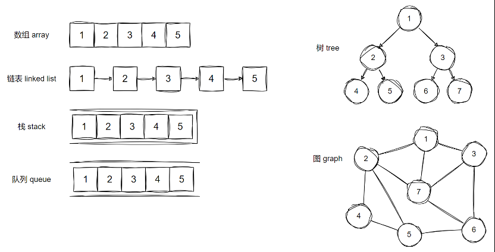
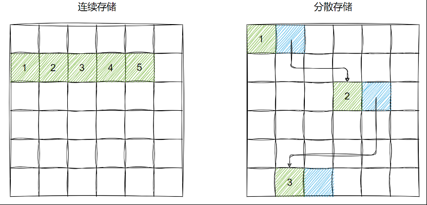
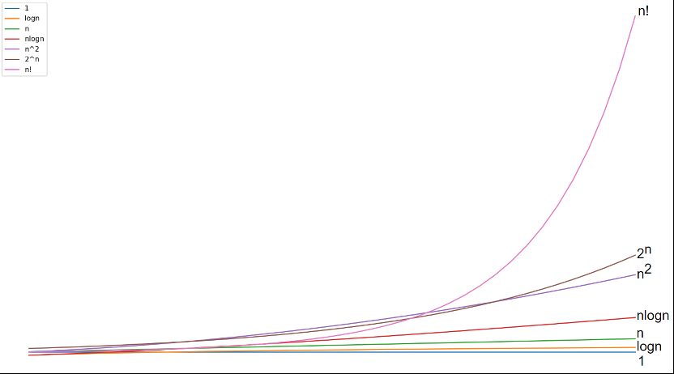

# 数据结构基础

&emsp;&emsp;数据结构是为了高效访问数据而设计出的一种数据的组织和存储方式。更具体的说，一个数据结构包含 <font color=red>一个数据元素的集合、数据元素之间的关系以及访问和操作数据的方法</font>。像 `list`、`set`、`dict`、`tuple` 其实已经是一种 Python 封装的高级数据结构了，里面封装了对基本数据类型数据的存储以及组织方式。

&emsp;&emsp;数据结构的分类方法如下：

<font color=orachid>**（一）逻辑结构**</font>

&emsp;&emsp;数据的逻辑结构反映了数据元素之间的逻辑关系。逻辑结构可分为 <font color=red>线性和非线性 </font>两大类。

+ 线性数据结构：线性数据结构中的元素之间是一对一的顺序关系，在一对一的顺序关系中，除了第一个元素没有前驱元素，最后一个元素没有后继元素外，其余每个元素都有且仅有一个直接前驱元素和一个直接后继元素。这种关系使得数据元素可以按照一个线性的顺序依次排列，就像排成一列的队伍，每个成员前后都有明确的相邻成员（队首和队尾除外）如数组、链表、栈、队列等
+ 非线性数据结构：非线性数据结构中的元素之间具有多个对应关系，如树、图等


<font color=orachid>**（二）物理结构**</font>

&emsp;&emsp;数据的物理结构反映了数据在计算机内存中的存储结构。一般而言，数据结构针对的是内存中的数据。内存由许多存储单元组成，每个存储单元可以存储一个固定大小的数据块，通常以字节（Byte）为单位。每个存储单元都有一个唯一的地址，操作系统正是根据这一地址去访问内存中的数据的。我们讨论的数据结构中的数据元素就保存在这一个个的内存单元中。数据在内存中的存储结构可分为连续存储（数组）与分散存储（链表）：

+ 连续存储借助数据之间的相对位置来表示数据元素之间的逻辑关系
+ 分散存储借助指示数据位置的指针来表示数据元素之间的逻辑关系



&emsp;&emsp;所有数据结构都是基于数组、链表或二者的组合实现的。例如，栈和队列既可以使用数组实现，也可以使用链表实现；而哈希表的实现可能同时包含数组和链表。

# 算法基础

&emsp;&emsp;算法是一个用于解决特定问题的有限指令序列（计算机可以执行的操作）。通俗的理解就是可以解决特定问题的方法。

&emsp;&emsp;算法的五大特性：

+ 输入：算法具有 0 个或多个输入
+ 输出：算法至少有 1 个输出
+ 有穷性：算法在有限的步骤之后会自动结束而不会无限循环，并且每一个步骤可以在可接受的时间内完成
+ 确定性：算法中的每一步都有确定的含义，不会出现二义性
+ 可行性：算法的每一步都是清楚且可行的，能让用户用纸笔计算而求出答案

&emsp;&emsp;算法的分类如下：

+ 按照应用目的分类：搜索算法（深度优先搜索、广度优先搜索等）、排序算法（冒泡排序、插入排序、选择排序、快速排序、归并排序等）、最优化算法等
+ 按照实现策略分类：暴力法、增量法、分治算法、动态规划算法、贪心算法等

## 时间复杂度

<font color=orachid>**（一）时间复杂度定义**</font>

&emsp;&emsp;时间复杂度用来描述运行一个算法所需时间资源的多少。为了屏蔽计算机硬件差异对评估结果的影响，我们不使用算法运行的绝对运行时间，而是使用运行算法时执行的基本指令数量来衡量其所需的时间资源。常见的计算机基本指令有：

+ 赋值指令：用于为变量赋值
+ 算术运算指令：包括加法、减法、乘法和除法等基本的数值运算
+ 逻辑运算指令：包括与、或、非等逻辑操作
+ 比较指令：用于比较两个值的大小或相等性

&emsp;&emsp;我们假定计算机执行算法每一个基本操作的时间是固定的一个时间单位，对于不同的机器环境而言，确切的单位时间是不同的，但是对于算法进行多少个基本操作（即花费多少时间单位）在规模数量级上却是相同的。那么一个算法的所需时间 T 就可以表达为一个与输入规模 n 相关的函数：T(n)。例如下面这个求和的算法，其所需时间 T(n) = 5n+5。其中 n 表示算法的输入规模，这里代表数组长度。

&emsp;&emsp;关于时间复杂度的定义方法如下：

```python
def sum(nums):
    sum_num = 0  # 1次赋值操作
    i = -1  # 1次赋值操作
    while (i := i + 1) < len(nums):  # n+1次加法运算 + n+1次赋值操作 + n+1次比较运算
        sum_num += nums[i]  # n次加法运算 + n次赋值操作
    return sum_num
```

&emsp;&emsp;而下面这个寻找最大值的算法，其所需时间由于条件判断而变得不确定，若输入数组中的最大值位于首位，那么 `T(n) = 4n+1`；如果最大值位于末位，那么 `T(n) = 5n`：

```python
def find_max(nums):
    max_num = nums[0]  # 1次赋值操作
    i = 0  # 1次赋值操作
    while (i := i + 1) < len(nums):  # n次加法运算 + n次赋值操作 + n次比较运算
        if nums[i] > max_num:  # n-1次比较运算
            max_num = nums[i]  # 0~(n-1)次赋值操作
    return max_num
```

&emsp;&emsp;我们注意到上述算法的运行时间还取决于具体数据，而不仅仅是问题规模。对于这种算法，我们把它们的执行情况分为：

+ 最优时间复杂度，即算法完成工作最少需要多少基本操作
+ 最坏时间复杂度，即算法完成工作最多需要多少基本操作
+ 平均时间复杂度，即算法完成工作平均需要多少基本操作

&emsp;&emsp;对于最优时间复杂度，其价值不大，因为它没有提供什么有用信息，其反映的只是最乐观最理想的情况，没有参考价值；对于最坏时间复杂度，提供了一种保证，表明算法在此种程度的基本操作中一定能完成工作；对于平均时间复杂度，是对算法的一个全面评价，因此它完整全面的反映了这个算法的性质。但另一方面，这种衡量并没有保证，不是每个计算都能在这个基本操作内完成。此外，"平均" 还依赖于所选的实例以及这些实例出现的概率。因此，<font color=red>我们主要关注算法的最坏情况，亦即最坏时间复杂度</font>。因此，上述寻找最大值的算法所需时间为 T(n) = 5n。

&emsp;&emsp;一般情况下，我们并不关心输入规模较小时算法的用时多少，并且其实上述的 T(n) 函数也并不是绝对的精确。所以我们通常只关注输入规模无限增大时算法用时的增长趋势。也就是比较  T(n)  函数在 n 趋近于无穷大时的增长速度。

&emsp;&emsp;到目前为止，我们就已经能够对时间复杂度下一个准确的定义了：

+ 时间复杂度统计的是算法运行时执行的基本指令数，而非绝对运行时间
+ 时间复杂度体现的是算法基本指令数随输入规模 n 增大时的变化趋势

<font color=orachid>**（二）时间复杂度的大 O 表示法**</font>

&emsp;&emsp;由于时间复杂度只需要关注输入规模增大时，算法用时的增长趋势。而输入规模无限增大时，T(n) 函数中的低阶项和常数项，以及高阶项的常数系数，对于增长趋势的影响就会变得微乎其微，因此我们可以将其忽略掉，然后用最高阶项来表示 T(n) 函数的增长趋势。

&emsp;&emsp;例如我们现在有两个算法，分别是算法A：T(n) = 5n+5，算法B：T(n) = 2n<sup>2</sup>+2n-2，按照上述思路，算法A的时间复杂度可以表示为 O(n)，算法B的时间复杂度可以表示为 O(n<sup>2</sup>)。

<font color=orachid>**（三）常见的时间复杂度**</font>

&emsp;&emsp;常见的时间复杂度有：O(1) < O(logn) < O(n) < O(nlogn) < O(n<sup>2</sup>) < O(2<sup>n</sup>) < O(n!) < O(n<sup>n</sup>)。

><font color=orange>注意：</font>表示时间复杂度时经常将 log2n 简写为 logn。



&emsp;&emsp;下面是关于时间复杂度的一些案例：

1. O(1)

```python
# 求两数的和
def add(a, b):
	return a + b
```

&emsp;&emsp;如果算法的执行时间不随着问题规模 n 的增加而增长，即使算法中有上千条语句，其执行时间也不过是一个较大的常数。此类算法的时间复杂度是 O(1)。

2. O(logn)

```python
# 二分查找
def binary_search(arr, target):
    left, right = 0, len(arr) - 1
    
    while left <= right:
        mid = left + (right - left) // 2
        if arr[mid] == target:
            return mid
        elif arr[mid] < target:
            left = mid + 1
        else:
            right = mid - 1

	return -1
```

&emsp;&emsp;对数阶反映了 <font color=red>每轮缩减到一半</font> 的情况。

3. O(n)

```python
# 求数组中所有元素的和
def sum(nums):
    sum_num = 0

    for num in nums:
        sum_num += num

    return sum_num
```

3. O(nlogn)

```python
# 归并排序
def merge_sort(arr):

    if len(arr) <= 1:
        return arr

    mid = len(arr) // 2
    left = merge_sort(arr[:mid])
    right = merge_sort(arr[mid:])
    result = []
    i = j = 0

    while i < len(left) and j < len(right):
        if left[i] < right[j]:
            result.append(left[i])
            i += 1
        else:
            result.append(right[j])
            j += 1

    result.extend(left[i:])
    result.extend(right[j:])

    return result
```

4. O(n<sup>2</sup>)

```python
# 冒泡排序
def bubble_sort(nums):
    for i in range(len(nums) - 1):
        for j in range(len(nums) - 1 - i):
            if nums[j] > nums[j + 1]:
                nums[j], nums[j + 1] = nums[j + 1], nums[j]
```

5. O(2<sup>n</sup>)

```python
# 枚举全部子集
def subsets(nums):
    """使用位运算来生成所有子集"""
    n = len(nums)
    result = []

    for i in range(1 << n):
        subset = []
        for j in range(n):
            if i & (1 << j):
                subset.append(nums[j])
        result.append(subset)

    return result
```

6. O(n!)

```python
# 全排列
def permute(nums):
    result = []

    if len(nums) == 1:
        return [nums]

    for i in range(len(nums)):
        remaining = nums[:i] + nums[i + 1 :]
        for perm in permute(remaining):
            result.append([nums[i]] + perm)

    return result
```

## 空间复杂度

&emsp;&emsp;空间复杂度用来描述一个算法运行所需内存空间的多少。同时间复杂度类似，空间复杂度并不代表算法运行时所使用的绝对内存空间，它描述的是算法使用的内存空间随输入规模变大时的变化趋势。

&emsp;&emsp;程序运行时占用内存空间的主要有以下内容：

+ 指令：程序编译后的二进制指令
+ 数据：程序声明的变量、常量、对象等内容

&emsp;&emsp;我们在计算空间复杂度时，一般只需关注数据所占用的内存空间即可。常见的空间复杂度如下：

1. O(1)

&emsp;&emsp;常数阶常见于数量与输入数据大小无关的常量、变量、对象。需要注意的是，在循环中初始化变量或调用函数而占用的内存，在进入下一循环后就会被释放，因此不会累积占用空间，空间复杂度仍为 O(1)：

```python
# 原地反转数组
def reverse_array(arr):
    left, right = -1, len(arr)
    while (left := left + 1) < (right := right - 1):
        arr[left], arr[right] = arr[right], arr[left]
```

2. O(n)

```python
# 判断数组中是否有重复元素
def has_duplicates(arr):
    seen = set()
    for num in arr:
        if num in seen:
            return True
        seen.add(num)
    return False
```

3. O(n<sup>2</sup>)

```python
# 矩阵转置
def transpose(matrix):
    n = len(matrix)

    result = [[0] * n for _ in range(n)]
    for i in range(n):
        for j in range(n):
            result[j][i] = matrix[i][j]

    return result
```