&emsp;&emsp;抽象数据类型（Abstract Data Type，简称 ADT）是计算机科学中一个重要的概念，它是对数据的一种抽象描述，关注数据的逻辑特性和操作，而不涉及具体的实现细节。抽象数据类型通常由以下两部分组成：

+ 数据对象：描述了该数据类型所包含的数据元素以及它们之间的逻辑关系。例如，在一个栈的抽象数据类型中，数据对象是一系列按后进先出（LIFO）原则组织的元素
+ 操作集合：定义了对数据对象可以执行的操作。对于栈来说，常见的操作包括入栈（push）、出栈（pop）、查看栈顶元素（peek）等

&emsp;&emsp;抽象数据类型与数据结构的关系：

+ 抽象数据类型：强调的是数据的逻辑特性和操作的功能，是一种抽象的概念，不涉及具体的实现细节。它是从用户的角度来描述数据和操作的
+ 数据结构：是抽象数据类型的具体实现，它关注的是数据在计算机内存中的存储方式和操作的具体实现算法。例如，栈这种抽象数据类型可以用数组或链表等数据结构来实现

# 数组

&emsp;&emsp;数组是一种线性数据结构，将相同类型的元素顺序地存储在连续的内存空间中，每个元素都有一个索引：

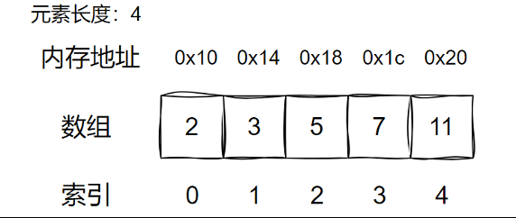

&emsp;&emsp;由于数组元素在内存中是连续存储的，所以只要知道数组的起始位置以及数组元素的类型（单个元素的长度），就可以根据索引计算出任意元素的位置。数组在创建时需要指定长度，并且数组一旦创建，长度就无法改变，如果需要扩容，只能创建一个更大的数组，再将原数据拷贝到新数组。并且由于数组的连续性，插入和删除数据可能需要移动其他元素。

&emsp;&emsp;在 Python 中，并没有像其他一些编程语言（如 C、Java）那样严格意义上的 "数组" 概念，但有多种数据结构可以用来模拟数组的功能，最常用的是列表（`list`），另外还有 `array` 模块的数组和 `numpy` 库的 `ndarray`。通过 Python 的 `list` 列表实现一个动态数组，它内部存储的实际上是对象的引用（指针），而不是对象本身，每个引用指向内存中存储实际对象的位置。

&emsp;&emsp;数组的功能定义如下：

| **方法**                  | **说明**       |
| ----------------------- | ------------ |
| **size()**              | 返回数组中元素个数    |
| **is_empty()**          | 判断数组是否为空     |
| **insert(index, item)** | 在指定位置插入元素    |
| **append(item)**        | 在末尾插入元素      |
| **remove(index)**       | 删除指定位置的元素    |
| **set(index, item)**    | 修改指定位置的元素    |
| **get(index)**          | 获取指定位置的元素    |
| **find(item)**          | 查找数组中某个元素的位置 |
| **for_each(func)**      | 遍历数组         |
&emsp;&emsp;下面是实现一个动态数组的创建过程：

```python
class Array:
    def __init__(self):
        """初始化数组"""
        self.__capacity = 8
        self.__size = 0
        self.__items = [0] * 8

    def __str__(self):
        """打印数组"""
        arr_str = "["
        for i in range(self.__size):
            arr_str += str(self.__items[i])
            if i < self.__size - 1:
                arr_str += ", "
        arr_str += "]"
        return arr_str

    @property
    def size(self):
        """获取数组元素个数"""
        return self.__size

    def is_empty(self):
        """判断数组是否为空"""
        return self.__size == 0
```

&emsp;&emsp;当数组容量占满后，我们可以创建一个新的数组，容量为之前数组的 2 倍，并将之前的数组的元素拷贝到新数组中：

```python
    def __grow(self):
        """数组扩容"""
        self.new___items = [0] * self.__capacity * 2
        
        for i in range(self.__size):
            self.new___items[i] = self.__items[i]

        self.__items = self.new___items
        self.__capacity *= 2
```

&emsp;&emsp;在中间插入元素时，将指定位置及其之后的元素全部向后移动一个位置，并将指定位置改为新的元素：

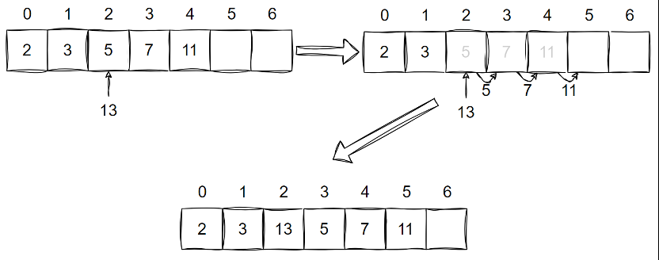

```python
def insert(self, index, item):
        """插入元素"""
        if index < 0 or index > self.__size:
            raise IndexError

        if self.__size == self.__capacity:
            self.__grow()

        for i in range(self.__size, index, -1):
            self.__items[i] = self.__items[i - 1]

        self.__items[index] = item
        self.__size += 1
```

&emsp;&emsp;在末尾插入元素时，使用 `insert()` 并将 `index` 设置为数组长度：

```python
def append(self, item):
        """末尾插入元素"""
        self.insert(self.__size, item)
```

&emsp;&emsp;删除数组中指定位置的元素时，将该位置之后的所有元素向前移动一个位置：

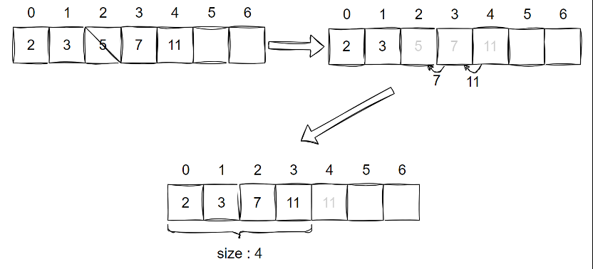

```python
def remove(self, index):
        """删除元素"""
        if index < 0 or index >= self.__size:
            raise IndexError

        for i in range(index, self.__size - 1):
            self.__items[i] = self.__items[i + 1]

        self.__size -= 1
```

&emsp;&emsp;剩余方法：

```python
# 修改元素
def set(self, index, item):
	"""修改元素"""
	if index < 0 or index >= self.__size:
		raise IndexError

	self.__items[index] = item
        
# 访问元素
def get(self, index):
	"""访问元素"""
	if index < 0 or index >= self.__size:
		raise IndexError

	return self.__items[index]
        
# 查找元素
def find(self, item):
	"""查找元素"""
	for i in range(self.__size):
		if self.__items[i] == item:
			return i

	return -1

# 遍历数组
def for_each(self, func):
	"""遍历数组"""
	for i in range(self.__size):
		func(self.__items[i])
```

# 链表

&emsp;&emsp;链表（Linked List）是一个线性结构，由一系列节点（Node）组成，每个节点包含一个数据元素和一个指向下一节点的指针（Pointer）。所有节点通过指针相连，形成一个链式结构。通常我们将链表中的第一个节点称为头结点，并将头结点的位置作为整个链表的位置标识。与数组不同，链表中每个节点分散的存储在内存中，每个节点都保存了当前节点的数据和下一节点的地址（指针）。

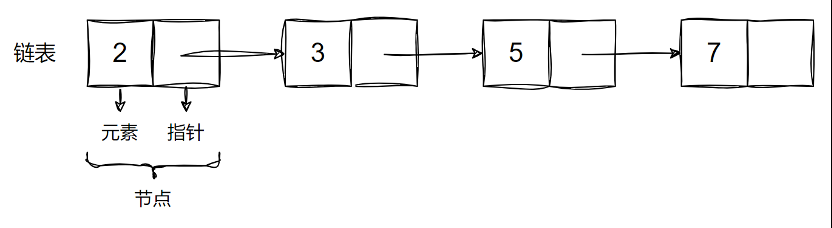
&emsp;&emsp;由于链表中节点通过指针相连，插入和删除节点只需要修改指针的指向即可，而不需要像数组那样移动数据。且链表不需要像数组那样预先指定大小，而是可以随时动态的增长或缩小。由于链表使用分散存储的方式，因而无需使用大段连续的内存空间。

&emsp;&emsp;由于链表中的节点不是连续存储的，无法像数组一样根据索引直接计算出每个节点的地址。必须从头节点开始遍历链表，直到找到目标节点，这导致了链表的随机访问效率较低。链表的每个节点都需要存储指向下一个节点的指针，这会占用额外的存储空间。相比于数组，链表需要更多的内存空间来存储相同数量的数据元素。

&emsp;&emsp;常见的链表包括三种：

+ 单向链表：单向链表的节点包含值和指向下一节点的引用。我们将首个节点称为头节点，将最后一个节点称为尾节点，尾节点指向空 None 
+ 环形链表：将单向链表的尾节点指向头节点（首尾相接），则得到一个环形链表。在环形链表中，任意节点都可以视作头节点
+ 双向链表：双向链表记录了两个方向的引用，同时包含指向后继节点（下一个节点）和前驱节点（上一个节点）的引用

&emsp;&emsp;链表常见的方法：

| **方法**                  | **说明**       |
| ----------------------- | ------------ |
| **size()**              | 返回链表中元素个数    |
| **is_empty()**          | 判断链表是否为空     |
| **insert(index, item)** | 在指定位置插入元素    |
| **append(item)**        | 在末尾插入元素      |
| **remove(index)**       | 删除指定位置的元素    |
| **set(index, item)**    | 修改指定位置的元素    |
| **get(index)**          | 获取指定位置的元素    |
| **find(item)**          | 查找链表中某个元素的位置 |
| **for_each(func)**      | 遍历链表         |
&emsp;&emsp;实现一个单向链表：

```python
class Node:
    def __init__(self, data, next=None):
        self.data = data
        self.next = next

class LinkedList:
    def __init__(self):
        """初始化链表"""
        self.__head = None
        self.__size = 0

    def __str__(self):
        """打印链表"""
        result = []
        current = self.__head
        while current:
            result.append(str(current.data))
            current = current.next
        return " -> ".join(result)

    @property
    def size(self):
        """获取链表元素个数"""
        return self.__size

    def is_empty(self):
        """判断链表是否为空"""
        return self.__size == 0
```

&emsp;&emsp;插入元素：

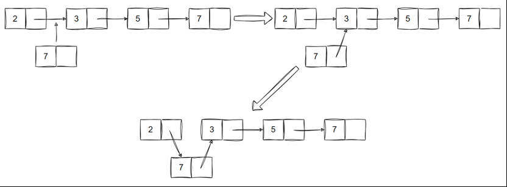

```python
def insert(self, index, item):
	"""插入元素"""
	if index < 0 or index > self.__size:
		raise IndexError

	if index == 0:
		# 插入到头部，需要新建一个节点，然后让新节点的next指向原来的head，然后让head指向新节点
		self.__head = Node(item, self.__head)
	else:
		# 插入到中间，先找到index-1位置的节点
		node = self.__head
		for i in range(index - 1):
			node = node.next
		# 新节点的next指向index位置的节点，然后让index-1位置的节点的next指向新节点
		node.next = Node(item, node.next)

	self.__size += 1
```

&emsp;&emsp;在末尾插入元素时，使用 `insert()` 并将 `index` 设置为链表长度：

```python
def append(self, item):
	"""末尾插入元素"""
	self.insert(self.__size, item)
```

&emsp;&emsp;删除元素：

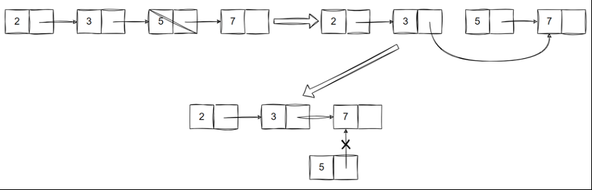

```python
def remove(self, index):
	"""删除元素"""
	if index < 0 or index >= self.__size:
		raise IndexError

	if index == 0:
		self.__head = self.__head.next
	else:
		# 找到index-1位置的节点，然后让index-1位置的节点的next指向index位置的节点的next
		node = self.__head
		for i in range(index - 1):
			node = node.next
		node.next = node.next.next
	self.__size -= 1
```

&emsp;&emsp;其他方法如下：

```python
# 修改元素
def set(self, index, item):
	"""修改元素"""
	if index < 0 or index >= self.__size:
		raise IndexError

	node = self.__head
	for i in range(index):
		node = node.next

	node.data = item

# 访问元素
def get(self, index):
	"""访问元素"""
	if index < 0 or index >= self.__size:
		raise IndexError

	node = self.__head
	for i in range(index):
		node = node.next

	return node.data
	
# 查找元素
def find(self, item):
	"""查找元素"""
	node = self.__head

	while node:
		if node.data == item:
			return True
		node = node.next

	return False
	
# 遍历链表
def for_each(self, func):
	"""遍历链表"""
	node = self.__head

	while node:
		print(node)
		node = node.next
```

# 栈

&emsp;&emsp;栈（Stack）是一个线性结构，其维护了一个有序的数据列表，列表的一端称为栈顶（top），另一端称为栈底（bottom）。栈对数据的操作有明确限定，插入元素只能从栈顶进行，删除元素也只能栈顶开始逐个进行，通常将插入元素称为入栈（push），删除元素称为出栈（pop）。正是由于上述规定，栈保证了后进先出的原则（LIFO，Last-In-First-Out）：

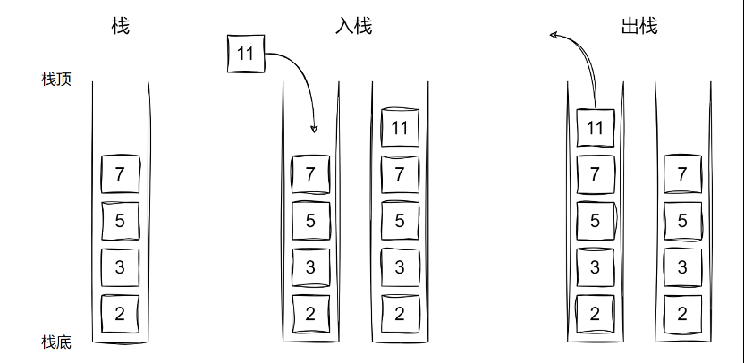

&emsp;&emsp;栈的底层实现既可以选择数组也可以选择链表，只要能保证后进先出的原则即可。栈的主要方法如下：

| **方法**         | **说明**           |
| -------------- | ---------------- |
| **size()**     | 返回栈中元素个数         |
| **is_empty()** | 判断栈是否为空          |
| **push(item)** | 将新元素压入栈中         |
| **pop()**      | 获取栈顶元素，并将栈顶元素弹出栈 |
| **peek()**     | 获取栈顶元素，但不弹出栈     |
&emsp;&emsp;下面使用动态数组实现一个栈：

```python
class Stack:
    def __init__(self):
        """初始化栈"""
        self.__size = 0
        self.__items = []

    @property
    def size(self):
        """获取栈元素个数"""
        return self.__size

    def is_empty(self):
        """判断栈是否为空"""
        return self.__size == 0

    def push(self, item):
        """入栈"""
        self.__items.append(item)
        self.__size += 1

    def pop(self):
        """出栈"""
        if self.is_empty():
            raise Exception("栈为空")

        item = self.__items[self.__size - 1]
        del self.__items[self.__size - 1]
        self.__size -= 1
        return item

    def peek(self):
        """访问栈顶元素"""
        if self.is_empty():
            raise Exception("栈为空")
        return self.__items[self.__size - 1]
```

# 队列

&emsp;&emsp;队列（Queue）也是一个线性结构，其同样维护了一个有序的数据列表，队列的一端称为队首，另一端称为队尾。队列也对数据操作做出了明确限定，插入元素只能从队尾进行，删除元素只能从队首进行，通常将插入操作称为入队（enqueue），将删除操作称为出队（dequeue）。也正是由于上述限制，队列保证了先进先出（FIFO，First-In-First-Out）的原则。

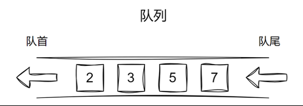

&emsp;&emsp;队列的底层实现既可以选择数组也可以选择链表，只要能保证先进先出的原则即可。常见的队列包括两种：

+ 单向队列：只能从一端插入数据，从另一端删除数据，遵循先进先出
+ 双向队列：在队列的两端都可以进行插入和删除操作

&emsp;&emsp;队列常见的方法如下：

| **方法**         | **说明**    |
| -------------- | --------- |
| **size()**     | 返回队列中元素个数 |
| **is_empty()** | 判断队列是否为空  |
| **push(item)** | 向队尾添加元素   |
| **pop()**      | 从队首取出元素   |
| **peek()**     | 访问队首元素    |
```python
# 单向队列
class Node:
    def __init__(self, data):
        self.data = data
        self.next = None

class Queue:
    def __init__(self):
        """初始化队列"""
        self.__head = None
        self.__tail = None
        self.__size = 0

    @property
    def size(self):
        """获取队列元素个数"""
        return self.__size

    def is_empty(self):
        """判断队列是否为空"""
        return self.__size == 0

    def push(self, data):
        """入队"""
        node = Node(data)

        if self.is_empty():
            self.__head = node
            self.__tail = node
        else:
            self.__tail.next = node
            self.__tail = node

        self.__size += 1
        
   def pop(self):
        """ "出队"""
        if self.is_empty():
            raise Exception("队列为空")

        data = self.__head.data
        self.__head = self.__head.next
        self.__size -= 1
        return data

    def peek(self):
        """访问队首元素"""
        if self.is_empty():
            raise Exception("队列为空")
        return self.__head.data
```

# 哈希表

&emsp;&emsp;哈希表（Hash Table，也叫散列表），由一系列键值对（key-value pairs）组成，并且可以通过键（key）查找对应的值（value）。哈希表通过建立 key与 value 之间的映射，实现高效的查询，我们向哈希表中输入一个 key，可以在 O(1) 的时间内获取对应的 value。例如通过客户 id 获取客户姓名：

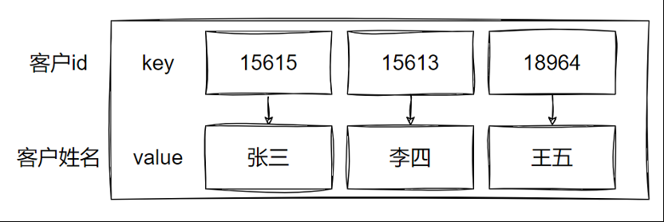

&emsp;&emsp;哈希表常见的一个操作是根据 key 来查找 value，考虑到数组查询效率最高，选择基于数组实现哈希表。利用哈希函数计算 key 的哈希值，然后将哈希值映射到数组索引。在实现过程中我们可能会遇到如下问题：

+ 如何将一个个 key 映射到数组的索引？
+ 如果多个 key 映射到数组同一个索引怎么办？
+ 数组长度是固定的，如果后续元素过多，大于数组长度怎么办？

<font color=orachid>**（一）哈希函数**</font>

&emsp;&emsp;哈希表的核心组件是哈希函数。该函数将 key 转换为一个数组索引。哈希函数的目标是尽量均匀地将所有可能的 key 分布到表的不同位置，以减少冲突的发生。哈希函数的执行步骤分为两步：

+ 通过某种哈希算法计算出 key 的哈希值
+ 哈希值对数组长度取余，获取 key 对应的数组索引

`index = hash(key) % capacity`

&emsp;&emsp;例如我们使用一个简单的哈希算法 `hash(key)=key` 将客户 id 映射到一个长度为 8 的数组的索引，即 `index = key % 8` ：

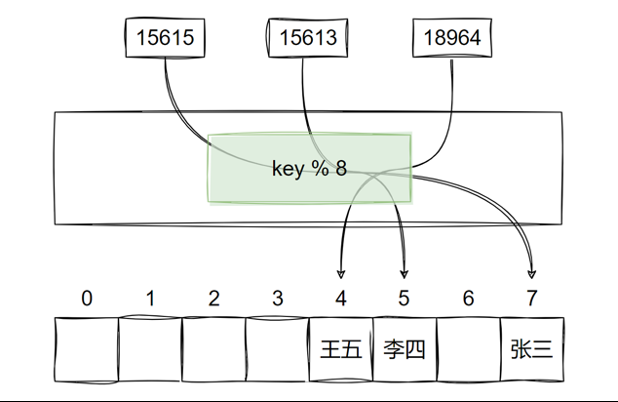

&emsp;&emsp;常见的哈希算法：

+ 通用哈希算法：除法哈希、乘法哈希、MurmurHash、CityHash
+ 加密哈希算法：MD5（已被成功攻击）、SHA-1（已被成功攻击）、SHA-2、SHA-3
+ 文件完整性检查算法：Adler-32、CRC32

<font color=orachid>**（二）哈希冲突**</font>

&emsp;&emsp;哈希函数可能会将不同的键值映射到同一个索引位置，这就是所谓的哈希冲突。处理冲突的方式有多种，最常见的两种是链式法（Chaining）和开放寻址法（Open Addressing）。

1. 链式法

&emsp&emsp;将发生碰撞的每个键值对作为一个节点（Node）组成一个链表（Linked List），然后将链表的头节点保存在数组的目标位置中。这样一来，向字典中写入数据时，若发现数组的目标位置已有数据，那么就将当前的键值对作为一个节点插入链表；从字典中读取数据时，则从数组的目标位置获取链表，并进行遍历，直到找到目标数据。

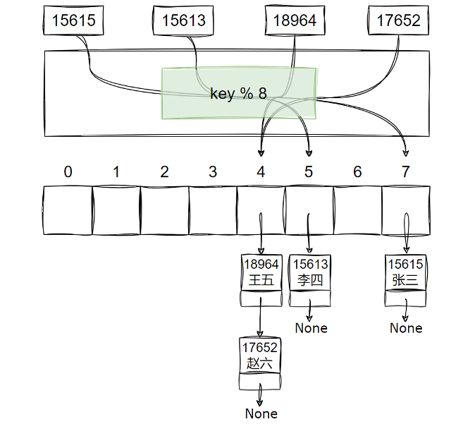
2. 开放寻址法

&emsp;&emsp;当发生冲突时根据某种探查策略寻找下一个空槽位。常见的探查策略包括：

+ 线性探查（Linear Probing）：如果当前位置已经被占用，就探查下一个位置
+ 二次探查（Quadratic Probing）：以平方的步长进行探查
+ 双重哈希（Double Hashing）：使用另一个哈希函数来计算新的索引

<font color=orachid>**（三）负载因子**</font>

&emsp;&emsp;负载因子（Load Factor）是哈希表中元素个数与表的大小的比率。当负载因子过高时，可能需要进行扩容操作，以保持操作的效率。较小的负载因子可以减少冲突的可能性，较大的负载因子可以提高哈希表的内存利用率。通常情况下负载因子在 `0.7 ~ 0.8` 是一个比较好的选择。

&emsp;&emsp;哈希表的功能定义如下：

| **方法**              | **说明**        |
| ------------------- | ------------- |
| **size()**          | 返回哈希表中键值对个数   |
| **is_empty()**      | 判断哈希表是否为空     |
| **put(key, value)** | 向哈希表插入键值对     |
| **remove(key)**     | 从哈希表中根据键删除键值对 |
| **get(key)**        | 从哈希表中根据键获取值   |
| **for_each(func)**  | 遍历哈希表中的键值对    |
&emsp;&emsp;哈希表实现如下：

```python
class Node:
    def __init__(self, key, value):
        self.key = key
        self.value = value
        self.next = None

class HashTable:
    def __init__(self):
        """初始化哈希表"""
        self.__capacity = 8  # 数组长度
        self.__size = 0  # 键值对个数
        self.__load_factor = 0.7  # 负载因子
        self.__table = [None] * self.__capacity

    def display(self):
        """显示哈希表内容"""
        for i, node in enumerate(self.__table):
            print(f"Index {i}: ", end="")
            current = node
            while current:
                print(f"({current.key}, {current.value}) -> ", end="")
                current = current.next
            print("None")
        print()

    def __hash(self, key):
        """哈希函数，根据key计算索引"""
        return hash(key) % self.__capacity

    def __grow(self):
        """哈希表负载因子超过阈值时进行扩容"""
        self.__capacity = self.__capacity * 2
        self.__table, old_table = [None] * self.__capacity, self.__table
        self.__size = 0

        # 将旧哈希表中的元素重新插入到新的哈希表中
        for node in old_table:
            current = node
            while current:
                self.put(current.key, current.value)
                current = current.next
                
    @property
    def size(self):
        """获取哈希表键值对个数"""
        return self.__size

    def is_empty(self):
        """判断哈希表是否为空"""
        return self.__size == 0

    def put(self, key, value):
        """插入键值对，处理哈希冲突"""
        # 如果负载因子超过阈值则进行扩容
        if self.__size / self.__capacity > self.__load_factor:
            self.__grow()

        index = self.__hash(key)
        new_node = Node(key, value)
        # 如果当前位置为空，直接插入
        if self.__table[index] is None:
            self.__table[index] = new_node
        else:
            # 否则，发生哈希冲突，链式存储
            current = self.__table[index]
            while current and current.next:
                # 如果键已经存在，更新值
                if current.key == key:
                    current.value = value
                    return
                current = current.next

            # 如果键不存在，插入到链表尾部
            current.next = new_node
        self.__size += 1
       
    def remove(self, key):
        """删除键值对"""
        index = self.__hash(key)
        current = self.__table[index]
        prev = None

        while current:
            if current.key == key:
                if prev:
                    # 删除非头节点
                    prev.next = current.next
                else:
                    # 删除头节点
                    self.__table[index] = current.next
                self.__size -= 1
                return True
            prev = current
            current = current.next
        return False

    def get(self, key):
        """访问键值对"""
        index = self.__hash(key)
        current = self.__table[index]

        while current:
            if current.key == key:
                return current.value
            current = current.next
        return None

    def for_each(self, func):
        """遍历哈希表"""
        for node in self.__table:
            current = node
            while current:
                func(current.key, current.value)
                current = current.next
```

# 树

&emsp;&emsp;树（Tree）由一系列具有层次关系的节点（Node）组成：

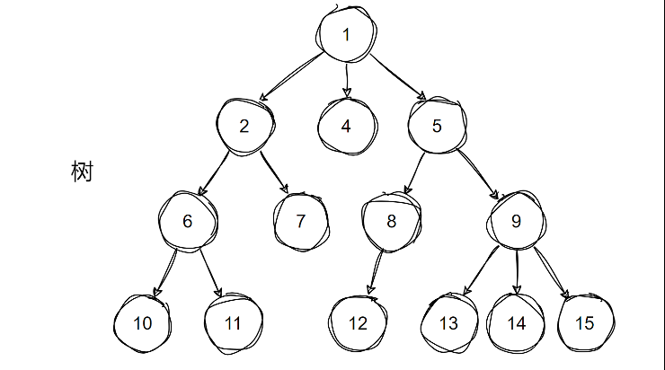
&emsp;&emsp;树结构的常见术语：

+ 父节点：节点的上层节点
+ 子节点：节点的下层节点
+ 根节点：位于树的顶端，没有父节点的节点
+ 叶节点：位于树的底端，没有子节点的节点
+ 边：连接两个节点的线段
+ 节点的度：节点的子节点数量
+ 节点的层：从根开始定义起，根为第 1 层，根的子节点为第 2 层，以此类推
+ 节点的深度：从根节点到该节点所经过的边的数量，根的深度为 0
+ 节点的高度：从距离该节点最远的叶节点到该节点所经过的边的数量，所有叶节点的高度为 0
+ 树的深度（高度）：从根节点到最远叶节点所经过的边的数量

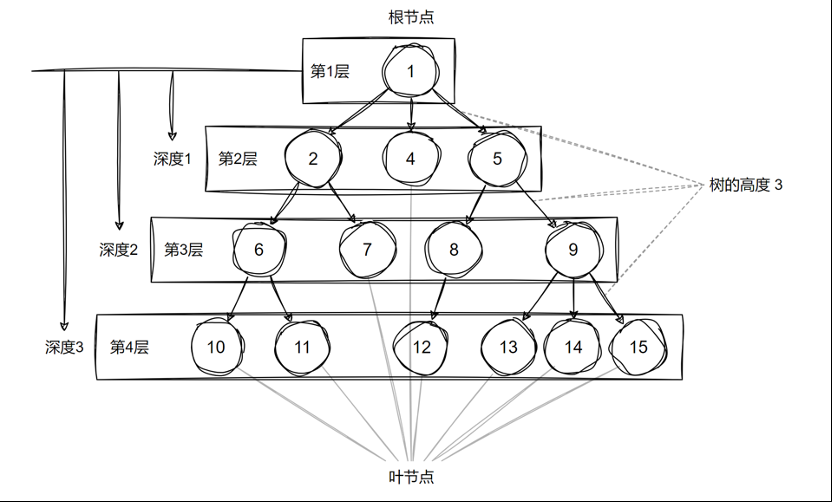

## 二叉树

&emsp;&emsp;树形结构中最具代表性的一种就是二叉树（Binary Tree）。二叉树规定，每个节点最多只能有两个子节点，两个子节点分别被称为左子节点和右子节点。以左子节点为根节点的子树被称为左子树，以右子节点为根节点的子树被称为右子树。

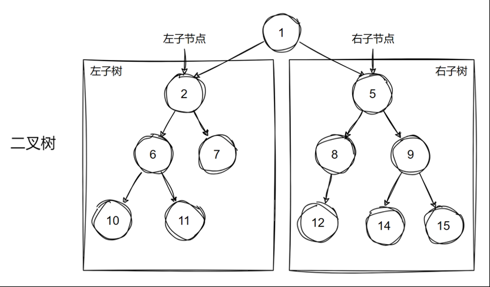

&emsp;&emsp;数组结构存储二叉树：

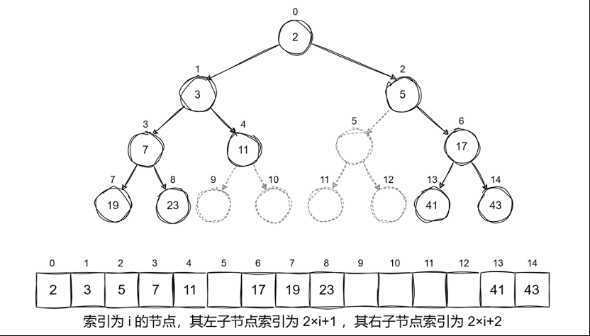

&emsp;&emsp;采用数组结构存储二叉树访问与遍历速度较快，但不适合存储数据量过大的树，且增删效率较低，而且树中存在大量 None 的情况下空间利用率较低，因此不是主流方式。

&emsp;&emsp;采用链表存储的二叉树：

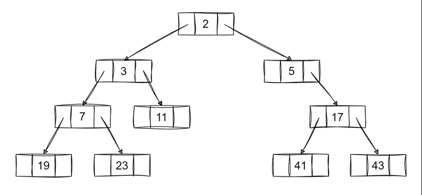
&emsp;&emsp;常见的二叉树如下：

<font color=orachid>**（一）完全二叉树**</font>

&emsp;&emsp;完全二叉树只有最下面一层的节点未被填满，且靠左填充。

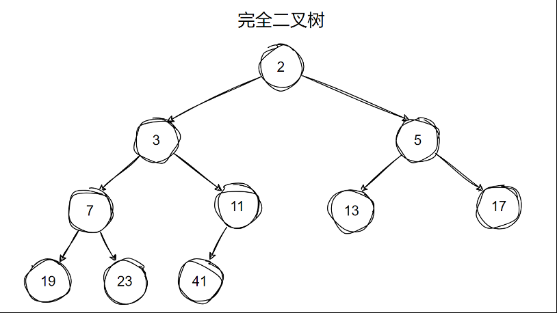

<font color=orachid>**（二）满二叉树**</font>

&emsp;&emsp;满二叉树所有层的节点都被完全填满，满二叉树也是一种完全二叉树。

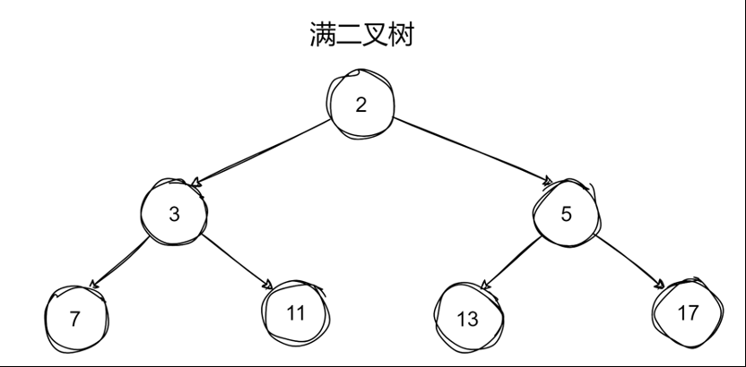

<font color=orachid>**（三）平衡二叉树**</font>

&emsp;&emsp;平衡二叉树中任意节点的左右子树高度之差不超过 1。

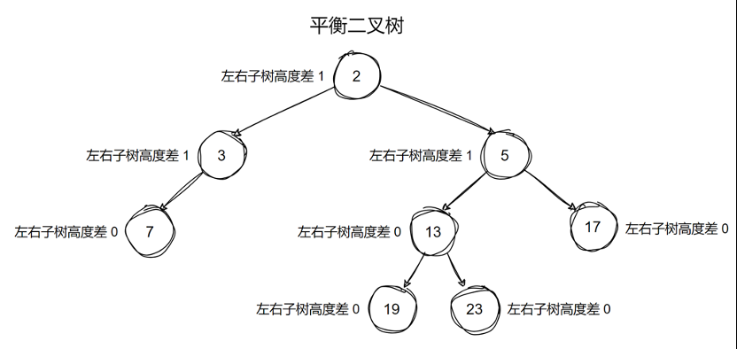

<font color=orachid>**（四）二叉树搜索**</font>

&emsp;&emsp;二叉搜索树中的每个节点的值，大于其左子树中的所有节点的值，并且小于右子树中的所有节点的值。

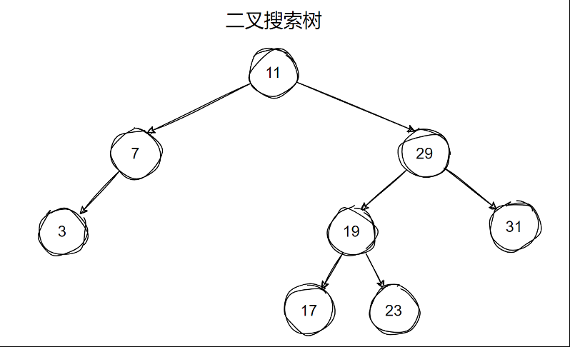

<font color=orachid>**（五）AVL 树**</font>

&emsp;&emsp;AVL 树是一种自平衡的二叉搜索树，插入和删除时会进行旋转操作来保证树的平衡性。

<font color=orachid>**（六）红黑树**</font>

&emsp;&emsp;红黑树是一种特殊的二叉搜索树，除了二叉搜索树的要求外，它还具有以下特性：

+ 每个节点或者是黑色，或者是红色
+ 根节点是黑色
+ 每个叶节点都是黑色。这里叶节点是指为空（None）的节点
+ 红色节点的两个子节点必须是黑色的。即从每个叶到根的所有路径上不能有两个连续的红色节点
+ 从任一个节点到其每个叶的所有路径上包含相同数目的黑色节点

<font color=orachid>**（七）堆**</font>

&emsp;&emsp;堆（Heap）是一种满足特定条件的完全二叉树，主要可分为两种类型：

+ 大顶堆：每个父节点的值都大于等于其子节点的值。根节点为树中的最大值
+ 小顶堆：每个父节点的值都小于等于其子节点的值。根节点为树中的最小值

<font color=orachid>**（八）霍夫曼树**</font>

&emsp;&emsp;霍夫曼树又称最优二叉树，是一种带权路径长度最短的二叉树，通常用于数据压缩，它的构建基于字符出现频率的概率。

<font color=orachid>**（九）B 树**</font>

&emsp;&emsp;B 树是一种自平衡的多路查找树。虽然它不是严格意义上的二叉树，但与二叉树的结构类似。经常用于数据库、文件系统等需要磁盘访问的应用。

<font color=orachid>**（十）B+ 树**</font>

&emsp;&emsp;B+ 树是 B 树的优化版本。它通过将数据集中存储在叶子节点并通过链表连接来实现高效的范围查询，并且非叶子节点仅存储索引，提高了磁盘利用率。

&emsp;&emsp;二叉搜索树的功能定义如下：

| **方法**                    | **说明**      |
| ------------------------- | ----------- |
| **size()**                | 返回树中节点个数    |
| **is_empty()**            | 判断树是否为空     |
| **search(item)**          | 查找节点是否存在    |
| **add(item)**             | 向二叉搜索树中插入节点 |
| **remove(item)**          | 从二叉搜索树中删除节点 |
| **for_each(func, order)** | 按指定方式遍历二叉树  |
&emsp;&emsp;二叉树的创建过程如下：

```python
from collections import deque

class Node:
    """二叉树节点"""
    def __init__(self, data):
        self.data = data
        self.left = None
        self.right = None
        
        
class BinarySearchTree:
    """二叉搜索树"""
    def __init__(self):
        """初始化二叉树"""
        self.__root = None
        self.__size = 0

    def print_tree(self):
        """打印树的结构"""
        
        # 先得到树的层数
        def get_layer(node):
            """递归计算树的层数"""
            if node is None:
                return 0
            else:
                left_depth = get_layer(node.left)
                right_depth = get_layer(node.right)
                return max(left_depth, right_depth) + 1
                
        layer = get_layer(self.__root)

        # 层序遍历并打印
        queue = deque([(self.__root, 1)])
        current_level = 1
        
        while queue:
            node, level = queue.popleft()
            if level > current_level:
                print()
                current_level += 1
            if node:
                print(f"{node.data:^{20*layer//2**(level-1)}}", end="")
            else:
                print(f"{"N":^{20*layer//2**(level-1)}}", end="")
            if level < layer:
                if node:
                    queue.append((node.left, level + 1))
                    queue.append((node.right, level + 1))
                else:
	                queue.append((None, level + 1))
                    queue.append((None, level + 1))
       print()
       
    @property
    def size(self):
        """返回树中节点的个数"""
        return self.__size

    def is_empty(self):
        """判断树是否为空"""
        return self.__size == 0
```

&emsp;&emsp;查找时先与当前节点比较大小，等于则找到了目标节点，小于则向左子节点查找，大于则向右子节点查找。如果查找到 None 仍未找到则说明该节点不在树中。

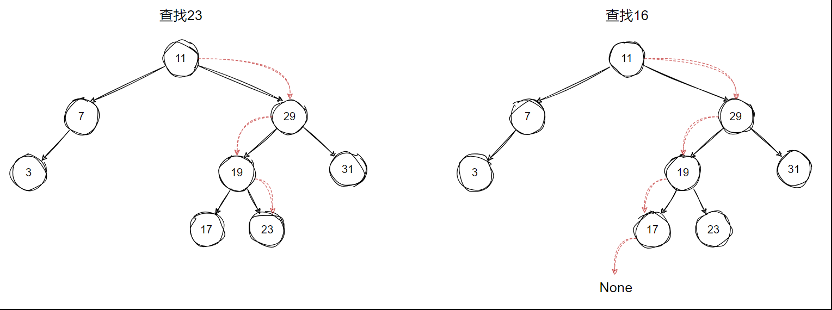

&emsp;&emsp;后续插入与删除操作也会用到查找，所以此处提供一个`__search_pos()` 方法，返回查找到的节点和其父节点供后续使用。

```python
def search(self, item):
        """查找节点是否存在"""
        return self.__search_pos(item)[0] is not None

    def __search_pos(self, item):
        """查找节点，返回(节点,父节点)。如果节点不存在则为None，此时父节点为一个叶节点"""
        parent = None
        current = self.__root

        while current:
            if item == current.data:
                break
            parent = current
            current = current.left if item < current.data else current.right
        return current, parent
```

&emsp;&emsp;插入时先执行查找操作，查找时保存当前节点的父节点。如果找到了节点则说明树中已有此元素，退出。如果找到了 None，此时 None 的父节点为叶节点，应将该元素插入该叶节点的子节点。

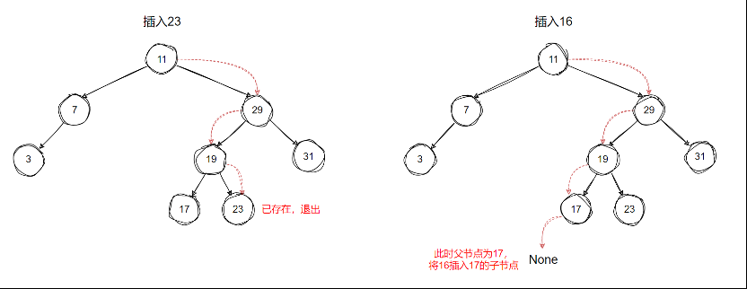

```python
def add(self, item):
        """插入节点"""
        node = Node(item)
        if self.is_empty():
            self.__root = node
        else:
            current, parent = self.__search_pos(item)
            # 如果节点之前已存在则返回
            if current:
                return
            # 如果节点之前不存在，则插入父节点的左节点或右节点
            if parent.data > item:
                parent.left = node
            else:
                parent.right = node
        self.__size += 1
```

&emsp;&emsp;需要保证删除节点后仍然保证二叉搜索树的性质。删除操作需要根据目标节点的子节点数量为 0、1、2 分三种情况：

1. 目标节点的子节点数量为 0

&emsp;&emsp;直接删除目标节点：

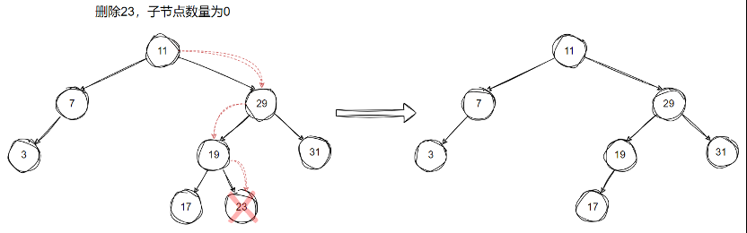

2. 目标节点的子节点数量为 1

&emsp;&emsp;将目标节点替换为其子节点：

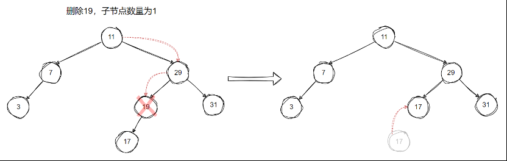

3. 目标节点的子节点数量为 2

&emsp;&emsp;使用目标节点的右子树最小节点、或左子树最大节点替换目标节点：

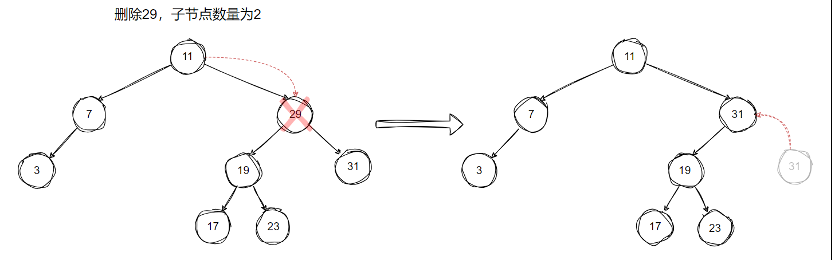

```python
def remove(self, item):
        """删除节点"""
        current, parent = self.__search_pos(item)
        if not current:
            return

        # 如果删除的是叶节点（没有子节点）
        if not current.left and not current.right:
            if parent:
                if parent.left == current:
                    parent.left = None
                else:
                    parent.right = None
            else:
                # 如果没有父节点，说明是根节点
                self.__root = None

        # 如果删除的节点只有一个子节点
        elif not current.left or not current.right:
            child = current.left if current.left else current.right
            if parent:
                if parent.left == current:
                    parent.left = child
                else:
                    parent.right = child
            else:
                # 如果没有父节点，说明是根节点
                self.__root = child

        # 如果删除的节点有两个子节点
        else:
            # 找到中序后继（右子树中最小的节点）
            successor = self.__get_min(current.right)
            successor_data = successor.data
            
            # 删除中序后继节点
            self.remove(successor_data)
            # 用中序后继的值替代当前节点
            current.data = successor_data
        self.__size -= 1

    def __get_min(self, node):
        """找到当前子树的最小节点"""
        current = node
        while current.left:
            current = current.left
        return current
```

&emsp;&emsp;二叉树的遍历的方法如下：

1. 深度优先

&emsp;&emsp;深度优先搜索（DFS，Depth First Search）尽可能地深入每一个分支，直到不能再深入为止，然后回溯到上一个节点，继续尝试其他的分支：

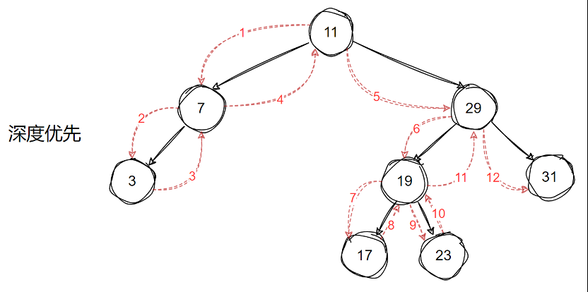
1）前序遍历

&emsp;&emsp;先访问当前节点，再访问节点的左子树，再访问节点的右子树。

```python
def dfs(node):
    """前序遍历"""
    if node is None:
        return

    print(node)  # 访问当前节点
    dfs(node.left)  # 访问节点的左子树
    dfs(node.right)  # 访问节点的右子树
```

2）中序遍历

&emsp;&emsp;先访问节点的左子树，再访问当前节点，再访问节点的右子树。二叉搜索树中序遍历的结果是有序的。

```python
def dfs(node):
    """中序遍历"""
    if node is None:
        return

    dfs(node.left)  # 访问节点的左子树
    print(node)  # 访问当前节点
    dfs(node.right)  # 访问节点的右子树
```

3）后续遍历

&emsp;&emsp;先访问节点的左子树，再访问节点的右子树，再访问当前节点。

```python
def dfs(node):

    """后序遍历"""
    if node is None:
        return

    dfs(node.left)  # 访问节点的左子树
    dfs(node.right)  # 访问节点的右子树
    print(node)  # 访问当前节点
```

2. 广度优先

1）层序遍历

&emsp;&emsp;广度优先搜索（BFS，Breadth First Search）从起始节点开始，首先访问该节点的所有子节点，然后再访问子节点的子节点，依此类推，逐层访问节点。

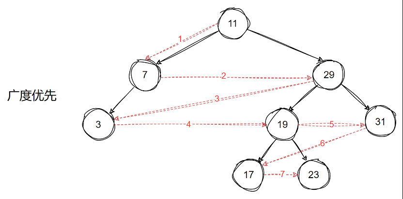

&emsp;&emsp;广度优先搜索一般使用队列实现，每访问一个节点，就将该节点的子节点添加进队列中。

3. 代码实现

```python
def for_each(self, func, order="inorder"):
        """遍历树，默认中序遍历"""
        match order:
            case "inorder":
                self.__inorder_traversal(func)
            case "preorder":
                self.__preorder_traversal(func)
            case "postorder":
                self.__postorder_traversal(func)
            case "levelorder":
                self.__levelorder_traversal(func)

    def __inorder_traversal(self, func):
        """深度优先搜索：中序遍历"""
        def inorder(node):
            if node:
                inorder(node.left)
                func(node.data)
                inorder(node.right)
        inorder(self.__root)

    def __preorder_traversal(self, func):
        """深度优先搜索：前序遍历"""
        def preorder(node):
            if node:
                func(node.data)
                preorder(node.left)
                preorder(node.right)
        preorder(self.__root)

    def __postorder_traversal(self, func):
        """深度优先搜索：后序遍历"""
        def postorder(node):
            if node:
                postorder(node.left)
                postorder(node.right)
                func(node.data)
        postorder(self.__root)
        
    def __levelorder_traversal(self, func):
        """广度优先搜索：层序遍历"""
        queue = deque()
        queue.append(self.__root)

        while queue:
            node = queue.popleft()
            func(node.data)
            if node.left:
                queue.append(node.left)
            if node.right:
                queue.append(node.right)
```

# 图

&emsp;&emsp;前面我们学习了线性结构和树，线性结构局限于只有一个直接前驱和一个直接后继的关系，树也只能有一个直接前驱，也就是父节点，当我们需要表示多对多的关系时，就需要用到图了，图是比树更普遍的结构，可以认为树是一种特殊的图。图由节点和边组成。

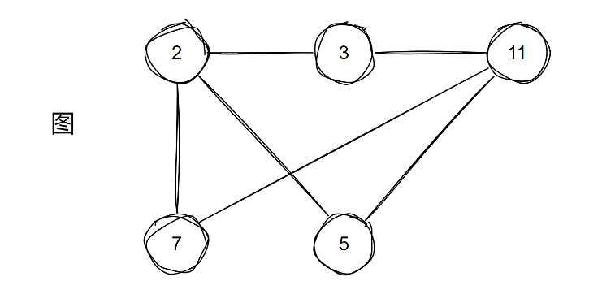
&emsp;&emsp;图的常见术语：

+ 节点：也称为顶点，是图的基础部分
+ 边：连接两个节点，也是图的基础部分。可以是单向的，也可以是双向的
+ 权重：边可以添加 "权重" 变量
+ 邻接：两节点之间存在边，则称这两个节点邻接
+ 度：一个节点的边的数量。入度为指向该节点的边的数量，出度为该节点指向其他节点的边的数量
+ 路径：从一节点到另一节点所经过的边的序列
+ 环：首尾节点相同的路径

&emsp;&emsp;图的分类方法如下：

+ 有向图：边是单向的
+ 无向图：边是双向的

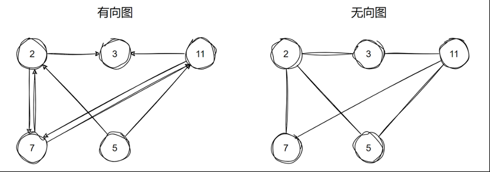

+ 连通图：从某个节点出发，可以到达其余任意节点
+ 非连通图：从某个节点出发，有节点不可达

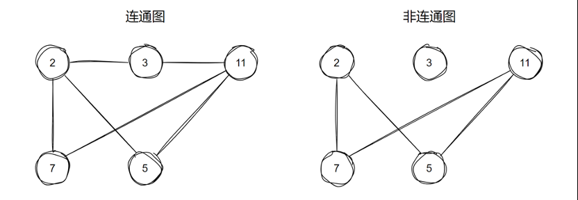
&emsp;&emsp;图的常用表示法如下：

+ 邻接矩阵

&emsp;&emsp;邻接矩阵用一个 n×n 的矩阵来表示有 n 个节点之间的关系，矩阵的每一行（列）代表一个节点，矩阵 m 行 n 列的值代表是否存在由 m 指向 n 的边。邻接矩阵适合存储稠密图。

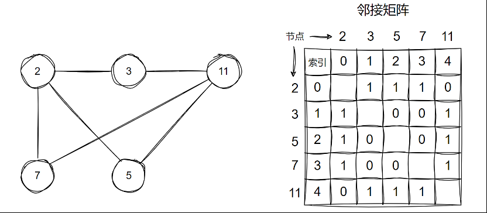

+ 邻接表

&emsp;&emsp;邻接表存储 n 个链表、列表或其他容器，每个容器存储该节点的所有邻接节点。邻接表适合存储稀疏图，空间效率高，尤其在处理边远少于节点的图时表现优越，但在进行边查找时不如邻接矩阵高效。

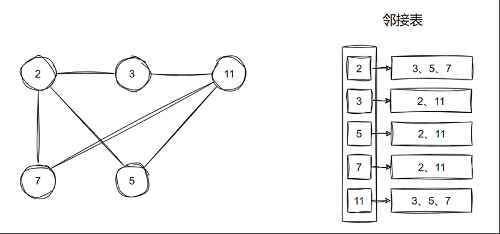

&emsp;&emsp;图的遍历方法包括 <font color=red>广度优先搜索</font> 和 <font color=red>深度优先搜索</font>：

1. 广度优先搜索

&emsp;&emsp;广度优先搜索（BFS，Breadth First Search）从起始节点开始，首先访问该节点的所有邻接节点，然后再访问邻接节点的邻接节点，依此类推，逐层访问节点。

+ 从图的起始节点开始，首先访问该节点，并标记为已访问
+ 然后依次访问所有未被访问的邻接节点，并将它们加入到队列中
+ 当队列中的节点被访问时，继续访问它的邻接节点，并将新的节点加入队列
+ 直到队列为空，表示所有节点都已被访问

2. 深度优先搜索

&emsp;&emsp;深度优先搜索（DFS，Depth First Search）尽可能地深入到图的每一个分支，直到不能再深入为止，然后回溯到上一个节点，继续尝试其他的分支。

+ 从图的一个起始节点开始，访问这个节点并标记为已访问
+ 对于每个未访问的邻接节点，递归地执行 DFS，直到没有未访问的邻接节点
+ 当回溯到一个节点时，继续访问它的其他邻接节点

