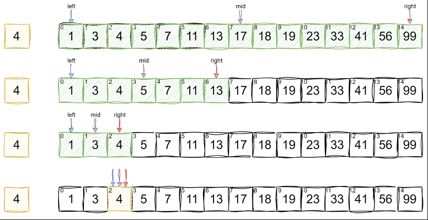
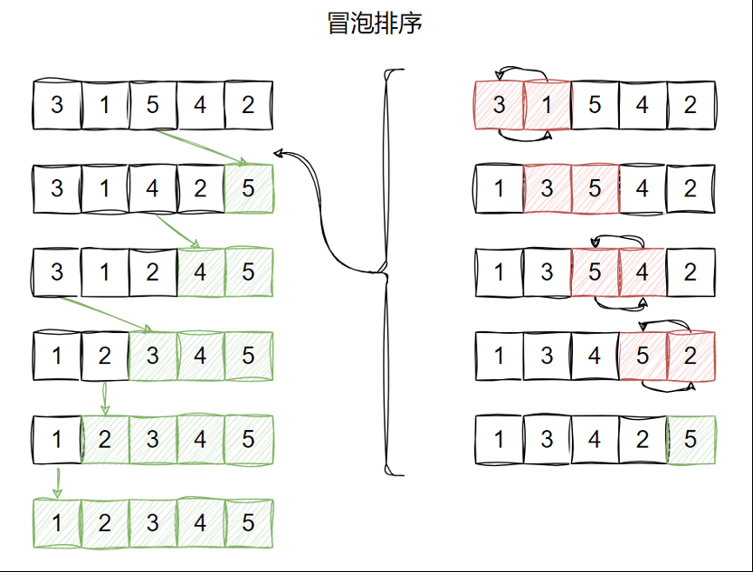
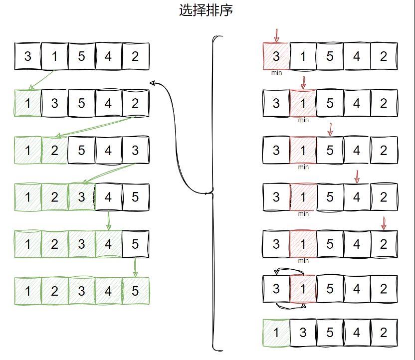
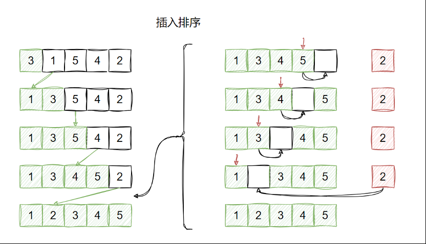
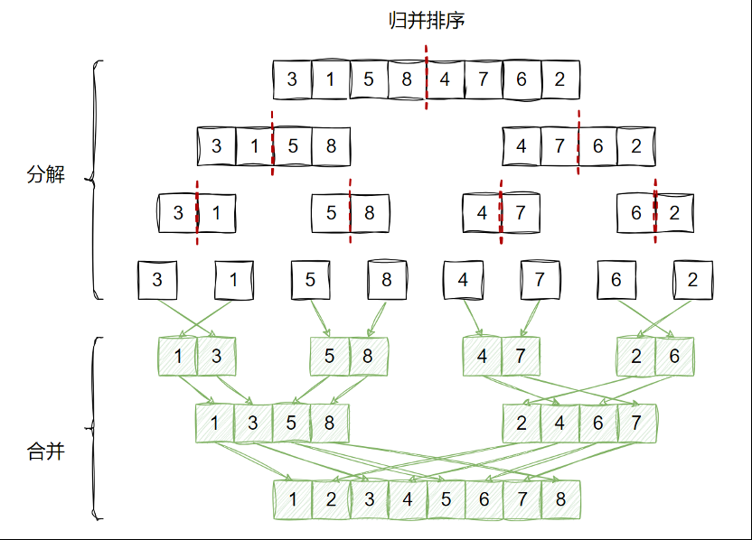
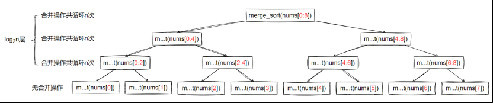

# 查找算法

## 二分查找

&emsp;&emsp;二分查找又称折半查找，适用于有序列表。其利用数据的有序性，每轮缩小一半搜索范围，直至找到目标元素或搜索区间为空为止。



```python
def binary_search(arr, target):
    left, right = 0, len(arr) - 1

    while left <= right:
        mid = left + (right - left) // 2
        if arr[mid] == target:
            return mid  # 找到目标值，返回索引
        elif arr[mid] < target:
            left = mid + 1  # 目标值在右半部分
        else:
            right = mid - 1  # 目标值在左半部分
            
    return -1  # 未找到目标值
```

+ 时间复杂度：在循环中区间每轮缩小一半，因此时间复杂度为 O(logn)
+ 空间复杂度：使用常数大小的额外空间，空间复杂度为 O(1)

## 查找多数元素的案例

&emsp;&emsp;返回数组中数量超过半数的元素，要求事件复杂度 O(n)、空间复杂度 O(1)。思路如下：为了严格符合复杂度要求，可以使用多数投票算法，多数投票算法也叫摩尔投票算法。摩尔投票算法的核心思想是对立性和抵消，它基于这样一个事实：如果一个元素在数组中出现的次数超过数组长度的一半，那么在不断消除不同元素对的过程中，这个多数元素最终会留下来。具体来说，算法维护两个变量：一个是候选元素 candidate，另一个是该候选元素的计数 count。在遍历数组的过程中，遇到与候选元素相同的元素时，计数加 1；遇到不同的元素时，计数减 1。当计数减为 0 时，说明当前候选元素被抵消完，需要更换候选元素为当前遍历到的元素，并将计数重置为 1。

```python
def c(nums):
    # 初始化候选元素为数组的第一个元素
    candidate = nums[0]
    # 初始化候选元素的票数为 1
    count = 1
    # 从数组的第二个元素开始遍历
    for num in nums[1:]:
        if num == candidate:
            # 如果当前元素与候选元素相同，票数加 1
            count += 1
        else:
            # 如果当前元素与候选元素不同，票数减 1
            count -= 1
            if count == 0:
                # 当票数为 0 时，更新候选元素为当前元素，并将票数重置为 1
                candidate = num
                count = 1
    return candidate

# 测试示例
nums = [2, 2, 1, 1, 1, 2, 2]
print(majorityElement(nums))
```

# 排序算法

## 冒泡排序

&emsp;&emsp;将待排序数组分为无序区间和有序区间两部分，无序空间在前，有序空间在后。起初，数组中的所有元素均位于无序区间。冒泡排序算法的宏观思路是，逐个将无序区间中的最大值冒出到末尾（最大值到末尾之后就相当于进入了有序区间）。直到无序区间的所有元素都冒出到有序区间。

&emsp;&emsp;冒出最大值的微观逻辑是两两比较并交换，从无序区间的第一个元素开始，将其与后一个相邻元素行进比较，若当前元素较大，则交换到下一个元素的位置。然后继续比较第二个元素和下一个相邻元素，直至无序区间末尾。这样一来，每经历一轮冒泡操作，都会将现有无序区间中的最大值冒出到有序区间。



```python
def bubble_sort(nums):
    for i in range(len(nums) - 1):
        for j in range(len(nums) - 1 - i):
            if nums[j] > nums[j + 1]:
                nums[j], nums[j + 1] = nums[j + 1], nums[j]
```

+ 时间复杂度：上述算法共执行 `(n-1) + (n-2) + (n-3) + … + 3 + 2 + 1 = n * (n-1)/2`  轮循环，每轮循环都执行常量个基本指令，时间复杂度为 O(n<sup>2</sup>)
+ 空间复杂度：就地排序，使用常数大小的额外空间，空间复杂度为 O(1)

## 选择排序

&emsp;&emsp;将待排序数组分为无序区间和有序区间两部分，有序空间在前，无序空间在后。起初，所有元素均位于无序区间。选择排序算法的思路是依次在无序区间中遍历找到最小元素，然后将最小元素与无序区间中的第一位进行交换，使最小元素并入有序区间。


```python
def select_sort(nums):
    for i in range(len(nums) - 1):
        min_index = i
        for j in range(i + 1, len(nums)):
            if nums[j] < nums[min_index]:
                min_index = j
        nums[i], nums[min_index] = nums[min_index], nums[i]
```

+ 时间复杂度：上述算法共执行 `(n-1) + (n-2) + (n-3) + … + 3 + 2 + 1 = n * (n-1)/2`  轮循环，每轮循环都执行常量个基本指令，时间复杂度为 O(n<sup>2</sup>)
+ 空间复杂度：就地排序，使用常数大小的额外空间，空间复杂度为 O(1)

## 插入排序法

&emsp;&emsp;将待排序的数组分为无序区间和有序区间两部分，有序空间在前，无序空间在后。起初，可以认为第一个元素位于有序区间（只有一个元素，一定是有序的），后边所有元素位于无序区间。插入排序的宏观思路是依次从无序区间选择一个元素，插入到有序区间的正确位置，直到无序区间的所有元素都被插入到有序区间。

&emsp;&emsp;插入操作的微观逻辑是，选择无序区间的第一个元素作为待插入元素，将其保存到临时变量，然后从有序区间的最后一个元素开始比较，若大于待插入元素，则将其向后移动一位，然后继续和前一位进行比较，直到找到正确的位置，将元素插入即可。



```python
def insert_sort(nums):
    for i in range(1, len(nums)):
        for j in range(i, 0, -1):
            if nums[j] >= nums[j - 1]:
                break
            nums[j], nums[j - 1] = nums[j - 1], nums[j]
```

+ 时间复杂度：上述算法共执行 `(n-1) + (n-2) + (n-3) + … + 3 + 2 + 1 = n * (n-1)/2`  轮循环，每轮循环都执行常量个基本指令，时间复杂度为 O(n<sup>2</sup>)
+ 空间复杂度：就地排序，使用常数大小的额外空间，空间复杂度为 O(1)

## 归并排序

&emsp;&emsp;归并排序（Merge Sort）算法的核心是归并操作（Merge）。归并操作指的是将两个已经排好序的列表合并成一个有序列表的操作。

&emsp;&emsp;归并操作的核心逻辑十分简单：循环选取两个有序列表各自最小的元素（因为列表本身有序，所以直接取排在最前的元素即可）进行比较，每次都将两者中最小的一个移到临时数组，直到其中一个有序列表被拿空，然后将另一列表中的剩余元素，顺次放入临时数组即可。这样就能将两个有序列表合并为一个有序列表了。

&emsp;&emsp;归并排序算法的执行过程分为两个阶段：分解、合并。

+ 分解阶段：不断将数组的排序问题分解为对两个子数组的排序问题，直到子数组中只包含一个元素
+ 合并阶段：从最小的有序数组（只包含一个数组）开始，逐层进行归并（merge）操作，将两个有序小数组合并为一个有序大数组



```python
def merge(left, right):
    """合并两个已排序的数组"""
    merged = []
    i = j = 0
    # 比较两个子数组的元素，按升序放入 merged 数组
    while i < len(left) and j < len(right):
        if left[i] < right[j]:
            merged.append(left[i])
            i += 1
        else:
            merged.append(right[j])
            j += 1

    # 将数组中剩余元素加入 merged
    merged.extend(left[i:])
    merged.extend(right[j:])
    return merged

def merge_sort(arr):
    """归并排序"""
    # 数组长度为1时，不再分割
    if len(arr) <= 1:
        return arr

    # 分割数组
    mid = len(arr) // 2
    left = merge_sort(arr[:mid])
    right = merge_sort(arr[mid:])

    # 合并已排序的子数组
    return merge(left, right)
```

+ 时间复杂度

&emsp;&emsp;该算法的时间复杂度，主要取决于合并操作的循环次数，由于该算法用到了递归，故计算循环次数时，还需要考虑递归调用的总次数。由于每次递归调用都是将数组一分为二，故递归过程可用一个二叉树进行可视化。例如对一个长度为8的数组进行排序，递归调用层级如下图所示：



&emsp;&emsp;虽然每次递归调用 `merge_sort()` 函数，合并操作的循环次数都可能不同，但是不难发现规律，上述递归树中，每层合并操作循环的总次数为 n 次。所以只需计算出层数，便可得到循环操作的总次数。显然，二叉树的层数 level 与输入数组长度 n 的关系为 `n=2level`，因此层数 `level=log2n`。所以该算法循环执行的总次数为 `n×log2n`（每层循环次数×层数），每次循环操作均执行常数个指令，时间复杂度为 O(nlogn)。

+ 空间复杂度

&emsp;&emsp;由于每次合并操作都需需要创建一个数组来临时存放合并结果，所以空间复杂度主要考虑临时数组占用的空间。虽然每次合并操作都会创建临时数组，但是，这些合并操作并不是同时运行的，每次合并操作结束后，临时数组的空间就会释放。也就是说，该算法在运行时，同一时刻只会有一个临时数组，所有只需考虑最大的临时数组占用的空间即可，显然临时数组的最大长度等于输入数组的长度。因此该算法的空间复杂度为O(n)。