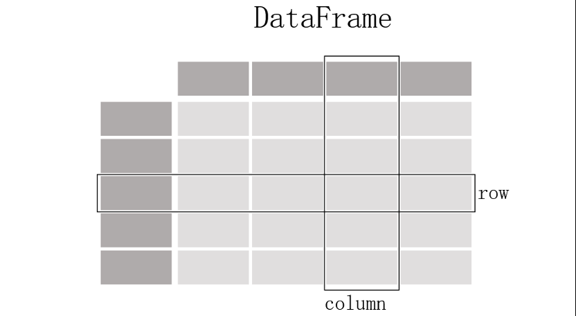
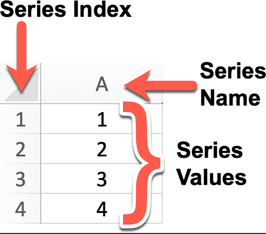
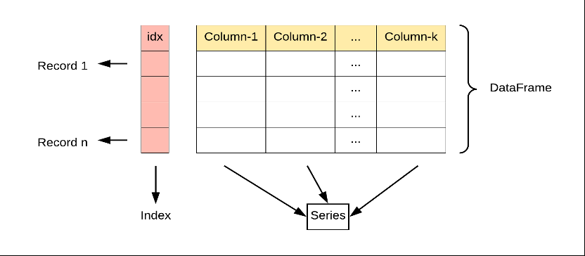
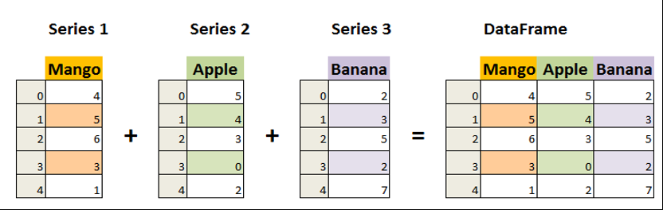

# Pandas 介绍

&emsp;&emsp;Pandas 是一个开源的数据分析和数据处理库，它是基于 Python 编程语言的。Pandas 提供了易于使用的数据结构和数据分析工具，特别适用于处理结构化数据，如表格型数据（类似于Excel表格）。Pandas 是数据科学和分析领域中常用的工具之一，它使得用户能够轻松地从各种数据源中导入数据，并对数据进行高效的操作和分析。用得最多的 Pandas 对象包括：

+ Series：一个一维的标签化数组对象


+ DataFrame：一个面向列的二维表结构


&emsp;&emsp;Pandas 兼具 Numpy 高性能的数组计算功能以及电子表格和关系型数据库（如SQL）灵活的数据处理功能。它提供了复杂精细的索引功能，能更加便捷地完成重塑、切片和切块、聚合以及选取数据子集等操作。主要包括：

+ 有标签轴的数据结构：在数据结构中，每个轴都被赋予了特定的标签，这些标签用于标识和引用轴上的数据元素，使得数据的组织、访问和操作更加直观和方便
+ 集成时间序列功能
+ 相同的数据结构用于处理时间序列数据和非时间序列数据
+ 保存元数据的算术运算和压缩
+ 灵活处理缺失数据
+ 合并和其它流行数据库（例如基于SQL的数据库）的关系操作

# Pandas数据结构 - Series

&emsp;&emsp;Series 是 Pandas 中的一个核心数据结构，类似于一个一维的数组，具有数据和索引。Series 可以存储任何数据类型（整数、浮点数、字符串等），并通过标签（索引）来访问元素。Series 的数据结构是非常有用的，因为它可以处理各种数据类型，同时保持了高效的数据操作能力，比如可以通过标签来快速访问和操作数据。



&emsp;&emsp;我们可以使用 Pandas 库来创建一个 Series 对象，并且可以为其指定索引（Index）、名称（Name）以及值（Values）。Series 的主要特点如下：

+ 一维数组：Series 中的每个元素都有一个对应的索引值
+ 索引： 每个数据元素都可以通过标签（索引）来访问，默认情况下索引是从 0 开始的整数，但你也可以自定义索引
+ 数据类型： Series 可以容纳不同数据类型的元素，包括整数、浮点数、字符串、Python 对象等
+ 大小不变性：Series 的大小在创建后是不变的，但可以通过某些操作（如 append 或 delete）来改变
+ 操作：Series 支持各种操作，如数学运算、统计分析、字符串处理等
+ 缺失数据：Series 可以包含缺失数据，Pandas 使用NaN（Not a Number）来表示缺失或无值
+ 自动对齐：当对多个 Series 进行运算时，Pandas 会自动根据索引对齐数据，这使得数据处理更加高效

## Series 的创建

&emsp;&emsp;使用 Pandas 之前需要执行安装的操作，可以通过下面的命令来安装：

```shell
conda install pandas
```

&emsp;&emsp首先可以直接通过列表来创建 Series：

```python
import pandas as pd  
  
s = pd.Series([1,2,3,4,5,6])  
# 0    1  
# 1    2  
# 2    3  
# 3    4  
# 4    5  
# 5    6  
# dtype: int64  
print(s)
```

&emsp;&emsp;Series 的字符串表现形式为：索引在左边，值在右边。由于我们没有为数据指定索引，于是会自动创建一个 0 到 N-1（N为数据的长度）的整数型索引。

&emsp;&emsp;在通过列表创建 Series 时可以指定索引：

```python
import pandas as pd  
  
s = pd.Series([1,2,3,4,5,6], index=['a','b','c','d','e','f'])  
# a    1  
# b    2  
# c    3  
# d    4  
# e    5  
# f    6  
# dtype: int64  
print(s)
```

&emsp;&emsp;通过列表创建 Series 时可以同时指定索引和名称：

```python
import pandas as pd  
  
s = pd.Series([1,2,3,4,5,6], index=['a','b','c','d','e','f'], name="Hello Pandas")  
# a    1  
# b    2  
# c    3  
# d    4  
# e    5  
# f    6  
# Name: Hello Pandas, dtype: int64  
print(s)
```

&emsp;&emsp;还可以直接通过字典创建 Series：

```python
import pandas as pd  
  
s = pd.Series({'a':1, 'b':2,'c':3})  
# a    1  
# b    2  
# c    3  
# dtype: int64  
print(s)  
s1 = pd.Series(s, index=['a','c'])  
# a    1  
# c    3  
# dtype: int64  
print(s1)
```

## Series 的常用属性

| **属性**         | **说明**        |
| -------------- | ------------- |
| index          | Series的索引对象   |
| values         | Series的值      |
| ndim           | Series的维度     |
| shape          | Series的形状     |
| size           | Series的元素个数   |
| dtype 或 dtypes | Series的元素类型   |
| name           | Series的名称     |
| loc\[\]        | 显式索引，按标签索引或切片 |
| iloc\[\]       | 隐式索引，按位置索引或切片 |
| at\[\]         | 使用标签访问单个元素    |
| iat\[\]        | 使用位置访问单个元素    |
```python
import pandas as pd  
  
s = pd.Series([11, 22, 33, 44, 55], name='test_arr', index=['a', 'b', 'c', 'd','e'])  
print(s.index) # Index(['a', 'b', 'c', 'd', 'e'], dtype='str')  
print(",".join(list(s.index))) # a,b,c,d,e  
print(s.values) # [11 22 33 44 55]  
print(s.ndim) # 1  
print(s.shape) # (5,)  
print(s.size) # 5  
print(s.dtype) # int64  
print(s.dtypes) # int64  
print(s.name) # test_arr  
print(s.loc['c']) # 33  
# c    33  
# d    44  
# Name: test_arr, dtype: int64  
print(s.loc['c': 'd'])  
print(s.iloc[0]) # 11  
# a    11  
# b    22  
# c    33  
# Name: test_arr, dtype: int64  
print(s.iloc[0: 3])  
print(s.at['a']) # 11  
print(s.iat[3]) # 44
```

## Series 的常用方法

| **方法**                    | **说明**                                                                                                                                                                                                                                            |
| ------------------------- | ------------------------------------------------------------------------------------------------------------------------------------------------------------------------------------------------------------------------------------------------- |
| head()                    | 查看前n行数据，默认5行                                                                                                                                                                                                                                      |
| tail()                    | 查看后n行数据，默认5行                                                                                                                                                                                                                                      |
| isin()                    | 元素是否包含在参数集合中                                                                                                                                                                                                                                      |
| isna()                    | 元素是否为缺失值（通常为 NaN 或 None）                                                                                                                                                                                                                          |
| sum()                     | 求和，会忽略 Series 中的缺失值                                                                                                                                                                                                                               |
| mean()                    | 平均值                                                                                                                                                                                                                                               |
| min()                     | 最小值                                                                                                                                                                                                                                               |
| max()                     | 最大值                                                                                                                                                                                                                                               |
| var()                     | 方差                                                                                                                                                                                                                                                |
| std()                     | 标准差                                                                                                                                                                                                                                               |
| median()                  | 中位数                                                                                                                                                                                                                                               |
| mode()                    | 众数（出现频率最高的值），如果有多个值出现的频率相同且都是最高频率，这些值都会被包含在返回的 Series 中                                                                                                                                                                                           |
| quantile(q,interpolation) | 指定位置的分位数<br>q的取值范围是 0 到 1 之间的浮点数或浮点数列表，如quantile(0.5)表示计算中位数（即第 50 百分位数）;<br>interpolation：指定在计算分位数时，如果分位数位置不在数据点上，采用的插值方法。默认值是线性插值 'linear'，还有其他可选值如 'lower'、'higher'、'midpoint'、'nearest' 等                                                     |
| describe()                | 常见统计信息                                                                                                                                                                                                                                            |
| value_count()             | 每个元素的个数                                                                                                                                                                                                                                           |
| count()                   | 非缺失值元素的个数，如果要包含缺失值，用len()                                                                                                                                                                                                                         |
| drop_duplicates()         | 去重                                                                                                                                                                                                                                                |
| unique()                  | 去重后的数组                                                                                                                                                                                                                                            |
| nunique()                 | 去重后元素个数                                                                                                                                                                                                                                           |
| sample()                  | 随机采样                                                                                                                                                                                                                                              |
| sort_index()              | 按索引排序                                                                                                                                                                                                                                             |
| sort_values()             | 按值排序                                                                                                                                                                                                                                              |
| replace()                 | 用指定值代替原有值                                                                                                                                                                                                                                         |
| to_frame()                | 将Series转换为DataFrame                                                                                                                                                                                                                               |
| equals()                  | 判断两个Series是否相同                                                                                                                                                                                                                                    |
| keys()                    | 返回Series的索引对象                                                                                                                                                                                                                                     |
| corr()                    | 计算与另一个Series的相关系数<br>默认使用皮尔逊相关系数（Pearson correlation coefficient）来计算相关性。要求参与比较的数组元素类型都是数值型。<br>当相关系数为 1 时，表示两个变量完全正相关，即一个变量增加，另一个变量也随之增加。<br>当相关系数为 -1 时，表示两个变量完全负相关，即一个变量增加，另一个变量随之减少。<br>当相关系数为 0 时，表示两个变量之间不存在线性相关性。<br>例如，分析某地区的气温和冰淇淋销量之间的关系 |
| cov()                     | 计算与另一个Series的协方差                                                                                                                                                                                                                                  |
| hist()                    | 绘制直方图，用于展示数据的分布情况。它将数据划分为若干个区间（也称为 “bins”），并统计每个区间内数据的频数。<br>需要安装matplotlib包                                                                                                                                                                      |
| items()                   | 获取索引名以及值                                                                                                                                                                                                                                          |
```python
import numpy as np  
import pandas as pd  
  
s = pd.Series([11, 22, np.nan, None, 44, 22], index=['a','b','c','d','e','f'])  
# 查看前n行数据，默认5行  
# a    11.0  
# b    22.0  
# c     NaN  
# d     NaN  
# e    44.0  
# dtype: float64  
print(s.head())  
# 查看后n行数据，默认5行  
# d     NaN  
# e    44.0  
# f    22.0  
# dtype: float64  
print(s.tail(3))  
# 判断数组中的每一个元素是否包含在参数集合中  
# a     True  
# b    False  
# c    False  
# d    False  
# e    False  
# f    False  
# dtype: bool  
print(s.isin([11]))  
# 元素是否为缺失值  
# a    False  
# b    False  
# c     True  
# d     True  
# e    False  
# f    False  
# dtype: bool  
print(s.isna())  
# 求和，会忽略 Series 中的缺失值  
print(s.sum()) # 99.0  
# 平均值  
print(s.mean()) # 24.75  
# 最小值  
print(s.min()) # 11.0  
# 最大值  
print(s.max()) # 44.0  
# 方差  
print(s.var()) # 191.58333333333334  
# 标准差  
print(s.std()) # 13.841363131329707  
# 中位数  
print(s.median()) # 22.0  
# 众数  
# 0    22.0  
# dtype: float64  
print(s.mode())  
# 指定位置的分位数  
print(s.quantile(0.25, interpolation='midpoint')) # 16.5  
# describe()    常见统计信息  
# count     4.000000  
# mean     24.750000  
# std      13.841363  
# min      11.000000  
# 25%      19.250000  
# 50%      22.000000  
# 75%      27.500000  
# max      44.000000  
# dtype: float64  
print(s.describe())  
# value_counts()    每个元素的个数  
# 22.0    2  
# 11.0    1  
# 44.0    1  
# Name: count, dtype: int64  
print(s.value_counts())  
# count()   非缺失值元素的个数  
print(s.count()) # 4  
print(len(s)) # 6  
# drop_duplicates() 去重  这里可以看出，底层None也作为NaN处理  
# a    11.0  
# b    22.0  
# c     NaN  
# e    44.0  
# dtype: float64  
print(s.drop_duplicates())  
# unique()  去重后的数组  
print(s.unique()) # [11. 22. nan 44.]  
# nunique() 去重后元素个数  
print(s.nunique()) # 3  
# sample()  随机采样  
# e    44.0  
# dtype: float64  
print(s.sample())  
# sort_index()  按索引排序  
# a    11.0  
# b    22.0  
# c     NaN  
# d     NaN  
# e    44.0  
# f    22.0  
# dtype: float64  
print(s.sort_index())  
# sort_values() 按值排序  
# a    11.0  
# b    22.0  
# f    22.0  
# e    44.0  
# c     NaN  
# d     NaN  
# dtype: float64  
print(s.sort_values())  
# replace() 用指定值代替原有值  
# a    11.0  
# b    haha  
# c     NaN  
# d     NaN  
# e    44.0  
# f    haha  
# dtype: object  
print(s.replace(22,"haha"))  
# to_frame()    将Series转换为DataFrame  
#       0  
# a  11.0  
# b  22.0  
# c   NaN  
# d   NaN  
# e  44.0  
# f  22.0  
print(s.to_frame())  
# keys()    返回Series的索引对象  
print(s.index) # Index(['a', 'b', 'c', 'd', 'e', 'f'], dtype='str')  
print(s.keys()) # Index(['a', 'b', 'c', 'd', 'e', 'f'], dtype='str')  
  
# equals()  判断两个Series是否相同  
arr1 = pd.Series([1,2,3])  
arr2 = pd.Series([1,2,3])  
print(arr1.equals(arr2)) # True  
# corr()    计算与另一个Series的相关系数  
arr3 = pd.Series([3,2,1])  
arr4 = pd.Series([6,7,8])  
arr5 = pd.Series([1, -1, 1, -1])  
arr6 = pd.Series([1, 1, -1, -1])  
print(arr1.corr(arr2)) # 1.0  
print(arr1.corr(arr3)) # -1.0  
print(arr1.corr(arr4)) # 1.0  
print(arr5.corr(arr6)) # 0.0  
# cov() 计算与另一个Series的协方差  
print(arr1.cov(arr3)) # -1.0  
  
# # hist()    绘制直方图  
arr7 = pd.Series([3,2,1,1,1,2,2])  
# # 绘制直方图  
# arr7.hist(bins=3)  
# items()   获取索引名以及值  
for i,v in arr7.items():  
    print(i,v)
```

## Series 的布尔索引

&emsp;&emsp;可以使用布尔索引从 Series 中筛选满足某些条件的值：

```python
import pandas as pd  
  
s = pd.Series({"a": -1.2, "b": 3.5, "c": 6.8, "d": 2.9})  
bools = s > s.mean() # 将大于平均值的元素标记为 True# a    False  
# b     True  
# c     True  
# d    False  
# dtype: bool  
print(bools)  
# b    3.5  
# c    6.8  
# dtype: float64  
print(s[bools])
```

## Series 的运算

&emsp;&emsp;当和标量运算的时候会与每个元素进行计算：

```python
import pandas as pd  
  
s = pd.Series({"a": -1.2, "b": 3.5, "c": 6.8, "d": 2.9})  
# a   -12.0  
# b    35.0  
# c    68.0  
# d    29.0  
# dtype: float64  
print(s * 10)
```

&emsp;&emsp;当与 Series 运算的时候会根据标签索引进行对位计算，索引没有匹配上的会用 NaN 填充：

```python
import pandas as pd  
  
s1 = pd.Series([1,1,1,1])  
s2 = pd.Series([2,2,2,2], index=[1, 2, 3, 4])  
# 0    NaN  
# 1    3.0  
# 2    3.0  
# 3    3.0  
# 4    NaN  
# dtype: float64  
print(s1 + s2)
```

# Pandas 数据结构 - DataFrame

&emsp;&emsp;DataFrame 是 Pandas 中的另一个核心数据结构，类似于一个二维的表格或数据库中的数据表。它是一个表格型的数据结构，它含有一组有序的列，每列可以是不同的值类型（数值、字符串、布尔型值），既有行索引也有列索引。



&emsp;&emsp;DataFrame 中的数据是以一个或多个二维块存放的（而不是列表、字典或别的一维数据结构）。它可以被看做由 Series 组成的字典（共同用一个索引）。提供了各种功能来进行数据访问、筛选、分割、合并、重塑、聚合以及转换等操作，广泛用于数据分析、清洗、转换、可视化等任务。



## DataFrame 的创建

&emsp;&emsp;可以直接通过字典创建 DataFrame：

```python
import pandas as pd  
  
df = pd.DataFrame({"id": [101, 102, 103],  
                   "name": ["张三", "李四", "王五"],  
                   "age": [20, 30, 40]})  
#     id name  age  
# 0  101   张三   20
# 1  102   李四   30
# 2  103   王五   40
print(df)
```

&emsp;&emsp;也可以通过字典创建时指定列的顺序和行索引：

```python
import pandas as pd  
  
df = pd.DataFrame(  
    data={"age": [20, 30, 40], "name": ["张三", "李四", "王五"]}, columns=["name", "age"], index=[101, 102, 103]  
)  
  
#         name  age  
# 101   张三   20
# 102   李四   30
# 103   王五   40
print(df)
```

## DataFrame 的常用属性

| **属性**  | **说明**          |
| ------- | --------------- |
| index   | DataFrame的行索引   |
| columns | DataFrame的列标签   |
| values  | DataFrame的值     |
| ndim    | DataFrame的维度    |
| shape   | DataFrame的形状    |
| size    | DataFrame的元素个数  |
| dtypes  | DataFrame的元素类型  |
| T       | 行列转置            |
| loc[]   | 显式索引，按行列标签索引或切片 |
| iloc[]  | 隐式索引，按行列位置索引或切片 |
| at[]    | 使用行列标签访问单个元素    |
| iat[]   | 使用行列位置访问单个元素    |
```python
import pandas as pd  
  
df = pd.DataFrame(  
    data={  
        "id": [101, 102, 103],  
        "name": ["张三", "李四", "王五"],  
        "age": [20, 30, 40]},  
    index=["aa", "bb", "cc"])  
  
# index DataFrame的行索引  
print(df.index) # Index(['aa', 'bb', 'cc'], dtype='str')  
# columns   DataFrame的列标签  
print(df.columns) # Index(['id', 'name', 'age'], dtype='str')  
# values    DataFrame的值  
# [[101 '张三' 20]  
#  [102 '李四' 30]  
#  [103 '王五' 40]]  
print(df.values)  
# ndim  DataFrame的维度  
print(df.ndim) # 2  
# shape DataFrame的形状  
print(df.shape) # (3, 3)  
# size  DataFrame的元素个数  
print(df.size) # 9  
# dtypes    DataFrame的元素类型  
# id      int64  
# name      str  
# age     int64  
# dtype: object  
print(df.dtypes)  
# T 行列转置  
#        aa   bb   cc  
# id    101  102  103  
# name   张三   李四   王五  
# age    20   30   40  
print(df.T)  
# loc[] 显式索引，按行列标签索引或切片  
#      id name  age  
# aa  101   张三   20# bb  102   李四   30# cc  103   王五   40print(df.loc["aa":"cc"])  
#      id name  
# aa  101   张三  
# bb  102   李四  
# cc  103   王五  
print(df.loc[:,["id","name"]])  
# iloc[]    隐式索引，按行列位置索引或切片  
#      id name  age  
# aa  101   张三   20print(df.iloc[0:1])  
# aa    20  
# bb    30  
# cc    40  
# Name: age, dtype: int64  
print(df.iloc[0:3,2])  
# at[]  使用行列标签访问单个元素  
print(df.at["aa","name"]) # 张三  
# iat[] 使用行列位置访问单个元素  
print(df.iat[0,1]) # 张三
```

## DataFrame 的常用方法

| **方法**            | **说明**                                                                                                                                                                                                     |
| ----------------- | ---------------------------------------------------------------------------------------------------------------------------------------------------------------------------------------------------------- |
| head()            | 查看前n行数据，默认5行                                                                                                                                                                                               |
| tail()            | 查看后n行数据，默认5行                                                                                                                                                                                               |
| isin()            | 元素是否包含在参数集合中                                                                                                                                                                                               |
| isna()            | 元素是否为缺失值                                                                                                                                                                                                   |
| sum()             | 求和                                                                                                                                                                                                         |
| mean()            | 平均值                                                                                                                                                                                                        |
| min()             | 最小值                                                                                                                                                                                                        |
| max()             | 最大值                                                                                                                                                                                                        |
| var()             | 方差                                                                                                                                                                                                         |
| std()             | 标准差                                                                                                                                                                                                        |
| median()          | 中位数                                                                                                                                                                                                        |
| mode()            | 众数                                                                                                                                                                                                         |
| quantile()        | 指定位置的分位数，如quantile(0.5)                                                                                                                                                                                    |
| describe()        | 常见统计信息                                                                                                                                                                                                     |
| info()            | 基本信息                                                                                                                                                                                                       |
| value_counts()    | 每个元素的个数                                                                                                                                                                                                    |
| count()           | 非空元素的个数                                                                                                                                                                                                    |
| drop_duplicates() | 去重                                                                                                                                                                                                         |
| sample()          | 随机采样                                                                                                                                                                                                       |
| replace()         | 用指定值代替原有值                                                                                                                                                                                                  |
| equals()          | 判断两个DataFrame是否相同                                                                                                                                                                                          |
| cummax()          | 累计最大值                                                                                                                                                                                                      |
| cummin()          | 累计最小值                                                                                                                                                                                                      |
| cumsum()          | 累计和                                                                                                                                                                                                        |
| cumprod()         | 累计积                                                                                                                                                                                                        |
| diff()            | 一阶差分，对序列中的元素进行差分运算，也就是用当前元素减去前一个元素得到差值，默认情况下，它会计算一阶差分，即相邻元素之间的差值。参数：<br><br>periods：整数，默认为 1。表示要向前或向后移动的周期数，用于计算差值。正数表示向前移动，负数表示向后移动。<br><br>axis：指定计算的轴方向。0 或 'index' 表示按列计算，1 或 'columns' 表示按行计算，默认值为 0。 |
| sort_index()      | 按行索引排序                                                                                                                                                                                                     |
| sort_values()     | 按某列的值排序，可传入列表来按多列排序，并通过ascending参数设置升序或降序                                                                                                                                                                  |
| nlargest()        | 返回某列最大的n条数据                                                                                                                                                                                                |
| nsmallest()       | 返回某列最小的n条数据                                                                                                                                                                                                |
&emsp;&emsp;在 Pandas 的 DataFrame 方法里，axis 是一个非常重要的参数，它用于指定操作的方向。axis 参数可以取两个主要的值，即 0 或 'index' 以及 1 或 'columns' ，具体含义如下：

+ axis=0 或 axis='index'：表示操作沿着行的方向进行，也就是对每一列的数据进行处理。例如，当计算每列的均值时，就是对每列中的所有行数据进行计算
+ axis=1 或 axis='columns'：表示操作沿着列的方向进行，也就是对每行的数据进行处理。例如，当计算每行的总和时，就是对每行中的所有列数据进行计算

```python
import pandas as pd  
  
df = pd.DataFrame(  
    data={  
        "id": [101, 102, 103,104,105,106,101],  
        "name": ["张三", "李四", "王五","赵六","冯七","周八","张三"],  
        "age": [10, 20, 30, 40, None, 60,10]},  
    index=["aa", "bb", "cc", "dd", "ee", "ff","aa"])  
# head()    查看前n行数据，默认5行  
#      id name   age  
# aa  101   张三  10.0
# bb  102   李四  20.0
# cc  103   王五  30.0
# dd  104   赵六  40.0
# ee  105   冯七   NaN
print(df.head())  
# tail()    查看后n行数据，默认5行  
#      id name   age  
# cc  103   王五  30.0
# dd  104   赵六  40.0
# ee  105   冯七   NaN
# ff  106   周八  60.0
# aa  101   张三  10.0
print(df.tail())  
# isin()    元素是否包含在参数集合中  
#        id   name    age  
# aa  False  False  False  
# bb  False  False  False  
# cc   True  False  False  
# dd  False  False  False  
# ee  False  False  False  
# ff   True  False  False  
# aa  False  False  False  
print(df.isin([103,106]))  
# isna()    元素是否为缺失值  
#        id   name    age  
# aa  False  False  False  
# bb  False  False  False  
# cc  False  False  False  
# dd  False  False  False  
# ee  False  False   True  
# ff  False  False  False  
# aa  False  False  False  
print(df.isna())  
# sum() 求和  
print(df["age"].sum()) # 170.0  
# mean()    平均值  
print(df["age"].mean()) # 28.333333333333332  
# min() 最小值  
print(df["age"].min()) # 10.0  
# max() 最大值  
print(df["age"].max()) # 60.0  
# var() 方差  
print(df["age"].var()) # 376.66666666666663  
# std() 标准差  
print(df["age"].std()) # 19.407902170679517  
# median()  中位数  
print(df["age"].median()) # 25.0  
# mode()    众数  
# 0    10.0  
# Name: age, dtype: float64  
print(df["age"].mode())  
# quantile()    指定位置的分位数，如quantile(0.5)  
print(df["age"].quantile(0.5)) # 25.0  
# describe()    常见统计信息  
#                id        age  
# count    7.000000   6.000000  
# mean   103.142857  28.333333  
# std      1.951800  19.407902  
# min    101.000000  10.000000  
# 25%    101.500000  12.500000  
# 50%    103.000000  25.000000  
# 75%    104.500000  37.500000  
# max    106.000000  60.000000  
print(df.describe())  
# info()    基本信息  
# <class 'pandas.DataFrame'>  
# Index: 7 entries, aa to aa  
# Data columns (total 3 columns):  
#  #   Column  Non-Null Count  Dtype  
# ---  ------  --------------  -----  
#  0   id      7 non-null      int64  
#  1   name    7 non-null      str  
#  2   age     6 non-null      float64  
# dtypes: float64(1), int64(1), str(1)  
# memory usage: 224.0+ bytes  
# None  
print(df.info())  
# value_counts()    每个元素的个数  
# id   name  age  
# 101  张三    10.0    2
# 102  李四    20.0    1
# 103  王五    30.0    1
# 104  赵六    40.0    1
# 106  周八    60.0    1
# Name: count, dtype: int64  
print(df.value_counts())  
# count()   非空元素的个数  
# id      7  
# name    7  
# age     6  
# dtype: int64  
print(df.count())  
# drop_duplicates() 去重  
# aa    False  
# bb    False  
# cc    False  
# dd    False  
# ee    False  
# ff    False  
# aa     True  
# dtype: bool  
print(df.duplicated(subset="age"))  
# sample()  随机采样  
#      id name   age  
# dd  104   赵六  40.0
print(df.sample())  
# replace() 用指定值代替原有值  
print("----------------")  
#      id name   age  
# aa  101   张三  10.0
# bb  102   李四  haha
# cc  103   王五  30.0
# dd  104   赵六  40.0
# ee  105   冯七   NaN
# ff  106   周八  60.0
# aa  101   张三  10.0
print(df.replace(20,"haha"))  
# equals()  判断两个DataFrame是否相同  
df1 = pd.DataFrame(data={"id": [101, 102, 103], "name": ["张三", "李四", "王五"], "age": [10, 20, 30]})  
df2 = pd.DataFrame(data={"id": [101, 102, 103], "name": ["张三", "李四", "王五"], "age": [10, 20, 30]})  
print(df1.equals(df2)) # True  
# cummax()  累计最大值  
df3 = pd.DataFrame({'A': [2, 5, 3, 7, 4],'B': [1, 6, 2, 8, 3]})  
# 按列  等价于 axis=0 默认  
#    A  B  
# 0  2  1  
# 1  5  6  
# 2  5  6  
# 3  7  8  
# 4  7  8  
print(df3.cummax(axis="index"))  
# 按行  等价于 axis=1#    A  B  
# 0  2  2  
# 1  5  6  
# 2  3  3  
# 3  7  8  
# 4  4  4  
print(df3.cummax(axis="columns"))  
# cummin()  累计最小值  
#    A  B  
# 0  2  1  
# 1  2  1  
# 2  2  1  
# 3  2  1  
# 4  2  1  
print(df3.cummin())  
# cumsum()  累计和  
#     A   B  
# 0   2   1  
# 1   7   7  
# 2  10   9  
# 3  17  17  
# 4  21  20  
print(df3.cumsum())  
# cumprod() 累计积  
#      A    B  
# 0    2    1  
# 1   10    6  
# 2   30   12  
# 3  210   96  
# 4  840  288  
print(df3.cumprod())  
# diff()    一阶差分  
#      A    B  
# 0  NaN  NaN  
# 1  3.0  5.0  
# 2 -2.0 -4.0  
# 3  4.0  6.0  
# 4 -3.0 -5.0  
print(df3.diff())  
# sort_index()  按行索引排序  
#      id name   age  
# aa  101   张三  10.0
# aa  101   张三  10.0
# bb  102   李四  20.0
# cc  103   王五  30.0
# dd  104   赵六  40.0
# ee  105   冯七   NaN
# ff  106   周八  60.0
print(df.sort_index())  
# sort_values() 按某列的值排序，可传入列表来按多列排序，并通过ascending参数设置升序或降序  
#      id name   age  
# aa  101   张三  10.0
# aa  101   张三  10.0
# bb  102   李四  20.0
# cc  103   王五  30.0
# dd  104   赵六  40.0
# ff  106   周八  60.0
# ee  105   冯七   NaN
print(df.sort_values(by="age"))  
# nlargest()    返回某列最大的n条数据  
#      id name   age  
# ff  106   周八  60.0
# dd  104   赵六  40.0
print(df.nlargest(n=2,columns="age"))  
# nsmallest()   返回某列最小的n条数据  
#      id name   age  
# aa  101   张三  10.0
print(df.nsmallest(n=1,columns="age"))
```

## DataFrame 的布尔索引

&emsp;&emsp;可以使用布尔索引从 DataFrame 中筛选满足某些条件的行：

```python
import pandas as pd  
  
df = pd.DataFrame(  
    data={"age": [20, 30, 40, 10], "name": ["张三", "李四", "王五", "赵六"]},  
    columns=["name", "age"],  
    index=[101, 104, 103, 102],  
)  
  
# 101    False  
# 104     True  
# 103     True  
# 102    False  
# Name: age, dtype: bool  
print(df["age"] > 25)  
  
#     name  age  
# 104   李四   30
# 103   王五   40
print(df[df["age"] > 25])
```

## DataFrame 的运算

<font color=orachid>**（一）DataFrame与标量运算**</font>

&emsp;&emsp;标量与每个元素进行计算：

```python
import pandas as pd  
  
df = pd.DataFrame(  
    data={"age": [20, 30, 40, 10], "name": ["张三", "李四", "王五", "赵六"]},  
    columns=["name", "age"],  
    index=[101, 104, 103, 102],  
)  
  
#      name  age  
# 101  张三张三   40
# 104  李四李四   60
# 103  王五王五   80
# 102  赵六赵六   20
print(df * 2)
```

<font color=orachid>**（二）DataFrame 与 DataFrame 运算**</font>

&emsp;&emsp;根据标签索引进行对位计算，索引没有匹配上的用 NaN 填充：

```python
import pandas as pd  
  
df1 = pd.DataFrame(  
    data={"age": [10, 20, 30, 40], "name": ["张三", "李四", "王五", "赵六"]},  
    columns=["name", "age"],  
    index=[101, 102, 103, 104],  
)  
  
df2 = pd.DataFrame(  
    data={"age": [10, 20, 30, 40], "name": ["张三", "李四", "王五", "田七"]},  
    columns=["name", "age"],  
    index=[102, 103, 104, 105],  
)  
  
#      name   age  
# 101   NaN   NaN  
# 102  李四张三  30.0
# 103  王五李四  50.0
# 104  赵六王五  70.0
# 105   NaN   NaN  
print(df1 + df2)
```

## DataFrame 的更改操作

<font color=orachid>**（一）设置行索引**</font>

&emsp;&emsp;创建 DataFrame 时如果不指定行索引，pandas 会自动添加从 0开始的索引：

```python
import pandas as pd  
  
df = pd.DataFrame({"age": [20, 30, 40, 10], "name": ["张三", "李四", "王五", "赵六"], "id": [101, 102, 103, 104]})  
  
#    age name   id  
# 0   20   张三  101
# 1   30   李四  102
# 2   40   王五  103
# 3   10   赵六  104
print(df)
```

&emsp;&emsp;也可以通过 `set_index()` 设置行索引：

```python
import pandas as pd  
  
df = pd.DataFrame({"age": [20, 30, 40, 10], "name": ["张三", "李四", "王五", "赵六"], "id": [101, 102, 103, 104]})  
df.set_index("id", inplace=True)  # 设置行索引    
#         age name  
# id  
# 101   20   张三  
# 102   30   李四  
# 103   40   王五  
# 104   10   赵六  
print(df)
```

&emsp;&emsp;通过 `reset_index()` 可以重置行索引：

```python
import pandas as pd  
  
df = pd.DataFrame({"age": [20, 30, 40, 10], "name": ["张三", "李四", "王五", "赵六"], "id": [101, 102, 103, 104]})  
df.set_index("id", inplace=True)  # 设置行索引  
df.reset_index(inplace=True)  # 重置索引  
#      id  age name  
# 0  101   20   张三  
# 1  102   30   李四  
# 2  103   40   王五  
# 3  104   10   赵六  
print(df)
```

<font color=orachid>**（二）修改索引名和列名**</font>

&emsp;&emsp;通过 `rename()` 修改行索引名和列名：

```python
import pandas as pd  
  
df = pd.DataFrame({"age": [20, 30, 40, 10], "name": ["张三", "李四", "王五", "赵六"], "id": [101, 102, 103, 104]})  
df.set_index("id", inplace=True)  
#      age name  
# id  
# 101   20   张三  
# 102   30   李四  
# 103   40   王五  
# 104   10   赵六  
print(df)  
df.rename(index={101: "一", 102: "二", 103: "三", 104: "四"}, columns={"age": "年龄", "name": "姓名"}, inplace=True)  
#     年龄  姓名  
# id  
# 一   20  张三  
# 二   30  李四  
# 三   40  王五  
# 四   10  赵六  
print(df)
```

&emsp;&emsp;将 index 和 columns 重新赋值：

```python
import pandas as pd  
  
df = pd.DataFrame({"age": [20, 30, 40, 10], "name": ["张三", "李四", "王五", "赵六"], "id": [101, 102, 103, 104]})  
df.set_index("id", inplace=True)  
df.index = ["Ⅰ", "Ⅱ", "Ⅲ", "Ⅳ"]  
df.columns = ["年齡", "名稱"]  
#    年齡  名稱  
# Ⅰ  20  张三  
# Ⅱ  30  李四  
# Ⅲ  40  王五  
# Ⅳ  10  赵六  
print(df)
```

<font color=orachid>**（三）添加列**</font>

&emsp;&emsp;通过 `df["列名"]` 添加列：

```python
import pandas as pd  
  
df = pd.DataFrame({"age": [20, 30, 40, 10], "name": ["张三", "李四", "王五", "赵六"], "id": [101, 102, 103, 104]})  
df["phone"] = ["13333333333", "14444444444", "15555555555", "16666666666"]  
#    age name   id        phone  
# 0   20   张三  101  13333333333
# 1   30   李四  102  14444444444
# 2   40   王五  103  15555555555
# 3   10   赵六  104  16666666666
print(df)
```

<font color=orachid>**（四）删除列**</font>

&emsp;&emsp;通过 `df.drop("列名", axis=1)` 删除，也可是删除行` axis=0`：

```python
import pandas as pd  
  
df = pd.DataFrame({"age": [20, 30, 40, 10], "name": ["张三", "李四", "王五", "赵六"], "id": [101, 102, 103, 104]})  
df["phone"] = ["13333333333", "14444444444", "15555555555", "16666666666"]  
df.drop("phone", axis=1, inplace=True)  # 删除phone，按列删除，inplace=True表示直接在原对象上修改  
#    age name   id  
# 0   20   张三  101
# 1   30   李四  102
# 2   40   王五  103
# 3   10   赵六  104
print(df)
```

&emsp;&emsp;通过 `del df["列名"]` 删除：

```python
import pandas as pd  
  
df = pd.DataFrame({"age": [20, 30, 40, 10], "name": ["张三", "李四", "王五", "赵六"], "id": [101, 102, 103, 104]})  
df["phone"] = ["13333333333", "14444444444", "15555555555", "16666666666"]  
del df["phone"]  
#    age name   id  
# 0   20   张三  101
# 1   30   李四  102
# 2   40   王五  103
# 3   10   赵六  104
print(df)
```

<font color=orachid>**（五）插入列**</font>

&emsp;&emsp;通过 `insert(loc, column, value)` 插入，该方法没有 `inplace` 参数，可直接在原数据上修改：

```python
import pandas as pd  
  
df = pd.DataFrame({"age": [20, 30, 40, 10], "name": ["张三", "李四", "王五", "赵六"], "id": [101, 102, 103, 104]})  
df.insert(loc=0, column="phone", value=df["age"] * df.index)  
#    phone  age name   id  
# 0      0   20   张三  101
# 1     30   30   李四  102
# 2     80   40   王五  103
# 3     30   10   赵六  104
print(df)
```

## DataFrame 数据的导入与导出

<font color=orachid>**（一）导出数据**</font>

| **方法**         | **说明**                                                                                                                                                   |
| -------------- | -------------------------------------------------------------------------------------------------------------------------------------------------------- |
| to_csv()       | 将数据保存为csv格式文件，数据之间以逗号分隔，可通过sep参数设置使用其他分隔符，可通过index参数设置是否保存行标签，可通过header参数设置是否保存列标签。                                                                      |
| to_pickle()    | 如要保存的对象是计算的中间结果，或者保存的对象以后会在Python中复用，可把对象保存为.pickle文件。如果保存成pickle文件，只能在python中使用。文件的扩展名可以是.p、.pkl、.pickle。                                               |
| to_excel()     | 保存为Excel文件，需安装openpyxl包。                                                                                                                                 |
| to_clipboard() | 保存到剪切板。                                                                                                                                                  |
| to_dict()      | 保存为字典。                                                                                                                                                   |
| to_hdf()       | 保存为HDF格式，需安装tables包。                                                                                                                                     |
| to_html()      | 保存为HTML格式，需安装lxml、html5lib、beautifulsoup4包。                                                                                                              |
| to_json()      | 保存为JSON格式。                                                                                                                                               |
| to_feather()   | feather是一种文件格式，用于存储二进制对象。feather对象也可以加载到R语言中使用。feather格式的主要优点是在Python和R语言之间的读写速度要比csv文件快。feather数据格式通常只用中间数据格式，用于Python和R之间传递数据，一般不用做保存最终数据。需安装pyarrow包。 |
| to_sql()       | 保存到数据库。                                                                                                                                                  |
```python
import os
import pandas as pd

os.makedirs("data", exist_ok=True)
df = pd.DataFrame({"age": [20, 30, 40, 10], "name": ["张三", "李四", "王五", "赵六"], "id": [101, 102, 103, 104]})
df.set_index("id", inplace=True)
df.to_csv("data/df.csv")
df.to_csv("data/df.tsv", sep="\t")  # 设置分隔符为 \t
df.to_csv("data/df_noindex.csv", index=False)  # index=False 不保存行索引
df.to_pickle("data/df.pkl")
df.to_excel("data/df.xlsx")
df.to_clipboard()
df_dict = df.to_dict()
df.to_hdf("data/df.h5", key="df")
df.to_html("data/df.html")
df.to_json("data/df.json")
df.to_feather("data/df.feather")
```

<font color=orachid>**（一）导入数据**</font>

| **方法**           | **说明**                                        |
| ---------------- | --------------------------------------------- |
| read_csv()       | 加载csv格式的数据。可通过sep参数指定分隔符，可通过index_col参数指定行索引。 |
| read_pickle()    | 加载pickle格式的数据。                                |
| read_excel()     | 加载Excel格式的数据。                                 |
| read_clipboard() | 加载剪切板中的数据。                                    |
| read_hdf()       | 加载HDF格式的数据。                                   |
| read_html()      | 加载HTML格式的数据。                                  |
| read_json()      | 加载JSON格式的数据。                                  |
| read_feather()   | 加载feather格式的数据。                               |
| read_sql()       | 加载数据库中的数据。                                    |
```python
df_csv = pd.read_csv("data/df.csv", index_col="id")  # 指定行索引
df_tsv = pd.read_csv("data/df.tsv", sep="\t")  # 指定分隔符
df_pkl = pd.read_pickle("data/df.pkl")
df_excel = pd.read_excel("data/df.xlsx", index_col="id")
df_clipboard = pd.read_clipboard(index_col="id")
df_from_dict = pd.DataFrame(df_dict)
df_hdf = pd.read_hdf("data/df.h5", key="df")
df_html = pd.read_html("data/df.html", index_col=0)[0]
df_json = pd.read_json("data/df.json")
df_feather = pd.read_feather("data/df.feather")

print(df_csv)
print(df_tsv)
print(df_pkl)
print(df_excel)
print(df_clipboard)
print(df_from_dict)
print(df_hdf)
print(df_html)
print(df_json)
print(df_feather)
```

# Pandas 日期数据处理

<font color=orachid>**to_datetime() 进行日期格式转换**</font>

&emsp;&emsp;关于参数的说明如下：

| **参数名**               | **说明**                                                                                                                                                                                                         |
| --------------------- | -------------------------------------------------------------------------------------------------------------------------------------------------------------------------------------------------------------- |
| arg                   | 要转换为日期时间的对象                                                                                                                                                                                                    |
| errors                | ignore,raise,coerce, 默认为ignore,表示无效的解析将会返回原值                                                                                                                                                                   |
| dayfirst              | 指定日期解析顺序。如果为True，则以日期开头解析日期，例如：“10/11/12”解析为2012-11-10。默认false                                                                                                                                                 |
| yearfirst             | 如果为True，则以日期开头解析，例如：“10/11/12”解析为2010-11-12。如果dayfirst和yearfirst都为True，则yearfirst在前面。默认false。当日期字符串格式不明确时，指定年份是否在最前面。当日期字符串是 '2010/1/4' 这种形式，由于年份是 4 位数字，pandas 能很清晰地识别出这是年份，所以即使 yearfirst 为 False，也不会影响其正确解析 |
| utc                   | 返回utc，即协调世界时间                                                                                                                                                                                                  |
| format                | 格式化显示时间的格式，字符串，默认值为None                                                                                                                                                                                        |
| exact                 | 要求格式完全匹配                                                                                                                                                                                                       |
| unit                  | 参数的单位表示时间的单位                                                                                                                                                                                                   |
| infer_datetime_format | 如果为True且未给出格式，则尝试基于第一个非nan元素推断datetime字符串的格式，如果可以推断，则切换到更快的解析方法。在某些情况下，这可以将解析速度提高5-10倍。                                                                                                                        |
| origin                | 默认值为unix,定义参考日期1970-01-01                                                                                                                                                                                      |
| cache                 | 使用唯一的已转换日期缓存来应用日期时间转换。在解析重复日期字符串时产生显著的加速。                                                                                                                                                                      |
&emsp;&emsp;将字符串字段转换为日期类型：

```python
import pandas as pd

df = pd.DataFrame({"gmv":[100,200,300,400],"trade_date":["2025-01-06","2023-10-31","2023-12-31","2023-01-05"]})
df["ymd"] = pd.to_datetime(df["trade_date"])
print(df)
```

<font color=orachid>**时间属性访问器对象 Series.dt，获取日期数据的年月日星期**</font>

&emsp;&emsp;获取年月日信息：

```python
import pandas as pd  
  
df = pd.DataFrame({"gmv":[100,200,300,400],"trade_date":["2025-01-06","2023-10-31","2023-12-31","2023-01-05"]})  
df["ymd"] = pd.to_datetime(df["trade_date"])  
df['yy'],df['mm'],df['dd']=df['ymd'].dt.year,df['ymd'].dt.month,df['ymd'].dt.day  
#    gmv  trade_date        ymd    yy  mm  dd  
# 0  100  2025-01-06 2025-01-06  2025   1   6  
# 1  200  2023-10-31 2023-10-31  2023  10  31  
# 2  300  2023-12-31 2023-12-31  2023  12  31  
# 3  400  2023-01-05 2023-01-05  2023   1   5  
print(df)
```

&emsp;&emsp;获取星期信息：

```python
import pandas as pd  
  
df = pd.DataFrame({"gmv":[100,200,300,400],"trade_date":["2025-01-06","2023-10-31","2023-12-31","2023-01-05"]})  
df["ymd"] = pd.to_datetime(df["trade_date"])  
df['week']=df['ymd'].dt.day_name()  
#    gmv  trade_date        ymd      week  
# 0  100  2025-01-06 2025-01-06    Monday  
# 1  200  2023-10-31 2023-10-31   Tuesday  
# 2  300  2023-12-31 2023-12-31    Sunday  
# 3  400  2023-01-05 2023-01-05  Thursday  
print(df)
```

&emsp;&emsp;获取日期所在季度：

```python
import pandas as pd  
  
df = pd.DataFrame({"gmv":[100,200,300,400],"trade_date":["2025-01-06","2023-10-31","2023-12-31","2023-01-05"]})  
df["ymd"] = pd.to_datetime(df["trade_date"])  
df['quarter']=df['ymd'].dt.quarter  
#    gmv  trade_date        ymd  quarter  
# 0  100  2025-01-06 2025-01-06        1  
# 1  200  2023-10-31 2023-10-31        4  
# 2  300  2023-12-31 2023-12-31        4  
# 3  400  2023-01-05 2023-01-05        1  
print(df)
```

&emsp;&emsp;判断日期是否月底或年度：

```python
import pandas as pd  
  
df = pd.DataFrame({"gmv":[100,200,300,400],"trade_date":["2025-01-06","2023-10-31","2023-12-31","2023-01-05"]})  
df["ymd"] = pd.to_datetime(df["trade_date"])  
df['mend']=df['ymd'].dt.is_month_end  
df['yend']=df['ymd'].dt.is_year_end  
print(df)
```

<font color=orachid>**to_period() 获取统计周期**</font>

&emsp;&emsp;`freq` 这是 `to_period()` 方法最重要的参数，用于指定要转换的时间周期频率，常见的取值如下：

+ "D"：按天周期，例如 2024-01-01 会转换为 2024-01-01 这个天的周期
+ "W"：按周周期，通常以周日作为一周的结束，比如日期落在某一周内，就会转换为该周的周期表示
+ "M"：按月周期，像 2024-05-15 会转换为 2024-05
+ "Q"：按季度周期，一年分为四个季度，日期会转换到对应的季度周期，例如 2024Q2 
+ "A" 或 "Y"：按年周期，如 2024-07-20 会转换为 2024 

```python
import pandas as pd  
  
df = pd.DataFrame({"gmv":[100,200,300,400],"trade_date":["2025-01-06","2023-10-31","2023-12-31","2023-01-05"]})  
df["ymd"] = pd.to_datetime(df["trade_date"])  
df["ystat"] = df["ymd"].dt.to_period("Y")  
df["mstat"] = df["ymd"].dt.to_period("M")  
df["qstat"] = df["ymd"].dt.to_period("Q")  
df["wstat"] = df["ymd"].dt.to_period("W")  
print(df)
```