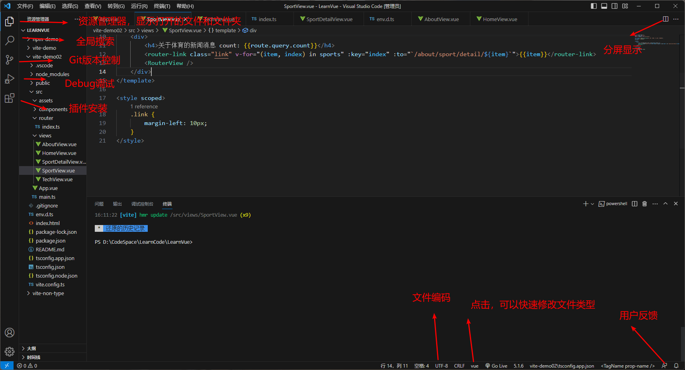
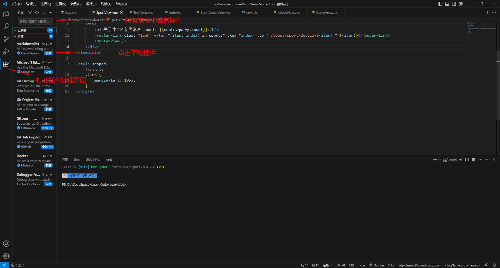
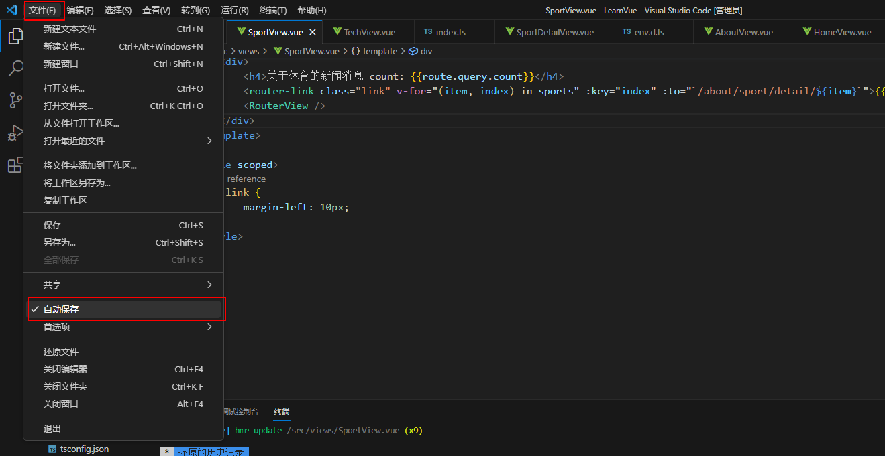
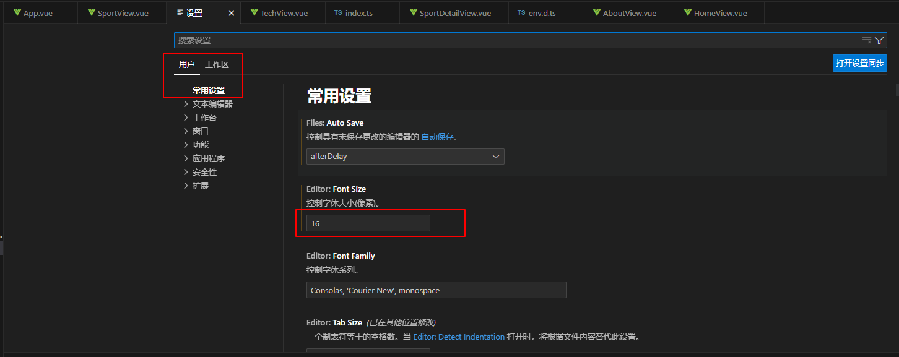

# 工具介绍

&emsp;&emsp;Visual Studio Code（简称 VS Code 、VSC）是一款免费、开源、跨平台的现代化轻量级代码编辑器，支持语法高亮、智能代码补全、自定义热键、括号匹配、代码片段、代码对比、`GIT` 等特性，并针对网页开发和云端应用开发做了优化。该软件可以跨平台，支持 Windows、Mac 以及 Linux 系统。它的优点总结如下：

+ 支持 30 多种常用语言的语法高亮，对 `html`、`js`、`css`、`Angular` 等有很好的语法支持，并且还支持 `MarkDown` 的预览
+ 体积小、功能强大、性能好，打开超大型的文本文件也不会卡死
+ 支持命令操作和鼠标操作，还有大量的快捷键，可以适应各种开发者的操作习惯
+ 支持 `Git` 版本控制器，可以完成创建分支、解决冲突、提交修改等操作
+ 强大的搜索功能，并且支持多文件搜索
+ 跨平台、免费

&emsp;&emsp;Vue 官网强烈推荐 Visual Studio Code，因为它对 `TypeScript` 有着很好的内置支持。

# 主要插件

&emsp;&emsp;Visual Studio Code 的安装只要从官网下载对应的版本，然后按照步骤一步步直到完成安装为止。

> **注意：** 
>
> + 安装路径中不要出现中文路径
> + 默认从官网下载可能会失败，可以修改域名为 `https://vscode.cdn.azure.cn`

&emsp;&emsp;安装完成后，可以看到 Visual Studio Code 的界面如下：

&emsp;&emsp;接下来就是安装插件，插件的按照方式如下图：

&emsp;&emsp;常用的插件见下表：

| 序号  |         插件名称          |                                                       插件说明                                                        |
| :-: | :-------------------: | :---------------------------------------------------------------------------------------------------------------: |
|  1  |    open in browser    |                                                浏览器插件，用于访问 HTML 页面                                                 |
|  2  |         volar         | 它提供了 `Vue` 单文件组件中的 `TypeScript` 支持， 有语法高亮、智能感知等特性（如果之前安装了 `Vue2` 的 插件 `Vetur`，一定要禁用） |
|  3  | TypeScript Vue Plugin |                            用于支持在 TS 中 ***import \*.vue*** 文件                             |
|  4  |    Auto Rename Tag    |                                                   自动完成另一侧的同步修改                                                    |
|  5  |   Path Intellisense   |                                                      自动路径补全                                                       |
|  6  |   HTML CSS Support    |                                   让 html 标签上写 class 智能提示当前项目所支持的样式， 安装后有快捷提示                                   |
|  7  | Element Plus Snippets |                                                 饿了么发布的 Vue 3 组件库                                                  |
|  8  | Chinese (Simplified)  |                                                        汉化                                                         |
|  9  |      Live Server      |                                                   以服务的方式启动前端项目                                                    |
| 10  | WindiCSS IntelliSense |                                                   WindiCSS 语法提示                                                   |
| 11  |   element-plus-doc    |                                        element-plus 的一个工具插件，用于智能提示、悬停显示文档等                                        |

# 常用设置

**（一）自动保存文件**

**（二）字体大小设置** 

&emsp;&emsp;打开 Settings（快捷键 ***ctrl + ,*** 或 ***command + ,***）：

# 常用快捷键

| 快捷键                                       | 作用                                                         |
| -------------------------------------------- | ------------------------------------------------------------ |
| Ctrl + Shit + F（Command + Shift + F）       | 会激活这个工具栏的全局搜索功能                               |
| Ctrl + F（Command + F）                      | 局部搜索，搜索当前文件中的内容                               |
| Ctrl + G（Control + G）                      | 输入行号可以跳转到指定的行                                   |
| ! + Tab                                      | 空白html文件里输入一个英文感叹号 ！ ，然后按 Tab 键会生成html模板页面 |
| 元素或属性名+Tab                             | 会自动生成                                                   |
| Shift + Alt + F（Option + Shift + F）        | 格式化代码                                                   |
| ctrl+/（Command + /）                        | 单行注释                                                     |
| shift+alt+A（Shift + Option + A）            | 多行注释                                                     |
| alt+up/down（option + up / down）            | 移动行                                                       |
| shift + alt +up/down（shift+option+up/down） | 复制当前行                                                   |
| ctrl + b（command + b）                      | 显示/隐藏左侧工具栏                                          |
| shift + ctrl + k（shift + command + k）      | 删除当前行                                                   |
| ctrl + x（command + x）                      | 剪切当前行或剪切选中内容                                     |
| ctrl + ~（control + ~）                      | 控制台终端显示与隐藏                                         |
| F2（选中文件 + Enter）                       | 重命名文件名                                                 |

