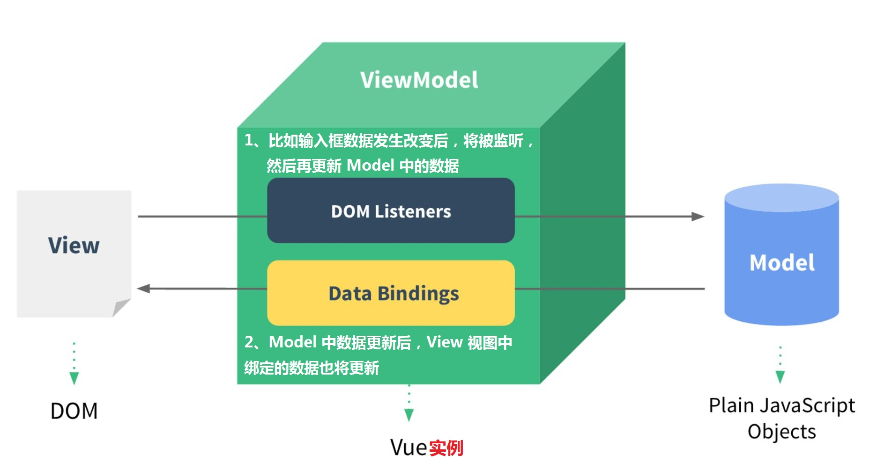
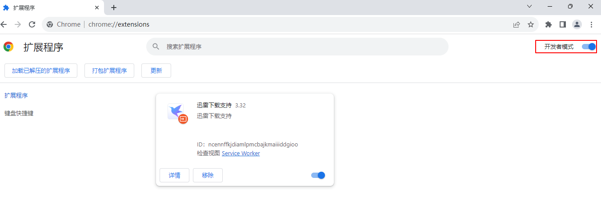
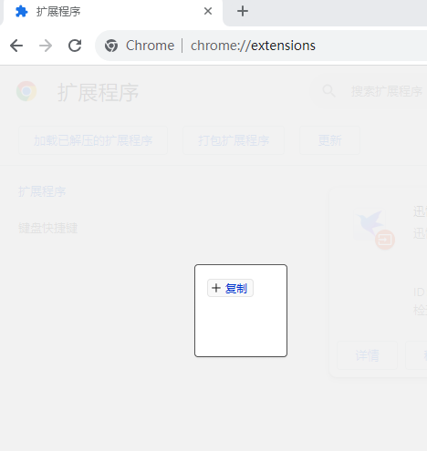
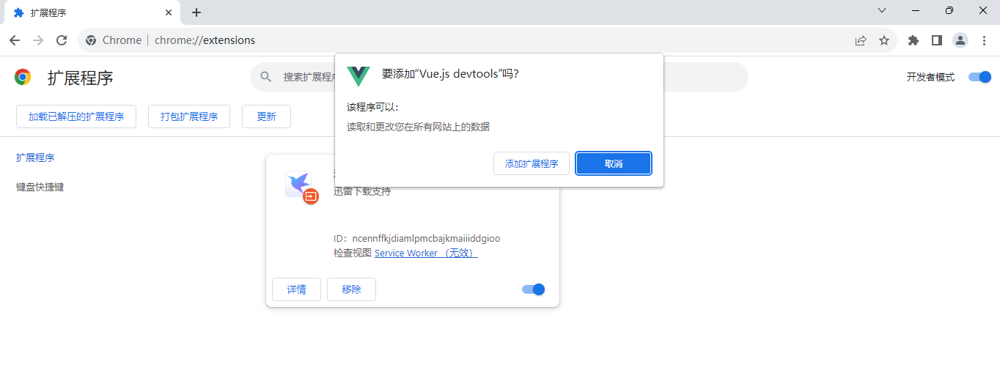
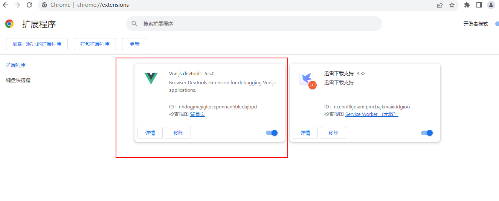
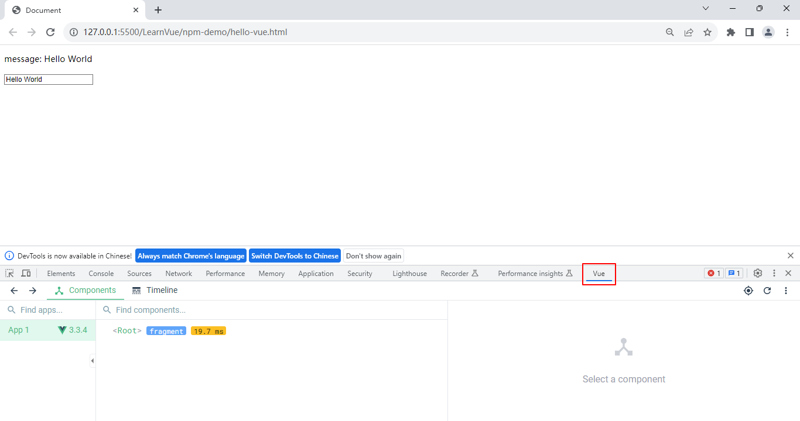
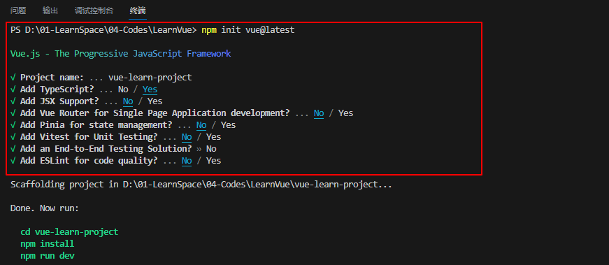
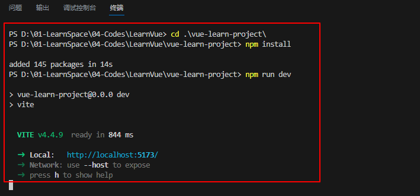
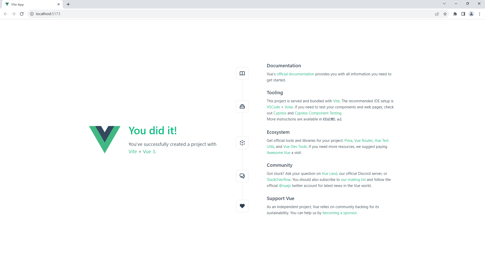
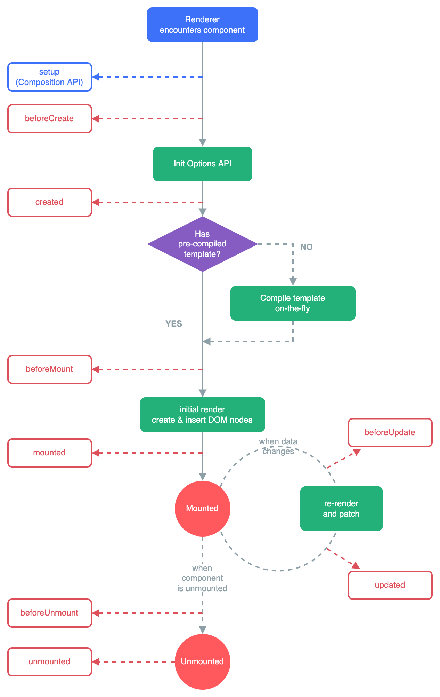

# Vue 介绍

## Vue 基础知识

<font color=orachid>**（一）了解 Vue 基础**</font>

&emsp;&emsp;`Vue` 是一款用于 <font color=red>**构建用户界面的 JavaScript 框架**</font>，它基于标准 `HTML`、`CSS` 和 `JavaScript` 构建，并提供了一套 <font color=red>**声明式的、组件化的编程模型**</font>，可以帮助高效地开发用户界面。无论是简单还是复杂的界面，`Vue` 都可以胜任。

```vue
<!DOCTYPE html>
<html lang="en">
<head>
    <meta charset="UTF-8">
    <meta name="viewport" content="width=device-width, initial-scale=1.0">
    <title>Document</title>
    <!-- 引入 Vue 功能 -->
    <script src="./node_modules/vue/dist/vue.global.js"></script>
</head>
<body>
    <div id="app">
        <button @click="handleClick">+1</button>
        <p>Count: {{Count}}</p>
    </div>

    <script>
        const content = {
            setup() {
                const Count = Vue.ref(0)
                const handleClick = () => {
                    Count.value++
                }

                return {Count, handleClick}
            }
        }

        const app = Vue.createApp(content).mount("#app")
    </script>    
</body>
</html>
```

&emsp;&emsp;上面的案例展示了 `Vue` 的两个核心功能：

+ <font color=orchid>**声明式渲染：**</font>`Vue` 基于标准 `HTML` 拓展了一套模板语法，使得我们可以声明式地描述最终输出的 `HTML` 和 `JavaScript` 状态之间的关系
+ <font color=orchid>**响应性：**</font>`Vue` 会自动跟踪 `JavaScript` 状态并在其发生变化的时候响应式地更新 `DOM`

&emsp;&emsp;`Vue` 是主流的 <font color=red>**渐进式 JavaScript 框架**</font>，所谓的渐进式就是说：

- 可以和传统的网站开发架构融合在一起，例如：可以简单地把它当作一个类似 `JQuery` 库来使用
- 也可以使用 `Vue` 全家桶框架来开发大型的单页面应用程序

&emsp;&emsp;使用 `Vue` 主要有以下优势：

- 体积小、编码简洁优雅、运行效率高、用户体验好
- 无 `DOM` 操作，它能提高网站应用程序的开发效率

&emsp;&emsp;`Vue` 的主要使用场景如下：

- 一般是需要开发单页面应用程序（`SPA`）的时候去用
- 因为 `Vue` 是渐进式的，`Vue` 其实可以融入到不同的项目中，即插即用

<font color=orachid>**（二）Vue 2 和 Vue 3 之间的区别**</font>

&emsp;&emsp;`Vue 2` 存在响应式弊端，随着 ES 2015 标准的发布，其中一些新特性为 `Vue` 的性能提供了机会（如：`Proxy`）。在 `Vue 2` 中，响应式的数据原理是通过 `Object.defineProperty` 这个 `API` 遍历用户传递的 `data` 对象属性，从而将其转为 `getter` 和 `setter`。这种方式存在三个问题：
+ 因为需要遍历 `data` 对象上所有属性，所以如果 `data` 对象的属性结构嵌套很深，那么就会存在性能问题
+ 因为需要遍历属性，所以需要提前知道对象上有哪些属性，才能将其转为 `getter` 和 `setter`。所以在  `Vue 2` 中无法将 `data` 新增的属性转为响应式，只能通过 `Vue` 提供的 `Vue.set` 或者 `this.$set` 向  `data` 中嵌套的对象新增响应式属性，而这种方式并不能添加根级别的响应式属性
+ 不能通过下标或者 `length` 属性响应式地改变数组，而是必须得用数组的方法 `push`、`pop`、`shift`、`unshift`、`splice` 来响应式地改变数组

&emsp;&emsp;在 `Vue 3` 中使用 `Proxy` 这个特性，很好地解决上述的三个问题。使用 `Proxy` 代替 `defineProperty` 实现响应式，重写虚拟 `DOM` 的实现和 `Tree-Shaking`（按需编译，体积更小）。

&emsp;&emsp;对比 `Vue 2` 和 `Vue 3` 的特点如下：

+ `Vue 3` 提供了更小的包体积、更好的性能、更好的可扩展性
+ 两个版本的兼容问题：大部分 `Vue 2` 的知识在 `Vue 3` 中可以继续使用；`Vue 3` 新增了一些 `Vue 2` 中没有的新特性
+ 对 Typescript 的支持：`Vue 2` 对于 Typescript 的支持不是很友好，`Vue 3` 源码就是使用 Typescript 编写的，所以天生就对 Typescript 友好支持
+ `Vue 2` 不支持 `IE8`，`Vue 3` 不支持 `IE11`

&emsp;&emsp;`Vue 3` 的新特性如下（部分）：

+ 单文件组件中的组合式 `API` 语法糖（`<script setup>`）
+ Composition `API` （组合式 `API`）：
  + `ref` 、 `reactive` 与 `computed`
  + `watch` 与 `watchEffect`
  + `provide` 与 `inject`
  + `defineProps`、 `defineEmits` 与 `defineExpose`
  + 等等......
+ 新的内置组件
  + `Fragments` 片段：组件模板中支持多根节点元素，在 `Vue 2` 中组件模板只能有一个根节点元素
  + `Teleport` 组件：瞬移组件的位置
  + `Suspense`：异步加载组件的 `loading` 界面
+ 其他
  + 新的生命周期钩子
  + `data` 选项应始终被声明为一个函数
  + 移除 `keyCode` 支持作为 `v-on` 的修饰符
  + 不建议使用 `mixin`，推荐使用组合式函数
  + ......等等

## 分析 MVVM 模型

&emsp;&emsp;`MVVM`（`Model-View-ViewModel`）是一种软件架构风格：

+ <font color=orchid>**Model（模型）：**</font>数据对象
+ <font color=orchid>**View（视图）：**</font>模板页面（用于渲染数据）
+ <font color=orchid>**ViewModel（视图模型）：**</font>其实本质上就是 Vue 实例



&emsp;&emsp;它的思想是 <font color=red>**通过数据驱动视图**</font>，把需要改变视图的数据初始化到 `Vue` 中，然后再通过修改 `Vue` 中的数据，从而实现对视图的更新。关于声明式编程和命令式编程：

+ <font color=orchid>**声明式编程：**</font>按照 `Vue` 的特定语法进行声明开发就可以实现对应功能，不需要我们直接操作 `Dom` 元素
+ <font color=orchid>**命令式编程：**</font>需要手动去操作 `Dom` 才能实现对应功能（如：`Jquery`）

# 开发入门

##  Vue Devtools 插件安装

&emsp;&emsp;`Vue Devtools` 插件让我们在一个更友好的界面中审查和调试 `Vue` 项目，使用谷歌浏览器访问：`chrome://extensions`，然后在右上角打开 <font color=red>**开发者模式**</font>：



&emsp;&emsp;然后将 <font color=brown>***vue-devtools.crx***</font> 文件拖放到任意空白处：



&emsp;&emsp;然后出现如下图的对话框，点击【添加扩展程序】：



&emsp;&emsp;如果出现如下界面，就表示安装成功了：



&emsp;&emsp;关闭浏览器，再次访问 `Vue` 开发的页面的时候，按 `F12` 就有 `Vue` 标签了：



> <font color=orange>**注意：**</font>要以服务的方式启动后，通过 ip、端口号访问页面，才有 Vue 标签。

## 使用 NPM 创建项目

&emsp;&emsp;首先在本地创建一个 <font color=brown>***vue-demo***</font> 目录并使用 <font color=green>***npm init -y***</font> 命令初始化项目，然后使用 <font color=green>***npm install vue***</font> 下载 `Vue` 到项目目录。接下来创建 <font color=brown>***index.html***</font> 文件编写代码，代码如下：

```html
<!DOCTYPE html>
<html lang="en">
<head>
    <meta charset="UTF-8">
    <title>Document</title>
    <script src="./node_modules/vue/dist/vue.global.js"></script>
</head>
<body>
    <div id="app">
        <p>message: {{message}}</p>
        <input type="text" v-model="message">
    </div>
    <script>
        
        const Content = {
            setup() {
                const message = Vue.ref("Hello World")
                return {message}
            }
        }

        const app = Vue.createApp(Content)
        app.mount("#app")
    </script>
</body>
</html>
```

&emsp;&emsp;关于代码的说明如下：

+ 采用 `<script> ` 标签引入 `Vue 3` 库
+ 定义一个根节点元素 `<div id="app">`
+ `vue.global.js` 中会暴露出全局对象 `Vue`，所有顶层 `API` 都以属性的形式暴露在了全局的 `Vue` 对象上
  + 从 Vue 对象中解构出 <font color=green>***createApp***</font> 函数，用于实例化 Vue 应用程序
  + 传入 `createApp` 的对象实际上是一个组件，每个应用都需要一个根组件，其它组件将作为其子组件
  + 应用实例必须在调用了 <font color=green>***mount()***</font> 方法后才会渲染出来，该方法接收一个容器参数，这个参数可以是一个实际的 <font color=red>**DOM 元素或是一个 CSS 选择器字符串**</font>

## 使用 Vite 创建项目

&emsp;&emsp;在大多数 `Vue` 项目中会使用一种类似 HTML 格式的文件来书写 `Vue` 组件，它被称为 <font color=red>**单文件组件（也被称为 *.vue 文件，英文 Single-File Components 缩写为 SFC）**</font>。`Vue` 的单文件组件会将一个组件的逻辑（`JavaScript`）、模板（`HTML`）和样式（`CSS`）封装在同一个文件里：

+ 每一个 `*.vue` 文件主要由三种顶层语言块构成： `<script>` 、`<template>` 和 `<style>`
+ 每个 `*.vue` 文件最多可以包含一个顶层 `<template>` 块
+ 每个 `*.vue` 文件最多可以包含一个 `<script>` 块
+ 每个 `*.vue` 文件最多可以包含一个 `<script setup>` 
+ 每个 `*.vue` 文件可以包含多个 `<style>` 标签，`scoped` 限制当前定义的样式只在当前组件有效

&emsp;&emsp;单文件组件的格式示例：

```vue
<script setup>
</script>

<template>
<div></div>
</template>

<style scoped>
</style>
```

&emsp;&emsp;使用 `SFC` 有以下优点：

+ 使用熟悉的 `HTML`、`CSS` 和 `JavaScript` 语法编写模块化的组件
+ 在使用组合式 `API` 时语法更简单
+ 让本来就强相关的关注点自然内聚
+ 预编译模板，避免运行时的编译开销
+ 组件作用域的 `CSS`
+ 通过交叉分析模板和逻辑代码能进行更多编译时优化
+ 更好的 `IDE` 支持，提供自动补全和对模板中表达式的类型检查
+ 开箱即用的模块热更新（`HMR`）支持

&emsp;&emsp;需要使用 `SFC` 必须使用构建工具，Vite 是 `Vue` 官方提供的 `Vue` 构建工具，是一种新型前端构建工具，内置了 `Vue` 项目脚手架，直接使用 Vite 可以很方便地构建 `Vue` 单页应用，能够显著提升前端开发体验。它主要由两部分组成：

+ <font color=orchid>**一个开发服务器：**</font>基于原生 ES 模块提供了丰富的内建功能（如：热更新）
+ <font color=orchid>**一套构建指令：**</font>使用 `Rollup` 打包代码，并且它是预配置的，可输出用于生产环境的高度优化过的静态资源

&emsp;&emsp;Vite 的优点如下：

+ 极速的服务启动，使用原生 `ESM` 文件，`esm` 标准通过 `import`、`export` 语法实现模块变量的导入和导出
+ 轻量快速的热重载，无论应用程序大小如何，都始终极快的模块热替换（`HMR`）
+ 对 `TypeScript`、`JSX`、`CSS` 等支持开箱即用
+ 灵活的 `API` 和完整的 `TypeScript` 类型

&emsp;&emsp;下面介绍使用 Vite 工具构建项目的过程（<font color=red>**确保安装了最新版本的 Node**</font>）：

+ 首先打开命令行窗口，在命令行窗口使用 <font color=green>***npm init vue@latest***</font> 命令来创建项目，该命令将会安装并执行 <font color=green>***create-vue***</font>，它是 `Vue` 官方的项目脚手架工具
+ 然后输入项目名称，接下来是关于 `TypeScript`、`VueRouter` 之类的可选功能提示（这里只选择 `TypeScript`）



+ 使用 <font color=green>***cd vite-demo01***</font> 命令进入到项目目录
+ 进入目录后使用 <font color=green>***npm install***</font> 命令下载依赖
+ 依赖下载完成后就可以使用 <font color=green>***npm run dev***</font> 命令启动项目



+ 启动服务后，按照显示的地址进行访问



> <font color=orange>**注意：**</font>在单文件组件中，组合式 `API` 通常会与 `<script setup>` 搭配使用，这个 setup 是一个标识，告诉 `Vue` 需要在编译时进行一些处理，这样就可以更简洁地使用组合式 `API`。

&emsp;&emsp;创建出来的目录结构如下：

```yaml
|-- .vscode: vscode工具相关配置
| |-- extensions.json
|-- node_modules: 存放下载依赖的文件夹
|-- public: 存放不会变动静态的文件，打包时不会被编译
| |-- favicon.ico: 在浏览器上显示的图标
|-- src: 源码文件夹
| |-- App.vue: 应用根主组件
| |-- main.ts: 应用入口JS文件
| |-- components: Vue 子组件及其相关资源文件夹
| |-- assets: 静态文件，会进行编译压缩，如css/js/图标等
|-- .gitignore: Git 版本管制忽略的配置
|-- env.d.ts: 针对环境变量配置，如：声明类型可类型检查&代码提示
(.env.development、.env.production）
|-- index.html: 主页面入口文件
|-- package-lock.json: 用于记录实际安装的各个包的具体来源和版本号等,其他人在 npm install 项目时大家的依赖能保证一致
|-- package.json: 项目基本信息,包依赖配置信息等
|-- README.md: 项目描述说明文件
|-- tsconfig.config.json: TypeScript 相关配置文件（在tsconfig.json中被引用了）
|-- tsconfig.json: TypeScript 相关配置文件
|-- vite.config.ts: vite 核心配置文件
```

&emsp;&emsp;如果 <font color=brown>***main.ts***</font> 中 <font color=red>**import App from './App.vue'**</font> 有红线，可以在 <font color=brown>***env.d.ts***</font> 文件中添加如下代码来解决：

```typescript
/// <reference types="vite/client" />
// 上面一行代码是通知`vite`这是一个`client`端声明文件
declare module '*.vue' {
    import { Component } from 'vue'
    const component: Component
    export default component
}
```

&emsp;&emsp;项目运行的流程分析如下：

+ `http://localhost:5173/` 请求到了项目根目录下的 <font color=brown>***index.html***</font> 页面
+ <font color=brown>***index.html***</font> 页面中指定了渲染出口，并引入了 <font color=brown>***/src/main.ts***</font> 文件

```html
<!--渲染出口-->
<div id="app"></div>
<script type="module" src="/src/main.ts"></script>
```

+ <font color=brown>***main.ts***</font> 入口文件代码
  + 通过 `Vue` 导出 `createApp` 方法用来创建一个应用实例
  + 导入应用根组件 <font color=brown>***App.vue***</font>
  + 挂载节点 `#app`
  + 最终将 <font color=brown>***App.vue***</font> 组件代码在 <font color=brown>***index.html***</font> 中的 `<div id="app">` 渲染出口 `<div>` 中进行渲染

```typescript
// 这个vue是小写的且用引号引起来
import { createApp } from 'vue'
// 导入应用根组件（目前可以简单理解就是大框框页面）
import App from './App.vue'
// 导出全局样式，样式在所有组件中有效
import './assets/main.css'
// 创建应用实例，并挂载节点 `#app` （index.html中的 `id="app"`)
createApp(App).mount('#app')
```

+ 最后将 <font color=brow>***App.vue***</font> 组件页面效果渲染到浏览器

# Vue 生命周期

## 生命周期说明

&emsp;&emsp;每个 `Vue` 组件实例在创建时都需要经历一系列的初始化步骤，在这些过程中会运行被称为 <font color=red>**生命周期钩子**</font> 的函数，让开发者有机会在特定阶段运行自己的代码。生命周期主要分为四大阶段：<font color=red>**初始化阶段、挂载阶段、更新阶段和销毁组件实例**</font>。

<font color=orachid>**（一）初始化阶段**</font>

| 选项式 API   | 组合式 API                      | 说明                                                         |
| ------------ | ------------------------------- | ------------------------------------------------------------ |
| beforeCreate | 不需要（直接写到 setup 函数中） | 会在实例初始化完成之后 和 `props` 解析之后，`data()` 和 `computed` 等选项处理之前立即调用。<br>`setup()` 最先被调用，钩子会在所有选项式 API 钩子之前调用，也就是在选项式 API 的 `beforeCreate()` 前面调用。 |
| created      | 不需要（直接写到 setup 函数中） | 当 created 钩子被调用时，会完成的设置有：响应式数据、计算属性、方法和监听器。 |

<font color=orachid>**（二）挂载阶段**</font>

| 选项式 API  | 组合式 API    | 说明                                                         |
| ----------- | ------------- | ------------------------------------------------------------ |
| beforeMount | onBeforeMount | 在组件被挂载之前调用。组件已经完成了其响应式状态的设置，但还没有创建 DOM 节点。 |
| mounted     | onMounted     | 在组件被挂载之后调用，数据和 DOM 都已被渲染出来。            |

<font color=orachid>**（三）更新阶段**</font>

| 选项式 API   | 组合式 API     | 说明                                                         |
| ------------ | -------------- | ------------------------------------------------------------ |
| beforeUpdate | onBeforeUpdate | 响应式状态修改，而更新其 DOM 树之前调用。                    |
| updated      | onUpdated      | 响应式状态修改，而更新其 DOM 树之后调用。不要在其中更改组件的状态，这可能会导致无限更新循环。 |

<font color=orachid>**（四）销毁阶段**</font>

| 选项式 API    | 组合式 API      | 说明                                                         |
| ------------- | --------------- | ------------------------------------------------------------ |
| beforeUnmount | onBeforeUnmount | 在一个组件实例被卸载之前调用。当这个钩子调用时，组件实例依然还保有全部的功能。 |
| unmounted     | onUnmounted     | 在一个组件实例被卸载之后调用，一个组件在以下情况下被视为已卸载：<br>1. 其所有子组件都已经被卸载<br>2. 所有相关的响应式作用（渲染作用以及 setup() 时创建的计算属性和监听器）都已经停止 |



## 生命周期使用案例

<font color=orachid>**（一）选项式 API**</font>

```vue
<script>
/**
* 选项式API：Vue 生命周期
*/
export default {
  data() {
    return {
      message: 'hello, Vue选项式生命钩子',
    }
  },
  beforeCreate() {
    // $el 该组件实例管理的 DOM 根节点，$el 到组件挂载完成 (mounted) 之前都会是空的
    console.log('beforeCreate()', this.$el, this.$data)
  },
  // 已初始化 data 数据，但数据未挂载到模板中
  created() {
    console.log('created()', this.$el, this.$data)
  },
  // 组件被挂载之前调用，已经完成了其响应式状态的设置，但还没有创建 DOM 节点
  beforeMount() {
    console.log('beforeMount()', this.$el, this.$data)
  },
  // 挂载完成，数据和DOM都已被渲染出来
  mounted() {
    console.log('mounted()', this.$el, this.$data)
  },
  // 响应式状态变更，更新 DOM 前调用
  beforeUpdate() {
    // 使用 this.$el.innerHTML 获取更新前的 Dom 模板数据
    console.log('beforeUpdate()', this.$el.innerHTML, this.$data)
  },
  // 响应式状态变更，更新 DOM 后调用
  updated() {
    // data 被 Vue 渲染之后的 Dom 数据模板
    console.log('updated()', this.$el.innerHTML, this.$data)
  },
  // 卸载组件实例前调用
  beforeUnmount() {
    console.log('beforeUnmount()')
  },
  // 卸载组件实例后调用
  unmounted() {
    console.log('unmounted()')
  }
}
</script>

<template>
  <div>
    <span>{{ message }}</span>
  </div>
</template>
```

<font color=orachid>**（二）组合式 API**</font>

```vue
<script setup>
/**
* 组件式API：Vue 生命周期
*/
import {
  ref, onBeforeMount, onMounted, onBeforeUpdate,
  onUpdated, onBeforeUnmount, onUnmounted
} from 'vue';
const message = ref('hello, Vue组合式生命钩子');
const divRef = ref();
// setup 替代选项式API的 beforCreate, created 生命钩子
console.log('setup', divRef.value);
// 组件被挂载之前调用，未创建DOM元素
onBeforeMount(() => {
  console.log('onBeforeMount', divRef.value);
});
// 组件被挂载之后调用，已完成数据和DOM渲染
onMounted(() => {
  console.log('onMounted', divRef.value);
});
// 响应式状态变更，更新 DOM 前调用
onBeforeUpdate(() => {
  console.log('onBeforeUpdate', divRef.value.innerHTML);
});
// 响应式状态变更，更新 DOM 后调用
onUpdated(() => {
  console.log('onUpdated', divRef.value.innerHTML);
});
// 卸载组件实例前调用
onBeforeUnmount(() => {
  console.log('onBeforeUnmount');
});
// 卸载组件实例后调用
onUnmounted(() => {
  console.log('onUnmounted');
});
</script>

<template>
  <div ref="divRef">
    <span>{{ message }}</span>
  </div>
</template>
```

## nextTick 

&emsp;&emsp;当你在 `Vue` 中更改响应式状态时，最终的 DOM 更新并不是同步生效的，而是由 `Vue` 将它们缓存在一个队列中，直到下一个 `tick` 才一起执行。这样是为了确保每个组件无论发生多少状态改变，都仅执行一次更新。使用 <font color=green>***nextTick()***</font> 可以在状态改变后立即使用，就是等待 DOM 更新完成后执行相关代码（类似于 updated 生命钩子更新后 DOM 操作）：

+ <font color=orchid>**选项式 API：**</font><font color=green>***nextTick()***</font> 函数绑定了组件实例上的，使用 <font color=green>***this.$nextTick()***</font> 传递一个回调函数作为参数

```vue
<!--
nextTick：等待DOM更新完成后，再执行相关代码
-->
<script>
import { nextTick } from 'vue';
export default {
  data() {
    return {
      count: 0,
    }
  },
  methods: {
    add() {
      this.count++;
      // DOM 未更新，0
      console.log('DOM 未更新', this.$refs.counterRef.innerHTML);
      this.$nextTick(() => {
        // DOM 已更新，1
        console.log('DOM 已更新', this.$refs.counterRef.innerHTML);
      });
    }
  }
}
</script>
```

+ <font color=orchid>**组合式API：**</font>向 <font color=green>***nextTick()***</font> 传递一个回调函数作为参数

```vue
<script setup lang="ts">
import { nextTick, ref } from 'vue';

const age = ref(100);
const ageRef = ref();

const sub = () => {
  age.value--;
  
  // DOM 未更新
  console.log("DOM 未更新", ageRef.value.innerHTML)

  // 传递回掉函数
  nextTick(() => {
    console.log("DOM 已更新", ageRef.value.innerHTML)
  })
}
</script>

<template>
  <div>
    <button ref="ageRef" @click="sub">{{ age }}</button>
  </div>
</template>

<style scoped>
</style>
```

+ 或者 <font color=green>***await***</font> 返回的 `Promise`

```vue
<script setup lang="ts">
import { nextTick, ref } from 'vue';

const age = ref(100);
const ageRef = ref();

const sub = async () => {
  age.value--;
  
  // DOM 未更新
  console.log("DOM 未更新", ageRef.value.innerHTML)

  await nextTick();
  console.log("DOM 已更新", ageRef.value.innerHTML)
}
</script>

<template>
  <div>
    <button ref="ageRef" @click="sub">{{ age }}</button>
  </div>
</template>

<style scoped>
</style>
```

