# 数据模板绑定

&emsp;&emsp;模板数据绑定渲染可生成动态的 HTML 页面，页面中使用嵌入 Vue 语法可动态生成：

- <font color=green>***{{xxx}}***</font> 双大括号文本绑定
- <font color=green>***v-xxx***</font> 以 `v-` 开头用于标签属性绑定，称为 <font color=red>指令</font>

## 双大括号语法

+ 格式：<font color=green>***{{ 表达式 }}***</font> 
+ 作用：
  + 使用在标签中，用于获取数据
  + 可以使用 JavaScript 表达式

```vue
<script setup lang="ts">
import { ref } from 'vue';

const message = ref("Hello World!")
const number = ref(100)
</script>

<template>
  <div>
    <!-- 双大括号语法 -->
    <!-- 1. 文本内容 -->
    <p>文本内容：{{message}}</p>
    <!-- 2. JS 表达式 -->
    <p>JS表达式：{{number / 10}}</p>
  </div>
</template>
```

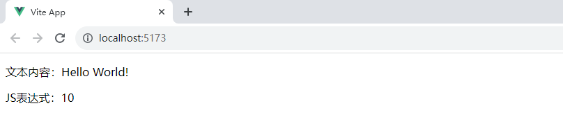

## 文本显示指令 v-text 和 v-cloak

&emsp;&emsp;<font color=green>***v-text***</font> 等价于 `{{}}` 用于显示内容，并且会覆盖元素中现有的内容。区别在于 <font color=red> {{}} 会有闪烁问题，v-text 不会闪烁</font> 。

> <font color=orange>**提示：**</font>`{{}}` 闪烁的原因是浏览器从上往下依次解析，会先把 `{{ message }}` 当作标签体直接先渲染, 然后 Vue 再进行解析 `{{ message }}` 变成了 message 的值。

```vue
<script setup lang="ts">
import { ref } from 'vue';

const message = ref("Hello World!")
</script>

<template>
  <div>
    <!-- v-text -->
    <p v-text="message"></p>
  </div>
</template>
```

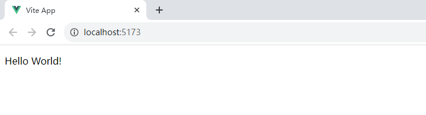

&emsp;&emsp;<font color=green>***v-cloak***</font> 用于隐藏尚未完成编译的 DOM 模板，<font color=red>默认一开始被 Vue 管理的模板是隐藏着的，当 Vue 解析处理完 DOM 模板之后，会自动把这个样式去除，然后再显示出来</font>。如果想用 `{{}}` 但又不想有闪烁问题，可以使用 `v-cloak` 来处理：

+ 添加一个属性选择器 `[v-cloak]` 的 `CSS` 隐藏样式：<font color=green>***[v-cloak] {display: none;}***</font>
+  在被 Vue 管理的模板入口节点上作用 `v-cloak` 指令（也可作用到子元素上）

```html
<!DOCTYPE html>
<html lang="zh-CN">
<head>
    <style>
        /*
        1. 定义样式：将带有 v-clock 指令的标签隐藏
        2. 在被 Vue 管理的模板入口节点上作用 v-cloak 指令(也可作用到子元素上)
        */
        [v-cloak] {
            display: none;
        }
    </style>
</head>
<body>
    <!-- 1.定义根节点元素，作用 v-cloak 指令 -->
    <div id="app" v-cloak>
        <h2>1、双大括号输出文本内容</h2>
        <p>普通文本：{{ name }}</p>
        <p>JS表达式1：{{ salary + 10 }}</p>
    </div>
    <!-- 2. 借助 script 标签引入 Vue 库 -->
    <script src="./node_modules/vue/dist/vue.global.js"></script>
    <script type="text/javascript">
        const { createApp } = Vue;
        // 创建应用实例
        const app = createApp({
            data() {
                return {
                    name: 'Jack',
                    salary: -100
                }
            }
        }).mount('#app');
    </script>
</body>
</html>
```

## 输出 HTML 指令

- 格式：<font color=green>***v-html = 'xxx'***</font>
- 作用：如果是 HTML 格式数据，双大括号会将数据解释为普通文本，为了输出真正的 HTML，需要使用 `v-html` 指令；<font color=red>Vue 为了防止 XSS 攻击，在此指令上做了安全处理，当发现输出内容有 script 标签时，则不渲染</font>

```vue
<script setup lang="ts">
import { ref } from 'vue';

const message = ref('<span style="color:red">红色字体内容<script>alert("hello vue")<\/script></span>');
</script>

<template>
  <div>
    <!-- 没有 v-html，原格式输出 -->
    <p style="color: red;">下面是没有使用 v-html：</p>
    <p>{{message}}</p>

    <!-- 使用 v-html -->
    <p style="color: red;">下面是使用 v-html：</p>
    <p v-html="message"></p>
  </div>
</template>
```

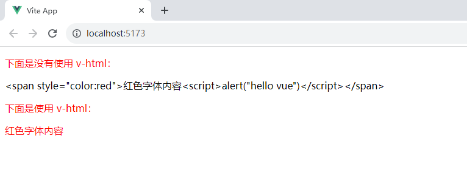

> <font color=orange>**提示：**</font>XSS 攻击主要是利用 JS 脚本注入到网页中，读取 Cookie 值（Cookie 一般存储了登录身份信息），读取到了发送到黑客服务器，从而黑客可以使用你的账户做非法操作。XSS 攻击还可以在你进入到支付时，跳转到钓鱼网站。

## 一次性插值

&emsp;&emsp;通过使用 <font color=green>***v-once***</font> 指令也可以执行一次性地插值，当数据改变的时候，插值处的内容不会发生更新：

```vue
<script setup lang="ts">
import { ref } from 'vue';

// 定义被操作的变量
const number = ref(10);

// 定义操作变量的事件函数
const handleAdd = () => {
  number.value++;
}

</script>

<template>
  <div>
    <!-- 没有 v-once，number会一直变化 -->
    <p>非 v-once：{{number}}</p>
    <!-- v-once，number初始化为10后，不再发生变化 -->
    <p v-once>v-once：{{number}}</p>
    <!-- 点击 +1 -->
    <button @click="handleAdd">+1</button>
  </div>
</template>
```

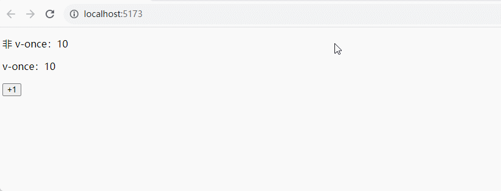

# 属性的动态绑定

## v-bind 的使用说明

- 完整格式：<font color=green>***v-bind:元素的属性名 = 'xxx'***</font>
- 缩写格式：<font color=green>***:元素的属性名 = 'xxx'***</font>
- 作用：将数据动态绑定到指定的元素上

```vue
<script setup lang="ts">
import { ref } from 'vue';

const url = ref("https://www.baidu.com")
</script>

<template>
  <div>
    <!-- 为 a 标签的 href 属性绑定百度的链接 -->
    <a :href="url">百度</a>
  </div>
</template>
```

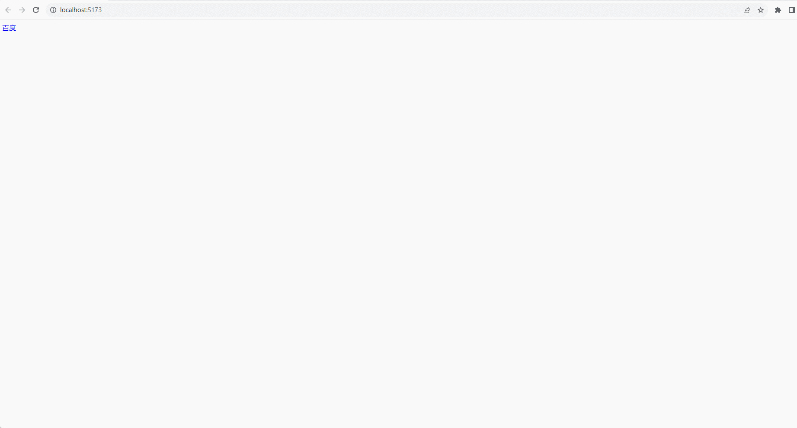

&emsp;&emsp;能够支持以对象的形式动态绑定多个属性值：

```vue
<script setup lang="ts">
import { reactive } from 'vue';

interface Attrs {
  id: string;
  class: string
}

const attrs = reactive<Attrs>({
  id: "red",
  class: "big"
})
</script>

<template>
  <div>
    <!-- 使用对象为 p 标签同时绑定多个属性 -->
    <p v-bind="attrs">这里有一段文字。</p>
  </div>
</template>

<style scoped>
#red {
  color: red;
}

.big {
  font-size: 100px;
}
</style>
```

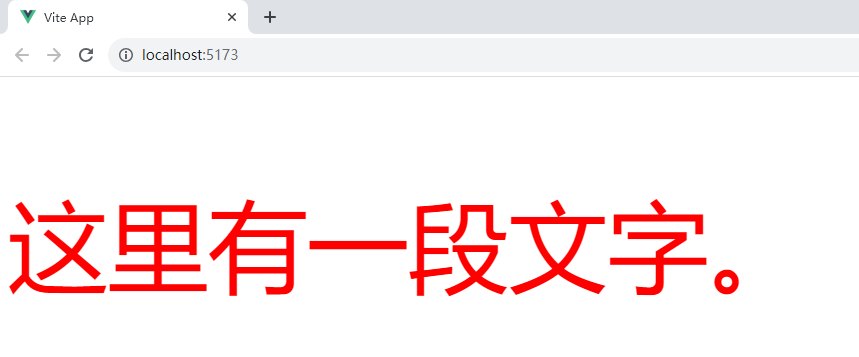

&emsp;&emsp;能够支持动态属性名：

```vue
<script setup lang="ts">
import { ref } from 'vue';

const url = ref("http://www.baidu.com")
const key = ref("href")
</script>

<template>
  <div>
    <a :[key]="url">百度</a>
  </div>
</template>
```

&emsp;&emsp;还可以使用修饰符：

+ <font color=orchid>**.camel：**</font> 可以将短横线命名的属性转变为驼峰式命名。由于 HTML 的特性是不区分大小写的，`.camel` 修饰符允许在使用 DOM 模板时将 `v-bind` 属性名称驼峰化：

```vue
<!--如果是 :viewBox="viewBoxData" 绑定数据这将导致渲染失败-->
<svg :view-box.camel="viewBoxData"></svg>
```

+ <font color=orchid>**.attr：**</font>强制绑定为 DOM 原生属性，如果子组件声明的 prop 属性和标签的原生属性名相同时可用于区分
+ <font color=orchid>**.prop：**</font>强制绑定为子组件的 prop 属性，如果子组件声明的 prop 属性和标签的原生属性名相同时可用于区分

## class 与 style 绑定

- class 绑定的语法格式：<font color=green>***v-bind:class='表达式'***</font> 或 <font color=green>***:class='表达式'***</font>，其中的表达式有以下几种：
  - 字符串：<font color=green>***:class='activeClass'`***</font>
  - 对象：<font color=green>***:class='{active:isActive, error:hasError}'`***</font>
  - 数组：<font color=green>***:class=['active', 'error']***</font>（<font color=red>需要加上单引号，否则是获取 data 中的值</font>）
- style 绑定的语法格式：<font color=green>***:style={color:activeColor, fontSize: fontSize+'px'}***</font>，`activeColor` 和 `fontSize` 为 `data` 中的属性

```vue
<script setup lang="ts">
import {ref} from 'vue'

const activeClass = ref<string>("active");
const isDelete = ref<boolean>(true);
const hasError = ref<boolean>(false);
const activeColor = ref<string>("red");
const fontSize = ref<number>(20);
</script>

<template>
  <div>
    <h2>绑定 class 属性</h2>
    <p :class="activeClass">字符串表达式</p>
    <p :class="{delete: isDelete, error: hasError}">对象表达式</p>
    <p :class="['delete', 'error']">数组表达式</p>
    <hr>
    <h2>绑定 style 属性</h2>
    <p :style="{color: activeColor, fontSize: fontSize + 'px'}">style 绑定方式</p>
  </div>
</template>

<style>
.active {
    color: green;
}
.delete {
    background-color: red;
}
.error {
    font-size: 30px;
}
</style>
```

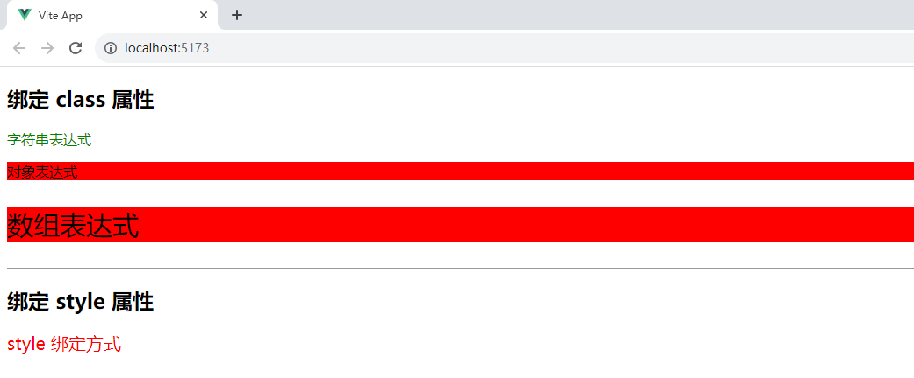

# 事件绑定指令

## 事件处理方法

&emsp;&emsp;<font color=red>v-on</font> 用于给元素绑定事件监听器（如点击事件 `onclick`、输入框失去事件 `onblur`等），当用于普通元素时，只监听原生 DOM 事件；当用于自定义元素组件，则监听子组件触发的自定义事件。

- 完整格式：<font color=green>***v-on:事件名='函数名'***</font> 或 <font color=green>***v-on:事件名=函数名(参数..)***</font>
- 缩写格式：<font color=green>***@事件名='函数名'***</font> 或  <font color=green>***@事件名=函数名(参数..)***</font>（<font color=red>@后面没有冒号</font>）
- `event`：函数中的默认行参，代表原生 DOM 事件；当调用的函数有多个参数传入的时候，需要使用原生的 DOM 事件，可以通过 <font color=green>***$event***</font> 作为实参传入
- 作用：用于监听 DOM 事件

```vue
<script setup lang="ts">

const handleError = (event: any) => {
  alert(event.target.innerHTML)
}

const handleWarn = (message: string, event: any) => {
  alert(message + ": " + event.target.innerHTML)
}
</script>

<template>
  <div>
    <button @click="handleError">错误</button>
    <button @click="handleWarn('Hello', $event)">警告</button>
  </div>
</template>
```

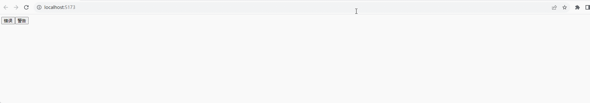

## 事件修饰符

- <font color=orchid>**.stop：**</font>阻止单击事件继续传播 <font color=green>***event.stopPropagation()***</font>
- <font color=orchid>**.prevent：**</font>阻止事件默认行为 <font color=green>***event.preventDefault()***</font>
- <font color=orchid>**.once：**</font>点击事件将只会触发一次
- <font color=orchid>**.passive：**</font>每次事件产生，浏览器都会去查询一下是否有 `preventDefault` 阻止该次事件的默认动作。我们加上 `passive` 就是为了告诉浏览器不用查询了，我们没用 `preventDefault` 阻止默认动作。这里一般用在滚动监听

```vue
<script setup lang="ts">

const handleClick = () => {
  alert("打印消息....")
}
</script>

<template>
  <div>
    <!-- a 的默认行为被阻止了，这里只弹框打印消息 -->
    <a href="https://www.baidu.com" @click.prevent="handleClick">百度</a>
  </div>
</template>
```

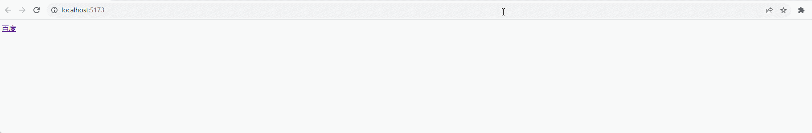

## 按键修饰符

- 格式：<font color=green>***v-on:keyup.按键名***</font> 或 <font color=green>***@keyup.按键名***</font>
- 常用按键名：`.enter`、`.tab`、`.delete`、`.esc`、`.space`、`.up`、`.down`、`.left`、`.right`
- 可以使用以下系统按键修饰符来触发鼠标或键盘事件监听器，只有当按键被按下时才会触发：`.ctrl`、`.alt`、`.shift`、`.meta`
- `.exact` 修饰符允许控制触发一个事件所需的确定组合的系统按键修饰符
- 鼠标按键修饰符：`.left`、`.right`、`.middle`

```vue
<script setup lang="ts">

const handleEnter = (event : any) => {
  alert(event.target.value)
}
</script>

<template>
  <div>
    <input type="text" @keyup.enter="handleEnter">
  </div>
</template>
```

# 表单数据双向绑定

&emsp;&emsp;双向绑定是指数据变的时候视图也相应改变；同时视图变的时候，数据也跟着改变。<font color=green>***v-model***</font> 指令用于表单数据的双向绑定，主要针对以下类型：<font color=red>text（文本）、textarea（多行文本）、radio（单选按钮）、checkbox（复选框）、select（下拉框）</font>：

```vue
<script setup lang="ts">
import {reactive, ref, toRefs} from 'vue'

interface Person {
  id: number;
  name: string;
}

interface Props  {
  textModel: string;
  textareamodel: string;
  gender: string;
  isAll: boolean;
  hab: Array<string>;
  persons: Array<Person>;
  person: Person | undefined;
}

const state: Props = reactive({
  textModel: "Hello world",
  textareamodel: "",
  gender: "male",
  isAll: false,
  hab: [],
  persons: [ {id: 1, name: 'John'}, {id: 2, name: 'Jack'}],
  person: undefined
})

const {textModel, textareamodel, gender, isAll, hab, persons,person} = {...toRefs(state)}

</script>

<template>
  <div>
    <h3>text文本</h3>
    <input type="text" v-model="textModel">
    <p>text的当前文本：{{textModel}}</p>

    <h3>多行文本</h3>
    <textarea v-model="textareamodel"></textarea>
    <p>{{ textareamodel }}</p>

    <h3>radio</h3>
    <input type="radio" v-model="gender" value="male">：男
    <input type="radio" v-model="gender" value="female">：女 
    <p>radio当前选择了：{{gender}}</p>

    <h3>checkbox</h3>
    <!-- 单个checkbox 可以绑定 boolean 对象 -->
    <input type="checkbox" v-model="isAll"> 全选 <br>
    <p>是否全选：{{isAll}}</p>

    <!-- 多个的时候可以绑定数组 -->
    <input type="checkbox" v-model="hab" value="football"> 足球
    <input type="checkbox" v-model="hab" value="basketball"> 篮球
    <p>checkbox选择了：{{hab}}</p>

    <h3>select</h3>
    <select v-model="person">
      <option v-for="(person,index) in persons" :value="person" :key="index">{{person.name}}</option>
    </select>
    <p>选择了：{{person}}</p>
  </div>
</template>
```

> <font color=orange>**常用表单控件修饰符**</font>
>
> - `.lazy` 失去焦点同步一次
> - `.number` 格式化数字
> - `.trim` 去除首尾空格

# 条件渲染

&emsp;&emsp;条件渲染涉及到的指令如下：

- <font color=orchid>**v-if：**</font>是否渲染当前元素，另外还提供了 `v-else`、`v-else-if` 指令，实现不同条件的渲染
- <font color=orchid>**v-show：**</font>与 `v-if` 类似，只是元素始终被渲染并保留在 DOM 中，只是简单切换元素的 CSS 属性 display 来显示或隐藏

```vue
<script setup lang="ts">
import {ref} from 'vue'
import type { Ref } from 'vue';

const isShow: Ref<boolean> = ref(true)
</script>

<template>
  <div>
    <p><input type="checkbox" v-model="isShow">是否显示</p>
    <p>v-if 实现</p>
    <div class="box" v-if="isShow"></div>
    <p>v-show 实现</p>
    <div class="box" v-show="isShow"></div>
  </div>
</template>

<style>
.box {
   width: 100px;
   height: 100px;
   background-color: red;
}
</style>
```

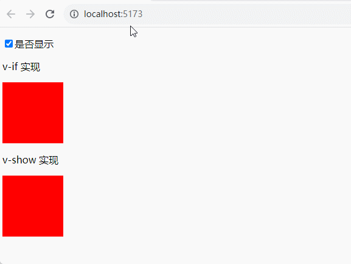

> <font color=orange>**多个元素的条件**</font>
>
> &emsp;&emsp;如果涉及到多个元素，可以使用  `<template>`，该元素是一个不可见的元素：`<template v-if="false">`包含的多个元素 `</template>`。在使用 `<template>` 包含多个元素的时候，使用 `v-if`，不能使用 `v-show`。
>
> <font color=orange>**v-if 和 v-show 比较**</font>
>
> - 什么时候元素被渲染
>   - `v-if`：如果初始条件为假，则什么也不做；每当条件为真时，都会重新渲染条件元素
>   - `v-show`： 不管初始条件是什么，元素总是会被渲染，并且只是简单地基于 `CSS` 进行切换
>
> - 使用场景选择
>   - `v-if` 有更高的切换开销
>   - `v-show` 有更高的初始渲染开销
>
>
> &emsp;&emsp;因此，如果需要非常频繁地切换，则使用 `v-show` 较好；如果在运行后条件很少改变，则使用 `v-if` 较好。
>
> <font color=orange>**v-if 和 v-for**</font>
>
> &emsp;&emsp; 当 `v-if` 和 `v-for` 同时存在于一个元素上的时候， `v-if` 会首先被执行，这意味着 `v-if` 的条件将无法访问到 `v-for` 作用域内定义的变量别名。
>
> + Vue 2 版本中在一个元素上同时使用 `v-if` 和 `v-for` 时， `v-for` 会优先作用
>
> + Vue 3 版本中 `v-if` 总是优先于 `v-for` 生效
>
> &emsp;&emsp;由于语法上存在歧义，建议避免在同一元素上同时使用两者。

# 列表渲染

## 迭代数组

&emsp;&emsp;可以使用 <font color=green>***v-for***</font> 来迭代数组，其语法如下：<font color=green>***v-for="(alias, index) in array"***</font>：

- <font color=orchid>**alias：**</font>数组元素迭代的别名
- <font color=orchid>**index：**</font>数组索引值，从 0 开始（<font color=red>可以省略</font>）

```vue
<script setup>
import {reactive} from 'vue'
const employees = reactive([
                        {id: 1, name: '张三', age: 12},
                        {id: 2, name: '李四', age: 22},
                        {id: 3, name: '王五', age: 32}
                    ]); 

</script>

<template>
  <div>
    <ul>
      <li v-for="(employee,index) in employees" :key="employee.id">
        {{index}}. {{employee.id}} - {{employee.name}} - {{employee.age}}
      </li>
    </ul>
  </div>
</template>
```

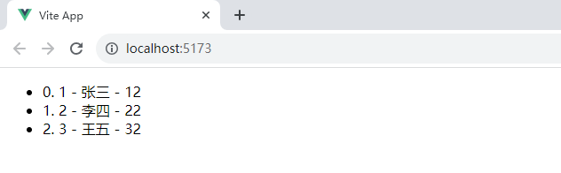

> <font color=orange>**注意**</font>
>
> - 使用 `key` 特殊属性， 它会基于 `key` 的变化重新排列元素顺序，并且会移除 `key` 不存在的元素，一般指定的 `key` 值是 `id` 值
> - 可以使用 `of` 替代 `in`
>
> <font color=orange>**关于数组更新检测**</font>
>
> - 使用以下方法操作数组，可以检测变动：`push`、`pop`、`shift`、`unshift`、`sort`、`reverse`、`splice()`
> - 使用以下方法需要用新数组替换旧数组：`filter`、`concat`、`slice`、`map`
> - <font color=red>Vue3 可以检测到类似下面的数据变动：array[1] =1;</font>

## 迭代对象

&emsp;&emsp;可以使用 `v-for` 来迭代对象，其语法如下：<font color=green>***v-for="(value, key, index) in object"***</font>：

- <font color=orchid>**value：**</font>每个对象的属性值
- <font color=orchid>**key：**</font>每个对象的属性名（<font color=red>可以省略</font>）
- <font color=orchid>**index：**</font>索引值（<font color=red>可以省略</font>）

```vue
<script setup lang="ts">
import {reactive} from 'vue'

interface Person {
  id: number;
  name: string;
  age: number;
}

const person = reactive<Person>({ 
                        id: 1,
                        name: 'John',
                        age: 12 
                    }); 
</script>

<template>
  <div>
    <ul>
      <li v-for="(value, key, index) in person" :key="index">
        {{key}} - {{value}}
      </li>
    </ul>
  </div>
</template>
```

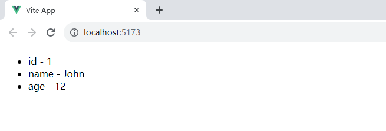

> <font color=orange>**注意：**</font>
>
> - 在遍历对象时是按 <font color=green>***Object.keys()***</font> 的结果遍历，不能保证它的结果在不同的 JavaScript 引擎下是顺序一致的
> - 可以使用 `of` 替代 `in`

# v-memo

&emsp;&emsp;<font color=green>***v-memo***</font> 是 Vue 3.2+ 版本新增的指令，它的值为数组，用于缓存一个节点及子节点，在元素和组件上都可以使用，只作性能的提升。

+ 该指令需要传入一个固定长度的依赖值数组进行比较，如果数组里的每个值都与最后一次的渲染相同，那么整个子节点的更新将被跳过
+ `v-memo` 中依赖的值若不发生变化，当前 DOM 及整个子树 DOM 都不会重新渲染，直接使用最后一次缓存的结果，它存储先前渲染的结果以加速未来的渲染

```vue
<script setup lang="ts">
import { nextTick, ref } from 'vue';

const count = ref(1)
const valueA = ref(88)
const valueB = ref(99)

const handleUpdate = async () => {
  count.value++
  valueA.value = 188
  await nextTick()
  console.log(count.value);
}
</script>

<template>
   <div v-memo="[valueA, valueB]">
    <p>count: {{count}}</p>
    <button @click="handleUpdate">更新数据</button>
   </div>
</template>
```


+ `v-memo` 传入空依赖数组（`v-memo="[]"`）与 `v-once` 的效果相同，一次性插值

```vue
<script setup lang="ts">
import { nextTick, ref } from 'vue';

const count = ref(1)

const handleUpdate = async () => {
  count.value++
  await nextTick()
  console.log(count.value);
}
</script>

<template>
   <div v-memo="[]">
    <p>count: {{count}}</p>
    <button @click="handleUpdate">更新数据</button>
   </div>
</template>
```

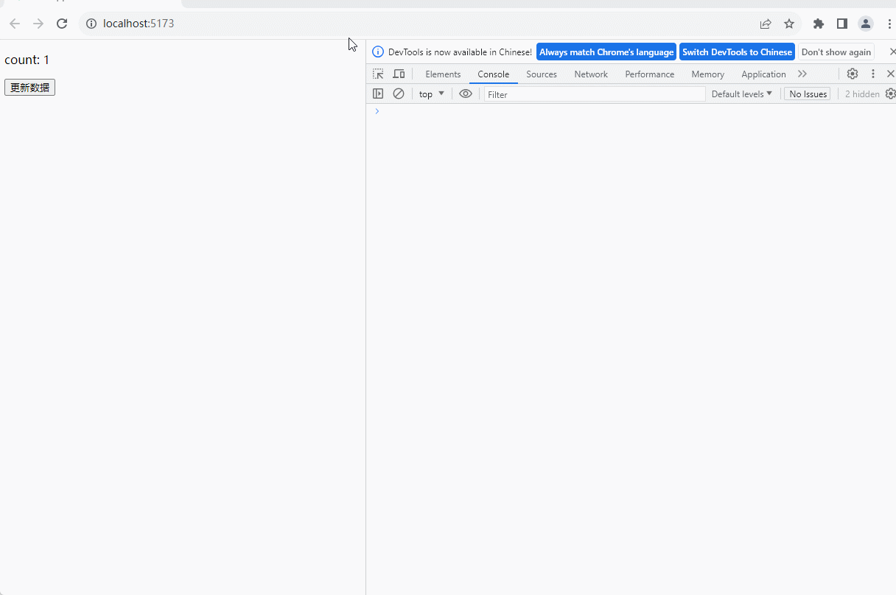

+ `v-for` 中使用 `v-memo` 时，两者都要绑定在同一个元素上，`v-memo` 不能用在 `v-for` 内部

```vue
<script setup lang="ts">
import { nextTick, ref } from 'vue';

interface emp {
  id: number;
  name: string;
  status: boolean;
}

const emps = ref<Array<emp>>([]);

emps.value = Array.from({ length: 200 }, (_, index) => {
  return { id: index, name: "emp" + index, status: true }
})


const updateStatus = (item: any) => {
  const {id, status} = item
  emps.value = Array.from({ length: 200 }, (_, index) => {
    const newStatus = index == id ? !item : true
    console.log(newStatus)
    return { id: index, name: "emp" + index, status: newStatus }
  })
  console.time()
  nextTick(() => {
    console.timeEnd()
  })
}
</script>

<template>
  <div>
    <li v-for="(item, index) in emps" :key="item.id" v-memo="[item.status]">
      <span>{{ item.name }}</span> &nbsp;
      <span>{{ item.status }}</span> &nbsp;
      <button @click="updateStatus(item)">更新状态</button>
    </li>
  </div>
</template>
```

# 计算属性

&emsp;&emsp;模板中的表达式虽然方便，但也只能用来做简单的操作，对于复杂逻辑推荐使用计算属性来描述：

```vue
<script setup lang="ts">
import { computed, ref } from 'vue'

const engScore = ref(100)
const mathScore = ref(100)

const total = computed(() => {
   return (engScore.value - 0) + (mathScore.value - 0)
})
</script>

<template>
   <div>
      <p>数学分数：<input type="text" v-model="mathScore"></p>
      <p>英语分数：<input type="text" v-model="engScore"></p>
      <p>总分：{{total}}</p>
   </div>
</template>
```

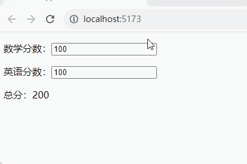

&emsp;&emsp;案例中定义了一个计算属性 `total`，<font color=green>***computed()***</font> 方法期望接收一个 <font color=green>***getter***</font> 函数，返回值为一个计算属性 `ref`，可以通过 <font color=green>***total.value***</font> 访问计算结果。计算属性 `ref` 也会在模板中自动解包，因此在模板表达式中引用时无需添加 `.value`。`Vue` 的计算属性会自动追踪响应式依赖。它会检测到 `total` 依赖于 `engScore` 和 `mathScore`，所以当它们改变时，任何依赖于 `total` 的绑定都会同时更新。

> <font color=orange>**计算属性 VS 方法**</font>
>
> &emsp;&emsp;调用一个函数也会获得和计算属性相同的结果，不同之处在于计算属性值会基于其响应式依赖被缓存，一个计算属性仅会在其响应式依赖更新时才重新计算。

&emsp;&emsp;计算属性默认是只读的，当尝试修改一个计算属性时会收到一个运行时警告。只有在某些特殊场景中才需要用到可写的属性，可以通过同时提供 <font color=green>***getter***</font> 和 <font color=green>***setter***</font> 来创建：

```vue
<script setup>
import { computed, ref } from 'vue'

const engScore = ref(100)
const mathScore = ref(100)

const total = computed({
   get () {
      return (engScore.value - 0) + (mathScore.value - 0)
   },
   set (newValue) {
      engScore.value = (newValue - 0) / 2
      mathScore.value = (newValue - 0) / 2
   }
})
</script>

<template>
   <div>
      <p>数学分数：<input type="text" v-model="mathScore"></p>
      <p>英语分数：<input type="text" v-model="engScore"></p>
      <p>总分：<input type="text" v-model="total"></p>
   </div>
</template>
```

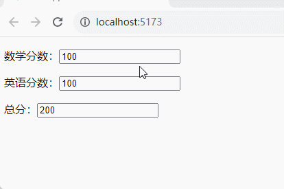

> <font color=orange>**提示：**</font>
>
> - `Getter` 不应有副作用：`getter` 的职责应该仅为计算和返回该值，不要在 `getter` 中做类似异步请求或更改 `DOM` 的操作
> - 避免直接修改计算属性值：从计算属性返回的值是派生状态，可以把它看作是一个临时快照，每当源状态发生变化时，就会创建一个新的快照，因此计算属性的返回值应该被视为只读的

# 监听器

&emsp;&emsp;有些情况下需要在状态变化时执行一些副作用，在组合式 `API` 中可以使用 <font color=green>***watch***</font> 函数在每次响应式状态发生变化时触发回调函数，它的第一个参数可以是不同形式的数据源，可以是 <font color=red>一个 ref（包括计算属性）、一个响应式对象、一个 getter 函数或多个数据源组成的数组</font>：

```vue
<script setup>
import {ref, reactive, watch} from 'vue'

// 定义变量
const x = ref(0)
const y = ref(0)

// 定义一个响应式对象
const obj = reactive({
  name : "Tom"
})

// 监听变量
watch(x, (newValue) => {
  console.log(`watch x : ${x.value}`)
})

// 监听数组
watch([x, y], ([newX, newY]) => {
  console.log(`watch [x, y] x: ${x.value}, y: ${y.value}`)
})

// 监听对象
watch(obj, (newObj) => {
  console.log('监听对象')
})

const handleNumber = () => {
  x.value++
  y.value++
}

const handleObj = () => {
  obj.value = {}
}
</script>

<template>
   <div>
      <button @click="handleNumber">changeNumber</button>
      <button @click="handleObj">changeObj</button>
   </div>
</template>
```

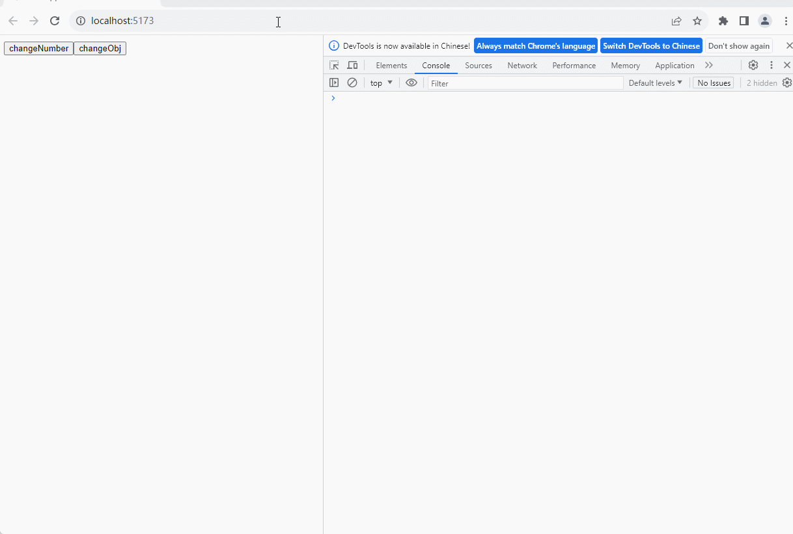

&emsp;&emsp;不能直接侦听响应式对象的属性值，这里需要用一个返回该属性的 `getter` 函数：

```vue
<script setup lang="ts">
import {reactive, watch} from 'vue'

const obj = reactive({
  name : "Tom"
})

watch(
  () => obj.name, (newValue) => {
    console.log(`name is ${newValue}`)
  }
)

const handleObj = () => {
  obj.name = "Jack"
}

</script>

<template>
  <div>
    <p>{{obj.name}}</p>
    <button @click="handleObj">changeObj</button>
  </div>
</template>
```


&emsp;&emsp;也可以给上面这个例子显式地加上 <font color=green>***deep***</font> 选项，强制转成深层侦听器。但深度侦听需要遍历被侦听对象中的所有嵌套的属性，当用于大型数据结构时开销很大，因此只在必要时才使用它，并且要留意性能：

```vue
<script setup>
import {reactive, watch} from 'vue'

const obj = reactive({
  name : "Tom"
})

watch(
  obj, 
  (newValue) => {
    console.log(`name is ${newValue.name}`)
  },
  {
    deep: true
  }
)

const handleObj = () => {
  obj.name = "Jack"
}

</script>

<template>
  <div>
    <p>{{obj.name}}</p>
    <button @click="handleObj">changeObj</button>
  </div>
</template>
```

&emsp;&emsp;watch 默认是懒执行的，仅当数据源变化时才会执行回调。但在某些场景中希望在创建侦听器时立即执行一遍回调，可以通过传入 <font color=green>***immediate: true***</font> 选项来强制侦听器的回调立即执行：

```javascript
watch(
  source, 
  (newValue, oldValue) => {
 
	}, 
  { immediate: true }
)
```

&emsp;&emsp;当你更改了响应式状态，它可能会同时触发监听器回调和 Vue 组件更新。默认情况下监听器回调都会在 Vue 组件更新之前被调用。这意味着在监听器回调中访问的 DOM 将是被 Vue 更新之前的状态。如果想在监听器回调中能访问被 Vue 更新之后的 DOM，需要指明 `flush: 'post'` 选项（默认`flush:'pre'`)：

```vue
<script setup lang="ts">
import { reactive, ref, watch } from 'vue';

const query = reactive({
    username: '12'
})

const spanRef =  ref();

const handleClick = () => {
    query.username = "Jack"
}

watch(query, (newValue, oldValue) => {
    console.log('spanRef', spanRef.value.innerHTML)
    console.log('深度监听对象query', newValue, oldValue);
}, {
    deep: true,
    flush: 'pre'
})

</script>

<template>
    <!-- ref 是一个特殊的属性，类型元素上的id属性，通过ref值直接引用操作此 DOM 元素或组件 -->
    <span ref="spanRef">显示：{{ query.username }}</span>
    <button @click="handleClick">click</button>
</template>
```

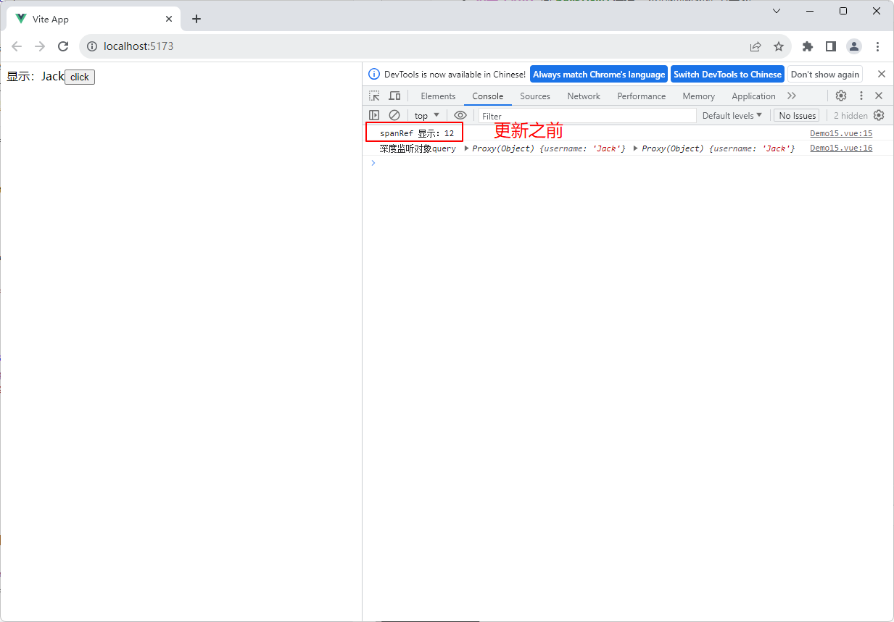

&emsp;&emsp;将 `flush: 'pre'` 改成 `flush: 'post'` 之后的效果如下：

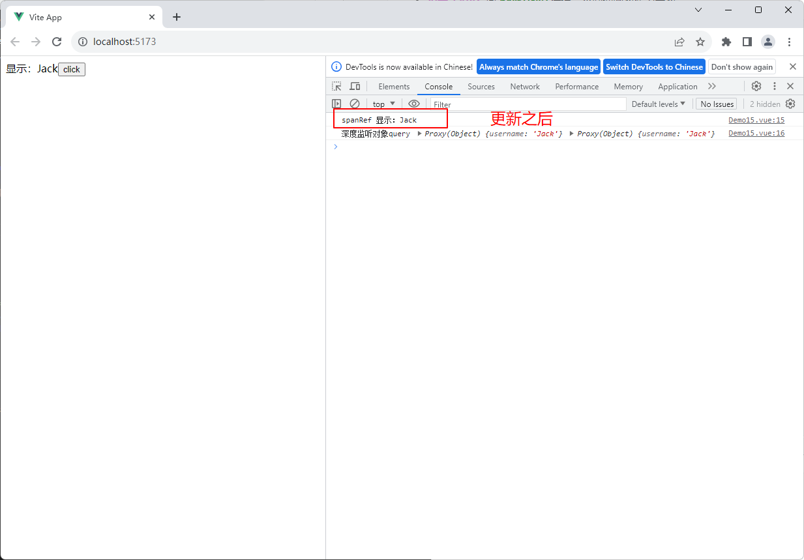

&emsp;&emsp;<font color=red>在组件模板中，针对要操作的元素上使用 ref 属性（ref 是一个特殊的属性），将元素挂载到 Vue 实例上，通过 `const spanRef =  ref();` 获取挂载的元素，从而进行操作元素</font>。

> <font color=orange>**关于 watchEffect 和 watch**</font>
>
>&emsp;&emsp;`watch` 和 `watchEffect` 都能响应式地执行有副作用的回调，它们之间的主要区别是追踪响应式依赖的方式：
>
> - `watch` 只追踪明确侦听的数据源。它不会追踪任何在回调中访问到的东西。另外，仅在数据源确实改变时才会触发回调。`watch` 会避免在发生副作用时追踪依赖，因此，我们能更加精确地控制回调函数的触发时机
> - `watchEffect` 则会在副作用发生期间追踪依赖。它会在同步执行过程中，自动追踪所有能访问到的响应式属性。这更方便，而且代码往往更简洁，但有时其响应性依赖关系会不那么明确（`watchPostEffect` 在响应式状态更新到模板之后调用监听器的回调函数，也可以在 `watchEffect` 的第二个参数中添加 `flush: 'post'` 属性设置）
