# reactive 函数

&emsp;&emsp;可以使用 <font color=green>***reactive()***</font> 函数创建一个响应式对象或数组：

```vue
<script setup lang="ts">
import { reactive } from 'vue'

// 创建响应式数组
const arrs = reactive([1, 2, 3, 4]);

// 修改数组的函数
const changeArrs = () => {
    arrs.forEach((value, index, arr) => {
        arr[index] = value + 10;
    })
}

// 创建响应式对象
const obj = reactive({
    name: "Andy",
    age: 20
});

// 修改响应式对象
const changeObj = () => {
    obj.name = "Tom";
    obj.age = 35;
}

</script>

<template>
    <div>
        <h2>数组</h2>
        <ul>
            <li v-for="(item, index) in arrs" :key="index">{{ index }} - {{ item }}</li>
        </ul>
        <button @click="changeArrs()">changeArrs</button>

        <h2>对象</h2>
        <ul>
            <li v-for="(value, key, index) in obj" :key="index">{{ index }} - {{ key }} - {{ value }} </li>
        </ul>
        <button @click="changeObj()">changeObj</button>
    </div>
</template>
```

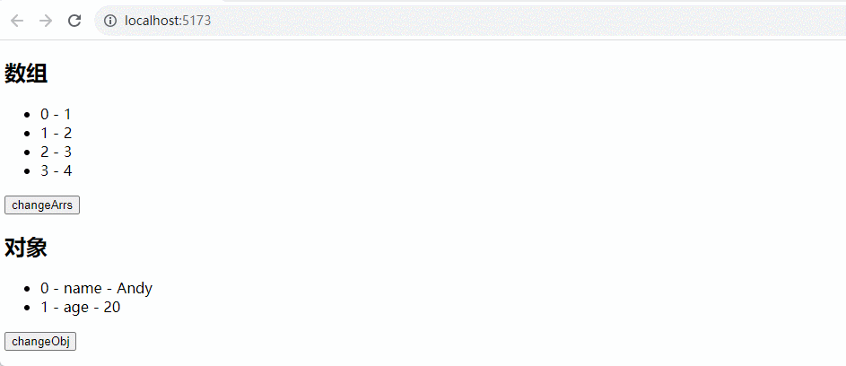

> <font color=orange>**关于 reactive + TypeScript：**</font>
>
> &emsp;&emsp;可以通过 `reactive + TypeScript` 标注类型，`TypeScript` 是一种基于 `JavaScript` 构建的强类型编程语言，需要在 `<script>` 根元素上添加属性 `lang="ts"` 来声明代码块采用  `TypeScript` 语法，`reactive()` 会根据参数中声明的属性自动推导出数据类型：
>
> ```vue
> <!-- 不要少了 lang="ts" -->
> <script setup lang="ts">
> import { reactive } from 'vue'
> 
> // 推导的类型：number[]
> const arrs = reactive([1, 2, 3, 4]);
> 
> // 推导得到的类型：{name: string, age: number}
> const obj = reactive({
>     name: "Andy",
>     age: 20
> });
> </script>
> ```
>
> &emsp;&emsp;也可以显式地标注一个 `reactive` 变量的类型：
>
> ```vue
> <script setup lang="ts">
> import { reactive } from 'vue'
> 
> // 创建响应式数组
> const arrs = reactive<number[]>([1, 2, 3, 4]);
> 
> // 使用接口声明类型
> interface User {
>     name: string;
>     age: number;
> }
> 
> // 创建响应式对象
> const obj: User = reactive({
>     name: "Andy",
>     age: 20
> });
> </script>
> ```

&emsp;&emsp;在 `Vue` 中默认状态都是深层响应式的，这意味着即使更改深层次的对象或数组也能被检测到：

```vue
<script setup lang="ts">
import { reactive } from 'vue'

interface Obj {
    child: any;
    hobbies: Array<string>;
}

// 创建响应式数组
const obj = reactive<Obj>({
  child: {
    name: "Tom"
  },
  hobbies: []
});

// 修改数组的函数
const changeObj = () => {
  obj.child.name = "Andy";
  obj.hobbies = ["踢足球", "打篮球"]
}

</script>

<template>
    <div>
        <p>child name: {{ obj.child.name }}</p>
        <p>hobbies：</p>
        <ul>
            <li v-for="(hobby, index) in obj.hobbies" :key="index">{{ index }} - {{ hobby }}</li>
        </ul>
        <button @click="changeObj()">changeObj</button>
    </div>
</template>
```


&emsp;&emsp;<font color=red>使用 reactive() 有下面的限制：</font>

+ 仅对对象类型有效，对原始类型无效（ 如：`string`）
+ 因为 `Vue` 的响应式系统是通过属性访问进行追踪的，因此必须始终保持对该响应式对象的相同引用。这意味着不可以随意地替换一个响应式对象，这将导致对初始引用的响应性连接丢失

```javascript
let state = reactive({ count: 0 })

// 上面的引用 ({ count: 0 }) 将不再被追踪（响应性连接已丢失！）
state = reactive({ count: 1 })
```

+ 当将响应式对象的属性赋值或解构至本地变量，或是将该属性传入一个函数时都会失去响应性

```javascript
const state = reactive({ count: 0 })

// n 是一个局部变量，同 state.count
// 失去响应性连接
let n = state.count
// 不影响原始的 state
n++

// count 也和 state.count 失去了响应性连接
let { count } = state
// 不会影响原始的 state
count++

// 该函数接收一个普通数字，并且
// 将无法跟踪 state.count 的变化
callSomeFunction(state.count)
```

&emsp;&emsp;但是可以通过 <font color=green>***toRefs***</font> 或 <font color=green>***toRef***</font> 来解决问题：

```vue
<script setup lang="ts">
import { reactive, toRef, toRefs } from 'vue'

const state = reactive({ counter: 0 })

const num = toRef(state, "counter")

const { counter } = toRefs(state)

const handleNum = () => {
  num.value++
}

const handleCounter = () => {
  counter.value++
}

const handleStateCount = () => {
  state.counter++
}

</script>

<template>
  <div>
    <p>{{ state.counter }}</p>
    <p>{{ num }}</p>
    <p>{{ counter }}</p>
    <button @click="handleNum">Num + 1</button>
    <button @click="handleCounter">counter + 1</button>
    <button @click="handleStateCount">state.counter + 1</button>
  </div>
</template>
```

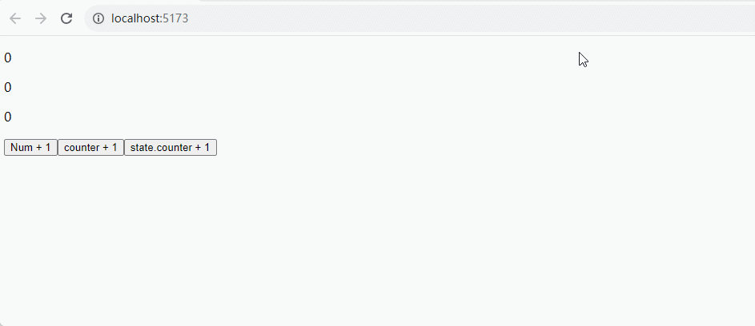

# ref 函数

&emsp;&emsp;`reactive` 的种种限制归根到底是因为 `JavaScript` 没有可以作用于所有值类型的引用机制，为此 Vue 提供了一个 <font color=green>***ref()***</font> 方法来允许创建可以使用任何值类型的响应式 ref，将传入参数的值包装为一个带 <font color=green>***.value***</font> 属性的 ref 对象：

```vue
<script setup lang="ts">
import {ref} from 'vue'

const count = ref(0)

const handleAdd = () => {
    count.value++
}
</script>

<template>
    <div>
        <p>count: {{count}}</p>
        <button @click="handleAdd">+1</button>
    </div>
</template>
```

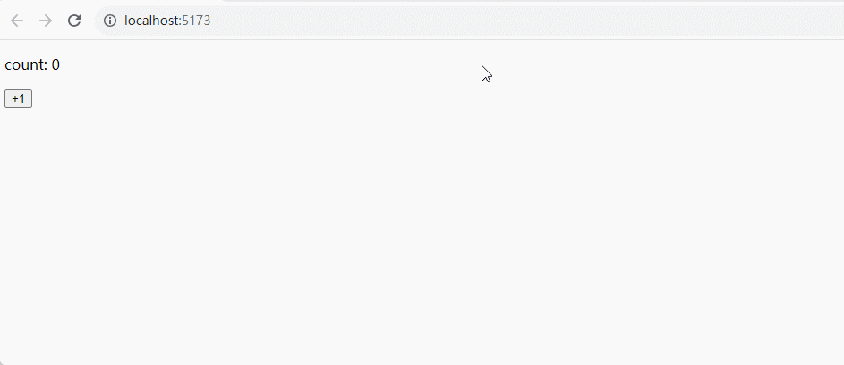

> <font color=orange>**注意：**</font>当 ref 在模板中作为顶层属性被访问时，它们会被自动解包，不需要使用 `.value`。
>
> <font color=orange>**使用 ref + TypeScript  标注类型**</font>
>
> &emsp;&emsp;`ref()` 会根据参数中声明的属性自动推导出数据类型：
>
> ```vue
> <script setup lang="ts">
>     import { ref } from 'vue';
>     // 自动推导出的类型：Ref<number>
>     const age = ref(18);
>     // 会有ts错误提示：TS Error: Type 'string' is not assignable to type 'number'.
>     age.value = '20';
> </script>
> ```
>
> &emsp;&emsp;可以手动显式地为 `ref` 内的值指定一个更复杂的类型，通过使用 `Ref`（<font color=red>大写字母 R </font>）指定类型：
>
> ```vue
> <script setup lang="ts">
>     import { ref } from 'vue';
>     // 要加 type 表示导入 Ref 接口类型
>     import type { Ref } from 'vue';
>     
>     // 手动指定类型
>     const age: Ref<number | string> = ref(18);
>     age.value = '20'; // 成功，无ts错误提示
> </script>
> ```
>
> &emsp;&emsp;也可以在调用 `ref()` 时传入一个泛型参数来覆盖默认的推导行为：
>
> ```vue
> <script setup lang="ts">
>     import { ref } from 'vue';
>     // 得到的类型：Ref<number | string>
>     const age = ref<number | string>('18');
>     age.value = 2020 // 成功，无ts错误提示
> </script>
> ```
>
> &emsp;&emsp;如果指定了一个泛型参数但没有给出初始值，那么最后得到的就将是一个包含 `undefined` 的联合类型：
>
> ```vue
> <script setup lang="ts">
>     import { ref } from 'vue';
>     // 推导得到的类型：Ref<number | undefined>
>     const age = ref<number>();
>     console.log('age', age.value); // undefined
> </script>
> ```

&emsp;&emsp;和响应式对象的属性类似，ref 的 `.value` 属性也是响应式的。当值为对象类型时，会用 `reactive()` 自动转换它的 `.value`。一个包含对象类型值的 ref 可以响应式地替换整个对象：

```vue
<script setup lang="ts">
import {ref} from 'vue'

// 创建一个响应式变量
const cObj = ref({counter: 0});

// 这是响应式的替换
cObj.value = {counter: 1};

// 创建修改变量的方法
const changeCounter = () => {
  cObj.value.counter++;
}

</script>

<template>
  <div>
    <p>{{cObj.counter}}</p>
    <button @click="changeCounter">+1</button>
  </div>
</template>
```


&emsp;&emsp;ref 被传递给函数或是从一般对象上被解构时不会丢失响应性：

```vue
<script setup lang="ts">
import {ref} from 'vue'

const obj = {
  counter: ref(1)
}

// 仍然是响应式的
const { counter } = obj

</script>

<template>
  <div>
    <p>{{obj.counter}}</p>
    <p>{{counter}}</p>
    <button @click="counter++">changeCounter</button>
  </div>
</template>
```

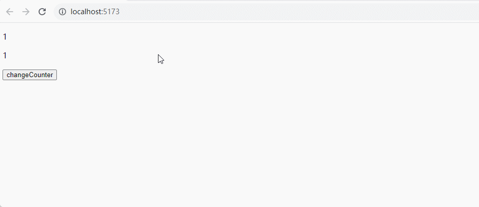

&emsp;&emsp;ref 能创造一种对任意值的引用，并能够在不丢失响应性的前提下传递这些引用，它经常用于将逻辑提取到组合函数中：

```javascript
/*
/src/utils/userManage.ts 文件
*/
import {ref} from 'vue'

export function userManager () {
    const username = ref("Jack");
    const password = ref("1234");
    const age = ref(12)

    const changeUser = (uUsername: string, uPassword: string, uAge: number ) => {
        username.value = uUsername;
        password.value = uPassword;
        age.value = uAge;
    }

    return {username, password, age, changeUser}
}
```

```vue
<!-- App.vue 文件 -->
<script setup lang="ts">
// 导出方法
import {userManager} from '../utils/userManage'

// 解构方法的内容
const {username, password, age, changeUser} = userManager();

</script>

<template>
  <div>
    <p>username: {{username}} , password: {{password}}, age: {{age}}</p>
    <button @click="changeUser('Andy','11111',12)">changeUser</button>
  </div>
</template>
```

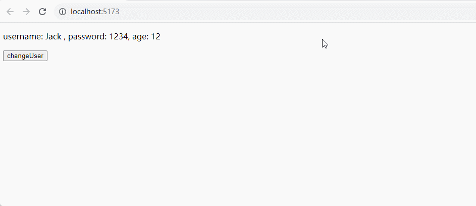

&emsp;&emsp;当一个 ref 被嵌套在一个响应式对象中作为属性被访问或更改时，它会自动解包，因此会表现得和一般的属性一样：

```javascript
const count = ref(0)
const state = reactive({
  count
})

count.value = 1

console.log(state.count) // 1
console.log(count.value) // 1

state.count = 2

console.log(state.count) // 2
console.log(count.value) // 2
```

&emsp;&emsp;如果将一个新的 ref 赋值给一个关联了已有 ref 的属性，那么它会替换掉旧的 ref：

```vue
<script setup lang="ts">
import {ref, reactive} from 'vue'

const count = ref<number>(0)

const state = reactive({
  count: count
})

const otherCount = ref<number>(2)
// 原始 ref 现在已经和 state.count 失去联系
state.count = otherCount

</script>

<template>
  <div>
    <p>{{state.count}}</p>
    <p>{{otherCount}}</p>
    <p>{{count}}</p>
    <button @click="count++">changeCount</button>
    <button @click="otherCount++">changeOtherCount</button>
  </div>
</template>
```

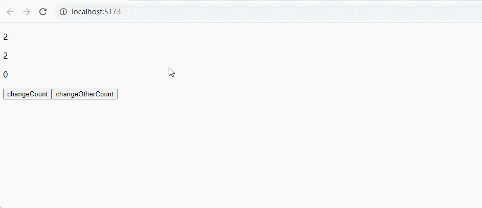

> <font color=orange>**注意：**</font>只有当嵌套在一个深层响应式对象内时才会发生 ref 解包，当其作为浅层响应式对象的属性被访问时不会解包。

&emsp;&emsp;跟响应式对象不同，当 ref 作为响应式数组或像 Map 这种原生集合类型的元素被访问时不会进行解包：

```javascript
const books = reactive([ref('Vue 3 Guide')])
// 这里需要 .value
console.log(books[0].value)

const map = reactive(new Map([['count', ref(0)]]))
// 这里需要 .value
console.log(map.get('count').value)
```

# 浅层响应式对象

&emsp;&emsp;`reactive()` 和 `ref()` 是深层响应式对象，也就是声明的对象属性不管是多少层级的都会深度监听其所有属性，从而所有属性都是响应式的。

<font color=orachid>**（一）shallowReactive()**</font>

&emsp;&emsp;`shallowReactive()` 是浅层响应式对象，一个浅层响应式对象里只有根级别的属性是响应式的，嵌套子属性不是响应式的，<font color=red>如果只修改了子属性的值不会响应式，但是一旦修改了根属性值，对应所有属性的新值都会更新到视图中</font>：

```vue
<script setup lang="ts">
import { shallowReactive } from 'vue'


// 浅层响应式：只对根属性是响应式的
const shallowState = shallowReactive({
  name: '张三',
  car: {
    color: 'red'
  }
});

// 修改非根节点的属性
const changeNotRoot = () => {
    shallowState.car.color = 'yellow';
}

// 修改根节点的属性
const  changeRoot = () => {
  shallowState.name = "李四";
}
</script>

<template>
  <div>
    <p>name: {{ shallowState.name }} ---- color: {{ shallowState.car.color }}</p>
    <button @click="changeNotRoot">修改非根节点的属性</button>
    <button @click="changeRoot">修改根节点的属性</button>
  </div>
</template>
```

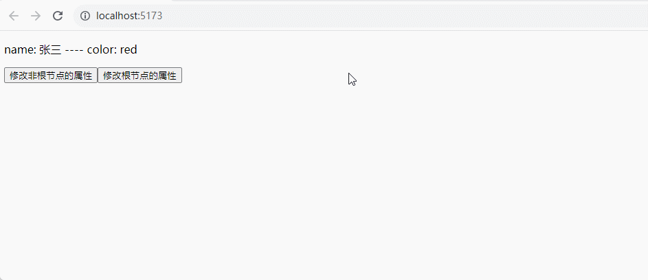

&emsp;&emsp;当修改非根节点的属性 `color` 的时候，页面并没有更新；当修改了根节点的 `name` 属性的时候，页面才发生更新，包括之前修改的 `color` 属性也一起更新了。因此，<font color=red>可以把需要展现在视图层的数据放置在第一层，而把内部数据放置第二层及以下</font>。

<font color=orachid>**（二）shallowRef()**</font>

&emsp;&emsp;`shallowRef()` 是浅层响应式对象，只处理原始类型的响应式，对象类型是浅层监听不进行响应式处理。<font color=red>不是监听状态的第一层数据的变化，而是监听 `.value` 的变化</font>：

+ 如：`state.value.name = 'xx'` 不会被监听到，视图不更新
+ 如：`state.value = {name: 'xx'}` 才会被监听到，视图会更新

```vue
<script setup lang="ts">
import { shallowRef } from 'vue'

// shallowRef 对原始类型都是响应式
const count = shallowRef(0);

// 浅层监听不是监听状态的第一层数据的变化；而是监听 .value 的变化，如：state.value = {}
const shallowRefState = shallowRef({
  num: 1
});

// 修改原始类型
const testChangeOrg = () => {
    count.value++
}

// 修改对象内的数据
const testChangeObjPro = () => {
    shallowRefState.value.num++;
}

// 重定向 .value 到一个新的对象
const testChangeObj = () => {
   const temp = shallowRefState.value.num + 1;
   shallowRefState.value = {
    num : temp
   }
}

</script>

<template>
  <div>
    <p>count：{{ count }} </p>
    <p>num: {{ shallowRefState.num }}</p>
    <button @click="testChangeOrg">修改原始类型</button>
    <button @click="testChangeObjPro">修改对象内的数据</button>
    <button @click="testChangeObj">重定向value对象</button>
  </div>
</template>
```

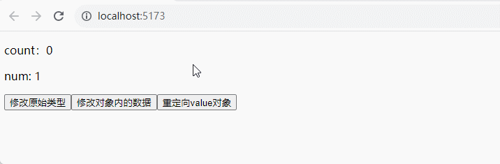

&emsp;&emsp;<font color=red>如果有一个对象数据，当修改该对象中的属性值不进行响应式更新视图，而是希望当生成新对象来替换旧对象时才进行响应式，则使用 `shallowRef`</font>。

# 只读代理

## readonly()

&emsp;&emsp;`readonly()` 接受一个对象（不论是响应式对象还是普通对象）或是一个 ref，返回一个原值的深层次只读代理，对象的任何层级的属性都是只读的，不可修改的。它的 `ref()` 解包行为与 `reactive()` 相同，但解包得到的值是只读的。

```vue
<script setup lang="ts">
import { reactive, readonly } from 'vue';

const original = reactive({
  count: 0
});

const copy = readonly(original);
    
const addOriginal = () => {
  // 源属性可修改，
  original.count++;
}

const addCopy = () => {
    copy.count++; // 警告
}

</script>
<template>
  <div>
    <p>original.count：{{ original.count }}</p>
    <p>copy.count：{{ copy.count }}</p>
    <button @click="addOriginal">original新增</button>
    <button @click="addCopy">copy新增</button>
  </div>
</template>
<style scoped></style>
```

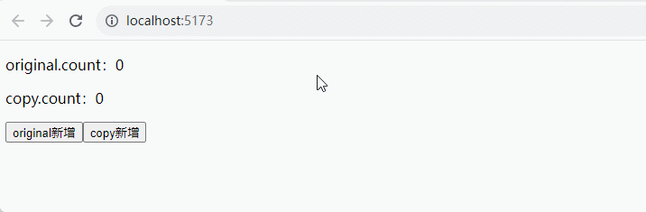

## shallowReadonly()

&emsp;&emsp;`shallowReadonly()` 是浅层级只读代理，只有根层级的属性变为了只读，子层级的属性可修改：

```vue
<script setup lang="ts">
import {reactive, shallowReadonly} from 'vue'

const original = reactive({
  count: 0,
  user: {
    age: 18
  }
})

const shallowCopy = shallowReadonly(original);

</script>

<template>
  <div>original.count: {{original.count}}</div>
  <div>original.user.age: {{original.user.age}}</div>
  <div>shallowCopy.count: {{shallowCopy.count}}</div>
  <div>shallowCopy.user.age: {{shallowCopy.user.age}}</div>
  <div>
    <button @click="original.count++">Original修改根属性</button>
    <button @click="original.user.age++">Original修改子级属性</button>
    <button @click="shallowCopy.count++">shallowCopy修改根属性</button>
    <button @click="shallowCopy.user.age++">shallowCopy修改子级属性</button>
  </div>
</template>

<style>
</style>
```

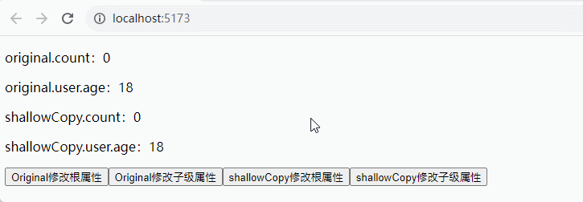

> <font color=orange>**注意：**</font>谨慎使用`shallowReadonly()`，浅层次只读应该只用于组件中的根级状态，避免将其嵌套在深层次的响应式对象中，因为它创建的树具有不一致的响应行为，这可能很难理解和调试。

# 响应式 API

## isRef() 

&emsp;&emsp;用来检查某个值是否为 ref，常用于条件判断中：

```vue
<script setup>
import { ref, isRef } from 'vue';
    
const count = ref(0);
    
// `isRef` 判断是否为 ref，从而是否.value获取值
if (isRef(count)) {
	console.log('是ref', count.value);
} else {
	console.log('非ref', count);
}
</script>
```

## unref()

&emsp;&emsp;如果参数是 ref 则返回内部值，否则返回参数本身，等价于 <font color=green>***isRef(count) ? count.value : count***</font>：

```javascript
// `unref`（注意：r是小写），参数是ref则会返回.value的值，否则直接返回值本身
function testUnref(x: number | Ref<number>) {
    // 保证val是具体的值，直接用于逻辑处理
    const val = unref(x);
    console.log('unref', val); // 1
}
```

## toRef()

&emsp;&emsp;针对响应式对象的某个属性创建一个对应的 ref，这样创建的 ref 与其源属性保持同步（<font color=red>改变源属性的值将更新 ref 的值，反之亦然</font>）：

```vue
<script setup lang="ts">
import { reactive, toRef } from 'vue';

// `toRef` 将响应对象的某个属性，创建一个对应的ref
const state = reactive({
    age: 6
});

// 针对 age 属性创建一个对应的 ref
const ageRef = toRef(state, 'age');

const changestate = () => {
    state.age++
}

const changeAgeRef = () => {
    ageRef.value++
}
</script>

<template>
    <div>
        <p>state.age: {{state.age}}</p>
        <p>ageRef: {{ageRef}}</p>
        <button @click="changestate">修改源对象</button>
        <button @click="changeAgeRef">修改toRef产生的</button>
    </div>
</template>
```

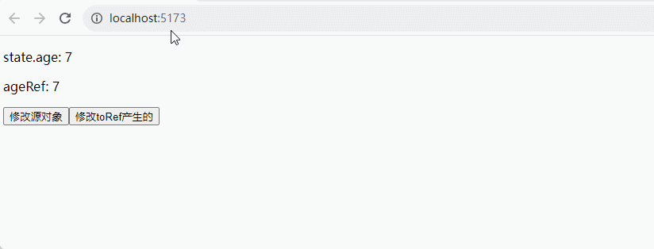

&emsp;&emsp;<font color=red>即使源属性当前不存在，`toRef()` 也会返回一个可用的 ref</font>，这让它在处理子组件的可选 props 的时候格外实用，不然为空逻辑处理时可能报错：

```vue
<script setup lang="ts">
import { reactive, toRef } from 'vue';
const state = reactive({
    age: 6
});

const other = toRef(state, 'other');
</script>

<template>
    <div>
        <p>other: {{other}}</p>
        <button @click="other = 12">changeOther</button>
    </div>
</template>
```


## toRefs()

&emsp;&emsp;该方法将一个响应式对象转换为一个普通对象，这个普通对象的每个属性都是指向源对象相应属性的 ref，每个单独的 ref 都是使用 `toRef()` 创建的：

+ `toRefs` 是创建响应式对象的每个属性的 ref，`toRef` 是创建响应式对象中的单个属性的 ref
+ `toRefs` 在调用时只会为源对象上的属性创建 ref，如果要为可能还不存在的属性创建 ref，请改用 `toRef` 

```vue
<script setup lang="ts">
import { reactive, toRefs } from 'vue';

const user = reactive({
    name: 'Jack',
    salary: 10000
});

// toRefs 是创建响应式对象的每个属性的 ref
// userRefs 的类型：{ name: Ref<string>, salary: Ref<number> }
const userRefs = toRefs(user);

const changeUserRefs = () => {
    userRefs.name.value = "Tom";
    userRefs.salary.value = 9000;
}

const changeOrigine = () => {
    user.name = "Jack";
    user.salary = 10000;
}
</script>

<template>
    <div>
        <p>user.name: {{user.name}} - user.salary: {{user.salary}}</p>
        <p>userRefs.name: {{userRefs.name}} - userRefs.salary: {{userRefs.salary}}</p>
        <button @click="changeUserRefs">改变ref数据</button>
        <button @click="changeOrigine">改变源数据</button>
    </div>
</template>
```


&emsp;&emsp;toRefs 将每个属性转为 ref 后再进行解构属性，这样可以在模板中直接通过属性名引用：

```vue
<script setup lang="ts">
import { reactive, toRefs } from 'vue';

const user = reactive({
    name: 'Jack',
    salary: 10000
});


const {name, salary} = toRefs(user);

const changeRefs = () => {
    name.value = "Tom";
    salary.value = 9000;
}

const changeOrigine = () => {
    user.name = "Jack";
    user.salary = 10000;
}
</script>

<template>
    <div>
        <p>user.name: {{user.name}} - user.salary: {{user.salary}}</p>
        <p>userRefs.name: {{name}} - userRefs.salary: {{salary}}</p>
        <button @click="changeRefs">改变ref数据</button>
        <button @click="changeOrigine">改变源数据</button>
    </div>
</template>
```

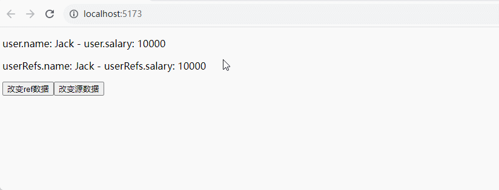

## isProxy()

&emsp;&emsp;`isProxy()` 检查一个对象是否是由 `reactive()` 、`readonly()`、`shallowReactive()` 和 `shallowReadonly()` 创建的代理：

```javascript
import { reactive, isProxy } from 'vue';

const state2 = reactive({
	username: '123456',
});

console.log('isProxy', isProxy(state2)); // true
```

## isReactive()

&emsp;&emsp;检查一个对象是否是由 `reactive()` 或 `shallowReactive()` 创建的代理：

```javascript
import { reactive, isReactive } from 'vue';

const state2 = reactive({
	username: '123456',
});

console.log('isReactive', isReactive(state2)); // true

/**
* isReadonly() 检查传入的值是否为只读对象，通过 `readonly()` 和 `shallowReadonly()` 创建的代理都是只读的。
*/
const stateCopy = readonly(state2);
console.log('isReadonly', isReadonly(state2)); // false
console.log('isReadonly', isReadonly(stateCopy)); // true
```

## isReadonly()

&emsp;&emsp;检查传入的值是否为只读对象，通过 `readonly()` 和 `shallowReadonly()` 创建的代理都是只读的：

```javascript
import { reactive, isReactive, isReadonly, readonly, computed } from 'vue';

const state2 = reactive({
	username: '123456',
});

// 深层只读
const stateCopy = readonly(state2);
console.log('isReadonly', isReadonly(state2)); // false
console.log('isReadonly', isReadonly(stateCopy)); // true

// 没有set的计算属性也是只读的，后续会讲
const statusText = computed(() => '张三');
console.log('isReadonly', isReadonly(statusText)); // true
```

> <font color=orange>**注意：**</font>没有 set 函数的 computed() 计算属性也是只读的，反之则不是只读。
