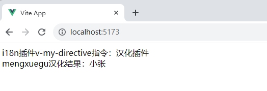

# Vue 内置指令总结

+ <font color=orchid>**v-text：**</font>等价于 {{}} 用于显示内容，但区别在于{{}} 会造成闪烁问题， v-text 不会闪烁

+ <font color=orchid>**v-html：**</font>内容按普通 HTML 插入，可防止 XSS 攻击

+ <font color=orchid>**v-cloak：**</font>用于隐藏尚未完成编译的 DOM 模板，解决双大括号闪烁等问题

+ <font color=orchid>**v-show：**</font>根据表达式的真假值，切换元素的 display 属性来显示/隐藏元素

+ <font color=orchid>**v-if：**</font>根据表达式的真假值，来渲染元素

+ <font color=orchid>**v-else：**</font>前面必须有 v-if 或 v-else-if

+ <font color=orchid>**v-else-if：**</font>前面必须有 v-if 或 v-else-if

+ <font color=orchid>**v-for：**</font>遍历的数组或对象

+ <font color=orchid>**v-on：**</font>绑定事件监听器

+ <font color=orchid>**v-bind：**</font>动态的绑定一个或多个属性，也可以是组件的 prop

+ <font color=orchid>**v-model：**</font>在表单控件或者组件上创建双向绑定

+ <font color=orchid>**v-once：**</font>一次性插值，当后面数据更新后视图数据不会更新

+ <font color=orchid>**v-pre：**</font>元素内具有 `v-pre` ，所有 Vue 模板语法都会被保留并按原样渲染。会跳过这个元素和它的子元素的编译过程，加快编译（最常见的用例就是显示原始双大括号标签及内容）

+ <font color=orchid>**v-memo（Vue 3.2+ 版本新增指令）：**</font>它的值为数组，用于缓存一个节点及子节点，在元素和组件上都可以使用，只作性能的提升

# 自定义指令

&emsp;&emsp;除了内置指令外，Vue 也允许注册自定义指令。比如需要对普通 DOM 元素进行底层操作，这时候使用自定义指令更为方便。

## 注册全局指令

&emsp;&emsp;定义全局指令的方式如下：

1. 首先在 <font color=brown>***main.js***</font> 中添加下面的代码

```javascript
import './assets/main.css'

import { createApp } from 'vue'
import App from './App.vue'

const app = createApp(App);

// 全局自定义指令
app.directive('focus', {
    mounted:  (el) => {
        el.focus();
    }
})

app.mount('#app')
```

2. 然后在 <font color=brown>***App.vue***</font> 文件中进行调用

```vue
<template>
  <div>
    <input type="text" v-focus>
  </div>
</template>
```

> <font color=orange>**注意：**</font>
>
> + 注册时指令名不要带 `v-`
> + 引用指令时，指令名前面加上 `v-`

## 注册局部指令

&emsp;&emsp;直接在 <font color=brown>***App.vue***</font> 文件中创建自定义指令进行调用：

```vue
<script setup lang="ts">
const vFocus = {
  mounted: (el: any) => {
    el.focus();
  }
}
</script>

<template>
  <div>
    <input type="text" v-focus>
  </div>
</template>
```

## 指令钩子

&emsp;&emsp;一个指令的定义对象可以提供几种钩子函数 (都是可选的)：

```javascript
const myDirective = {
  // 在绑定元素的属性前，或事件监听器应用前调用
  created(el, binding, vnode, prevVnode) {
  },
  // 在元素被插入到 DOM 前调用
  beforeMount(el, binding, vnode, prevVnode) {},
  // （一般用这个）在绑定元素的父组件
  // 及他自己的所有子节点都挂载完成后调用
  mounted(el, binding, vnode, prevVnode) {},
  // 绑定元素的父组件更新前调用
  beforeUpdate(el, binding, vnode, prevVnode) {},
  // 在绑定元素的父组件
  // 及他自己的所有子节点都更新后调用
  updated(el, binding, vnode, prevVnode) {},
  // 绑定元素的父组件卸载前调用
  beforeUnmount(el, binding, vnode, prevVnode) {},
  // 绑定元素的父组件卸载后调用
  unmounted(el, binding, vnode, prevVnode) {}
}
```

&emsp;&emsp;指令的钩子会传递以下几种参数：

- <font color=orchid>**el**</font>：指令绑定到的元素。这可以用于直接操作 DOM。
- <font color=orchid>**binding：**</font>一个对象，包含以下属性（可获取使用了此指令的绑定值等）。
  - <font color=orchid>**value：**</font>传递给指令的值。例如在 `v-my-directive="1 + 1"` 中，值是 `2`。
  - <font color=orchid>**oldValue：**</font>之前的值，仅在 `beforeUpdate` 和 `updated` 中可用。无论值是否更改，它都可用。
  - <font color=orchid>**arg：**</font>传递给指令的参数 (如果有的话)。例如在 `v-my-directive:foo` 中，参数是 `"foo"`。
  - <font color=orchid>**modifiers：**</font>一个包含修饰符的对象 (如果有的话)。例如在 `v-my-directive.foo.bar` 中，修饰符对象是 `{ foo: true, bar: true }`。
  - <font color=orchid>**instance：**</font>使用该指令的组件实例。
  - <font color=orchid>**dir：**</font>指令的定义对象。
- <font color=orchid>**vnode：**</font>代表绑定元素的底层 VNode。
- <font color=orchid>**prevNode：**</font>之前的渲染中代表指令所绑定元素的 VNode。仅在 `beforeUpdate` 和 `updated` 钩子中可用。

```vue
<script setup lang="ts">
import {ref} from 'vue';
const message = ref("Hello World");

const vUp = {
  mounted : (el: any, binding: any) => {
    const content = binding.value + "";
    el.innerHTML = content.toUpperCase();
  }
}
</script>

<template>
  <div>
    <p v-up="message"></p>
  </div>
</template>
```

# 自定义插件

&emsp;&emsp;Vue 插件的作用：

+ 插件通常会为 Vue 添加全局功能，一般是添加全局指令、全局实例属性或方法、全局组件等
  + 向 <font color=green>***app.config.globalProperties***</font> 中添加一些全局实例属性或方法
  + 通过 <font color=green>***app.component()***</font> 和 <font color=green>***app.directive()***</font> 注册一到多个全局组件或自定义指令
  + 通过 <font color=green>***app.provide()***</font> 使一个资源可被注入进整个应用
+ 一个插件有一个公开方法 <font color=green>***install()***</font>，通过该方法添加全局功能，它接收安装它的应用实例 app 和额外选项作为参数
+ 通过全局方法 <font color=green>***app.use()***</font> 使用插件

&emsp;&emsp;下面自定义一个国际化插件作为案例：

+ 首先创建 <font color=brown>***src/plugins/i18n.ts***</font> 文件

```typescript
import type { App } from 'vue';

// 定义全局插件：中英转换
export default {
    // app是应用实例；options 绑定到应用实例时传递的选项对象
    install: (app: App, options: any) => {
        console.log('插件选项options', options);

        // 1. 注入全局方法 $translate()
        app.config.globalProperties.$translate = (key: string) => {
            console.log('插件：注册全局方法生效');
            // 使用 `key` 作为索引
            const obj = { xiaozhang: '小张' } as any;
            return obj[key];
        }
        
        // 2. 注入全局指令
        app.directive('my-directive', (el, binding) => {
            console.log('插件：注册全局指令生效');
            el.innerHTML = "i18n插件v-my-directive指令：" + options.name;
        });
    }
}
```

+ 挂载到应用实例 app 上，要在 <font color=brown>***main.ts***</font> 中添加如下代码

```typescript
import { createApp } from 'vue'
import App from './App.vue'
import i18n from './plugins/i18n'

const app = createApp(App);

// 引用插件， 参数1：插件对象，参数2：可选自定义对象options
app.use(i18n, {name : "汉化插件"})

app.mount('#app')
```

+ 使用插件，在组件文件中使用
  + 在选项式 API 中，使用 `this` 获取全局方法/变量
  + 在组合式 API 中，要使用 <font color=green>***getCurrentInstance()***</font> 来获取

```vue
<script setup lang="ts">
  import { getCurrentInstance } from 'vue';

  const instance = getCurrentInstance();
  const chinese = instance?.appContext.config.globalProperties.$translate("xiaozhang");
  console.log("汉化结果：", chinese);

</script>

<template>
  <div>
    <div v-my-directive></div>
    <div>mengxuegu汉化结果：{{$translate("xiaozhang")}}</div>
  </div>
</template>
```

+ 接下看页面效果


