# 组件的基本使用

&emsp;&emsp;组件（`Component`）是 `Vue` 最强大的功能之一，组件化开发就是把网页的重复代码抽取出来，封装成一个个可复用的视图组件，然后将这些视图组件拼接到一块就构成了一个完整的系统。这种方式非常灵活，可以极大的提高开发和维护的效率，通常一套系统会以一棵嵌套的组件树的形式来组织：

+ 组件是对局部视图的封装（`HTML`、`CSS`、`JavaScript`）
+ 提高开发效率、增强可维护性，能够更好地解决软件上的高耦合、低内聚、无重用的 3 大代码问题
+ `Vue` 中的组件思想借鉴于 React
+ 目前主流的前端框架都是组件化的开发思想

&emsp;&emsp;为了能在模板中使用，这些组件必须先注册以便 `Vue` 能够识别。有两种组件的注册类型：<font color=red>全局注册 和 局部注册</font>：

## 全局注册

&emsp;&emsp;通过调用 `Vue` 应用实例的 <font color=green>***component()***</font> 方法，让组件在当前 `Vue` 应用中全局可用：

```javascript
import { createApp } from 'vue'
import App from './App.vue'

const app = createApp(App)

// 注册全局组件
app.component("MyComponent", {
    // 组件的内容
})

app.mount('#app')
```

&emsp;&emsp;如果使用单文件组件，也可以注册被导入的 <font color=brown>***.vue***</font> 文件：

```javascript
import { createApp } from 'vue'
import App from './App.vue'

// 导入 vue 文件
import AboutView from './views/AboutView.vue'

const app = createApp(App)

// 注册全局组件
app.component("AboutView", AboutView)

app.mount('#app')
```

> <font color=orange>**关于组件名称：**</font>可以使用首字母大写（`PascalCase`）、驼峰（`camelCase`）或者横线分隔（`kebab-case`）命名方式。

&emsp;&emsp;全局注册的组件可以在此应用的任意组件的模板中使用：

```vue
<script setup></script>
<template>
  <div>
    <about-view></about-view>
  </div>
</template>
```

> <font color=orange>**注意：**</font>`app.component()` 方法可以被链式调用：`app.component('ComponentA', ComponentA).component('ComponentB', ComponentB).component('ComponentC', ComponentC)`。

## 局部注册

&emsp;&emsp;全局注册虽然很方便，但有以下几个问题：

+ 如果全局注册了一个组件，即使它并没有被实际使用，仍然会出现在打包后的 `JS` 文件中
+ 全局注册在大型项目中使项目的依赖关系变得不那么明确，这可能会影响应用长期的可维护性

&emsp;&emsp;局部注册的组件需要在使用它的父组件中显式导入，并且只能在该父组件中使用，它的优点是使组件之间的依赖关系更加明确：

```vue
<script setup>
import AboutView from './views/AboutView.vue'
</script>

<template>
  <div>
    <about-view></about-view>
  </div>
</template>
```

## Dom 模板和字符串模板

### Dom 模板

&emsp;&emsp;在 `.html` 文件中，<font color=red>被 Vue 挂载的 HTML 代码称为 Dom 模板（又称 HTML 模板）</font>：

```html
<!-- xxx.html -->
<div id="app">
	Dom 模板：此区域编写的代码都为 Dom 模板代码
</div>
```

&emsp;&emsp;在 Dom 模板中引用组件时有几点特殊使用要求：

+ <font color=red>Dom 模板中引用组件必须使用短横线引用，不能使用首字母大写和驼峰</font>
  + 由于原生 HTML 解析行为的限制，HTML 标签和属性名是不分大小写的，所以浏览器会把任何大写的字符解释为小写
  +  如：`<ComponentA>` 会被浏览器解析为 `<componenta>` ，导致 `Vue` 中没有对应的 `componenta` 组件，正确写法：`<component-a></component-a>`

+ Dom 模板中必须显式地写出关闭标签 \<compoent-a\>\</component-a\> ，不能使用直接使用闭合标签 \<compoent-a /\>
  + HTML 只允许一小部分特殊的元素省略其关闭标签（最常见的就是 `<input>` 和 `` ），对于其他的元素来说，如果你省略了关闭标签，原生的 HTML 解析器会认为开启的标签永远没有结束
+ Dom 模板中有元素位置限制，某些 HTML 元素对于放在其中的元素类型有限制（<font color=red>可在这些 HTML 限用元素上使用 `is="vue:组件名"` 属性引用组件</font>）
  + 例如： `<ul>` ，`<table>` 和 `<select>` 元素中只能放置特定元素才会显示

```vue
<!DOCTYPE html>
<html lang="en">
<head>
    <meta charset="UTF-8">
    <meta name="viewport" content="width=device-width, initial-scale=1.0">
    <title>Document</title>
    <script src="./node_modules/vue/dist/vue.global.js"></script>
</head>
<body>
    <div id="app">
        <!-- 引用自定义组件代码直接放到 table 中 -->
        <table>
            <component-a></component-a>
        </table>
        <!-- 
            上面渲染后的代码：
            <h3>Hello组件A</h3>
            <table></table>
        -->

        <!-- 在限用元素上使用 is="vue:组件名" 来引用组件 -->
        <table>
            <tbody is="vue:component-a"></tbody>
        </table>
        <!-- 
        上面渲染后的代码：
        <table>
            <h3>Hello组件A</h3>
        </table>
        -->
    </div>
    <script>
        const {createApp} = Vue

        const Content = {
            setup() {
                const number = 100;
                return {number}
            }
        }

        const app = createApp(Content);

        app.component('component-a', {
            template: '<h3>Hello 组件A</h3>'
        })

        app.mount("#app")
    </script>
</body>
</html>
```

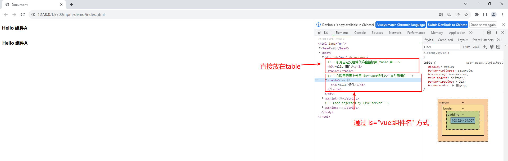

### 字符串模板

&emsp;&emsp;在字符串模板中没有以上使用限制，因为字符串模板是要先通过 `Vue` 编译的，可以在编译中区分大小写的：

+ 字符串模板中引用组件可以使用首字母大写、驼峰和短横线方式
+ 可以直接使用闭合标签 `<ComponentA />`
+ 没有 HTML 限用元素下引用自定义元素限制 `<table><component-a></component-a></table>`

&emsp;&emsp;字符串模板有以下几种情况：

+ 在 `.html` 文件的 \<script type="text/x-template"\> 元素中编写的代码称为字符串模板

```html
<!DOCTYPE html>
<html lang="en">

<head>
    <meta charset="UTF-8">
    <meta name="viewport" content="width=device-width, initial-scale=1.0">
    <title>Document</title>
    <script src="./node_modules/vue/dist/vue.global.js"></script>
    <!--自定义组件模板-->
    <script type="text/x-template" id="my-component-tempate">
        <!-- 字符串模板（引用组件没有Dom模板中的限制） -->
        <ComponentA />
    </script>
</head>

<body>
    <div id="app">
        <my-component></my-component>
    </div>
    <script>
        const { createApp } = Vue

        const Content = {
            setup() {
                const number = 100;
                return { number }
            }
        }

        const app = createApp(Content);

        app.component('my-component', {
            template: "#my-component-tempate" // 值是上面id
        })

        app.component('ComponentA', {
            template: '<h3>Hello 组件A</h3>'
        })

        app.mount("#app")
    </script>
</body>
</html>
```

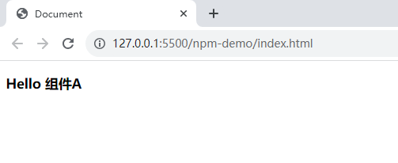

+ 在 `.html` 和 `.vue` 文件使用 `template` 选项编写的代码称为字符串模板

```vue
<!DOCTYPE html>
<html lang="en">

<head>
    <meta charset="UTF-8">
    <meta name="viewport" content="width=device-width, initial-scale=1.0">
    <title>Document</title>
    <script src="./node_modules/vue/dist/vue.global.js"></script>
</head>

<body>
    <div id="app">
        <my-component></my-component>
    </div>
    <script>
        const { createApp } = Vue

        const Content = {
            setup() {
                const number = 100;
                return { number }
            }
        }

        const app = createApp(Content);

        app.component('my-component', {
            // template中的字符串模板（引用组件没有Dom模板中的限制）
            template: "<ComponentA />" 
        })

        app.component('ComponentA', {
            template: '<h3>Hello 组件A</h3>'
        })

        app.mount("#app")
    </script>
</body>

</html>
```

+ 在 `.vue` 单文件组件（`SFC`）的 `<template>` 元素中编写的代码称为字符串模板

```vue
<script setup lang="ts">
    import ComponentA from './ComponentA.vue'
</script>

<template>
    <div>
        <ComponentA />
    </div>
</template>
```

## 异步组件

&emsp;&emsp;在大型项目中，可能需要拆分应用为更小的块，仅在需要时才从服务器加载相关组件。`Vue` 提供了 <font color=green>***defineAsyncComponent***</font> 方法来实现此功能：

```vue
<script setup lang="ts">
import { defineAsyncComponent } from 'vue';

const ComponentA = defineAsyncComponent(() => import('./ComponentA.vue'))
</script>

<template>
    <div>
        <ComponentA />
    </div>
</template>
```

## 基于 Vite 使用组件

&emsp;&emsp;首先使用 Vite 工具创建项目。

### 全局组件

&emsp;&emsp;打开 <font color=brown>***main.ts***</font> 文件，使用 `Vue` 实例的 `template` 选项来声明全局组件：

```typescript
import { createApp, ref } from 'vue'
import App from './App.vue'

const app = createApp(App);

// 创建全局组件
app.component('ComponentCount', {
    template: "<button @click='count++'>全局组件：{{count}}</button>",
    setup() {
        const count = ref(0);
        return {count}
    }
})

app.mount('#app')
```

&emsp;&emsp;然后在 <font color=brown>***App.vue***</font> 进行调用：

```vue
<script setup lang="ts">
</script>

<template>
  <ComponentCount />
</template>
```

> <font color=orange>**注意：**</font>
>
> 1. 提出问题
>
> &emsp;&emsp;运行后发现浏览器并没有渲染出对应的页面效果，打开浏览器控制台看到报了以下的警告信息：
>
> 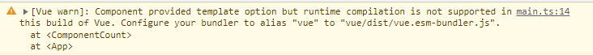
>
> &emsp;&emsp;翻译过来是：<font color=red>组件提供的 template 选项，但在 Vue 的这个版本中不支持运行时编译。配置你的打包器别名 "vue" 到 "vue/dist/vue.esm-bundler.js" </font>。
>
> 2. 原因分析
>
> &emsp;&emsp;通过 template 选项提供的模板将会在运行时即时编译，这只在使用了包含模板编译器的 `Vue` 构建版本的情况下才能够支持。`Vue` 为我们提供了多个构建版本（在 <font color=brown>***node_modules/vue/dist/***</font> 查看），而带有 runtime 的 `Vue` 构建版本未包含模板编译器（例如 `vue.runtime.esm-bundler.js`） 。在使用 Vite 构建工具时默认使用的构建版本是 `vue.runtime.esm-bundler.js` ，因此需要配置 `Vue` 使用不带 runtime 的运行时即时编译构建版本（`vue/dist/vue.esm-bundler.js`）。
>
> 3. 解决方法
>
> &emsp;&emsp;在 <font color=brown>***vite.config.ts***</font> 文件中添加如下配置：
>
> ```typescript
> import { fileURLToPath, URL } from 'node:url'
> 
> import { defineConfig } from 'vite'
> import vue from '@vitejs/plugin-vue'
> 
> // https://vitejs.dev/config/
> export default defineConfig({
>   plugins: [
>     vue(),
>   ],
>   resolve: {
>     alias: {
>       // 指定vue使用运行时即时编译构建版本，就可以使用 template 选项定义字符串模板
>       // 默认是：'vue/dist/vue.runtime.esm-bundler.js'
>       'vue': 'vue/dist/vue.esm-bundler.js', 
>     }
>   }
> })
> ```

&emsp;&emsp;也可以使用 `.vue` 单文件组件实现，首先创建 <font color=darkgray>***ComponentCount.vue***</font> 文件：

```vue
<script setup lang="ts">
import { ref } from 'vue';

const count = ref(0);
</script>

<template>
    <div>
        <button @click="count++">全局组件：{{count}}</button>
    </div>
</template>
```

&emsp;&emsp;然后修改 <font color=darkgray>***main.ts***</font> 文件中引入的全局组件：

```js
import { createApp } from 'vue'
import App from './App.vue'
import ComponentCount from '@/components/ComponentCount.vue'

const app = createApp(App);

app.component('ComponentCount', ComponentCount)

app.mount('#app')
```

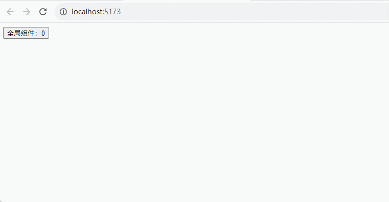

> <font color=orange>**注意：**</font> 使用单文件组件（`SFC`）的方式不存在 `template` 选项的问题，不需要配置 <font color=darkgray>***vite.config.ts***</font> 文件。

### 局部组件

&emsp;&emsp;在 <font color=brown>***App.vue***</font>  文件中注册局部组件：

```vue
<script>
export default {
  // 注册局部组件：只在当前组件中使用
  components: {
    'ComponentCount': {
      template: '<button @click="count++">局部组件：{{count}}</button>',
      data() {
        return {
          count: 0
        }
      }
    }
  }
}
</script>

<template>
  <ComponentCount/>
</template>
```

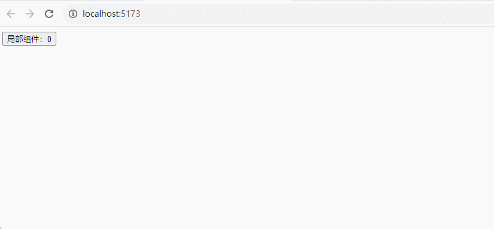

&emsp;&emsp;也可以使用 `.vue` 单文件组件来定义，首先修改  <font color=brown>***ComponentCount.vue***</font> 文件：

```vue
<script setup lang="ts">
import { ref } from 'vue';

const count = ref(0);
</script>

<template>
    <div>
        <button @click="count++">局部组件：{{count}}</button>
    </div>
</template>
```

&emsp;&emsp;然后在 <font color=brown>***App.vue***</font>  文件中修改注册的局部组件：

```vue
<script>
// 1. 导入组件
import ComponentCount from '@/components/ComponentCount.vue'

export default {
  components: {
    // 2. 注册为局部组件
    ComponentCount
  }
}
</script>

<template>
  <!-- 3. 使用局部组件 -->
  <ComponentCount/>
</template>
```

&emsp;&emsp;如果在 `<script setup>` 中导入单文件组件后，在模板中就可使用，不需要注册：

```vue
<script setup lang="ts">
// 1. 导入组件
import ComponentCount from '@/components/ComponentCount.vue'

</script>

<template>
  <!-- 2. 使用局部组件 -->
  <ComponentCount/>
</template>
```

### 总结

&emsp;&emsp;关于基于 Vite 使用组件的总结如下：

+ 全局组件和局部组件都推荐使用 `.vue` 单文件组件方式来定义组件，不推荐使用 `template` 选项来定义模板
+ 如果在 Vite 构建项目中使用了 `template` 定义模板，需要在 <font color=darkgray>***vite.config.ts***</font> 中配置 <font color=green>***'vue': 'vue/dist/vue.esmbundler.js'***</font> 来指定 Vue 使用运行时即时编译构建版本
+ 在 `<template></template>` 字符串模板中引用组件：
  + 可采用首字母大写、驼峰形式和短横形式方式引用
  + 推荐使用首字母大写方式
  + 可直接使用闭合标签
+ 在引用组件文件中，通过组件名引用组件即可

> <font color=orange>**注意事项：**</font>
>
> + 组件文件的 `<template>` 标签下，在 `Vue 2` 必须有且只有一个根节点，而在 `Vue 3` 可以有多个根节点
>+ 组件与组件之间是相互独立的，可以配置自己的一些选项资源（data、methods、computed 等等）
> + 默认情况下，组件与组件之间无法进行跨组件数据访问，父子组件也不行
>+ 思想：组件自己管理自己，不影响别人

# 组件间的通信方式

## props 向子组件传递数据

&emsp;&emsp;一个组件需要显式声明它所接受的 `props`，当子组件使用选项式 `API` 和 组合式 `API` 时候的方法是不同的：

+ <font color=orchid>**选项式 API：**</font> 使用 <font color=green>***props 选项***</font>
+ <font color=orchid>**组合式 API：**</font> 可以使用 <font color=green>***defineProps()***</font> 函数声明，也可以使用 <font color=green>***withDefaults()***</font> 设置默认值 （<font color=red>下面都是采用这种方式</font>）

```javascript
// 方式一：以数组的形式传入
defineProps(['foo'])

// 方式二：以对象的形式传入，并指定类型
defineProps({
  title: String,
  likes: Number
})

// 方式三：更细致地声明对传入的 props 的校验要求
defineProps({
  // 基础类型检查
  // （给出 `null` 和 `undefined` 值则会跳过任何类型检查）
  propA: Number,
    
  // 多种可能的类型
  propB: [String, Number],
    
  // 必传，且为 String 类型
  propC: {
    type: String,
    required: true
  },
    
  // Number 类型的默认值
  propD: {
    type: Number,
    default: 100
  },
    
  // 对象类型的默认值
  propE: {
    type: Object,
    // 对象或数组的默认值
    // 必须从一个工厂函数返回。
    // 该函数接收组件所接收到的原始 prop 作为参数。
    default(rawProps) {
      return { message: 'hello' }
    }
  },
    
  // 自定义类型校验函数
  propF: {
    validator(value) {
      // The value must match one of these strings
      return ['success', 'warning', 'danger'].includes(value)
    }
  },
    
  // 函数类型的默认值
  propG: {
    type: Function,
    // 不像对象或数组的默认，这不是一个
    // 工厂函数。这会是一个用来作为默认值的函数
    default() {
      return 'Default function'
    }
  }
})
```

&emsp;&emsp;所有的 props 都遵循着 <font color=red>单向绑定</font> 原则，props 因父组件的更新而变化，自然地将新的状态向下流往子组件，而不会逆向传递。下面以一个小案例说明使用方式：

&emsp;&emsp;首先在子组件 <font color=brown>***Demo17.vue***</font> 中创建 `Props`，这里结合了 `TypeScript` ，使用泛型参数方式：

```vue
<script setup lang="ts">
import { defineProps } from 'vue';

const props = defineProps<{
    id: Number, // 没有 ? 表示必传，父组件必须向此prop传递值
    name: String,
    isPublished?: Boolean, // ? 表示可选，父组件可以不向此prop传递值
    commentIds?: Number[],
    getEmp?: Function
}>();

const print = () => {
    // 访问 prop
    console.log('print', props.id, props.name, props.isPublished);
    props.getEmp && props.getEmp();
}

</script>

<template>
    <div>
        <h3>子组件</h3>
        <button @click="print">打印 props</button>
        <p>
            <!-- 模板中可省略 this ，直接prop名称可获取 -->
            id: {{ id }} - name: {{ name }} - {{ isPublished }}
        </p>
    </div>
</template>
```

> <font color=orange>**注意：**</font>
>
> 也可以将 props 的类型传入一个单独的接口：
>
> ```vue
> <script setup lang="ts">
> import { defineProps } from 'vue';
> 
> // 定义接口
> interface Props {
>     id: Number,
>     name: String,
>     isPublished?: Boolean, 
>     commentIds?: Number[],
>     getEmp?: Function 
> }
> // 将 props 的类型传入一个单独的接口
> const props = defineProps<Props>();
> 
> const print = () => {
>     // 访问 prop
>     console.log('print', props.id, props.name, props.isPublished);
>     props.getEmp && props.getEmp();
> }
> </script>
> 
> <template>
>     <div>
>         <h3>子组件</h3>
>         <button @click="print">打印 props</button>
>         <p>
>             <!-- 模板中可省略 this ，直接prop名称可获取 -->
>             id: {{ id }} - name: {{ name }} - {{ isPublished }}
>         </p>
>     </div>
> </template>
> ```

&emsp;&emsp;然后在父组件 <font color=brown>***App.vue***</font> 中为子组件中的 `Props` 传递值：

```vue
<script setup lang="ts">
import Demo17 from '@/components/Demo17.vue'
import { ref } from 'vue';

const name = ref("Jack");
const id = ref(0);

const changeName = () => {
  name.value = "Tom"
  id.value = 100
}
</script>

<template>
  <button @click="changeName()">changeName</button>
  <p>{{ name }}</p>
  <Demo17 :name="name" :id="id"/>
</template>
```

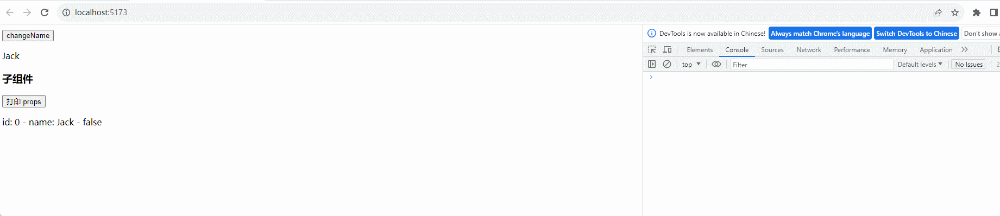

> <font color=orange>**注意：**</font>父组件向子组件传递 props 时，可以使用 `kebab-case` 横杠 和 `camelCase` 驼峰（在 DOM 模板不支持驼峰），`Vue` 官网推荐更贴近 HTML 的书写风格方式 `kebab-case` 横杠形式。

&emsp;&emsp;当使用 `defineProps` 的泛型参数声明时，我们就失去了为 `props` 声明默认值的能力，这可以通过 `withDefaults` 函数来解决：

```vue
<script setup lang="ts">
import { defineProps, withDefaults } from 'vue';

// 定义接口
interface Props {
    id: Number,
    name: String,
    isPublished?: Boolean,
    commentIds?: Number[],
    getEmp?: Function
}
    
// 通过 withDefaults 赋予初始值
const props = withDefaults(defineProps<Props>(), {
    id: 100,
    name: '张三',
    isPublished: false,
    commentIds: () => [2, 3],
    getEmp: () => {
        console.log('默认getEmp')
    }
});

const print = () => {
    // 访问 prop
    console.log('print', props.id, props.name, props.isPublished);
    props.getEmp && props.getEmp();
}

</script>

<template>
    <div>
        <h3>子组件</h3>
        <button @click="print">打印 props</button>
        <p>
            <!-- 模板中可省略 this ，直接prop名称可获取 -->
            id: {{ id }} - name: {{ name }} - {{ isPublished }}
        </p>
    </div>
</template>
```

&emsp;&emsp;这将被编译为等效的运行时 `props default` 选项，此外，`withDefaults` 帮助程序为默认值提供类型检查，并确保返回的 `props` 类型删除了已声明默认值的属性的可选标志。

> <font color=orange>**props 数据传递注意事项：**</font>
>
> + props 只用于子组件接收父组件传递的数据
> + 引用子组件时，组件标签上绑定的所有属性都会认为是传递给子组件的 prop
> + 子组件在 `<template>` 模板页面中可以直接引用 prop
> + 问题：
>   + 如果需要向非子后代传递数据，必须多层逐层传递prop
>   + 兄弟组件间也不能直接 prop 通信，必须借助父组件才可以
>
> 
>
> <font color=orange>**组件间通信规则：**</font>
>
> + 不要在子组件中直接修改父组件传递的数据
> + 数据初始化时，应当看初始化的数据是否用于多个组件中，如果需要被用于多个组件中，则初始化在父组件中；如果只在一个组件中使用，那就初始化在这个要使用的组件中
> + 数据初始化在哪个组件，更新数据的方法就应该定义在哪个组件

## 自定义事件

&emsp;&emsp;通过自定义事件可以实现子组件向父组件传递数据，组件可以显式地通过 <font color=green>***defineEmits()***</font> 宏来声明它要触发的事件：

```vue
<script setup lang="ts">
import {defineEmits, ref} from 'vue'

// 使用·纯类型标注·来声明触发的事件
/*const emit = defineEmits<{
(e: 'searchGoods', keyword: string, param2?: string): void
(e: 'submit', id: number): void
}>();*/
const emit = defineEmits(["changeCount"]);
const count = ref<number>(10);

const handleAdd = () => {
    count.value++
    emit('changeCount', count);
}

onMounted(() => {
    handleAdd()
})
</script>

<template>
    <div>
        <p>子组件中的 count: {{count}}</p>
        <button @click="handleAdd">+1</button>
    </div>
</template>
```

> <font color=orange>**提示：**</font>
>
> 也可以类型标注来声明触发的事件：
>
> ```vue
> <script setup lang="ts">
> import {defineEmits, onMounted, ref} from 'vue'
> 
> const emit = defineEmits<{
>     (e: 'changeCount', c: number): void
> }>();
> 
> const count = ref<number>(10);
> 
> const handleAdd = () => {
>     count.value++
>     emit('changeCount', count.value);
> }
> 
> onMounted(() => {
>     handleAdd()
> })
> </script>
> 
> <template>
>     <div>
>         <p>子组件中的 count: {{count}}</p>
>         <button @click="handleAdd">+1</button>
>     </div>
> </template>
> ```

&emsp;&emsp;然后在父组件中调用子组件的时候通过监听事件的方式进行调用：

```vue
<script setup lang="ts">
import Demo17 from '@/components/Demo17.vue'
import { ref } from 'vue';

const num = ref<number>()

const handleChange = (c: number) => {
  num.value = c
}

</script>

<template>
  <div>
    <p>父组件中的 num: {{num}}</p>
    <Demo17 @change-count="handleChange" />
  </div>
</template>
```

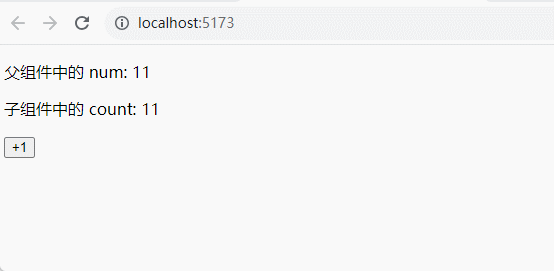

> <font color=orange>**注意：**</font>
>
> + 自定义事件只用于子组件向父组件发送消息（数据）
> + 隔代组件或兄弟组件间通信此种方式不合适
> + 在父组件模板中可以使用 `kebab-case` 横杠 和 `camelCase` 驼峰来绑定事件监听器，`Vue` 官网推荐使用 `kebab-case` 形式（`@update-member="updateMember"`）
> + 关于选项式 `API` 和 组合式 `API` 的使用：
>   + 选项式 `API` 使用 `$emit` 选项
>   + 组合式 `API` 使用 `defineEmits` 函数

## 非父子组件间通信

&emsp;&emsp;从父组件向子组件传递数据时会使用 `props`，当某个深层的子组件需要一个较远的祖先组件中的部分数据时，使用 `props` 就必须将其沿着组件链逐级传递下去，这会非常麻烦。

### 依赖注入

&emsp;&emsp;使用依赖注入可以解决这一问题，一个父组件相对于其所有的后代组件，会作为 <font color=red>依赖提供者（provide）</font>，任何后代都可以 <font color=red>注入（inject）</font> 由父组件提供给整条链路的依赖。

<font color=orachid>**（一）provide**</font>

&emsp;&emsp;为组件后代提供数据需要使用到 <font color=green>***provide()***</font> 函数，该函数接受两个参数：

+ 第一个参数是注入名，可以是一个字符串或是一个 `Symbol`，后代组件会用注入名来查找期望注入的值，一个组件可以多次调用 `provide()`，使用不同的注入名注入不同的依赖值
+ 第二个参数是提供的值，值可以是任意类型

```vue
<script setup lang="ts">
import Demo18 from '@/components/Demo18.vue'
import { provide, ref } from 'vue';

const count = ref<number>(0);
provide('count', count);
</script>

<template>
  <div>
    <p>父组件中的 count：{{count}}</p>
    <button @click="count++">+1</button>
    <Demo18/>
  </div>
</template>
```

> <font color=orange>**注意：**</font>
>
> &emsp;&emsp;除了在一个组件中提供依赖，还可以在整个应用层面提供依赖：
>
> ```javascript
> import { createApp } from 'vue'
> 
> const app = createApp({})
> app.provide('message', 'hello!')
> ```
>
> &emsp;&emsp;应用级别提供的数据在该应用内的所有组件中都可以注入，这在编写插件时会特别有用，因为插件一般都不会使用组件形式来提供值。

<font color=orachid>**（二）inject**</font>

&emsp;&emsp;要注入上层组件提供的数据需要使用 <font color=green>***inject()***</font> 函数：

```vue
<script setup lang="ts">
import { inject } from 'vue';

const count = inject('count')
</script>
<template>
    <div>
        <p>后代组件中 count: {{count}}</p>
    </div>
</template>
```

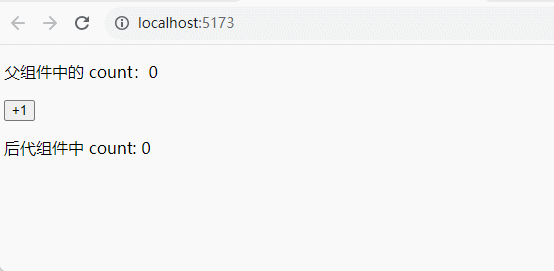

> <font color=orange>**注意：**</font>如果在注入一个值时不要求必须有提供者，那么应该声明一个默认值：
>
> ```javascript
> // 如果没有祖先组件提供 "message" 在给出默认值
> const value = inject('message', '这是默认值')
> 
> // 在一些场景中，默认值可能需要通过调用一个函数或初始化一个类来取得
> const value = inject('key', () => new ExpensiveClass())
> ```

&emsp;&emsp;<font color=red>建议尽可能将任何对响应式状态的变更都保持在供给方组件中</font>，这样可以确保所提供状态的声明和变更操作都内聚在同一个组件内，使其更容易维护。但有的时候，可能需要在注入方组件中更改数据，这时候推荐在供给方组件内声明并提供一个更改数据的方法函数：

```vue
<script setup lang="ts">
import Demo18 from '@/components/Demo18.vue'
import { provide, ref } from 'vue';

const count = ref<number>(0);
const changeCount = () => {
  count.value++
}

provide('count', {
  count,
  changeCount
});
</script>

<template>
  <div>
    <p>父组件中的 count：{{count}}</p>
    <button @click="changeCount">父组件中的 +1 </button>
    <Demo18/>
  </div>
</template>
```

&emsp;&emsp;然后在注入方组件中进行注入：
```vue
<script setup lang="ts">
import { inject } from 'vue';

const {count, changeCount} = inject('count')
</script>
<template>
    <div>
        <p>后代组件中 count: {{count}}</p>
        <button @click="changeCount">后代组件中的+1</button>
    </div>
</template>
```

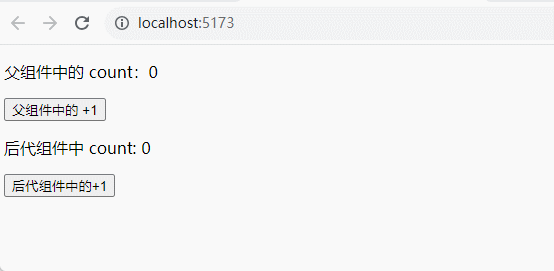

&emsp;&emsp;如果想确保提供的数据不能被注入方的组件更改，可以使用 `readonly()` 来包装提供的值：

```javascript
import { ref, provide, readonly } from 'vue'

const count = ref(0)
provide('read-only-count', readonly(count))
```

### PubSubJS

&emsp;&emsp;还可以通过 <font color=green>***PubSubJS***</font> 库来实现非父子组件之间的通信 ，使用 `PubSubJS` 的消息发布与订阅模式来进行数据的传递。

> <font color=orange>**注意：**</font>必须先执行订阅事件（subscribe），然后才能发布（publish）事件。

1. 首先需要通过 <font color=green>***npm install pubsub-js***</font> 命令来下载库
2. 在 <font color=darkgray>***main.js***</font> 中导入

```javascript
import './assets/main.css'
import PubSub from 'pubsub-js'

import { createApp } from 'vue'
import App from './App.vue'

createApp(App).mount('#app')
```

3. 发布消息

```vue
<script setup>
import {ref} from 'vue'
import AboutView from './components/AboutView.vue'

const counter = ref(0)

const handleAdd = () => {
  counter.value++
  // 发布消息
  PubSub.publish('change-counter', counter)
}

</script>

<template>
  <div>
    <about-view></about-view>
    <button @click="handleAdd">+1</button>
  </div>
</template>
```

4. 订阅消息

```vue
<script setup>
import {ref} from 'vue'

const number = ref(0)
PubSub.subscribe('change-counter', function(event, data) {
    number.value = data
})
</script>

<template>
    <div>
        <p>AboutView: {{number}}</p>
    </div>
</template>
```

##  defineExpose()

&emsp;&emsp;`defineExpose()` 方法用于子组件导出状态或方法给父组件进行操作。

> <font color=orange>**注意：**</font>如果子组件使用选项式 API 则不需要导出，父组件直接可操作属性和方法。`data` 中定义的状态属性和 `methods` 中定义的方法等都是公开，父组件可以直接访问到属性或方法。

&emsp;&emsp;在组合式 API 中子组件是默认关闭的，在 `<script setup>` 中声明的任何属性、方法等都是不公开，默认父组件不可以直接访问。这时候可以通过`defineExpose` 方法显式指定在 `<script setup>` 组件中要暴露出去的属性和方法，导出后父组件可以操作子组件属性和方法。

<font color=orachid>**（一）选项式 API**</font>

&emsp;&emsp;首先在子组件中使用的是选项式 API（不需要额外导出操作）：

```vue
<script lang="ts">
export default {
    data() {
        return {
            count: 10,
            name: "张三"
        }
    },
    methods: {
        changeCount() {
            this.count++;
        }
    }
}
</script>

<template>
    <div>
        <p>count: {{count}}</p>
    </div>
</template>
```

&emsp;&emsp;然后在父组件中可以通过 `ref` 模板引用的方式可以直接访问子组件实例的状态和方法：

```vue
<script setup lang="ts">
import Demo20 from '@/components/Demo20.vue'
import {onMounted, ref } from 'vue';

const demo20Ref = ref()

const name = ref("")

onMounted(() => {
  name.value = demo20Ref.value?.name
})

</script>

<template>
  <div>
    <Demo20 ref="demo20Ref"/>
    <p>name: {{name}}</p>
    <button @click="demo20Ref.changeCount">+1</button>
  </div>
</template>
```

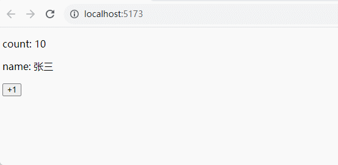

<font color=orachid>**（二）组合式 API**</font>

&emsp;&emsp;在子组件中使用的是 `<script setup>` 组合式 API，这时需要使用 `defineExpose()` 导出的状态和方法，父组件才可以使用：

```vue
<script setup lang="ts">
import { ref } from 'vue';


const count = ref<number>(10);
const name = ref<string>("张三");
const changeCount = () => {
    count.value++
}

defineExpose({
    count,
    name,
    changeCount
})
</script>

<template>
    <div>
        <p>count: {{count}}</p>
    </div>
</template>
```

&emsp;&emsp;然后在父组件中通过 `ref` 模板引用的方式获取到子组件的实例（`ref` 会和在普通实例中一样被自动解包）：

```vue
<script setup lang="ts">
import Demo20 from '@/components/Demo20.vue'
import {nextTick, ref } from 'vue';

const demo20Ref = ref()

const name = ref("")

nextTick(() => {
  name.value = demo20Ref.value?.name
})


</script>

<template>
  <div>
    <Demo20 ref="demo20Ref"/>
    <p>name: {{name}}</p>
    <button @click="demo20Ref.changeCount">+1</button>
  </div>
</template>
```

> <font color=orange>**注意：**</font>`defineProps() `、` withDefaults() `、` defineEmits() `、 `defineExpose()` 这些函数必须直接放置在 `<script setup>` 的顶级作用域下，不能在子函数中使用。

# 插槽

&emsp;&emsp;插槽主要用于父组件向子组件传递 <font color=red>标签+数据</font>，上面的 props 和自定事件只是传递数据。

## 基本使用方式

1. 首先在子组件中创建插槽

```vue
<script setup lang="ts">

</script>

<template>
  <div>
    <p>插槽之前的内容</p>
    <!-- 插槽 -->
    <slot></slot>
    <p>插槽之后的内容</p>
  </div>
</template>
```

2. 在组件中调用子组件的时候向插槽传入内容

```vue
<script setup lang="ts">
import Demo21 from './components/Demo21.vue'
</script>

<template>
  <div>
    <Demo21>
      <!-- 插槽赋值 -->
      <p>插入到插槽中的内容</p>
    </Demo21>
  </div>
</template>
```

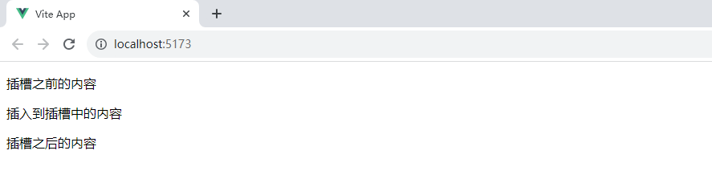

## 默认内容

&emsp;&emsp;在外部没有提供任何内容的情况下，可以为插槽指定默认内容：

```vue
<script setup lang="ts">

</script>

<template>
  <div>
    <p>插槽之前的内容</p>
    <!-- 插槽 -->
    <slot>
      <!-- 默认内容 -->
      <p>默认内容</p>
    </slot>
    <p>插槽之后的内容</p>
  </div>
</template>
```

> <font color=orange>**注意：**</font>如果提供了插槽内容，那么显式提供的内容会替代默认内容。 

## 具名插槽

&emsp;&emsp;有时在一个组件中会包含多个插槽，可以通过 <font color=green>***slot***</font> 元素的 <font color=green>***name***</font> 属性给各个插槽分配唯一的 ID，以确定每一处要渲染的内容：

```vue
<script setup lang="ts">

</script>

<template>
  <div>
    <header>
      <slot name="header"></slot>
    </header>
    <main>
      <slot name="main"></slot>
    </main>
    <footer>
      <slot name="footer"></slot>
    </footer>
  </div>
</template>
```

&emsp;&emsp;这类带 name 的插槽被称为 <font color=red>具名插槽（named slots）</font>，没有提供 name 的会隐式地命名为 <font color=red>default</font>。在父组件中使用时，需要一种方式将多个插槽内容传入到各自目标插槽的出口。此时就需要用到具名插槽了，要为具名插槽传入内容，就需要使用一个含 <font color=green>***v-slot***</font> 指令（简写 <font color=green>***#***</font>）的 `<template>` 元素，并将目标插槽的名字传给该指令：

```vue
<script setup lang="ts">
import Demo21 from './components/Demo21.vue'
</script>

<template>
  <div>
    <Demo21>
      <template v-slot:header>
        <h1>这里是头部插槽的内容</h1>
      </template>
      <template #main>
        <p>这里是主体插槽的内容</p>
      </template>
      <template #footer>
        <strong>这里是页脚插槽的内容</strong>
      </template>
    </Demo21>
  </div>
</template>
```

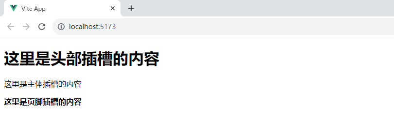

## 作用域插槽

&emsp;&emsp;在某些场景下，插槽的内容可能想要同时使用父组件域内和子组件域内的数据。要做到这一点，就需要一种方法来让子组件在渲染时将一部分数据提供给插槽。可以像对组件传递 props 那样，向一个插槽的出口上传递 attributes。

<font color=orachid>**（一）默认插槽**</font>

&emsp;&emsp;首先传递值：

```vue
<script setup lang="ts">
import {ref} from 'vue'

const counter = ref(0)
</script>

<template>
  <div>
    <slot :counter="counter"></slot>
    <button @click="counter++">+1</button>
  </div>
</template>
```

&emsp;&emsp;当使用默认插槽接收插槽 props 时，通过子组件标签上的 `v-slot` 指令直接接收到了一个插槽 props 对象：

```vue
<script setup lang="ts">
import Demo21 from './components/Demo21.vue'
</script>

<template>
  <div>
    <Demo21 v-slot="slotProps">
      <p>{{slotProps.counter}}</p>
    </Demo21>
  </div>
</template>
```

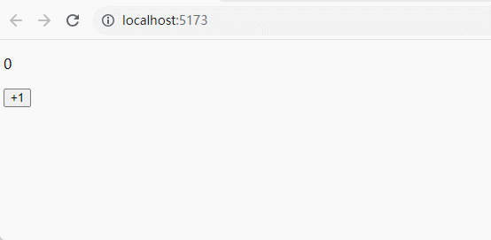

&emsp;&emsp;也可以在 `v-slot` 中使用解构：

```vue
<script setup>
import AboutView from './views/AboutView.vue'
</script>

<template>
  <div>
    <about-view v-slot="{counter}">
      <p>{{counter}}</p>
    </about-view>
  </div>
</template>
```

<font color=orachid>**（二）具名插槽**</font>

&emsp;&emsp;使用具名作用域插槽的工作方式也是类似的，首先传递值：

```vue
<script setup lang="ts">
import {ref} from 'vue'

const counter = ref(0)
</script>

<template>
  <div>
    <slot name="header" title="头部插槽"></slot>
    <slot name="main" :counter="counter"></slot>
  </div>
</template>
```

&emsp;&emsp;插槽 props 可以作为 `v-slot` 指令的值被访问到：<font color=green>***v-slot:name="slotProps"***</font>。

```vue
<script setup lang="ts">
import Demo21 from './components/Demo21.vue'
</script>

<template>
  <div>
    <Demo21>
      <template #header="{title}">
        <h1>{{title}}</h1>
      </template>
      <template #main="{counter}">
        <p>{{counter}}</p>
      </template>
    </Demo21>
  </div>
</template>
```

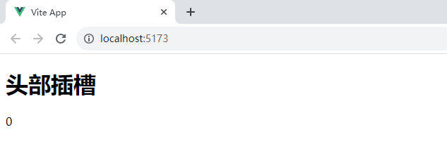
