&emsp;&emsp;内置组件就是官方封装的全局组件，不需要手动导入，直接拿来用就可以了。

# Component 动态切换组件

&emsp;&emsp;有些场景会需要在两个组件间来回切换，可以使用 \<component :is="..."\> 来在多个组件间作切换，被切换掉的组件会被卸载：

+ `component` 是 Vue 的内置组件，不需要注册可以直接使用
+ `component` 的 `:is` 的值可以是以下几种：
  + 被注册的组件名 （字符串）
  + 导入的组件对象

&emsp;&emsp;下面以一个案例说明使用过程，首先创建热门回答组件 <font color=brown>***src/components/Demp22/HotQuestion.vue***</font> ：

```vue
<script setup lang="ts">
import { onMounted, onUnmounted } from 'vue';

onMounted(() => {
    console.log("HotQuestion 热门回答被加载");
})

onUnmounted(() => {
    console.log("HotQuestion 热门回答被卸载");
})
</script>

<template>
    <div>
        <p>热门回答区域</p>
    </div>
</template>
```

&emsp;&emsp;然后创建最新问答组件 <font color=brown>***src/components/Demp22/NewQuestion.vue***</font> ：

```vue
<script setup lang="ts">
    
</script>

<template>
    <div>
        <p>最新回答区域</p>
    </div>
</template>
```

&emsp;&emsp;然后创建等待问答区域组件 <font color=brown>***src/components/Demp22/WaitQuestion.vue***</font> ：

```vue
<script setup lang="ts">
    
</script>

<template>
    <div>
        <p>等待回答区域</p>
    </div>
</template>
```

&emsp;&emsp;然后修改 <font color=brown>***App.vue***</font> 文件（`el-ta` 是 `element-plus` 的部件）：

```vue
<script setup lang="ts">
import { shallowRef } from 'vue';
import HotQuestion from './components/Demp22/HotQuestion.vue';
import NewQuestion from './components/Demp22/NewQuestion.vue';
import WaitQuestion from './components/Demp22/WaitQuestion.vue';

// 使用 shallowRef（浅层ref）避免组件被深入观察
const current = shallowRef(HotQuestion)

const tabs = [
  { title: '热门回答', comp: HotQuestion },
  { title: '最新问答', comp: NewQuestion },
  { title: '等待回答', comp: WaitQuestion }
]

</script>

<template>
  <div>
    <el-tag style="cursor: pointer; margin-left: 10px;" v-for="(item, index) in tabs" :key="index" class="ml-3" type="success" @click="current = item.comp">{{item.title}}</el-tag>
    <component :is="current"></component>
  </div>
</template>
```

&emsp;&emsp;运行效果如下：

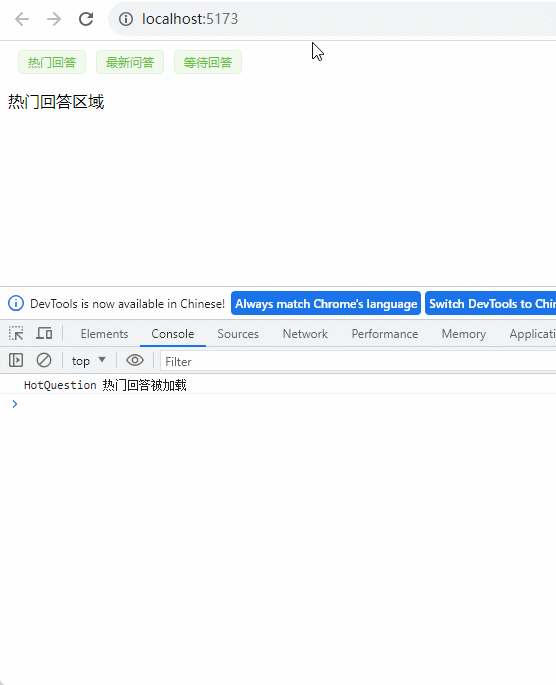

&emsp;&emsp;观察热门回答组件中的生命周期钩子打印的日志，当使用 `<component :is="...">` 来在多个组件间作切换时，被切换掉的组件会被卸载（可以通过 \<KeepAlive\> 组件将被切换掉的组件仍然保持存活状态）。

#  KeepAlive **缓存被移除的组件实例**

<font color=orachid>**（一）基本使用方式**</font>

&emsp;&emsp;通过 `<component :is="xxx">` 将当前组件切换后，当前组件实例会被卸载，从而丢失所有已变化的状态。使用 `KeepAlive` 可以缓存被移除的组件实例，缓存好处是可以缓存路由组件实例，切换后不用重新加载数据，从而提高用户体验。

&emsp;&emsp;修改 <font color=brown>***HotQuestion.vue***</font> 文件：

```vue
<script setup lang="ts">
import { onMounted, onUnmounted ,ref } from 'vue';
onMounted(() => {
    console.log("HotQuestion 热门回答被加载");
})

onUnmounted(() => {
    console.log("HotQuestion 热门回答被卸载");
})

const count = ref(0)
</script>

<template>
    <div>
        <p>热门回答区域</p>
        <p>count: {{count}}</p>
        <button @click="count++">+1</button>
    </div>
</template>
```

&emsp;&emsp;然后修改 `NewQuestion.vue` 组件，在其中添加一个输入框并绑定状态：

```vue
<script setup lang="ts">
import {ref} from 'vue'
const content = ref('')
</script>

<template>
    <div>
        <p>最新回答区域</p>
        <input type="text" v-model="content">
    </div>
</template>
```

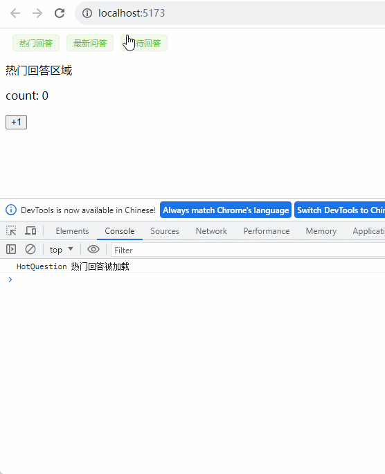

&emsp;&emsp;当点击切换页面后，`count` 的值变回了 0，输入框的 `content` 值也变为了空。如果希望在组件切换后已变化的状态也能被保留，可以用 Vue 的内置组件 `<KeepAlive>` 将这些动态组件进行包装。修改 <font color=brown>***App.vue***</font> 文件：

```vue
<template>
  <div>
    <el-tag style="cursor: pointer; margin-left: 10px;" v-for="(item, index) in tabs" :key="index" class="ml-3" type="success" @click="current = item.comp">{{item.title}}</el-tag>
    <!-- 将动态切换的组件缓存起来, keepAlive 中不能有注释 -->
    <KeepAlive>
      <component :is="current"></component>
    </KeepAlive>
  </div>
</template>
```

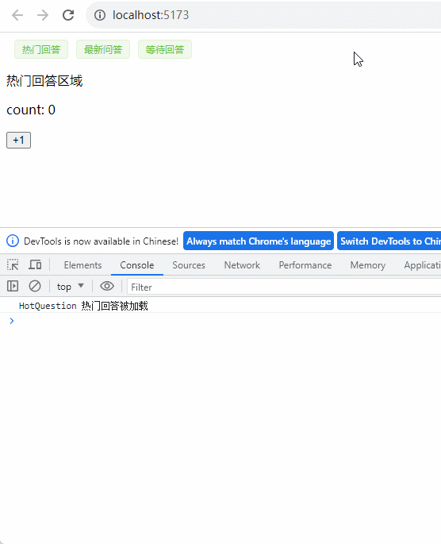

&emsp;&emsp;此时改变后的 `count` 和 `content` 值在切换页后就被保留下来了。

<font color=orachid>**（二）包含 / 排除（include / exclude）**</font>

&emsp;&emsp;`<KeepAlive>` 默认会缓存内部的所有组件实例，但是实际应用场景中并不是所有组件都需要缓存，其中的有些组件可能不需要缓存。此时可以通过 `include` 和 `exclude` 来定制该行为。这两个 `prop` 的值都可以是 <font color=red>一个以英文逗号分隔的字符串、正则表达式 和 包含这两种类型的数组，值匹配的是子组件的 name 选项值</font>：

+ <font color=orchid>**include：**</font>指定需要缓存的组件
+ <font color=orchid>**exclude：**</font>指定不需要缓存的组件

> <font color=orange>**注意：**</font>`include` 和 `exclude` 只要写其中一个就行，没在 prop 中指定的组件就是反之意思。

&emsp;&emsp;首先需要为组件指定 `name` 选项值，然后才能为 `include` 和 `exclude` 属性值指定匹配的 `name` 选项值：

```vue
<script lang="ts">
export default {
    name: 'NewQuestion'
}
</script>
```

> <font color=orange>**注意：**</font>使用 `<script setup>` 的单文件组件会自动根据文件名生成同名的 `name` 选项值，因此无需再进行上面的手动声明。

&emsp;&emsp;然后在 <font color=brown>***App.vue***</font> 文件中添加如下代码（假设这里只对 `NewQuestion` 组件进行缓存）：

```vue
<template>
  <div>
    <el-tag style="cursor: pointer; margin-left: 10px;" v-for="(item, index) in tabs" :key="index" class="ml-3" type="success" @click="current = item.comp">{{item.title}}</el-tag>
    <!-- 1. 值是英文逗号分隔的字符串  include="HotQuestion,NewQuestion" -->
    <!-- 2. 值是正则表达式 (需使用 `v-bind`)  :include="/HotQuestion|NewQuestion/"-->
	<!-- 3. 值是数组 (需使用 `v-bind`) -->
    <KeepAlive :include="['NewQuestion']">
      <component :is="current"></component>
    </KeepAlive>
  </div>
</template>
```

&emsp;&emsp;也可以使用 `exclude` 来排除缓存的组件：

```vue
<template>
  <div>
    <el-tag style="cursor: pointer; margin-left: 10px;" v-for="(item, index) in tabs" :key="index" class="ml-3" type="success" @click="current = item.comp">{{item.title}}</el-tag>
    <KeepAlive :exclude="/HotQuestion|WaitQuestion/">
      <component :is="current"></component>
    </KeepAlive>
  </div>
</template>
```

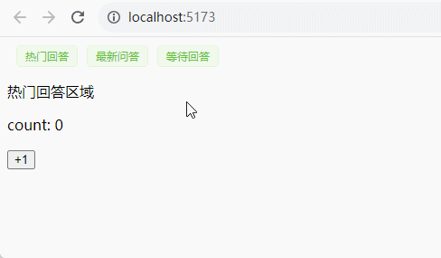

<font color=orachid>**（三）最大缓存实例数**</font>

&emsp;&emsp;可以通过传入 `max` 属性来限制可被缓存的最大组件实例数，`<KeepAlive>` 的行为在指定了 `max` 后，如果缓存的实例数量即将超过指定的那个最大数量，则最久没有被访问的缓存实例将被销毁，以便为新的实例腾出空间：

```vue
<KeepAlive :include="['HotQuestion', 'NewQuestion', 'WaitQuestion']" :max="2">
	<component :is="currentTab" class="tab"></component>
</KeepAlive>
```

<font color=orachid>**（四）缓存实例的生命周期**</font>

&emsp;&emsp;如果一个组件实例从 DOM 上移除了，但因为被 `<KeepAlive>` 缓存而仍作为组件树的一部分时，它将变为不活跃状态而不是被卸载。当一个组件实例作为缓存树的一部分插入到 DOM 中时，它将重新被激活。一个持续存在的组件可以通过 `onActivated()` 和 `onDeactivated()` 注册相应的两个状态的生命周期钩子：

```vue
<script setup lang="ts">
import { onMounted, onUnmounted, ref, onActivated, onDeactivated } from 'vue';


onMounted(() => {
    console.log("HotQuestion 热门回答被加载");
})

onUnmounted(() => {
    console.log("HotQuestion 热门回答被卸载");
})

const count = ref(0)

// 动态组件缓存钩子
onActivated(() => {
    // 调用时机为首次挂载，以及每次从缓存中被重新插入时
    console.log('调用时机：组件首次挂载, 以及每次从缓存中被重新插入时')
})
// 动态组件缓存钩子
onDeactivated(() => {
    // 在从 DOM 上移除进入缓存，以及组件卸载时调用
    console.log('调用时机：在从 DOM 上移除进入缓存，以及组件卸载时调用')
})
</script>

<template>
    <div>
        <p>热门回答区域</p>
        <p>count: {{ count }}</p>
        <button @click="count++">+1</button>
    </div>
</template>
```

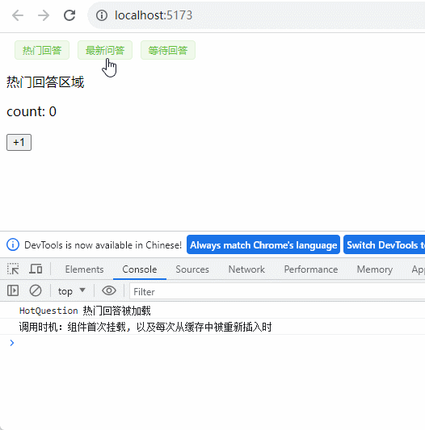

> <font color=orange>**注意：**</font>`onActivated` 在组件挂载时也会调用，`onDeactivated` 在组件卸载时也会调用。

# 单元素过渡 & 动画效果

&emsp;&emsp;Vue 提供了两个内置组件，用于制作基于状态变化的过渡和动画：

+ <font color=orchid>Transition：</font> 会在一个元素或组件进入和离开 DOM 时应用动画
+ <font color=orchid>TransitionGroup：</font> 会在一个 `v-for` 列表中的元素或组件被插入、移动或移除时应用动画

 ## Transition 组件

&emsp;&emsp;`Transition` 是一个内置组件，这意味着它在任意别的组件中都可以被使用，无需注册，使元素在显示（进入）和隐藏（离开）时实现过渡或者动画的效果。进入或离开可以由以下的条件之一触发：

+ 由 `v-if` 所触发的切换
+ 由 `v-show` 所触发的切换
+ 由特殊元素 `<component :is="组件名">` 切换的动态组件
+ 改变特殊的 `key` 属性

&emsp;&emsp;使用 `<Transition>` 组件和 `CSS` 来实现过渡和动画效果，具体实现步骤如下：

+ 首先在 `CSS` 中操作 `trasition` （过渡 ）或 `animation` （动画）达到不同效果
+ 为目标元素上添加一个父元素 `<trasition name='xxx'>` ，`name` 属性用于声明一个过渡效果名，通过此效果名会自动去 `CSS` 中匹配 对应的类名样式（<font color=red>不指定 name 属性值，默认是 v</font> ）
+ 在过渡与动画时，会动态的为对应元素添加的相关 `class` 类名
  + <font color=orchid>**xxx-enter-from：**</font>定义显示前的效果
  + <font color=orchid>**xxx-enter-active：**</font>定义显示过程的效果
  + <font color=orchid>**xxx-enter-to：**</font>定义显示后的效果
  + <font color=orchid>**xxx-leave-from：**</font>定义隐藏前的效果
  + <font color=orchid>**xxx-leave-active：**</font>定义隐藏过程的效果
  + <font color=orchid>**xxx-leave-to：**</font>定义隐藏后的效果

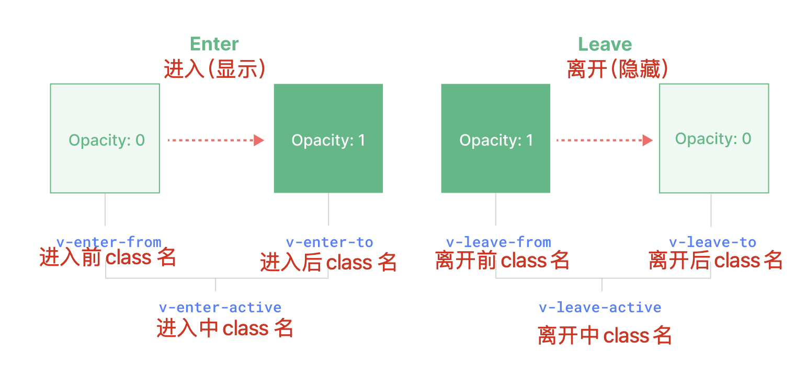

<font color=orachid>**（一）过渡效果案例**</font>

```vue
<script setup lang="ts">
import { ref } from 'vue'

const show = ref(false);

const changeState = () => {
  show.value = !show.value;
}

</script>

<template>
  <div>
    <button @click="changeState()">change</button>
    <Transition name="andy">
      <p v-if="show">hello</p>
    </Transition>
  </div>
</template>

<style scoped>
.andy-enter-active {
  transition: all 0.3s;
}

.andy-leave-active {
  transition: all 0.8s;
}

.andy-enter-from,
.andy-leave-to {
  transform: translateX(20px);
  opacity: 0;
}
</style>
```

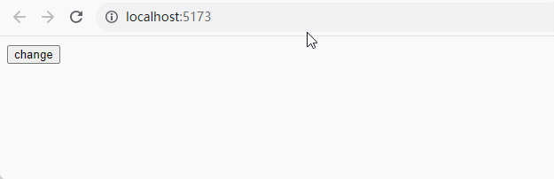

<font color=orachid>**（二）动画效果案例**</font>

```vue
<script setup lang="ts">
import {ref} from 'vue'

const show = ref(false);

const changeState = () => {
  show.value = ! show.value;
}

</script>

<template>
  <div>
    <button @click="changeState()">change</button>
    <Transition name="andy">
      <p v-if="show">Hello World!!!</p>
    </Transition>
  </div>
</template>

<style>

.andy-enter-active {
  animation: bound-in 1s;
}

.andy-leave-active {
  animation: bound-in 2s reverse;
}

@keyframes bound-in {
  0% {
    transform: scale(0);
  }
  50% {
    transform: scale(1.5);
  }
  100% {
    transform: scale(1);
  }
}
</style>
```

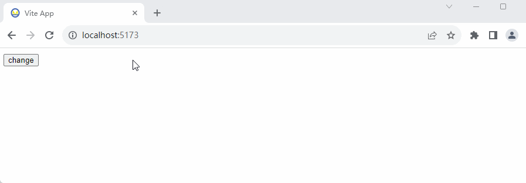

<font color=orachid>**（三）过渡模式**</font>

&emsp;&emsp;默认情况下在切换显示不同元素或组件时，元素或组件的进入和离开动画会同时出现，造成页面效果混乱不丝滑，可以在 `<Transition>` 组件上指定过渡模式（即添加 `mode="out-in"` 属性可解决上述此问题）。

+ 首先创建 A、B 组件

```vue
<!--CompA.vue-->
<template>
    <h3>
        组件 A
    </h3>
</template>

<!--CompB.vue-->
<template>
    <h3>
        组件 B
    </h3>
</template>
```

+ 在 <font color=darkgray>***App.vue***</font> 中创建演示动态组件过渡

```vue
<!--动态组件过渡 -->
<script setup lang="ts">
import { shallowRef } from 'vue'
import CompA from './components/Demo25/CompA.vue'
import CompB from './components/Demo25/CompB.vue'

const current = shallowRef(CompA);
</script>

<template>
  <label>
    <input type="radio" v-model="current" :value="CompA"> A
  </label>
  <label>
    <input type="radio" v-model="current" :value="CompB"> B
  </label>
  <Transition name="andy">
    <component :is="current"></component>
  </Transition>
</template>

<style coped>
.andy-enter-active,
.andy-leave-active {
  transition: opacity 2s;
}

.andy-enter-from,
.andy-leave-to {
  opacity: 0;
}
</style>
```

&emsp;&emsp;运行页面后实现的效果如下：

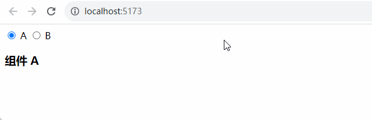

&emsp;&emsp;元素的进入和离开动画都是在同时开始（切换到组件 B 时，页面上会同时出现 A 组件离开动画和 B 组件进入动画），这样会比较混乱。此时希望的结果是在离开动画执行完后，再执行进入动画（切换到组件 B 时，A 组件离开动画执行完后，再执行 B 组件进入动画），可以通过向 `<Transition>` 传入一个`mode="out-in"` 来实现这个行为：

```vue
<template>
  <label>
    <input type="radio" v-model="current" :value="CompA"> A
  </label>
  <label>
    <input type="radio" v-model="current" :value="CompB"> B
  </label>
  <!-- mode="out-in" 在离开动画执行完后，再执行进入动画 -->
  <Transition name="andy" mode="out-in">
    <component :is="current"></component>
  </Transition>
</template>
```

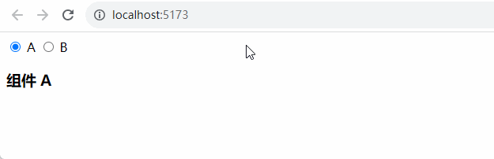

> <font color=orange>**问题：**</font>如果发现加上 `mode="out-in"` 后，页面切换回来后会变成空白的问题。这是因为每个路由组件的模板 `<template>` 下只能有一个根元素，不能有多个根元素且第一行也不能是注释（`<template><div>只有1个根元素</div></template>`），下面的写法是错误的：
>
> ```html
> <template>
> <!-- 第一行不能是注释 -->
> <div>第1个根元素</div>
> <div>第2个根元素</div>
> </template>
> ```

## TransitionGroup  组件

&emsp;&emsp;`TransitionGroup` 是一个内置组件，用于对 `v-for` 列表中的元素或组件的插入、移除和顺序改变添加动画效果。

```vue
<script setup lang='ts'>
import { reactive } from 'vue'

const items = reactive([1, 2, 3, 4, 5]);

const add = () => {
  items.push(items.length + 1);
}

const remove = () => {
  const i = Math.floor(Math.random() * items.length);
  if (i > -1) items.splice(i, 1);
}

</script>
<template>
  <div>
    <el-button type="success" @click="add">追加一个元素</el-button>
    <el-button type="danger" @click="remove">随机移除一个元素</el-button>
    <!-- v-for 列表中的元素或组件被插入，移动，或移除时应用动画 -->
    <TransitionGroup name="list">
      <li v-for="item in items" :key="item">
        {{ item }}
      </li>
    </TransitionGroup>
  </div>
</template>
<style scoped>
.list-enter-active,
.list-leave-active {
  transition: all 0.5s ease;
}

.list-enter-from,
.list-leave-to {
  opacity: 0;
  transform: translateX(30px);
}
</style>
```

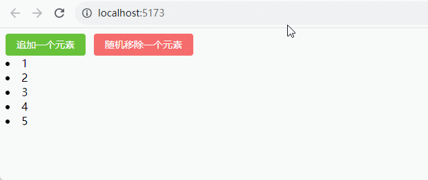

# Teleport 组件

&emsp;&emsp;`Teleport` 是一个内置组件，它可以将组件中的模板代码传送到该组件的 DOM 结构的外层位置。

+ <font color=orchid>**应用场景：**</font>多数应用于对话框、消息提示、弹框等组件中，将它和我们的 Vue 应用的 DOM 完全剥离，管理起来会方便很多
+ <font color=orchid>**使用原因：**</font>将模板嵌套在 Vue 的某个组件内部，那么处理嵌套组件的 `position` 定位、`z-index` 和样式就会变得很困难， 使用 `<Teleport>` 就能很好的解决这个问题

&emsp;&emsp;下面是一个实现信息提示弹窗效果的案例：

+ 首先创建一个提示信息弹窗组件 <font color=darkgray>***Dialog.vue***</font>

```vue
<script setup lang="ts">
import { ref } from 'vue'

// 接入传入的值
const props = defineProps<{
    title: string,
}>();

const emit = defineEmits(['confirm']);
const visible = ref(false);

const handleConfirm = () => {
    visible.value = false;
    emit('confirm');
}

</script>
<template>
    <button @click="visible = true">打开弹窗</button>
    
    <!--弹窗模板-->
    <div class="mask" v-if="visible">
        <div class="dialog">
            <div class="title">{{ title }}</div>
            <div class="content">
                <slot></slot>
            </div>
            <div class="footer">
                <button @click="visible = false">取消</button>
                <button @click="handleConfirm">确定</button>
            </div>
        </div>
    </div>
</template>
<style scoped>
.mask {
    position: absolute;
    left: 0;
    right: 0;
    top: 0;
    bottom: 0;
    background-color: rgba(0, 0, 0, 0.5);
    display: flex;
    justify-content: center;
    align-items: center;
    z-index: 99;
}

.dialog {
    position: fixed;
    top: 30%;
    left: 50%;
    width: 300px;
    transform: translate(-50%, -50%);
    padding: 20px;
    border-radius: 10px;
    border: 1px solid #ccc;
    background-color: #fff;
}

.title {
    font-size: 23px;
    font-weight: bold;
    text-align: center;
}

.content {
    margin: 15px 0;
    overflow: auto;
    max-height: 290px;
}

.footer {
    display: flex;
    align-items: center;
    justify-content: flex-end;
    height: 50px;
}

.footer>button {
    margin-left: 12px;
    width: 70px;
    height: 30px;
}
</style>
```

+ 然后在 <font color=darkgray>***App.vue***</font> 中导入并引用 `Dialog` 组件

```vue
<script setup lang='ts'>
import Dialog from './components/Dialog.vue';
</script>
<template>
  <div class="teleport-box">
    <h3>Teleport：传递模板到组件的 DOM 结构的外层位置</h3>
    <Dialog title="提示">这是提示详细内容</Dialog>
  </div>
</template>
<style scoped>
.teleport-box {
  width: 100%;
  position: relative;
}
</style>
```


&emsp;&emsp;在 `.teleport-box` 样式中使用了 `position: relative;` 相对定位，在子组件 `Dialog` 中使用了 `absolute` 绝对定位，因为父元素是 `relative`，则子元素的 `absolute` 是针对父元素来进行定位的，所以当前是达不到全屏效果。这时可使用 `<Teleport>` 内置组件将弹窗区域传递到外部 `Dom` 节点：

```vue
<template>
    <button @click="visible = true">打开弹窗</button>

    <!-- 使用 <Teleport> 接收一个 to prop 来指定传送的目标。
    to 的值可以是一个 CSS 选择器字符串，也可以是一个 DOM 元素对象。
    这段代码的作用就是告诉 Vue “把以下模板片段传送到 body 标签下”。
    -->
    <Teleport to="body">
        <div class="mask" v-if="visible">
            <div class="dialog">
                <div class="title">{{ title }}</div>
                <div class="content">
                    <slot></slot>
                </div>
                <div class="footer">
                    <button @click="visible = false">取消</button>
                    <button @click="handleConfirm">确定</button>
                </div>
            </div>
        </div>
    </Teleport>
</template>
```

&emsp;&emsp;此时打开弹窗后，弹窗模板传递到了 `body` 元素中，关闭弹窗后会从 `body` 元素中移除。

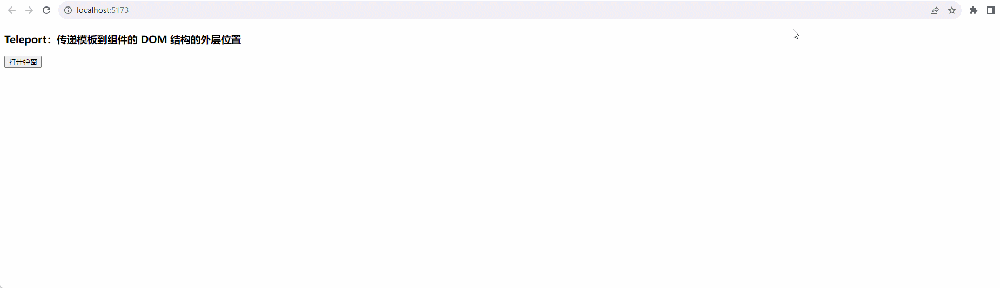

