# 路由的基本使用

## 手动添加路由

&emsp;&emsp;<font color=red>Vue Router</font> 是 Vue 官方的路由管理器，它和 Vue 的核心深度集成，让构建单页面应用变得非常简单。<font color=red>通过根据不同的请求路径，切换显示不同组件进行渲染页面</font>。

&emsp;&emsp;路由的基本使用步骤如下：

1. 首先需要安装 `vue-router` 模块

```shell
npm install vue-router
```

2. 创建 <font color=darkgray>***src/views/Home.vue***</font> 和 <font color=darkgray>***src/views/About.vue***</font> 页面

```vue
<!-- src/views/HomeView.vue -->
<script setup lang="ts">
</script>

<template>
    <div>
        Home
    </div>
</template>


<!-- src/views/AboutView.vue -->
<script setup lang="ts"> 
</script>

<template>
    <div>
        About
    </div>
</template>
```

3. 然后 <font color=darkgray>***src/router/index.ts***</font> 文件中创建路由对象，并对路由进行配置

```typescript
// 1. 导入相关的路由方法
import { createRouter, createWebHistory } from 'vue-router'

// 2. 定义路由组件，也可以是导入的组件
import HomeView from '../views/HomeView.vue'

// 3. 配置路由表
const routes = [
  {
    path: '/home',
    name: 'home',
    component: HomeView
  },
  {
    path: '/about',
    name: 'about',
    component: () => import('../views/AboutView.vue')
  }
]

// 4. 导出路由对象
const router = createRouter({
  history: createWebHistory(import.meta.env.BASE_URL),
  routes
})

export default router
```

+ <font color=orchid>**history: createWebHashHistory()：**</font>路由模式路径带 `#`，支持所有浏览器，是 Vue Router 提供的一种基于浏览器 URL 的 hash 路由模式，它将路由添加到 URL 中的 hash 中（`/#/home`），由于 URL 中添加了 hash，因此在搜索引擎的 SEO 优化中存在一些问题
+ <font color=orchid>**history: createWebHistory()：**</font>路由模式路径不带 `#`，只支持 `HTML5` 标准浏览器，对于老版本的浏览器无法使用

> <font color=orange>**注意：**</font> Vite 默认使用的 Vue 版本是不对 `template` 选项的字符串模板的编译支持，导致模板内容无法正常渲染出来。需要手动在 <font color=darkgray>***vite.config.ts***</font> 中配置 Vue 运行时即时编译构建版本：
>
> ```json
> export default defineConfig({
>   plugins: [
>     vue(),
>   ],
>   resolve: {
>     alias: {
>       '@': fileURLToPath(new URL('./src', import.meta.url)),
>       // 指定vue使用运行时即时编译构建版本，就可以使用 template 选项定义字符串模板
>       // 'vue': 'vue/dist/vue.esm-bundler.js',
>     }
>   }
> })
> ```

4. 在 <font color=darkgray>***src/main.ts***</font> 中引入创建好的路由对象

```typescript
import { createApp} from 'vue'
import App from './App.vue'
import router from './router'; // 导入路由对象

const app = createApp(App);

app.use(router) // 引入路由
app.mount('#app')
```

5. 在 <font color=darkgray>***src/App.vue***</font> 中进行路由切换组件渲染

```vue
<script setup lang="ts">

</script>

<template>
  <li><router-link to="/home">Go Home</router-link></li>
  <li><router-link to="/about">Go About</router-link></li>
  <RouterView />
</template>
```

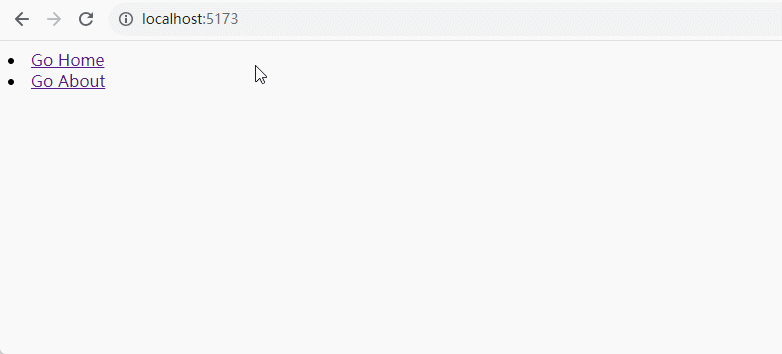

## 使用 Vite 创建路由

&emsp;&emsp;首先使用 <font color=green>***npm init vue@latest***</font> 命令创建 Vue 项目，按照步骤进入到 VueRouter 功能选择的时候选择 `yes` 即可由 Vite 构建工具自动创建并初始化路由：

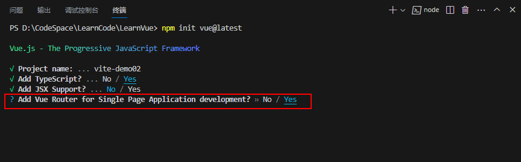

&emsp;&emsp;然后按照步骤一步步创建好项目后，就可以看到已经自动创建并初始化好路由了：

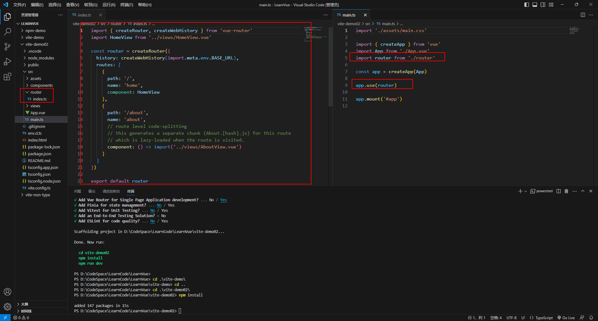

# 样式匹配-高亮显示导航

&emsp;&emsp;要实现动态高亮显示菜单项，实际上就是关注对应 `class` 的样式问题：

+ <font color=orchid>**custom：**</font>接收一个布尔值

  + false（默认值）：将 `<router-link>` 转成一个 `a` 标签，并将其标签体的内容包裹起来
  + true：不转成 `a` 标签，渲染 `<router-link>` 标签体的内容，并配置 `v-slot` 获取和跳转链接

+ <font color=orchid>**v-slot 指令：**</font>该指令接收一个对象（`RouterLinkOptions`），该对象的属性有

  + href：解析后的路由地址，用在 `<a>` 元素的 `href` 属性值（如：`#/`）

  + route：解析出来的当前路由对象（如：`{path:xx, params:xx, children:xx, ....}`

  + navigate：是一个函数，触发路由跳转

  + isAcive：是一个布尔值，匹配当前访问的链接是否为当前路由地址或当前的子路由地址（例如：针对 `to="/news"`，所有访问 `/news` 开头的路由 `isActive` 值都是 `true`）

  + isExactActive：是一个布尔值，精确匹配当前访问的链接是否为当前路由地址（例如：针对 `to="/news"`，只有访问 `/news` 路由 `isExactActive` 值为 `true`，而访问 `/news/sport` 的

    `isExactActive` 值为 `false`）

```vue
<script setup lang="ts">

</script>

<template>
  <ul>
      <!-- 方式一 使用 href -->
      <router-link to="/home" :custom="true" v-slot="{href, route, isActive}">
        <li :class="{active: isActive}"><a :href="href">首页</a></li>
      </router-link>

      <!-- 
        方式二：使用 navigate， custom 等价于 :custom="true" 
      -->
      <router-link to="/about" custom v-slot="{navigate, route, isActive}">
        <li :class="{active: isActive}" @click="navigate"><a>关于</a></li>
      </router-link>
    </ul>
  <RouterView />
</template>

<style scoped>
li {
  list-style: none;
  cursor: pointer;
  border: 1px solid gray;
  display: inline-block;
  margin-right: 5px;
  text-align: center;
  width: 100px;
  line-height: 40px;
}

a {
  text-decoration: none;
  width: 100px;
  height: 40px;
}

.active {
  color: gray;
  background-color: yellow;
}
</style>
```

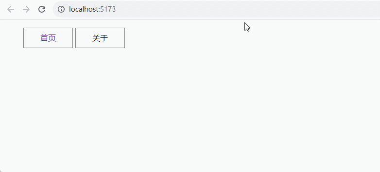

# 子路由的使用

&emsp;&emsp;下面以一个案例说明创建子路由的过程：

1. 首先创建子路由的页面

```vue
<!-- TechView.vue 页面文件 -->
<script setup lang="ts"></script>

<template>
    <div>
        <h4>关于教育的新闻消息</h4>
    </div>
</template>


<!-- SportView.vue 页面文件 -->
<script setup lang="ts"></script>

<template>
    <div>
        <h4>关于体育的新闻消息</h4>
    </div>
</template>
```

2. 然后进行子路由的配置

```typescript
import { createRouter, createWebHistory } from 'vue-router'
import HomeView from '../views/HomeView.vue'

const router = createRouter({
  history: createWebHistory(import.meta.env.BASE_URL),
  routes: [
    {
      path: '/home',
      name: 'home',
      component: HomeView
    },
    {
      path: '/about',
      name: 'about',
      component: () => import('../views/AboutView.vue'),
      children: [
        {
          path: '/about/sport',
          name: 'sport',
          component: () => import('../views/SportView.vue'),
        },
        {
          path: 'tech',
          name: 'tech',
          component: () => import('../views/TechView.vue'),
        }
      ]
    }
  ]
})

export default router
```

3. 然后创建 <font color=darkgray>***AboutView.vue***</font> 的子跳转链接和路由渲染出口

```vue
<template>
  <div>
    <h1>This is an about page</h1>
    <router-link to="/about/sport">体育新闻</router-link>
    <router-link to="/about/tech">教育新闻</router-link>
    <RouterView/>
  </div>
</template>
```

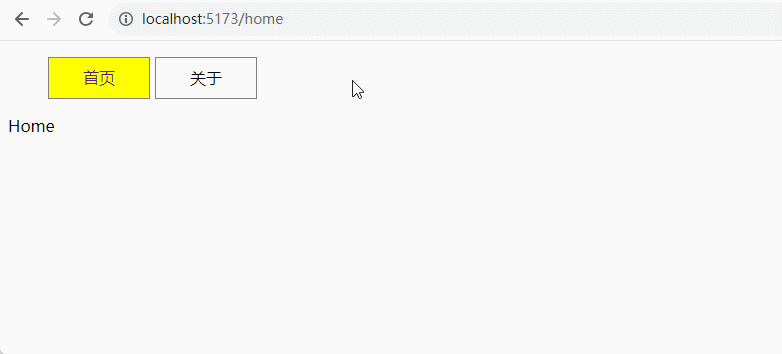

&emsp;&emsp;第一次打开页面的时候，页面上什么都没有显示，这是因为还没有发生路由跳转，可以通过设置默认路由来解决该问题：

```typescript
import { createRouter, createWebHistory } from 'vue-router'
import HomeView from '../views/HomeView.vue'

const router = createRouter({
  history: createWebHistory(import.meta.env.BASE_URL),
  routes: [
    {
      path: '/',
      name: 'home',
      component: HomeView
    },
    {
      path: '/about',
      name: 'about',
      component: () => import('../views/AboutView.vue'),
      children: [
        {
          path: '',
          redirect: '/about/sport'
        },
        {
          path: '/about/sport',
          name: 'sport',
          component: () => import('../views/SportView.vue'),
        },
        {
          path: 'tech',
          name: 'tech',
          component: () => import('../views/TechView.vue'),
        }
      ]
    }
  ]
})

export default router
```

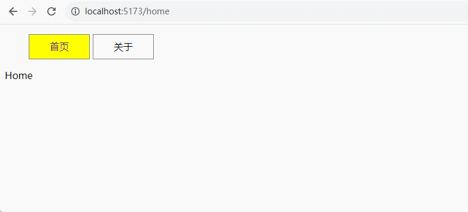

# 路由组件传递数据

&emsp;&emsp;可以通过路由传递数据，具体步骤如下：

1. 首先进行路由配置

```typescript
import { createRouter, createWebHistory } from 'vue-router'
import HomeView from '../views/HomeView.vue'

const router = createRouter({
  history: createWebHistory(import.meta.env.BASE_URL),
  routes: [
    {
      path: '/',
      name: 'home',
      component: HomeView
    },
    {
      path: '/about',
      name: 'about',
      component: () => import('../views/AboutView.vue'),
      children: [
        {
          path: '',
          redirect: '/about/sport'
        },
        {
          path: '/about/sport',
          name: 'sport',
          component: () => import('../views/SportView.vue'),
          children: [
            {
              path: '/about/sport/detail/:title',
              name: 'sportDetail',
              component: () => import('../views/SportDetailView.vue'),
            }
          ]
        },
        {
          path: 'tech',
          name: 'tech',
          component: () => import('../views/TechView.vue'),
        }
      ]
    }
  ]
})
```

2. 然后在 <font color=darkgray>***SportView.vue***</font> 文件中设置路由跳转路径

```vue
<script setup lang="ts">
import { ref } from 'vue';

const sports = ref<Array<string>>(["篮球", "足球", "羽毛球", "乒乓球"])

</script>

<template>
    <div>
        <h4>关于体育的新闻消息</h4>
        <router-link class="link" v-for="(item, index) in sports" :key="index" :to="`/about/sport/detail/${item}`">{{item}}</router-link>
        <RouterView />
    </div>
</template>

<style scoped>
    .link {
        margin-left: 10px;
    }
</style>
```

3. 新建 <font color=darkgray>***SportDetailView.vue***</font> 组件，在该路由组件中读取请求参数

```vue
<script setup lang="ts">
import { useRoute } from 'vue-router';

const route = useRoute();
</script>

<template>
    <div>
        <p>这是一则关于 <span style="color: red; font-size: 20px;">{{route.params.title}} 的体育新闻。</span></p>
    </div>
</template>
```

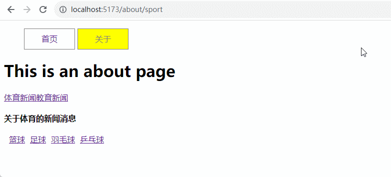

# 编程式路由导航

&emsp;&emsp;Vue 还提供了编程式路由导航，在使用之前需要获得 router 对象：

```javascript
import { useRouter } from 'vue-router';
const router = useRouter();
```

&emsp;&emsp;该对象提供的 API 方法如下：

+ <font color=orchid>**router.push(path)：**</font>相当于点击路由链接（后退 1 步会返回当前路由界面）
+ <font color=orchid>**router.replace(path)：**</font>用新路由替换当前路由（后退 1 步不可返回到当前路由界面）
+ <font color=orchid>**router.back()：**</font>后退回上一个记录路由
+ <font color=orchid>**router.go(n)：**</font>参数 n 指定步数
  + `router.go(-1)` 后退回上一个记录路由
  + `router.go(1)` 向前进下一个记录路由

&emsp;&emsp;将前面的 <font color=darkgray>***AboutView.vue***</font> 的路由跳转方法修改为编程式路由导航：

```vue
<script setup lang="ts">
import {useRouter} from 'vue-router'  

const router = useRouter()
</script>

<template>
  <div>
    <h1>This is an about page</h1>
    <!-- 使用 push 传入地址 -->
    <button @click="router.push('/about/sport')">体育新闻</button>
    <!-- 使用 replace  -->
    <button @click="router.replace('/about/tech')">教育新闻</button>
    <!-- 使用 go 方法后退 -->
    <button @click="router.go(-1)">后退</button>
    <RouterView/>
  </div>
</template>
```

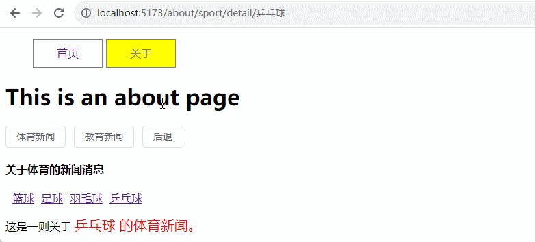

&emsp;&emsp;`push` 方法中也可以传入对象：

```vue
<script setup lang="ts">
import {useRouter} from 'vue-router'  

const router = useRouter()
</script>

<template>
  <div>
    <h1>This is an about page</h1>
    <!-- 使用 push 传入的对象中的 path 属性来指定路径 -->
    <button @click="router.push({path: '/about/sport'})">体育新闻</button>
    <!-- replace 也可以通过 push 方法来实现  -->
    <button @click="router.push({path: '/about/tech', replace: true})">教育新闻</button>
    <!-- 使用 go 方法后退 -->
    <button @click="router.go(-1)">后退</button>
    <RouterView/>
  </div>
</template>
```

&emsp;&emsp;`push` 方法还可以携带参数，修改 <font color=darkgray>***SportView.vue***</font> 文件：

```vue
<script setup lang="ts">
import { ref } from 'vue';
import {useRouter} from 'vue-router'

const router = useRouter()

const sports = ref<Array<string>>(["篮球", "足球", "羽毛球", "乒乓球"])

const handleClick = (item: string, index: number) => {
    router.push({
        path: `/about/sport/detail/${item}`,
        query: {
            index
        }
    })
}
</script>

<template>
    <div>
        <h4>关于体育的新闻消息</h4>
        <el-button v-for="(item, index) in sports" :key="index" @click="handleClick(item, index)">{{item}}</el-button>
        <RouterView /> 
    </div>
</template>

<style scoped>
    .link {
        margin-left: 10px;
    }
</style>
```

&emsp;&emsp;然后在跳转的页面中接收该参数：

```vue
<script setup lang="ts">
import { useRoute } from 'vue-router';

const route = useRoute();
</script>

<template>
    <div>
        <p>index：{{route.query.index}}</p>
        <p>这是一则关于 <span style="color: red; font-size: 20px;">{{route.params.title}} 的体育新闻。</span></p>
    </div>
</template>
```

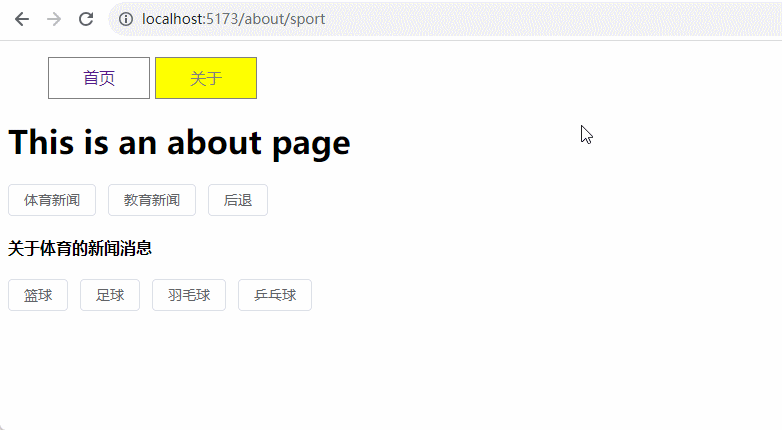

# 命名路由

&emsp;&emsp;除了 `path` 之外，还可以为任何路由提供 `name` ，然后可以通过 `name` 的值来进行路由跳转，防止在 `url` 中出现打字错误。如在路由表中为 `/about/sport/detail/:title` 路由起名为 `sportDetail`：

```typescript
{
    path: '/about/sport/detail/:title',
    name: 'sportDetail',
    component: () => import('../views/SportDetailView.vue'),
}
```

&emsp;&emsp;然后修改 <font color=darkgray>***SportView.vue***</font> 文件：

```vue
<script setup lang="ts">
import { ref } from 'vue';
import {useRouter} from 'vue-router'

const router = useRouter()

const sports = ref<Array<string>>(["篮球", "足球", "羽毛球", "乒乓球"])

const handleClick = (item: string, index: number) => {
    router.push({
        name: 'sportDetail',
        params: {
            title: item
        },
        query: {
            index
        }
    })
}
</script>

<template>
    <div>
        <h4>关于体育的新闻消息</h4>
        <el-button v-for="(item, index) in sports" :key="index" @click="handleClick(item, index)">{{item}}</el-button>
        <RouterView /> 
    </div>
</template>

<style scoped>
    .link {
        margin-left: 10px;
    }
</style>
```

&emsp;&emsp;得到的效果不变。

# 路由元信息

&emsp;&emsp;有时候可能希望将任意信息附加到路由上（如：过渡名称、谁可以访问此路由等），这些可以通过在定义路由时在路由对象中使用 `meta` 属性来实现，并且它通过 `$route` / `route` 对象和导航守卫上都可以访问。

&emsp;&emsp;首先在 <font color=darkgray>***router/index.ts***</font> 中定义路由的时候配置 `meta` 字段：

```typescript
const routes = [
  {
    path: '/home',
    name: 'home',
    component: HomeView,
    meta: {
      username: '张三',
      age: 18
    }
  }
]
```

&emsp;&emsp;然后在路由组件中获取这些信息：

```vue
<script setup lang="ts">
import {useRoute} from 'vue-router'

const route = useRoute()
</script>

<template>
  <div>
    <h1>This is Home page</h1>
    <p>username: {{route.meta.username}}, age: {{$route.meta.age}}</p>
  </div>
</template>
```

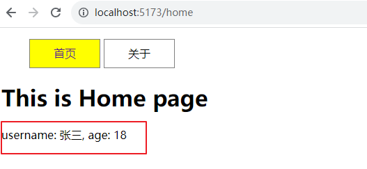

> <font color=orange>**注意：**</font>Typescript 中使用 meta 的对象属性会报错，需要增强 RouteMeta 接口中的属性，在 env.d.ts 中配置：
>
> ```typescript
> import 'vue-router'
> declare module 'vue-router' {
> 	// 针对路由元信息meta对象属性添加类型声明
> 	interface RouteMeta {
> 		// ?表示可选的
> 		isAuth?: boolean;
> 	}
> }
> ```

# 缓存路由组件和动态过渡效果

&emsp;&emsp;缓存路由组件和动态过渡效果的使用场景和作用如下：

+ 默认情况下，当路由组件被切换后组件实例会销毁，当切换回来时实例会重新创建
+ 如果可以缓存路由组件实例，切换后不用重新加载数据，可以提高用户体验

&emsp;&emsp;使用 `<keep-alive>` 可缓存渲染的路由组件实例：

+ 首先创建两个路由组件：

```vue
<!-- InputNameView.vue -->
<script setup lang="ts">
import { ref } from 'vue';
const username = ref('')
</script>

<template>
    <div>
        <el-input v-model="username" placeholder="请输入用户账户">
            <template #prefix>
                <el-icon class="el-input__icon">
                    <User />
                </el-icon>
            </template>
        </el-input>
    </div>
</template>

<!-- InputPwdView.vue -->
<script setup lang="ts">
import { ref } from 'vue';
const pwd = ref('')
</script>

<template>
    <div>
        <el-input v-model="pwd" placeholder="请输入密码" type="password">
            <template #prefix>
                <el-icon class="el-input__icon">
                    <Lock />
                </el-icon>
            </template>
        </el-input>
    </div>
</template>
```

+ 配置路由表

```typescript
const routes = [
  {
    path: '/name',
    name: 'name',
    component: () => import('@/views/InputNameView.vue'),
  },
  {
    path: '/pwd',
    name: 'pwd',
    component: () => import('@/views/InputPwdView.vue'),
    meta: {
      transitionName: 'andy'
    }
  },
]
```

+ 修改 <font color=darkgray>***App.vue***</font> 文件

```vue
<script setup lang="ts">
import { useRouter } from 'vue-router';

const router = useRouter();
</script>

<template>
  <el-button @click="router.push('/name')">名字输入组件</el-button>
  <el-button @click="router.push('/pwd')">密码输入组件</el-button>

  <RouterView v-slot="{ Component, route }">
    <Transition :name="route.meta.transitionName || 'fade'" mode="out-in">
      <KeepAlive>
        <component :is="Component" />
      </KeepAlive>
    </Transition>
  </RouterView>
</template>

<style scoped>
/*过渡样式*/
.fade-enter-active,
.fade-leave-active {
  transition: opacity 0.5s;
}

.fade-enter-from,
.fade-leave-to {
  opacity: 0;
}

/* name='andy' 的过滤效果*/
.andy-enter-active,
.andy-leave-active {
  transition: opacity 2s;
}

.andy-enter-from,
.andy-leave-to {
  opacity: 0;
}
</style>
```

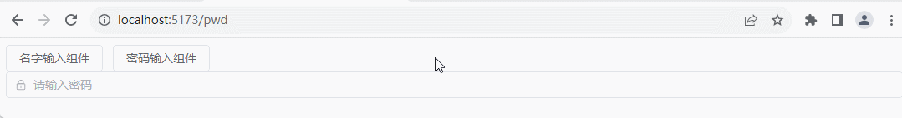

> <font color=orange>**注意：**</font>检查每个路由组件的模板 `<template>` 下是否只有一个根元素，不能有多个根元素且第一行也不能是注释。

# 路由导航守卫

&emsp;&emsp;`vue-router` 路由守卫就是在路由跳转时会触发的钩子函数，将这些钩子函数称为路由守卫。`vue-router` 提供了三种路由守卫：

+ <font color=orchid>**全局的（执行顺序按下面编号排序）：**</font>
  + <font color=orchid>**beforeEach：**</font>全局前置守卫（目标路由进入前触发）
  + <font color=orchid>**beforeResolve：**</font>全局解析守卫（目标路由解析前触发，几乎不用）
  + <font color=orchid>**afterEach：**</font>目标路由进入后触发
+ <font color=orchid>**单个路由独享的**</font>
  + <font color=orchid>**beforeEnter：**</font>路由进入之前
+ <font color=orchid>**组件级的**</font>
  + <font color=orchid>**beforeRouteEnter 选项：**</font>路由进入之前调用（组合 api 中没有对应的 `onBeforeRouteEnter` ）
  + <font color=orchid>**beforeRouteUpdate 选项：**</font>路由更新之前调用，针对同一路由的 params 不同参数变化时调用（如`/user/:id`，当 `/user/1` 和 `/user2` 切换时调用；组合 api 中没有对应的 `onBeforeRouteUpdate`）
  + <font color=orchid>**beforeRouteLeave 选项：**</font>路由离开之前调用（组合 api 中有对应的 `onBeforeRouteLeave`）

&emsp;&emsp;首先创建 <font color=darkgray>***LoginView.vue***</font> 组件：

```vue
<script setup lang='ts'>
import { reactive, ref } from 'vue'
import type { FormInstance, FormRules } from 'element-plus'
import { useRouter } from 'vue-router';

const router = useRouter();

interface RuleForm {
    username: string;
    password: string;
}

const ruleForm = reactive<RuleForm>({
    username: '',
    password: ''
})

const ruleFormRef = ref<FormInstance>()


const rules = reactive<FormRules<RuleForm>>({
    username: [
        { required: true, message: '用户名不能为空', trigger: 'blur' },
    ],
    password: [
        { required: true, message: '密码不能为空', trigger: 'blur' },
    ]
})

const submitForm = async (formEl: FormInstance | undefined) => {
    if (!formEl) return
    await formEl.validate((valid, fields) => {
        if (valid) {
            if (ruleForm.username === 'root' && ruleForm.password === '1234') {
                localStorage.setItem('token', '111111');
                alert('登录成功，跳转到首页');
                router.push({ path: '/' });
            } else {
                alert('请输入正确的用户名/密码: root/1234');
            }
        } else {
            console.log('error submit!', fields)
        }
    })
}

const resetForm = (formEl: FormInstance | undefined) => {
    if (!formEl) return
    formEl.resetFields()
}

</script>
<template>
    <div>
        <h3 style="text-align: center;">请先登录</h3>
        <!-- 要阻止form表单事件默认行为，不然点击两次登录才会跳转 -->
        <el-form ref="ruleFormRef" :model="ruleForm" :rules="rules" label-width="120px" status-icon>
            <el-form-item label="用户名" prop="username">
                <el-input v-model="ruleForm.username" />
            </el-form-item>
            <el-form-item label="密  码" prop="password">
                <el-input v-model="ruleForm.password" />
            </el-form-item>
            <el-form-item>
                <el-button type="primary" @click="submitForm(ruleFormRef)">
                    登录
                </el-button>
                <el-button @click="resetForm(ruleFormRef)">重置</el-button>
            </el-form-item>
        </el-form>
    </div>
</template>
<style scoped></style>
```

&emsp;&emsp;然后进行路由表的配置：

```typescript
const routes = [
  {
    path: '/',
    name: 'home',
    component: () => import('@/views/HomeView.vue'),
  },
  {
    path: '/login',
    name: 'login',
    component: () => import('@/views/LoginView.vue'),
  },
]
```

<font color=orachid>**（一）全局前置守卫 beforeEach**</font>

&emsp;&emsp;在实际开发项⽬中经常使⽤ `vue-router` 路由守卫实现⻚⾯的权限校验。⽐如：当⽤户登录之后会把后台返回的 token 以及⽤户信息保存本地，当⻚⾯进⾏跳转的时候会在路由的全局前置守卫⾥⾯获的 token，如果 token 存在则允许进⼊要跳转的⻚⾯，如果 token 不存在则跳转到登录⻚要求用户登录。

&emsp;&emsp;使用 `router.beforeEach` 注册一个全局前置守卫，当一个路由导航触发时，会先调用全局前置守卫方法。全局前置守卫方法接收三个参数：

+ <font color=orchid>**to：**</font>即将要进入的目标路由对象
+ <font color=orchid>**from：**</font>当前导航正要离开的路由对象
+ <font color=orchid>**next：**</font>调用该方法，进入目标路由。如果守卫方法中没有接收第三个参数 `next`，则通过 `return` 返回一个值来进行路由导航处理

&emsp;&emsp;接下来修改 <font color=darkgray>***router/index.ts***</font> 文件，增加全局前置路由守卫来检测 Token：

```typescript
import { createRouter, createWebHistory } from 'vue-router'

const routes = [
  {
    path: '/',
    name: 'home',
    component: () => import('@/views/HomeView.vue'),
  },
  {
    path: '/login',
    name: 'login',
    component: () => import('@/views/LoginView.vue'),
  },
]

const router = createRouter({
  history: createWebHistory(import.meta.env.BASE_URL),
  routes
})

// 全局前置守卫
router.beforeEach((to, from, next) => {
  // 获取本地的 token 值
  const token = localStorage.getItem('token');

  // 如果没有token值的情况下访问非登录界面
  if (!token && to.path != '/login') {
    // 跳转到登录界面
    next({path: '/login'})
    return
  }

  // 否则正常访问
  next()
})

export default router
```

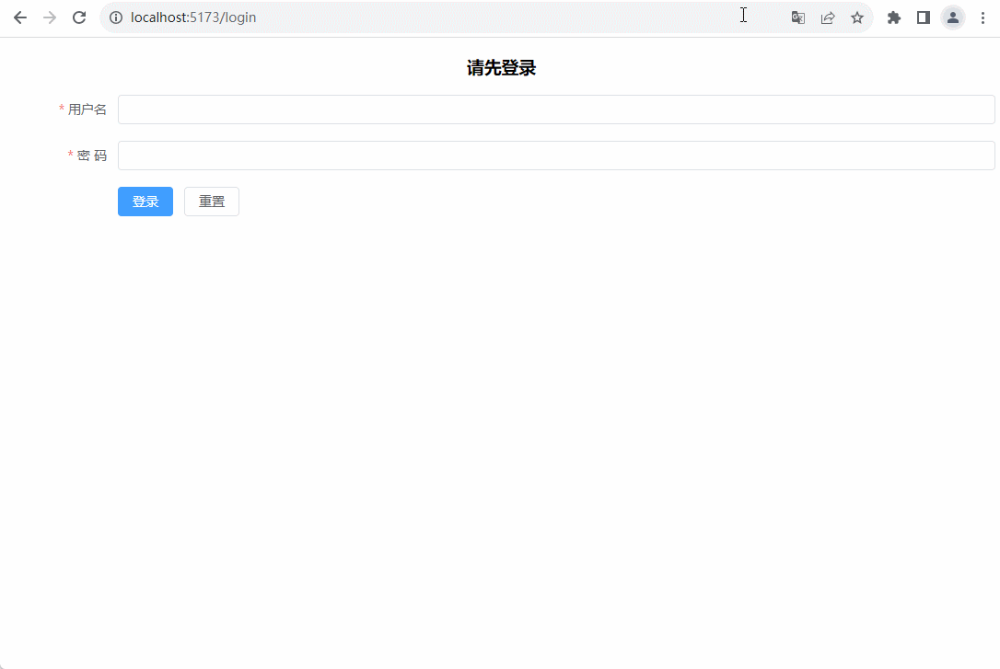

&emsp;&emsp;在没有登录（本地没有token）的时候直接访问首页会返回到登录页面，只有输入正确的账号和密码后才能访问首页。

<font color=orachid>**（二）全局解析守卫 beforeResolve**</font>

&emsp;&emsp;使用 `router.beforeResolve` 可以注册一个全局解析守卫，它和 `router.beforeEach` 类似，在每次导航时都会触发，在 `router.beforeEach` 后面执行，主要用于异步获取数据或执行任何其他操作（如果用户无法进入页面时，希望额外做一些补偿的操作）的理想位置。

&emsp;&emsp;修改 <font color=darkgray>***router/index.ts***</font> 文件，增加全局解析守卫：

```typescript
// 路由全局解析守卫：目标路由解析前触发
router.beforeResolve((to, from, next) => {
  /*
  if (to.path == '/about') {
    // 中止导航
    return false;
  }
  */

  // 有接收 next 参数，必须通过 next 方法进行路由处理
  next();
});
```

<font color=orachid>**（三）全局后置钩子 afterEach**</font>

&emsp;&emsp;使用 `router.afterEach `可以注册一个全局后置钩子，在目标路由进入后触发（一般用于关闭页面进度条等），会接收三个参数：

+ <font color=orchid>**to：**</font>即将要进入的目标路由对象
+ <font color=orchid>**from：**</font>当前导航正要离开的路由对象
+ <font color=orchid>**failure：**</font>路由跳转失败原因，`undefined` 则表示跳转成功（如：`Error: Navigation aborted from "/news/sport" to "/about" via a navigation guard.`）

&emsp;&emsp;修改 <font color=darkgray>***router/index.ts***</font> 文件，增加全局后置守卫：

```typescript
router.afterEach((to, from, failure) => {
  console.log('router.afterEach被触发', to.fullPath, failure);
})
```

<font color=orachid>**（四）路由独享的守卫 beforeEnter**</font>

&emsp;&emsp;在进行路由配置的时候定义 `beforeEnter` 路由独享的守卫，它在 <font color=red>路由进入之前被调用</font>：

```typescript
const routes = [
  {
    path: '/',
    name: 'home',
    component: () => import('@/views/HomeView.vue'),
    beforeEnter(to: RouteLocationNormalized, from: RouteLocationNormalized, next: NavigationGuardNext) {
      console.log("当前的路径：" + to.path)
      next()
    },
  },
  {
    path: '/login',
    name: 'login',
    component: () => import('@/views/LoginView.vue'),
  },
]
```

&emsp;&emsp;也可以将一个函数数组传递给 `beforeEnter`，这样方便守卫的处理逻辑在不同的路由中多处复用：

```typescript
import { createRouter, createWebHistory } from 'vue-router'
import type { RouteLocationNormalized, NavigationGuardNext } from 'vue-router'

function printToPath(to: RouteLocationNormalized) {
  console.log("当前的路径：" + to.path)
  return true
}

function printFromPath(from: RouteLocationNormalized) {
  console.log("之前的路径：" + from.path)
  return true
}

const routes = [
  {
    path: '/',
    name: 'home',
    component: () => import('@/views/HomeView.vue'),
    beforeEnter: [printToPath, printFromPath],
  },
  {
    path: '/login',
    name: 'login',
    component: () => import('@/views/LoginView.vue'),
  },
]
```

<font color=orachid>**（五）组件内的守卫**</font>

&emsp;&emsp;在路由组件内部可以直接定义路由导航守卫，组件内的守卫针对组合式 API 只有如下守卫：

| 选项式 API        | 组合式 API                                              | 说明                                                         |
| ----------------- | ------------------------------------------------------- | ------------------------------------------------------------ |
| beforeRouteEnter  | 无（可在路由配置中使用路由独享的守卫 beforeEnter 处理） | 路由进入之前调用。                                           |
| beforeRouteUpdate | onBeforeRouteUpdate                                     | 路由更新之前调用，针对同一路由的 params 不同参数变化时调用。<br>常用于同一个组件传入不同参数时，展示不同的数据 |
| beforeRouteLeave  | onBeforeRouteLeave                                      | 离开当前路由组件，跳转到别的路由组件时触发该钩子。<br>常用于表单页面，当用户填了一部分内容，需要提醒用户确定是否离开当前页面。 |

# 其它

## 实现 404 页面

+ 首先创建 <font color=darkgray>***404.vue***</font>：

```vue
<script setup lang="ts">
import { useRouter } from 'vue-router';
const router = useRouter();
</script>
<template>
    <el-result icon="warning" title="警告" sub-title="你访问的页面走丢了~">
        <template #extra>
            <el-button type="primary" @click="router.go(-1)">返回</el-button>
        </template>
    </el-result>
</template>
```

+ 然后修改路由配置，当地址不存在的时候。跳转到 404 页面：

```typescript
import { createRouter, createWebHistory } from 'vue-router'

const routes = [
  // 将匹配所有内容并将其放在 `$route.params.pathMatch` 下
  { 
    path: '/:pathMatch(.*)*', 
    name: 'NotFound', 
    component: () => import('@/views/404.vue') 
  },
  {
    path: '/',
    name: 'home',
    component: () => import('@/views/HomeView.vue'),
  },
  {
    path: '/login',
    name: 'login',
    component: () => import('@/views/LoginView.vue'),
  },
]
```

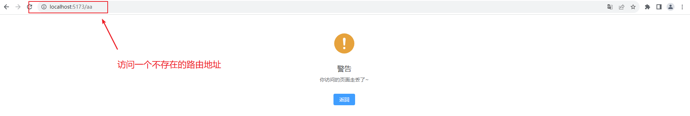

## 动态标题

&emsp;&emsp;在配置路由的时候为每一个路由在元信息中添加 `title` 属性：

```typescript
const routes = [
  // 将匹配所有内容并将其放在 `$route.params.pathMatch` 下
  { 
    path: '/:pathMatch(.*)*', 
    name: 'NotFound', 
    component: () => import('@/views/404.vue'),
    meta: {
      title: '404页面'
    }
  },
  {
    path: '/',
    name: 'home',
    component: () => import('@/views/HomeView.vue'),
    meta: {
      title: '首页'
    }
  },
  {
    path: '/login',
    name: 'login',
    component: () => import('@/views/LoginView.vue'),
    meta: {
      title: '登录页面'
    }
  },
]
```

&emsp;&emsp;在前置路由守卫里面为页面设置标题：

```typescript
// 全局前置守卫
router.beforeEach((to, from, next) => {
  const title: string = to.meta.title || '';
  window.document.title = title

  // 否则正常访问
  next()
})
```

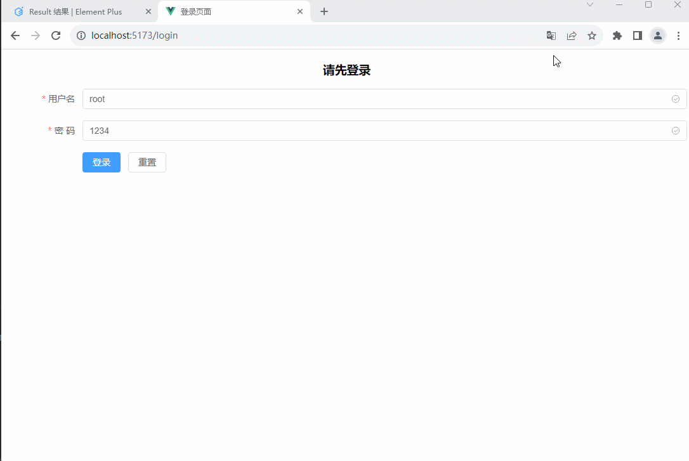
