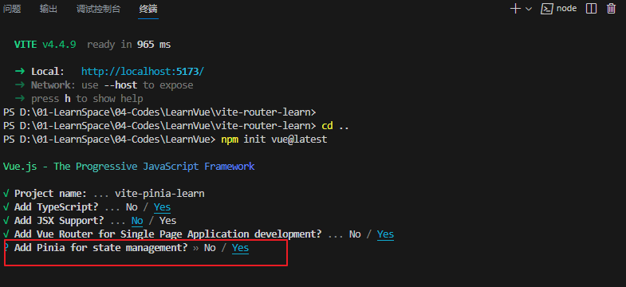
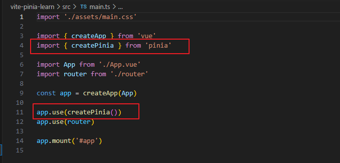
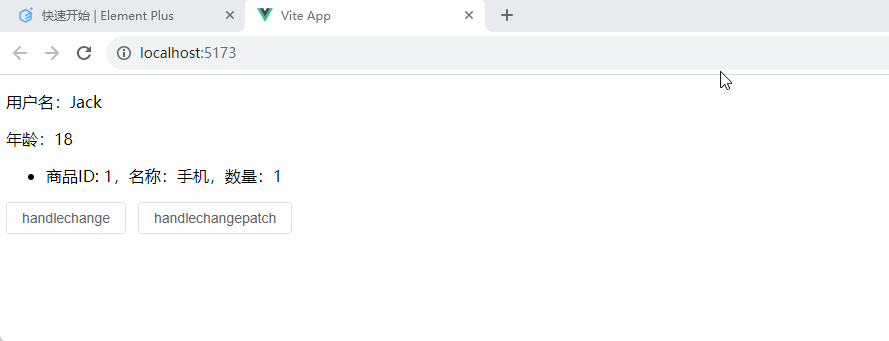
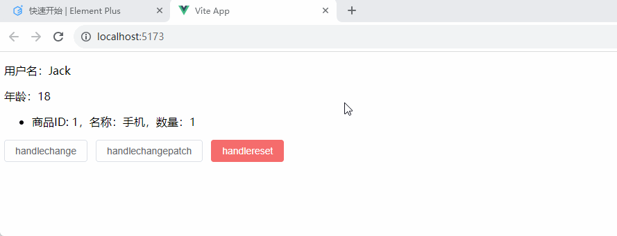
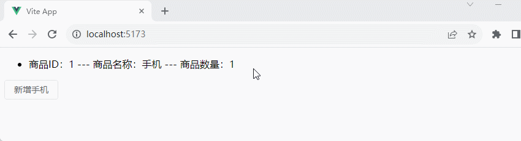
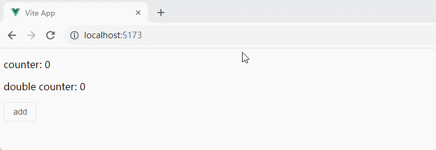

# 整合 Pinia

&emsp;&emsp;`Pinia` 是 Vue 的专属状态管理库，它允许跨组件或页面共享状态 。它的特性如下：

+ 只有 `state`、`getters`、`actions`，已将 Vuex 中的 `mutations` 弃用
+ 对 TypeScript 的完整支持
+ 基于模块化设计构建多个 Store，能够进行按需导入使用
+ Vue Devtools 完美支持 Pinia ，提供更好的开发体验
+ Pinia 极致轻量化，大小只有 1kb 左右

&emsp;&emsp;Store 是一个保存状态和业务逻辑的实体，它并不与你的组件树绑定，换句话说它承载着全局状态。Store 有点像一个永远存在的组件，每个组件都可以读取和写入。Store 有三个概念：`state`、`getter` 和 `action`，可以假设这些概念相当于组件中的 `data`、`computed` 和 `methods`。 

## 手动整合 Pinia

+ 首先使用 Vite 创建 Vue 项目
+ 然后进入项目的根目录并执行 `npm install pinia` 命令下载 Pinia
+ 接着在 <font color=brown>***main.ts***</font> 中创建 pinia 实例并传递给应用

```typescript
import { createApp } from 'vue'
import App from './App.vue'
import router from './router'
import ElementPlus from 'element-plus'
import 'element-plus/dist/index.css'
import * as ElementPlusIconsVue from '@element-plus/icons-vue'
// 1. 导入创建Pinia实例方法
import { createPinia } from 'pinia'

const app = createApp(App)

app.use(router)
app.use(ElementPlus)
for (const [key, component] of Object.entries(ElementPlusIconsVue)) {
  app.component(key, component)
}

// 2. 创建pinia实例并挂载到应用上
app.use(createPinia)

app.mount('#app')
```

## 使用 Vite 整合 Pinia

&emsp;&emsp;也可以在使用 Vite 工具创建 Vue 项目的时候选择引入 Pinia：



&emsp;&emsp;打开 <font color=brown>***main.ts***</font> 文件，就可以看见已经将 Pinia 引入了。



# 使用 Pinia

## 定义和修改 Store 状态 state

&emsp;&emsp;通过 `defineStore()` 方法定义 `Store`（全局状态数据），其中参数和返回值说明如下：

+ <font color=orchid>**参数说明：**</font>
  + <font color=orchid>**参数 1：**</font>应用中 Store 的唯一标识字符串 `Id`（<font color=red>不可重复</font>）
  + <font color=orchid>**参数 2：**</font>接受 `Option` 对象或 `Setup` 函数形式
+ <font color=orchid>**返回值说明：**</font>可以对返回值进行任意命名，但最好使用 `store` ，同时以 `use` 开头且以 `Store` 结尾，`use` 开头是一个符合组合式函数风格的约定（比如：`useUserStore`、`useCartStore` 等） ，

&emsp;&emsp;首先创建 <font color=brown>***/src/stores/cart.ts***</font> 文件：

```typescript
import {defineStore} from 'pinia'

interface Goods {
    id: number;
    name: string;
    num: number;
}

export const useCartStore = defineStore('cart', {
    // state 用于定义一个返回初始状态的函数
    state: () => {
        return {
            name: "Jack",
            age: 18,
            goodList: [
                {
                    id: 1,
                    name: "手机",
                    num: 1
                }
            ] as Goods[]
        }
    }
})
```

&emsp;&emsp;在组件中获取和修改状态数据：

+ 解构出来的 state 状态不是响应式的
+ 可以使用 `storeToRefs` 方法将状态转成 ref 后，解构出来才是响应式的
+ 通过 store 实例操作状态是响应式的
+ 通过 `$patch` 可以同时修改多个状态属性

```vue
<script setup lang="ts">
import { useCartStore } from './stores/cart';
import { storeToRefs } from 'pinia';

const cartStore = useCartStore();

// 通过 store 实例获取 state 状态
console.log('获取 state 状态', cartStore.$state, cartStore.name);

// 1. 直接解构出来的state状态，不是响应式的
// let { age } = cartStore;

// 2. 使用 storeToRefs 将状态转成 ref 后，解构出来的状态是响应式的
const { age } = storeToRefs(cartStore);
console.log('age', age.value);

const handlechange = () => {
  age.value = 28;           // storeToRefs 解构后是响应式的
  cartStore.name = "Tom";   // 通过 store 实例操作状态是响应式的
}

const handlechangepatch = () => {
  // 通过 $patch 方法接受一个对象，可同时修改多个状态属性
  cartStore.$patch({
    name: '小花',
    age: cartStore.age + 1,
  });

  // $patch 方法接受一个带state参数的回调函数，state来操作状态
  cartStore.$patch((state) => {
    state.goodList.push({ id: state.goodList.length + 1, name: '电脑', num: 2 });
  })
}
</script>

<template>
  <div>
    <p>用户名：{{ cartStore.name }}</p>
    <p>年龄：{{ age }}</p>
    <ul>
      <li v-for="(item, index) in cartStore.goodList" :key="index">
        商品ID: {{ item.id }}，名称：{{ item.name }}，数量：{{ item.num }}
      </li>
    </ul>
    <el-button @click="handlechange">handlechange</el-button>
    <el-button @click="handlechangepatch">handlechangepatch</el-button>
  </div>
</template>
```



&emsp;&emsp;可以通过调用 store 的 `$reset()` 方法将 state 状态重置为初始值：

```vue
<script setup lang="ts">
import { useCartStore } from './stores/cart';
import { storeToRefs } from 'pinia';

const cartStore = useCartStore();

// 2. 使用 storeToRefs 将状态转成 ref 后，解构出来的状态是响应式的
const { age } = storeToRefs(cartStore);

const handlechange = () => {
  age.value = 28;           // storeToRefs 解构后是响应式的
  cartStore.name = "Tom";   // 通过 store 实例操作状态是响应式的
}

const handlechangepatch = () => {
  // 通过 $patch 方法接受一个对象，可同时修改多个状态属性
  cartStore.$patch({
    name: '小花',
    age: cartStore.age + 1,
  });

  // $patch 方法接受一个带state参数的回调函数，state来操作状态
  cartStore.$patch((state) => {
    state.goodList.push({ id: state.goodList.length + 1, name: '电脑', num: 2 });
  })
}

const handlereset = () => {
  cartStore.$reset();
}
</script>

<template>
  <div>
    <p>用户名：{{ cartStore.name }}</p>
    <p>年龄：{{ age }}</p>
    <ul>
      <li v-for="(item, index) in cartStore.goodList" :key="index">
        商品ID: {{ item.id }}，名称：{{ item.name }}，数量：{{ item.num }}
      </li>
    </ul>
    <el-button @click="handlechange">handlechange</el-button>
    <el-button @click="handlechangepatch">handlechangepatch</el-button>
    <el-button type="danger" @click="handlereset">handlereset</el-button>
  </div>
</template>
```



&emsp;&emsp;通过 store 的 `$subscribe()` 方法监听 state 及其变化：

```html
<script setup lang="ts">
import { useCartStore } from './stores/cart';
import { storeToRefs } from 'pinia';

const cartStore = useCartStore();

// 2. 使用 storeToRefs 将状态转成 ref 后，解构出来的状态是响应式的
const { age } = storeToRefs(cartStore);

const handlechange = () => {
  age.value = 28;           // storeToRefs 解构后是响应式的
  cartStore.name = "Tom";   // 通过 store 实例操作状态是响应式的
}

const handlechangepatch = () => {
  // 通过 $patch 方法接受一个对象，可同时修改多个状态属性
  cartStore.$patch({
    name: '小花',
    age: cartStore.age + 1,
  });

  // $patch 方法接受一个带state参数的回调函数，state来操作状态
  cartStore.$patch((state) => {
    state.goodList.push({ id: state.goodList.length + 1, name: '电脑', num: 2 });
  })
}

const handlereset = () => {
  cartStore.$reset();
}

// 通过 store 的 $subscribe() 方法监听 state 及其变化
cartStore.$subscribe((mutation, state) => {
  // 获取组件标识id(和 cartStore.$id 一样）
  const { storeId } = mutation;
  console.log('storeId', storeId); // 'cart'
  // 通常每当状态发生变化时，将整个 state 持久化到本地存储。
  localStorage.setItem('cart', JSON.stringify(state))
});
</script>

<template>
  <div>
    <p>用户名：{{ cartStore.name }}</p>
    <p>年龄：{{ age }}</p>
    <ul>
      <li v-for="(item, index) in cartStore.goodList" :key="index">
        商品ID: {{ item.id }}，名称：{{ item.name }}，数量：{{ item.num }}
      </li>
    </ul>
    <el-button @click="handlechange">handlechange</el-button>
    <el-button @click="handlechangepatch">handlechangepatch</el-button>
    <el-button type="danger" @click="handlereset">handlereset</el-button>
  </div>
</template>
```

## Getter 派生属性

&emsp;&emsp;有时候需要从 Store 中的 `state` 中派生出一些状态（例如：在上面的增加一个 userType 属性，当 age 值小于 18，则 userType 值为 未成年人 ; 大于等于18 , 则 userType 值为 成年人） ，这时候就需要用到 `Getter` 来解决。`Getter` 相当于组件中的计算属性（`computed`），可以通过 `defineStore()` 中的 `getters` 属性来定义。Getter 中通过返回一个函数，该函数可以接受调用方传递任意参数。

> <font color=orange>**注意：**</font>推荐使用箭头函数，并且它将接收 state 作为第一个参数。

1. 修改 <font color=brown>***/src/stores/cart.ts***</font> 文件：

 ```typescript
 import { defineStore } from 'pinia'
 
 interface Goods {
     id: number;
     name: string;
     num: number;
 }
 
 export const useCartStore = defineStore('cart', {
     // state 用于定义一个返回初始状态的函数
     state: () => {
         return {
             name: "Jack",
             age: 18,
             goodList: [
                 {
                     id: 1,
                     name: "手机",
                     num: 1
                 }
             ] as Goods[]
         }
     },
     // 定义派生属性(等同与计算属性，根据state状态值得到新的一个状态值)
     getters: {
         // 接收 state 作为第一个参数，使用箭头函数声明：方法体不能使用 this
         userType: (state) => {
             return state.age < 18 ? '未成年人' : '成年人';
         },
         // 使用普通函数声明：方法体可以使用 this 访问整个 store 实例
         getGoodsById(state) {
             // 通过 this 获取上面getter
             console.log('getter普通函数', this.userType);
             // 通过返回一个函数，该函数可以接受调用方传递任意参数，如下id参数
             return (id: number) => {
                 return this.goodList.find(item => item.id === id);
             }
         }
     }
 })
 ```

2. 然后就可以在组件中获取

```html
<template>
  <div>
    <p>Getter 派生属性：{{ cartStore.userType }}</p>
    <p>向 Getter 派生属性传递参数：{{ cartStore.getGoodsById(1) }}</p>
  </div>
</template>
```

## Actions

&emsp;&emsp;`Action` 相当于组件中的 `method`，它通过 `defineStore()` 中的 `actions` 属性来定义，它是定义业务逻辑的完美选择：

1. 修改 <font color=brown>***/src/stores/cart.ts***</font> 文件：

```typescript
import { defineStore } from 'pinia'

interface Goods {
    id: number;
    name: string;
    num: number;
}

export const useCartStore = defineStore('cart', {
    // state 用于定义一个返回初始状态的函数
    state: () => {
        return {
            name: "Jack",
            age: 18,
            goodList: [
                {
                    id: 1,
                    name: "手机",
                    num: 1
                }
            ] as Goods[]
        }
    },
    // 定义派生属性(等同与计算属性，根据state状态值得到新的一个状态值)
    getters: {
        // 接收 state 作为第一个参数，使用箭头函数声明：方法体不能使用 this
        userType: (state) => {
            return state.age < 18 ? '未成年人' : '成年人';
        },
        // 使用普通函数声明：方法体可以使用 this 访问整个 store 实例
        getGoodsById(state) {
            // 通过 this 获取上面getter
            console.log('getter普通函数', this.userType);
            // 通过返回一个函数，该函数可以接受调用方传递任意参数，如下id参数
            return (id: number) => {
                return this.goodList.find(item => item.id === id);
            }
        }
    },
    // 定义行为，类似 method
    actions: {
        // 新增商品
        addGoods(goods: Goods) {
            // goods.num/1转成数值
            if (goods.num) goods.num = goods.num / 1;
            // 查询购物车中是否存在此商品，存在则数量累加，不存在则追加商品到数组中
            const target = this.goodList.find(item => item.id == goods.id);
            if (target) target.num += goods.num;
            else this.goodList.push(goods);
        }
    }
})
```

2. 在组件中实现

```html
<script setup lang="ts">
import { useCartStore } from './stores/cart';

const cartStore = useCartStore();

const handleAdd = () => {
  cartStore.addGoods({
    id: 1,
    name: "手机",
    num: 1
  })
}
</script>

<template>
  <div>
    <ul>
      <li v-for="(item, index) in cartStore.goodList" :key="index">
      商品ID：{{item.id}} --- 商品名称：{{item.name}} --- 商品数量：{{item.num}}
      </li>
    </ul>
    <el-button @click="handleAdd">新增手机</el-button>
  </div>
</template>
```



## Setup Store

&emsp;&emsp;在上面采用的都是选项式（Option Store），同时也存在另一种定义语法（Setup Store），这与 Vue 组合式 API 的 setup 函数相似。传入一个函数，该函数定义了一些响应式属性和方法，并返回一个带有我们想暴露出去的属性和方法的对象。

&emsp;&emsp;在 `Setup Store` 中：

+ `ref()` 就是 `state` 属性
+ `computed()` 就是 `getters`
+ `function()` 就是 `actions`

1. 首先定义一个计数器的 Store

```typescript
import { ref, computed } from 'vue'
import { defineStore } from 'pinia'

export const useCounterStore = defineStore('counter', () => {
  // 定义 store 的 state 属性
  const count = ref(0)

  // 定义 store 的 getters
  const doubleCount = computed(() => count.value * 2)

  // 定义 store 的 action
  function increment() {
    count.value++
  }

  return { count, doubleCount, increment }
})
```

2. 在组件中使用

```html
<script setup lang="ts">
import { useCounterStore } from './stores/counter';

const counterState = useCounterStore();

</script>

<template>
  <div>
    <p>counter: {{counterState.count}}</p>
    <p>double counter: {{counterState.doubleCount}}</p>
    <el-button @click="counterState.increment()">add</el-button>
  </div>
</template>
```


