# 基础知识

&emsp;&emsp;如果没有版本控制，将会出现以下问题：

+ 备份多个版本，浪费存储空间，花费时间长；
+ 难以恢复至以前的历史版本，容易引发 BUG，解决代码冲突困难；
+ 难于追溯问题代码的修改人和修改时间、修改内容、日志信息；
+ 项目升级、版本发布困难；
+ 无法进行权限控制， 比如：测试人员（只读）、开发人员（模块权限）；
+ 开发团队在工作过程中无法多条生产线同时推进任务，效率慢。

&emsp;&emsp;**版本控制（Revision control）**是维护工程蓝图的标准做法，能追踪工程蓝图从诞生一直到定案的过程；是一种记录若干文件内容变化，以便将来查阅特定版本修订情况的系统。

&emsp;&emsp;常见的版本控制工具有：

+ **集中式版本控制工具：**`SVN`、`VSS`、`CVS`
+ **分布式版本控制工具：**`Git`、`Mercurial`、`Bazaar`

# Git 与 SVN 的比较

## SVN 介绍

&emsp;&emsp;**SVN 属于集中式版本管理控制系统**，服务器中保存了所有文件的不同版本，而协同工作人员通过连接 `svn` 服务器，提取出最新的文件、获取提交更新。`Subversion` 项目的初衷是为了替换当年开源社区最为流行的版本控制软件 `CVS`，在 `CVS` 的功能的基础上有很多的提升同时也能较好的解决 `CVS` 系统的一些不足。`SVN` 的基本交互流程图如下：

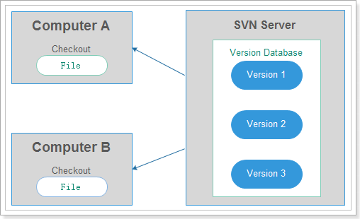

&emsp;&emsp;集中管理方式在一定程度上看到其他开发人员在干什么，而管理员也可以很轻松掌握每个人的开发权限。但是相对于其优点而言，集中式版本控制工具的缺点很明显：

+ 服务器单点故障；
+ 必须连接在 `svn` 服务器上，否则不能提交、对比、还原等。

## Git 介绍

&emsp;&emsp;`Git` 与 `svn` 记录的具体差异如下：

+ `Git` 和其它版本控制系统的主要差别在于，`Git` 只关心文件的整体是否发生变化，而 `Svn` 这类版本控制系统则只关心文件内容的具体差异；
+ `Svn` 这类系统每次记录有哪些文件作了更新，以及都更新了哪些行的内容；而 `Git` 并不保存这些前后变化的差异数据；
+ `Git` 更像是把变化的文件作一个快照后，记录在一个微型的文件系统中。每次提交更新时，它会纵览一遍所有文件的指纹信息（Hash值）并对文件作一快照，然后保存一个指向这次快照的索引。为提高性能，若文件没有变化，Git 不会再次保存，而只对上次保存的快照作一链接。

&emsp;&emsp;`Git` 的主要优势如下：

+ 分布式，强调个体；
+ 公共服务器压力和数据量都不会太大；
+ 离线工作，每个人的本地仓库，大部分操作在本地库完成，不需要联网（`SVN`做不到）；
+ 分支操作非常快捷流畅（重点）；
+ 可以吃后悔药，尽可能添加数据而不是删除或修改数据（删除或修改不容易恢复，而每次添加一个版本，历史版本都有）；
+ 速度快、灵活，有能力高效管理类似 `Linux`；
+ 内核一样的超大规模项目（速度和数据量）。

# Git 下载与安装

## Git 安装过程

&emsp;&emsp;首先去官网下载最新的 `git` ，然后开始双击 `exe` 程序，开始安装过程：

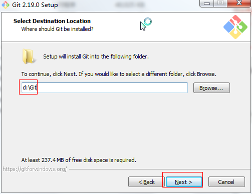

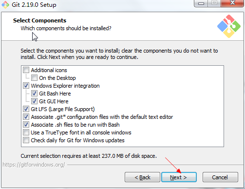

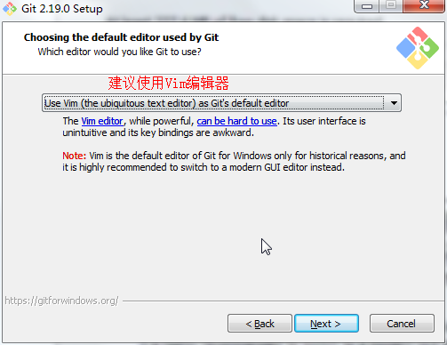

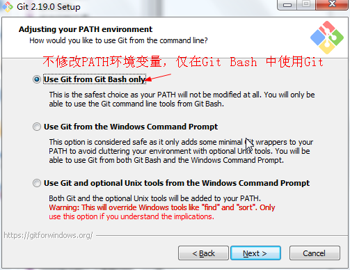

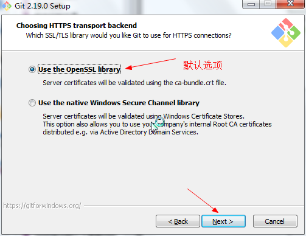

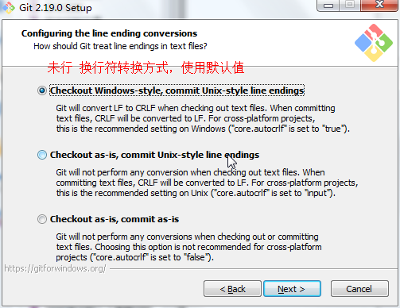

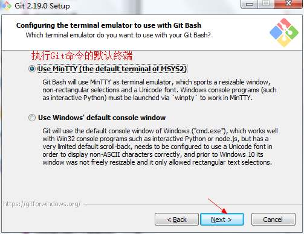

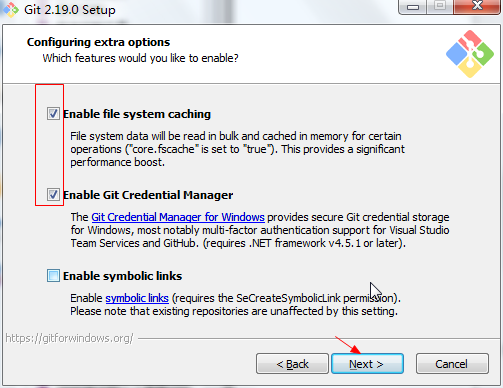

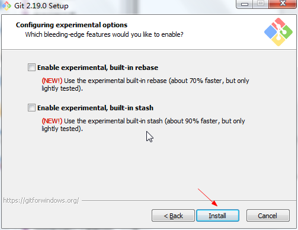

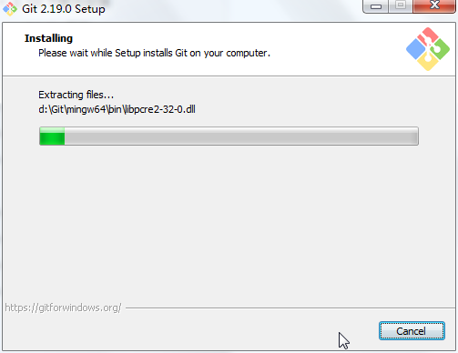

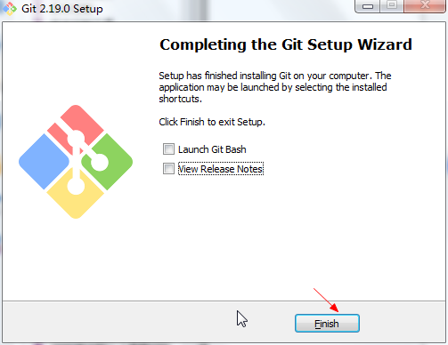

## Git 本地工作区域

&emsp;&emsp;对于任何一个文件，在 Git 内都有三种区域：**工作区、暂存区和本地仓库**：

+ **工作区：**表示新增或修改了某个文件，但还没有提交保存
+ **暂存区：**表示把已新增或修改的文件，放在下次提交时要保存的清单中
+ **本地仓库：**文件已经被安全地保存在本地仓库中了

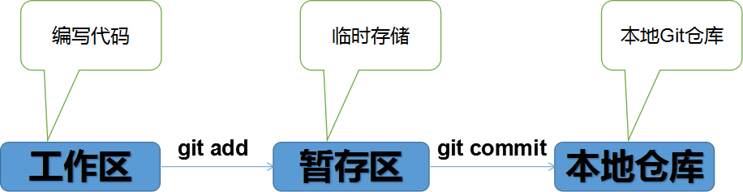

# Git 与代码托管平台

## Git 与 GitHub 比较

+ **Git：**版本管理工具 , 只在本地使用的一个版本管理工具，其作用就是可以让你更好的管理你的程序。比如：你原来提交过的内容，后面虽然修改过，但是通过 git 这个工具，可以把你原来提交的内容重现出来。这样可以对于你后来才意识到的一些错误进行更改、进行还原。
+ **GitHub：**是一个基于 Git 的远程代码托管平台（网站），可以在 GitHub 上建立一个远程库，将本地库的代码提交到远程库。这样你的每次提交，别人也都可以看到你的代码，同时别人也可以帮你修改你的代码。这种开源的方式非常方便程序员之间的交流和学习。

## 代码托管平台

+ 局域网：GitLab（可自行搭建）
+ 外网环境：GitHub、码云

## 本地库和远程库

+ 团队内部协作开发：

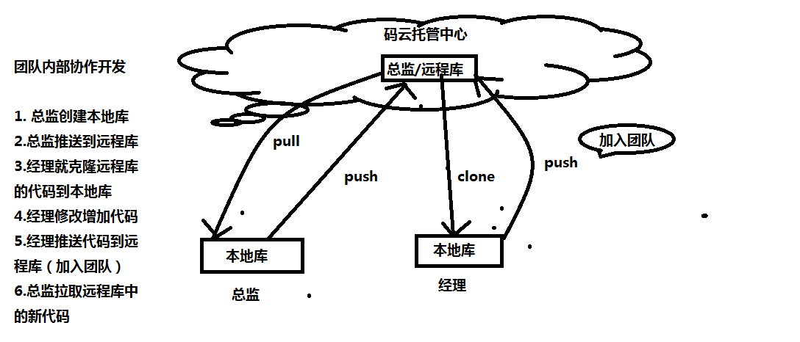

+ 远程跨团队协作开发

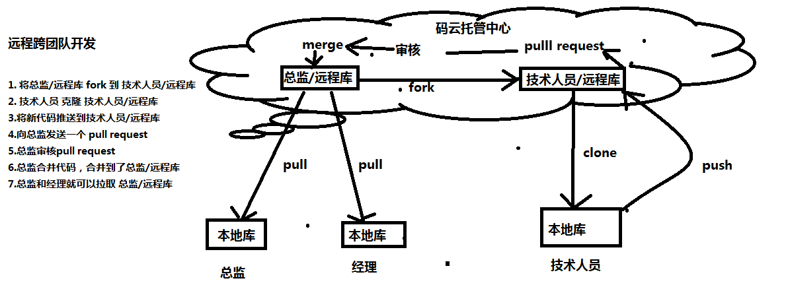