# 初始化操作

&emsp;&emsp;安装好 Git 后，在资源管理器的空白处单击鼠标右键打开菜单，点击 `Git Bash Here` 打开 Git 命令行窗口，在窗口中可直接使用 Linux 命令操作：

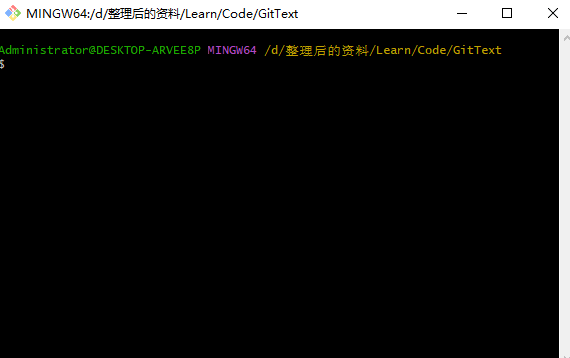

&emsp;&emsp;然后使用 ***`git init`*** 命令来初始化本地库：

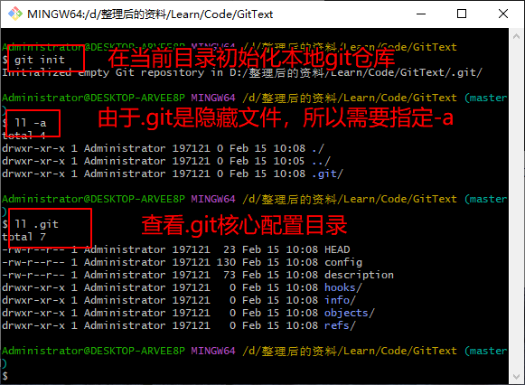

> **注意：**`.git` 目录中存放的是本地库相关核心配置文件，不要随意删除和修改。

&emsp;&emsp;`.git` 目录说明：

+ **hooks 目录：**脚本文件的目录
+ **info 目录：**保存了不希望在 `.gitignore` 文件中管理的忽略模式的全局可执行文件
+ **logs 目录：**日志目录
+ **objects 目录：**存储所有数据内容
+ **refs 目录：**存储指向数据（分支）的提交对象的指针
+ **config 文件：**包含了项目特有的配置选项
+ **description 文件：**仅供 `GitWeb` 程序使用
+ **HEAD 文件：**指向当前分支

&emsp;&emsp;为了区分不同开发人员的身份信息，可以设置签名信息，格式如下：

+ 用户名：yxbb
+ Email：yxbb@126.com

> **注意：**这里的签名信息和登录远程库的账号和密码没有任何关系。

&emsp;&emsp;设置签名信息的具体命令如下：

+ **项目级别/仓库级别：**仅在当前目录的本地 Git 仓库范围内有效
  + ***`git config user.name yxbb`***
  + ***`git config user.email yxbb@126.com`***
  + 签名信息保存位置：**`./.git/config`** 文件中

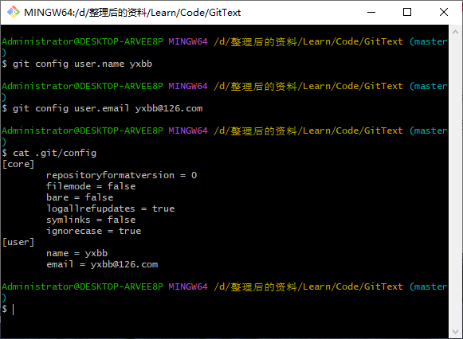

+ **系统用户级别：**登录当前操作系统的用户范围
  + ***`git config --global user.name yxbb`***
  + ***`git config --global user.email yxbb@126.com`***
  + 签名信息保存位置：**`~/.gitconfig`** 文件中

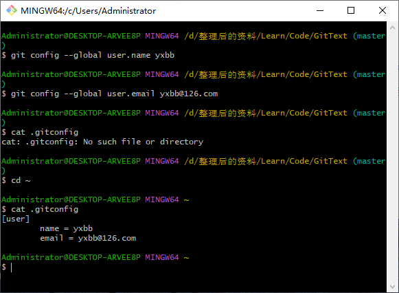

> **关于级别优先级说明：**
>
> + 就近原则：项目级别优先于系统用户级别
> + 如果只有系统用户级别的签名，则采用系统用户级别的签名信息
> + 二者都不存在是不允许的

# Git 基本操作

## 查看状态

&emsp;&emsp;查看状态使用 ***`git status`*** 命令，用来查看工作区、暂存区的状态。首先在仓库里面创建一个`demo01.txt` 文件，然后使用 ***`git status`*** 查看状态，会提示 **Untracked files（有未追踪文件）**：

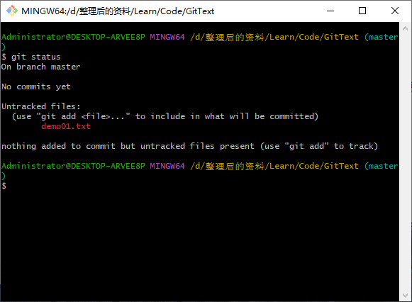

## 添加到暂存区

&emsp;&emsp;添加到暂存区就是将工作区的 "新增/修改" 添加到暂存区，相关联的命令如下：

+ 添加到暂存区：`git add <file name>`

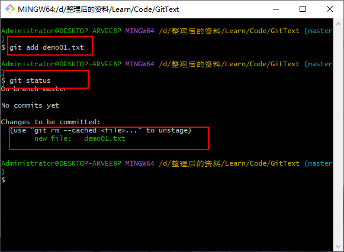

+ 恢复，不放到暂存区： `git rm --cached <file name>`

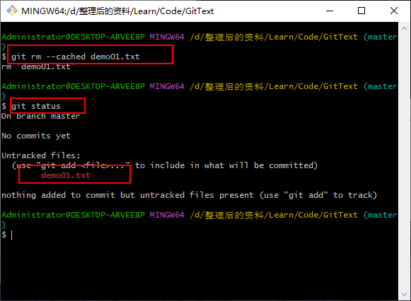

## 提交到本地库

&emsp;&emsp;提交到本地库是指将暂存区的内容提交到本地库，可以使用 `git commit [-m "提交说明信息"] <file name>`：

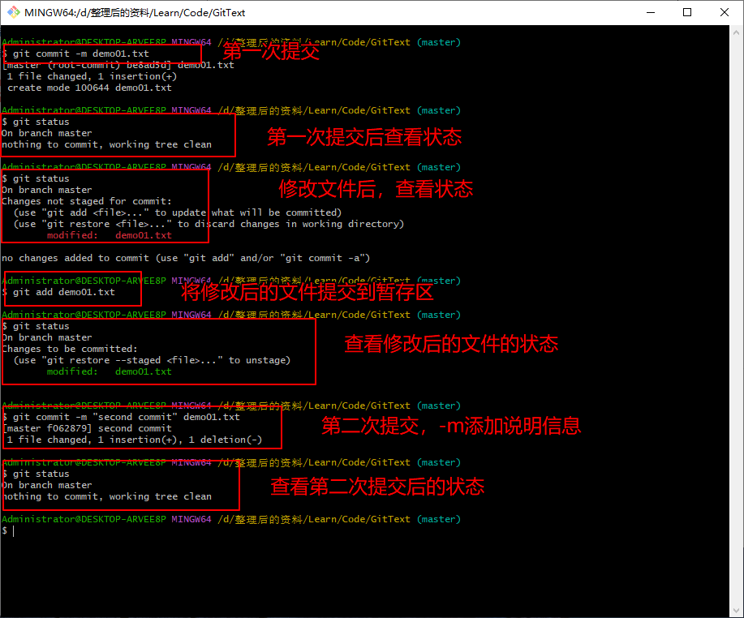

## 查看版本历史记录

&emsp;&emsp;通过 ***`git log`*** 命令可以查看详细的日志信息：

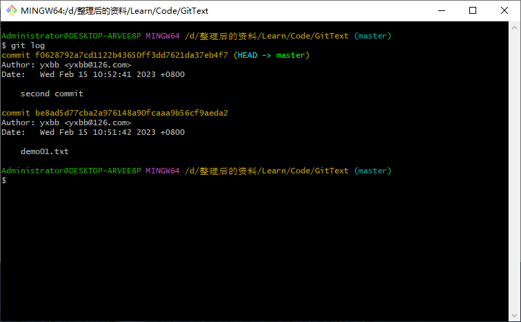

> **注意：**如果内容太长，多屏显示控制方式如下：
>
> + 空格键：向下查看
> + b：向上查看
> + q：退出查看

&emsp;&emsp;可以使用 ***`git log --pretty=oneline`*** 命令以漂亮的格式显示（每条日志只显示一行）：

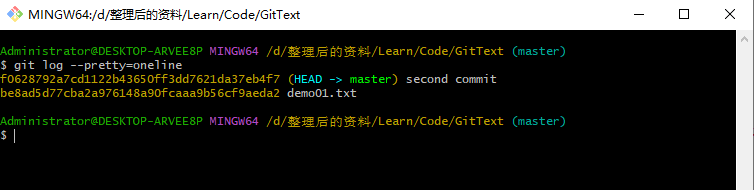

&emsp;&emsp;可以使用 ***`git log --oneline`*** 以简约的格式显示：

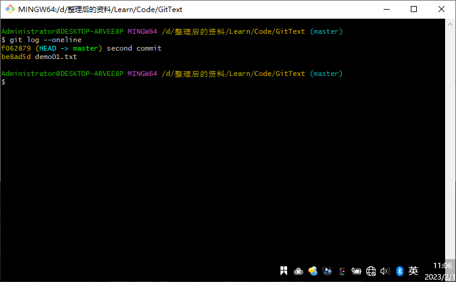

&emsp;&emsp;可以使用 ***`git reflog`*** 命令显示回滚版本步数（**推荐，HEAD@{回滚对应版本，底层操作需要移动多少步}**）：

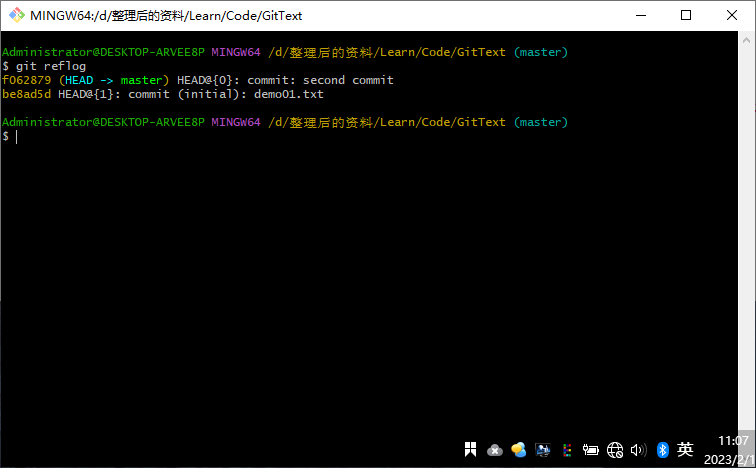

## 前进后退版本

&emsp;&emsp;可以通过 **HEAD** 指针来移动回滚版本：

 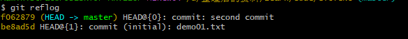

+ 基于索引值操作（**推荐方法**）
  + 命令： `git reset --hard <局部索引值>`
  + 举例： `git reset --hard be8ad5d`
+ 使用 **^ 符号**：只能后退
  + 命令： `git reset --hard HEAD^`
  + **一个 ^ 表示后退一步，n个表示后退 n 步**
+ 使用 **~ 符号**：只能后退
+ 命令： ***`git reset --hard HEAD~n`***
  + **n指定步数，表示后退 n 步**

&emsp;&emsp;要想恢复被删除的文件，前提是删除文件前，此文件已经提交到本地库。删除文件后，可以使用 `git reset --hard <历史记录索引值>` 命令，需要注意两点：

+ 删除操作已经提交到本地库：指针位置指向历史记录
+ 删除操作尚未提交到本地库：无法恢复

## 对比文件差异

&emsp;&emsp;如果需要将工作区和暂存区进行比较，可以使用 `git diff <文件名>` 命令。假设在 `demo01.txt` 中添加了一段内容，然后使用 ***`git diff demo01.txt`*** 命令查看：

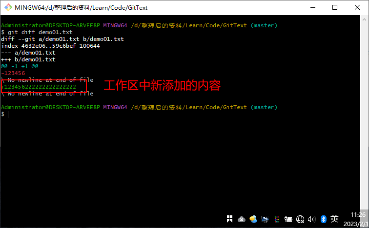

&emsp;&emsp;如果需要将工作区中的文件和本地库历史记录比较，可以使用  `git diff <本地库中历史版本> <文件名>` 命令：

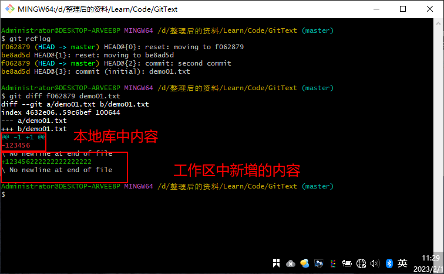

> **注意：**不带文件名比较多个文件。

# Git 分支管理

## 基础知识

&emsp;&emsp;Git 分支是指在版本控制过程中，使用多条线同时推进多个任务：

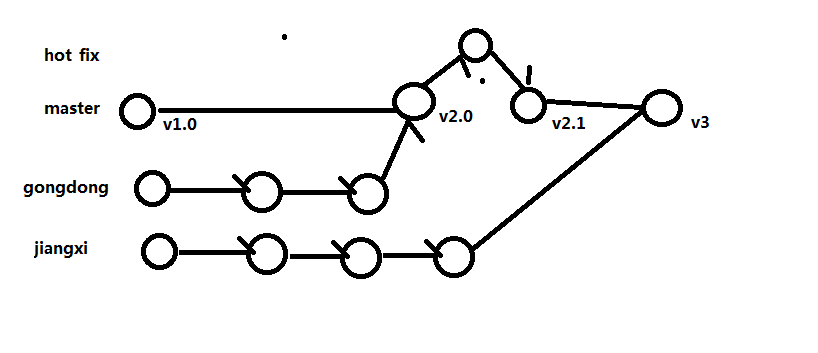

&emsp;&emsp;使用 Git 分支的好处：

+ 同时并行推进多个功能开发，提高开发效率
+ 各个分支在开发过程中，如果某一个分支开发失败，不会对其它分支有任何影响。失败的分支删除重新开始即可

## Git 分支操作

&emsp;&emsp;常用的命令：

|                   操作说明                   | 操作指令                                                     |
| :------------------------------------------: | ------------------------------------------------------------ |
|                   查看分支                   | `git branch -v`                                              |
|                   创建分支                   | `git branch 新分支名`                                        |
| 删除分支（删除的分支不是当前正在打开的分支） | `git branch -d 分支名`                                       |
|                   切换分支                   | `git checkout 分支名`                                        |
|                   合并分支                   | 首先切换到接受修改的分支上，`git checkout 需要接受的分支名`；然后执行 `git merge 有新内容的分支名` 命令。 |

&emsp;&emsp;出现冲突的表现如下：

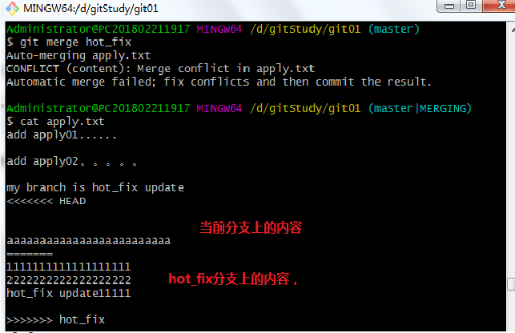

&emsp;&emsp;出现冲突后的解决方法如下：

+ 第一步：编辑文件，删除特殊符号
+ 第二步：把文件修改到满意为止，保存退出
+ 第三步：`git add 文件名`
+ 第四步：`git commit -m "日志信息"`（**此时 `commit` 后面一定不要有文件名**）

## 分支管理机制

1. 创建分支

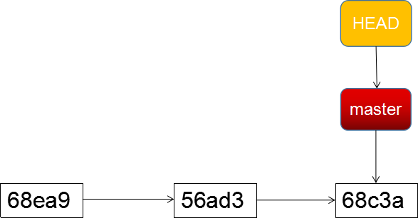

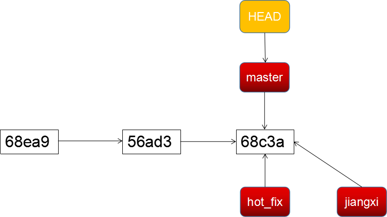

2. 切换分支

+ 创建两个分支，当前指向 `hot_fix`

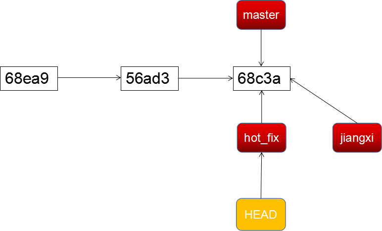

+ 在 `hot_fix` 更新了新的版本

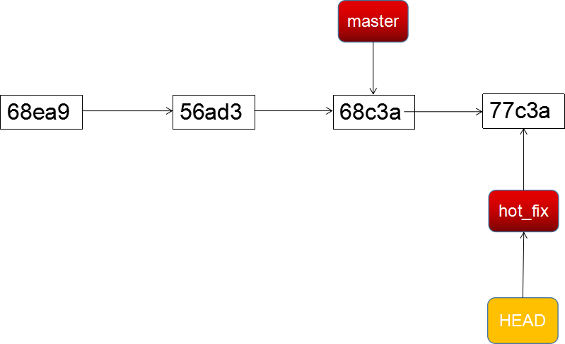

+ 由 `hot_fix`分支切换回 `master` 分支

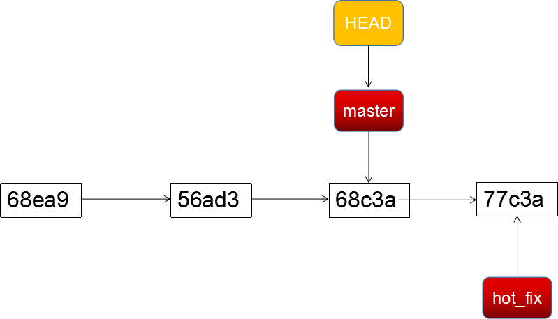

+ 在 `master` 分支上做了更新

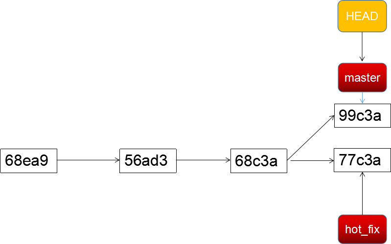