> GB/T 42588-2023
> 2023-05-23 发布     2023-12-01 实施

# 引言

&emsp;&emsp;功能点分析（FPA）方法作为软件功能规模测量方法中的一种，最初由 A.J.Albrecht 在 1974 年到 1979 年间开发的，FPA 是对大量项目进行生产率研究得出的结果。FPA 的第一个版本是在 1979 年推出的，随后根据实践经验在 1983 年和 1984 年进行了修订。

&emsp;&emsp;FPA 引入了一个单位，即功能点，来帮助度量一个开发或维护的应用程序的规模。在 FPA 的框架里，【应用程序】是指【一个自动化的信息系统】。功能点代表了应用程序提供给用户的信息处理的数量。这一测量单位独立于信息处理在技术上的实现方式。功能点事一个抽象术语，和所谓的【租赁点】进行类比。租赁点是根据房屋的房间数量、房间面积、设施数量以及房屋的位置决定的。这些作为住宅的衡量标准，提供给潜在的租户。

&emsp;&emsp;FPA 首先被用来测量应用程序构建后系统开发和系统维护的生产率，目前这项技术也用于支持软件项目预算编制和评估工作。

&emsp;&emsp;本文件是 FPA 方法中的一种，按照项目所处阶段和需求的详实程度将方法 FPA 分为预估功能点分析、估算功能点分析和详细功能点分析方法，为功能点分析人员提供帮助和指导。

# 范围

## 目的

&emsp;&emsp;本文件规定了应用 NESMA 功能点分析方法（FPA）的定义、规则和指南的集合。

## 一致性

&emsp;&emsp;本文件符合 ISO / IEC 14143-1:2007 中的所有要求性条款。

## 适用性

&emsp;&emsp;本文件适用于所有功能领域。

## 重点

&emsp;&emsp;本文件重点关注如何确定应用软件的功能规模。本文件在基于功能点规模编制项目预算时，不充当诸如生成率标准和生产率属性等方面的角色。

# 规范性引用文件

&emsp;&emsp;下列文件中的内容通过文中的规范性引用而构成本文件必不可少的条款。其中，注日期的引用文件，仅该日期对应的版本适用于本文件；不注日期的引用文件，其最新版本（包括所有的修改单）适用于本文件。

&emsp;&emsp;ISO / IEC 14143-1:2007    信息技术     软件测量      功能规模测量    第一部分：概念定义（Information technology-Software measurement-Functional size measurement-Part 1: Definition of concepts）

> 注：GB/T 18491.1-2001 信息技术 软件测量 功能规模测量 第1部分：概念定义（ISO/IEC 14143-1:1998, IDT）

# 术语、定义和缩略语

## 术语和定义

&emsp;&emsp;下列术语和定义适用于本文件：

+ 3.1.1 应用程序（application）：由一个或多个组件、模块或子系统组成，支持业务目标的自动化过程和数据的内聚汇集（`示例：应付账款、应收账款、工资单、采购、车间生产、装配线控制、空中搜索雷达、目标跟踪、武器发射、航班安排和乘客预定`）
+ 3.1.2 应用程序边界（application boundary）：应用程序与其用户和/或其他应用程序之间的概念接口（`注：当分析的范围确定后，应用程序边界被定义`）
+ 3.1.3 应用程序功能规模（application functional size）：用功能点表示应用程序的大小，由应用程序功能点计数确定（`通过应用程序功能规模，确定支持已实现应用程序所需的工作量`）
+ 3.1.4 自主增长（autonomous growth）：在功能细化时对初始未识别但隐含在需求中的功能点展示
+ 3.1.5 基本功能组件（base functional component）：功能规模测量方法中为测量目标而定义和使用的用户功能需求的基本单位（【来源：ISO/IEC 14143-1:2007， 3.1】 `注：NESMA FPA 方法中的基本功能组件由内部逻辑文件、外部逻辑文件、外部输入、外部输出和外部查询。通过这五种基本功能组件，功能用户需求的功能规模被测量。`）
+ 3.1.6 功能复杂度（functional complexity）：使用本文件定义的规则为一项功能进行特定复杂度评级的权重
+ 3.1.7 复杂度矩阵（complexity matrix）：用来给功能类型分配权重的数据表（`注：复杂度矩阵基于数据元素类型，及其引用的记录类型（对数据功能的复杂度）或者逻辑文件（对事务功能的复杂度）的数量，来分配权重`）
+ 3.1.8 概念数据模型（conceptual data model）：从用户的角度解释数据组的数据模型
+ 3.1.9 控制信息（control information）：通过指定要处理的数据的内容、时间或方式来影响基本过程的数据
+ 3.1.10 数据元素类型（data element type：DET）：用于控制、记录和传输信息，用户所见的数据的最基本形式
+ 3.1.11 数据功能（data function）：提供给用户以满足内部或外部数据存储要求的逻辑组合（`注：FPA 给每个数据功能分配一个类型，分为以下类型：内部逻辑文件和外部接口文件`）
+ 3.1.12 数据功能类型（data function type）：FPA 分配给数据功能的一种类别：分为内部逻辑文件和外部接口文件
+ 3.1.13 数据信息（data information）：进入或退出应用程序的信息，这些信息满足了用户的信息需求
+ 3.1.14 派生数据（derived data）：除了直接从数据函数中搜索和验证信息之外，还包括其他步骤过程中所产生的数据
+ 3.1.15 详细功能点分析（detailed function point analysis）：确定应用程序或者项目规模的最精确的计数
	+ 在这样的应用程序或者项目中，FPA 所需规约都已经非常详细
	+ 这意味着事务处理已经被定义到引用逻辑文件（也就是所谓的文件类型参考）和数据元素类型的级别，并且逻辑文件已经被定义到记录类型和数据元素类型的级别。至此，每个被认可的功能的复杂度才能够被确立起来。本文件中描述的详细功能点分析在计数中是最准确的类型，另外两种技术是估算功能点分析和预估功能点分析
+ 3.1.16 开发项目（development project）：一个新的应用程序，或基于现有应用程序进行独立增加的规格说明、构造和交付
+ 3.1.17 开发项目功能点分析（development project functional point analysis）：应用本文件来测量开发项目功能规模的活动
+ 3.1.18 对话（dialog）：用户和应用程序之间进行的，执行事务处理必须的信息交互
+ 3.1.19 基本过程（elementary process）：对用户有意义的最小功能单元，基本过程需要同时满足以下两个条件：
	+ 该功能对于用户有着自身完备的意义，并且完全执行一个完整的信息处理过程。换句话说，功能是自包含的
	+ 当该功能执行完成后，应用程序处于一个一致状态中
+ 3.1.20 增强开发（enhancement development）：为了改变应用程序规范，对应用程序所开展的活动。这些活动通常也会带来改变功能规模的结果（例如变更请求）
+ 3.1.21 增强项目（enhancement project）：对既有应用程序进行功能完善的项目，可能在既有应用程序中添加、更改和删除功能
+ 3.1.22 增强项目功能点分析（enhancement project function point analysis）：对实现了既有应用程序更改的项目进行测量时进行的计数
+ 3.1.23 错误信息（error message）：当错误的数据被输入，或者当其他处理错误发生时，应用程序给出的消息
+ 3.1.24 外部输入（external input：EI）：处理或控制来自应用程序边界之外的数据或信息的基本过程（外部输入是一种基本功能组件）
+ 3.1.25（外部查询 `external inquiry: EQ`）：向应用程序边界之外发送数据或控制信息的基本过程
+ 3.1.26（外部逻辑文件 `external logical file: ELF` ）：从用户的角度来看的一组永久数据，由一个应用程序使用，但由另一个应用程序维护
+ 3.1.27（外部输出 `external output: EO`）：向应用程序边界之外发送数据或控制信息的基本过程，包括外部查询之外的额外处理逻辑
+ 3.1.28（引用文件类型 `file type referenced: FTR`）：被事务处理维护或者读取的内部逻辑文件（`ILF`）或者外部逻辑文件（`ELF`）
+ 3.1.29（末期功能点分析 `final function point analysis`）：为确定项目结束时的功能点数进行的计数
	+ 注：这个计数记录下被定义或者被安装起来的应用程序的规模，或者能够确定所执行的项目的规模
+ 3.1.30（`FPA` 表 `FPA table`）：在应用程序中有次要功能的一种实体类型（例如代码表、引用表、带有常量、文本或解码的实体类型），其数据由计数的应用程序或其他应用程序维护
+ 3.1.31（`FPA` 数据表 `ELF FPA tables ELF`）：为在应用系统中识别出的所有 `FPA` 数据表集合所统计的外部接口文件，在被计数的应用程序中会使用这些 `FPA` 数据表，但是由另一个应用程序对它们进行维护
+ 3.1.32（`FPA` 数据表 `ILF FPA tables ILF`）：为应用程序中的可识别、可维护的 `FPA` 数据表集合统计的内部逻辑文件
+ 3.1.33（功能 `function`）：出于测量的目的而进行定义和使用的需求 / 规约的一个基本单位
+ 3.1.34（功能类型 `function type`）：从 `FPA` 的角度所看到的组成应用程序的五种类型的组件 
	+ 注 1：五种类型包括外部输入、外部输出、外部查询、内部逻辑文件和外部接口文件  
	+ 注 2：这些组件确定了应用程序提供给用户的功能数量
+ 3.1.35（功能点 `function point`）：功能规模的测度单位
+ 3.1.36（功能点分析 `function point analysis`）：功能规模测量的方法
+ 3.1.37（功能点数据表 `function point table`）：用于给功能类型分配功能点的数据表 
	+ 注：依赖于功能类型和功能复杂度
+ 3.1.38（功能规模 `function size`）：通过功能用户需求进行量化而得到的软件规模  
	+ 注：在 `NESMA FPA` 方法中，这是项目或应用程序中所有增加、更改或删除功能的功能点数量绝对值之和。应用程序功能规模和项目功能规模之间的区别【来源：GB/T 18491.1-2001, 3.6】
+ 3.1.39（估算功能点分析 `estimated function point analysis`）：一种可能的功能点分析方法，在应用程序生存周期的早期阶段决定应用程序或项目的大小，程序或项目假定有一定的最小规格
	+ 注 1：通常功能数量按照类型记录，缺省值用于复杂度，平均值用于事务处理功能，低值用于数据功能（逻辑文件）  
	+ 注 2：估算功能点分析是本文件所述的中间分析类型。另外两种类型的分析是详细 `FPA` 和预估 `FPA`
+ 3.1.40（预估功能点分析 `indicative function point analysis`）：仅仅基于概念数据模型或者符合第三范式的数据模型得到一种表示应用程序或者项目的估算规模的说明
	+ 注：预估功能点分析在本文件中是最不精确的计数类型。另外两种是详细功能点分析和估算功能点分析
+ 3.1.41（初期功能点分析 `initial function point analysis`）：在项目开始时执行的功能点计数
+ 3.1.42（启动触发器 `initiation trigger`）：负责激活预期事务的控制信息或功能控制数据
	+ 注：启动触发器的例子有：按钮、功能键或菜单项
+ 3.1.43（中期功能点分析 `interim function point analysis`）：在新的功能开发或者功能完善项目进行期间，为确定完成的临时功能完善规模进行的计数
	+ 示例：为了确定对于功能规划的一个添加、更改或者删除的范围所进行的计数
	+ 注：在应用程序功能点计数和项目功能点计数中的发生的改变都是临时功能点计数的目标
+ 3.1.44（内部逻辑文件 `internal logical file;ILF`）：一组用户可辨认的在被测应用程序边界内维护的逻辑相关数据或控制信息
+ 3.1.45（列表功能 `list function`）：一个显示满足，或者不一定满足特定选择标准的实体类型概要信息的在线功能
+ 3.1.46（逻辑文件 `logical file`）：从用户视角所看到的一个永久数据的逻辑组
	+ 注：逻辑文件分为内部逻辑文件或者外部逻辑文件，参见数据功能
+ 3.1.47（逻辑布局 `logical layout`）：为输出产品定义的用户需要的一组数据元素类型的集合及其逻辑结构 
	+ 注：逻辑布局区别于物理实现，不涉及数据在屏幕、记录或者其他介质上的物理展现方式
+ 3.1.48（维护 `maintain`）：通过基事务功能类型添加、更改或删除数据的过程
+ 3.1.49（菜单 `menu`）：显示在屏幕画面上的，展示可用功能并能选择的列表
+ 3.1.50（菜单结构 `menu structure`）：通过一系列相关的菜单和屏幕画面实现应用程序与用户之间的对话
+ 3.1.51（输出产品 `output product`）：由应用程序发布的一种被采用信息的逻辑形式
	+ 注：典型的输出产品包括记录、输出文件或者发送给其他应用程序的消息
+ 3.1.52（项目功能规模 `project functional size`）：用功能点表示的开发项目或者增强项目的规模
	+ 注 1：项目功能点计数能确定实现新软件，或更改既有软件的功能所需要的投入
	+ 注 2：在增强项目中，一个项目功能点计数涉及对功能的添加、更改和删除
+ 3.1.53（记录类型 `record type`）：逻辑文件中的实体类型
+ 3.1.54（报告 `report`）：以用户指定的布局下的数据输出
	+ 注：输出介质对于 `FPA` 来说是无关紧要的，记录可能同时涉及外部输出和外部查询
+ 3.1.55（事务 `transaction`）：参见事务功能（3.1.57）
+ 3.1.56（事务文件 `transaction file`）：一个临时数据文件 
	+ 注：只被读取一次，并且数据会被消耗掉
+ 3.1.57（事务功能 `transaction function`）：提供给用户用以处理数据功能的基本过程
	+ 注：事务功能包括外部输入、外部输出和外部查询
+ 3.1.58（事务功能类型 `transactional function type`）：分配给事务功能的任一个类别
	+ 注：事务功能类别包括三个类别：外部输入、外部输出和外部查询
+ 3.1.59（独特的功能 `unique function`）：一个在形式和/或逻辑处理上不同于应用程序提供的其他任何功能的功能
+ 3.1.60（用户 `user`）：在任何时刻与软件通信或交互的人或事物  
	+ 注：事物包括但不限于软件应用、动物、传感器或其他硬件【来源：GB/T 18491.1—2001,3.11】
+ 3.1.61（用户视角 `user perspective`）：用户描述的功能性用户需求
	+ 注：开发人员将用户视角转换为软件，以便提供解决方案

## 缩略语  

&emsp;&emsp;下列缩略语适用于本文件：

+ DET：数据元素类型（Data Element Type）  
+ EI：外部输入（External Input）  
+ EO：外部输出（External Output）  
+ EQ：外部查询（External inQuiry）  
+ ELF：外部逻辑文件（External Logical File）  
+ FPA：功能点分析（Function Point Analysis）  
+ FTR：文件类型引用（File Type Referenced）  
+ GUI：图形用户界面（Graphical User Interface）  
+ ILF：内部逻辑文件（Internal Logical File）  
+ LF：逻辑文件（Logical File）  
+ NESMA：荷兰软件度量协会（Netherlands Software Measurement Association）  
+ RET：记录类型（Record Type）

# 4 FPA 总则和总体要求

## 4.1 FPA 定义  

&emsp;&emsp;`FPA` 通过对应用程序的分析或对应用程序规格说明的分析，以确定其功能规模。确立应用程序或项目的功能规模的行为通常被称为【功能点分析】。  

&emsp;&emsp;执行功能点分析应首先确定以下几点：  

+ 功能点分析的目的
+ 分析的范围和待分析应用程序或项目的边界

## 4.2 FPA 使用范围

&emsp;&emsp;`FPA` 可用于应用程序，也可用于项目。`FPA` 使用区分以下两个目标：

+ 确定应用程序功能点数：即测量应用程序将要或已提供给用户的全部功能的功能点总数  
+ 确定项目功能点数：即测量新的应用程序的全部功能或已有应用程序更改的全部功能的功能点总数。对已有应用程序的更改包括新增、更改和删除功能。在衡量项目工作量的投入和工作所需工期时，项目功能点为必要的衡量参数

## 4.3 功能点分析的类型

&emsp;&emsp;基于所提供的功能规格说明的详细程度，功能点分析类型分为：预估功能点分析、估算功能点分析和详细功能点分析。

## 4.4 项目开发过程中的功能点分析

&emsp;&emsp;功能点分析可在项目开发的不同时期进行，根据项目开发的不同阶段功能点分析分为：初期功能点分析、中期功能点分析和末期功能点分析。

## 4.5 功能点分析的范围及边界

&emsp;&emsp;功能点分析范围是指被包含在功能点分析范围内的功能需求 / 规格说明的集合，一旦确定范围就可定义边界，边界为应用程序与其用户或其他应用程序之间的概念接口。

&emsp;&emsp;功能点分析应首先确定范围和边界，以便能够正确执行功能点计数。

## 4.6 用户

&emsp;&emsp;`FPA` 有以下三种用户类型：

+ 使用或者将会使用被测量软件的人员和/或组织，包括：最终用户、职能经理和操作人员
+ 负责确认功能规格说明中所包含的需求和愿望的雇主和/或员工
+ 使用待分析的应用程序的数据或功能的其他应用程序

&emsp;&emsp;由于功能点分析是从用户的角度出发开展的，且用户是唯一能够确定某项功能是否需要的角色，因此始终需要与用户合作来进行功能点分析，或者至少要求用户对分析结果进行验证。

## 4.7 功能和功能类型

&emsp;&emsp;功能点分析对应用程序的全部或部分功能进行测量，它随着应用程序功能的逐渐明确而不断完善。用户需要的、认可的，并被认为是非常重要的组件称之为功能或者基本功能组件。每项功能都属于特定的功能类型。

&emsp;&emsp;从 `FPA` 的视角看，应用程序中存在五种类型的组件：

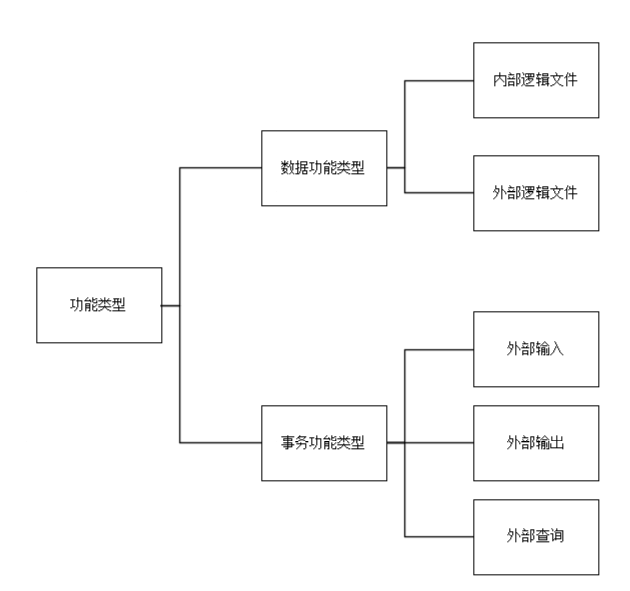

&emsp;&emsp;这些组件决定了应用程序提供给用户的功能总量。

&emsp;&emsp;功能类型被划分成两个组：

+ 数据功能类型：包括内外逻辑文件和外部逻辑文件
+ 事务功能类型：包括外部输入、外部输出和外部查询

&emsp;&emsp;不同功能类型的赋值按照附录B的要求执行。

## 4.8 功能复杂度

&emsp;&emsp;功能复杂度是对某一特定功能类型的复杂度评级。可使用合适的复杂度矩阵来确定功能的复杂程度。功能复杂度依赖于数据元素类型的数量，以及给定功能关联的逻辑文件数量。存在以下 3 种级别的复杂度：

+ 低：功能涉及很少的数据元素类型和逻辑文件
+ 中：功能复杂度介于低和高之间
+ 高：功能涉及很多的数据元素类型和逻辑文件

## 4.9 功能的赋值

&emsp;&emsp;在确定了功能的复杂度之后，就可为功能分配一定数量的功能点。功能点数的分配应按照下表执行：

| 复杂度 | 内部逻辑文件（ILF）        | 外部逻辑文件（ELF）        | 外部输入（EI）           | 外部输出（EO）           | 外部查询（EQ）           |
| --- | ------------------ | ------------------ | ------------------ | ------------------ | ------------------ |
| 低   | <strong>7</strong> | <strong>5</strong> | 3                  | 4                  | 3                  |
| 中   | 10                 | 7                  | <strong>4</strong> | <strong>5</strong> | <strong>4</strong> |
| 高   | 15                 | 10                 | 6                  | 7                  | 6                  |
+ 注 1：加粗的数字为预估功能点分析所采用的数值
+ 注 2：在执行估算功能点分析时，规格说明中提供的信息虽然足以用来识别功能及其类型，但是却难以识别这些功能的复杂度。在这种情况下，数据功能被认为是【低】，事务功能被认为是【中】。

## 4.10 功能规模

&emsp;&emsp;功能点计数是那些位于被统计对象（例如应用程序或项目）的边界之内的所有功能被分配的功能点数的总和。

&emsp;&emsp;功能点计数也可作为项目预算编制的基础，可将功能点的总数量乘以基于历史数据的生产率（如每个功能点的耗时率）。

&emsp;&emsp;对用户功能需求或软件规格说明书使用 `NESMA` 功能点进行测量时，测量结果应标记如下：`fp(GB/T 42588—2023)`。

# 5 FPA 操作准则

## 5.1 FPA 的实施步骤

&emsp;&emsp;`FPA` 的实施包括以下步骤：

+ 步骤 1：收集可用文档。用于预估功能点分析、估算功能点分析和详细功能点分析宜提供的文件分别在 5.2.1、5.2.2 和 5.2.3 中描述
+ 步骤 2：确定应用程序的用户（见 4.6）
+ 步骤 3：明确应执行的是应用程序功能点分析还是项目功能点分析。项目功能点分析按 5.4 的规定进行，应用程序功能点分析按 5.5 的规定进行
+ 步骤 4：确定要分析的应用程序从其他哪些应用程序中接收和/或使用数据
+ 步骤 5：识别功能并明确其类型和复杂度。根据 4.9 中的功能点分配表计算得到功能规模。同时记录功能点分析的条目和功能点数，尤其是制约因素和假设条件
+ 步骤 6：如果涉及需要对规格说明做出特别解释的部分，可与用户共同确认。必要时可对功能点分析结果进行修正
+ 步骤 7：需要的话可与 `FPA` 专家一同核对功能点分析结果，并根据核对结果修正功能点分析结果

## 5.2 功能点分析的类型

### 5.2.1 预估功能点分析

#### 5.2.1.1 定义

&emsp;&emsp;预估功能点分析是基于概念数据模型或形式化数据模型估算应用程序或项目的规模，应谨慎使用这种预估功能点分析，因为可能出现高达 50% 的偏差。预估功能点分析的功能规模计算方式主要包括以下几种：

&emsp;&emsp;当有概念模型或具有类似详细程度的模型可用时，采用公式（1）计算：

（1）                                              FP = CILF × 35 + CEIF × 15

&emsp;&emsp;式中：  

+ FP：预估功能点计数
+ CILF：概念数据模型中内部逻辑文件数量
+ CEIF：概念数据模型中外部逻辑文件数量

&emsp;&emsp;当 `FPA` 表（见 6.20）由被计数应用程序维护，将其计为一个内部逻辑文件。当 `FPA` 表由其他应用程序维护，将其计为一个外部逻辑文件。因此，对于所有 `FPA` 表，最多计算两个逻辑文件。

&emsp;&emsp;计算因子【35】假设每个内部逻辑文件存在三个外部输入（新增、更改、删除）、两个外部输出、一个外部查询和一些通用功能。因此，内部逻辑文件的复杂度较低，是 `7fp`，事务功能的平均复杂度是 `26fp(3 × 4 + 2 × 5 + 4)`，通用功能是 `2fp`。

&emsp;&emsp;计算因子【15】是基于外部逻辑文件的低复杂度 `5fp`、外部输出 `5fp` 和外部查询 `4fp` 以及每个外部逻辑文件的一些通用功能 `1fp`。

&emsp;&emsp;当有第三范式模型或具有类似详细程度的模型可用时，采用公式（2）计算：

（2）                                      FP = NETM × 25 + NETE × 10

&emsp;&emsp;式中：  

+ FP：预估功能点计数
+ NETM：形式化数据模型中维护的实体类型数量
+ NETE：形式化数据模型中引用的实体类型数量

&emsp;&emsp;在这里，当来自 `FPA` 表类型（见 6.20）的实体类型由被计数应用程序维护，就作为维护的实体类型计数；来自 `FPA` 表类型的实体类型由其他应用程序维护，就作为引用的实体类型计数。因此，对于所有 `FPA` 表类型，最多计两个实体类型。

#### 5.2.1.2 适用性

&emsp;&emsp;当数据模型可用时可进行预估功能点分析，并从中可导出数据功能（见 5.7），数据模型可用多种方式表示，包括 Bachman 图、文本形式的描述、实体关系（ERD）或 UML 类模型。

&emsp;&emsp;在应用程序生存周期的随后阶段，数据模型可是概要的（例如用敏捷的方法完成产品代办事项列表），也可是详细的。这里的概要意味着并非所有细节都是已知的，逻辑文件和维护它们的应用程序是已知，但是没有完整的属性列表，也没有关于它们之间关系和验证的完整细节。

#### 5.2.1.3 规格说明要求

&emsp;&emsp;下列内容适用于预估功能点分析：  

+ 被计数的应用程序的概念数据模型或形式化数据模型
+ 需要明确不管在此应用程序或其他应用程序中计数时，被区分的逻辑文件是如何维护的

### 5.2.2 估算功能点分析

#### 5.2.2.1 定义

&emsp;&emsp;估算功能点分析确定每个功能类型（事务功能类型和数据功能类型）的功能数量，并采用标准值来表示复杂度。事务功能类型的平均值和数据功能类型的低值。

&emsp;&emsp;这些复杂度取值优于详细功能点分析的复杂度值规则。

#### 5.2.2.2 适用性

&emsp;&emsp;当数据模型（见 5.2.1）可用，并且对使用它的事务功能（见 4.7）有深入了解时，可进行估算功能点分析。

&emsp;&emsp;通常在瀑布工作模式中，估算功能点在分析阶段结束时可用；而在敏捷开发中，当用户场景与事务功能相关且数据功能可识别时，即可应用估算功能点。这时迭代代办事项（有时是产品代办事项）已经可用了。

#### 5.2.2.3 规格说明要求

&emsp;&emsp;使用估算功能点分析应具备以下条件：

+ 明确所包含的逻辑文件及其相关项
+ 明确逻辑文件的维护情况：由被计数的应用程序或其他应用程序维护
+ 明确应用程序功能的输入和输出信息流
+ 明确要计算的应用程序功能与其环境之间的信息流

### 5.2.3 详细功能点分析

#### 5.2.3.1 定义

&emsp;&emsp;详细功能点分析是最精确的功能点分析，在该分析中，`FPA` 所需的所有规格应已经详细了解。事务功能已精确到引用逻辑文件和数据元素类型的级别，逻辑文件已经精确到记录类型和数据元素类型的级别。此情况下，已经可确定每个功能的复杂度。

#### 5.2.3.2 适用性

&emsp;&emsp;当能够建立详细的数据模型（见 5.2.1），并且对其相关事务功能已明确时，可进行详细功能点分析。事务功能对数据模型中的逻辑文件进行维护的所有细节以及关于它们的所有进一步的功能细节都应是明确的。

&emsp;&emsp;通常，在瀑布模型中，这些信息在功能设计期间或结束时可用。在敏捷开发中，当相应的用户描述达到【完成】的定义时可用，即在一个迭代内完成。

#### 5.2.3.3 规格说明要求

&emsp;&emsp;使用详细功能点分析应具备以下条件：

+ 模型中包含所有逻辑文件及其相关项（例如 Bachman 图或实体关系图）
+ 逻辑文件的记录类型和数据元素类型
+ 明确逻辑文件的维护情况：由被计数的应用程序或其他应用程序维护
+ 明确应用程序功能、输入和输出信息流、与函数有关的逻辑文件以及支持功能（帮助功能等）的
+ 应用程序的输入和输出信息流的详细规格应达到数据元素类型级别

## 5.3 规格说明质量的作用

&emsp;&emsp;无论使用何种类型的功能点分析方法（见 5.2），都需要应用程序具有完备的功能规格说明才能应用功能点分析。根据所使用的方法，所产生功能需求说明的形式可能会有所不同。但是，对同一应用程序的功能点分析宜保持相同结果。

&emsp;&emsp;功能点分析的可信度直接取决于所提供规格说明的质量。高质量的规格说明会减少将其转换为功能点的工作量，并且能够得出可靠的计数。规格说明有缺陷或不完整可能导致无法执行 `FPA`，或者由于规格说明的歧义而导致分析结果因人而异。

## 5.4 项目中的 FPA

### 5.4.1 概述

&emsp;&emsp;`FPA` 在系统开发项目的整个过程中都发挥着作用。例如，在项目的规划阶段，将执行初期功能点分析。在项目执行期间，一旦提交了与已经记录的规格说明相关的变更请求，便会进行中期功能点分析。项目完全完成后，末期功能点分析将确定所提供产品的规模以及项目的功能规模。

### 5.4.2 初期功能点分析

&emsp;&emsp;用于开发应用程序或增强应用程序项目开始时（新增、更改或删除功能）的分析。在这个分析中需要记录应用程序（见 5.5）和项目（见 5.6）的功能规模。

&emsp;&emsp;初期功能点分析宜在项目开始时执行。根据规格说明的可用性，可使用预估、估算或详细功能点分析。初期功能点分析的目的是根据工作量和进度制定项目预算。

### 5.4.3 中期功能点分析

&emsp;&emsp;用于在开发项目或增强项目中发生变更时（新增、更改或删除功能）的分析。其反应了更改对应用程序功能规模（见 5.5）和项目功能规模（见 5.6）产生的影响。

&emsp;&emsp;当功能规格发生变更时，宜进行中期功能点分析。根据可用的规格说明，可使用预估、估算或详细功能点分析。中期功能点分析的目的是确定变更请求对与客户达成一致的价格和交货日期产生的影响。

### 5.4.4 末期功能点分析

&emsp;&emsp;在开发项目或增强项目结束时（新增、更改或删除功能）进行的分析，其记录了应用程序（见 5.5）或项目（见 5.6）的最终功能规模。

&emsp;&emsp;末期功能点分析是在项目结束时进行。该项目可能涉及应用程序的开发，也可能与应用程序运维阶段的功能完善有关。末期功能点分析的一个目标是确定应用程序功能的功能点规模，另一个目标是确定项目的规模，以便确定生产率。例如每一个功能点固定价格达成共识后，可进行项目的最终结算。

## 5.5 确定应用程序的功能规模

### 5.5.1 确定应用程序边界

&emsp;&emsp;应用程序边界是指应用程序（正在开发或已开发）与其环境（用户和/或其他应用程序）之间的边界，确定应用程序边界的方法如下：

+ 由应用程序边界划分的应用程序宜组成一个独立的整体，可在很大程度上独立于其他应用程序运行
+ 识别所有者或主要用户。如果有多个所有或关键用户，则通常意味着有多个应用程序
+ 通过用户视角来查看应用程序，因此只使用用户实际可观察到的应用程序部分。从用户视角描述或定义应用程序外部的规格是应用程序环境，这被称为应用程序上下文，它可用于上下文图等方式表示，来确定位于应用程序内部和外部的内容。只有用户要求的并且与之有关的事项才适用于功能点分析
+ 将一个应用程序视为一组整体维护的程序，应用程序边界涵盖了这组程序，需要识别出所有在此边界内的功能

### 5.5.2 新应用程序的功能规模

&emsp;&emsp;新应用程序的功能规模包括正在构建过程中或根据用户或用户组织的要求已经完成构建的应用程序的功能规模，其功能规模测量遵循以下要求：

+ 在应用程序的开发过程中确定功能规模步骤见 5.1。如果开发项目中的应用程序是在单个项目中实现的，则确定应用程序的功能规模与确定项目的功能规模步骤相同（见 5.6.2）；确定应用程序的功能规模后，转换软件的规模不应再进行计算
+ 如果多个子项目合并执行的形式实现应用程序，则检查所有子项目所提供的全部功能，以确定应用程序的功能规模。在检查这些子项目时，需要确保不对出现在多个子项目（例如逻辑文件）中的功能进行重复计数
+ 如果对现有应用程序进行了增强（功能的添加、更改或删除），宜按照 5.5.3 的规定确定（更改的）应用程序的功能规模

### 5.5.3 增强应用程序的功能规模

&emsp;&emsp;原则上，增强可发生在应用程序生存周期的每个阶段，但通常在构建过程中或在运维过程中进行。如果进行了重大更改，则可定义一个单独的项目，除可确定应用程序的功能规模外，还可确定项目的功能规模。在所有情况下，增强后都以相同的方式确定应用程序的功能规模。

&emsp;&emsp;确定增强应用程序的功能规模采取的步骤如下：

+ 步骤1：确定更改前应用程序的功能点数（AFPB）
+ 步骤2：确定将哪些事务和/或逻辑文件添加到应用程序，并确定它们的功能点数（ADD）
+ 步骤3：确定从现有应用程序中删除哪些事务和/或逻辑文件，并计算它们的功能点数（DEL）
+ 步骤4：确定更改哪些业务和/或逻辑文件，然后确定更改之前（CHGB）和更改之后（CHGA）的功能点数
+ 步骤5：确定完善后的应用程序的功能规模（AFPA），采用公式（3）如下：

（3）                           `AFPA = [AFPB + ADD - DEL + (CHGA - CHGB)]` 

&emsp;&emsp;式中：

+ AFPA：项目完善后的功能规模
+ AFPB：项目更改前的功能点数
+ ADD：项目添加的功能点数
+ DEL：项目删除的功能点数
+ CHGA：项目更改后的功能点数
+ CHGB：项目更改前的功能点数

### 5.5.4 重定义应用程序的功能规模

&emsp;&emsp;如果将一个应用程序替换为具有相同功能的另一个应用程序，则新应用程序的功能规模等于它要替换的旧应用程序的功能规模。

&emsp;&emsp;如果增强也是这种替换的结果，则可通过两种方式确定应用程序的功能规模：

+ 替换可被认为是最新的应用程序。如果选择此选项，则按照 5.5.2 所述进行计数
+ 替换可被视为对要替换的应用程序的完善。在这种情况下，按照 5.5.3 所述进行计数

## 5.6 确定项目的功能规模

### 5.6.1 项目与应用程序功能规模差异

&emsp;&emsp;确定一个项目的功能规模（即计算项目的功能点数量）与单纯地计算应用程序的功能规模（即确定已提供或将要提供的功能规模）有许多不同之处，因为投入的工作量并不总是导致功能的增加。例如，考虑删除功能，或者创建一次性功能以转换数据。

&emsp;&emsp;下面的内容使用了几种项目的情况，详细说明了如何确定项目的功能规模。下表举例说明了如何确定项目和应用程序的功能规模以及两者之间的差异：

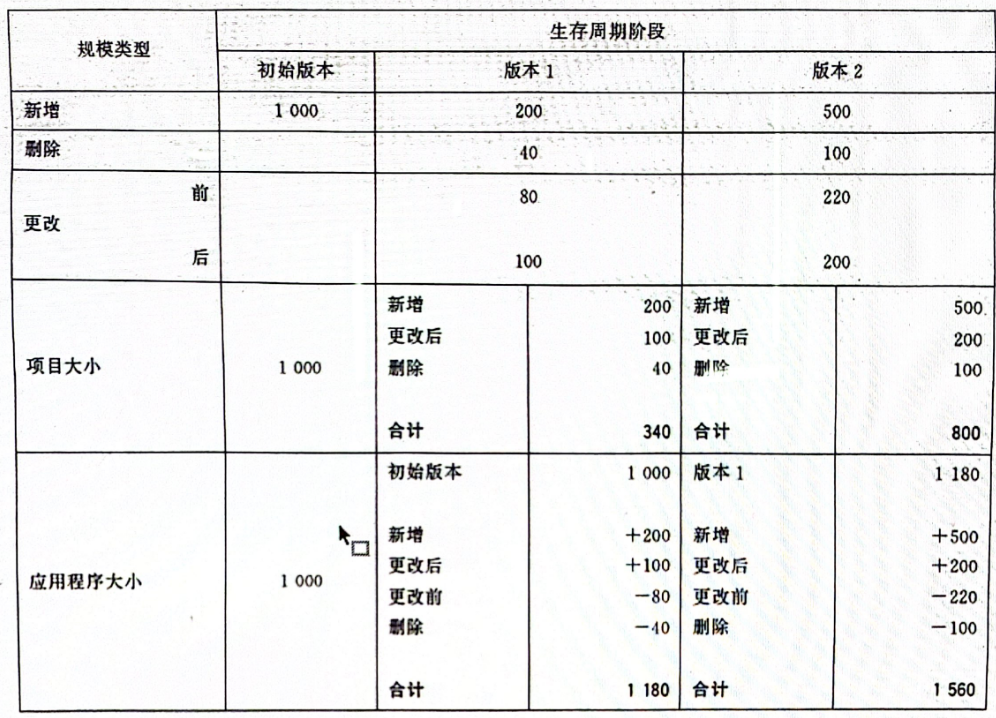

&emsp;&emsp;确定开发应用程序的功能规模与增强应用程序不同。不过，在这两种情况下，都应首先确定应用边界，这一点在下面的子条款中有更深入的介绍。

### 5.6.2 确定项目功能点分析的范围

#### 5.6.2.1 项目功能点分析的范围

&emsp;&emsp;功能点分析包含开发项目或增强项目的功能需求/规格说明集，可能包括一个或多个应用，因此只准许按照 5.5.1 的规定确定多个应用程序边界。

&emsp;&emsp;两种不同项目类型的定义如下：

- 开发项目：实现全新应用程序的项目。在其执行过程中，一个开发项目可分为多个子项目，每个子项目负责应用程序中的某个子系统，如果子系统本身就是一个应用程序，那么每个子项目都宜被视为一个单独的开发项目，现有应用程序的重构（重新设计）也是开发项目（见 5.5.4）
- 增强项目：对现有应用程序进行增强的项目，该类项目可在现有应用程序中新增、更改或删除功能（见 5.7）

#### 5.6.2.2 项目范围确定

&emsp;&emsp;以下步骤有助于确定项目的范围：

+ 通过用户的视角来看待要实现的应用程序，确定项目范围宜考虑逻辑结构，而非物理结构
+ 一个应用程序可分为多个并行执行的子项目进行开发，每个子项目实现一个子系统。因此，此类子项目的范围包括子系统。如果子系统应能独立存在（例如，由于应用程序的分阶段实施或出于功能原因），那么子系统之间的数据交换也包含在每个子项目的功能规模中。该应用程序的范围包含所有子项目，这意味着子系统之间的接口位于整个应用程序边界内。项目功能规模是子项目功能点数量的总和，可高于整个应用程序的功能点数（应用程序功能规模），因为在这种情况下，如特定子项目的内部逻辑文件对于使用同一内部逻辑文件的另一个子项目，也将计为内部逻辑文件或外部逻辑文件
+ 判断某个功能是否位于用户所需的应用程序边界内的一个实用方法，是询问用户是否真的想为这个功能付费
+ 存在疑问时与用户进行协商

### 5.6.3 开发项目的功能规模

&emsp;&emsp;开发项目的功能规模测量采取以下步骤：

+ 步骤1：确定要实现的每个（子）系统的功能点数量
+ 步骤2：计算转换的功能点数量，这些功能点仅对项目的功能规模有帮助。所需的转换软件不产生任何附加功能，只是一个一次性工具，因此不是要实现的应用程序的一部分
+ 步骤3：确定项目中正在实现的其他应用程序的变更功能点数量（见 5.1 中的步骤 1 至 5）。这些功能点将增加项目的功能规模（受项目影响的应用程序的新功能规模也应根据每个应用程序确定）  
+ 步骤4：项目的功能规模是步骤1、2 和 3 所记录的功能点数的总和

&emsp;&emsp;注：项目的功能规模经常被用于预算。当不同的应用程序被更改/增强时，确保对每个应用程序做预算，因为不同的开发环境可能有不同的生产率。

### 5.6.4 增强项目的功能规模

&emsp;&emsp;增强项目确定功能点中项目功能规模的步骤如下：

+ 步骤1：确定哪些事务和/或逻辑文件将被添加到应用程序中，并确定它们的功能点数（ADD）
+ 步骤2：确定哪些事务和/或逻辑文件要从现有应用程序中删除，并确定它们的功能点数（DEL）
+ 步骤3：确定要更改的事务和/或逻辑文件，然后确定它们更改后的功能点数（CHGA）
+ 步骤4：计算增强项目的功能规模，使用公式（4）：

（4）                                          EFP = ADD + DEL + CHGA

&emsp;&emsp;式中：

- EFP：项目功能点计数
- ADD：项目添加的功能点数
- DEL：项目删除的功能点数
- CHGA：项目更改后的功能点数

+ 步骤5：如果由于更改而应制作转换软件，则需要确定它的功能点数，并将其添加到步骤 4 中确定的项目功能规模中。

&emsp;l&emsp;注：这些功能使用的现有内部逻辑文件和外部逻辑文件将被新增、更改或删除，但它们本身在增强项目期间不会更改，在确定项目功能规模时不作为内部或外部逻辑文件进行计数。

### 5.6.5 应用程序切换期间的项目功能点分析

&emsp;&emsp;通常有必要用效率更高且满足当今信息技术要求的应用程序来替换已长时间运行的应用程序。这通常通过替换项目来完成。

&emsp;&emsp;在这种情况下只准许构建整个应用程序，因此确定项目功能规模的方式与处理开发项目时相同（见5.6.3）。

## 5.7 功能变更定义

### 5.7.1 概述

&emsp;&emsp;一个或多个功能的功能规模说明会根据变更申请而调整。如果这些调整产生的活动（设计、编码、测试等等的调整）目标是使应用程序更符合变更后的规格，则这些功能宜视为增强版本内的功能。

&emsp;&emsp;使用与评估开发功能规模相同的计数准则来确定一个变更后功能的规模。

&emsp;&emsp;所有在变更需求中涉及的功能以及由于提出的变更而变更的所有功能都宜在增强版本的功能点分析中进行计数。

### 5.7.2 事务功能更改

&emsp;&emsp;从用户的视角来看，更改后的事务功能宜在功能上有所改变，但用户对此事务功能的主要目的并未改变。

&emsp;&emsp;变更申请中所涉及的事务功能若满足下列条件之一则视为功能性更改：

+ 事务功能中新增、更改或删除一个或多个 DET
+ 事务功能中新增或删除一个或多个逻辑文件
+ 增强版本中一个数据功能发生变更，且其中至少一个更改后的 DET 是该事务功能的一部分
+ 增强版本中事务功能的逻辑处理方法发生改变（如新增、更改和/或删除了验证或计算的结果）

### 5.7.3 数据功能更改

&emsp;&emsp;变更申请中所涉及的数据功能若满足下列条件之一则视为功能性更改：  

+ 在增强项目中，由于一个或多个 DET 被添加到数据功能中，和/或数据功能的一个或多个 DET 被改变（见 5.7.4 ），和/或一个或多个 DET 被从数据功能中移除，导致数据功能的结构发生改变
+ 增强项目中数据功能的性质发生改变。例如，因事务功能的功能变更而使得数据功能从外部逻辑文件变为内部逻辑文件或相反的变更

### 5.7.4 DET 更改

&emsp;&emsp;若 DET 满足下列条件之一，则视为 DET 更改：

+ 长度（位置数）变更  
+ 数据类型改变（如从字母数字类型变为纯数字类型）
+ 小数点位数变更

## 5.8 特定情况下的 FPA

### 5.8.1 基于传统设计的分析

&emsp;&emsp;传统设计通常使用数据模型和过程模型来描述用户需要的功能。数据模型可采用实体关系图来描述实体类型、属性类型以及它们之间的链接关系。流程模型可采用数据流图的形式来描述功能和数据流之间的链接关系。模型是基于传统设计进行功能点分析的基础，同时也需要相关的屏幕布局和列表布局。屏幕和列表布局虽非必需的，却常常很有用。数据功能从数据模型中识别出来，事务功能则是从过程模型中识别。

&emsp;&emsp;基于传统设计进行功能点分析具有以下优势：  

+ 从已明确的功能需求视角进行分析，几乎不考虑技术因素
+ 设计是对所有功能性需求的完整说明

### 5.8.2 套装软件分析

#### 5.8.2.1 总则

&emsp;&emsp;当套装软件被作为一个可行的解决方案时，首先要确定套装软件是否能在现有的技术基础设施上运行。如果是，则应对选中的套装软件进行如下确认：

+ 套装软件能提供哪些用户需要的功能，这些功能的功能点是多少（套装软件在规格说明书编制阶段所计算的功能点数）
+ 套装软件不能提供哪些用户需要的功能，这些功能的功能点是多少（套装软件既未提供也不必更改的功能点数。如果随后为了使其符合用户的所有原始需求决定升级套装软件，升级宜被视为增强（见 5.5.3 和 5.6.4）  
+ 套装软件提供了哪些并非用户需要的功能，这些功能的功能点是多少（套装软件提供的额外功能的功能点点数。由于这部分功能是套装软件规模的一部分，项目需要支付费用。但这部分功能不是对用户有效和有用的应用程序功能。根据功能点分析的目的（测量套装软件中对用户有用的功能规模），进行套装软件功能点分析时不应将其计算在内

&emsp;&emsp;在采购套装软件时使用 FPA 的一大优势在于，关注提供的功能和成本因素之间的关系，这在决定是自行开发应用程序，还是购买现成的套装软件时起到关键作用。在 FPA 的帮助下，可基于功能、成本以及功能交付使用的时间节点，在自行开发和购买之间做出决定。

&emsp;&emsp;套装软件规模分析存在三个可能目标：  

+ 确定套装软件的性价比。换句话说，套装软件所提供每个功能点的成本是多少？在进行这项评估时，只有那些用户或客户所需功能点以及套装软件提供的功能点才是相关的  
+ 确定套装软件提供的用户或客户所需功能与用户或客户所需全部功能的比例（包括新增及变更功能） 
+ 确定套装软件提供的用户或客户所需功能与套装软件提供全部功能的比例

#### 5.8.2.2 识别套装软件的数据功能（逻辑文件）

&emsp;&emsp;识别套装软件的数据功能遵循以下要求：  

+ 在采购套装软件时，所提供的数据中通常不包括概念数据模型。有时候，套装软件会有一个可用的数据模型，数据功能就可以从这个数据模型中识别出来（见6.21）  
+ 如果没有数据模型，可利用所提供的功能来识别逻辑文件。如果可用，也可从物理数据库结构中识别出来

#### 5.8.2.3 识别套装软件的事务功能（事务处理）

&emsp;&emsp;识别套装软件的事务功能遵循以下要求： 

+ 如果有功能规格说明或用户手册，套装软件提供的事务功能可以从这些材料中识别
+ 如果所提供文档不足，但套装软件的测试或演示实施可用的话，则事务功能可从屏幕或窗口中识别（见5.8.3）
+ 如果只有菜单结构的话，也可尝试从中识别出事务功能。在面对诸如【维护】这样的一个菜单选项时，可识别出三个外部输入（新增、更改和删除）。对于诸如【显示】这样的一个菜单选项，则可识别出一个外部查询或一个外部输出

#### 5.8.2.4 确定所需功能

&emsp;&emsp;确定所需功能时，使用用户或客户的功能需求进行分析，遵循以下要求：  

+ 如果功能需求尚未明确，则应与用户合作，确定哪些逻辑文件和套装软件哪些功能是相关的（参考本节前面关于如何确定数据功能和事务功能的描述）
+ 在确定套装软件总的应用功能规模时可包括套装软件中非用户要求的那些功能，但在确定有效应用功能规格时（对用户有用的应用功能规格）则不必包括

### 5.8.3 屏幕或窗口分析

&emsp;&emsp;如果功能规格说明缺失或不足，可通过应用程序的物理组件来识别出（部分）功能，即可通过启动需要分析的应用程序，从屏幕或窗口上开始分析。

&emsp;&emsp;GUI 能以多种方式向用户展示应用。可根据内部逻辑文件、外部逻辑文件、外部输入、外部输出以及外部查询来推断应用程序提供的实际功能。

&emsp;&emsp;GUI 环境提供的功能，或预期作为 GUI 环境中的标准并由 GUI 环境中的工具（几乎）自动获得的功能，如 GUI 对不同设备的响应，应被视为操作系统的扩展，且不会导致额外功能或数据元素类型的计数。

&emsp;&emsp;当通过上述方式确定功能时注意以下几点：  

+ 避免重复计数：同样一个事务功能可能出现在菜单的多处地方
+ 连续的屏幕画面。不可分割的在一起的屏幕或窗口通常只是一个事务功能
+ 如果出现连续的屏幕画面，但是这些画面并没有不可分割的在一起的话，除非这一新的事务功能已经存在其他地方被识别出来，这样的连续画面通常会产生新的事务功能
+ 从屏幕画面和菜单结构找到应用程序提供哪些报告，并且将每个单个报告都作为一个外部输出计数，但需避免重复计数（见6.3）  
+ 有时可通过不同的媒介（如显示屏、弹出窗口或打印机等）展示具有相同布局的报表。当逻辑处理相同时，则仅宜对一个外部输出计数（见10.1）
+ 一个外部查询只有被显式引用（例如在菜单结构里被引用）后才应被计数。在实际情况中，特别是当数据被更改和/或删除时，数据显示经常属于外部输入的一部分。在这种情况下，数据显示不作为外部查询进行计数
+ 对列表功能进行计数见 6.16
+ 使用文档或者菜单选项来确定存在哪些事务处理。将这些事务处理分别作为外部输入，或者外部输出进行计数。还要确定每个事务处理可识别出多少外部输入和外部输出
+ 可通过维护功能识别出哪些逻辑文件需要用户进行维护，即存在哪些内部逻辑文件
+ 从屏幕画面进行分析时，通常很难确定事务功能和数据功能的复杂度。在这种情况下，将事务功能和数据功能的复杂度分别设置为平均值和低值
+ 对菜单结构进行计数见 6.15
+ 需要深入了解定时执行的（批量处理的）功能。有时会看到屏幕画面上、文档里或者菜单里的一些注释，这些注释说明了事务处理是否会运行或者宜已经运行（如在晚上）

### 5.8.4 原型设计的分析

#### 5.8.4.1 适用范围

&emsp;&emsp;原型法主要适用于：  

+ 作为确定功能规格说明的一种策略
+ 作为开发已知功能规范的屏幕、窗口和对话框组织形式的一种方法

#### 5.8.4.2 确定原型开发规格

&emsp;&emsp;当使用原型法作为设计策略来确定应用程序的功能规格时，宜谨慎使用功能点分析。通常对要解决的问题，或者用户对于问题的解决方案的期望存在不确定性时，才会使用原型法。这种不确定性源自开发人员和用户之间的沟通不畅，以及当用户使用应用程序后信息需求的转变或变化。只要被开发的应用程序的最终功能存在某种不确定性，功能点分析就无法提供关于软件最终规格的可靠信息。只要有可用的（哪怕是简单的）数据模型，就可进行预估功能点分析。在进行原型开发时编制功能规格说明非常重要，这样一来在原型开发阶段结束时就可进行功能点分析。

#### 5.8.4.3 用户界面的原型设计

&emsp;&emsp;如果原型开发是为了进行用户界面设计，并且功能规格说明从一开始就已记录在案的话，则可适用于应用 FPA 的通用准则。

## 5.9 说明：FPA 和应用程序生存周期

### 5.9.1 需求阶段 FPA

#### 5.9.1.1 需求阶段活动和成果

&emsp;&emsp;这一阶段会对开发或者增强的应用程序进行评估，判断其在技术、经济、社会和组织一级层面上是否可行，且是有价值的。这是开发应用程序的第一步。

&emsp;&emsp;在应用程序生存周期的早期，对问题区域进行分析，并确定所有应用程序需求：  

+ 现有的应用程序外观如何
+ 应用程序的边界是什么
+ 应用程序提供什么样的功能
+ 用户如何使用应用程序
+ 对于应用程序的质量有哪些需求
+ 可复用现有的、计划的或者标准的硬件和软件的哪些部分
+ 如何才能从现有的状态转换到想要的状态

&emsp;&emsp;产生的成果主要包括：  

+ 业务活动模型
+ 应用程序的基本需求
+ 将要完成应用程序的环境需求规格说明书
+ 与技术特性相关的需求
+ 概要数据模型

#### 5.9.1.2 分析阶段及类型

&emsp;&emsp;在系统生存周期的需求阶段结束时要完成的规格说明并不总是足以用来进行估算功能点分析（见5.2.2），但是通常足以用来进行预估功能点分析（见5.2.1）。

&emsp;&emsp;在需求阶段估算出的应用规模往往过低。这是因为这些规格具有较高的抽象级别，可能隐藏相关细节。FPA 用户的经验表明，在一个组织内，每次对于规模低估的程度都是相同的。对此，每个组织宜确定一个适合自身的标准来弥补这个被低估的规模。可将这种弥补称为自主增长（见 5.9.2 和附录 C）。

#### 5.9.1.3 分析目标

&emsp;&emsp;分析目标是为了获得所开发应用程序的一个初始规模，可用于： 

+ 确定开发应用程序所需的资源  
+ 为应用程序设计编制项目预算
+ 为开发部门修正预算
+ 为后续系统开发阶段的分包评估报价

#### 5.9.1.4 文档要求

&emsp;&emsp;在所有情况下，文档都应包含 5.2.1 中所注明的规格说明。

### 5.9.2 分析阶段 FPA

#### 5.9.2.1 分析阶段活动和成果

&emsp;&emsp;在分析阶段，注意力从分析业务活动转移到对支持这些活动的应用程序进行定义上。定义应用程序存储在逻辑文件中信息的各个方面，以及用户与应用程序进行通信的方式。可创建出一定数量的模型作为所开发应用程序的蓝图。

&emsp;&emsp;根据可得到模型成果包括：  

+ 用于说明哪些管理和控制决策在何时以及为何需要信息
+ 用来定义哪些输出需要什么样的数据，以及这些数据的重要性是什么
+ 用来确定开发应用程序的数据结构、表单和数据集合
+ 用来记录实现应用程序需要的技术需求

&emsp;&emsp;系统开发方法的不同会导致这里使用的模型以及由此产生的文档不同。

#### 5.9.2.2 分析阶段和类型

&emsp;&emsp;分析阶段输出足够详细规格支撑估算功能点分析。

&emsp;&emsp;一旦有估算功能点分析所需的规格，就可开始分析。根据所采用的分析方法的不同，分析可发生在分析阶段的不同时刻，不过，通常在分析阶段结束时开始估算功能点分析。

&emsp;&emsp;在分析阶段得到的应用规模通常还是过低的，这是因为文档中高度抽象的需求隐藏了相关细节。FPA 用户的经验表明，在一个组织内，每次对于规模低估的程度都是相同的。对此，每个组织宜确定一个适合自身的标准来弥补这个被低估的规模，可将这种弥补称为自主增长。分析阶段的自主增长比需求阶段的要低。

&emsp;&emsp;自主增长不同于范围蔓延，自主增长是通过确定功能，同时细化和详察功能性用户的需求来实现；涵盖了需求已隐含但最初未被识别的功能。

&emsp;&emsp;范围蔓延源于用户增加新功能，生成的功能需求在详细说明需求中也无法体现。

#### 5.9.2.3 分析目标

&emsp;&emsp;在分析阶段结束时进行功能点分析的目的是更好地获得开发应用程序的规模，可用于：  

+ 确定开发应用程序所需的资源
+ 为应用程序开发项目编制预算
+ 为开发部门修正预算
+ 为后续应用程序开发阶段的分包评估报价
+ 当分析阶段通过合同分包时，通过成本核算解决与分析阶段相关的财务事项（在这种情况下，可使用每个指定功能点的固定价格）
+ 记录和上次标示的功能点分析相比应要多做或者少做的工作

#### 5.9.2.4 文档要求

&emsp;&emsp;在所有情况下，文档都应包含如 5.2.2 中所注明的规格说明。

### 5.9.3 功能设计阶段 FPA

#### 5.9.3.1 设计阶段活动和成果

&emsp;&emsp;设计阶段编写的设计规格可作为实现人工处理程序或计算机程序的基础。在此基础上，逻辑数据结构也被确定下来，这样就能作为创建技术数据结构或者数据库设计的基础。

#### 5.9.3.2 分析阶段和类型

&emsp;&emsp;在功能设计阶段，进行详细功能点分析的所有规格说明都已经齐全了。如果在后续阶段对于功能规格没有变更，那么此时得到的详细功能点分析将等同于最终应用程序功能点分析。&emsp;&emsp;同分析阶段一样，可在分析阶段进行中或分析阶段结束时进行功能点计数。

#### 5.9.3.3 分析目标

&emsp;&emsp;基于功能设计阶段结束时详细功能点分析结果，可完成：  

+ 为实现应用程序而对项目的后续开发进行预算
+ 估算所需工作量和成本
+ 评估开发阶段外包的报价
+ 当设计阶段通过合同分包时，通过成本核算解决与设计阶段相关的财务事项（在这种情况下，可使用每个指定功能点的固定价格）
+ 和上述分析的功能点分析相比，记录只准许多做或者少做的工作

#### 5.9.3.4 文档要求

&emsp;&emsp;在所有情况下，文档都应包含如 5.2.3 中所注明的规格说明。

### 5.9.4 开发阶段 FPA

#### 5.9.4.1 开发阶段活动和成果

&emsp;&emsp;开发阶段包括了应用程序的构建和测试活动。当不是自主开发，而是采购标准套装软件时，该阶段的评估参考套装软件的分析。

#### 5.9.4.2 分析阶段和类型

&emsp;&emsp;在开发阶段中，如果发生需求变更，就可进行功能点分析。从本质上看，规格说明要回退到分析阶段或者功能设计阶段。在这个阶段一旦发生功能规格说明的变更就要进行中期功能点分析。中期功能点分析反映了变更对项目功能规模和应用程序功能规模的影响。

&emsp;&emsp;这里的变更一般是小的功能改进。如果发生了重大的变更通常会启动一个新项目来完成。

&emsp;&emsp;在开发阶段结束时，为了确定最终实现的功能规模（应用程序的规模），应对最终开发出来的应用程序进行一次分析。这称为详细功能点分析。

&emsp;&emsp;在开发阶段结束时的功能点分析，也可通过在功能设计阶段之后进行的功能点分析和所有在应用开发阶段发生的中期功能点分析推导出来。

#### 5.9.4.3 分析目标

&emsp;&emsp;中期功能点分析的目标主要包括：  

+ 记录下需要在原先确定的价格上，根据工作量的增加或减少来相应增加或减少费用
+ 确定软件新的规模，以便了解变更对应用程序运行和维护阶段所造成的影响

&emsp;&emsp;在开发阶段结束时进行详细功能点分析的目标如下：

+ 记录被维护的功能点数量
+ 根据功能点的增长来测量设计的稳定性
+ 利用项目文档、末期功能点分析以及项目所花费的工时可测算应用程序开发的生产率

#### 5.9.4.4 文档要求

&emsp;&emsp;本阶段结束时提供的文档对功能点分析不重要。但是分析和功能设计阶段的文档（其中进行了功能更改）非常重要。估算功能点分析（见 5.2.2）和详细功能点分析（见 5.2.3）所需的所有文档仍宜明确，因为它与此类变更有关。

### 5.9.5 实施阶段 FPA

#### 5.9.5.1 实施阶段活动和成果

&emsp;&emsp;在实施阶段，需要实施的任何变更都已发生，并且已完成数据切换和软件安装。培训和编写用户使用手册也是属于应用程序实施阶段的活动。

#### 5.9.5.2 分析阶段和类型

&emsp;&emsp;在实施阶段无功能点分析。

### 5.9.6 运行和维护阶段 FPA

#### 5.9.6.1 运行和维护阶段活动和成果

&emsp;&emsp;在运行维护阶段，应用程序宜以适当的方式进行管理和维护。

#### 5.9.6.2 分析时刻和类型

&emsp;&emsp;在运行和维护阶段通常会发生小的功能变更。在完成变更后，为了重新确定管理和维护的功能点数量，应再次进行功能点分析。

&emsp;&emsp;在发生大规模的功能改进时，通常会启动新项目，在项目中进行如上所述的功能点分析。

#### 5.9.6.3 分析目标

&emsp;&emsp;在此阶段，可用运行中应用程序的功能规模来建立所维护的功能点数量和维护工作量之间的关联。

&emsp;&emsp;另一个值得研究的是已安装应用程序的功能点数量和在可用硬件上运行这些应用程序的成本之间的联系。

#### 5.9.6.4 文档要求

&emsp;&emsp;到目前为止产生的所有文档均宜齐备。这些文档应包含所有要安装和维护应用程序的功能规模。

# 6 FPA通用准则

## 6.1 从逻辑视角进行分析

&emsp;&emsp;功能点分析基于组织的业务活动。一项业务活动可包含一个或多个功能。相反，一个功能也可支持多项业务活动。在功能点分析时不宜考虑某一特定的应用程序是如何在技术上实现的。业务的逻辑视角才是最重要的。所使用的技术不应影响应用程序的功能点大小。

## 6.2 应用规则

&emsp;&emsp;在应用本准则时应考虑达成一些共识。如果有任何偏离规则以及应使用经验判断的内容，请务必记录下来和澄清它们。

&emsp;&emsp;不要主观地判断功能的复杂度。

## 6.3 不重复计算

&emsp;&emsp;在一个应用程序中，一个功能只能被计数一次。无论是被一位或更多位用户使用，无论该功能出现在应用程序的一处或多处位置。这样确保一个特定的逻辑文件在一个应用程序中只会被计数一次：要么作为内部逻辑文件，要么作为外部逻辑文件，但不能同时作为两者计数。例如【更改客户】的功能在一个应用程序中出现多次，只要这个功能是相同的，则只被计数一次。

## 6.4 构建的功能、非用户需求的功能

&emsp;&emsp;在应用程序构建过程中，可能会从现存的应用程序中拷贝代码。因此，额外的功能有时会被构建到应用程序中，而不仅仅是客户最初要求的功能。此外，开发人员会对应用程序做一些技术优化，这些优化并不是用户的需求。

&emsp;&emsp;明确应用程序提供的功能与用户需求的功能是否对应。非用户需求的功能可被计入所提供应用程序规模，但是不能被计入用户需求的应用程序规模。

&emsp;&emsp;用户需求的功能是指在用户在初始定义的功能，以及后期用户变更请求的功能，如图所示：

## 6.5 复用代码的开发

&emsp;&emsp;有时，软件的通用方式开发也可在其他应用程序中复用，此类软件也可作为应用程序之外的功能单元来使用。复用代码的开发不影响功能点数量。

## 6.6 复用既有代码

&emsp;&emsp;如果在构建应用程序时复用了既有的代码，那么就是用既有的软件来实现特定的功能。“复用”可使得某些特定功能的开发变得更加简单。通常这些功能也被算在功能点计数里。在这种情况下，对于应用程序中可能完全或部分复用的功能，可适当调整生产率标准（每个功能点需要更少的工时）。

## 6.7 屏幕、窗口和报告

&emsp;&emsp;屏幕、窗口和报告是应用程序和用户之间进行信息交互的典型代表。正因如此，它们形成了应用程序和外部环境进行信息交互的物理结构。如果缺少了逻辑结构的描述（例如，如果缺少了属于多个不同的屏幕和报告的数据元素类型的描述），则有必要通过（物理的）屏幕、窗口和报告来推断出这个描述。

&emsp;&emsp;注：一个物理结构由多个逻辑结构组成，一个逻辑结构由多个物理结构组成。

## 6.8 输入和输出记录

&emsp;&emsp;输入和输出记录是应用程序之间通信的典型代表。正因如此，它们形成了应用程序和外部环境进行信息交互的物理结构。如果缺失了逻辑结构，则有必要要通过（物理的）记录格式来推断出逻辑结构。

&emsp;&emsp;注：这种类型的物理记录由多个逻辑结构组成，一个逻辑结构由多个物理记录组成。

## 6.9 信息安全和授权

&emsp;&emsp;信息安全功能、授权功能和登录功能通常是标准功能，原则上可用于所有应用程序，因此，它们通常不纳入功能点计数；如果它们应在当前计数的应用程序中构建，那么应纳入功能点计数。

## 6.10 操作系统和工具

&emsp;&emsp;操作系统和工具几乎是每台计算机的标准配置，原则上可用于所有应用程序，因此它们通常不纳入功能点计数。

&emsp;&emsp;对操作系统进行更改和裁剪来适应特定应用程序的需要会改变生产率，但是这种操作不增加任何用户功能，所以不会影响功能点计数。

## 6.11 报告生成器和查询工具

&emsp;&emsp;报告生成器和查询工具主要包括以下三种类型：

+ 开发环境提供的标准工具，用户可用于定义选择和输出产品
+ 应用程序中包含的特制工具，用户可用于定义选择和输出产品
+ 定期的外部输出和外部查询，其中选择和输出产品是固定的

&emsp;&emsp;在确定项目或者应用程序的功能点计数时，如果报表生成器和查询工具是开发环境的一部分，则不纳入功能点计数。

&emsp;&emsp;如果是用户要求开发的报表生成器和查询工具，则应作为应用程序的一部分，纳入功能点计数。基于与用户交互的信息流计数功能（内部逻辑文件、外部逻辑文件、外部输入、外部输出和外部查询），这些功能项组成报表输出产品和保存用户自定义查询。

&emsp;&emsp;定期的外部输出和外部查询宜按照第10章和第11章中的说明进行计数，即使这些功能是在标准报表生成器或查询工具的帮助下构建的。

## 6.12 图形

&emsp;&emsp;和报表一样，图形也可视为一种输出。这里的功能点分析并不是制作特定图形并向用户显示所需的技术，而是所使用或显示的图形中的信息。因此，FPA 应使用图形中跨越应用程序边界的数据元素类型来确定输出的复杂度。

## 6.13 帮助功能

&emsp;&emsp;如果应用程序提供帮助功能，则应用程序中的每一种类型的帮助功能计数为一个外部查询。

&emsp;&emsp;帮助功能的示例包括但不限于以下内容：

- 整个应用程序的帮助信息
- 屏幕或窗口的帮助信息
- 字段的帮助信息（包括具有固定值的列表函数）
- 交互式帮助向导
- 上下文帮助索引    

&emsp;&emsp;考虑以下情况：如果在每个屏幕或窗口都可调用的帮助信息，那么只能将其整体计数为应用程序的一个外部查询。总的来说，在被计数的应用程序中有多少种帮助功能，就最多有多少个外部查询。如果帮助文本可被维护，则将存储帮助文本的文件视为 FPA 表（见 6.20）。

&emsp;&emsp;在详细功能点分析中，作为外部查询的帮助功能复杂度应被评估为“低”；在估算功能点分析中应被评估为“中”。

## 6.14 消息

&emsp;&emsp;消息分为两类：

- 计算机系统消息
- 功能消息

&emsp;&emsp;计算机系统消息是由操作系统或其他系统软件生成，这些消息不纳入功能点计数。

&emsp;&emsp;功能消息是由应用程序的事务生成，它说明了该事务的使用情况。

&emsp;&emsp;如果功能消息与外部输入、外部输出或外部查询相关，那么在特定功能中产生的所有消息作为一个额外的数据元素类型进行计数。

&emsp;&emsp;根据第 10 章中所描述的准则，供多个事务功能调用或同一事务功能反复调用的功能消息（例如日志报告或错误报告）被计数为外部输出（见第 10 章）。

&emsp;&emsp;注：当消息有一个单独的实体并且用户进行维护时，将该实体视为 FPA 表（见 6.20）。

## 6.15 菜单结构

&emsp;&emsp;菜单结构通常不纳入功能点计数。然而，对于每一个被识别的事务功能的启动，不论在菜单结构中需要多少实际的步骤数量，按一个数据元素类型进行计数。如果用户自己可维护菜单结构和文本，则根据计算逻辑文件和外部输入的准则进行计数。

## 6.16 列表功能

&emsp;&emsp;根据 5.4 描述的准则，显示一份用户可选择的列表（例如，选择界面、窗口、选择功能、选择列表、列表框或弹出窗口），被视为外部输出。显示列表不是外部查询，因为列表的大小事先并不知晓。任何可用的选项不作为独立功能计数。

&emsp;&emsp;切记当列表显示存储在 FPA 表类型的实体中的数据时（参考 6.20），不作为独立功能计数，因为 FPA 表 ILF 和 ELF 的功能已经整合为标准的准则。参考6.20。

&emsp;&emsp;如果列表显示的数据既不在逻辑文件（内部逻辑文件或外部逻辑文件）中，也不在FPA表中，那么这个列表功能宜被作为字段级别的帮助功能进行计数（参考6.13）。

## 6.17 浏览和滚动功能

&emsp;&emsp;如果应用程序依据非唯一性准则或基于所筛选数据输出结果，则将其计为外部输出。这时屏幕上呈现出选择项的概览（满足条件的每一项对应一行），同时用户可浏览每一项的详细信息（每一项对应一个屏幕或窗口）。对于能够浏览或滚动查看输出，不能算作附加的功能或数据元素类型。

## 6.18 清除功能

&emsp;&emsp;在应用程序中，可在线执行或定期自动执行的删除或归档数据功能。如果是为了满足用户需求，可将每个清除功能计为一个外部输入，并根据通用准则来识别和评估外部输入（参考第 9 章）。在功能的级别进行计数，不要将每个内部逻辑文件计为一个外部输入。

## 6.19 功能点分析的完整性检查

&emsp;&emsp;对于每个内部逻辑文件，包含至少一个外部输入、一个外部输出。如果可能的话还包括一个外部查询。对于每个外部逻辑文件，包含至少一个外部输出，或者一个外部查询。另外，外部逻辑文件也可能仅被读取用于验证或编辑目的，因此不需要任何外部输出或者外部查询。如果缺失了这些功能，请询问用户是否有所遗漏，以及文件是否真的和应用程序相关。

## 6.20 FPA表

&emsp;&emsp;应用程序中带有常量、文本、解码等信息的实体类型，被称为 FPA 表。用户可在应用程序帮助下进行维护的 FPA 表被共同计数为一个内部逻辑文件：FPA 表 ILF。由其他应用程序维护的 FPA 表被共同计数为一个外部逻辑文件：FPA 数据表 ELF。如果实体类型不能被维护，它可能是一个系统表，不纳入 FPA 计数。

&emsp;&emsp;以下准则用于判断应被算作 FPA 表进行计数的实体类型，只要满足其中一个条件，实体类型就是 FPA 表。

&emsp;&emsp;满足以下情况之一的，实体类型是 FPA 表。  

+ 无论有多少个数据元素，实体类型应包含一个，且只能包含一个数据项（不能多，也不能少）
	+ 示例 1：含有特定组织数据（例如名称和地址）的实体类型
+ 实体类型只包含常量数据（原则上）
	+ 示例 2：实体类型 "化学元素" ：助记符，原子序号，描述（所有数据元素类型都是常量）
	+ 示例 3：在 4.9 中所示的对功能类型进行赋值的功能点表，其中所有数据元素都是常量
+ 实体类型由一个键值（可能是复合键）与一个或者多个解释性描述组成，前提是解释类似
	+ 示例 4：国家：国家代码、国家英文名、国家法文名（例如中国、CN、CHINA）
+ 实体类型包括边界值，算法，以及最大或最小值，前提是关键字是独立的
	+ 示例 5：电话号码范围，范围编号、最小的电话号码、最大的电话号码

&emsp;&emsp;以下实体类型不是 FPA 表：

+ 实体类型中包括金额、税率、增值税百分比等数据，如果这些数据不是常量 
+ 实体类型中包括几种不同类型的数据（除去上文所列）  

&emsp;&emsp;示例 6：买方数据、买方编号、买方姓名、地区名（地区名是不同的数据元素类型）。  

&emsp;&emsp;注意要判断一个实体类型是独立组成一个逻辑文件还是和其他实体类型共同组成逻辑文件。  

&emsp;&emsp;注：上述作为 FPA 表或逻辑文件（一部分）的实体类型的总结并没有涵盖所有可能的情况。当有疑问时，在本文的上下文语境中对实体类型进行评估。

&emsp;&emsp;执行以下操作以确定 FPA 数据表 ILF 和 FPA 数据表 ELF 的复杂度：  

+ 统计属于该组的不同 FPA 表的总数，作为记录类型数量  
+ 统计所有 FPA 表的不同数据元素的总数，作为数据元素类型数量

&emsp;&emsp;此外，对于 FPA 表 ILF，总是计数一个外部输入，一个外部输出和一个外部查询数据表。对于 FPA 数据表 ELF，不需要计数外部输入、输出和查询。

&emsp;&emsp;执行以下操作以确定 FPA 表 ILF 的标准外部输入、外部输出和外部查询的复杂度：  

+ 统计属于 FPA 表 ILF 的不同实体类型的总数，作为引用的记录类型数量
+ 统计属于 FPA 表 ILF 的所有实体类型中的数据元素总数，作为数据元素类型数量

## 6.21 从规范化的数据模型中衍出逻辑文件（数据功能）

### 6.21.1 通则

&emsp;&emsp;在 FPA 里，逻辑文件（内部逻辑文件或者外部逻辑文件）是概念实体类型。概念实体类型由来自符合第三范式要求的数据模型中的一个或多个实体类型组成，这些实体类型被用户视为一个逻辑单元。

&emsp;&emsp;本文中的术语“实体类型”指第三范式的数据模型中的实体类型。

&emsp;&emsp;如果可能使用符合第三范式要求（或等效的其他形式）的数据模型，则可使用以下规则来确定逻辑文件（数据功能）：

&emsp;&emsp;在应用准则时注意以下事项：  

+ 不在规范化数据模型中的逻辑文件也应被计数（例如，包含汇总数据的历史文件），见 5.2
+ 可能有些实体类型出现在规范化的数据模型中，但并不是逻辑文件（例如，临时文件）
+ 需要仔细审查数据模型和关系的性质，尤其是强制性和可选性

#### 6.21.2 反规范化的规则

&emsp;&emsp;为了从符合第三范式要求的数据模型中衍出逻辑文件，将执行以下步骤：

+ 确定数据模型中哪些实体类型是 FPA 表，并进一步判断它属于 FPA 表 ILF 还是 FPA 表 ELF。FPA 表以特定方式估值（见 6.20、7.2 和 8.2）
+ 确定哪些实体类型是设有其他属性的“键-键实体”。这些实体类型代表着规范化数据模型里的 n:m 关系，并且不会被赋值；对于键-键实体链接起来的两个逻辑文件，引用属性（外键）被计数为一个数据元素类型
+ 确定哪些实体类型是具有其他属性的“键-键实体”。注意这里可能出现两种情况：
	+ 附加属性本质上是技术性的（而非用户需求，例如日期/时间戳），无需计数为数据元素类型。如果这些附加属性是唯一的数据元素类型，则依据步骤 2 进行处理
	+ 附加属性本质上是功能性的（用户需求），在这种情况下，附加属性按照步骤 4 进行处理
+ 检查其余的实体类型，判断它们是否自身就是一个逻辑文件，或者是否和其他一个或多个相关的实体类型一起构成一个逻辑文件。根据下列因素进行判断：
	+ 和另一个实体类型之间关系的性质（强制性或可选性）
	+ 实体类型存在的依赖性和独立性。这些在后续进一步的检验（见6.21.3 和 6.21.4）

&emsp;&emsp;在确定了实体类型之间关系的性质之后，可使用 6.21.5 中的数据表来确定实体类型之间的是如何相互影响的。

### 6.21.3 关系的性质（强制性和可选性）

&emsp;&emsp;两个实体类型（例如项目和员工）可通过一个关系（例如 “为之工作”）相互连接。

&emsp;&emsp;关系的性质决定了根据数据模型将有多少个员工（0，1或更多）可为一个项目工作，以及每一个员工可从事多少个项目（0，1或更多）。

&emsp;&emsp;假设业务规则是一个项目可用多个员工（至少有一个），并且一个员工应为一个项目工作，那么项目和员工之间的关系表示为 1:N；

&emsp;&emsp;假设业务规则是员工不是应为某个项目工作，那么关系中的“1”就是可选的，项目和员工之间的关系表示为（1）：N；

&emsp;&emsp;在其他情况下，“N”也可能是可选的：1:（N）或者（1）：（N）。

### 实体类型的独立性和依赖性

&emsp;&emsp;实体独立性是指一个实体类型在没有其他实体类型存在的情况下，其本身依旧有意义。下面是在几种不同的强制或可选情况下如何判断实体类型是否独立。

&emsp;&emsp;**实体在（1）：（N）关系中独立**

&emsp;&emsp;如果在两个实体类型（A和B）之间的关系是双向可选的，如下图：

则说明两个实体类型可独立存在。在这种情况下，FPA 将每个实体类型视为一个彼此之间相互独立的实体。如 6.21.5 中的表格所示，实体类型A和B在FPA 中各自形成一个逻辑文件。

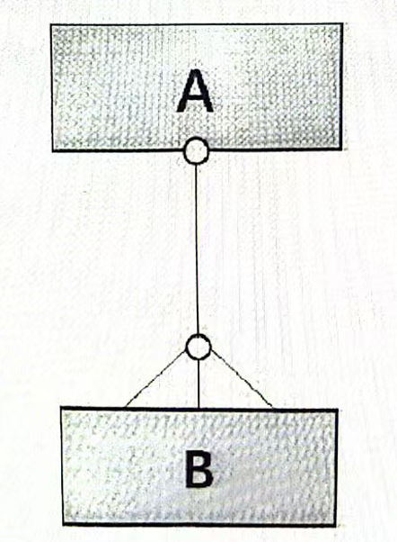

&emsp;&emsp;**实体在 1：N关系中依赖**

&emsp;&emsp;如果在两个实体类型（A和B）之间的关系是双向强制的，如：

&emsp;&emsp;则说明两者中的任一个实体类型都不能在没有对方的情况下存在，也就是说，它们不能彼此之间相互独立。在这种情况下，FPA 认为这两个实体类型是实体依赖的。如 6.21.5 中的表格所示，实体类型 A 和 B 在 FPA 中共同形成一个逻辑文件。

&emsp;&emsp;**实体在1:（N）关系中依赖或者独立**

&emsp;&emsp;如果在两个实体类型（A和B）之间的关系是单向可选的，如图所示：

&emsp;&emsp;则意味着 A 可在没有连接到 B 的情况下独立存在（如项目和员工之间的1:（N）的关系）。

&emsp;&emsp;在这种情况下，FPA需要考虑实体类型B的独立性。当我们想要删除关系中的非可选方（本例中的A），但关系中的可选方（本例中的B）仍然与它关联时，会发生什么？

&emsp;&emsp;以下区分了两种本质上不同的情况：

+ 允许删除 A，同时删除连接到 A 的所有 B（可能会先给出一个需要确认的提示消息，声明在删除 A 时，所有的 B 都会被自动删除）
+ 只要仍有 B 与 A 相连，就不允许删除 A

&emsp;&emsp;在情况 1 中，B 除非被连接到 A，否则显然对业务没有意义；而在情况 2 中，B 是非常重要的。

&emsp;&emsp;在情况 2 中，删除 A 之前，首先应删除所有相连的B，或将这些 B 连接到另一个数据实体 A。

&emsp;&emsp;在情况 1 中，认为 B 是依赖于 A 的实体；在情况 2 中，B 是独立于 A 的实体。

&emsp;&emsp;正如 6.21.5 中的表格所示，在情况 1 中，实体类型 A 和 B 在 FPA 中共同形成一个逻辑文件；在情况 2 中，实体类型 A 和 B 各自是一个独立的逻辑文件。

&emsp;&emsp;在项目和员工的例子中，员工通常是实体独立的，因为如果项目的数据被删除，并不需要删除员工数据。

&emsp;&emsp;**实体在（1）:N 关系中依赖或者独立**

&emsp;&emsp;与（1）:N 的关系中的 A 和 B 之间的独立性关系也可用类似的方式来处理，但这种关系在实际中很少出现。此时宜考虑下图中想要删除与A相连的最后一个B（关系中的非可选方）时，关系的可选方（本例中的A）会发生什么？

&emsp;&emsp;以下区分了两种本质上不同的情况：

+ 允许删除最后一个 B，同时删除连接到的 A（可能会先给出一个需要确认的提示消息，声明在删除最后一个 B 时，A都会被自动删除）
+ 只要有 A 与最后一个 B 相连，就不允许删除 B

&emsp;&emsp;在情况 1 中，A 除非被连接到一个或多个 B，否则显然对业务没有意义；但在情况2中，A 是非常重要的。

&emsp;&emsp;在情况 2中，在删除最后一个 B 之前，应删除与其相连的 A，或将这个 A 与一个或多个其他数据实体 B 相连。

&emsp;&emsp;在情况 1 中，认为 A 是依赖于 B 的实体；在情况 2 中，A 是独立于 B 的实体。

&emsp;&emsp;如 6.21.5 中的表格所示，在情况 1 中，实体类型 A 和 B 在 FPA 中共同形成一个逻辑文件；在情况 2 中，实体类型 A 和 B 各自是一个独立的逻辑文件。

### 6.21.5 转换表：从规范化的实体类型到逻辑文件

&emsp;&emsp;在下表中，A 和 B 是规范化数据类型中的两个实体类型（不是 FPA 数据表，也不是键-键实体）。它们间通过某种关系相连。

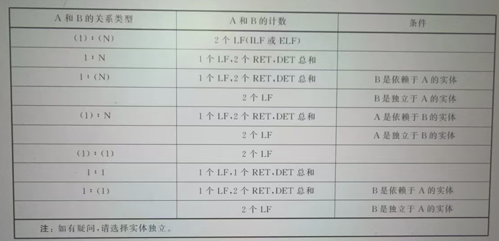

&emsp;&emsp;有时候两个以上的实体类型也能够共同形成一个逻辑文件。在这种情况下，将实体类型的总数计为记录类型的数量。在双向强制的（1:1）关系中，始终遵循一个逻辑文件对应一个记录类型的规则。

## 6.22 数据的共享使用

&emsp;&emsp;以下情形提供了在两个应用程序间共享数据时识别功能的准则。

+ 情形1：应用程序 A 有一个内部逻辑文件“客户信息”，应用程序 B 使用应用程序 A 中逻辑文件“客户信息”的数据（如图所示）

&emsp;&emsp;解决方案：对于应用程序A，“客户信息”是一个内部逻辑文件。对于应用程序B，“客户信息”是一个外部逻辑文件。

+ 情形2：应用程序A为应用程序B提供一份逻辑文件“客户信息”的副本，这个副本信息在应用程序A的边界之外。应用程序B将提供的副本信息处理到一个或多个自己的内部逻辑文件中。副本中的数据仅被使用一次

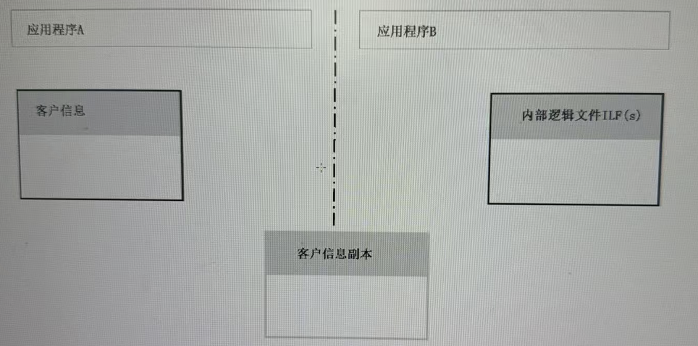

&emsp;&emsp;解决方案：对于应用程序A，“客户信息”是一个内部逻辑文件。创建“客户信息副本”是一个外部输出。“客户信息副本”不是一个单独的逻辑文件。对于应用程序B，“客户信息副本”只被使用一次，它显然不是一个永久性文件，因此客户信息副本也不是应用程序B的逻辑文件。读入和处理“客户信息副本”是一个外部输入。

+ 情形3：出于功能性原因考虑，应用程序A定期从其逻辑文件“客户信息”中提取数据（记为“客户信息摘录”），以供其他应用程序使用。“客户信息摘录”仍在应用程序A的边界之内。“客户信息摘录”与“客户信息”的当前数据之间可能存在差异。应用程序B使用“客户信息摘录”

&emsp;&emsp;解决方案：对于应用程序A，“客户信息”是一个内部逻辑文件。“客户信息摘录”也是应用程序A的内部逻辑文件。创建“客户信息摘录”是一个外部输出。对于应用程序B，“客户信息摘录”是一个外部逻辑文件。

+ 情形4：应用程序A定期从逻辑文件“客户信息”中提取数据（记为“客户信息摘录”），然后将其分发给了其他应用程序使用。“客户信息摘录”位于应用程序A的边界之外。应用程序B读入“客户信息摘录”，并直接保存到文件“客户信息副本”中，无需进行任何其他处理

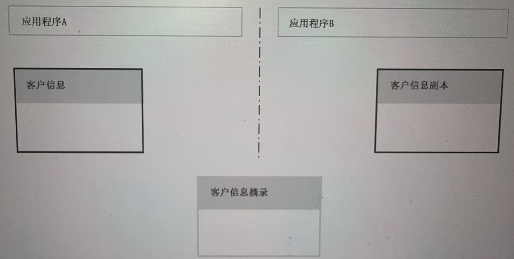

&emsp;&emsp;解决方案：对于应用程序A，“客户信息”是一个内部逻辑文件。创建“客户信息摘录”是一个外部输出。“客户信息摘录”不是应用程序A的永久数据，不计数为逻辑文件。对于应用程序B，“客户信息副本”是一个内部逻辑文件。读取“客户信息摘录”是一个外部输入。“客户信息摘录”不是应用程序B的永久数据，也不计数为逻辑文件。

+ 情形5：应用程序A从逻辑文件“客户信息”中提取数据（记为“客户信息摘录”），然后将其分发给应用程序B使用。“客户信息摘录”在应用程序A的边界之外。应用程序B处理来自“客户信息摘录”的数据，以更新其一个或多个内部逻辑文件。“客户信息摘录”仅被使用一次

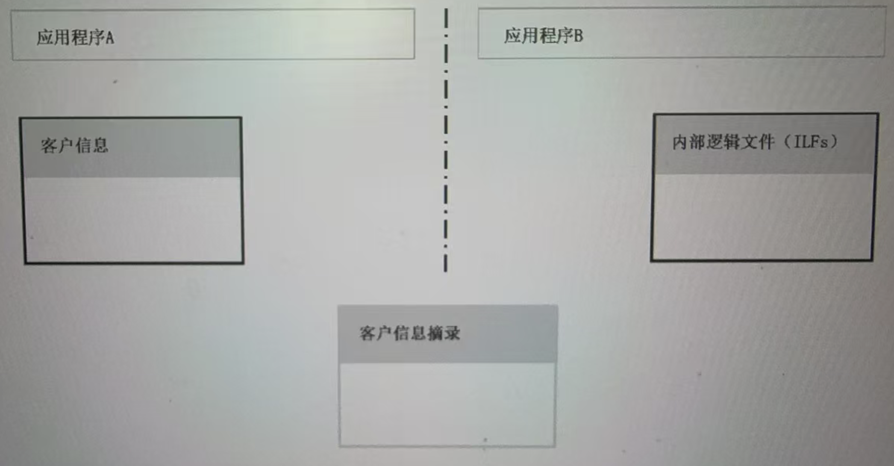

&emsp;&emsp;解决方案：对于应用程序A，“客户信息”是一个内部逻辑文件。创建“客户信息摘录”是一个外部输出。“客户信息摘录”不是应用程序A的永久数据，不计数为逻辑文件。对于应用程序B，读入和处理“客户信息摘录”是一个外部输入。“客户信息摘录”只被使用一次，因此不包含任何永久数据，也不计数为应用系统B的一个逻辑文件。

&emsp;&emsp;注：为了表达更加清晰，并保持和上述规则的一致，一个文件被创建多次，或在通过相同逻辑处理和相同布局以存储在不同的物理位置，计为一个事务或者一个逻辑文件。

## 6.23 数据元素类型计数的通用规则

&emsp;&emsp;对于所有的事务功能类型，确定数据元素数量的通用规则是：

&emsp;&emsp;对所有跨越应用程序边界（进入或离开边界）的功能性数据进行计数。  

&emsp;&emsp;根据上述规则，以下数据被计为 DET：  

+ 可编辑的字段（只要它们跨越了应用程序的边界）  
+ 在逻辑文件和 FPA 表中显示的字段
+ 启动触发-功能控制数据：触发一个事务，就计数为一个 DET（不能多，也不能少）。DET 的计数与事务的位置、操作方式或操作步骤的数量无关（例如，多个菜单或功能键、与事务本身相关的屏幕或窗口上的按钮或属于其他事务的屏幕上的功能键/按钮）。启动触发应来自应用程序外部，从而使控制数据跨越应用程序的边界。背景思路是：触发事务的方式是一种实施决策，数据元素类型也一样 
+ 消息，无论事务功能中的计算机系统消息和功能消息的数量有多少，所有的消息只计数为一个DET，因为它是同一种类型
+ 输入的选择数据
+ 显示的衍生数据
+ 其他输入的数据：如选择打印机、文件名等

&emsp;&emsp;基于上述通用规则，以下数据不被计为 DET：

+ 向上/向下翻页键
+ 标题栏/说明栏
+ 表头
+ 字段标签
+ 页码
+ 系统日期
+ 内部更新的字段

# 7 内部逻辑文件

## 7.1 定义内部逻辑文件

&emsp;&emsp;从用户的角度看，内部逻辑文件 (ILF) 是一组永久的逻辑数据，需要同时满足以下两条准则：  

+ 被待计数的应用程序使用  
+ 被待计数的应用程序维护

&emsp;&emsp;从用户的角度看，一组逻辑数据是：有经验的用户认为是重要和有用的单元或对象的一组数据，与这种逻辑数据组等价的是数据建模中的对象类型。  

&emsp;&emsp;永久意味着文件在应用程序使用后仍然存在，以便可再次使用，不像其他实例中被“消耗”的数据，只使用一次。

&emsp;&emsp;使用意味着这些数据实际上也在应用程序的处理过程中被使用。  

&emsp;&emsp;维护意味着可能会对数据进行新增、更改和删除操作。

## 7.2 识别内部逻辑文件

+ 7.2.1 在识别内部逻辑文件时，从概念数据模型出发，概念数据模型里的数据组(对象类型)以可用的、可识别的、显著且易于理解的方式呈现给用户。不能简单地用第三范式呈现一个数据模型。一个规范化的数据模型中的实体类型，应在概念数据模型级别上进行分组(见6.21)  
+ 7.2.2 数据的维护(新增、更改或者删除)只有决定性的重要意义。只有在应用程序中正在使用和维护的数据组才应进行计数
+ 7.2.3 如果在功能点分析过程中，没有为候选内部逻辑文件建立维护功能，存在以下三种可能原因：  
	+ 文件是一个技术解决方案，因此不应被计为一个逻辑文件
	+ 文件被其他应用程序所维护。在这种情况下，文件不是一个内部逻辑文件，而是一个外部逻辑文件，或者是一个应被统计成外部输入的输入事务文件
	+ 虽然文件是一个内部逻辑文件，但没有被应用程序所维护，这是用户功能需求中常见的疏漏
+ 7.2.4 对于每个内部逻辑文件，除了一个外部输出或一个外部查询之外，还存在至少一个外部输入
+ 7.2.5 如果一个内部逻辑文件不能通过一个外部输入被用户访问，应确认该内部逻辑文件是否被正确的识别
+ 7.2.6 出于技术上的原因被引入的文件不宜被计数(例如，工作文件、临时文件、中间文件、排序文件、打印文件、脱机文件等)
+ 7.2.7 当用户请求重启恢复机制，可能需要一个校验文件，这个文件不被计数。此外，在确定功能复杂度时也不统计此类文件
+ 7.2.8 已被识别出的内部逻辑文件可能存在多种不同的用户视图、访问路径和/或文件索引，这并不意味着要将该文件分为多个内部逻辑文件
+ 7.2.9 只有当历史文件中的数据元素类型集合相对于其他文件是唯一的，历史文件才被计成一个内部逻辑文件
+ 7.2.10 谨慎识别历史文件。用户通常需要它们，但是并不是总能及时对它们进行定义
+ 7.2.11 如果应用程序中的每个实体类型都可在应用程序中维护，那么应用程序中的常量、文本和解码等的实体类型被放在一组，作为应用程序的一个内部逻辑文件(FPA 数据表 ILF)进行计数。此外，对 FPA 数据表 ILF 来说，默认统计一个外部输入、一个外部输出和一个外部查询。如果上述列出的任何一种实体类型不被应用程序进行维护，那么就不能被统计为 FPA 数据表 ILF 的一部分(见6.20)
+ 7.2.12 对于只维护派生数据的文件(例如正在运行的寄存器)，只有当用户明确指定它们为数据时，才被视为内部逻辑文件组。如果这些文件只是出于技术上的原因而加入的(例如性能)，那么它们就不应计数
+ 7.2.13 有时即使一个文件没有出现在概念数据模型里，但是从用户定义的信息需求中可很清楚地看出该文件是必需的。在这种情况下，如果这个文件是功能性需求的结果，并且可被应用程序维护，则应计为一个内部逻辑文件。如果因技术原因而需要的文件，则不应被计数
+ 7.2.14 在为一个增强项目进行功能点计数时，那些既有的、没有任何改变的应用程序的内部逻辑文件不被计数

## 7.3 确定内部逻辑文件的复杂度

### 7.3.1 数据元素类型

+ 7.3.1.1 只有那些在应用程序中被使用和/或维护的属性才会被确认为数据元素类型，因此并不是所有的属性都被计算在内 
+ 7.3.1.2 FPA 数据表 ILF 中涉及的在 FPA 表中所有数据元素类型，只要它们(预期)用于待计数的应用程序中，都一起进行计数
+ 7.3.1.3 如果一个规范化数据模型中的多个实体类型一起构成一个内部逻辑文件，那么内部逻辑文件的数据元素类型数量与规范化实体类型的数据元素类型(属性)的总和相对应。为了避免重复计数，被编译到一个内部逻辑文件中的实体类型的引用属性不会被统计

### 7.3.2 记录类型

&emsp;&emsp;确定一个内部逻辑文件复杂度的记录类型的数量：

+ 等于其他所有内部逻辑文件的实体类型的数量(见 6.21)
+ 等于 FPA 数据表 ILF 中的 FPA 表的数量

### 7.3.3 复杂度矩阵

&emsp;&emsp;内部逻辑文件的复杂度级别如表所示：

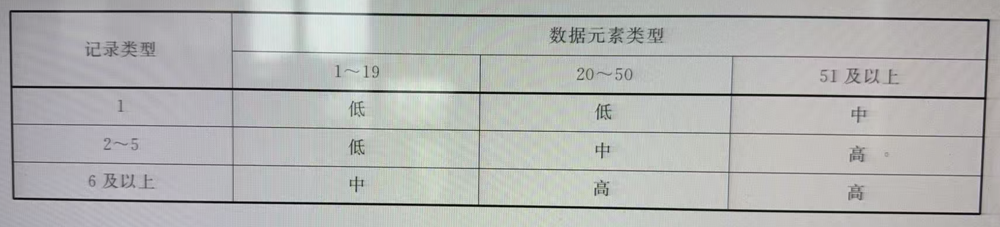

&emsp;&emsp;关于记录类型和数据元素类型的数据可用性取决于应用系统在生存周期中所处的阶段。如果这个数据未知，或者在执行估算功能点分析，则已识别的内部逻辑文件宜计为“低”。

# 8 外部逻辑文件

## 8.1 定义外部逻辑文件

&emsp;&emsp;从用户的角度看，外部逻辑文件(ELF)是一组永久的逻辑数据，需要同时满足以下4条准则： 

+ 被待计数的应用程序使用
+ 不由待计数的应用程序来维护
+ 由另一个应用程序进行维护
+ 对于待计数的应用程序来说是直接可用的

&emsp;&emsp;从用户的角度看，一组逻辑数据是有经验的用户认为是重要和有用的单元或对象的一组数据，与这种逻辑数据组等价的是数据建模中的对象类型。  

&emsp;&emsp;永久意味着文件在应用程序使用后仍然存在，以便可再次使用，不像其他实例中被“消耗”的数据，只使用一次。  

&emsp;&emsp;使用意味着这些数据也在应用程序的处理过程中被使用。

&emsp;&emsp;应用程序的维护没有被计数意味着不能在待计数的应用程序中新增、更改或删除数据。  

&emsp;&emsp;能被直接被应用程序所计数意味着即使另一个应用程序维护该逻辑文件，相关应用程序始终可使用该逻辑文件中的当前数据。

## 8.2 识别外部逻辑文件

+ 8.2.1 在识别外部逻辑文件时，从概念数据模型出发，概念数据模型里的数据组(对象类型)以可用的、可识别的、显著且易于理解的方式呈现给用户，不能简单地用第三范式呈现一个数据模型。一个规范化数据模型中的实体类型，应在概念数据模型级别上进行分组
+ 8.2.2 只有当一个文件被其他应用程序维护，而不是被计数的应用程序维护时，才可被计数为外部逻辑文件。而且，这份文件中的数据可供待计数的应用程序使用时才会被计数  
+ 8.2.3 如果通过事务文件在应用程序之间进行数据交换，则事务文件不计为外部逻辑文件，而是计为一个外部输入，和/或一个外部输出。需要注意的是，一个外部逻辑文件应包含可被应用程序使用不止一次的功能永久性数据，它不像一个事务文件的数据，只使用一次
+ 8.2.4 一个外部逻辑文件至少存在一个外部输出和/或一个外部查询。但是，外部逻辑文件偶尔也会被用来只对外部输入的数据元素类型进行维护、审核或者验证
+ 8.2.5 一个外部逻辑文件必定是另一个应用程序的内部逻辑文件
+ 8.2.6 已被识别出的外部逻辑文件可能存在多种不同的用户视图、访问路径，和/或文件索引，但这并不意味着要将该文件计数成多个外部逻辑文件
+ 8.2.7 被一个应用程序引用但由另一个应用程序维护的，诸如常量、文本和解码等实体类型被放在一起作为一个外部逻辑文件(FPA 数据表 ELF)  
+ 8.2.8 有时即使一个文件没有出现在概念数据模型里，但是从用户定义的信息需求信息中可很清楚地看出这个文件是必需的。如果该文件由另一个应用程序提供，并且待计数的应用程序可使用这个文件的当前数据，那么该文件应被计为一个外部逻辑文件。如果因技术原因(如性能)需要该文件的，则该文件不应被计数
+ 8.2.9 只有当一逻辑文件不是应用程序的内部逻辑文件时，它才会被计为一个外部逻辑文件，即该应用程序不维护该逻辑文件
+ 8.2.10 当确定应用程序功能点计数规模时，对同一应用程序的多个子系统公用的逻辑文件只统计一次，要么作为外部逻辑文件，要么作为内部逻辑文件。只有当跨越应用程序边界时，才能将逻辑文件计为外部逻辑文件
+ 8.2.11 当确定应用程序功能规模时，对同一应用程序的多个子系统公用的逻辑文件，如果这些子系统分别在同等数量的子项目中或多或少的以并行方式实现，而且这些子系统已经以一种将来要能够独立运行的方式进行实现，即它们能够独立存在，那么这个逻辑文件要么作为一个外部逻辑文件，要么作为每个子系统的一个内部逻辑文件（例如分阶段实施，或者由于功能上的原因）
+ 8.2.12 如果应用程序在经过独立的项目开发后，被作为一个整体进行维护和支持，则在确定应用程序功能规模时，该逻辑文件按照 8.2.10 的说明进行技术
+ 8.2.13 在为一个增强项目进行项目功能规模计数时，那些既有的、没有任何改变的应用程序的外部逻辑文件不计数

&emsp;&emsp;下表提供了一个概要说明来帮助用户区分内部逻辑文件和外部逻辑文件：

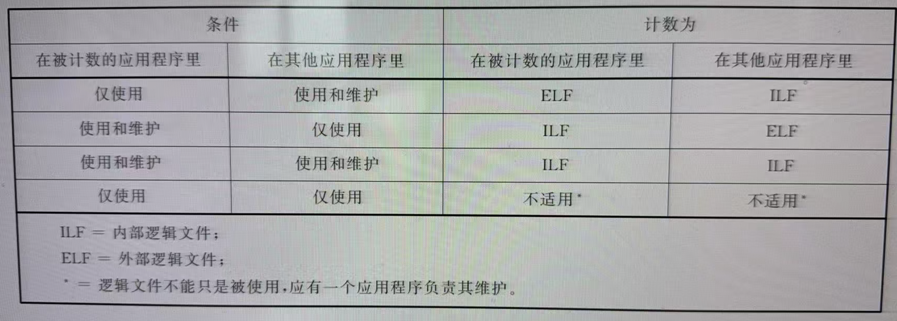

## 8.3 确定外部逻辑文件的复杂度

### 8.3.1 数据元素类型

+ 8.3.1.1 只有那些在应用程序中被使用(或将使用的)的属性才会被统计为数据元素类型，并不是所有的属性都被统计在内
+ 8.3.1.2 FPA 数据表 ELF 中涉及的在 FPA 表中的所有数据元素类型，只要它们(预期)用于待计数的应用程序中，都应一起进行计数
+ 8.3.1.3 如果一个规范化数据模型中的多个实体类型一起形成外部逻辑文件，外部逻辑文件的数据元素类型数量与规范化实体类型的数据元素类型(属性)的总和相对应。为了避免重复计数，被编译到一个外部逻辑文件中的实体类型的引用属性不会被统计

### 8.3.2 记录类型

&emsp;&emsp;确定一个外部逻辑文件复杂度的记录类型的数量：

+ 等于其他所有外部逻辑文件的实体类型的数量
+ 等于 FPA 数据表 ELF 中的 FPA 表的数量

### 8.3.3 复杂度矩阵

&emsp;&emsp;外部逻辑文件的复杂度级别如表所示：

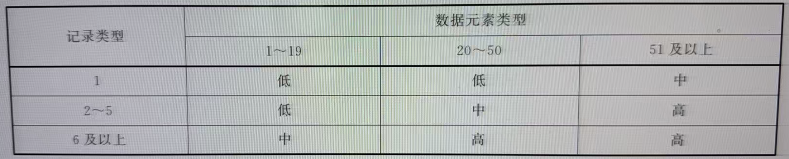

&emsp;&emsp;关于记录类型和数据元素类型的数据可用性取决于应用系统在生存周期中所处的阶段。如果这个数据未知，或者在执行估算功能点分析时，则已识别的外部逻辑文件宜计为“低”。

# 9 外部输入

## 9.1 定义外部输入

&emsp;&emsp;外部输入（EI）是一种被用户识别的独特功能。在这种功能中，来自应用程序外部的数据和/或控制信息被输入到应用程序中。数据是在一个或多个内部逻辑文件中的发生新增、更改或删除的信息，控制信息是能够激活或停用应用程序的一个或多个进程，或影响事务处理效果的数据（如一个信号）。  

&emsp;&emsp;下列情况中，外部输入宜被视为独特的：  

+ 由一组不同于所有其他外部输入的数据元素类型组成
+ 由一组相同的数据元素类型组成，但需要不同的逻辑处理方式  

&emsp;&emsp;逻辑处理方式是以用户指定的某种方法获取所需的结果。这意味着以下内容会涉及外部输入：  

+ 维护并可能引用逻辑文件。例如，添加新订单时，引用逻辑文件“产品”以查看产品是否可被订购
+ 执行算法、计算和验证。例如，添加新订单时，逻辑处理包括验证（含其他事项），以确定输入的数据是否正确  

&emsp;&emsp;下列情况中，逻辑处理方式会有所不同：  

+ 维护或引用其他逻辑文件
+ 维护相同的内部逻辑文件，但是有不同的算法、计算和（或）验证

&emsp;&emsp;当满足以下两个条件时，一个功能被看作一个基本过程：  

+ 功能对用户具有独立存在的意义，并且执行一个完整的信息处理过程。换句话说，功能是自包含的。例如，用户输入新员工信息时，包括该员工的薪资数据及其家庭状况信息的输入。从用户角度看，输入员工信息是一个完整的过程，输入薪资和家庭状况信息是此过程的一部分，并非分开进行

&emsp;&emsp;功能执行完毕后，应用程序处于稳定状态。例如，用户要求在输入员工姓名时应记录员工的薪资数据，仅输入员工的姓名或员工的薪资数据将导致应用程序处于不稳定状态。  

+ 外部输入既包括用户直接输入的数据和控制信息，又包括从其他应用程序接收到的信息

## 9.2 识别外部输入

### 9.2.1 识别一个外部输入，需要同时满足以下五条准则：

+ 它是一个基本过程
+ 已被用户定义
+ 在待测量的应用程序中是独特的
+ 跨越应用程序的外部边界
+ 通常对应程序的内部逻辑文件执行新增、更改或删除数据操作

+ 9.2.2 当外部输入维护多个内部逻辑文件（添加、更改或删除数据）时，如果用户将其视为一个整体，并且不会分别维护每个不同的文件，则将其计为单个外部输入
+ 9.2.3 如果内部逻辑文件可单独维护，那么针对每个内部逻辑文件则至少识别一个外部输入
+ 9.2.4 用户直接执行的数据输入和源自其他应用程序的数据输入（例如，以输入文件或消息的形式）均需计数。外部输入可由用户或其他应用程序激活，也可自动激活（例如，自启动的批处理功能）  
+ 9.2.5 包含来自其他应用程序的功能永久性数据的文件不应计为外部输入，而是计为外部逻辑文件  
+ 9.2.6 每个内部逻辑文件至少应有一个外部输入。如果缺少外部输入，与用户进行确认
+ 9.2.7 在输入屏幕或窗口上实现的（新增、更改或删除）不同功能计为不同的外部输入
+ 9.2.8 在执行输入命令之前用于请求确认的外部输入（例如，更改数据）应计为一个外部输入，因为它属于一个基本过程
+ 9.2.9 分两步执行新增、更改或删除数据时，计为两个功能（例如，允许其他员工授权输入）。初始输入与授权功能分别计为一个外部输入。每个步骤都是一个基本过程。如果明确指定了外部查询，则可能在此处显示  
+ 9.2.10 对于之前已被统计过的重复的外部输入（即，当数据元素类型的集合和逻辑处理相同时），则不再被统计
+ 9.2.11 由于技术原因（如所使用的技术）而专门引入但非用户要求的外部输入，不计为外部输入
+ 9.2.12 只有用户要求的功能才算作外部输入 
+ 9.2.13 菜单结构的计数规则见6.15
+ 9.2.14 如果显示更改或删除的数据是作为更改或删除内部逻辑文件功能的一部分，则该数据显示将作为外部输入的一部分，不单独计为外部查询  
+ 9.2.15 同样的准则也适用于数据自动显示在更改屏幕或窗口时（例如：连续显示输入文件中的数据时），此时不计为外部查询，而是作为外部输入的一部分  
+ 9.2.16 如果向用户提供了单独定义的外部查询功能，则对外部查询进行计数。如果查询到的数据可被更改功能进行更新，则需要统计成一个外部查询和一个外部输入
+ 9.2.17 如果一个外部输入由多个输入屏幕或窗口组成（因为并非所有需要的数据都可输入到一个屏幕上），此时计为一个外部输入。但是，如果每个输入屏幕或窗口不必经过预先安排的顺序也可单独使用，则每个输入屏幕或窗口计为单独的外部输入，前提是每个屏幕或窗口本身都可视为一个基本过程 
+ 9.2.18 输入和处理数据之间的时间延迟不是成为识别额外的外部输入的理由  
+ 9.2.19 用于控制外部输入、输出或查询的输入数据（如选择数据）不算作独特的功能，而是算作所涉及功能的一部分  
+ 9.2.20 如果已根据数据指定了不同种类的逻辑处理，则对另一个应用程序提供的事务文件（含临时数据的文件）的处理将导致多个外部输入。在其他情况下，当事务文件中定义了几种记录类型，或者在一种记录类型中定义了不同的处理代码时，就会发生这种情况  
+ 9.2.21 通过不同介质向相同的逻辑处理输入数据时，计为一个外部输入
+ 9.2.22 从外部看似乎相同但维护不同的内部逻辑文件的外部输入，应计为单独的外部输入，因为它需要我们不同的逻辑处理
+ 9.2.23 如果在事务文件中出现带有校验数据的头记录和/或尾记录（例如，总数或记录总数），则这些记录的处理不会计为单独的外部输入。但是，校验数据会被计为数据元素类型（如用户要求）
+ 9.2.24 可通过非唯一的选择标准，选择需要更改或删除的数据。这意味着将显示满足输入条件的实体类型项目的特征数据，然后选择实体类型的所需项目。显示此数据的行为被视为附加功能，可计为一个外部输出（见6.16）
## 9.3 确定外部输入的复杂度

### 9.3.1 数据元素类型

+ 9.3.1.1 统计跨越待计数应用程序边界的所有数据元素类型（数据和/或控制信息）
+ 9.3.1.2 将进入和启动功能的方式（例如，菜单选择和功能键）计为一种数据元素类型，即启动触发器
+ 9.3.1.3 如果可在输入屏幕或窗口上执行几个功能（例如，新增、更改和删除），则为每个功能计算其相关的数据元素类型数量
+ 9.3.1.4 如果将多个屏幕用于外部输入（例如，第一个屏幕输入选择数据，第二个屏幕更改数据），则在对数据元素类型进行计数时，应将这些屏幕的组合视为一个整体，因为该功能是一个基本过程。但是，如果选择数据不是唯一可识别的，则用户应首先从多个所选实体类型中选择所需的项目，然后对单独的外部输出进行计数（见 9.2.24）
+ 9.3.1.5 如果错误信息和其他消息都有数据元素类型，或者有单独的屏幕或窗口来显示消息，则按照 6.14 中的要求进行计数
+ 9.3.1.6 如果输入响应的显示了附加数据，那么其数据元素类型需计为外部输入的一部分。（例如，“更新客户信息”功能，输入客户编号后，为了验证信息，应用程序首先显示客户的姓名和地址，之后用户可输入其余的数据。）  
+ 9.3.1.7 如果在事务文件中出现带有校验数据的头记录和/或尾记录（例如，总数或记录总数），则此数据也算作数据元素类型（如果用户要求）

### 9.3.2 引用文件类型

+ 9.3.2.1 通过确定用于被验证输入和/或执行外部输入的引用逻辑文件的数量，确定每个外部输入的引用逻辑文件的数量。这些文件可以是内部逻辑文件，也可以是外部逻辑文件
+ 9.3.2.2 在确定外部输入的复杂度时，FPA 数据表 ILF 和 FPA 数据表 ELF 不计为引用逻辑文件。这个原则也适用于因技术原因而引用的文件
+ 9.3.2.3 如果已经定义了一个过程，其中包含永久数据的逻辑文件是基于一个事务文件（输入）来维护的，则将其视为一个或多个（在有多个处理代码的情况下）外部输入。（事务文件的处理）至少有一个内部逻辑文件（永久文件）
+ 9.3.2.4 事务文件（输入或输出）不能是“引用的”逻辑文件。例如，使用输入文件来处理其数据的外部输入没有引用逻辑文件，除非内部逻辑文件被更新。这也适用于临时文件
+ 9.3.2.5 由于技术原因而引入的文件（如临时文件、排序文件和打印文件）不计数。确定这些类型的文件是否是外部逻辑文件或内部逻辑文件的替代文件。如果是，则需要计算这些潜在的逻辑文件以确定复杂度

### 9.3.3 复杂度矩阵

&emsp;&emsp;外部输入的复杂度级别的确定如表所示：

&emsp;&emsp;关于数据元素类型和引用文件类型的数据可用性依赖于应用系统在生存周期中所处的阶段。如果这些数据未知，或正在执行估算功能点分析，则外部输入的复杂度宜被计为“中”。

# 10 外部输出

## 10.1 定义外部输出

&emsp;&emsp;外部输出（EO）是一种可被用户识别的跨越应用程序边界的独特输出。它们或者数据规模大小不等，或者需要进一步的数据处理。外部输出是一个基本过程。  

&emsp;&emsp;下列情况中，外部输出应被视为独特的：  

+ 输出产品的逻辑布局与所有其他输出产品不同
+ 输出产品具有相同的逻辑布局，但是需要不同的逻辑处理方式
+ 与所有其他外部输出的输入部分相比，外部输出的任何输入部分包含一组不同的数据元素类型

&emsp;&emsp;输出产品具有相同的逻辑布局，如果其数据元素类型集是相同的，则下列情况是允许的： 

+ 以不同的顺序输出产品数据元素类型
	+ 注：以不同方式(如，通过中间标题)对数据元素类型进行分组，视为不同的逻辑布局
+ 输出产品中出现数据元素类型，却没有赋值，原因可能如下：
	+ 数据元素类型在逻辑文件中没有值(因此，数据元素类型不可见)
	+ 数据元素类型在逻辑文件中确实有值，但与用户无关

&emsp;&emsp;外部输出的逻辑处理方式是以用户指定的某种方法获得所需的结果。以下内容会涉及外部输出：  

+ 引用逻辑文件。例如，输出员工列表时，将引用逻辑文件“员工信息”  
+ 提供进一步的数据处理，如算法、计算和/或验证

&emsp;&emsp;例如，当报告组织中的所有员工信息时，逻辑处理方式包含计算固定员工、小时工和所有员工总数所需的算法。

&emsp;&emsp;在以下情况，逻辑处理方式会有所不同： 

+ 引用其他逻辑文件
+ 引用了相同的逻辑文件，但存在其他算法、计算或验证

&emsp;&emsp;使用不同的选择值进行选择(无论是否使用不同类型的通配符)和在同一字段上进行选择但使用不同的运算符，视为相同的逻辑处理方式。 

&emsp;&emsp;为实现相同的逻辑处理而选择不同的技术解决方案，也不意味着逻辑处理方式是不同的。

&emsp;&emsp;当满足以下两个条件时，一个功能是一个基本过程：

+ 功能对用户具有独立存在的意义，并且完全执行一个完整的信息处理过程。换句话说，功能是自包含的  
	+ 举例 1：打印某年的所有员工信息。从用户角度看，输入选择数据，显示或打印所选员工信息是一个完整的处理过程
+ 功能执行完毕后，应用程序处于一致状态
	+ 举例 2：某发票管理系统的应用程创建了一个输出文件，其中包含了居住在特定区域内的用户消费数据：选择居住在特定区域内的用户、查询消费量数据、构造输出文件以及发送该文件被视为一个整体。从用户角度看，仅当所有步骤都已被执行完毕后，应用程序才处于一致状态

&emsp;&emsp;外部输出既包括以报告和信息的形式直接提供给用户的输出产品，也包括通过在线链接或输出文件发送给其他应用程序的数据流。对于外部输出，仅输出产品的域是固定的，但是，输出产品的规模不一定是恒定的，这一点与外部查询中输出产品的规模是固定的不同。

## 10.2 识别外部输出

+ 10.2.1 识别一个外部输出，需要同时满足以下五条准则： 
	+ 它是一个基本过程 
	+ 已被用户定义 
	+ 在待测量的应用程序中是独特的
	+ 跨越应用程序的外部边界
	+ 规模大小不等或需要进一步的数据处理（定义见 10.1）
+ 10.2.2 统计以报表和消息形式直接提供给用户的输出产品，以及以输出文件和消息形式提供给其他应用程序的输出产品
+ 10.2.3 使用以下标准来区分外部输出和外部查询：
	+ 外部输出的输出规模大小不等
	+ 外部输出不需要输入即可选择数据
	+ 外部输出的输出可能包含通过进一步数据处理（如数据计算）产生的数据
+ 10.2.4 外部查询的输出部分不应计为单独的外部输出
+ 10.2.5 输入用于控制外部输出的数据（例如，输入选择标准、排序要求或打印要求）应被视为外部输出的一部分，不应计为外部输入
+ 10.2.6 每个内部逻辑文件至少有一个外部输出。如果缺少外部输出，应与用户确认
+ 10.2.7 一个输出产品可包含多个外部输出。如下几种情况： 
	+ 输出产品包含不同的逻辑布局，并且这些逻辑布局可被单独检索
	+ 输出产品包含不同的逻辑布局，这些布局是通过不同的逻辑处理方式建立的，但为了便于使用而组合在一起
+ 10.2.8 具有相同逻辑布局但可按几种方式排序的报表能被计为一个外部输出，除非每个排序需要不同的或额外的逻辑处理
+ 10.2.9 输出可直接面向用户、其他应用程序或外部存储设备。如果逻辑布局和逻辑处理相同，则计为一个外部输出
+ 10.2.10 有时需要将另一个应用程序的事务文件计为几个外部输出。例如，当文件中出现多个记录类型时，或者当几个不同的逻辑处理的输出被物理编译到一个外部输出文件里时
+ 10.2.11 仅计算用户要求的外部输出。由于技术原因而专门引入而非用户要求的输出产品不被计算（例如，后台打印文件）
+ 10.2.12 由待计数的应用程序维护、被其他应用程序使用的、具有功能永久性数据的文件计为内部逻辑文件，而不是外部输出。其他使用该文件的应用程序将其作为外部逻辑文件计数，而不是外部输入
+ 10.2.13 如果用户请求一个可能出现的错误信息的概述，则不计为单独的外部输出，因为带有错误信息的文件是 FPA 表
+ 10.2.14 描述某个功能执行情况的消息（例如，错误信息）与外部输入、输出或查询链接在一起，它们不被计为单个外部输出，而是合计为一个功能相关的数据元素类型
+ 10.2.15 一个包含错误信息，或者涉及不同功能执行情况或相同功能被重复使用的消息的输出产品被统计为一个或者多个外部输出
+ 10.2.16 一个作为对内部逻辑文件维护的逻辑结果的输出产品（例如，事务报告或处理报告）被计为一个或多个外部输出
+ 10.2.17 基于以下几个选择标准对输出进行计数：当用户有更多选项（即：和/或的情况）时，对互斥的选择进行计数，每个互斥的选择或选择组合分别计数
+ 10.2.18 如果在事务文件中出现带有校验数据的头记录和/或尾记录（例如，总数和记录总数），则这些记录的处理不会计为单个外部输出。头记录可当做报表的消息标题，而尾记录可当做报表中的统计汇总。计算头记录或尾记录中的数据元素类型(如果用户请求)
+ 10.2.19 如果用户选择启动多个功能(单个运行或组合运行)，且这些功能组合运行的效果超过各个部分的总和，则需要考虑统计这种组合。对于此种情形的处理方式如下：  
	+ 每个可独立运行且包含不同处理过程的功能计为一个外部输出
	+ 原则上，对于所有可能的组合，仅计算一个附加的外部输出，除非某些(组)组合具有不同的逻辑处理过程。在这种情况下，为需要不同逻辑处理的每个(组)组合计算一个额外的外部输出
+ 10.2.20 如果用户明确要求显示一个可供用户选择的列表(例如，选择屏幕、窗口、选择功能、选择列表或弹出功能)，则计为外部输出，前提是该数据源于逻辑文件而不是 FPA 表。显示列表不是外部查询，因为列表的大小是未知的。选择机会不算作单独的功能参与计数
+ 10.2.21 为支持浏览或翻阅所产生的输出，不计算任何额外的功能或数据元素类型
+ 10.2.22 如果一个功能产生的输出产品的内容相同，但使用的语言不同，则该功能将计为一个外部输出。因为虽然输出产品在语言上有所不同，但它们由一组相同数据元素类型构成，并且逻辑处理过程也是相同的
+ 10.2.23 即使有多个输出产品，但可能只有一个外部输出。如下情况所示：  
	+ 输出产品具有相同的逻辑布局
	+ 输出产品是通过相同的逻辑处理方式产生的

## 10.3 确定外部输出的复杂度

### 10.3.1 数据元素类型

+ 10.3.1.1 计算由外部输出生成的输出产品中的所有数据元素类型(而不是其可能的值)
+ 10.3.1.2 为产生输出而输入的数据元素类型级别或别的所有控制信息(例如，选择标准、所需介质、所需打印机、排序顺序、打印时间段)均需计为外部输出的数据元素类型。输出本身出现的控制信息计数两次
+ 10.3.1.3 在数据元素类型级别指示输出设备或介质的所有地址数据均被计数
+ 10.3.1.4 构成输出产品一部分的所有过程数据(例如，平均值、计算结果、小计和总计)均计为数据元素类型
+ 10.3.1.5 如果外部输出引用逻辑文件，则不计算其中出现和引用的数据元素类型。仅穿越应用程序边界的数据元素类型才能被用来确定复杂度
+ 10.3.1.6 规范化的数据(如系统日期和页码)不计为数据元素类型
+ 10.3.1.7 固定的数据(如消息标题、列描述、文字和常量)不计为数据元素类型
+ 10.3.1.8 如果外部输入所产生的错误信息和其他消息都有数据元素类型，或者有一个单独的窗口来显示消息，见 6.14
+ 10.3.1.9 导航元素不计为数据元素类型
+ 10.3.1.10 如果在事务文件中出现带有校验数据的头记录和/或尾记录(例如，总数或记录总数)，则将此数据计为数据元素类型(如果用户要求)

### 10.3.2 引用文件类型

+ 10.3.2.1 通过确定用于验证输入和/或产生输出的引用逻辑文件的数量来确定每个外部输入的引用逻辑文件的数量。引用文件可是内部逻辑文件或外部逻辑文件
+ 10.3.2.2 当外部输出与外部输入绑定时，统计整个数据处理的引用逻辑文件的数量，而不仅仅是外部输出本身引用文件的数量。例如，多个事务处理报表的外部输出，此外部输出与用于处理事务的外部输入绑定在一起
+ 10.3.2.3 在确定外部输出的复杂度时，FPA 数据表 ILF 和 FPA 数据表 ELF 不计为引用逻辑文件。在确定外部输入的复杂度时，FPA 数据表 ILF 和 FPA 数据表 ELF 不计为引用逻辑文件。这个原则也适用于因技术原因而引用的文件
+ 10.3.2.4 由于技术原因而引入的文件（如临时文件、分类文件和打印文件）不计数。确定这些类型的文件是否是外部逻辑文件或内部逻辑文件的替代文件。如果是，则需要计算这些潜在的逻辑文件以确定复杂度

### 10.3.3 复杂度矩阵

&emsp;&emsp;一个外部输出的复杂度级别的确定如表所示：

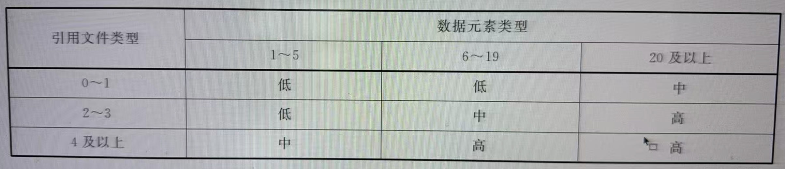

&emsp;&emsp;关于数据元素类型和引用文件类型的数据可用性依赖于应用系统在生存周期中所处的阶段。如果这些数据未知，则外部输出的复杂度宜被计为“中”。

# 11 外部查询

## 11.1 定义外部查询

&emsp;&emsp;外部查询（EQ）是一种用户可识别的独特的输入/输出组合，应用程序发布一个规模明确的、不需要进一步数据处理的输出，作为输入的结果。外部查询是一个基本过程。 

&emsp;&emsp;下列情况下外部查询应被视为独特的：

+ 外部查询的输入部分由一组不同于所有其他外部查询的输入部分的数据元素类型集组成
+ 外部查询生成的输出产品与所有其他外部查询的输出部分所包含的数据元素类型集不同
+ 输入部分和输出产品两者的数据元素类型集相同，但外部查询需要不同的逻辑处理方式

&emsp;&emsp;外部查询的逻辑处理方式是以用户指定的某种方法获得所需的结果。以下内容将涉及外部查询：  

+ 引用逻辑文件。例如，显示员工数据时，将引用逻辑文件“员工信息”
+ 验证。例如，在查询员工信息时，应用程序会检查用户是否已被授权查询此信息

&emsp;&emsp;以下情况，逻辑处理方式会有所不同：

+ 引用其他逻辑文件
+ 引用了相同的逻辑文件，但是还有其他验证

&emsp;&emsp;外部查询输入部分的数据应能够唯一标识所需的输出。此外，输出的规模应完全明确。  

&emsp;&emsp;当满足以下两个条件时，一个功能是一个基本过程：

+ 对用户而言功能是独立的，并且完全执行一个完整的信息处理过程。换句话说，功能是独立的  
	+ 例如：根据产品编号查询产品数据。从用户角度看，输入产品编号和输出其相应产品数据是一个完整的处理过程
+ 功能执行完毕后，应用程序处于一致状态  
	+ 例如：从用户角度看，仅执行上述两个步骤之一将使应用程序处于不一致状态

## 11.2 识别外部查询

+ 11.2.1 当输入数据导致直接生成输出或输入——输出组合时，对输入和输出数据的每种组合识别为外部查询。外部查询需要同时满足以下五条准则：  
	+ 一个基本过程  
	+ 已被用户定义
	+ 在待测量的应用程序中是独特的
	+ 跨越应用程序的边界
	+ 输出规模大小明确的输出，且无需进一步的数据处理
+ 11.2.2 外部查询可能存在于直接来自用户或其他应用程序的查询
+ 11.2.3 外部查询和外部输入之间的区别可进一步解释为：外部查询的输入部分仅配合查询操作，而不会维护内部逻辑文件  
+ 11.2.4 请勿将查询工具与外部查询混淆。外部查询是对特定数据的直接查询操作，通常使用单键即可完成。另一方面，查询工具是由外部输入、输出和查询组成的组织结构，其目的是为了能够用多个键和操作组成若干查询。FPA 将这种组织结构视为一种应用程序，因此应单独计数。在这种情况下，只准许对外部输入、输出和查询进行计数
+ 11.2.5 仅当用户发起外部查询命令时，才进行计数。在数据编辑之前的数据显示功能不应计为外部查询
+ 11.2.6 外部查询的输入部分不应计为外部输入
+ 11.2.7 外部查询的输出部分不应计为外部输出
+ 11.2.8 外部查询应包含用于控制数据处理的数据输入（如选择标准的输入）。根据定义，唯一标识的数据应始终构成输入数据的一部分
+ 11.2.9 使用以下标准来区分外部查询和外部输出：
	+ 外部查询输出的规模大小应明确
	+ 外部查询的输入应包含一个唯一标识的查询参数
	+ 外部查询的输出不应包含由进一步的数据处理而产生的数据
	+ 执行外部查询时，不应维护内部逻辑文件。有关数据处理的详细内容，见 10.1  
+ 11.2.10 能够浏览或滚动生成输出的任何附加功能或数据元素类型不计算在内

## 11.3 确定外部查询的复杂度

### 11.3.1 数据元素类型

+ 11.3.1.1 由外部查询生成的输出产品中出现的所有数据元素类型(而不是其可能的值)需要被计数。
+ 11.3.1.2 应通过输入而产生输出的数据元素类型级别的所有控制信息(如选择标准、所需介质、所需打印机或打印时间段)均应计为外部查询的数据元素类型进行计数。输出上出现的控制信息计数两次
+ 11.3.1.3 在数据元素类型级别指示输出设备或介质的所有地址数据均计数
+ 11.3.1.4 计算穿越待计数应用程序边界的所有数据元素类型(数据和/或控制信息)，考虑与输入或输出部分相关的所有数据元素类型  
+ 11.3.1.5 如果外部查询应引用逻辑文件，则不计算引用逻辑文件中的数据元素类型。仅跨越应用程序边界的数据元素类型才能被用来计算复杂度  
+ 11.3.1.6 标准数据(如系统日期和页码等)不计为数据元素类型
+ 11.3.1.7 固定数据(如消息头、列说明、文字和常量)不计为数据元素类型
+ 11.3.1.8 如果有外部查询产生错误信息以及其他消息的数据元素类型，或者存在单独的窗口显示消息，见6.14计数
+ 11.3.1.9 导航元素不计为数据元素类型
+ 11.3.1.10 将进入和启动功能的方式(如菜单选择和功能键)计为一种数据元素类型，即启动触发器

### 11.3.2 引用文件类型

+ 11.3.2.1 通过确定用于验证输入和/或执行外部查询的引用逻辑文件的数量，确定每个外部查询的引用逻辑文件的数量。引用的文件可是内部逻辑文件，也可是外部逻辑文件
+ 11.3.2.2 在确定外部查询的复杂度时，FPA 数据表 ILF 和 FPA 数据表 ELF 不计为引用逻辑文件。
+ 11.3.2.3 由于技术原因而引入的文件(例如，临时文件、分类文件和打印文件)，不计数。确定这些类型的文件是否是内部逻辑文件或外部逻辑文件的替代文件，如果是，请计算这些基础逻辑文件以确定复杂度

### 11.3.3 复杂度矩阵

&emsp;&emsp;外部查询的复杂度如表所示：

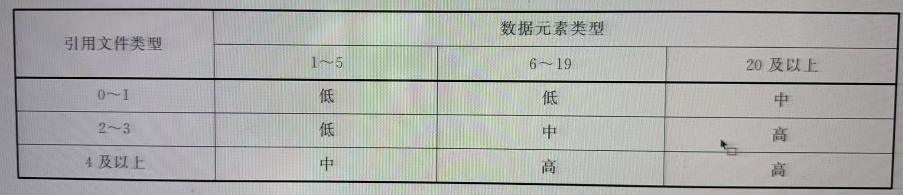

&emsp;&emsp;关于数据元素类型和引用文件类型的数据可用性依赖于应用程序在生存周期中所处的阶段。如果这些数据未知，则外部输出的复杂度宜被计为“中”。  

&emsp;&emsp;依照本文件测量过程的应用案例参见附录D。

# 附 录 A  
**(资料性)**  
**结构调整对照**

&emsp;&emsp;本文件与 ISO / IEC 24570:2018 相比在结构上有部分调整，具体章条编号对照情况见表 A.1。

**表 A.1 本文件与 ISO / IEC 24570:2018 结构编号对照情况**

| 本文件结构编号 | ISO/IEC 24570:2018 结构编号 |
| ------- | ----------------------- |
| 1       | 1                       |
| 2       | —                       |
| 3       | —                       |
| 3.1     | 附录 B                    |
| 3.2     | 附录 B                    |
| 4       | 2                       |
| 4.1     | 2.1                     |
| 4.2     | 2.2                     |
| 4.3     | 2.3                     |
| 4.4     | 2.4                     |
| 4.5     | 2.5                     |
| 4.6     | 2.6                     |
| 4.7     | 2.7                     |
| 4.8     | 2.8                     |
| 4.9     | 2.9                     |
| 4.10    | 2.10                    |
| 5       | 3                       |
| 5.1     | 3.1                     |
| 5.2     | 3.2                     |
| 5.3     | 3.3                     |
| 5.4     | 3.4                     |
| 5.5     | 3.5                     |
| 5.6     | 3.6                     |
| 5.7     | 3.7                     |
| 5.8     | 3.8                     |
| 5.9     | 3.9                     |
| 6       | 4                       |
| 6.1     | 4.1                     |
| 6.2     | 4.2                     |
| 6.3     | 4.3                     |
| 6.4     | 4.4                     |
| 6.5     | 4.5                     |
| 6.6     | 4.6                     |
| 6.7     | 4.7                     |
| 6.8     | 4.8                     |
| 6.9     | 4.9                     |
| 6.10    | 4.10                    |
| 6.11    | 4.11                    |
| 6.12    | 4.12                    |
| 6.13    | 4.13                    |
| 6.14    | 4.14                    |
| 6.15    | 4.15                    |
| 6.16    | 4.16                    |
| 6.17    | 4.17                    |
| 6.18    | 4.18                    |
| 6.19    | 4.19                    |
| 6.20    | 4.20                    |
| 6.21    | 4.21                    |
| 6.22    | 4.22                    |
| 6.23    | 4.23                    |
| 7       | 5                       |
| 7.1     | 5.1                     |
| 7.2     | 5.2                     |
| 7.3     | 5.3                     |
| 8       | 6                       |
| 8.1     | 6.1                     |
| 8.2     | 6.2                     |
| 8.3     | 6.3                     |
| 9       | 7                       |
| 9.1     | 7.1                     |
| 9.2     | 7.2                     |
| 9.3     | 7.3                     |
| 10      | 8                       |
| 10.1    | 8.1                     |
| 10.2    | 8.2                     |
| 10.3    | 8.3                     |
| 11      | 9                       |
| 11.1    | 9.1                     |
| 11.2    | 9.2                     |
| 11.3    | 9.3                     |
| 附录 A    | —                       |
| 附录 B    | 附录 A                    |
| 附录 C    | 附录 C                    |
| 附录 D    | —                       |

# 附 录 B

**（规范性）**
**功能类型赋值的概要特性**

## B.1 内部逻辑文件

（一）定义  

&emsp;&emsp;从用户的角度看，内部逻辑文件(ILF)是一组永久的逻辑数据，符合下列各项准则：  

+ 被待计数的应用程序使用
+ 被待计数的应用程序维护

（二）导则  

+ 假定采用概念数据模型
+ 数据应由待计数的应用程序进行维护
+ 数据应是功能永久性的 
+ 数据组对于用户来说，应是可用的、可识别的、可理解的，并且是有重要意义的

（三）内部逻辑文件的复杂度矩阵

&emsp;&emsp;下表用于确定内部逻辑文件的复杂度。

&emsp;&emsp;记录类型的数量等于包含的实体类型的数量。  

&emsp;&emsp;当内部逻辑文件的记录类型数量或者数据元素类型数量未知时，或者在执行估算分析时，识别的内部逻辑文件复杂度被评估为“低”。

## B.2 外部逻辑文件

（一）定义 

&emsp;&emsp;从用户的角度看，外部逻辑文件(ELF)是一组永久的逻辑数据，应符合下列各项准则：  

+ 被待计数的应用程序所使用
+ 不由待计数的应用程序进行维护
+ 由另一个应用程序进行维护
+ 可直接为待计数的应用程序所使用，即使这个逻辑文件是由其他应用程序进行维护，待计数的应用程序始终具有来自该逻辑文件的当前数据

（二）导则

+ 假定采用概念数据模型
+ 数据不得由待计数的应用程序进行维护
+ 数据应是功能持久性的
+ 数据组对于用户来说，应是可用的、可识别的、可理解的，并且是有重要意义的

（三）外部逻辑文件的复杂度矩阵  

&emsp;&emsp;下表用于确定外部逻辑文件的复杂度。

&emsp;&emsp;记录类型的数量等于包含的实体类型的数量。  

&emsp;&emsp;当外部逻辑文件的记录类型数量或者数据元素类型数量未知时，或者在执行估算分析时，识别的外部逻辑文件复杂度被评估为“低”。

## B.3 外部输入

（一）定义

&emsp;&emsp;外部输入是一种用户可识别的独特功能，通过这个功能，数据和/或控制信息从应用程序外部输入到应用程序中。

（二）准则

+ 一个独特的基本过程
+ 由用户进行定义
+ 数据跨越了待计数应用程序的边界
+ 通常会导致在一个或多个内部逻辑文件中新增、更改和/或删除数据

（三）外部输入的复杂度矩阵

&emsp;&emsp;下表用于确定外部输入的复杂度。

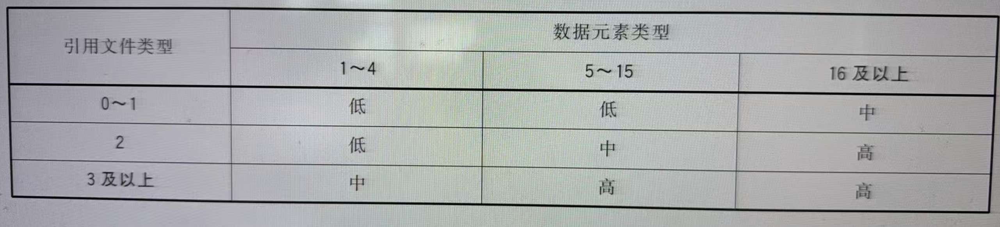

&emsp;&emsp;当引用逻辑文件的数量或外部输入的数据元素类型数量未知时，或者在执行估算分析时，外部输入的复杂度被评估为“中”。

## B.4 外部输出

（一）定义

&emsp;&emsp;外部输出是一种可被用户识别的跨越应用程序边界的独特输出。它们或者数据规模大小不等，或者需要进一步的数据处理。

（二）准则 

+ 一个独特的基本过程
+ 由用户进行定义
+ 分布的信息跨越了待计数应用程序的边界
+ 可能包含一些选择标准或其他控制信息的输入，但非一定如此
+ 规模大小不等或需要进一步的数据处理

（三）外部输出的复杂度矩阵

&emsp;&emsp;下表用于确定外部输出的复杂度。

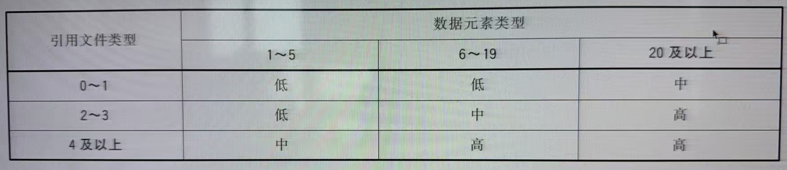

&emsp;&emsp;当引用逻辑文件的数量或外部输出的数据元素类型数量未知时，或者在执行估算分析时，外部输出的复杂度被评估为“中”。

## B.5 外部查询

（一）定义

&emsp;&emsp;外部查询是一种用户可识别的独特的输入/输出组合，应用程序发布一个规模明确的，不需要进一步数据处理的输出，作为输入的结果。

（二）准则

+ 一个独特的基本过程
+ 由用户进行定义
+ 分布的信息跨越了待计数应用程序的边界
+ 应包含一些选择标准作为输入
+ 输出规模大小是确定的
+ 输出中不应包含需进一步进行数据处理的结果
+ 不应维护内部逻辑文件

（三）外部查询的复杂度矩阵

&emsp;&emsp;下表用于确定外部查询的复杂度。

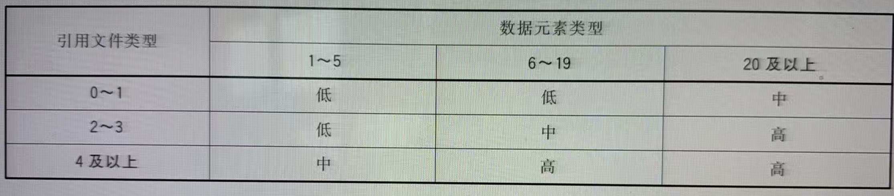

&emsp;&emsp;当引用的逻辑文件数量或外部查询的数据元素类型数量未知时，或者在执行估算分析时，外部查询的复杂度被评估为“中”。

## B.6 评估功能类型的功能点数量

&emsp;&emsp;下表用于确定功能类型的功能点数量。

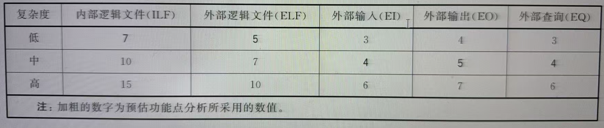

# 附录 C

**（资料性）**
**功能规模的增加**

## C.1 介绍

&emsp;&emsp;在系统构建阶段之前进行功能规模的测量具有较大的不确定性。  

&emsp;&emsp;本附录解释了从一个阶段到下一个阶段中功能规模增加的机制，以及如何追踪这个增加过程，以便使组织内部采用相同的方式进行重复性的软件开发时，可预测功能规模的增加。

## C.2 自主增长和范围变更

&emsp;&emsp;增长比例代表了由于细化需求(自主增长)以及由用户引入的新需求(范围变更)的规模的增加。 

&emsp;&emsp;通常很难区别出这两者之间的差异，自主增长是针对初期没有被充分调研分析的需求进行深入分析后展开更多细节和进一步明确规格说明，而范围变更则是产生新需求(并且是明确规格说明后深入分析也无法识别到的新需求)。  

&emsp;&emsp;一个自主增长的例子：  

&emsp;&emsp;“在变更客户时，界面展示下拉客户清单选择的选项。”  

&emsp;&emsp;一个范围变更的例子：  

&emsp;&emsp;“经过适当操作后，系统仍具备客户分组的选项。”

## C.3 应用程序

&emsp;&emsp;待开发的功能被首次确定时，是应用增长比例的第一个时机。应用增长比例是基于以下假设：随着需求细节逐渐明确、规格说明逐渐确定，或者在开发过程中增加了新的用户需求(范围变更)，功能点的数量会增加。  

&emsp;&emsp;软件组织可通过准确记录各个阶段新产生的功能规模信息，来监控组织内软件功能增长比例的趋势。有必要区分功能规模的增加是由自主增长还是由范围变更产生的。当然，只有对自主增长和范围变更进行清晰的定义后，软件组织才能评价出导致功能增长的原因。只有当这些内容被明确量化后，组织才能用相似的方法预测未来开发软件的功能规模。  

&emsp;&emsp;下表给出某开发型项目结束后，软件功能规模的变化趋势。

| 结束阶段                            | 功能规模   | 增加  | 预期功能规模 |
| ------------------------------- | ------ | --- | ------ |
| 分析                              | 100 fp | 40% | 140 fp |
| 概要设计                            | 100 fp | 20% | 120 fp |
| 详细设计                            | 100 fp | 30% | 130 fp |
| 注：这些值仅仅是示例，通过经验数据创建，本身不存在普遍实用性。 |        |     |        |

## C.4 解释

&emsp;&emsp;当分析阶段结束后，软件组织根据当前的需求说明识别出了 100 个功能点，可预期在构建阶段将会产生大约 140 个功能点。

&emsp;&emsp;通过类比，当概要设计阶段产生了 300 个功能点，软件组织可预期在构建阶段结束后，可能会产生 360 个功能点。

&emsp;&emsp;在上文描述中由用户需求（范围变更）导致的功能点变更也能够使用上述方法计算。实际增长的比例宜在组织内根据经验进行定义。注意，范围变更也可能由于组织原因很难预测。

# 附 录 D

**（资料性）**

**本文件应用案例**

## D.1 收集可用的文档

&emsp;&emsp;开发客户关系管理系统中“维护客户信息”功能描述如下。  

&emsp;&emsp;客户信息包括客户基本信息、客户联系方式信息。其中，客户基本信息包括客户姓名、客户身份证号、客户性别、出生日期、学历、职业、客户经理；客户联系方式信息包括固定电话信息、移动电话信息、电子邮件信息、通信地址信息；一个客户可以有多种联系方式，如多个移动电话、多个通信地址。  

&emsp;&emsp;其中客户姓名、客户身份证号码、出生日期、联系方式、备注为输入项，其他(包括客户性别、学历、职业、客户经理)为选择项，采用下拉列表方式。学历下拉列表及职业下拉列表中的字段依据国家相关标准确定；客户经理下拉列表中的数据为岗位所有员工，该数据(员工信息)由人事管理系统进行维护。  

&emsp;&emsp;针对客户信息的主要功能操作包括如下信息。  

+ 添加客户信息：将新的客户信息添加到系统中，其中客户基本信息除备注外均为必填项，联系方式信息应至少包含一种有效联系方式。添加过程中会验证身份证号是否重复，如果重复会提示。
+ 导入客户信息：按照特定的格式从表格文件导入客户信息
+ 修改客户信息：显示客户信息列表，对选中的客户显示并修改其基本信息。修改前需要验证系统管理员密码
+ 客户查询：输入客户姓名或联系电话，显示查询结果，如果多名客户符合查询条件，则全部显示
+ 客户统计：显示客户的数量及性别、年龄、学历、类型分布
+ 删除客户信息：显示客户信息列表，对选中的客户进行删除，删除成功后显示删除成功的确认信息

## D.2 确定应用程序的用户

&emsp;&emsp;本示例是一个客户关系管理系统，应用的用户是使用这套系统进行客户关系信息浏览和维护的人员。

## D.3 识别计数类型

&emsp;&emsp;本示例的主要目的是测量包含在“维护客户信息”功能开发项目中的软件规模，因此属于“增强型”项目功能点计数。系统边界为“客户关系管理系统”。

## D.4 识别数据功能

&emsp;&emsp;根据本文件中对数据功能的定义，从本示例的功能性用户需求书中，识别出以下逻辑数据，并按照数据功能分类为内部逻辑文件(ILF)和外部逻辑文件(ELF)。  

+ 内部逻辑文件 ILF：客户信息
+ 外部逻辑文件 ELF：员工信息

## D.5 预估功能点计数

&emsp;&emsp;根据公式(1)计算预估功能点数：

`FP = 1 × 35 + 1 × 15 + 50`

### D.6 识别事务功能

&emsp;&emsp;根据本文件中对事务功能的定义，从本示例的功能性用户需求书中，识别出以下基本过程，并按照事务功能分类为内部输入 (EI)、外部输出 (EO)、外部查询 (EQ)。

+ 内部输入 EI：
	+ 添加客户信息
	+ 导入客户信息
	+ 修改客户信息
	+ 删除客户信息
+ 外部输出 EO：  
	+ 客户统计
+ 外部查询 EQ： 
	+ 客户查询

## D.7 估算功能点计数

&emsp;&emsp;根据表 1 计算估算功能点数：

`FP = 1 × 7 + 1 × 5 + 4 × 4 + 1 × 5 + 1 × 4 = 37`

## D.8 详细功能点计数

+ 对于数据功能复杂度的计算由数据元素类型(DET)和记录元素类型(RET)确定
	+ 内部逻辑文件 ILF: 客户信息
		+ 数据元素类型(DET): 客户信息包括客户姓名、客户身份证号、客户性别、出生日期、学历、职业、客户经理; 固定电话信息、移动电话信息、电子邮件信息、通信地址信息。合计: 11DETs
		+ 记录元素类型(RET): 客户信息包括客户基本信息、客户联系方式信息。合计: 2RETs。
		+ 根据内部逻辑文件复杂度矩阵，内部逻辑文件“客户信息”的复杂度为“低”
	+ 外部逻辑文件 ELF: 员工信息
		+ 由于在此阶段，数据元素类型(DET)和记录元素类型(RET)的数量未知，所以外部逻辑文件“员工信息”的复杂度为“低”
+ 对于事务功能复杂度的计算由数据元素类型(DET)和文件引用类型(FTR)确定。外部输入、外部输出和外部查询
	+ 数据元素类型(DET): 客户信息包括客户姓名、客户身份证号、客户性别、出生日期、学历、职业、客户经理; 固定电话信息、移动电话信息、电子邮件信息、通信地址信息。合计: 11DETs
	+ 文件引用类型(FTR): 涉及客户信息和员工信息。合计: 2FTRs
	+ 根据外部输入复杂度矩阵，外部输入“添加客户信息”“导入客户信息”“修改客户信息”和“删除客户信息”的复杂度为“中”
	+ 根据外部输出复杂度矩阵，外部输出“客户统计”的复杂度为“中”
	+ 根据外部查询复杂度矩阵，外部查询“客户查询”的复杂度为“中”

&emsp;&emsp;根据功能复杂度，确定功能点分配表如表所示：

|内部逻辑文件|外部逻辑文件|外部输入|外部输出|外部查询|
|---|---|---|---|---|
|7|5|4|5|4|

&emsp;&emsp;根据表计算估算功能点数：

`FP = 1 × 7 + 1 × 5 + 4 × 4 + 1 × 5 + 1 × 4 = 37`